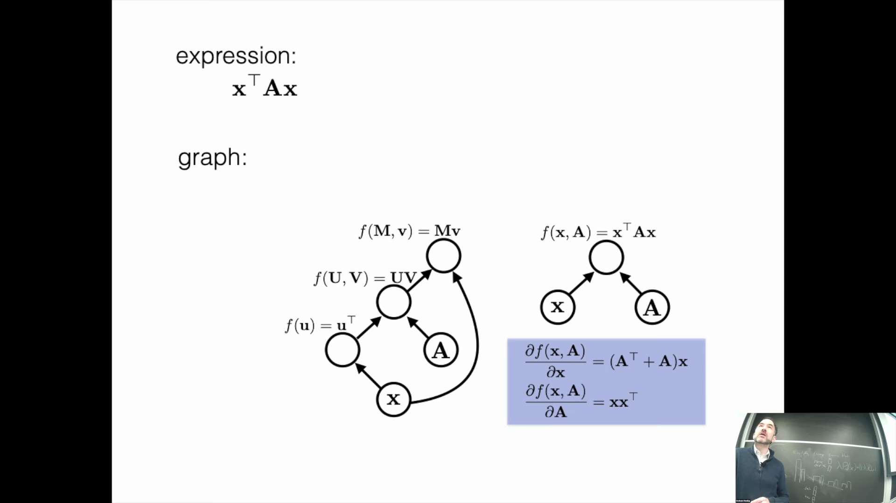
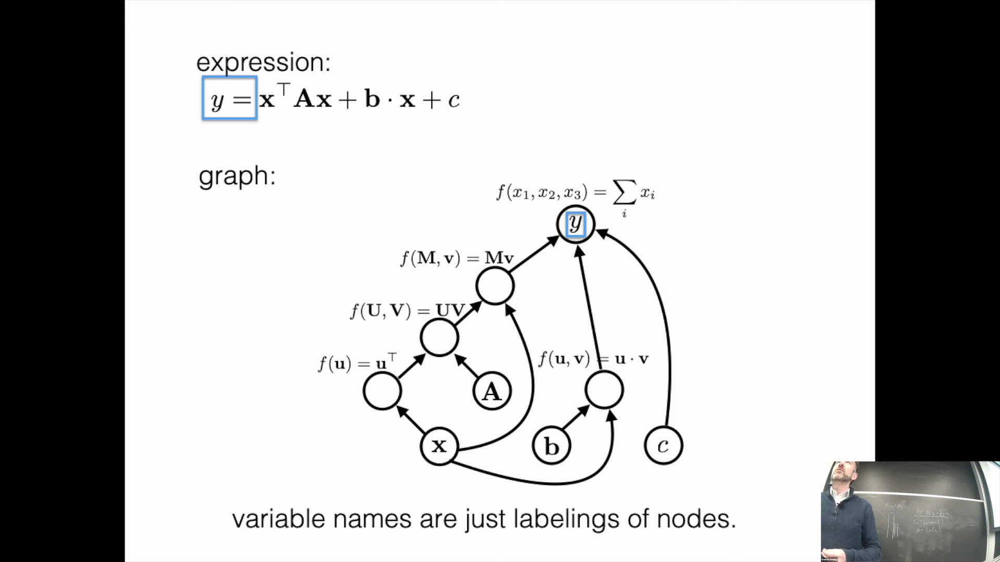
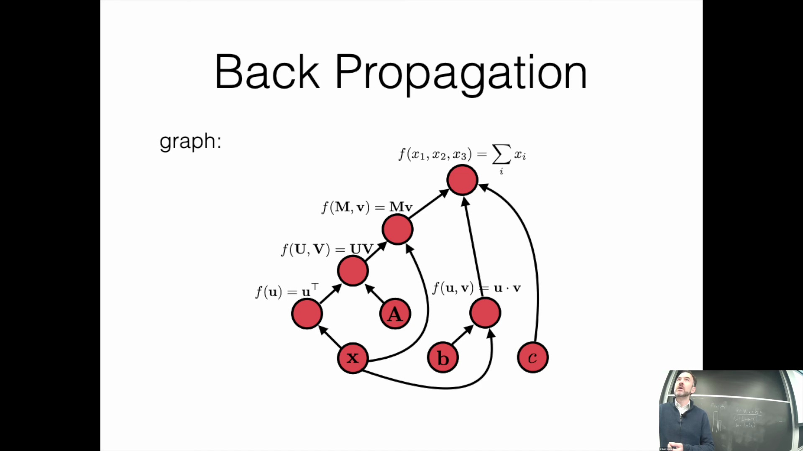
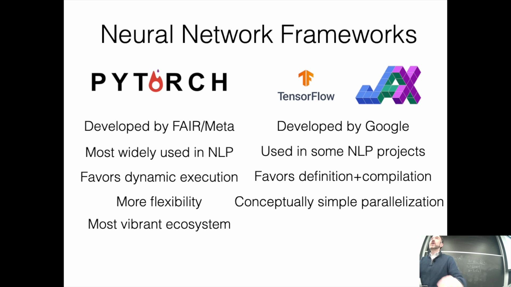
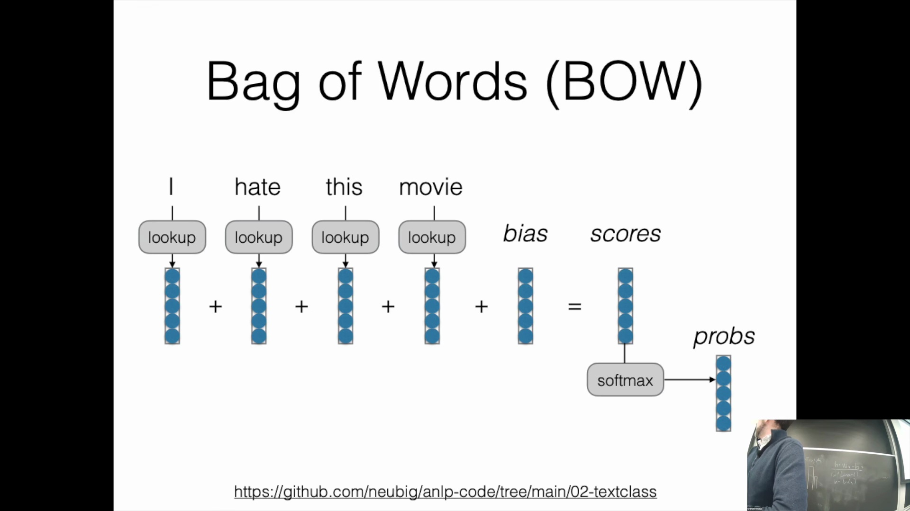

## 优化计算图表达式
在实现神经网络(Neural Network)时，必须认识到多种计算图(Computational Graph)结构能够表达完全相同的数学函数。例如，形如 $x^T A x$ 的表达式既可以构建为包含多个中间节点(Intermediate Node)的大型图，也可以构建为更为紧凑的图。这一选择直接影响实际实现效率：图结构过大会显著增加内存开销，且运行速度通常较慢。现代深度学习框架(Deep Learning Framework)提供了高度优化的算子(Operator)，能够将多个数学运算步骤融合至单个图节点中。充分利用这些内置操作对提升计算效率至关重要，尤其是在实现多头注意力(Multi-Head Attention)等复杂机制时。

## 隐藏的计算成本与变量标签
除基本表达式外，引入常数(Constant)可将这些图扩展为多项式结构。然而，在框架设计中，一个至关重要的概念是：变量名(Variable Name)仅仅是计算图中节点的标签。在代码中声明一个高层变量(High-level Variable)时，往往会触发一连串隐藏的底层操作(Low-level Operation)。这些底层步骤中的每一步均会消耗内存与计算时间。对于追求高效实现的开发者而言，深刻理解这种抽象机制(Abstract Mechanism)至关重要，否则极易引发不必要的资源浪费。

## 核心算法：前向传播与反向传播
神经网络的实现依赖于四大核心算法：计算图构建、前向传播(Forward Propagation)、反向传播(Backpropagation)以及参数更新(Parameter Update)。前向传播按照拓扑序(Topological Order)处理节点，一旦节点的所有输入依赖(Input Dependency)得到满足，便立即计算其数值，该过程甚至支持并行执行。随后，反向传播沿逆拓扑序(Reverse Topological Order)遍历计算图，以计算各节点相对于最终损失(Loss)的导数。最后，通过参数更新算法（如随机梯度下降(Stochastic Gradient Descent, SGD)）来调整模型权重。对于内存密集型(Memory-Intensive)的自然语言处理(NLP)模型而言，严格把控这些步骤至关重要；意外的计算冗余或生成庞大的中间张量(Intermediate Tensor)状态会迅速耗尽内存，导致训练中断。

## 框架对比：PyTorch 与 JAX
在当前的自然语言处理领域，PyTorch 与 JAX 是两大主流框架，均拥有雄厚的企业工程团队支持。PyTorch 依然是行业标准（尤其在学术研究领域），其采用动态图机制(Dynamic Graph Mechanism)，计算图会在运行时针对每个输入即时构建与执行，从而提供了极高的灵活性。相比之下，JAX 更倾向于静态计算图(Static Computational Graph)的定义与预编译，优先追求运行速度与极致优化。JAX 的应用程序接口(Application Programming Interface, API)高度契合 NumPy，并大幅简化了高级张量操作(Tensor Operation)，例如可轻松实现模型在多 GPU 上的并行拆分(Parallel Partitioning)以进行大规模训练。尽管目前两者已相互借鉴诸多特性，但 PyTorch 凭借其最为繁荣的生态系统(Ecosystem)，仍是业界首选的默认框架；而 JAX 则更契合追求极致性能与函数式编程范式(Functional Programming Paradigm)的开发者。

## 实际实现与代码结构
本课程提供了基于 PyTorch 的简化示例，涵盖词袋模型(Bag-of-Words, BoW)、连续词袋模型(Continuous Bag-of-Words, CBOW)以及深度 CBOW 模型(Deep CBOW Model)。这些代码以清晰易懂为首要目标，而非追求工业级(Industrial-Grade)性能。相关实现通常位于 `model.py` 文件中，其中的 `forward` 方法负责定义前向计算流程(Forward Computation Flow)。例如，基础模型会加载词嵌入(Word Embedding)，将其与偏置项(Bias Term)相加后输出预测得分。更复杂的模型变体则在嵌入查找(Embedding Lookup)与最终评分之间引入了线性层(Linear Layer)与非线性变换(Non-linear Transformation)。这些代码结构高度还原了课程讲解的理论架构，为实际开发提供了直观的起点。在后续的习题课(Recitation)中，我们将通过动手实践(Hands-on Practice)深入掌握这些模型及其特征处理技巧(Feature Processing Techniques)。

