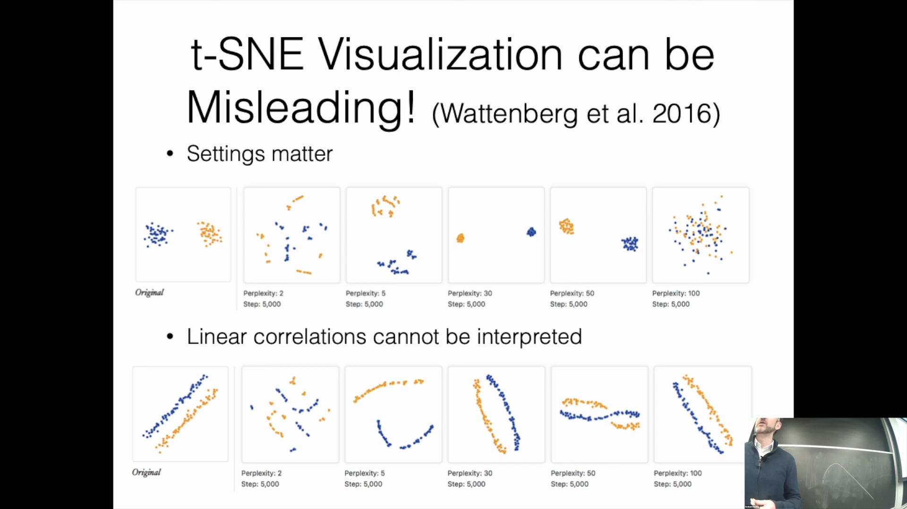

## t-SNE 在保留线性相关性方面的局限性
需注意的是，t-SNE(t-Distributed Stochastic Neighbor Embedding) 算法并不保证保留数据的全局线性相关性(Global Linear Correlation)。若原始高维空间(High-Dimensional Space)中存在清晰的线性关系或几何相关性(Geometric Correlation)，应用 t-SNE 可能会将其扭曲，这意味着这些直观的模式可能无法在最终的可视化(Visualization)结果中准确呈现。这凸显了谨慎解读 t-SNE 输出结果的重要性，因为该算法的优化目标优先侧重于保留局部邻域关系(Local Neighborhood Relationship)，而非维持精确的全局线性结构。

## 总结与下期内容预告
本讲内容至此结束。展望后续安排，下一节课将专门聚焦于**语言建模(Language Modeling)**。尽管序列模型(Sequence Model)将在课程后期进行深入探讨，但紧接的讲座将重点剖析语言模型如何预测与生成文本，该主题将直接依托于本次课程所讲授的词嵌入(Word Embedding)与优化算法(Optimization Algorithm)基础。感谢各位的参与，期待在下一次课程中与大家继续探讨。