## 独立语言模型(Large Language Models)的局限性
语言模型在文本生成(Text Generation)及诸多下游任务中展现出卓越的能力。然而，它们并非万能。在复杂的推理场景(Reasoning Scenarios)（尤其是数学计算(Mathematical Computation)）中，其显著的局限性便会暴露无遗。当被要求解决数学问题时，语言模型通常在推理效率与计算准确性上均表现欠佳。即便是采用思维链(Chain-of-Thought, CoT)这类将推理过程逐步拆解的结构化提示(Structured Prompting)技术，也常常难以得出正确的最终答案。

此外，当查询涉及获取实时或动态的现实世界信息时，语言模型存在固有的局限性。由于其内部知识在预训练完成后便已固化(Frozen)，模型无法可靠地回答关于当前时间或实时状况的问题。这类信息具有高度的时效性与动态变化特征，并未包含在静态的训练数据集(Static Training Datasets)中。

## 工具增强型语言模型(Tool-Augmented Language Models)的兴起
为了克服这些内在局限性，集成外部工具(External Tools)变得至关重要。通过调用专用计算器进行算术运算，或请求特定的应用程序编程接口(Application Programming Interface, API)（例如 `get_time`），模型能够提供准确且最新的结果。这一需求极大地激发了学术界对工具增强型语言模型的研究热情。以 Toolformer 为代表的开创性框架正式确立了这一范式(Paradigm)，通过为模型配备计算器、网络搜索引擎等核心实用工具，为该领域的后续发展奠定了坚实基础。

## 工具实现与研究格局的多样性
在该构想提出后，相关领域经历了快速扩张，但也呈现出明显的碎片化(Fragmentation)特征。不同研究采用了截然不同的工具集(Toolsets)与评估基准(Evaluation Benchmarks)。部分研究依赖独立运行的软件（如计算器、搜索引擎），部分则调用用于获取天气或时间数据的 Web API。另一研究方向集成了来自 Hugging Face 等平台的专用神经网络模型(Neural Network Models)，还有些研究采用了本地自定义的专家函数(Expert-defined Functions)。这种实现方式的广泛差异自然引出了一个核心问题：在语言模型的语境下，究竟如何界定“工具”？

## 工具的定义：外部性(Externality)与功能性(Functionality)属性
为厘清这一概念，一项系统性综述(Systematic Review)从三个维度展开探讨：工具的定义与功能、现有工具类型及其集成方法，以及评估框架(Evaluation Frameworks)。从根本上讲，工具是语言模型可调用的、用于执行特定任务的程序。一个程序若要被视为工具，必须满足两项核心属性：*外部性（External）*与*功能性（Functional）*。借鉴认知科学(Cognitive Science)领域的文献，工具必须独立于使用它的智能体(Agent)——在此语境下，即独立于语言模型的内部参数之外。此外，工具必须具备功能性，即能够对环境对象(Environmental Objects)施加作用，从而改变其状态或产生特定输出。例如，画笔（工具）作用于空白画布（环境对象）即可生成一幅画作。

形式化定义(Formal Definition)中，工具被视为独立于语言模型之外的函数接口(Function Interface)或计算机程序。模型通过生成相应的函数调用(Function Call)及输入参数(Input Arguments)与之交互，进而触发外部程序的执行。

## 工具的主要功能
根据工具与环境(Environment)的交互模式，可将其主要功能划分为三大类：
1. **感知工具（Perception Tools）：** 旨在从环境中采集数据，且不改变环境状态。例如用于检索相关文档的网络搜索引擎，或用于获取实时天气数据的 API。
2. **动作工具（Action Tools）：** 用于对环境施加影响并直接改变其状态。沿用上述类比，画笔通过涂抹颜料主动改变了画布的物理状态。
3. **计算工具（Computation Tools）：** 负责处理超越基础算术的复杂计算任务，涵盖数据预处理(Data Processing)、符号推理或机器翻译(Machine Translation)等。

## 功能的重叠与工具-智能体关系
上述功能类别并非完全互斥(Mutually Exclusive)，单一工具往往兼具多重角色。例如，网络搜索引擎既可充当感知工具（负责采集原始文档），亦可作为计算工具（在后台计算相关性得分、执行结果排序及查询语义处理）。

探讨工具与智能体(Agent)的关系时，需明确：语言模型虽能调用工具，但其本身并不必然构成智能体。然而，工具是赋能智能体实现复杂任务的关键要素。在经典定义中，智能体通常指能够通过传感器(Sensors)感知环境，并借助执行器(Actuators)对环境采取行动的自主实体。在此架构下，感知工具直接为智能体提供环境数据采集能力，构成了从单一语言模型迈向完全自主、交互式智能体(Interactive Agents)的关键桥梁。

---

## 工具与智能体的关系
讨论阐明了工具增强型模型(Tool-Augmented Models)与自主智能体(Autonomous Agent)之间的界限。虽然语言模型可以利用感知工具收集环境信息，并利用动作工具修改环境状态，但仅依赖计算工具的系统在标准定义下通常不被视为完整的智能体。当前的工具使用能力(Tool Usage Capabilities)仍处于相对初级阶段。现有大多数数据集仅支持有限的多轮交互(Multi-turn Interactions)，且每项任务通常仅调用单一工具，缺乏支持复杂工具链式调用(Tool Chaining)的稳健机制。然而，研发能够智能决策何时调用以及如何对多个工具进行编排(Tool Orchestration)的模型，代表了一个极具潜力的研究方向。

## 基础工具使用范式
工具使用的基本工作流程依赖于文本生成与外部执行之间的动态控制权交接(Dynamic Control Handoff)。初始阶段，语言模型以标准文本生成模式处理用户查询。当模型识别到需要外部协助时，会生成特定的函数调用(Function Call)指令（例如 `call_get_weather`）。指令生成后，系统将控制权移交至外部执行服务器(External Execution Server)，由该服务器运行指定工具并返回结果（例如“晴天”）。随后，模型无缝接收该输出，切换回文本生成模式，并结合工具返回的响应构建最终答案反馈给用户。

## 如何教会模型使用工具
目前赋予模型工具使用能力的方法主要分为两类。第一类是**推理时引导(Inference-time Conditioning)**，该方法无需更新模型参数。它通过在提示(Prompting)阶段注入自然语言系统指令、提供展示工具使用范例的上下文学习(In-context Learning)示例，以及附加详细的API文档来引导模型行为。第二类是**基于训练的学习(Training-based Learning)**，即在包含自然语言查询及其对应工具调用轨迹(Tool Execution Trajectories)的精选数据集上对模型进行微调(Fine-tuning)。这两种方法均旨在使模型具备准确识别工具需求、规范生成调用指令以及有效解析工具输出的能力。

## 工具的核心应用场景
工具集成解决了独立语言模型的若干核心局限性，主要可归纳为五个实际应用场景：
1. **知识获取(Knowledge Retrieval)：** 通过连接结构化知识图谱（配合查询执行器）、网络搜索引擎或检索增强生成(Retrieval-Augmented Generation, RAG)架构，突破静态训练数据的局限。
2. **计算增强(Computational Augmentation)：** 将复杂计算任务卸载(Offloading)至计算器、代码解释器或电子表格等外部生产力软件，显著提升模型的数学与逻辑推理能力。
3. **环境交互(Environmental Interaction)：** 实现实时环境感知与操作，例如获取实时天气/地理位置数据、管理日历日程或处理电子邮件。
4. **多模态处理(Multimodal Processing)：** 通过集成图像生成、音频流媒体（如 Spotify）或视觉问答(Visual Question Answering, VQA)等 API，弥补大语言模型仅支持文本模态的短板，使其能够处理并交互多种数据格式。
5. **神经模型工具化(Neural Models as Tools)：** 将垂直领域的专用模型（如特定问答或机器翻译模型）封装为可调用的实用程序。值得注意的是，单一工具往往可同时服务于多个功能类别，这在一定程度上模糊了严格的分类界限。

## 超越预设计工具
当前领域面临的一项显著瓶颈是，大多数工具在部署前均需依赖人类专家进行手动设计与开发。尽管该方法在处理已知任务时行之有效，但当模型遭遇缺乏现成工具支持的未知问题(Novel Problems)时，往往显得力不从心。这引出了一个关键研究问题：能否在无需专家干预的前提下实现工具的自动生成？相关研究已给出肯定答案。传统上，解决代码生成任务(Code Generation)通常依赖于提示(Prompting)模型输出单一且冗长的完整脚本，此类脚本极易因细微的语法错误而导致编译失败或运行时异常。一种更为稳健的替代方案是引导模型生成模块化的“工具程序(Toolbots)”或可复用的工具函数（例如 `calculate_rate_of_change`）。这种从单体式代码生成(Monolithic Code Generation)向模块化组件构建的范式转变，有望在解决复杂问题时显著提升系统可靠性、简化调试流程，并增强模型的环境适应能力。

---

## 面向复杂任务的工具自动生成
传统的代码生成(Code Generation)方法通常通过提示(Prompting)让模型输出冗长且一体化的脚本(Monolithic Scripts)，这类脚本极易出现语法错误且难以调试。一种更为稳健的替代方案是生成可复用的模块化工具或“工具程序(Toolbots)”（例如 `calculate_rate_of_change` 函数）。这一范式转变将复杂的程序生成任务简化为仅为函数调用确定正确的参数，从而显著降低了执行错误率，并使得生成的解决方案更易于进行人工验证(Human Verification)。

## 工具创建流程：创建、导入与跳过
该流程在推理阶段(Inference Phase)运行，无需对模型进行微调(Fine-tuning)。它采用一种动态的“工具箱(Toolbox)”机制，由三种核心模式控制。在**创建模式(Create Mode)**下，当遇到需要未见功能(Unseen Functionalities)的问题时，模型会生成一个新的可复用工具及其对应的解决方案。系统通过自一致性采样(Self-Consistency Sampling)筛选出最佳输出，并将其添加工具箱。在**导入模式(Import Mode)**下，若工具箱中已存在适配的函数，模型将直接被引导导入并复用该函数，而非重新生成。最后是**跳过模式(Skip Mode)**，当模型判定当前任务无需外部工具辅助时，可完全跳过工具调用环节。

## 实验结果与人工验证优势
实验结果表明，这种工具增强型方法(Tool-Augmented Approach)在保持工具箱精简的同时，其准确率显著优于标准基线(Standard Baselines)。其核心优势在于，生成的解决方案更为简洁，所需的计算开销(Computational Overhead)也更低。一项人工验证研究进一步印证了该优势：参与者不仅能更准确地验证基于工具的解决方案的正确性，且验证速度提升了30%至40%。这充分证明，大语言模型(Large Language Models, LLMs)能够在不依赖人工定制工具(Manually Crafted Utilities)的前提下，自主创建、管理模块化工具，并从中持续获益。

## 工具使用基准测试的现状
当前工具增强型模型的评估框架(Evaluation Frameworks)主要分为两类。第一类是复用现有的推理(Reasoning)与多模态(Multimodal)基准测试（例如数学推理数据集、处理结构化数据的 WikiTableQuestions 数据集以及视觉问答(Visual Question Answering, VQA)任务），将程序执行(Program Execution)作为一种替代求解路径集成至其中。第二类是专门构建的 API 基准测试，通常通过爬取公共 API 目录（如 RapidAPI）、解析相关文档，并利用大语言模型合成生成(Synthetically Generate)包含 API 调用的问答对(Question-Answer Pairs)来构建。

## 合成 API 数据集的局限性
尽管此类数据集目前应用广泛，但现有的 API 基准测试仍存在显著缺陷。**自然性问题(Naturalness Issue)**源于测试样本多为合成生成；随机组合的 API 往往缺乏实际逻辑，由此构建的提示(Prompts)难以反映真实的用户应用场景。**可执行性问题(Executability Issue)**同样棘手。尽管工具在定义上属于可执行程序，但超过半数的现有数据集在评估阶段并未真正执行这些工具。这主要归因于托管海量 API 的高昂成本、实时端点(Real-time Endpoints)的不稳定性（例如返回动态数据的天气或时间 API），以及为动态输出维护静态参考答案(Static Reference Answers)的固有困难。因此，现有评估通常仅停留在检查工具选择(Tool Selection)的正确性或调用语法的匹配度，而未能验证其实际的功能执行(Functional Execution)。

## 评估指标与缺失维度
当前的评估指标(Evaluation Metrics)主要关注任务完成率(Task Completion Rate，即对比模型输出与参考答案)、工具选择准确率(Tool Selection Accuracy，主要应用于不可执行基准测试)，以及工具可复用性(Tool Reusability)，旨在鼓励模型生成更具泛化能力(Generalization Capability)的函数。然而，仍有若干关键维度尚未得到充分探索。未来的重要研究方向应涵盖对生成工具内在属性(Intrinsic Properties)的评估，以及最为关键的——计算效率(Computational Efficiency)评估。尽管引入工具无疑能提升任务准确率，但一个全面的评估框架必须在性能增益与工具调用及执行所引入的实际计算开销(Computational Cost)和延迟(Latency)之间进行综合权衡。

---

## 计算成本与效率
尽管工具(Tools)显著提升了语言模型(Language Models)的性能，但要评估其真实价值，必须深入分析相关的计算开销(Computational Overhead)。准确衡量完成任务所产生的额外成本至关重要，例如提示词(Prompts)中增加的额外 Token 数量或模型所需的额外训练步骤(Training Steps)。除基础准确率(Accuracy)外，还必须通过响应延迟(Response Latency)和计算效率(Computational Efficiency)等关键指标来综合评估工具的运行质量。若某工具虽能提供高准确率，却消耗过多的 GPU 资源(GPU Resources)或引入不可接受的延迟（例如为获取简单响应而等待数分钟），则其在实际生产环境部署(Production Deployment)中将缺乏实用性。

## 可靠性、可复现性与安全使用
管理工具的不确定性(Uncertainty)与可靠性(Reliability)仍是一项重大挑战，尤其是对于由概率性神经模型(Probabilistic Neural Models)驱动的工具而言。例如，视觉问答(Visual Question Answering, VQA)工具可能在部分样本上输出正确答案，而在其他样本上却表现失效。未来研究需深入探讨用户如何认知此类结果波动(Result Variability)，并制定相应的容错与管理策略。此外，针对动态工具(Dynamic Tools)（如实时天气或时间 API）的基准测试(Benchmarks)面临严峻的可复现性(Reproducibility)挑战，因为静态参考答案(Static Reference Answers)会随时间迅速过时。一种更为稳健的评估方法是引入标准执行轨迹(Standard Execution Trajectories)作为对照，通过并行执行模型生成的工具调用(Tool Calls)，验证其逻辑流程与执行路径的一致性，而非单纯依赖固定的输出结果。同时，工具的安全使用(Safe Usage)与可信度(Trustworthiness)仍是当前亟待填补的研究空白；诸多工具高度依赖托管于第三方未知服务器上的外部 API，这在用户个人数据传输过程中引发了严重的隐私担忧(Privacy Concerns)。

## 工具使用的实证权衡
实证分析(Empirical Analysis)凸显出，在不同任务类型与实现方法中，性能增益与计算成本之间存在显著的权衡关系(Trade-off)。当引入工具增强(Tool Augmentation)时，数学推理任务(Mathematical Reasoning Tasks)往往展现出巨大的准确率提升，这使得相应的计算开销显得极具性价比。相反，多语言任务(Multilingual Tasks)通常伴随高昂的计算成本，却未能带来成比例的性能改善。在相同数据集(Datasets)上横向对比不同的工具使用方法时，效率差异尤为显著：部分方案在计算量大幅增加的同时仅换取了微弱的准确率提升，而另一些方案则以极少的计算步骤实现了同等水平的性能优化。这些发现进一步强调了构建全面评估框架(Comprehensive Evaluation Framework)的必要性，该框架必须在准确率、响应速度(Response Speed)与资源消耗(Resource Consumption)之间寻求最佳平衡。

## 语言模型智能体的定义
从独立工具(Independent Tools)向自主系统(Autonomous Systems)演进的过程中，“语言模型即智能体(Language Models as Agents)”这一范式(Paradigm)应运而生。从本质上讲，智能体(Agent)是指能够通过传感器(Sensors)感知环境、借助执行器(Actuators)对环境施加动作，并基于内在能力(Intrinsic Capabilities)、先验知识(Prior Knowledge)与目标偏好(Objective Preferences)自主运行的实体。大语言模型(Large Language Models, LLMs)天然契合此架构：外部工具充当其与物理/数字世界交互的传感器与执行器，而其海量训练语料库(Training Corpora)及多轮对话历史(Dialogue History)则构成了内部记忆(Internal Memory)与领域知识(Domain Knowledge)的基础。本节将概述一份全面的智能体发展路线图(Roadmap)，内容涵盖典型应用场景、免训练实现方法(Training-free Implementation)、评估基准(Evaluation Benchmarks)以及高级微调技术(Advanced Fine-tuning Techniques)。

## 向自然语言界面的转变
开发大语言模型智能体(LLM Agents)的核心驱动力在于突破传统的图形用户界面(Graphical User Interface, GUI)与手动编码工作流(Manual Coding Workflows)的局限。其核心愿景是仅通过自然对话交互(Natural Conversational Interaction)即可高效完成复杂的数字任务，这一模式高度模拟了人类向专业人士委派工作(Delegating Tasks)的协作方式。自然语言界面(Natural Language Interfaces)不仅大幅缩短了人机交互时间，且具备极高的直观性，有效消除了陡峭的编程学习曲线(Programming Learning Curve)，从而使得非技术用户(Non-technical Users)也能无障碍地访问与使用各类计算服务。

## 当前应用与机器人环境
类智能体能力(Agent-like Capabilities)已在面向消费者与开发者的各类工具中初露锋芒。当执行设置闹钟或管理日程等语音指令(Voice Commands)时，Siri、Google Assistant 及 Alexa 等语音助手(Voice Assistants)实质上扮演了基础智能体的角色。在软件工程领域，GitHub Copilot 等 AI 编程助手(AI Coding Assistants)允许开发者仅使用简单的自然语言描述意图，即可自动生成高质量的功能性代码(Functional Code)。此外，配备丰富插件(Plugins)生态的对话式 AI 平台(Conversational AI Platforms)进一步拓展了这一应用范式，使用户能够通过自然语言对话轻松完成航班预订、订单管理或与第三方服务(Third-party Services)的深度交互。

除基于屏幕的交互(Screen-based Interactions)外，智能体在机器人技术(Robotics)与具身仿真(Embodied Simulation)领域同样取得了显著进展。在自然语言导航任务(Natural Language Navigation Tasks)中，智能体需实时处理街景视觉数据流(Visual Data Streams)，并严格遵循语音指令在物理空间中穿行。以 ALFRED 为代表的数据集(Datasets)构建了高度逼真的模拟家庭环境(Simulated Home Environments)，智能体在其中接收基于周围环境生成的文本观测信息(Textual Observations)（如识别床铺、抽屉或书桌），并必须据此执行复杂的多步指令(Multi-step Instructions)。此类基准测试对于训练具备上下文理解(Context Understanding)与行动规划(Action Planning)能力、且仅凭人类自然语言即可与物理或数字世界进行无缝交互的智能体而言，具有不可替代的价值。

---

## 具身任务中的观测-行动循环(Observation-Action Loop)
语言模型智能体(Language Model Agents)的基础范式围绕环境感知与交互的持续循环展开。在具身仿真任务(Embodied Simulation Tasks)中，智能体会接收描述当前周围环境的文本或视觉观测信息(Observations)（例如识别家具或空间布局）。基于这些输入，智能体预测并执行特定动作(Actions)以推进任务目标。该动作使智能体状态发生转移，进而触发新一轮的观测，从而形成持续迭代的决策过程(Decision-making Process)，这是在复杂环境中实现有效导航的必备机制。

## 智能体在游戏与仿真中的应用
该交互框架已成功应用于各类游戏与虚拟仿真基准测试(Virtual Simulation Benchmarks)中。以 MineDojo 平台为例，它旨在训练智能体理解自然语言指令(Natural Language Instructions)，并在《我的世界》(Minecraft) 环境中自主执行复杂的建造或生存任务。类似地，DeepMind 的研究展示了基于文本的提示(Text-based Prompts)如何直接驱动游戏机制(Game Mechanics)，例如指挥智能体瞄准并射击特定小行星。此类仿真环境为评估智能体将抽象语言指令转化为精确、有序的游戏内操作(In-game Operations)的能力，提供了高度可靠的测试平台。
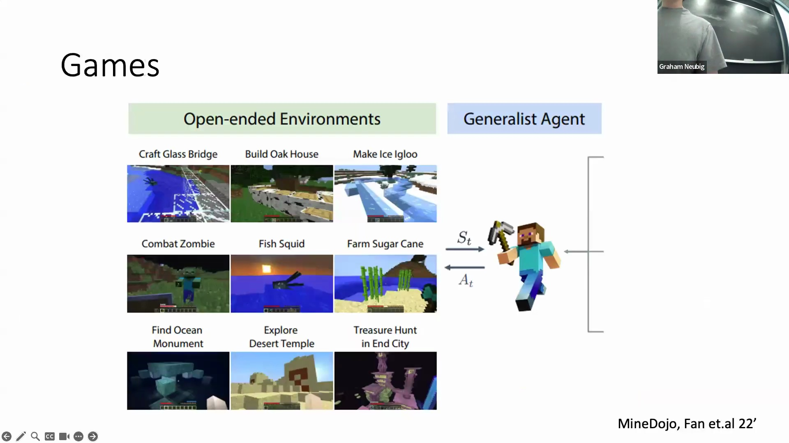
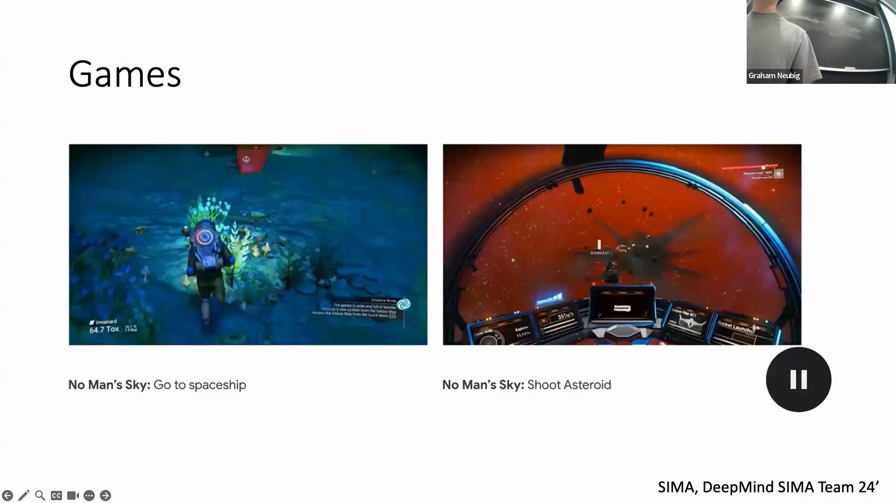

## 软件开发与 UI 自动化中的 AI 智能体
突破虚拟世界的界限，自主智能体(Autonomous Agents)正逐步重塑软件工程与桌面交互模式。以 Devin 为代表的 AI 工具通过与代码编辑器(Code Editors)、命令行终端(Command-line Terminals)及网页浏览器深度集成，扮演着“虚拟软件工程师(Virtual Software Engineer)”的角色。当接收到高层级(High-level)的自然语言提示时，这些智能体能够自主拆解需求、执行终端命令、检索在线技术文档，并直接生成可执行代码。该应用范式同样延伸至通用图形用户界面(Graphical User Interface, GUI)自动化领域，智能体仅凭自然语言对话指令即可实现网页浏览、桌面应用程序操控以及多媒体任务管理。
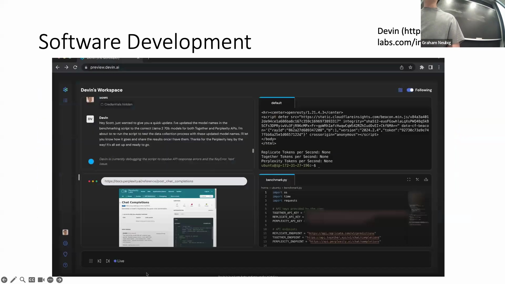
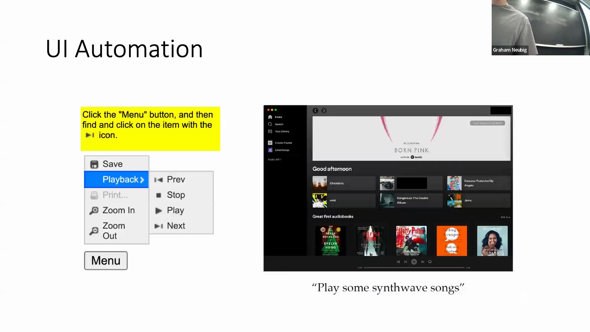

## 智能体感知的多模态输入
为在高度多样化的环境中高效运行，智能体必须具备处理多模态输入(Multimodal Inputs)的能力。文本观测信息用于提供环境状态的上下文概述，而截图或实时游戏画面等视觉输入(Visual Inputs)则赋予智能体直接的空间感知(Spatial Perception)能力。音频输入(Audio Inputs)对于捕捉屏幕外事件或不可见的环境线索同样至关重要。此外，结构化数据输入(Structured Data Inputs)（如 HTML 文档对象模型(Document Object Model, DOM)树或应用程序界面布局代码)能够实现对网页及桌面界面的精准导航(Precise Navigation)。这种多模态处理需求凸显了先进多模态大语言模型(Multimodal Large Language Models, MLLMs)作为现代智能体底层架构的核心价值。
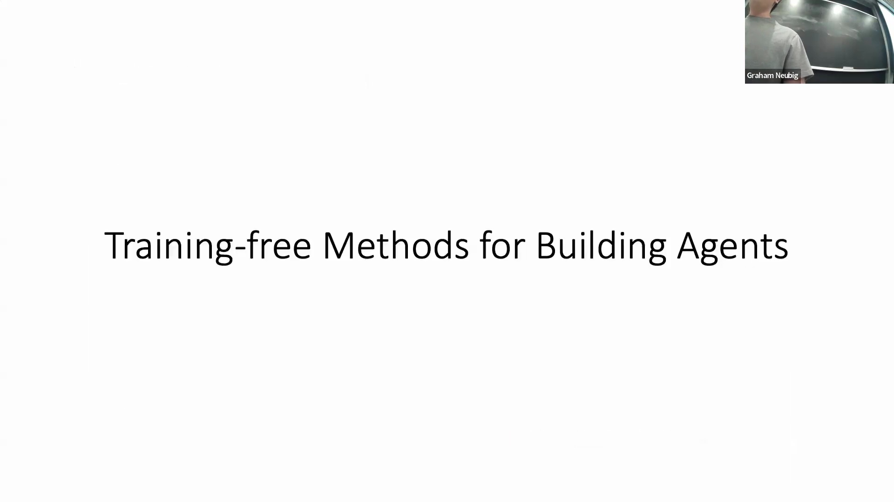
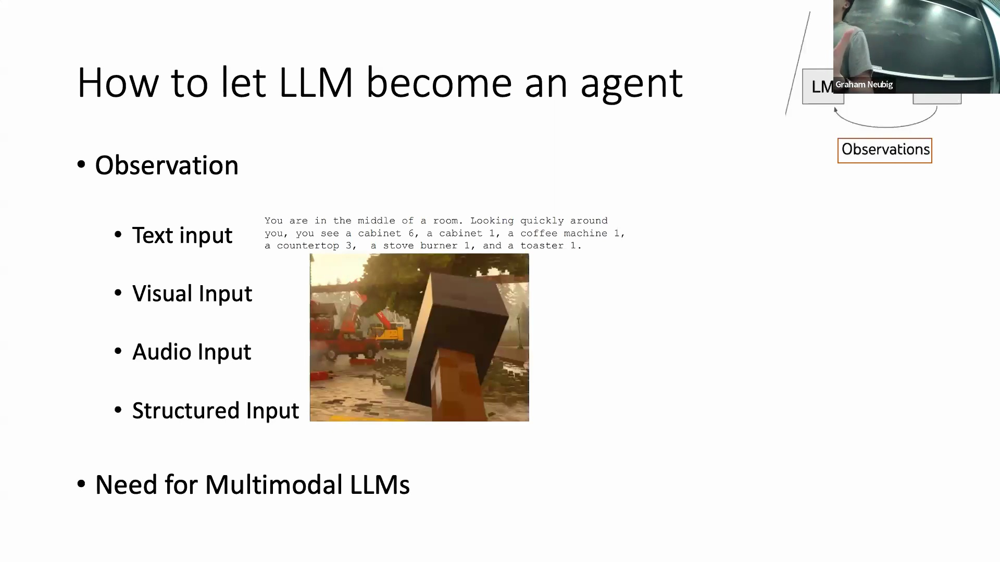
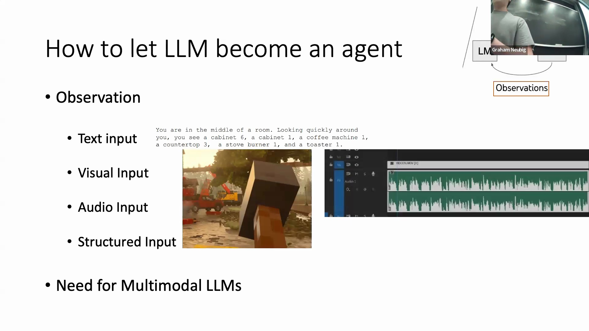
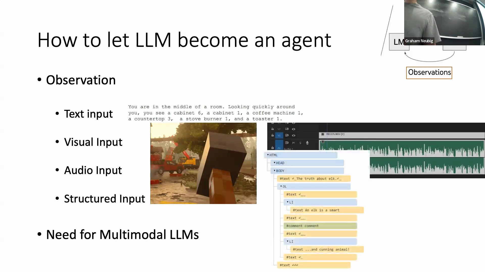

## 推理、行动与 ReAct 框架
将静态语言模型转化为动态智能体，关键在于实现高层规划(High-level Planning)与底层执行(Low-level Execution)的有效衔接。借助思维链(Chain-of-Thought, CoT)提示等技术，模型能够将复杂任务拆解为一系列逻辑严密的子步骤。例如，针对“将胡椒罐放置在抽屉上”的指令，模型会首先推理出在执行放置动作前必须先定位胡椒罐的具体位置。然而，脱离环境交互的纯文本推理往往存在局限。**ReAct 框架(Reasoning and Acting Framework)** 通过将推理(Reasoning)与行动(Acting)交替循环来解决这一问题：模型首先生成推理轨迹(Reasoning Traces)，随后输出具体的动作调用(Action Calls)（例如 `go to cabinet one`）；在执行动作并观察环境状态更新后（例如发现柜中是面包而非胡椒罐），模型会持续迭代此“推理-行动-观察”循环，直至最终达成任务目标。

## 通过免训练提示实现可执行动作
生成准确且可执行的工具调用(Tool Calls)并非必须依赖模型微调(Model Fine-tuning)，完全可以通过精心设计的上下文提示(Contextual Prompting)来实现。通过向模型提供标准的 API 库(API Libraries)（如天气、地理位置或交通数据接口）以及类似“今天适合去徒步吗？”的自然语言查询(Natural Language Queries)，模型能够自主推理并识别所需填补的信息缺口。它会精准判断对位置与天气上下文的需求，生成规范的 API 调用指令，解析返回的响应数据（例如“西雅图多云”），并最终综合输出具备上下文感知能力(Context-awareness)的行动建议。这一过程充分证明，在提供精确的接口文档与演示示例的前提下，语言模型能够无缝地将用户意图转化为经逻辑验证、可直接执行的程序化操作(Programmatic Operations)。
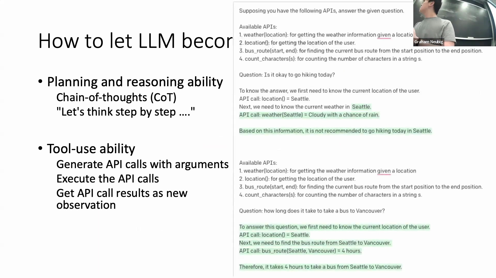

---

## 管理大型 API 集合与上下文约束
在促使语言模型生成可执行动作时，结合少样本示例(Few-Shot Examples)与详尽 API 文档的提示工程(Prompt Engineering)是一项基础方法。然而，当面对数以千计的潜在 API 时，系统会面临显著的扩展性(Scalability)挑战。将所有函数定义直接嵌入提示词中极易突破上下文窗口限制(Context Window Limits)，并大幅增加 Token 成本(Token Costs)。为应对这一难题，研究人员主张引入外部记忆系统(External Memory Systems)。通过基于当前任务上下文动态检索数据库，系统能够精准获取并注入最相关的 API 定义，从而在控制提示词长度的同时显著提升计算效率。
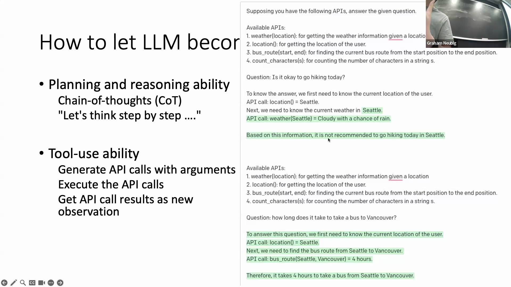
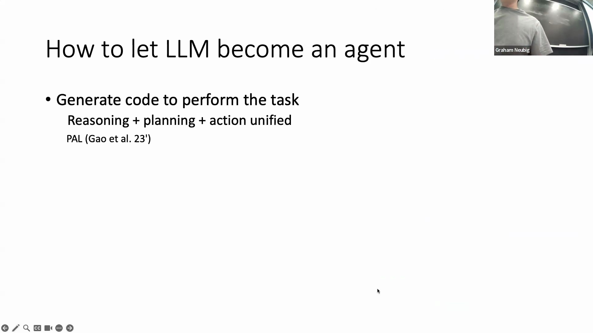

## 直接代码生成与自然语言轨迹
相较于生成自然语言推理轨迹(Natural Language Reasoning Traces)，一种更为稳健的范式是直接提示(Prompting)模型编写可执行代码(Executable Code)（例如 Python 脚本）。该方法将推理(Reasoning)、规划(Planning)与动作执行(Action Execution)无缝整合至统一的流程中。它不再要求模型手动将抽象思维转化为离散的 API 调用，而是生成一个高度内聚的程序，直接调用预置库并在内部处理复杂逻辑。现代 AI 平台通常内置代码解释器(Code Interpreter)以安全运行此类脚本，借助标准编程结构，其控制流(Control Flow)的管理远比单纯依赖提示推理更为可靠。

## 评估语言模型智能体的挑战
从模型构建转向评估阶段，我们发现评估语言模型智能体(Language Model Agents)依然极具挑战。许多现有基准测试(Benchmarks)依赖于过度简化的环境与初级任务，致使模型性能迅速达到饱和(Performance Saturation)。对于诸如查询天气或调用标准 API 安排会议等直白请求，当代模型已能以近乎完美的准确率(Accuracy)轻松应对。当基准测试仅聚焦于此类基础能力时，追求 100% 的准确率对学术研究而言已呈现边际收益递减(Diminishing Marginal Returns)，这不仅难以有效区分模型间的性能差异，更无法推动高级智能体(Agent)研发的实质性突破。

## 无状态基准数据集的局限性
以 Mind2Web 为代表的主流评估框架普遍采用无状态(Stateless)且非交互(Non-interactive)的环境设定。此类基准测试通常通过将智能体预测的动作序列与固定的真实参考序列(Ground-truth Sequences)进行严格比对来评估性能，强制要求动作与参数必须完全一致。针对复杂的现实任务，该评估方法存在根本性缺陷。在实际应用中，许多任务目标完全可通过并行步骤或多条替代路径达成。若对偏离单一预设路径的操作施以严苛惩罚，评估系统将不可避免地忽略那些仅执行顺序不同但功能正确(Functionally Correct)的有效解法，从而严重低估智能体的真实泛化与执行能力。
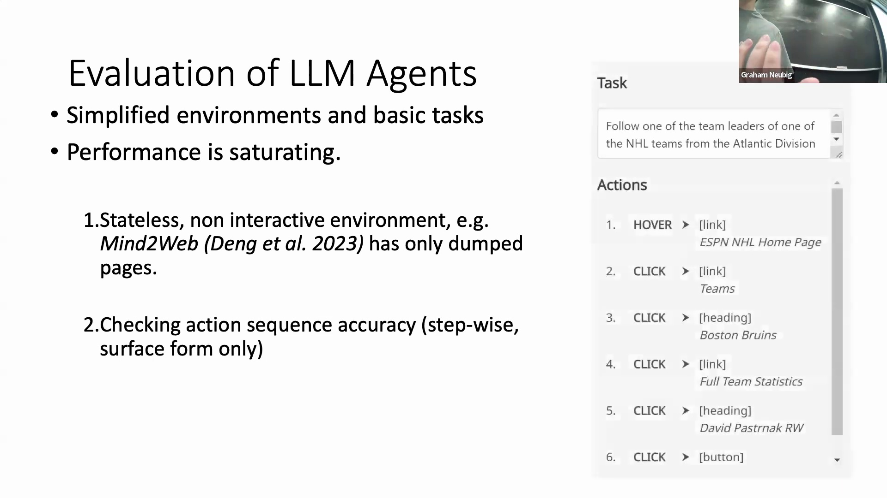

## 短周期交互环境与性能饱和
为突破无状态环境的局限，部分基准测试引入了交互式网页环境(Interactive Web Environments)，但这些评估往往仍局限于短周期任务(Short-Horizon Tasks)。以 WebShop 为例，该平台模拟了一个简化版的电子商务网站，要求智能体完成特定的商品检索与购买流程。尽管任务涵盖页面导航、关键词搜索与条件筛选，但通常仅需寥寥数步即可完成。因此，即便是未经专门提示或微调(Fine-tuning)的通用大模型，也能在此类环境中取得近乎完美的任务成功率。这种迅速的性能饱和(Performance Saturation)表明，低复杂度、短周期的测试环境已无法作为有效的压力测试，难以客观衡量具备高级规划与长程交互能力(Long-Horizon Interaction Capabilities)的复杂智能体。
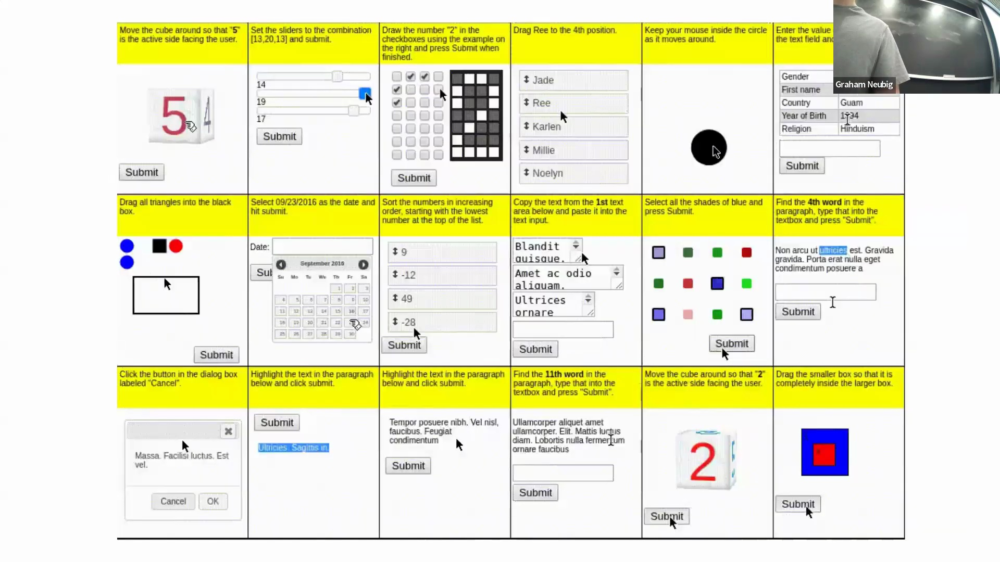

## 下一代智能体基准测试的要求
构建稳健的评估框架(Evaluation Frameworks)亟需转向更为严苛且贴近真实应用场景的标准。未来的基准测试必须构建完全交互的环境(Fully Interactive Environments)，重点考核实际的执行结果与最终任务达成率，而非仅仅校验中间步骤的动作标签。此外，测试场景需涵盖跨领域的高度多样化功能，严防模型在在线购物等狭窄、重复性任务上产生过拟合(Overfitting)。尤为关键的是，新一代基准测试必须引入长周期任务(Long-Horizon Tasks)与动态约束条件(Dynamic Constraints)，从而迫使智能体在冗长的交互序列中充分展现其持续规划、错误恢复(Error Recovery)以及复杂问题求解的综合性能力。

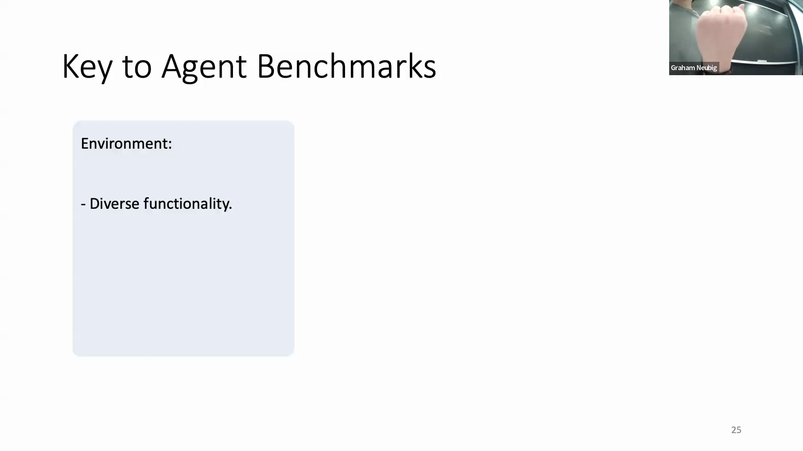

---

## 设计稳健的智能体基准测试(Robust Agent Benchmarks)
为准确衡量语言模型智能体(Language Model Agents)的真实能力，评估框架(Evaluation Frameworks)必须构建高度仿真且贴近现实的应用场景，精确还原现代网站(Web Structure)的架构，以确保模型在基准测试中的表现能够有效泛化(Generalize)至实际应用。至关重要的是，测试环境必须是可交互的(Interactive)、易于扩展的(Scalable)，且具备严格的可复现性(Reproducibility)。应尽量避免依赖实时网站(Live Websites)，因其持续且不可控的更新会导致评估指标剧烈波动，进而破坏实验结果的一致性，使得跨时间周期的对比分析难以进行。
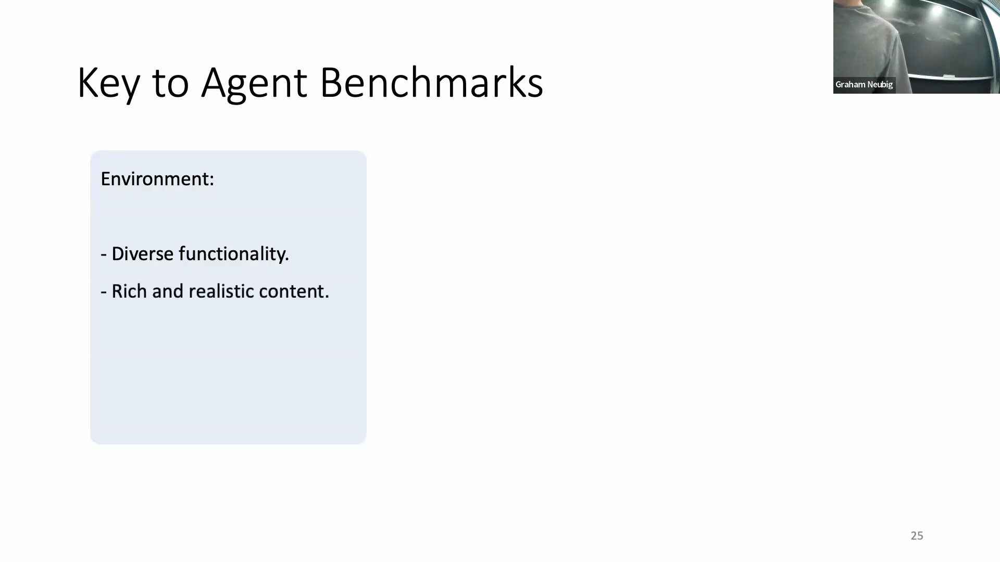
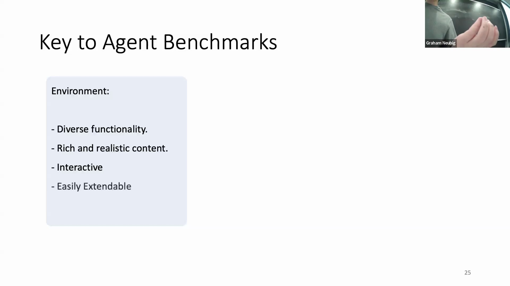

## 任务复杂度与评估范式(Task Complexity & Evaluation Paradigms)
有效的基准测试必须包含具备相当挑战性的长周期任务(Long-Horizon Tasks)，理想情况下应跨越多个独立网站，以高度还原真实的跨平台用户工作流(Cross-platform User Workflows)（例如先在电商平台下单，随后跳转至独立站点查询产品评测）。传统的评估方法通常将智能体生成的动作序列(Action Sequences)与单一的黄金标准路径(Ground-truth Paths)进行严格比对，这种范式存在根本性缺陷。它不仅会错误地惩罚同样有效的替代路径，还会诱导模型产生路径依赖，而非培养其真正的通用问题解决能力。相反，评估指标应转向结果导向验证(Outcome-based Verification)，优先考核最终目标的达成情况。只要智能体成功实现任务目标，无论其采用何种具体的导航步骤或操作序列，均应予以认可。
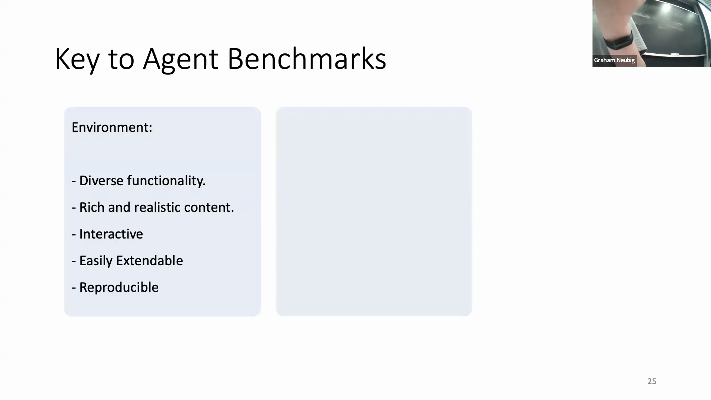
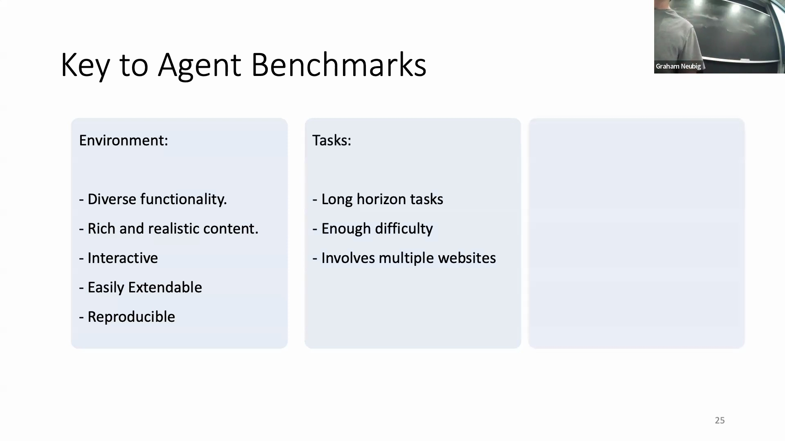

## 引入 WebArena：逼真的沙盒化互联网(Introducing WebArena)
WebArena 作为一个开源(Open-source)且具备生产就绪能力(Production-ready)的基准测试平台，通过构建完全沙盒化的互联网环境(Sandboxed Internet Environment)来有效应对上述挑战。为确保实验的可复现性(Reproducibility)并规避实时网站的不稳定性，该平台采用 Docker 容器进行标准化分发，并利用从真实线上平台抓取的原始数据(Raw Data)构建底层内容。其环境覆盖了高度多样化的垂直领域，包括电子商务平台、GitLab 开发工作区、类 Reddit 社区论坛、维基百科以及交互式地图服务，全面囊括了社交媒体、专业工作流(Professional Workflows)与内容管理等核心应用场景。
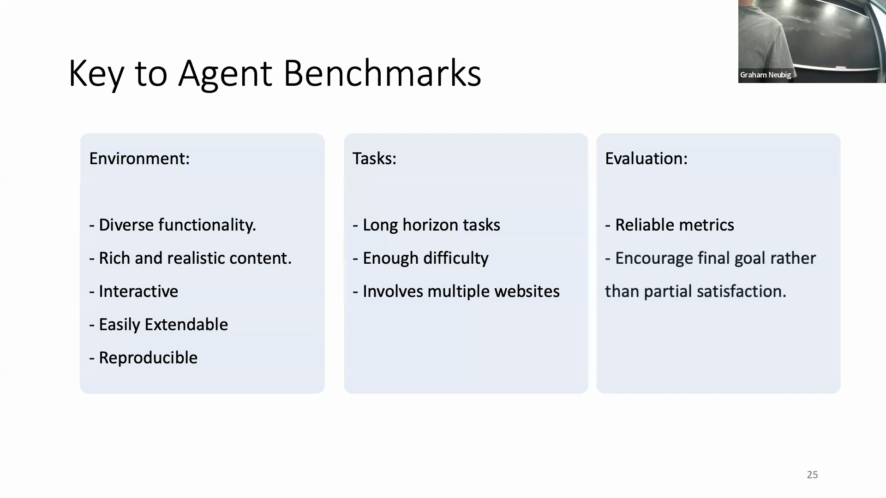
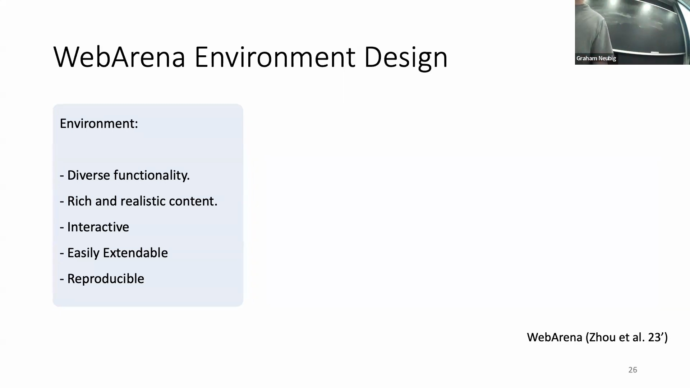
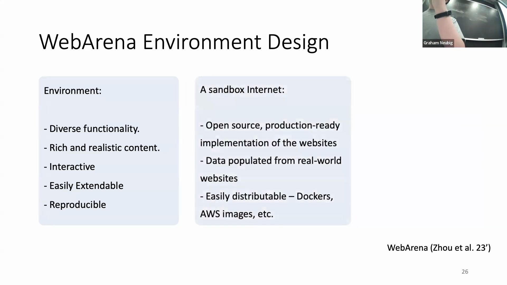

## 真实意图收集与任务分类(Real Intent Collection & Task Taxonomy)
WebArena 中的任务设计均源自真实的浏览器历史记录(Browser History)，以确保交互意图的高度真实性，并被系统性地划分为三大核心类别。第一类为*信息检索(Information Seeking)*，例如查询历史订单的具体购买日期以作个人备案。第二类为*网站导航(Site Navigation)*，例如在每日工作开始时，快速定位并处理分配给个人的代码合并请求(Merge Requests)。第三类涉及*内容与配置操作(Content and Configuration Operations)*，要求智能体主动对数字环境进行状态修改，例如起草并发布一篇帖子至指定的论坛版块(Subreddit)，从而实质性地触发平台的功能性变更(Functional Changes)。
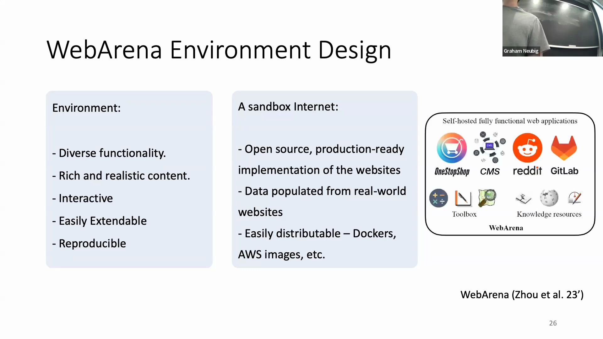

## 跨站复杂工作流与基于结果的评估(Cross-site Complex Workflows & Outcome-based Evaluation)
一个典型的复杂任务示例为：规划一条在匹兹堡市内驾驶距离最短的博物馆游览路线，并将最终形成的行程单同步记录至 GitLab 代码仓库中。该工作流要求智能体跨越搜索引擎、百科类站点及地图软件，执行超过 20 次页面跳转，深度融合了数学路径优化(Mathematical Optimization)与跨站导航(Cross-site Navigation)能力。鉴于任务的高度复杂性，WebArena 摒弃了僵化的逐动作序列追踪，转而采用基于结果的验证器(Outcome-based Verifiers)。此类验证器的工作机制类似于软件工程中的单元测试(Unit Tests)，通过直接校验目标 URL、特定 HTML 元素或底层数据库的状态变更，来精准验证最终的环境状态(Environment State)，从而客观判定任务是否成功达成。
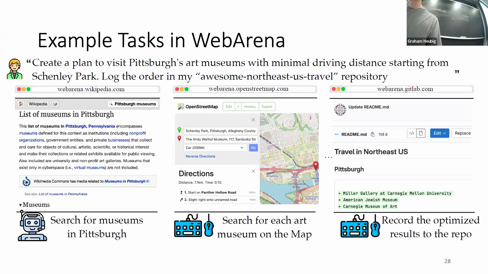
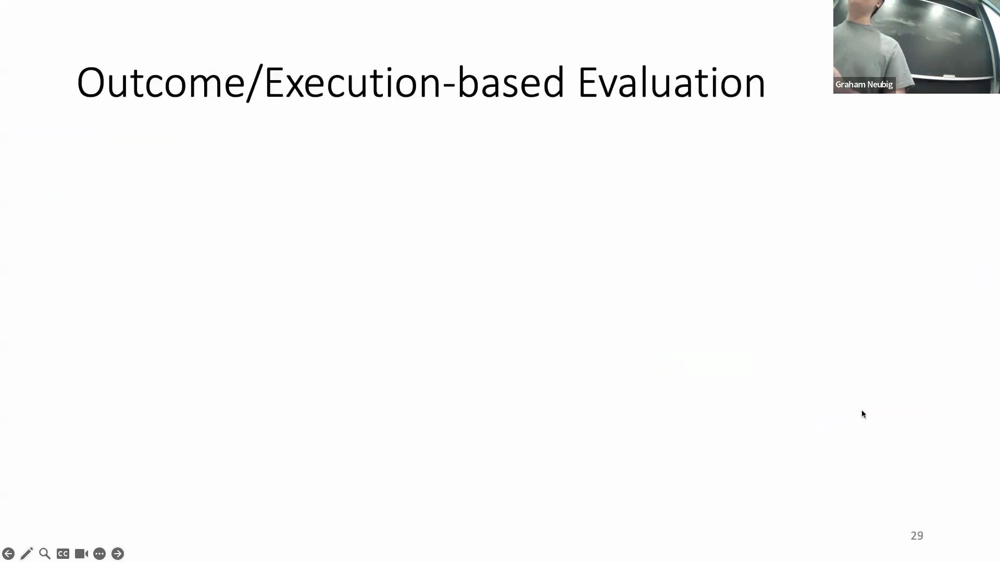

## 多模态观测与动作空间(Multimodal Observations & Action Spaces)
该基准测试支持高度灵活的多模态交互(Multimodal Interaction)。其观测空间(Observation Space)可提供原始屏幕截图(Raw Screenshots)、非结构化 HTML 源码，或结构化程度更高的无障碍树(Accessibility Tree)，后者能为网页元素提供精准的语义化表示(Semantic Representation)。动作空间(Action Space)的设计紧密贴合标准人机交互(Human-Computer Interaction)规范，全面支持键盘输入、鼠标点击、悬停、页面滚动及基础浏览器导航命令。为有效激活模型的自主决策能力，系统在初始化时会注入详尽的系统提示词(System Prompts)，明确界定智能体的角色设定、规范观测与动作的数据格式，并提供高质量的任务执行上下文示例(In-context Examples)。
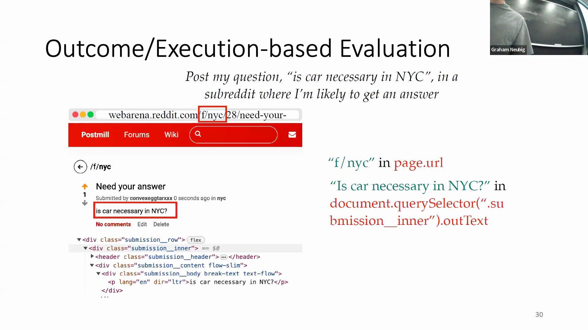
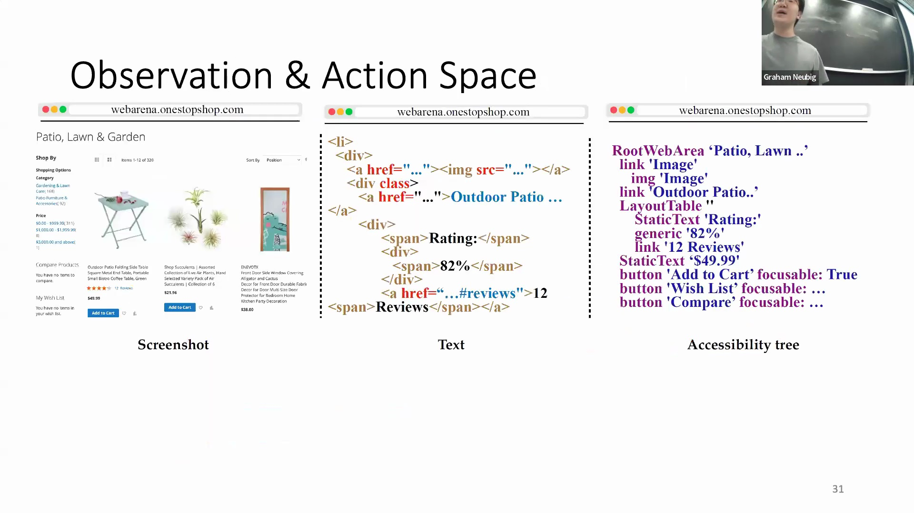
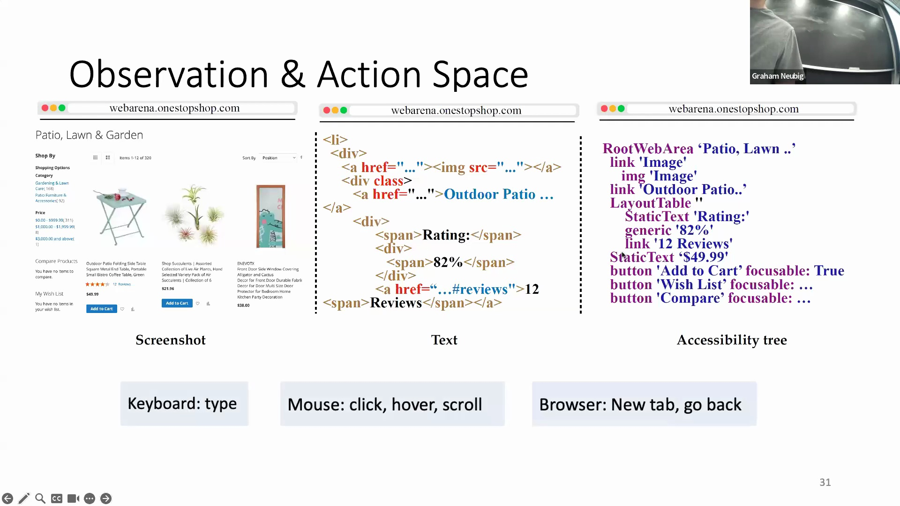

## 性能差距：人类与先进大语言模型(Performance Gap: Humans vs. Advanced LLMs)
WebArena 的实验数据清晰揭示了人类用户与当前 AI 智能体之间存在的显著性能差距(Performance Gap)。在严格的两分钟限时条件下，人类用户能够达成约 78% 的任务准确率(Task Accuracy)。相比之下，即便是 GPT-3.5 与 GPT-4 等前沿大语言模型，在结合高级提示策略(Advanced Prompting Strategies)与思维链推理(Chain-of-Thought Reasoning)后，其任务解决率仍仅徘徊在 14% 左右。尽管引入推理机制能带来有限的性能增益，但现阶段的大语言模型仍远未企及人类的通用操作水平。这一悬殊差距不仅凸显了该领域面临的重大工程挑战，也暴露出当前模型对提示词细微扰动(Hyper-sensitivity to Prompt Perturbations)的极端脆弱性。
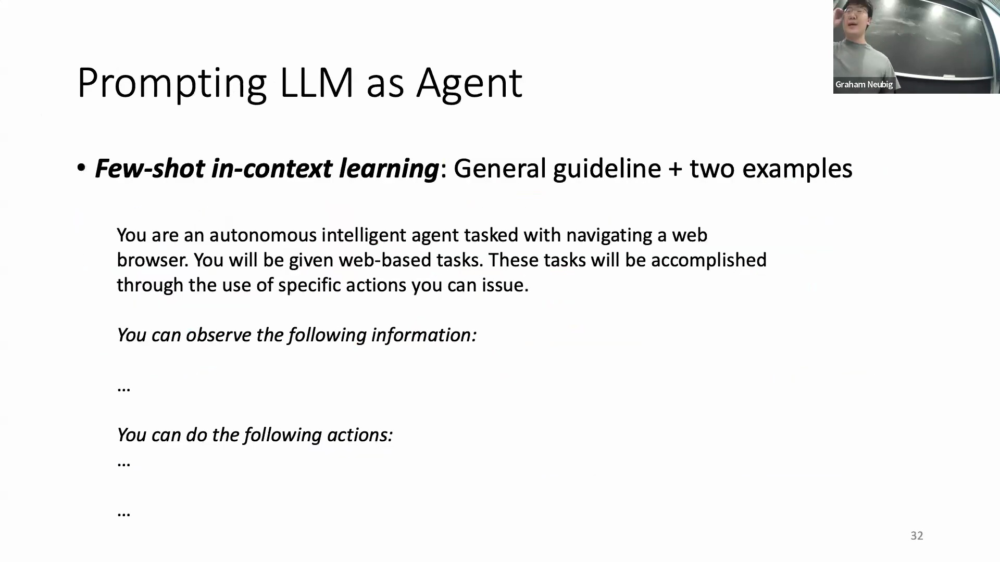
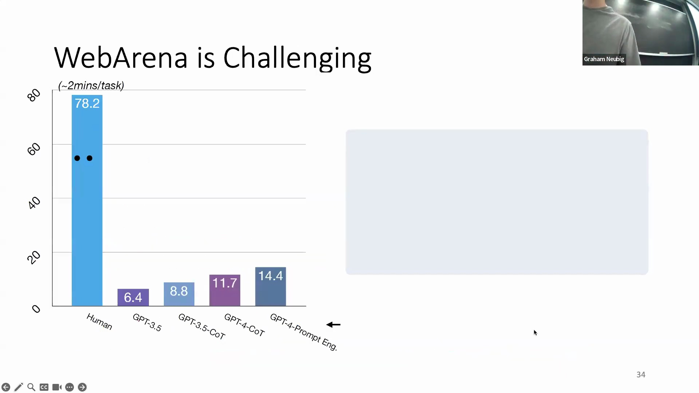

## 失败分析与推理局限性(Failure Analysis & Reasoning Limitations)
对失败案例的深入分析(Failure Case Analysis)暴露出模型在深层语义理解与常识推理(Commonsense Reasoning)方面的关键缺陷。例如，当任务要求“检索对某款特定夹克表达不满的客户反馈”时，GPT-4 往往会机械地导航至网站通用的“客户(Customer)”目录，而未能进行逻辑推断以访问实际存放产品评价的评论区或售后反馈板块。这表明，尽管大语言模型具备卓越的文本语法处理能力，但在执行直观的网站导航(Web Navigation)与上下文推理时仍频频受阻。模型过度依赖表层的字面关键词匹配(Literal Keyword Matching)，而非基于实际功能意图与任务目标的深层逻辑规划，这仍是制约其走向完全自主化的核心瓶颈。
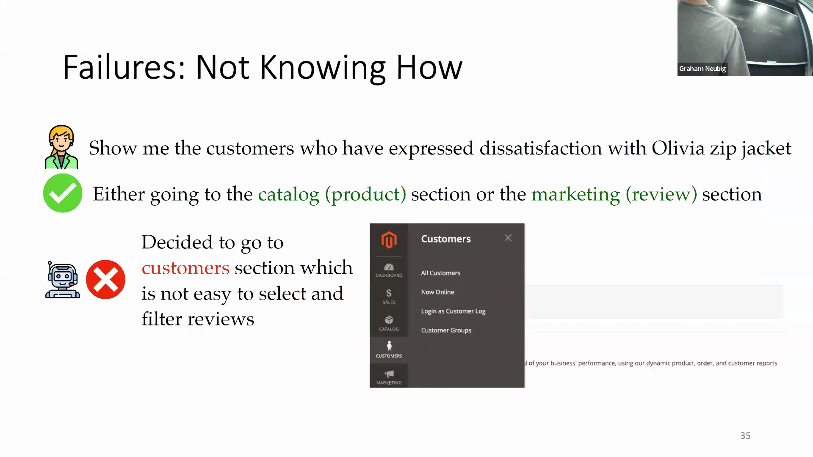

---

## 分析 LLM 网页智能体的失败模式
尽管具备先进的语言处理能力，语言模型在导航复杂网页环境时，仍暴露出关键的推理(Reasoning)与规划(Planning)缺陷。大量失败案例源于细微错误(Trivial Errors)，例如日期格式输入不规范，或意外触发网站的严格验证拦截机制。此外，幻觉现象(Hallucination)依然普遍；例如，GPT-4 约 21% 的任务失败是由于陷入重复输入循环（如持续键入相同文本）。模型在上下文自我认知(Contextual Self-Awareness)方面也面临困难，常将“我自己(myself)”等相对指代直接当作字面字符串输入，而非向系统查询当前实际登录的用户名。这些现象凸显了当前模型在常识推理(Commonsense Reasoning)与环境适应能力(Environmental Adaptability)方面仍存在根本性差距。

## 智能体增强的训练范式
为突破上述局限并超越基础的提示工程(Prompt Engineering)方法，研究人员正聚焦于三大核心训练范式：上下文学习(In-Context Learning, ICL)、监督微调(Supervised Fine-Tuning, SFT)与强化学习(Reinforcement Learning, RL)。ICL 旨在不更新模型权重(Model Weights)的前提下，通过精心设计的提示引导模型行为；SFT 则依赖大规模专家演示轨迹(Expert Demonstration Trajectories)对模型参数进行优化。RL 代表了更为前沿的技术路径，使智能体能够直接从与环境的实时交互中汲取经验。从零样本提示(Zero-Shot Prompting)向这些结构化训练流程的演进，对于开发能够可靠执行长周期(Long-Horizon)、多步骤工作流(Multi-step Workflows)的智能体而言至关重要。

## 上下文学习与提示词结构化
在不更新模型参数的前提下，上下文学习(In-Context Learning)在实现模型行为对齐(Model Alignment)方面依然极为有效。通过引导模型基于精心筛选的输入-输出示例进行条件学习(Conditional Learning)，开发者可精准规范其输出格式与动作序列(Action Sequences)。高效的 ICL 提示词会明确定义观测空间(Observation Space)（如精简的 HTML 结构树或无障碍树(Accessibility Tree)），详细枚举可用的动作空间(Action Space)，并提供融合逐步推理与可执行 `stop/action` 指令的少样本演示(Few-Shot Demonstrations)。此类结构化提示(Structured Prompting)显著降低了格式错误率，并确保模型生成语法合规的动作指令(Syntax-Valid Action Commands)，以便底层执行环境能够准确解析与处理。

## 监督微调与数据挑战
监督微调(Supervised Fine-Tuning, SFT)通过在海量人类专家轨迹数据集上进行训练（通常基于交叉熵损失(Cross-Entropy Loss)函数）来优化语言模型。尽管 SFT 在固化成功任务模式方面成效显著，但其属于典型的数据密集型(Data-Intensive)方法，且难以高效利用失败样本；若某条执行轨迹仅在最终步骤失败，此前所有有效的推理过程在标准训练中通常会被整体丢弃。为缓解高质量数据稀缺问题，研究人员广泛采用数据增强(Data Augmentation)技术，从 YouTube 教程、维基百科及 Reddit 社区讨论中大规模采集指令数据(Instructional Data)。这些多样化的语料库(Corpora)有效弥合了静态训练数据与动态真实网页交互之间的语义鸿沟。

## 基于环境反馈的强化学习
强化学习(Reinforcement Learning, RL)通过引入自动化且由环境驱动的奖励机制(Environment-Driven Reward Mechanisms)，为传统的基于人类反馈的强化学习(Reinforcement Learning from Human Feedback, RLHF)提供了一种极具潜力的替代路径。在 WebArena 等沙盒环境(Sandbox Environments)中，系统可内置任务目标验证器，从而无需依赖人工标注即可提供实时且可扩展的反馈信号。该机制使智能体能够从成败经验中进行迭代学习，并基于实际执行结果(Actual Execution Outcomes)而非静态的人类偏好来持续优化决策策略。尽管该方向仍处于活跃的研究前沿，但基于环境反馈的强化学习无疑是实现完全自主、具备自我进化能力(Self-Evolving Capabilities)的网页智能体的关键基石。

## 未来方向：复杂基准测试与评估
该领域亟需摆脱低复杂度且极易触及性能饱和(Performance Saturation)的任务局限，转向设计更为严谨的基准测试(Benchmarks)，以全面检验智能体的长周期规划(Long-Horizon Planning)、跨域适应能力(Cross-Domain Adaptability)以及稳健的知识整合能力(Knowledge Integration)。WebArena 等平台正是这一范式转变的典范，其要求智能体在协同管理多步目标的同时，深入探索高度多样化且逼真的仿真环境。随着研究边界不断拓展至代码生成智能体(Code Generation Agents)与具身机器人(Embodied Robotics)领域，开发人员在评估指标设计、上下文推理(Contextual Reasoning)优化及环境反馈机制构建方面，仍将面临高度相似的技术挑战。从根本上提升智能体能力，关键在于构建可交互(Interactive)、可复现(Reproducible)的测试环境，从而驱动大模型突破简单的模式匹配(Pattern Matching)，真正迈向自主问题解决(Autonomous Problem Solving)的新阶段。

