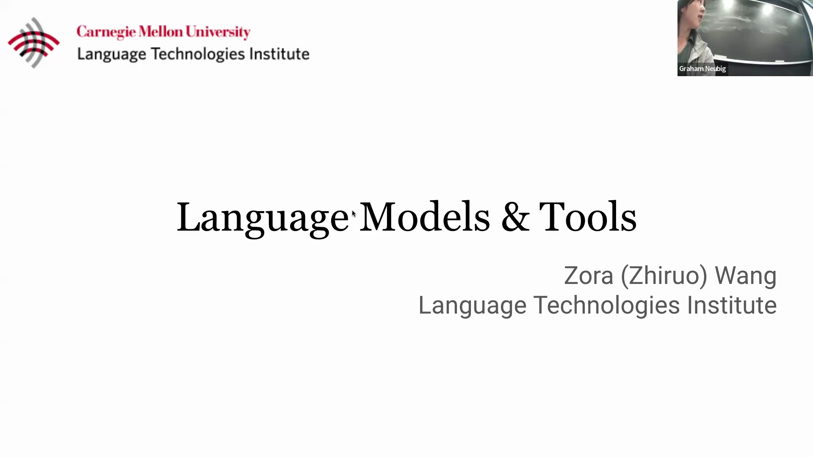
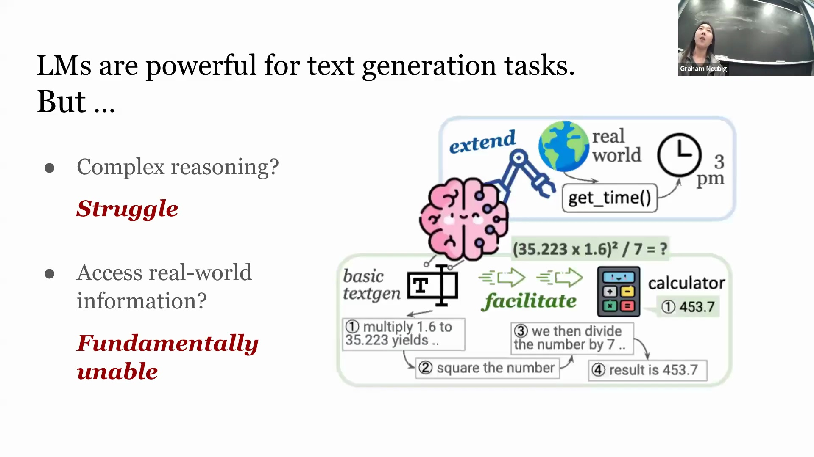
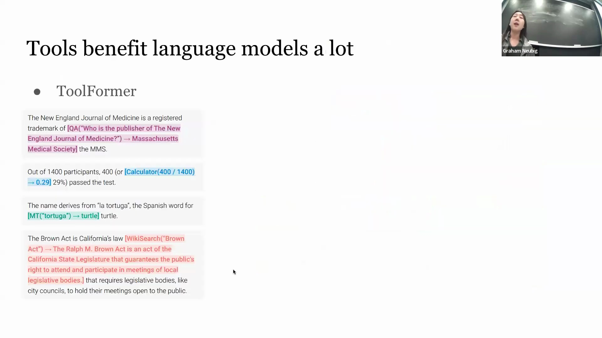
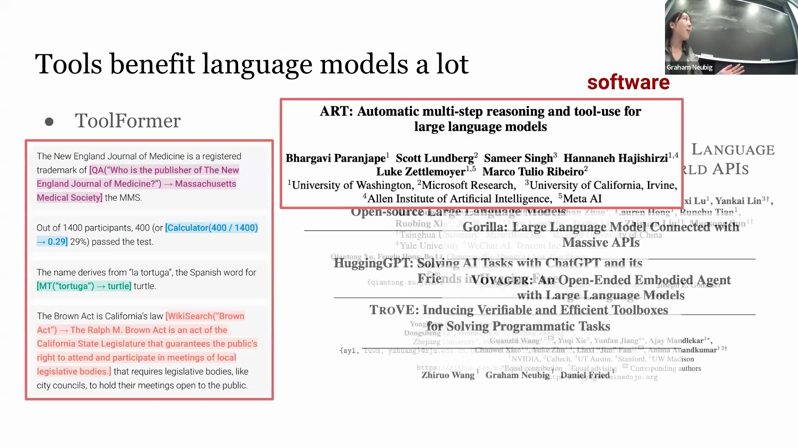
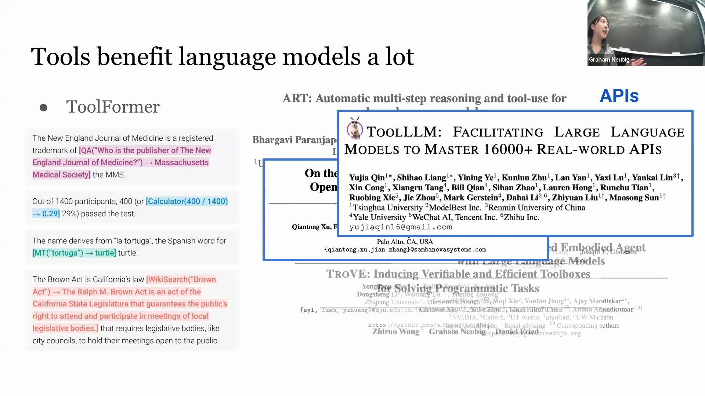
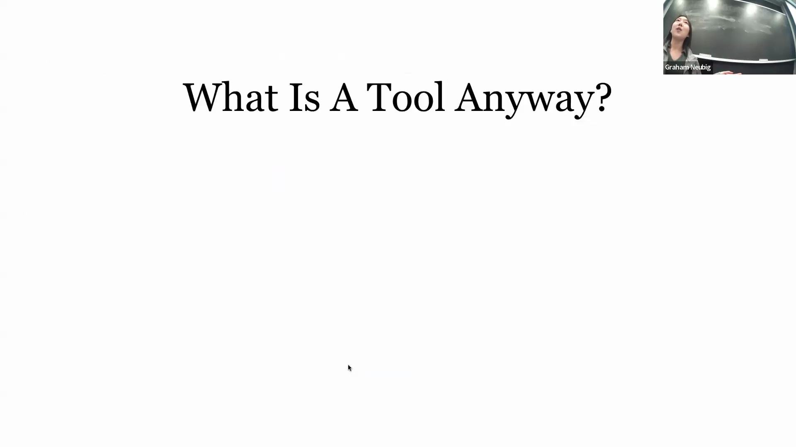
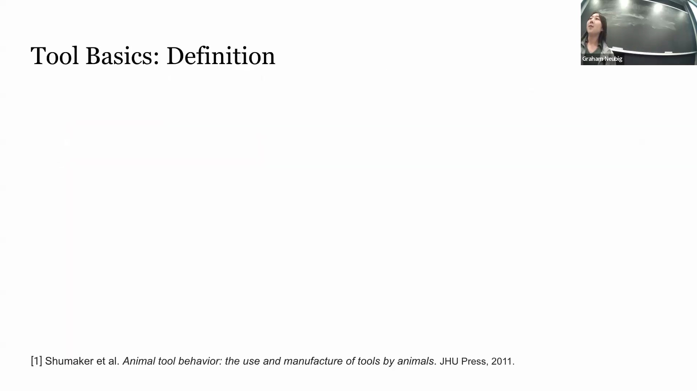
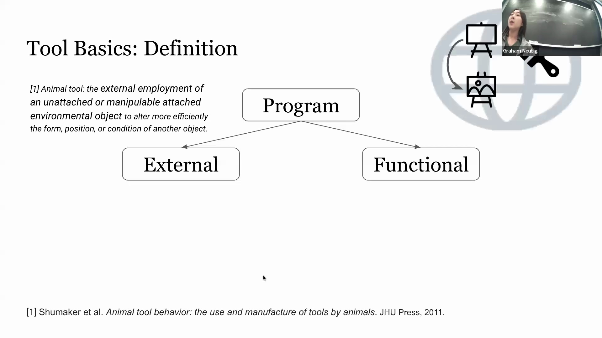
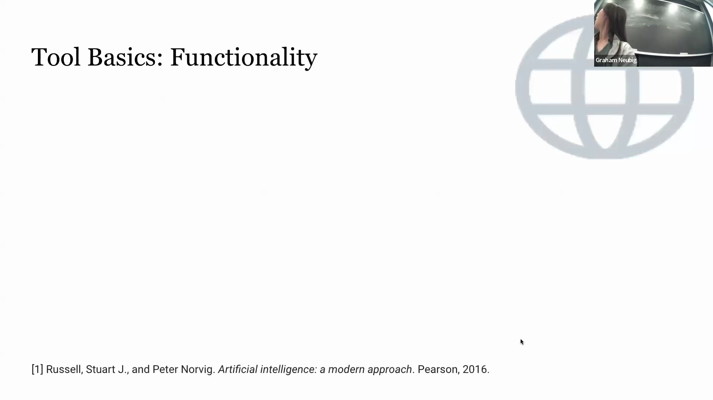

## 独立语言模型(Large Language Models)的局限性
语言模型在文本生成(Text Generation)及诸多下游任务中展现出卓越的能力。然而，它们并非万能。在复杂的推理场景(Reasoning Scenarios)（尤其是数学计算(Mathematical Computation)）中，其显著的局限性便会暴露无遗。当被要求解决数学问题时，语言模型通常在推理效率与计算准确性上均表现欠佳。即便是采用思维链(Chain-of-Thought, CoT)这类将推理过程逐步拆解的结构化提示(Structured Prompting)技术，也常常难以得出正确的最终答案。

此外，当查询涉及获取实时或动态的现实世界信息时，语言模型存在固有的局限性。由于其内部知识在预训练完成后便已固化(Frozen)，模型无法可靠地回答关于当前时间或实时状况的问题。这类信息具有高度的时效性与动态变化特征，并未包含在静态的训练数据集(Static Training Datasets)中。

## 工具增强型语言模型(Tool-Augmented Language Models)的兴起
为了克服这些内在局限性，集成外部工具(External Tools)变得至关重要。通过调用专用计算器进行算术运算，或请求特定的应用程序编程接口(Application Programming Interface, API)（例如 `get_time`），模型能够提供准确且最新的结果。这一需求极大地激发了学术界对工具增强型语言模型的研究热情。以 Toolformer 为代表的开创性框架正式确立了这一范式(Paradigm)，通过为模型配备计算器、网络搜索引擎等核心实用工具，为该领域的后续发展奠定了坚实基础。

## 工具实现与研究格局的多样性
在该构想提出后，相关领域经历了快速扩张，但也呈现出明显的碎片化(Fragmentation)特征。不同研究采用了截然不同的工具集(Toolsets)与评估基准(Evaluation Benchmarks)。部分研究依赖独立运行的软件（如计算器、搜索引擎），部分则调用用于获取天气或时间数据的 Web API。另一研究方向集成了来自 Hugging Face 等平台的专用神经网络模型(Neural Network Models)，还有些研究采用了本地自定义的专家函数(Expert-defined Functions)。这种实现方式的广泛差异自然引出了一个核心问题：在语言模型的语境下，究竟如何界定“工具”？

## 工具的定义：外部性(Externality)与功能性(Functionality)属性
为厘清这一概念，一项系统性综述(Systematic Review)从三个维度展开探讨：工具的定义与功能、现有工具类型及其集成方法，以及评估框架(Evaluation Frameworks)。从根本上讲，工具是语言模型可调用的、用于执行特定任务的程序。一个程序若要被视为工具，必须满足两项核心属性：*外部性（External）*与*功能性（Functional）*。借鉴认知科学(Cognitive Science)领域的文献，工具必须独立于使用它的智能体(Agent)——在此语境下，即独立于语言模型的内部参数之外。此外，工具必须具备功能性，即能够对环境对象(Environmental Objects)施加作用，从而改变其状态或产生特定输出。例如，画笔（工具）作用于空白画布（环境对象）即可生成一幅画作。

形式化定义(Formal Definition)中，工具被视为独立于语言模型之外的函数接口(Function Interface)或计算机程序。模型通过生成相应的函数调用(Function Call)及输入参数(Input Arguments)与之交互，进而触发外部程序的执行。

## 工具的主要功能
根据工具与环境(Environment)的交互模式，可将其主要功能划分为三大类：
1. **感知工具（Perception Tools）：** 旨在从环境中采集数据，且不改变环境状态。例如用于检索相关文档的网络搜索引擎，或用于获取实时天气数据的 API。
2. **动作工具（Action Tools）：** 用于对环境施加影响并直接改变其状态。沿用上述类比，画笔通过涂抹颜料主动改变了画布的物理状态。
3. **计算工具（Computation Tools）：** 负责处理超越基础算术的复杂计算任务，涵盖数据预处理(Data Processing)、符号推理或机器翻译(Machine Translation)等。

## 功能的重叠与工具-智能体关系
上述功能类别并非完全互斥(Mutually Exclusive)，单一工具往往兼具多重角色。例如，网络搜索引擎既可充当感知工具（负责采集原始文档），亦可作为计算工具（在后台计算相关性得分、执行结果排序及查询语义处理）。

探讨工具与智能体(Agent)的关系时，需明确：语言模型虽能调用工具，但其本身并不必然构成智能体。然而，工具是赋能智能体实现复杂任务的关键要素。在经典定义中，智能体通常指能够通过传感器(Sensors)感知环境，并借助执行器(Actuators)对环境采取行动的自主实体。在此架构下，感知工具直接为智能体提供环境数据采集能力，构成了从单一语言模型迈向完全自主、交互式智能体(Interactive Agents)的关键桥梁。

