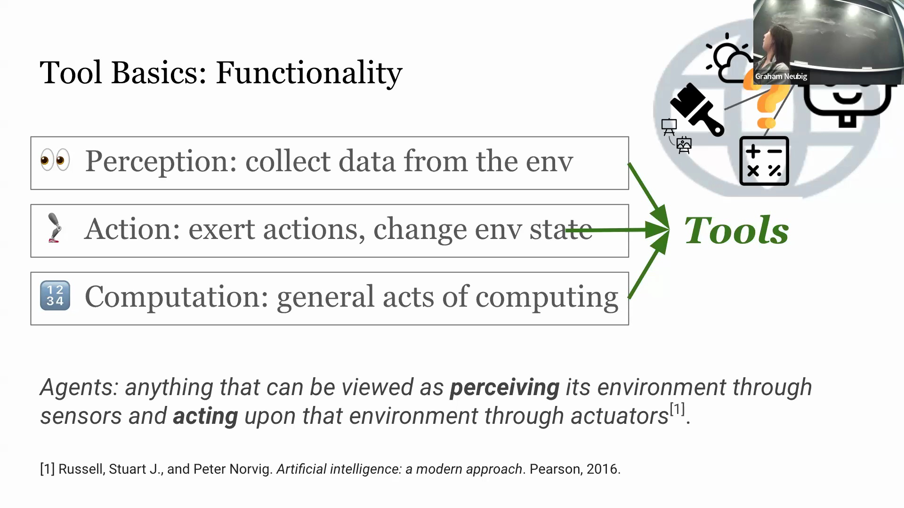
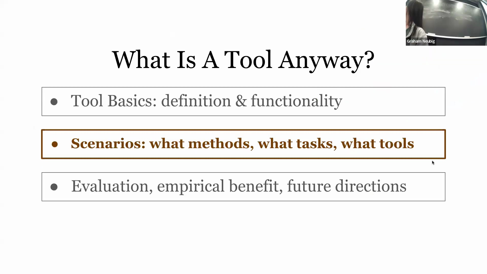
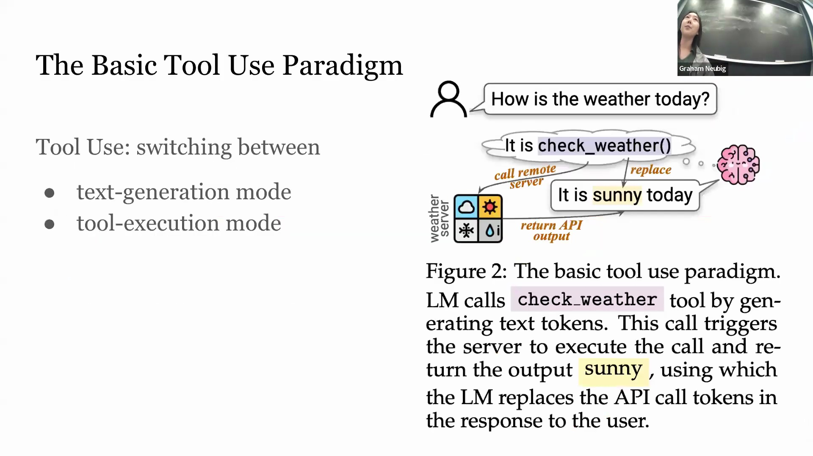
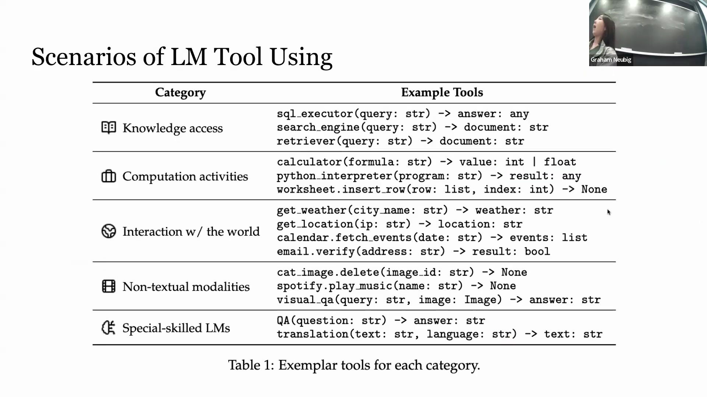
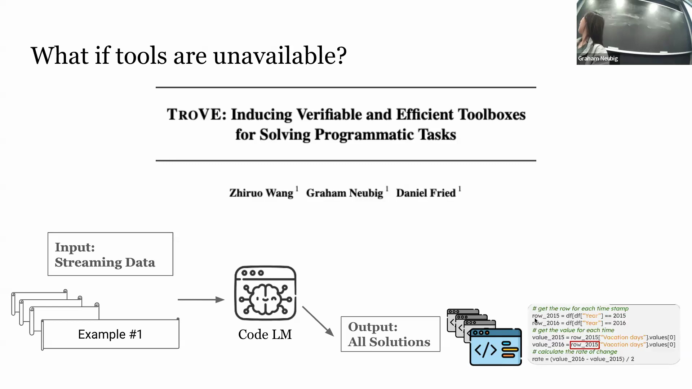

## 工具与智能体的关系
讨论阐明了工具增强型模型(Tool-Augmented Models)与自主智能体(Autonomous Agent)之间的界限。虽然语言模型可以利用感知工具收集环境信息，并利用动作工具修改环境状态，但仅依赖计算工具的系统在标准定义下通常不被视为完整的智能体。当前的工具使用能力(Tool Usage Capabilities)仍处于相对初级阶段。现有大多数数据集仅支持有限的多轮交互(Multi-turn Interactions)，且每项任务通常仅调用单一工具，缺乏支持复杂工具链式调用(Tool Chaining)的稳健机制。然而，研发能够智能决策何时调用以及如何对多个工具进行编排(Tool Orchestration)的模型，代表了一个极具潜力的研究方向。

## 基础工具使用范式
工具使用的基本工作流程依赖于文本生成与外部执行之间的动态控制权交接(Dynamic Control Handoff)。初始阶段，语言模型以标准文本生成模式处理用户查询。当模型识别到需要外部协助时，会生成特定的函数调用(Function Call)指令（例如 `call_get_weather`）。指令生成后，系统将控制权移交至外部执行服务器(External Execution Server)，由该服务器运行指定工具并返回结果（例如“晴天”）。随后，模型无缝接收该输出，切换回文本生成模式，并结合工具返回的响应构建最终答案反馈给用户。

## 如何教会模型使用工具
目前赋予模型工具使用能力的方法主要分为两类。第一类是**推理时引导(Inference-time Conditioning)**，该方法无需更新模型参数。它通过在提示(Prompting)阶段注入自然语言系统指令、提供展示工具使用范例的上下文学习(In-context Learning)示例，以及附加详细的API文档来引导模型行为。第二类是**基于训练的学习(Training-based Learning)**，即在包含自然语言查询及其对应工具调用轨迹(Tool Execution Trajectories)的精选数据集上对模型进行微调(Fine-tuning)。这两种方法均旨在使模型具备准确识别工具需求、规范生成调用指令以及有效解析工具输出的能力。

## 工具的核心应用场景
工具集成解决了独立语言模型的若干核心局限性，主要可归纳为五个实际应用场景：
1. **知识获取(Knowledge Retrieval)：** 通过连接结构化知识图谱（配合查询执行器）、网络搜索引擎或检索增强生成(Retrieval-Augmented Generation, RAG)架构，突破静态训练数据的局限。
2. **计算增强(Computational Augmentation)：** 将复杂计算任务卸载(Offloading)至计算器、代码解释器或电子表格等外部生产力软件，显著提升模型的数学与逻辑推理能力。
3. **环境交互(Environmental Interaction)：** 实现实时环境感知与操作，例如获取实时天气/地理位置数据、管理日历日程或处理电子邮件。
4. **多模态处理(Multimodal Processing)：** 通过集成图像生成、音频流媒体（如 Spotify）或视觉问答(Visual Question Answering, VQA)等 API，弥补大语言模型仅支持文本模态的短板，使其能够处理并交互多种数据格式。
5. **神经模型工具化(Neural Models as Tools)：** 将垂直领域的专用模型（如特定问答或机器翻译模型）封装为可调用的实用程序。值得注意的是，单一工具往往可同时服务于多个功能类别，这在一定程度上模糊了严格的分类界限。

## 超越预设计工具
当前领域面临的一项显著瓶颈是，大多数工具在部署前均需依赖人类专家进行手动设计与开发。尽管该方法在处理已知任务时行之有效，但当模型遭遇缺乏现成工具支持的未知问题(Novel Problems)时，往往显得力不从心。这引出了一个关键研究问题：能否在无需专家干预的前提下实现工具的自动生成？相关研究已给出肯定答案。传统上，解决代码生成任务(Code Generation)通常依赖于提示(Prompting)模型输出单一且冗长的完整脚本，此类脚本极易因细微的语法错误而导致编译失败或运行时异常。一种更为稳健的替代方案是引导模型生成模块化的“工具程序(Toolbots)”或可复用的工具函数（例如 `calculate_rate_of_change`）。这种从单体式代码生成(Monolithic Code Generation)向模块化组件构建的范式转变，有望在解决复杂问题时显著提升系统可靠性、简化调试流程，并增强模型的环境适应能力。

