## 面向复杂任务的工具自动生成
传统的代码生成(Code Generation)方法通常通过提示(Prompting)让模型输出冗长且一体化的脚本(Monolithic Scripts)，这类脚本极易出现语法错误且难以调试。一种更为稳健的替代方案是生成可复用的模块化工具或“工具程序(Toolbots)”（例如 `calculate_rate_of_change` 函数）。这一范式转变将复杂的程序生成任务简化为仅为函数调用确定正确的参数，从而显著降低了执行错误率，并使得生成的解决方案更易于进行人工验证(Human Verification)。
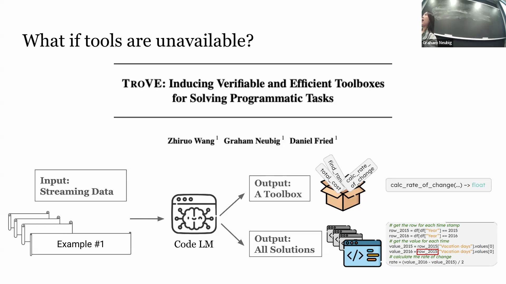

## 工具创建流程：创建、导入与跳过
该流程在推理阶段(Inference Phase)运行，无需对模型进行微调(Fine-tuning)。它采用一种动态的“工具箱(Toolbox)”机制，由三种核心模式控制。在**创建模式(Create Mode)**下，当遇到需要未见功能(Unseen Functionalities)的问题时，模型会生成一个新的可复用工具及其对应的解决方案。系统通过自一致性采样(Self-Consistency Sampling)筛选出最佳输出，并将其添加工具箱。在**导入模式(Import Mode)**下，若工具箱中已存在适配的函数，模型将直接被引导导入并复用该函数，而非重新生成。最后是**跳过模式(Skip Mode)**，当模型判定当前任务无需外部工具辅助时，可完全跳过工具调用环节。

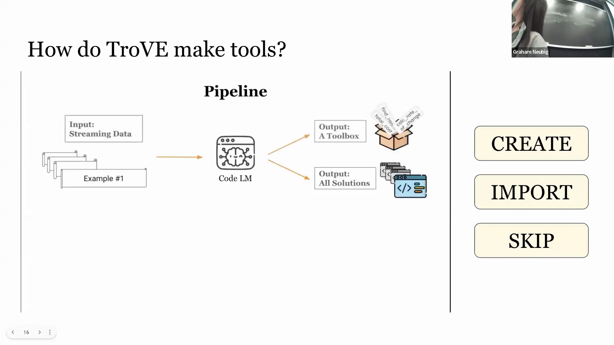
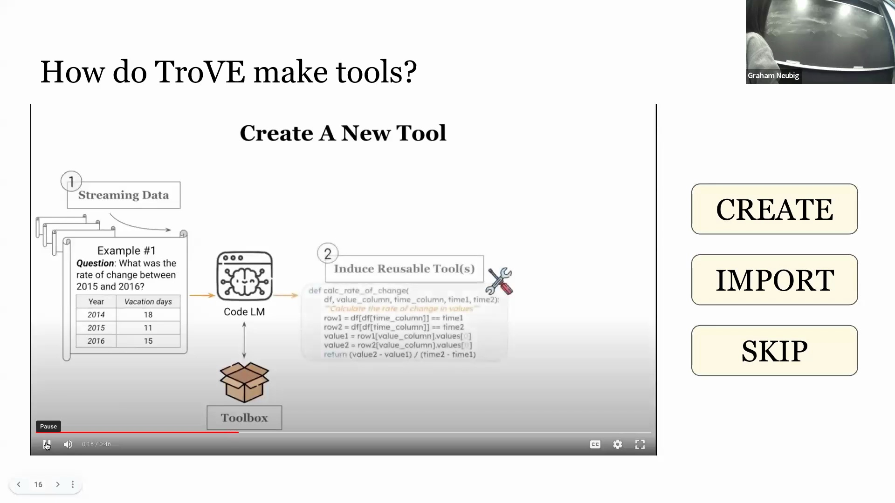

## 实验结果与人工验证优势
实验结果表明，这种工具增强型方法(Tool-Augmented Approach)在保持工具箱精简的同时，其准确率显著优于标准基线(Standard Baselines)。其核心优势在于，生成的解决方案更为简洁，所需的计算开销(Computational Overhead)也更低。一项人工验证研究进一步印证了该优势：参与者不仅能更准确地验证基于工具的解决方案的正确性，且验证速度提升了30%至40%。这充分证明，大语言模型(Large Language Models, LLMs)能够在不依赖人工定制工具(Manually Crafted Utilities)的前提下，自主创建、管理模块化工具，并从中持续获益。
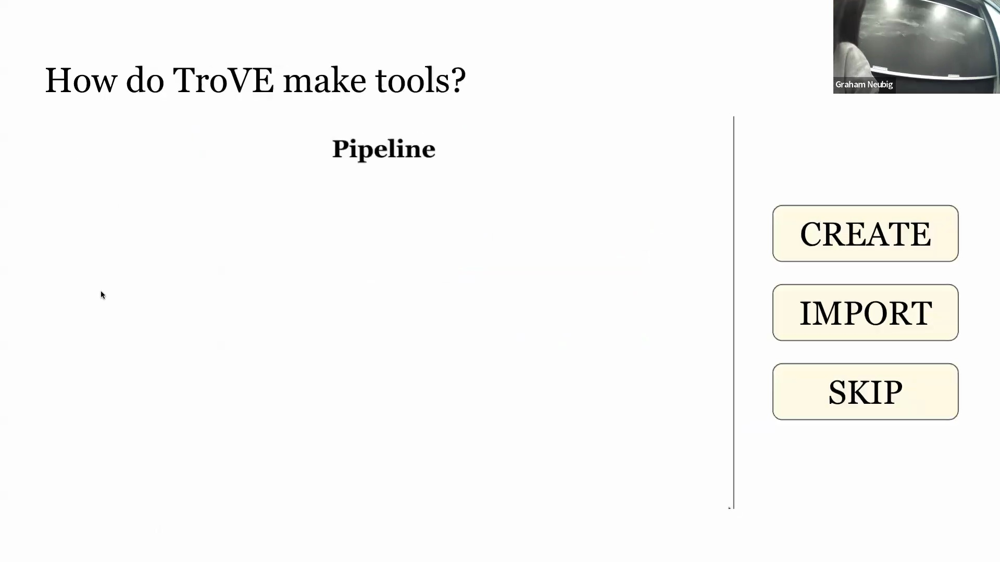
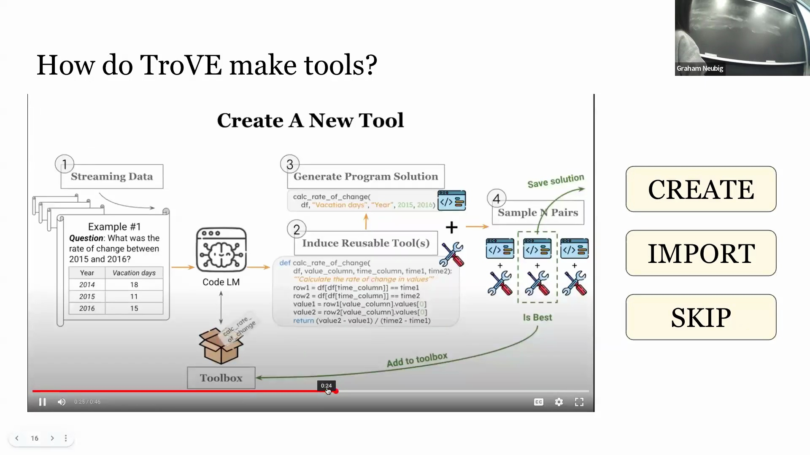
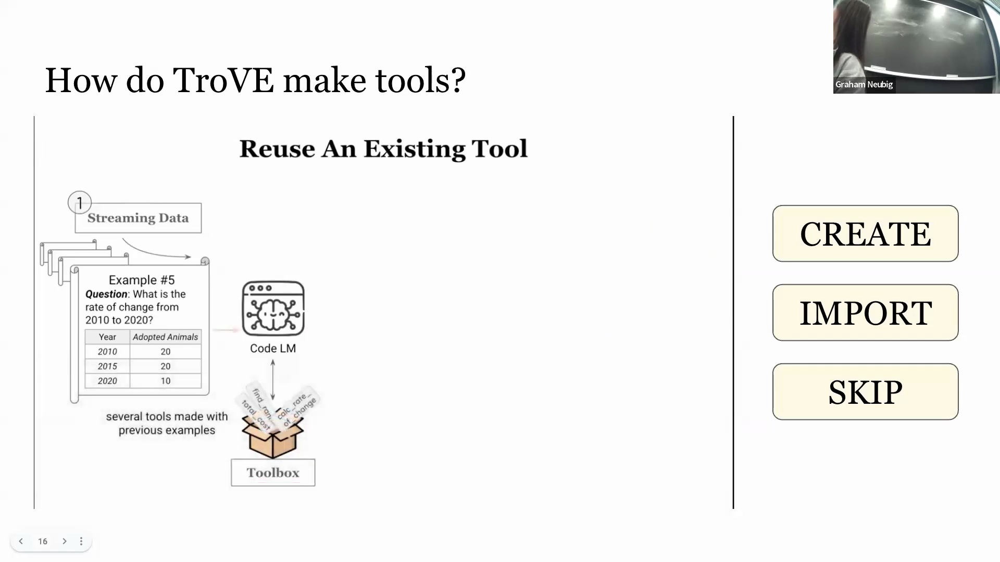
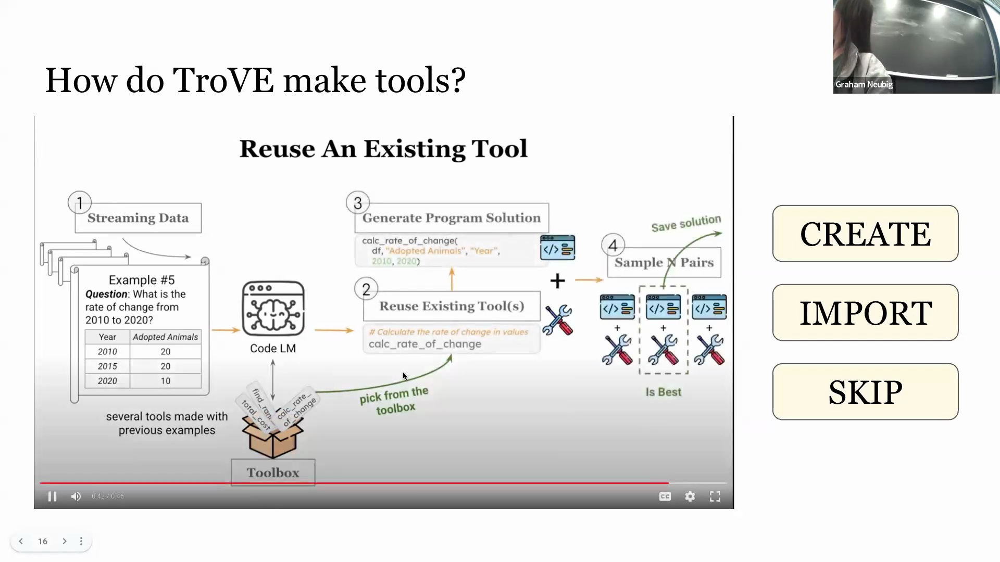

## 工具使用基准测试的现状
当前工具增强型模型的评估框架(Evaluation Frameworks)主要分为两类。第一类是复用现有的推理(Reasoning)与多模态(Multimodal)基准测试（例如数学推理数据集、处理结构化数据的 WikiTableQuestions 数据集以及视觉问答(Visual Question Answering, VQA)任务），将程序执行(Program Execution)作为一种替代求解路径集成至其中。第二类是专门构建的 API 基准测试，通常通过爬取公共 API 目录（如 RapidAPI）、解析相关文档，并利用大语言模型合成生成(Synthetically Generate)包含 API 调用的问答对(Question-Answer Pairs)来构建。
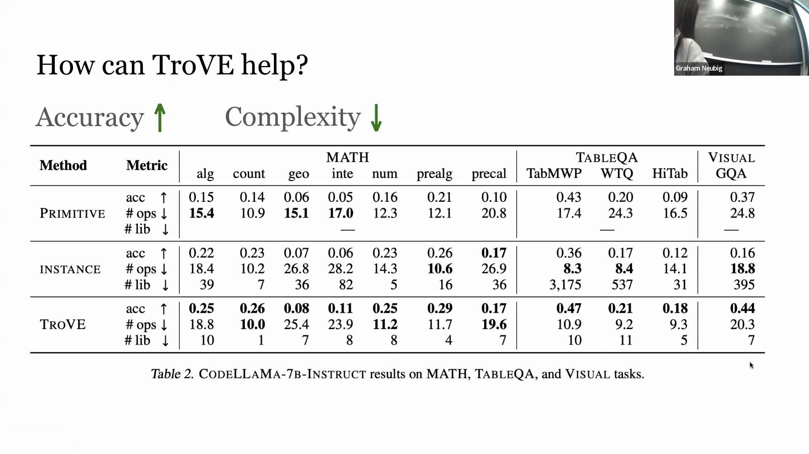
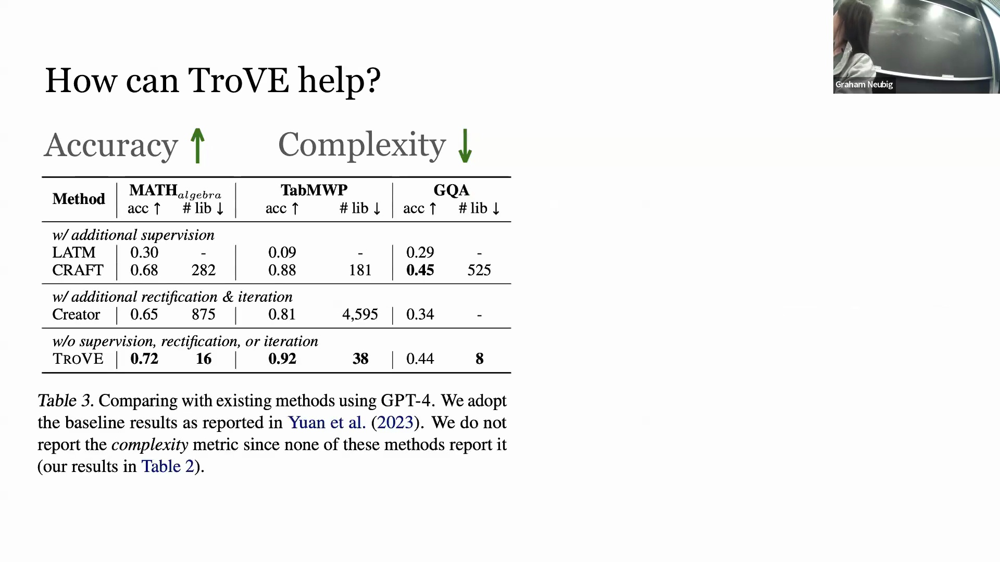
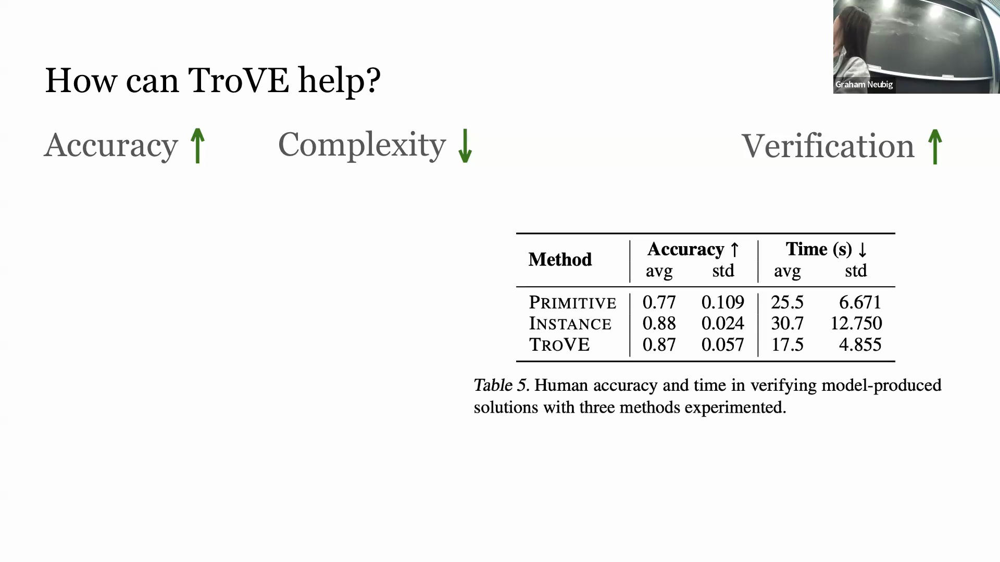

## 合成 API 数据集的局限性
尽管此类数据集目前应用广泛，但现有的 API 基准测试仍存在显著缺陷。**自然性问题(Naturalness Issue)**源于测试样本多为合成生成；随机组合的 API 往往缺乏实际逻辑，由此构建的提示(Prompts)难以反映真实的用户应用场景。**可执行性问题(Executability Issue)**同样棘手。尽管工具在定义上属于可执行程序，但超过半数的现有数据集在评估阶段并未真正执行这些工具。这主要归因于托管海量 API 的高昂成本、实时端点(Real-time Endpoints)的不稳定性（例如返回动态数据的天气或时间 API），以及为动态输出维护静态参考答案(Static Reference Answers)的固有困难。因此，现有评估通常仅停留在检查工具选择(Tool Selection)的正确性或调用语法的匹配度，而未能验证其实际的功能执行(Functional Execution)。
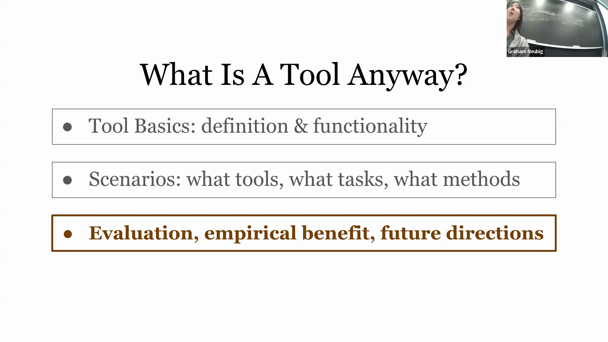
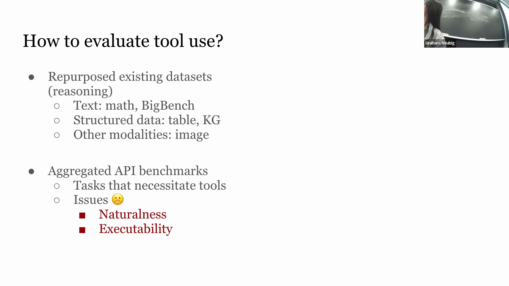

## 评估指标与缺失维度
当前的评估指标(Evaluation Metrics)主要关注任务完成率(Task Completion Rate，即对比模型输出与参考答案)、工具选择准确率(Tool Selection Accuracy，主要应用于不可执行基准测试)，以及工具可复用性(Tool Reusability)，旨在鼓励模型生成更具泛化能力(Generalization Capability)的函数。然而，仍有若干关键维度尚未得到充分探索。未来的重要研究方向应涵盖对生成工具内在属性(Intrinsic Properties)的评估，以及最为关键的——计算效率(Computational Efficiency)评估。尽管引入工具无疑能提升任务准确率，但一个全面的评估框架必须在性能增益与工具调用及执行所引入的实际计算开销(Computational Cost)和延迟(Latency)之间进行综合权衡。
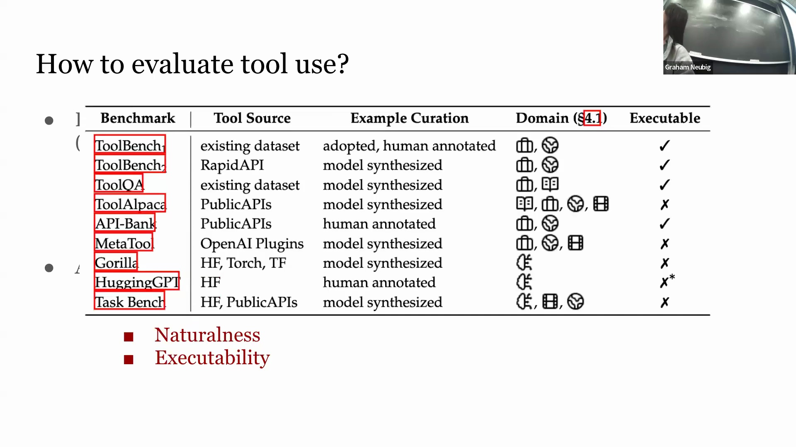