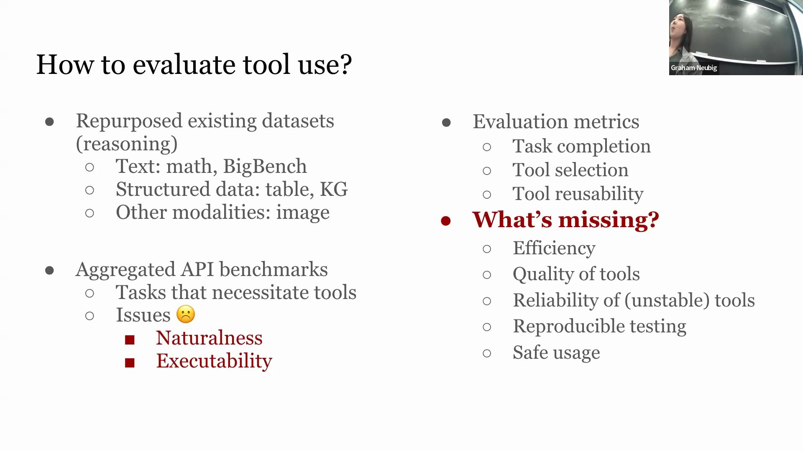
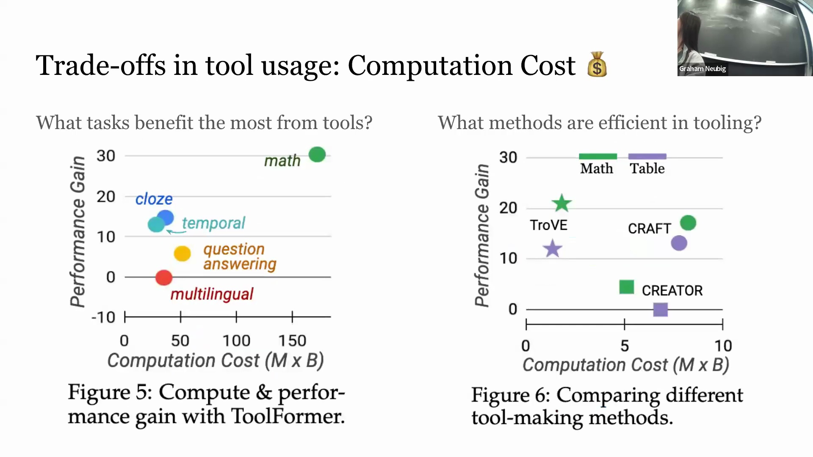
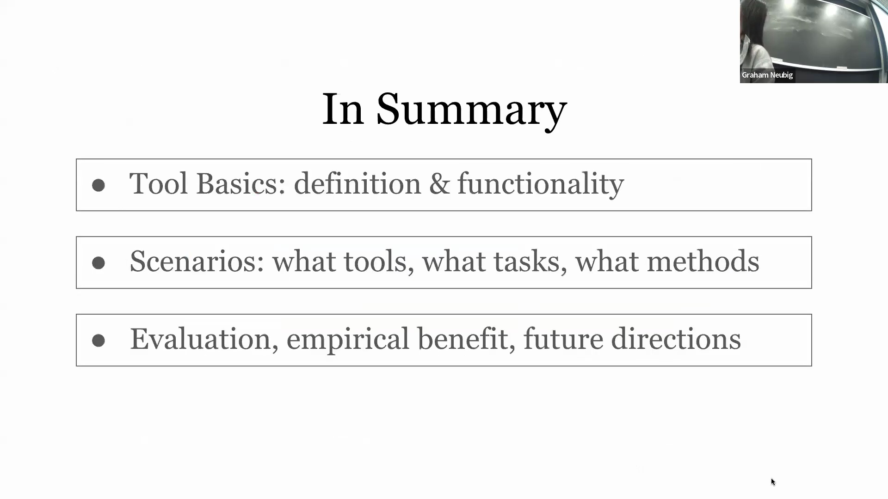
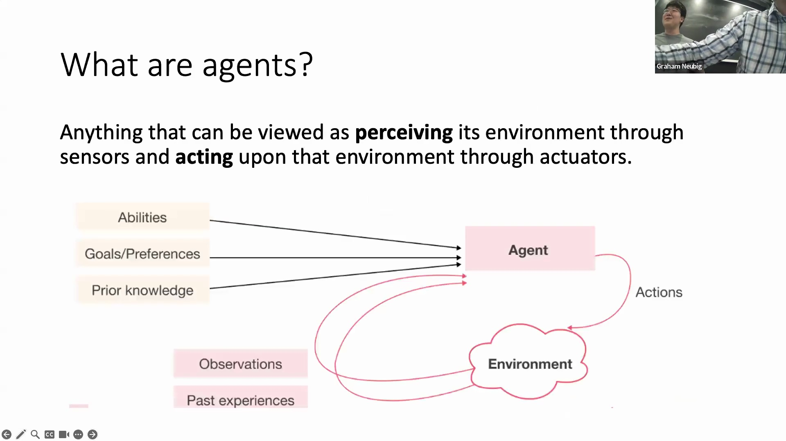
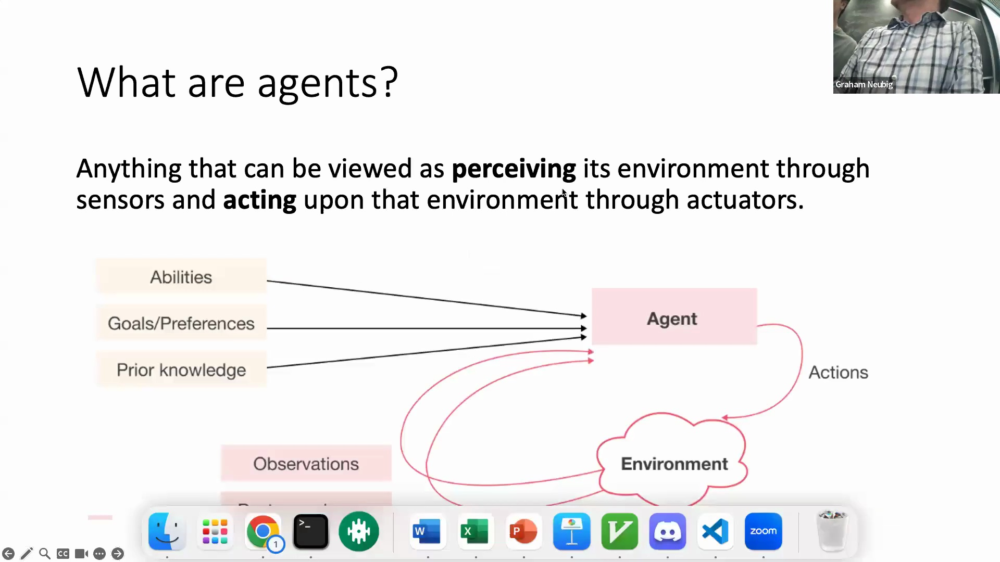
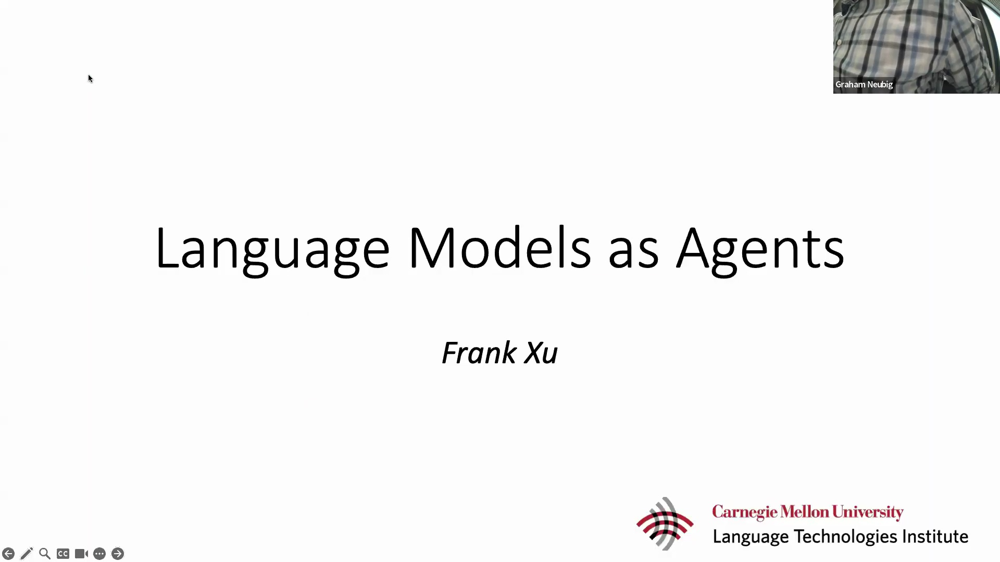
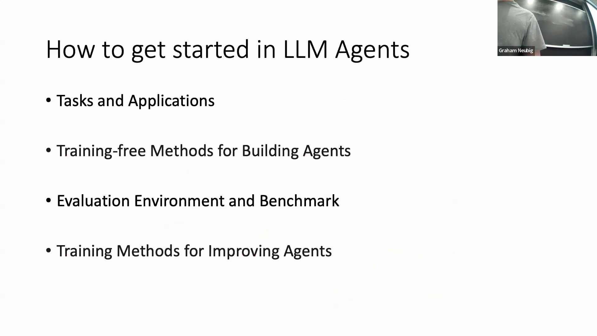
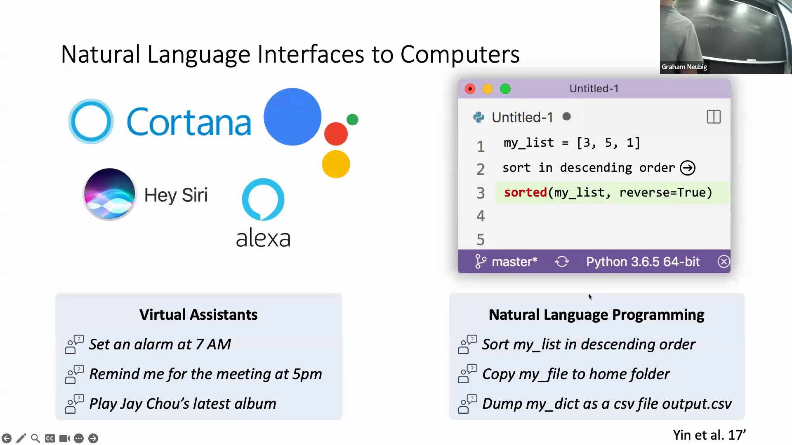
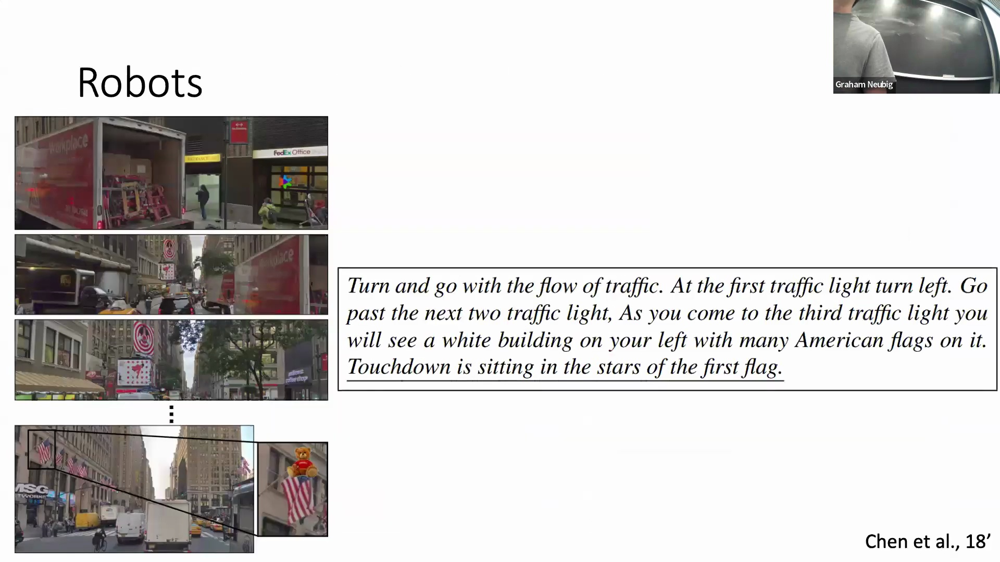
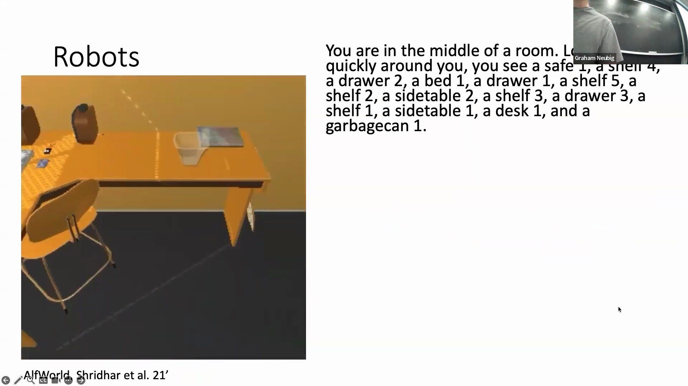

## 计算成本与效率
尽管工具(Tools)显著提升了语言模型(Language Models)的性能，但要评估其真实价值，必须深入分析相关的计算开销(Computational Overhead)。准确衡量完成任务所产生的额外成本至关重要，例如提示词(Prompts)中增加的额外 Token 数量或模型所需的额外训练步骤(Training Steps)。除基础准确率(Accuracy)外，还必须通过响应延迟(Response Latency)和计算效率(Computational Efficiency)等关键指标来综合评估工具的运行质量。若某工具虽能提供高准确率，却消耗过多的 GPU 资源(GPU Resources)或引入不可接受的延迟（例如为获取简单响应而等待数分钟），则其在实际生产环境部署(Production Deployment)中将缺乏实用性。

## 可靠性、可复现性与安全使用
管理工具的不确定性(Uncertainty)与可靠性(Reliability)仍是一项重大挑战，尤其是对于由概率性神经模型(Probabilistic Neural Models)驱动的工具而言。例如，视觉问答(Visual Question Answering, VQA)工具可能在部分样本上输出正确答案，而在其他样本上却表现失效。未来研究需深入探讨用户如何认知此类结果波动(Result Variability)，并制定相应的容错与管理策略。此外，针对动态工具(Dynamic Tools)（如实时天气或时间 API）的基准测试(Benchmarks)面临严峻的可复现性(Reproducibility)挑战，因为静态参考答案(Static Reference Answers)会随时间迅速过时。一种更为稳健的评估方法是引入标准执行轨迹(Standard Execution Trajectories)作为对照，通过并行执行模型生成的工具调用(Tool Calls)，验证其逻辑流程与执行路径的一致性，而非单纯依赖固定的输出结果。同时，工具的安全使用(Safe Usage)与可信度(Trustworthiness)仍是当前亟待填补的研究空白；诸多工具高度依赖托管于第三方未知服务器上的外部 API，这在用户个人数据传输过程中引发了严重的隐私担忧(Privacy Concerns)。

## 工具使用的实证权衡
实证分析(Empirical Analysis)凸显出，在不同任务类型与实现方法中，性能增益与计算成本之间存在显著的权衡关系(Trade-off)。当引入工具增强(Tool Augmentation)时，数学推理任务(Mathematical Reasoning Tasks)往往展现出巨大的准确率提升，这使得相应的计算开销显得极具性价比。相反，多语言任务(Multilingual Tasks)通常伴随高昂的计算成本，却未能带来成比例的性能改善。在相同数据集(Datasets)上横向对比不同的工具使用方法时，效率差异尤为显著：部分方案在计算量大幅增加的同时仅换取了微弱的准确率提升，而另一些方案则以极少的计算步骤实现了同等水平的性能优化。这些发现进一步强调了构建全面评估框架(Comprehensive Evaluation Framework)的必要性，该框架必须在准确率、响应速度(Response Speed)与资源消耗(Resource Consumption)之间寻求最佳平衡。

## 语言模型智能体的定义
从独立工具(Independent Tools)向自主系统(Autonomous Systems)演进的过程中，“语言模型即智能体(Language Models as Agents)”这一范式(Paradigm)应运而生。从本质上讲，智能体(Agent)是指能够通过传感器(Sensors)感知环境、借助执行器(Actuators)对环境施加动作，并基于内在能力(Intrinsic Capabilities)、先验知识(Prior Knowledge)与目标偏好(Objective Preferences)自主运行的实体。大语言模型(Large Language Models, LLMs)天然契合此架构：外部工具充当其与物理/数字世界交互的传感器与执行器，而其海量训练语料库(Training Corpora)及多轮对话历史(Dialogue History)则构成了内部记忆(Internal Memory)与领域知识(Domain Knowledge)的基础。本节将概述一份全面的智能体发展路线图(Roadmap)，内容涵盖典型应用场景、免训练实现方法(Training-free Implementation)、评估基准(Evaluation Benchmarks)以及高级微调技术(Advanced Fine-tuning Techniques)。

## 向自然语言界面的转变
开发大语言模型智能体(LLM Agents)的核心驱动力在于突破传统的图形用户界面(Graphical User Interface, GUI)与手动编码工作流(Manual Coding Workflows)的局限。其核心愿景是仅通过自然对话交互(Natural Conversational Interaction)即可高效完成复杂的数字任务，这一模式高度模拟了人类向专业人士委派工作(Delegating Tasks)的协作方式。自然语言界面(Natural Language Interfaces)不仅大幅缩短了人机交互时间，且具备极高的直观性，有效消除了陡峭的编程学习曲线(Programming Learning Curve)，从而使得非技术用户(Non-technical Users)也能无障碍地访问与使用各类计算服务。

## 当前应用与机器人环境
类智能体能力(Agent-like Capabilities)已在面向消费者与开发者的各类工具中初露锋芒。当执行设置闹钟或管理日程等语音指令(Voice Commands)时，Siri、Google Assistant 及 Alexa 等语音助手(Voice Assistants)实质上扮演了基础智能体的角色。在软件工程领域，GitHub Copilot 等 AI 编程助手(AI Coding Assistants)允许开发者仅使用简单的自然语言描述意图，即可自动生成高质量的功能性代码(Functional Code)。此外，配备丰富插件(Plugins)生态的对话式 AI 平台(Conversational AI Platforms)进一步拓展了这一应用范式，使用户能够通过自然语言对话轻松完成航班预订、订单管理或与第三方服务(Third-party Services)的深度交互。

除基于屏幕的交互(Screen-based Interactions)外，智能体在机器人技术(Robotics)与具身仿真(Embodied Simulation)领域同样取得了显著进展。在自然语言导航任务(Natural Language Navigation Tasks)中，智能体需实时处理街景视觉数据流(Visual Data Streams)，并严格遵循语音指令在物理空间中穿行。以 ALFRED 为代表的数据集(Datasets)构建了高度逼真的模拟家庭环境(Simulated Home Environments)，智能体在其中接收基于周围环境生成的文本观测信息(Textual Observations)（如识别床铺、抽屉或书桌），并必须据此执行复杂的多步指令(Multi-step Instructions)。此类基准测试对于训练具备上下文理解(Context Understanding)与行动规划(Action Planning)能力、且仅凭人类自然语言即可与物理或数字世界进行无缝交互的智能体而言，具有不可替代的价值。

