## 分析 LLM 网页智能体的失败模式
尽管具备先进的语言处理能力，语言模型在导航复杂网页环境时，仍暴露出关键的推理(Reasoning)与规划(Planning)缺陷。大量失败案例源于细微错误(Trivial Errors)，例如日期格式输入不规范，或意外触发网站的严格验证拦截机制。此外，幻觉现象(Hallucination)依然普遍；例如，GPT-4 约 21% 的任务失败是由于陷入重复输入循环（如持续键入相同文本）。模型在上下文自我认知(Contextual Self-Awareness)方面也面临困难，常将“我自己(myself)”等相对指代直接当作字面字符串输入，而非向系统查询当前实际登录的用户名。这些现象凸显了当前模型在常识推理(Commonsense Reasoning)与环境适应能力(Environmental Adaptability)方面仍存在根本性差距。
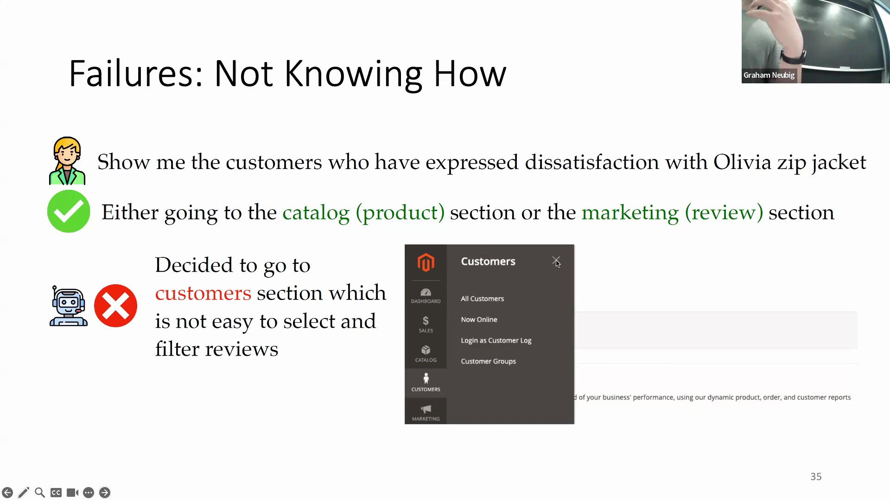
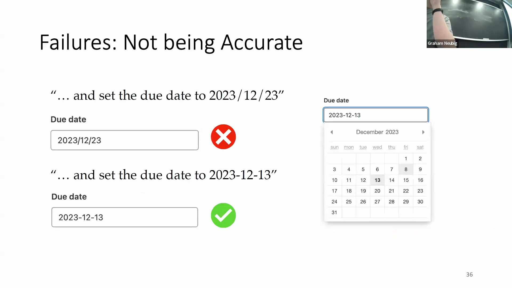

## 智能体增强的训练范式
为突破上述局限并超越基础的提示工程(Prompt Engineering)方法，研究人员正聚焦于三大核心训练范式：上下文学习(In-Context Learning, ICL)、监督微调(Supervised Fine-Tuning, SFT)与强化学习(Reinforcement Learning, RL)。ICL 旨在不更新模型权重(Model Weights)的前提下，通过精心设计的提示引导模型行为；SFT 则依赖大规模专家演示轨迹(Expert Demonstration Trajectories)对模型参数进行优化。RL 代表了更为前沿的技术路径，使智能体能够直接从与环境的实时交互中汲取经验。从零样本提示(Zero-Shot Prompting)向这些结构化训练流程的演进，对于开发能够可靠执行长周期(Long-Horizon)、多步骤工作流(Multi-step Workflows)的智能体而言至关重要。
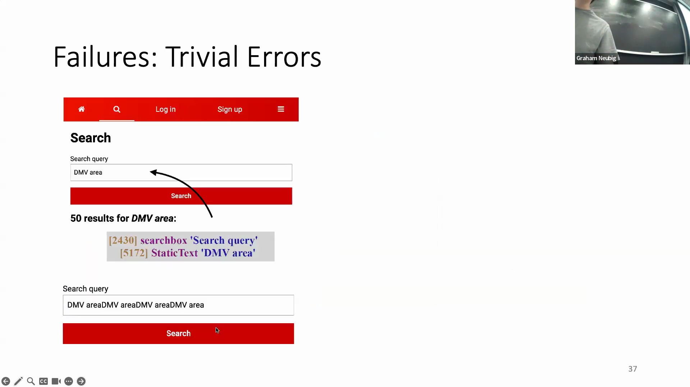
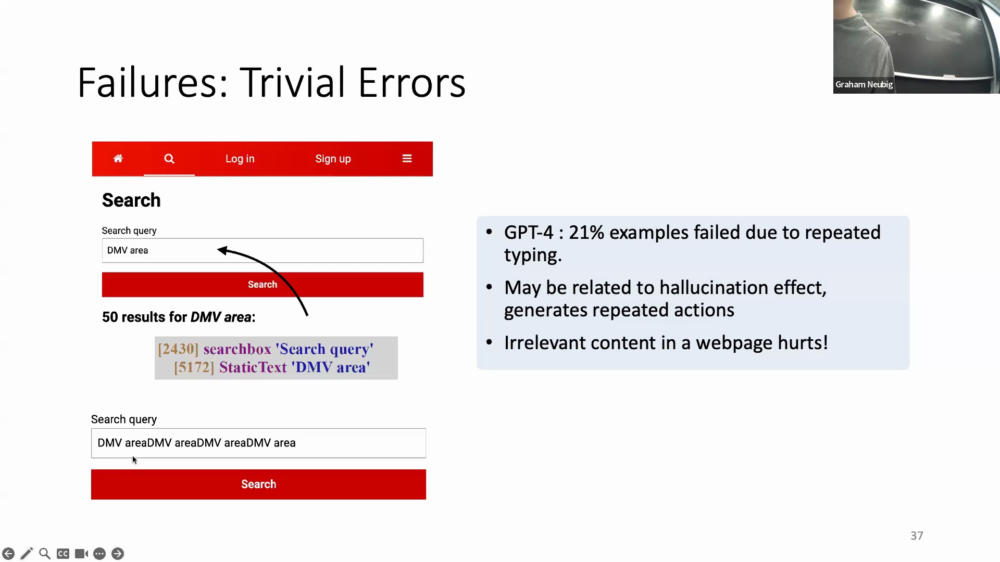
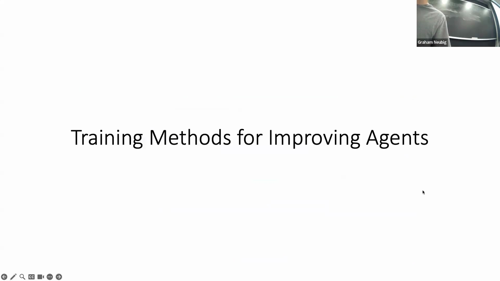

## 上下文学习与提示词结构化
在不更新模型参数的前提下，上下文学习(In-Context Learning)在实现模型行为对齐(Model Alignment)方面依然极为有效。通过引导模型基于精心筛选的输入-输出示例进行条件学习(Conditional Learning)，开发者可精准规范其输出格式与动作序列(Action Sequences)。高效的 ICL 提示词会明确定义观测空间(Observation Space)（如精简的 HTML 结构树或无障碍树(Accessibility Tree)），详细枚举可用的动作空间(Action Space)，并提供融合逐步推理与可执行 `stop/action` 指令的少样本演示(Few-Shot Demonstrations)。此类结构化提示(Structured Prompting)显著降低了格式错误率，并确保模型生成语法合规的动作指令(Syntax-Valid Action Commands)，以便底层执行环境能够准确解析与处理。
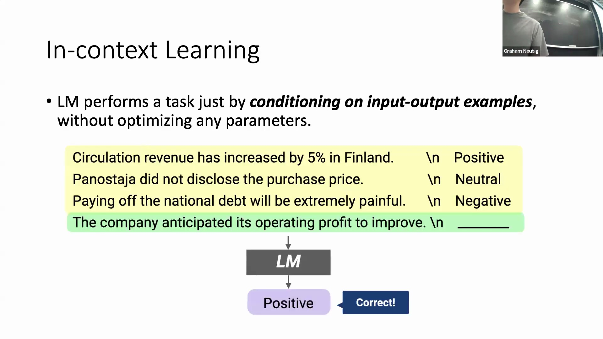
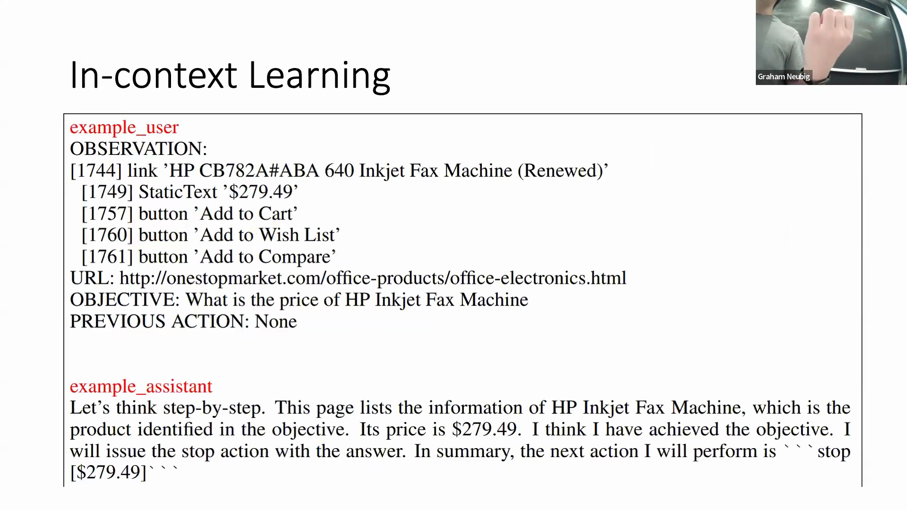

## 监督微调与数据挑战
监督微调(Supervised Fine-Tuning, SFT)通过在海量人类专家轨迹数据集上进行训练（通常基于交叉熵损失(Cross-Entropy Loss)函数）来优化语言模型。尽管 SFT 在固化成功任务模式方面成效显著，但其属于典型的数据密集型(Data-Intensive)方法，且难以高效利用失败样本；若某条执行轨迹仅在最终步骤失败，此前所有有效的推理过程在标准训练中通常会被整体丢弃。为缓解高质量数据稀缺问题，研究人员广泛采用数据增强(Data Augmentation)技术，从 YouTube 教程、维基百科及 Reddit 社区讨论中大规模采集指令数据(Instructional Data)。这些多样化的语料库(Corpora)有效弥合了静态训练数据与动态真实网页交互之间的语义鸿沟。
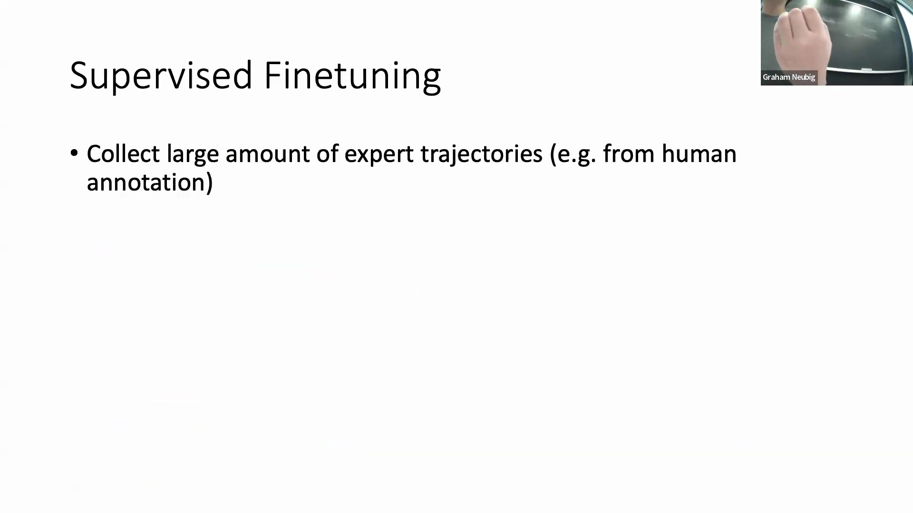
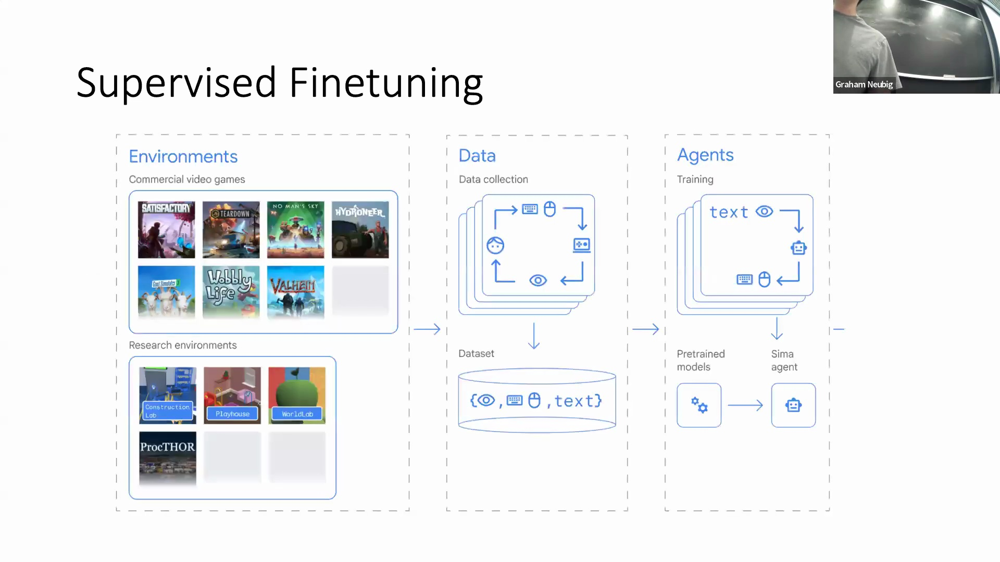
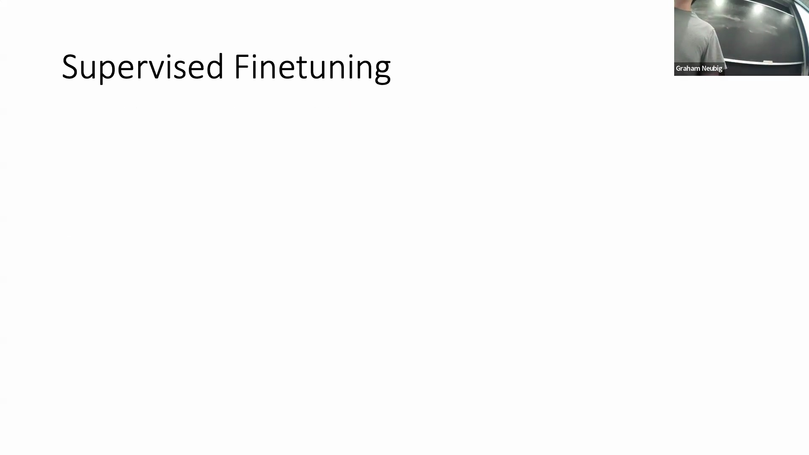

## 基于环境反馈的强化学习
强化学习(Reinforcement Learning, RL)通过引入自动化且由环境驱动的奖励机制(Environment-Driven Reward Mechanisms)，为传统的基于人类反馈的强化学习(Reinforcement Learning from Human Feedback, RLHF)提供了一种极具潜力的替代路径。在 WebArena 等沙盒环境(Sandbox Environments)中，系统可内置任务目标验证器，从而无需依赖人工标注即可提供实时且可扩展的反馈信号。该机制使智能体能够从成败经验中进行迭代学习，并基于实际执行结果(Actual Execution Outcomes)而非静态的人类偏好来持续优化决策策略。尽管该方向仍处于活跃的研究前沿，但基于环境反馈的强化学习无疑是实现完全自主、具备自我进化能力(Self-Evolving Capabilities)的网页智能体的关键基石。
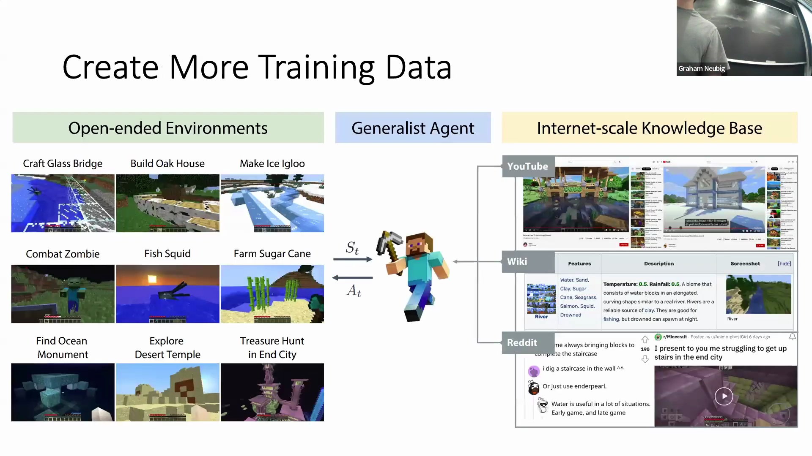
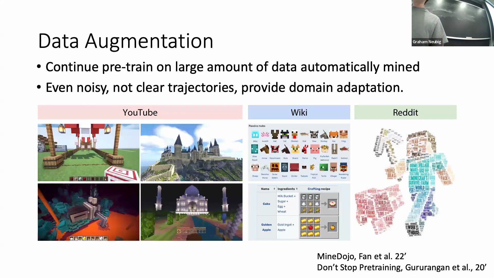
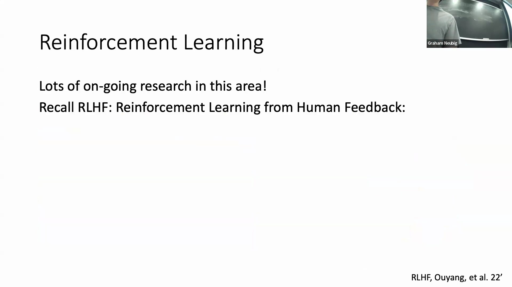

## 未来方向：复杂基准测试与评估
该领域亟需摆脱低复杂度且极易触及性能饱和(Performance Saturation)的任务局限，转向设计更为严谨的基准测试(Benchmarks)，以全面检验智能体的长周期规划(Long-Horizon Planning)、跨域适应能力(Cross-Domain Adaptability)以及稳健的知识整合能力(Knowledge Integration)。WebArena 等平台正是这一范式转变的典范，其要求智能体在协同管理多步目标的同时，深入探索高度多样化且逼真的仿真环境。随着研究边界不断拓展至代码生成智能体(Code Generation Agents)与具身机器人(Embodied Robotics)领域，开发人员在评估指标设计、上下文推理(Contextual Reasoning)优化及环境反馈机制构建方面，仍将面临高度相似的技术挑战。从根本上提升智能体能力，关键在于构建可交互(Interactive)、可复现(Reproducible)的测试环境，从而驱动大模型突破简单的模式匹配(Pattern Matching)，真正迈向自主问题解决(Autonomous Problem Solving)的新阶段。
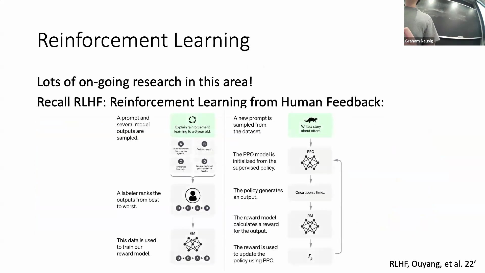
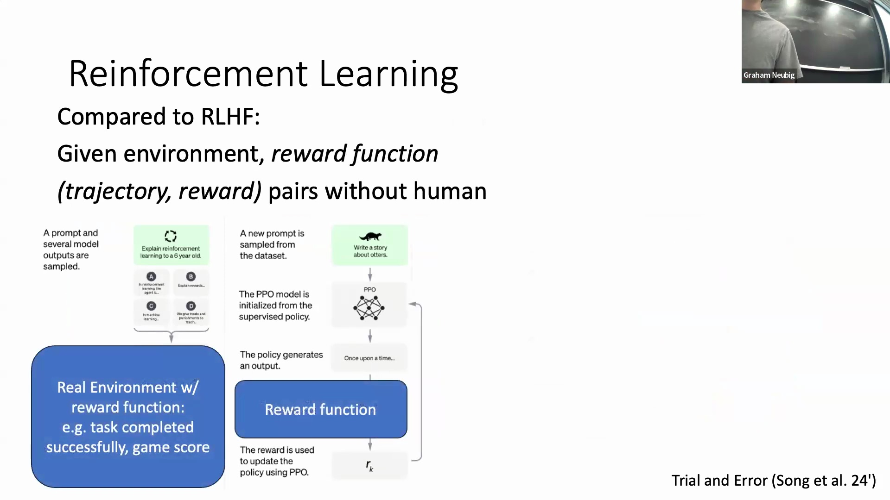
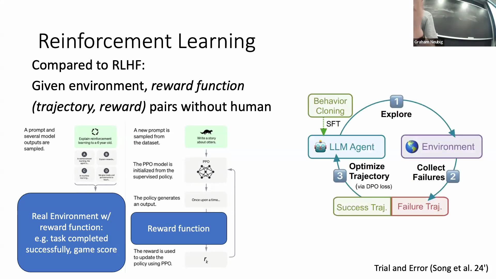
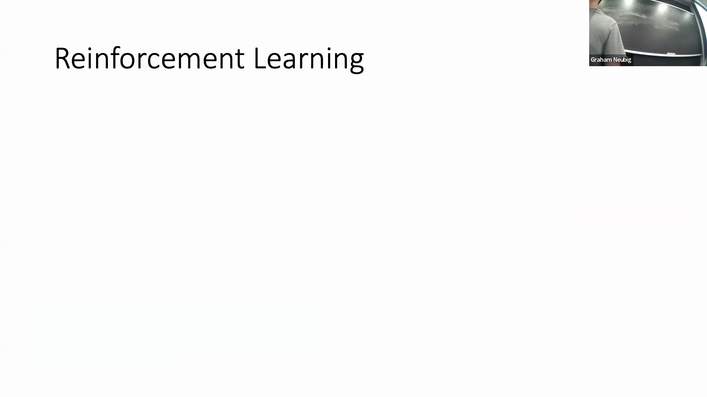
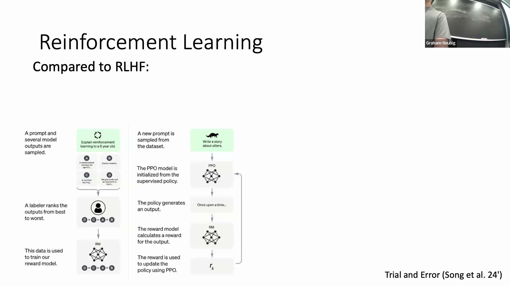