## 复杂推理简介
本讲座探讨了语言模型(Language Models)中的复杂推理(Complex Reasoning)主题，重点讲解了此前未深入涉及的核心概念。推理(Reasoning)从根本上被定义为利用证据和逻辑得出结论并做出判断的过程。尽管推理在语言模型中的具体实现机制仍具一定模糊性，但构建清晰的哲学基础能为理解现代技术方法提供必要的理论背景。
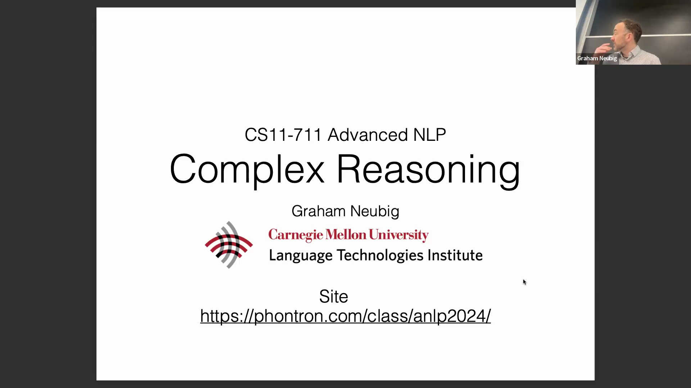

## 形式推理与非形式推理
从哲学视角来看，推理主要划分为两种类型。形式推理(Formal Reasoning)依赖于严格的真值(Truth Value)，使得陈述能够被明确判定为真或假。此类推理主要应用于数学、算法和计算机科学等结构化领域。相比之下，非形式推理(Informal Reasoning)则建立在经验与直觉之上。历史上，非形式推理一直难以通过计算模型进行建模，但随着大型语言模型(Large Language Models, LLMs)的兴起，该领域迎来了重大突破。如需进一步拓展阅读，推荐参考 Huang 与 Chun 撰写的关于大语言模型推理的综述论文，以获取全面的参考资料。
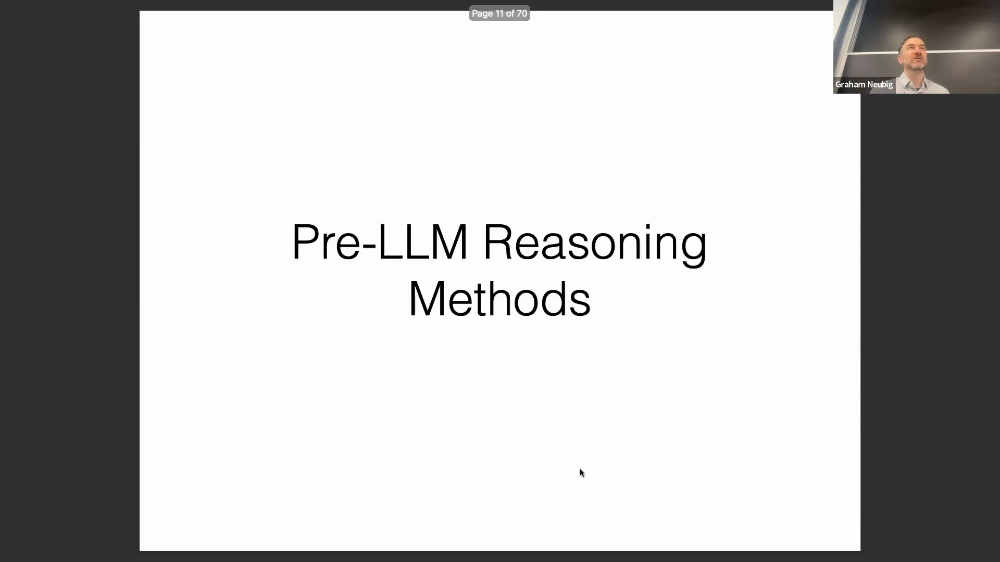

## 核心推理范式：演绎推理、归纳推理与溯因推理
本讲座重点阐述了三种核心推理范式。演绎推理(Deductive Reasoning)遵循严密的逻辑规则，从普遍前提推导出具体且必然的结论（例如：所有哺乳动物都有肾脏；鲸鱼是哺乳动物；因此，鲸鱼有肾脏）。归纳推理(Inductive Reasoning)则从具体观察出发，得出具有可能性或可推广性的结论，其运作机制基于概率而非严格的逻辑蕴涵(Logical Implication)。溯因推理(Abductive Reasoning)涉及从已知事实出发，推断出最合理的解释，其本质是通过反向推导来识别潜在的因果关系（例如：汽车无法启动且地面有一滩液体，由此推测散热器可能发生泄漏）。需要强调的是，应将上述分类视为灵活的指导原则而非僵化的教条，因为现实场景中的推理过程往往在这些范式之间相互交织。
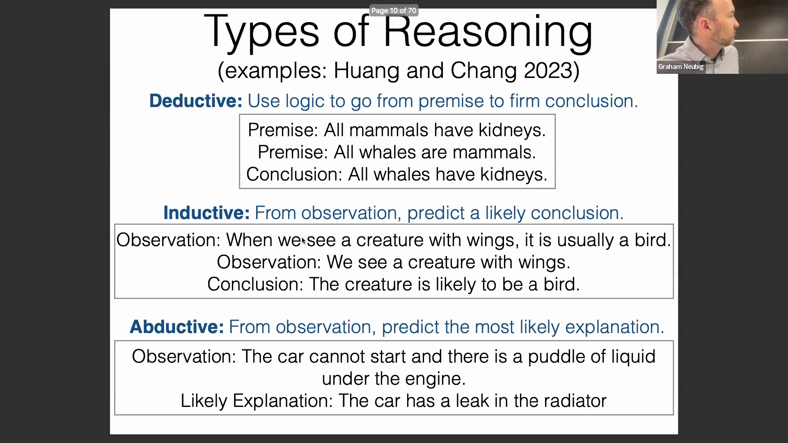

## 大语言模型出现前的形式推理与计算语义学
在深入探讨大语言模型专属技术之前，本讲座首先回顾了前大型语言模型(Pre-LLM)时代的传统方法，特别是计算语义学(Computational Semantics)中的形式推理。这一成熟的研究领域曾为早期基于结构化知识库运行的 AI 系统提供核心支持。其核心机制依赖于形式推导(Formal Derivation)：从明确的前提条件出发，系统性地应用逻辑规则以推导出最终结论。该过程通常借助数理逻辑符号与量词（如全称量词(Universal Quantifier, ∀）和存在量词(Existential Quantifier, ∃）进行形式化表征，从而构建出可严格验证的证明链。
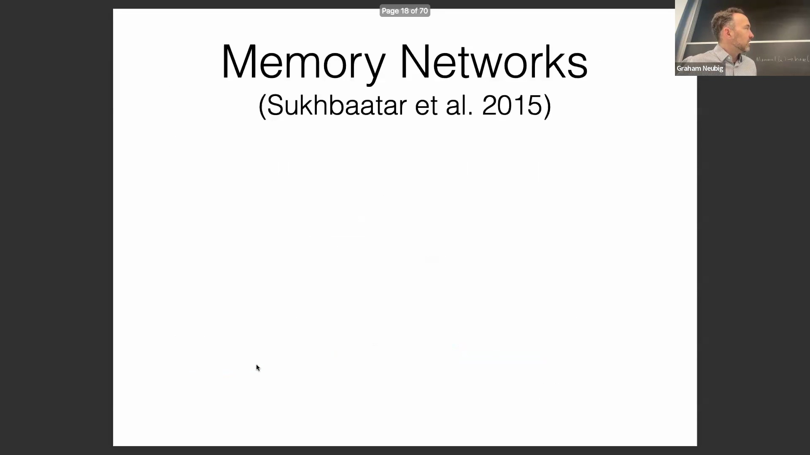

## 形式逻辑与神经网络近似
传统的形式逻辑系统（例如基于 Prolog 构建的系统）能够对知识库执行精确查询。例如，通过追踪数据库中的既定规则，可以明确验证全称命题或多步逻辑条件。相比之下，神经网络(Neural Networks)与大语言模型仅能对上述逻辑能力提供概率性的粗略近似。即便在海量数据上进行预训练，大语言模型在处理严格的全称量词、基于集合的逻辑(Set-theoretic Logic)以及多步逻辑验证时，依然面临显著挑战。尽管思维链(Chain-of-Thought, CoT)等技术使神经模型能够模拟分步推导过程，但它们仍缺乏传统形式系统所具备的数学严谨性。讲座特别推荐了 Blackburn 与 Bos 编写的教材，作为深入理解传统逻辑推导机制的优质参考资料。

## 传统形式推理的局限性
尽管具备高度的精确性，经典的形式推理在实际应用中仍面临显著瓶颈。该方法严格依赖二元真值输入(Binary True/False Inputs)，导致其在处理模糊、概率性或开放现实场景时往往难以适用。此外，随着问题复杂度的提升，异常情形与边缘案例(Edge Cases)的激增使得形式化证明搜索的计算成本呈指数级上升，在实际操作中通常不可行。鉴于此，本讲座将不再过度展开传统形式逻辑的论述。然而，前沿研究已开始探索混合架构，将神经模型集成至证明空间搜索算法(Proof Space Search Algorithms)中，借助神经网络智能地优先探索高概率假设，从而显著加速形式化推导的进程。

---

## 神经定理证明与混合方法
基于经典逻辑(Classical Logic)，近期的研究探索了用于数学验证的神经定理证明(Neural Theorem Proving)。在这种混合方法(Hybrid Methods)中，神经网络被用于在复杂的逻辑演算中搜索并选择最有希望的路径，从而有效地将传统形式推理的严谨性与现代深度学习(Deep Learning)的自适应能力相结合。
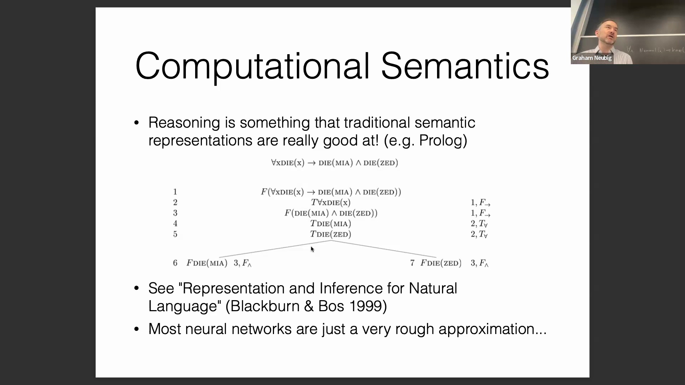

## 用于扩展上下文管理的记忆网络
随着大型语言模型(Large Language Models, LLMs)逐渐逼近长上下文窗口(Long Context Windows)的实际极限，记忆网络(Memory Networks)提供了一种颇具吸引力的架构替代方案。此类系统配备了针对专用记忆库的显式读写操作(Explicit Read/Write Operations)。其工作机制类似于注意力机制(Attention Mechanism)，通过计算内积(Inner Product)与 Softmax 权重来检索并聚合相关的记忆嵌入(Memory Embeddings)。 
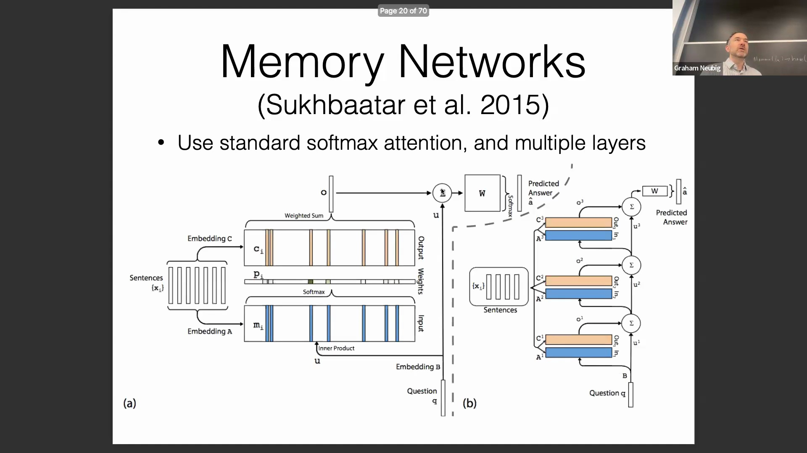
关键在于，它们使模型能够突破静态提示文本(Static Prompt Text)的限制，实现结构化信息的持续更新与存储。这一特性有效缓解了当前大语言模型的一大核心局限，使得记忆网络成为未来长期知识保留(Long-term Knowledge Retention)与动态状态管理(Dynamic State Management)研究中最具潜力的方向之一。

## 符号推理与程序化执行
另一种尚未被充分挖掘的路径涉及符号推理(Symbolic Reasoning)与显式的程序化执行(Programmatic Execution)。该方法摒弃了对概率性文本生成(Probabilistic Text Generation)的单一依赖，转而应用过滤、求最大值或数据重排等确定性函数(Deterministic Functions)来引导注意力机制，进而提取精确答案。 
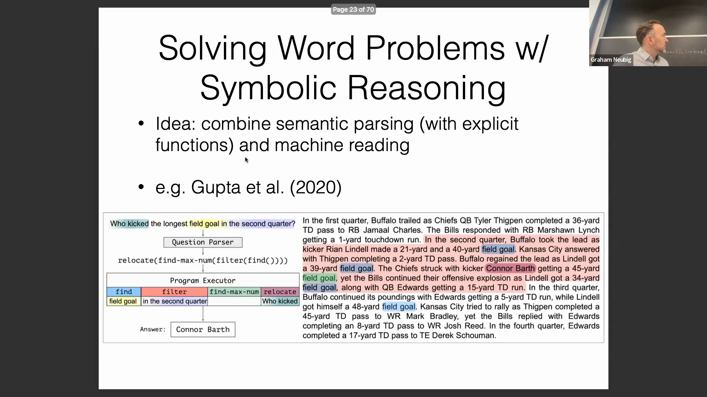
鉴于神经网络在大规模数据集中进行精确数值比较(Numerical Comparison)或严格逻辑过滤(Logical Filtering)时往往表现欠佳，集成符号操作(Symbolic Operations)可直接弥补此类计算短板。尽管当前该方法的光芒常被纯粹的提示工程(Prompt Engineering)技术所掩盖，但这一范式在涉及精确集合操作(Set Operations)与多步逻辑验证(Multi-step Logical Verification)的混合模型架构中，仍具备极高的探索价值。
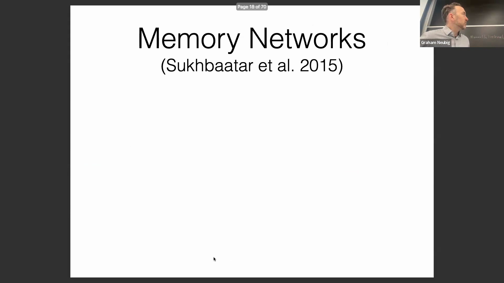

## LLM 出现前方法的局限性与向现代提示技术的过渡
前述经典与混合技术的探讨，凸显了当前大语言模型仍面临的一系列持续挑战，尤其是在处理多步集合操作、维护长期记忆(Long-term Memory)以及精准过滤大规模文本语料库(Large-scale Text Corpora)等方面。尽管这些传统方法提供了宝贵的理论洞察(Theoretical Insights)，本讲座后续将转向探讨当前驱动现代人工智能性能提升的主流技术路径。
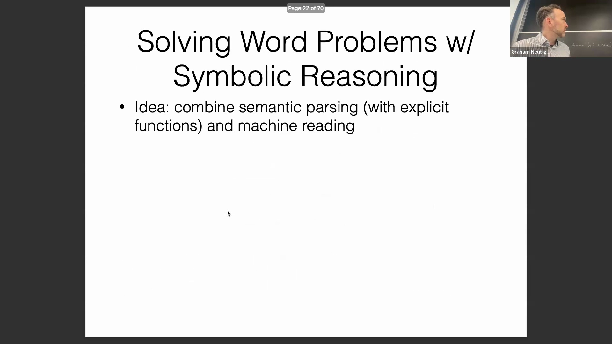

## 思维链回顾与零样本变体
标准的思维链(Chain-of-Thought, CoT)提示技术通过在输入提示(Prompt)中嵌入逐步推导过程来提升模型表现，引导模型在输出最终答案前先生成中间推理步骤(Intermediate Reasoning Steps)。该方法对于直接预测易出错的复杂任务尤为有效。其简化变体——零样本思维链(Zero-Shot CoT)——仅需在提示末尾追加“让我们一步步思考(Let's think step by step)”的指令，即可在无需提供少量示例(Few-shot Examples)的情况下，有效激发模型内在的推理潜能。
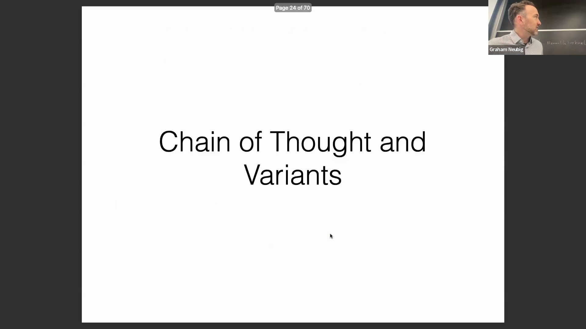
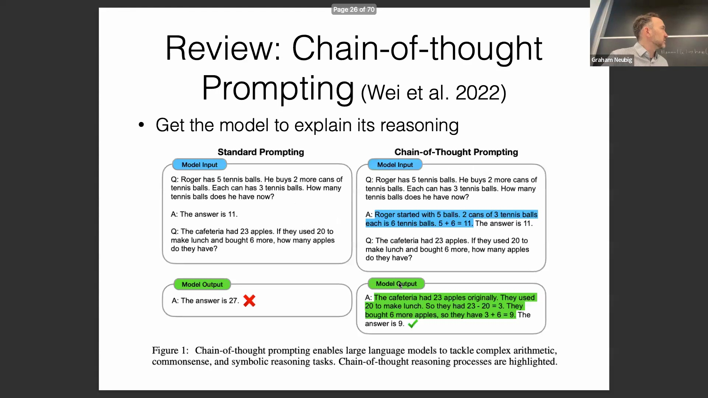

## 自问（Self-Ask）提示策略
自问(Self-Ask)等高级推理技术旨在解决一个核心痛点：标准大语言模型通常缺乏自主生成或解答后续问题(Follow-up Questions)的训练。 
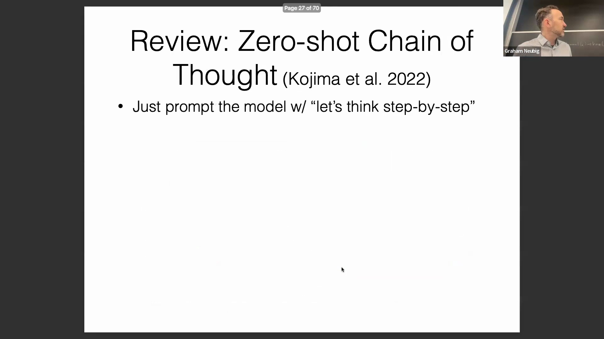
该方法通过显式提示模型评估是否需要提出中间问题(Intermediate Questions)，从而将复杂查询拆解为更易处理的子问题(Sub-problems)。模型依次求解每个中间步骤，并将结果聚合以形成最终且准确的结论。这种机制通过强制模型进行更结构化的内部对话(Internal Dialogue)，显著提升了其在多跳推理任务(Multi-hop Reasoning Tasks)中的表现。

## 检索增强型思维链
为弥补推理过程中的内部知识缺口(Internal Knowledge Gaps)，检索增强型(Retrieval-Augmented)方法将外部数据源直接整合至思维链流程中。当模型在推导过程中触及需特定事实支撑的步骤时，可自动触发针对维基百科等外部知识库的 BM25 检索算法(BM25 Search Algorithm)。获取的文档随后被动态注入提示词中，使模型能够基于经核实的外部证据继续逻辑推演，而非单纯依赖模型内部的参数记忆(Parametric Memory)。

这种“推理-检索-综合”的迭代循环(Iterative Loop)，为处理事实依赖型与知识密集型查询(Knowledge-intensive Queries)构建了一套极具鲁棒性的框架。
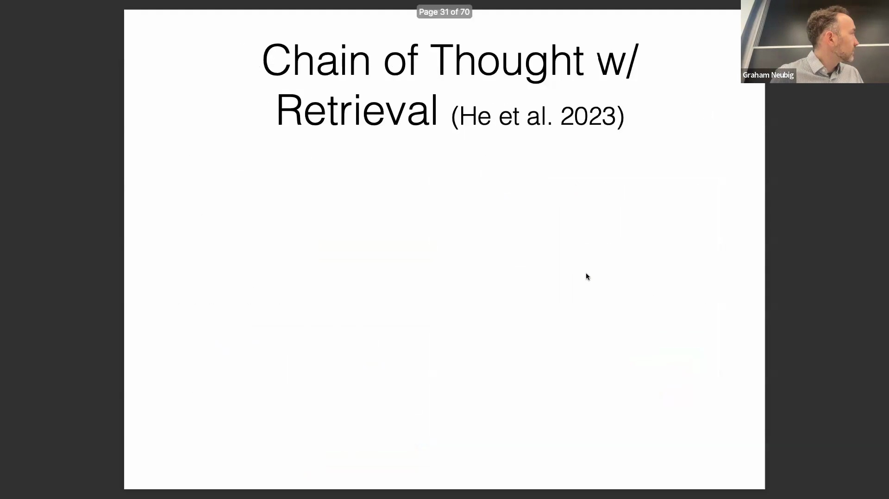
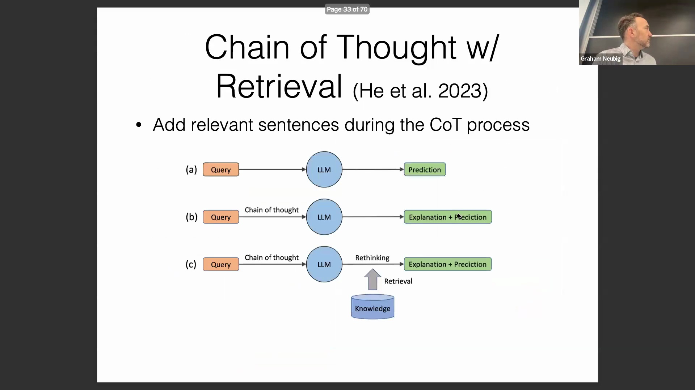

## 多语言推理的设计选择
在跨语言场景(Cross-lingual Settings)下部署思维链技术时，面临一项关键的架构决策(Architectural Decision)：是沿用用户的母语进行推理，还是切换至英语。鉴于主流大语言模型主要在英语语料库(English Corpora)上进行了深度预训练与优化，将中间推理步骤转化为英语通常能实现更稳健、精准的逻辑推演。 
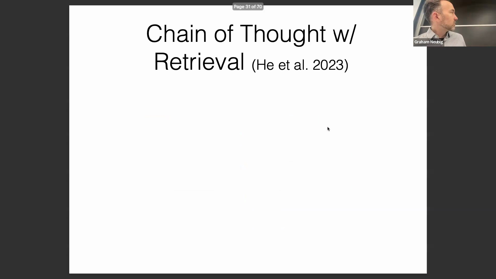
研究人员与开发者在构建多语言 AI 系统(Multilingual AI Systems)时，必须审慎权衡语言保真度(Linguistic Fidelity)与计算推理能力之间的取舍。因为推理语言的选择将对最终输出质量(Output Quality)产生决定性影响。
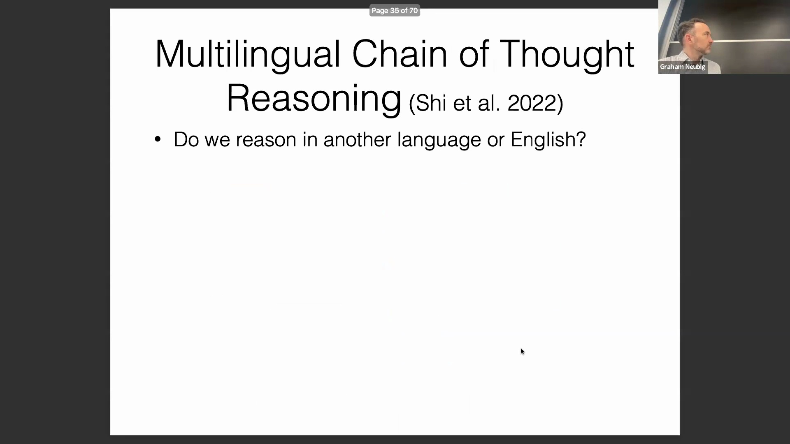

---

## 多语言思维链：语言选择与性能表现
在跨语言场景中部署思维链(Chain-of-Thought, CoT)技术时，面临一项关键的架构决策(Architectural Decision)：模型应使用用户的母语进行推理，还是切换至英语？实证研究(Empirical Studies)一致表明，在英语中进行中间推理过程(Intermediate Reasoning Process)能取得显著更优的结果，在各种测试语言中平均带来约 7 个百分点的性能提升(Performance Improvement)。即使最终输出需被翻译回目标语言(Target Language)进行评估，英语推理步骤仍能使模型调用其训练最充分、优化程度最高的语言处理路径。有趣的是，用户通常倾向于认为模型在使用英语时显得更为“智能”，这凸显了模型感知能力(Perceived Capability)与训练数据分布(Training Data Distribution)的高度相关性，而非取决于其固有的逻辑推理能力(Inherent Logical Reasoning Capability)。
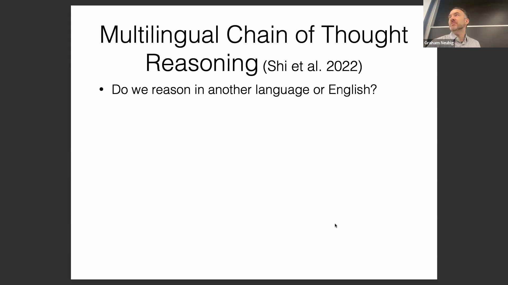
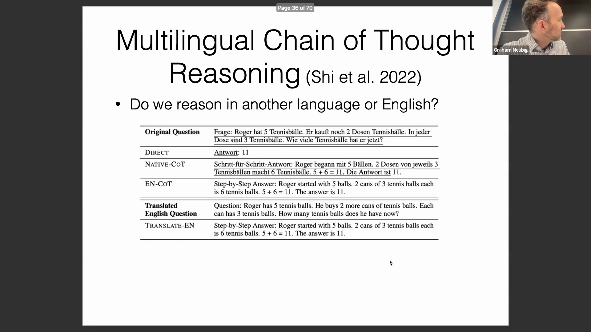
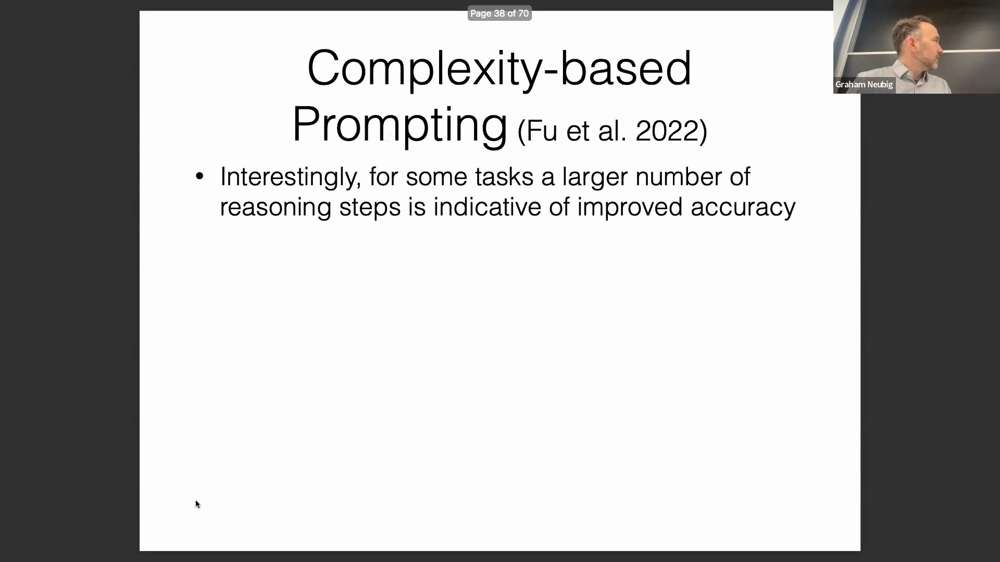

## 推理顺序：解释优先 vs. 预测优先
模型生成输出(Generation Order)的顺序对最终结果的准确性(Accuracy)具有深远影响。对于现代前沿架构(State-of-the-Art Architectures)而言，在给出最终答案*之前*优先生成解释或推理链(Reasoning Chain)，其表现始终优于“答案优先”的相反顺序。这种“解释优先”(Explanation-First)的方法使模型能够将复杂的提示词(Prompt)拆解为更简单、易于处理的子步骤，这一特性在处理数学计算或多跳逻辑任务(Multi-hop Reasoning Tasks)时尤为关键。尽管早期或规模较小的模型难以稳定地从中获益，但当前的高级模型(Advanced Models)已高度依赖这一生成机制。中间推理链的质量与最终预测结果(Final Prediction)高度正相关；早期推导步骤中出现的错误往往会引发级联效应(Error Cascading)，进而导致最终答案失效。
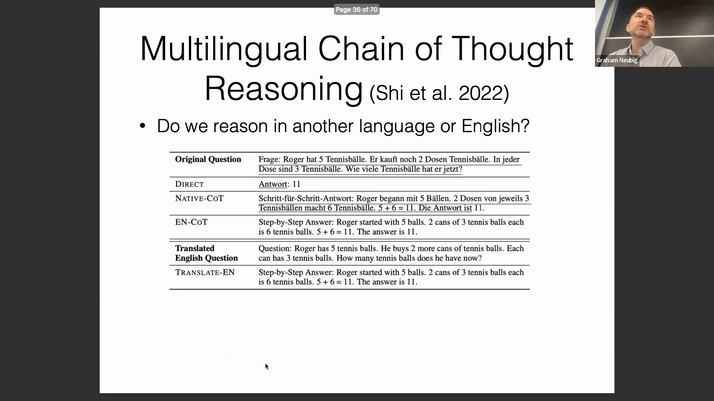
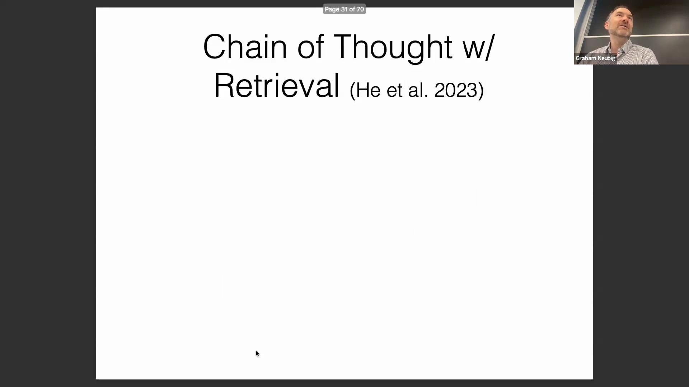
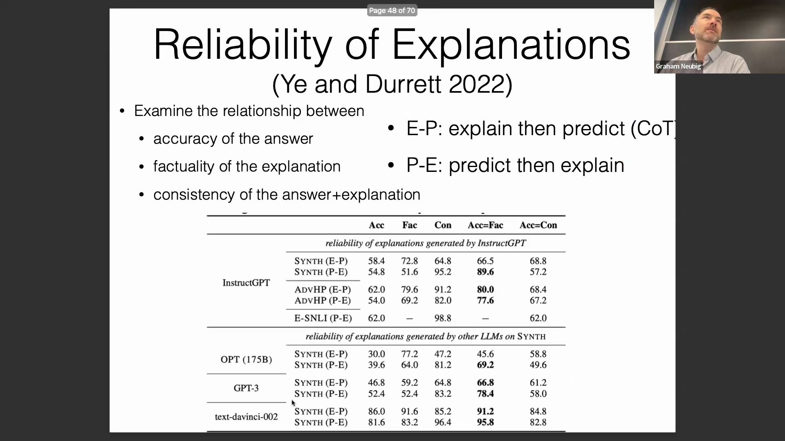

## 推理链长度与自一致性过滤
除生成顺序外，推理链(Reasoning Chain)的长度与复杂性(Complexity)亦是评估准确性的可靠参考指标(Proxy Metric)。自然生成(Natural Generation)的较长推理链通常包含更详尽的细节与更严密的逻辑，相较于简短直接的推理链，在同类问题上往往能带来约 15% 的性能提升。这一实证观察(Empirical Observation)可转化为一种实用的优化策略：通过对模型进行多次采样(Sampling)生成多条推理路径(Reasoning Paths)，优先筛选出更长、更详尽的高质量推理链，并仅针对这些输出应用自一致性(Self-Consistency)（即多数投票机制(Majority Voting)）。通过过滤掉较短且置信度(Confidence Level)较低的路径，仅对更全面的路径进行投票聚合，可显著提升模型的整体任务准确率(Task Accuracy)。
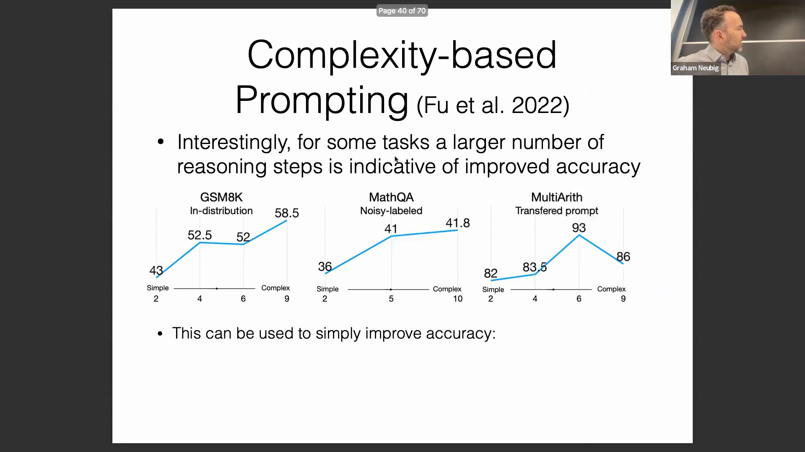

## 大语言模型中涌现能力的假象
长期以来，思维链一直被归类为一种“涌现能力”(Emergent Ability)——即只有当模型规模(Model Scale)超越特定阈值（例如 1750 亿参数(Parameters)）后，才会突然且显著显现的模型技能。起初，这一现象显得颇为神秘，因为随着模型参数的扩展，其在复杂推理任务(Complex Reasoning Tasks)上的表现仿佛一夜之间从接近随机水平跃升至高度精准。然而，近期的系统性研究(Systematic Studies)已揭示了这一性能跃升的本质，指出所谓的“涌现能力”在很大程度上是受特定性能衡量方式(Performance Metrics)与多步序列任务(Multi-step Sequential Tasks)的数学特性共同影响而产生的评估假象(Evaluation Artifact)。
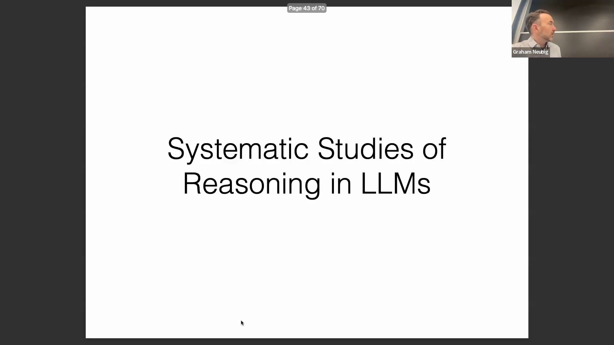

## 涌现现象背后的数学现实
随着模型规模的扩大，其基础的下一个词元预测(Next-Token Prediction)准确率会呈现出渐进且平滑的提升趋势。然而，成功解决一个推理问题，要求模型在多个关键决策点(Critical Decision Points)（例如 5 至 8 步数学运算或逻辑推导）上连续且正确地预测一系列词元。若假设每一步预测均具有独立的正确概率(Independent Correctness Probability)，则整体任务的成功率(Overall Success Rate)即为各步骤概率的连乘积。从数学角度审视，对一条渐进上升的准确率曲线执行幂运算(Power Operation)（如 5 次方或 8 次方），会将其原本平滑、渐进的斜率转化为陡峭的 S 型曲线(Sigmoid Curve)。这种数学变换制造了能力突然“涌现”的视觉假象(Visual Illusion)，而实际上，它仅仅是基础词元预测能力逐步提升所引发的复合累积效应(Compound Cumulative Effect)。
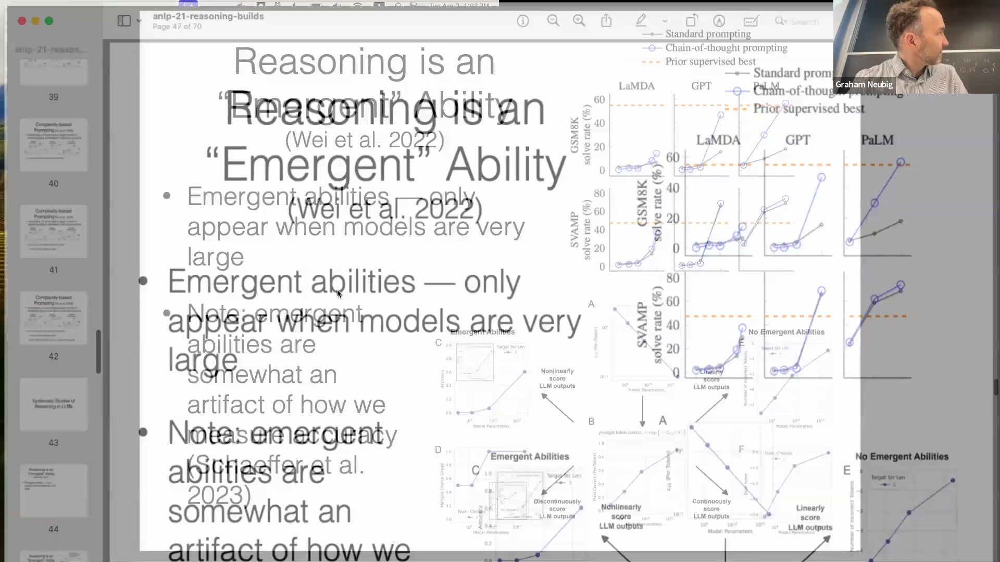

---

## 涌现能力的数学基础
涌现推理能力(Emergent Reasoning Ability)背后看似“神奇”的现象，可通过基础概率论(Fundamental Probability Theory)加以解释。通过在电子表格中模拟多步推导过程(Multi-step Derivation Process)可以清晰地观察到：尽管模型对下一个词元(Next Token)的预测准确率是逐步提升的，但要完整且正确地执行整个推理链(Reasoning Chain)，则需对多个独立步骤的概率进行复合计算。当这些渐进的性能增益在五个或更多关键决策点(Critical Decision Points)上经历幂运算(Power Operation)时，最终的性能曲线(Performance Curve)将从平滑的渐变转变为陡峭且看似不连续的跃升。这从数学层面解释了为何复杂推理能力往往仅在模型规模(Model Scale)达到特定阈值后才会呈现突然“涌现”的表象。

## 衡量假象与评估策略
所谓的“涌现能力”(Emergent Abilities)在很大程度上是由模型性能评估方式所导致的衡量假象(Measurement Artifact)。即使在单词元任务(Single-Token Task)中，只要模型的置信度(Confidence Level)未超越其他备选候选项，其准确率(Accuracy)便会维持为零，从而呈现出不连续的阶跃函数(Step Function)特征。对于在较小规模模型上开展实验的研究人员而言，过度依赖二元准确率指标(Binary Accuracy Metrics)可能会掩盖模型渐进式的性能提升。相反，通过评估推理链的对数似然(Log-Likelihood)，能够获得一条更为平滑且信息密度更高的曲线，从而更精准地捕捉基础词元预测能力的渐进式提升。

## 推理链的事实准确性与一致性
除最终答案的准确性外，近期研究还严格评估了模型生成解释的事实准确性(Factual Accuracy)，以及推导过程与预测答案之间的内部一致性(Internal Consistency)。研究人员利用包含可验证数学步骤的合成数据集(Synthetic Datasets)进行测试，发现能力更强的模型在其推理链与最终输出之间展现出高度的一致性。随着现代模型架构在思维链(Chain-of-Thought, CoT)范式上接受深度训练，此类一致性与事实依据有望得到进一步强化，从而确保模型的内部逻辑能够可靠地支撑其最终结论。

## 用于思维链训练的合成数据生成
提升模型推理能力的核心途径之一，是利用大规模合成思维链数据集进行训练。以微软 Orca 项目为代表的代表性方法，利用 GPT-4 与 GPT-3.5 等前沿模型(Frontier Models)生成了数百万条复杂指令及其对应的详细推导过程。通过将这些高性能“教师”模型(Teacher Models)的推理过程进行知识蒸馏(Knowledge Distillation)并构建专用数据集，研究人员在复杂任务上实现了显著更高的准确率，其性能大幅超越了 Alpaca 或 Vicuna 等参数量较小且指令微调(Instruction Tuning)针对性较弱的模型。

## 逐步奖励建模
另一种替代且高效的训练策略是引入针对单个推导步骤的细粒度人类反馈(Fine-grained Human Feedback)，而非仅关注最终答案。通过为每个逻辑步骤收集二元评估标签（如正向/负向反馈），研究人员成功训练出一种奖励模型(Reward Model)，该模型能够在推理链早期精准识别错误推导。该方法支持采用过程监督(Process Supervision)对模型进行优化，从而提升那些在每一阶段均保持逻辑完整性(Logical Integrity)的推理路径的权重。其关键优势在于，该方法无需依赖已验证的最终答案，从而使得在缺乏标准答案(Ground-Truth)的广泛开放式问题(Open-ended Problems)上进行模型训练成为可能。

## 溯因推理与模式学习
最后，讲座探讨了溯因推理(Abductive Reasoning)在机器学习前沿领域的应用，重点聚焦于模型直接从观测数据模式(Observed Data Patterns)中学习底层规则与解释机制的能力。该方向的目标不仅限于记忆输出结果，更在于推断出数据生成背后的最合理因果或逻辑原理(Causal or Logical Principles)，从而推动模型向更深入、更具泛化能力(Generalization Capability)的复杂系统理解迈进。

---

## 溯因推理与从数据中发现规则
本讲座在大语言模型(Large Language Models, LLMs)的语境下介绍了溯因推理(Abductive Reasoning)，重点探讨模型发现并解释观测数据模式(Observed Data Patterns)底层规则的能力。通过引入直观的物理示例（例如判断基座上何种积木组合会触发声音），该方法旨在超越简单的模式记忆(Memorization)，推导出具备泛化能力(Generalization Capability)的通用原则。该方法具有显著价值，主要体现于两点：其一，它能生成人类可解释的说明(Human-Interpretable Explanations)，从而加速科学探究(Scientific Discovery)；其二，它能提升模型在大规模任务中的表现一致性(Consistency)。通过从输入输出对(Input-Output Pairs)中抽象出通用规则，模型能够更高效地泛化至未见场景(Novel Scenarios)。其运作机制类似于程序归纳(Program Induction)，但已突破严格的代码生成范畴，扩展至涵盖语法结构、逻辑解释(Logical Interpretations)及更广泛的概念框架(Conceptual Frameworks)。
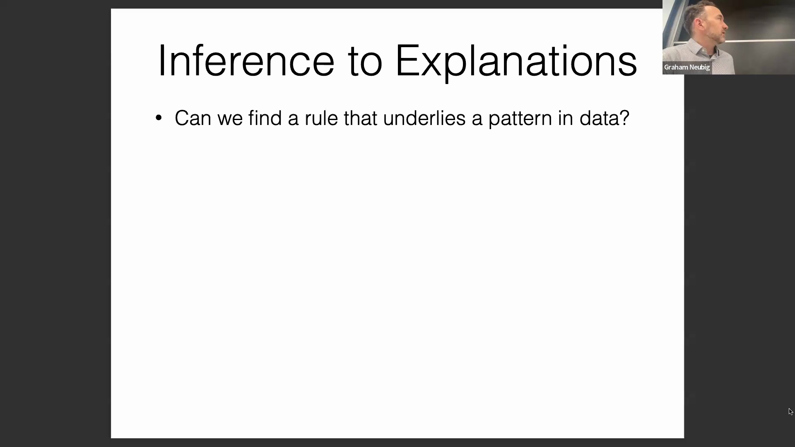

## 假设生成与迭代验证
近期基于大语言模型的规则归纳(Rule Induction)方法通常以假设生成(Hypothesis Generation)为起点。模型通过分析输入输出对数据集，预测潜在的支配性规则(Dominant Rules)（例如“始终选取最小值”）。随后，生成的假设将接受严格评估，评估途径包括利用符号评估器(Symbolic Evaluators)验证程序化规则，或通过提示(Prompting)第二个大语言模型进行逻辑校验。系统将假设驱动的输出(Hypothesis-Driven Outputs)与预期标准答案(Ground Truth)进行比对，以验证其准确性。错误预测将提供针对性反馈(Feedback)，驱动迭代优化循环(Iterative Optimization Loop)，促使模型逐步推导出更复杂、更精确的解释性规则(Explanatory Rules)。
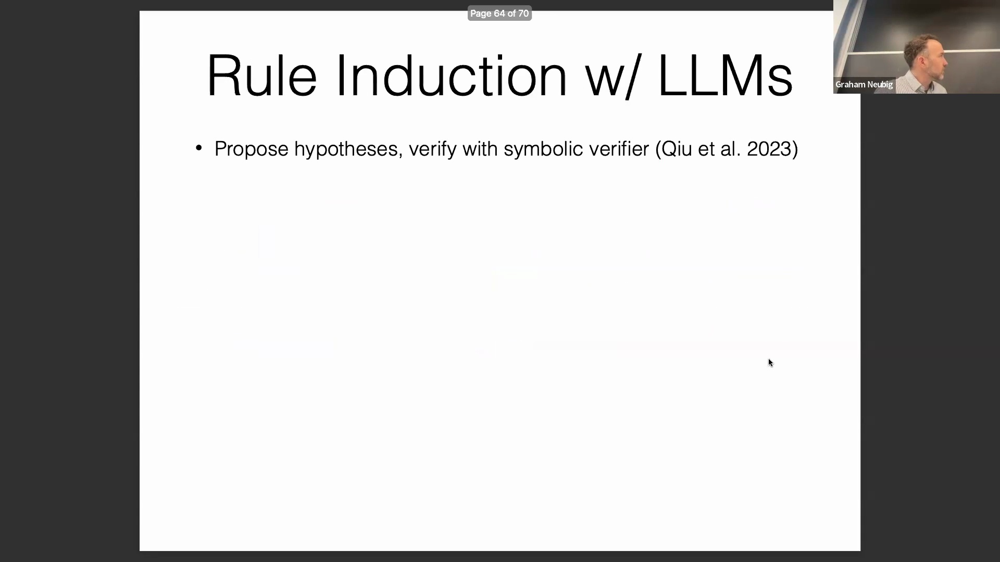
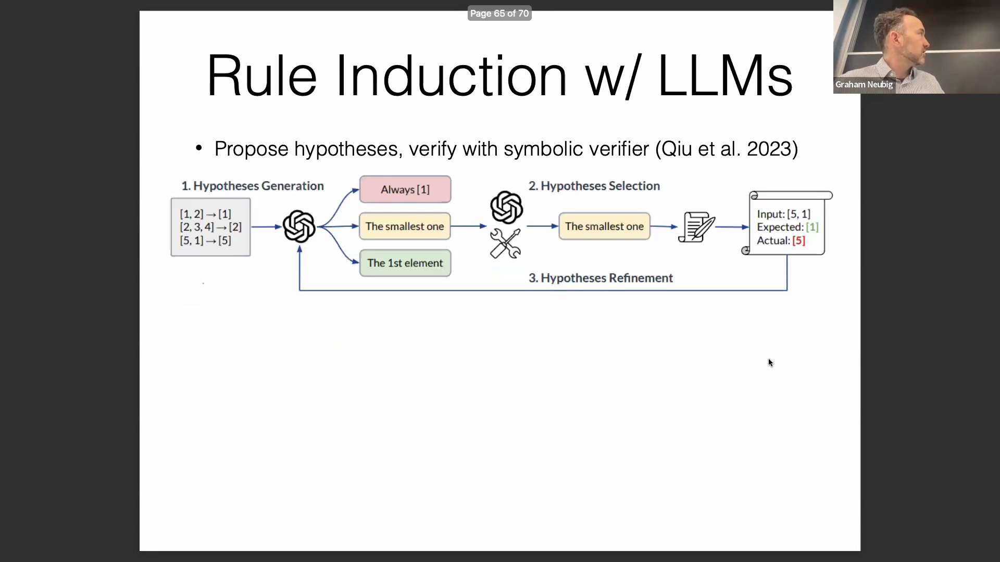

## 从思维链推导中提取规则
另一种替代方案是将规则提取(Rule Extraction)直接嵌入思维链(Chain of Thought, CoT)生成过程中。在处理复杂计算任务（如九进制算术(Base-9 Arithmetic)）时，模型首先生成逐步推导过程(Step-by-Step Derivations)。若最终答案经验证为正确，系统则推断其底层推理(Underlying Reasoning)合理，并进而提取特定的中间规则(Intermediate Rules)。借助提示词(Prompt)中的结构化标记（如 XML 标签(XML Tags)），模型将提取有效的逻辑步骤，并将其存储至动态规则库(Dynamic Rule Repository)中。导致错误答案的推导路径则会被直接丢弃或标记为负样本(Negative Samples)。随后，经筛选的已验证规则库将被应用于后续的演绎推理(Deductive Reasoning)，从而显著提升整体任务准确率(Task Accuracy)。
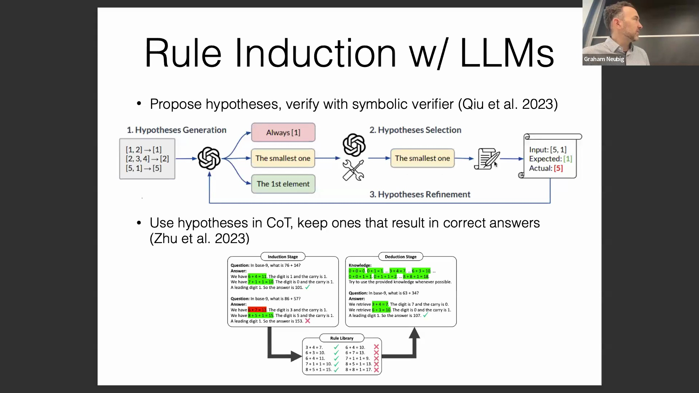

## 自我验证与工具学习的相似性
传统的规则生成范式(Rule Generation Paradigms)通常依赖外部验证器，但近期研究表明，GPT-4 等先进大语言模型已具备自我验证(Self-Verification)能力。通过直接指令模型评估自身假设或推理步骤的有效性，可大幅降低对外部符号评估器的依赖。尽管当前实验多采用简化示例(Simplified Examples)，但其底层机制与先进的工具学习框架(Tool Learning Frameworks)高度契合。诸如生成多候选工具、利用自一致性(Self-Consistency)进行过滤，并仅保留最有效函数等策略，均遵循同一核心逻辑：将海量可能性收敛为一套精简且高效的规则集(Efficient Rule Sets)。
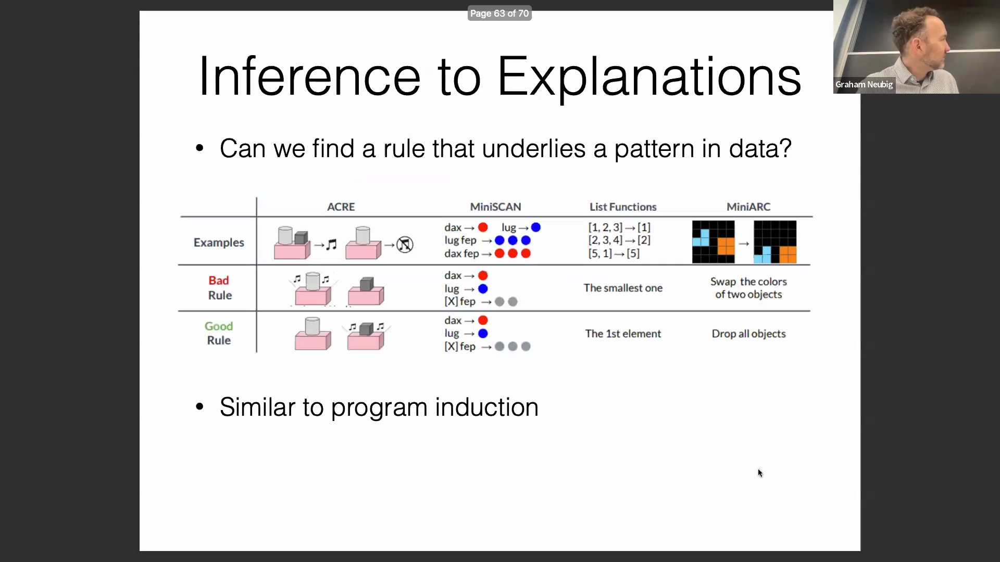
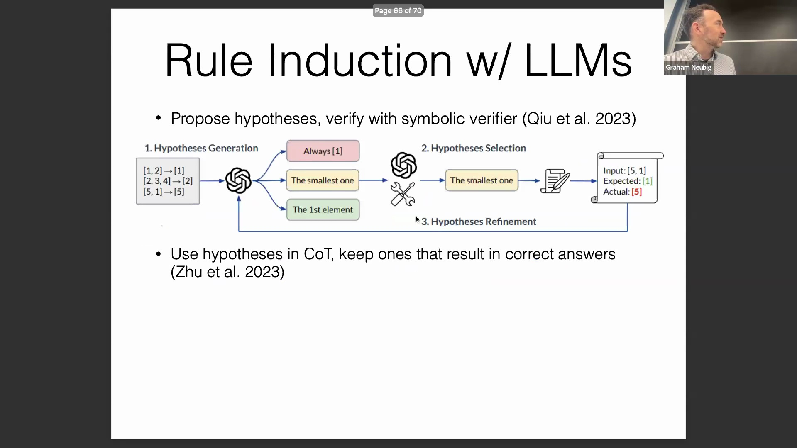

## 文本集合中的差异学习
突破逻辑谜题的范畴，此类规则归纳技术在复杂文本数据分析(Complex Text Data Analysis)领域展现出巨大潜力。一项极具前瞻性的研究方向致力于训练模型，使其能够自动学习并阐明不同文本语料库(Text Corpora)间的细微差异(Nuanced Differences)。通过识别区分不同文档组的底层模式(Underlying Patterns)，大语言模型可为数据集特征生成清晰且人类可读的解释(Human-Readable Explanations)。典型的应用场景包括对比服用活性药物(Active Drugs)与安慰剂(Placebos)患者的医疗报告，使研究人员无需依赖人工标注(Manual Annotation)，即可自动挖掘具有临床意义(Clinical Significance)的差异特征。
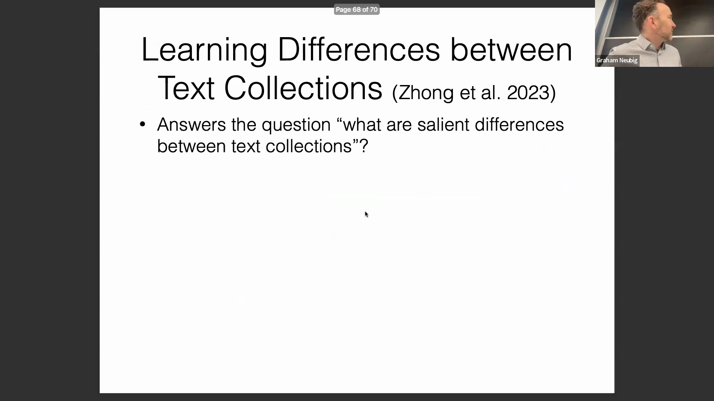
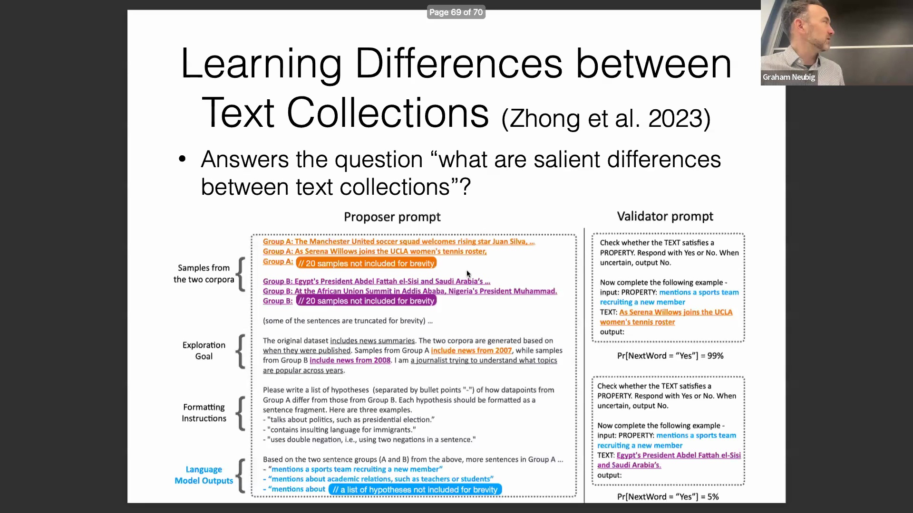

---

## 自动化语料库对比与医学应用
本讲座探讨了溯因推理(Abductive Reasoning)在自动识别两个大规模文本语料库(Large-scale Text Corpora)之间系统性差异(Systematic Differences)方面的应用。推动该方法发展的核心动力源自临床研究(Clinical Research)，尤其是用于分析服用活性药物(Active Drugs)患者与服用安慰剂(Placebo)患者的自然语言报告(Natural Language Reports)。该方法免除了研究人员手动阅读与标注海量主观报告(Subjective Reports)的繁重工作，转而借助语言模型自动提取并阐明两组人群间一致且潜在的差异特征，从而大幅简化临床试验(Clinical Trials)的评估流程。

## 从样本数据生成假设
该方法首先向大语言模型(Large Language Models, LLMs)输入来自两个不同群体的少量代表性样本(Representative Samples)（例如，2007年与2008年的新闻摘要）。通过明确的提示(Prompt)，引导模型扮演分析师角色，生成一份结构化的要点假设列表(Hypothesis List)，用以阐释A组与B组之间可能存在的差异。例如，基于初始样本，模型可能提出假设：“A组提及运动队或学术关联的频率更高。”这一初始步骤将原始的非结构化文本对比(Unstructured Text Comparison)转化为一系列具体且可检验的命题(Testable Propositions)。

## 大规模验证与统计显著性
为缓解大语言模型固有的幻觉(Hallucination)及上下文窗口(Context Window)受限等局限，生成的假设将在规模显著更大的数据集上进行严格验证。在此阶段，每个假设均充当一个二分类器(Binary Classifier)，用于扫描两个语料库中的数千条样本，以统计目标特征的出现频次。随后，这些二值化输出(Binary Outputs)将接受正式的统计显著性检验(Statistical Significance Test)。通过依据 p值(p-value) 对假设进行排序，研究人员可客观判定哪些差异具备统计稳健性(Statistical Robustness)，从而有效过滤噪声，精准提取语料库间最可靠的区分特征(Discriminative Features)。

## 实际研究应用与注意事项
该框架在探索性数据分析(Exploratory Data Analysis)中已被证实极为有效。演讲者分享了一项个人研究项目，旨在对比与人类脑电信号(EEG Signals)高度匹配的句子与匹配度较低的句子。模型成功生成了极具洞察力的假设，指出大语言模型在处理隐喻性语言(Metaphorical Language)及人际交互语境(Interpersonal Contexts)时匹配度相对较弱。尽管这些 AI 生成见解(AI-Generated Insights)为定向研究(Targeted Research)提供了宝贵起点，但演讲者强调了独立验证(Independent Validation)的必要性，并提醒研究者切勿盲目依赖大语言模型输出的统计结果。总而言之，该方法展现了一种变革性的研究范式(Research Paradigm)：语言模型实现了假设生成(Hypothesis Generation)的自动化，在大幅削减人工标注负担(Manual Annotation Burden)的同时，也为复杂的科学探索开辟了全新路径。