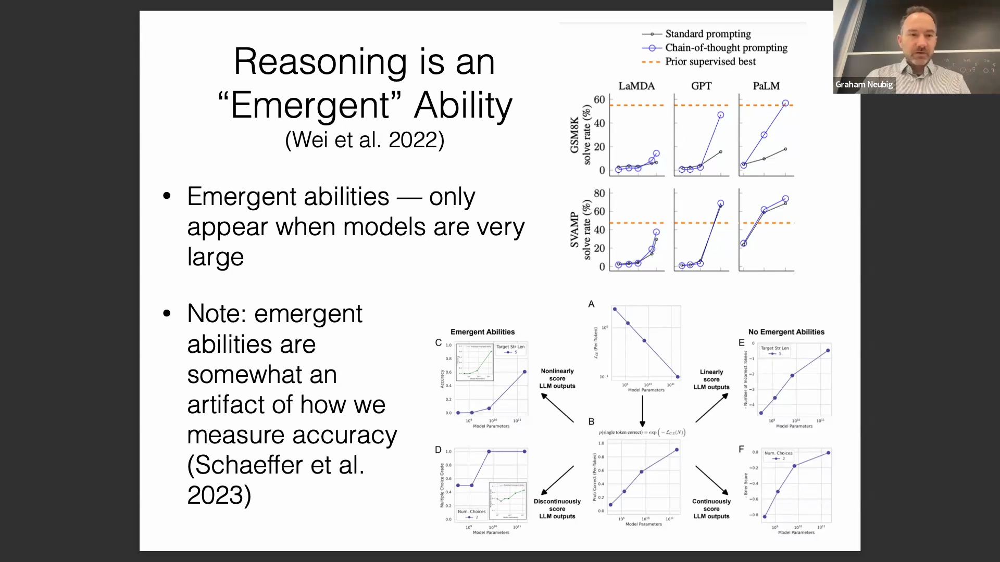
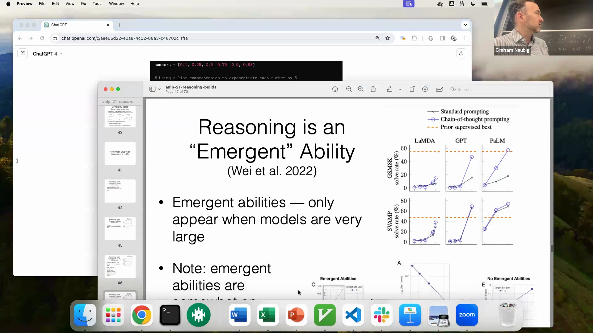
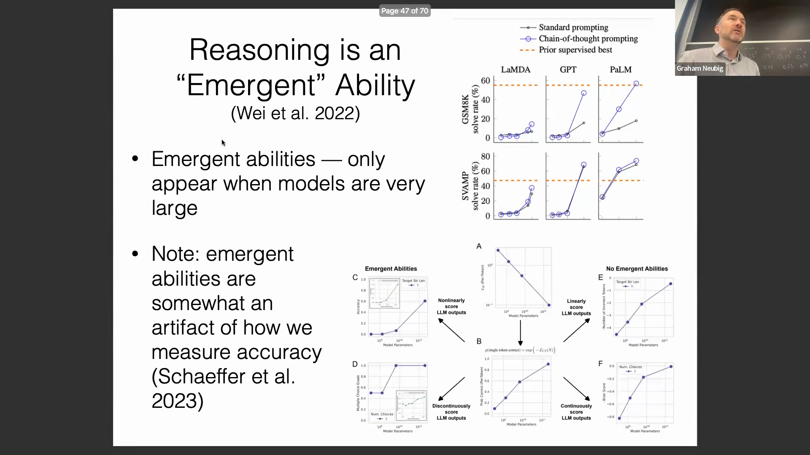
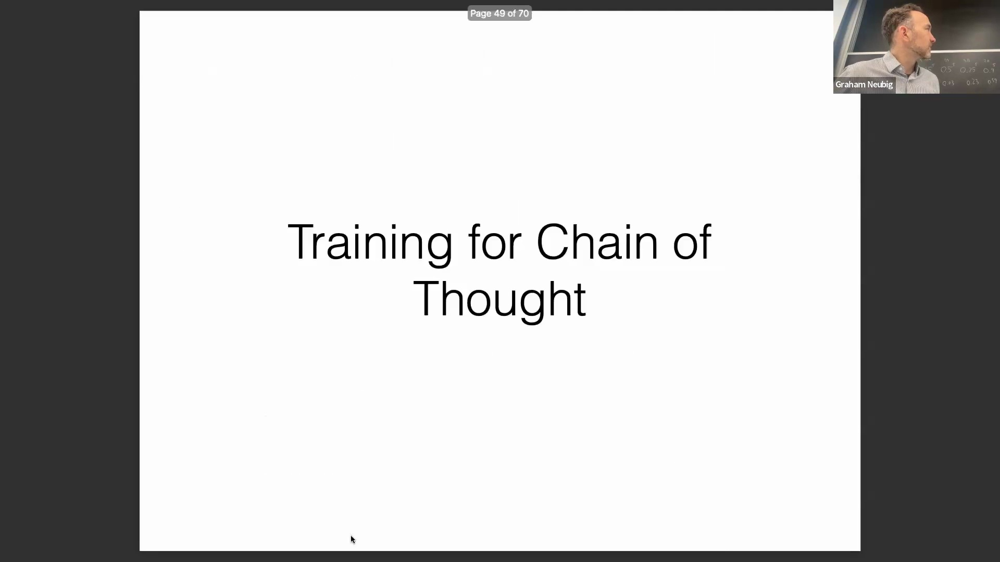
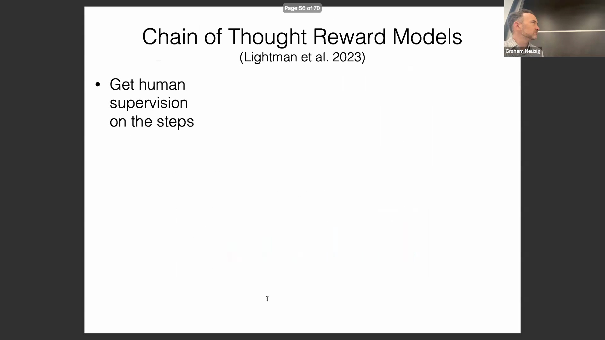
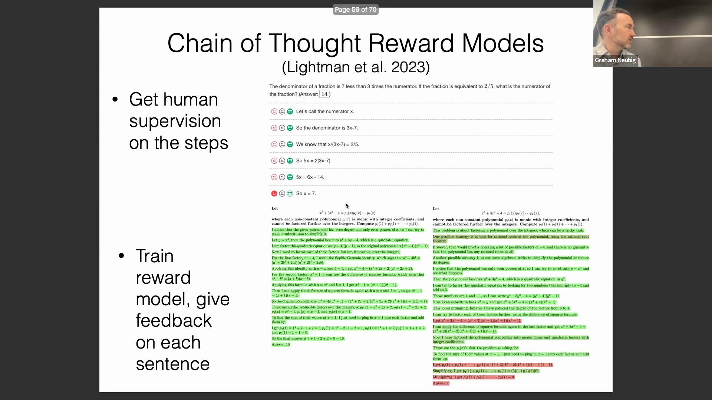
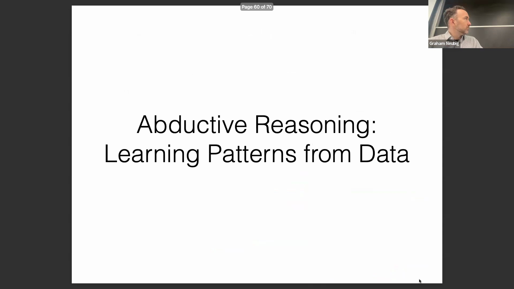

## 涌现能力的数学基础
涌现推理能力(Emergent Reasoning Ability)背后看似“神奇”的现象，可通过基础概率论(Fundamental Probability Theory)加以解释。通过在电子表格中模拟多步推导过程(Multi-step Derivation Process)可以清晰地观察到：尽管模型对下一个词元(Next Token)的预测准确率是逐步提升的，但要完整且正确地执行整个推理链(Reasoning Chain)，则需对多个独立步骤的概率进行复合计算。当这些渐进的性能增益在五个或更多关键决策点(Critical Decision Points)上经历幂运算(Power Operation)时，最终的性能曲线(Performance Curve)将从平滑的渐变转变为陡峭且看似不连续的跃升。这从数学层面解释了为何复杂推理能力往往仅在模型规模(Model Scale)达到特定阈值后才会呈现突然“涌现”的表象。

## 衡量假象与评估策略
所谓的“涌现能力”(Emergent Abilities)在很大程度上是由模型性能评估方式所导致的衡量假象(Measurement Artifact)。即使在单词元任务(Single-Token Task)中，只要模型的置信度(Confidence Level)未超越其他备选候选项，其准确率(Accuracy)便会维持为零，从而呈现出不连续的阶跃函数(Step Function)特征。对于在较小规模模型上开展实验的研究人员而言，过度依赖二元准确率指标(Binary Accuracy Metrics)可能会掩盖模型渐进式的性能提升。相反，通过评估推理链的对数似然(Log-Likelihood)，能够获得一条更为平滑且信息密度更高的曲线，从而更精准地捕捉基础词元预测能力的渐进式提升。

## 推理链的事实准确性与一致性
除最终答案的准确性外，近期研究还严格评估了模型生成解释的事实准确性(Factual Accuracy)，以及推导过程与预测答案之间的内部一致性(Internal Consistency)。研究人员利用包含可验证数学步骤的合成数据集(Synthetic Datasets)进行测试，发现能力更强的模型在其推理链与最终输出之间展现出高度的一致性。随着现代模型架构在思维链(Chain-of-Thought, CoT)范式上接受深度训练，此类一致性与事实依据有望得到进一步强化，从而确保模型的内部逻辑能够可靠地支撑其最终结论。

## 用于思维链训练的合成数据生成
提升模型推理能力的核心途径之一，是利用大规模合成思维链数据集进行训练。以微软 Orca 项目为代表的代表性方法，利用 GPT-4 与 GPT-3.5 等前沿模型(Frontier Models)生成了数百万条复杂指令及其对应的详细推导过程。通过将这些高性能“教师”模型(Teacher Models)的推理过程进行知识蒸馏(Knowledge Distillation)并构建专用数据集，研究人员在复杂任务上实现了显著更高的准确率，其性能大幅超越了 Alpaca 或 Vicuna 等参数量较小且指令微调(Instruction Tuning)针对性较弱的模型。

## 逐步奖励建模
另一种替代且高效的训练策略是引入针对单个推导步骤的细粒度人类反馈(Fine-grained Human Feedback)，而非仅关注最终答案。通过为每个逻辑步骤收集二元评估标签（如正向/负向反馈），研究人员成功训练出一种奖励模型(Reward Model)，该模型能够在推理链早期精准识别错误推导。该方法支持采用过程监督(Process Supervision)对模型进行优化，从而提升那些在每一阶段均保持逻辑完整性(Logical Integrity)的推理路径的权重。其关键优势在于，该方法无需依赖已验证的最终答案，从而使得在缺乏标准答案(Ground-Truth)的广泛开放式问题(Open-ended Problems)上进行模型训练成为可能。

## 溯因推理与模式学习
最后，讲座探讨了溯因推理(Abductive Reasoning)在机器学习前沿领域的应用，重点聚焦于模型直接从观测数据模式(Observed Data Patterns)中学习底层规则与解释机制的能力。该方向的目标不仅限于记忆输出结果，更在于推断出数据生成背后的最合理因果或逻辑原理(Causal or Logical Principles)，从而推动模型向更深入、更具泛化能力(Generalization Capability)的复杂系统理解迈进。
