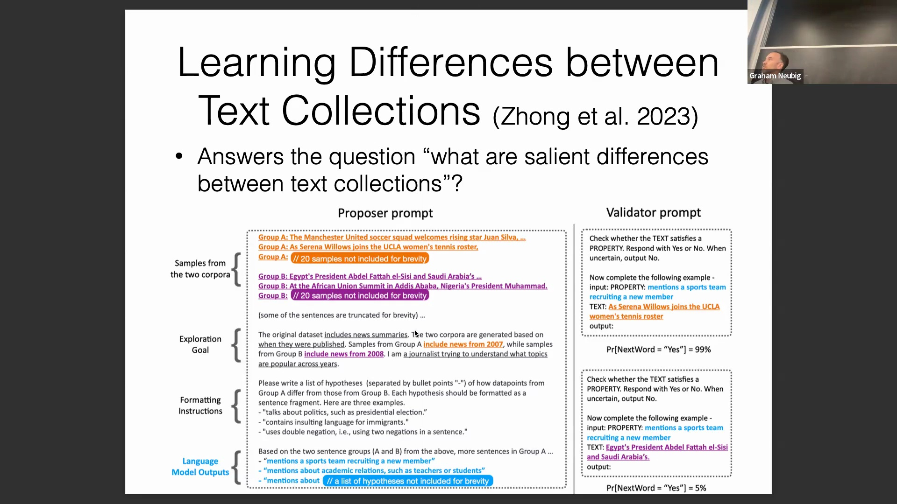
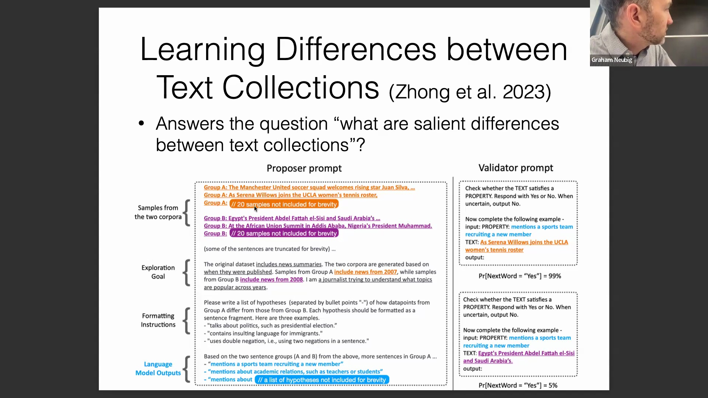

## 自动化语料库对比与医学应用
本讲座探讨了溯因推理(Abductive Reasoning)在自动识别两个大规模文本语料库(Large-scale Text Corpora)之间系统性差异(Systematic Differences)方面的应用。推动该方法发展的核心动力源自临床研究(Clinical Research)，尤其是用于分析服用活性药物(Active Drugs)患者与服用安慰剂(Placebo)患者的自然语言报告(Natural Language Reports)。该方法免除了研究人员手动阅读与标注海量主观报告(Subjective Reports)的繁重工作，转而借助语言模型自动提取并阐明两组人群间一致且潜在的差异特征，从而大幅简化临床试验(Clinical Trials)的评估流程。

## 从样本数据生成假设
该方法首先向大语言模型(Large Language Models, LLMs)输入来自两个不同群体的少量代表性样本(Representative Samples)（例如，2007年与2008年的新闻摘要）。通过明确的提示(Prompt)，引导模型扮演分析师角色，生成一份结构化的要点假设列表(Hypothesis List)，用以阐释A组与B组之间可能存在的差异。例如，基于初始样本，模型可能提出假设：“A组提及运动队或学术关联的频率更高。”这一初始步骤将原始的非结构化文本对比(Unstructured Text Comparison)转化为一系列具体且可检验的命题(Testable Propositions)。

## 大规模验证与统计显著性
为缓解大语言模型固有的幻觉(Hallucination)及上下文窗口(Context Window)受限等局限，生成的假设将在规模显著更大的数据集上进行严格验证。在此阶段，每个假设均充当一个二分类器(Binary Classifier)，用于扫描两个语料库中的数千条样本，以统计目标特征的出现频次。随后，这些二值化输出(Binary Outputs)将接受正式的统计显著性检验(Statistical Significance Test)。通过依据 p值(p-value) 对假设进行排序，研究人员可客观判定哪些差异具备统计稳健性(Statistical Robustness)，从而有效过滤噪声，精准提取语料库间最可靠的区分特征(Discriminative Features)。

## 实际研究应用与注意事项
该框架在探索性数据分析(Exploratory Data Analysis)中已被证实极为有效。演讲者分享了一项个人研究项目，旨在对比与人类脑电信号(EEG Signals)高度匹配的句子与匹配度较低的句子。模型成功生成了极具洞察力的假设，指出大语言模型在处理隐喻性语言(Metaphorical Language)及人际交互语境(Interpersonal Contexts)时匹配度相对较弱。尽管这些 AI 生成见解(AI-Generated Insights)为定向研究(Targeted Research)提供了宝贵起点，但演讲者强调了独立验证(Independent Validation)的必要性，并提醒研究者切勿盲目依赖大语言模型输出的统计结果。总而言之，该方法展现了一种变革性的研究范式(Research Paradigm)：语言模型实现了假设生成(Hypothesis Generation)的自动化，在大幅削减人工标注负担(Manual Annotation Burden)的同时，也为复杂的科学探索开辟了全新路径。