## 多语言自然语言处理简介
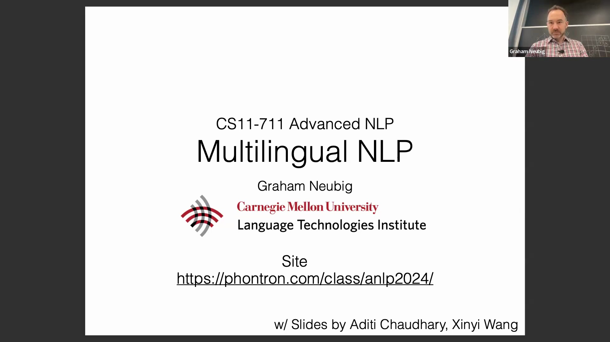
多语言自然语言处理(Multilingual Natural Language Processing, Multilingual NLP)旨在将自然语言处理技术应用于多种不同的语言。该领域主要包含两种范式。第一种是**面向多种语言的单语自然语言处理(Monolingual NLP for Multiple Languages)**，即针对非英语语言执行与英语中相同的标准自然语言处理(Natural Language Processing, NLP)任务。这类任务涵盖情感分析(Sentiment Analysis)、问答(Question Answering)、聊天机器人开发(Chatbot Development)以及代码生成(Code Generation)等。 

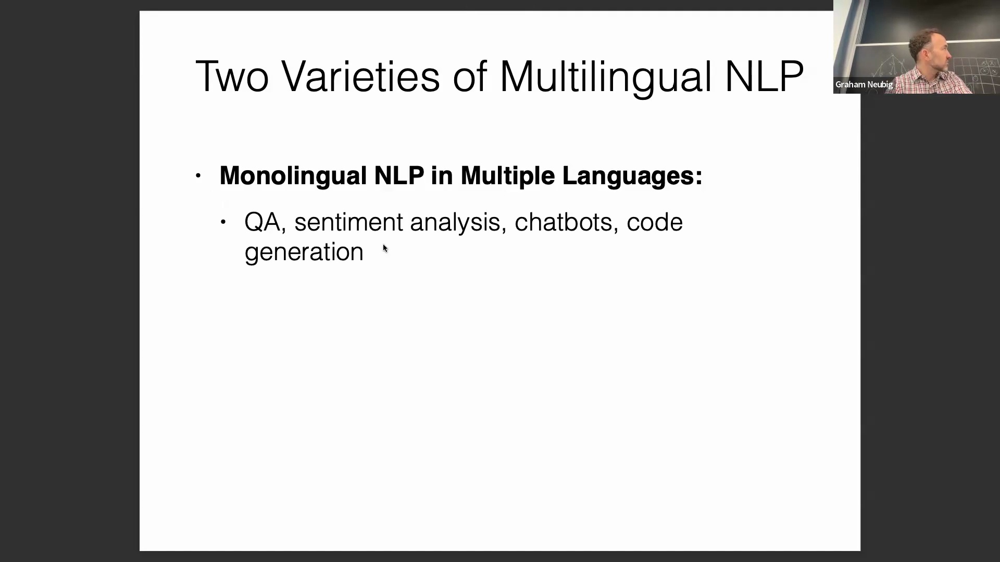
第二种范式是**跨语言自然语言处理(Cross-lingual NLP)**，其核心在于处理涉及多种语言的交互与转换任务。典型应用包括机器翻译(Machine Translation)与跨语言问答(Cross-lingual Question Answering)。例如，在跨语言问答场景中，用户可能使用日语提问，系统需从英语语料库中检索相关信息，并最终用日语生成答案。

## 数据稀缺性与长尾分布
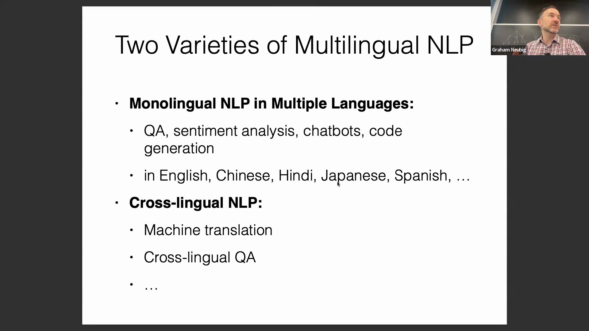
多语言NLP面临的首要挑战是训练数据(Training Data)的严重匮乏。现代系统高度依赖大规模数据集，然而许多目标语言的高质量数据却极为稀缺。这种数据分布呈现出显著的长尾分布(Long-tail Distribution)特征。以各语言维基百科(Wikipedia)的文章数量为例，英语虽高居榜首，但数据量随排名下降极为迅速。排名在第20至30位之后的语言，其可用文章数量已急剧锐减。

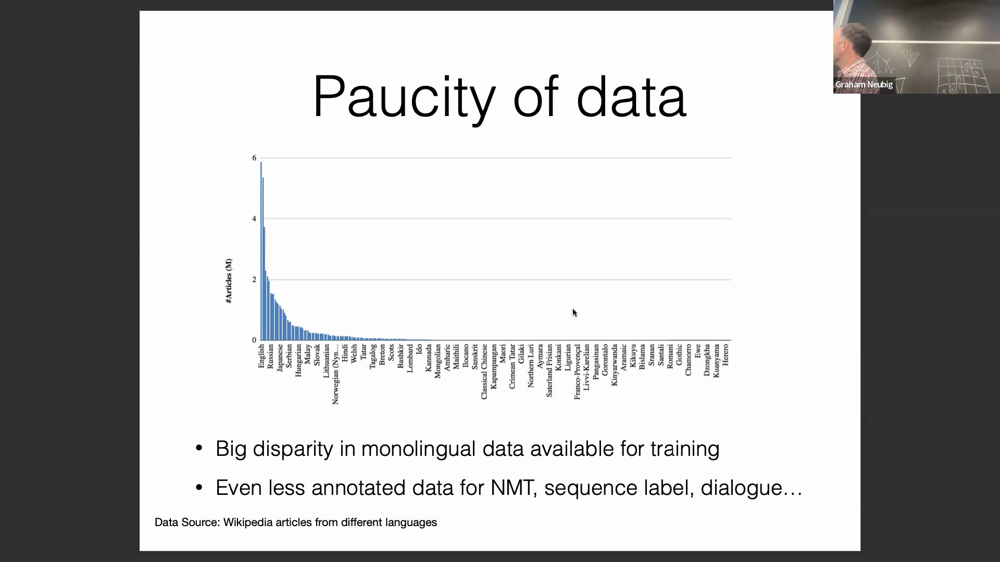
尽管通用互联网文本也遵循类似的长尾模式，但其数据量的衰减速度较维基百科等标准化语料略为平缓。然而，标注数据(Annotated Data)的稀缺性更为突出，因其仅构成原始单语文本的一小部分。这种数据短缺直接制约了机器翻译、序列标注(Sequence Labeling)、对话系统(Dialogue Systems)、问答系统以及指令遵循模型(Instruction-following Models)等下游任务的性能。

## 语言与结构挑战
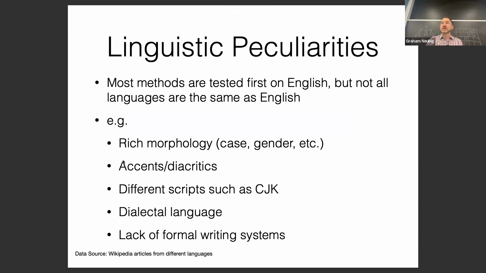
除数据稀缺外，语言结构的多样性也带来了显著的技术挑战。不同语言的结构属性差异巨大，导致主要基于英语训练的模型在迁移至其他语言时面临严重的适配问题。以形态学(Morphology)为例：英语极少使用中缀(Infix)形态变化（即在词干内部插入语素），但许多语言高度依赖此类构词法。若处理不当，这种特性将严重干扰 SentencePiece 等标准分词(Tokenization)算法的切分效果。 

变音符号(Diacritics)与重音标记的使用进一步增加了文本处理的复杂度。西班牙语和法语等语言仅适度使用此类符号，而约鲁巴语(Yoruba，尼日利亚广泛使用)等语言则包含极为丰富的变音符号。这些符号在日常书写中常被省略，进而引发词汇歧义(Lexical Ambiguity)。汉语拼音同样依赖声调标记以区分语义。此外，不同的书写系统(Writing Systems)也构成了独特的技术障碍。中日韩(CJK)文字体系差异显著：中文主要采用表意文字(Logograms)，日文混合使用汉字与假名(表音字符)，而韩文则将音素组合成独立的音节方块。若缺乏针对性处理，标准分词器极易将此类字符误判为不可切分的独立符号。其他挑战还包括方言变体(Dialectal Variations)的处理，以及众多语言缺乏正式、标准化的书写规范，这与英语相对统一且形态较简单的特征形成了鲜明对比。

## 迁移学习与统一模型
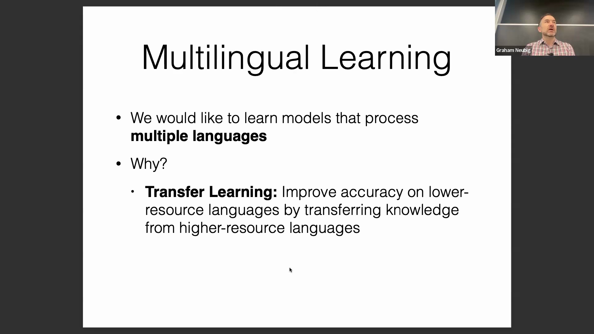
近年来，该领域的一项重大突破是成功开发出可同时处理多种语言的多语言模型(Multilingual Models)。此类架构深度依托迁移学习(Transfer Learning)机制，实现跨语言知识共享。因此，高资源语言(High-resource Languages)的丰富数据能够有效反哺，显著提升低资源语言(Low-resource Languages)的模型准确率与整体性能。 

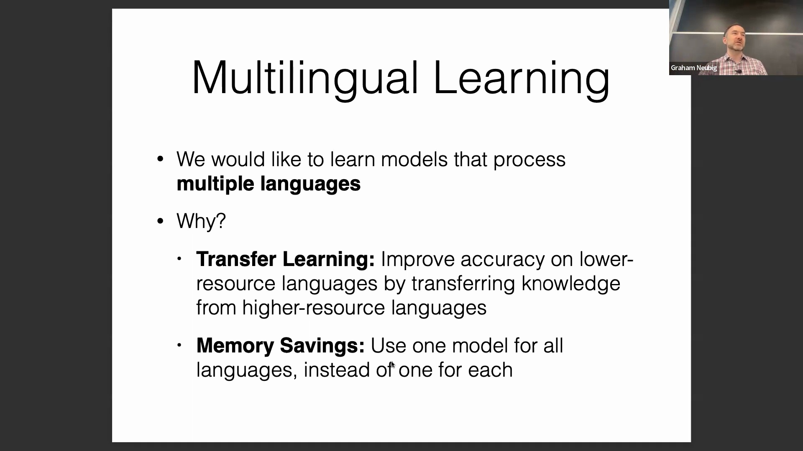
在实际工程部署层面，统一的多语言模型(Unified Multilingual Models)展现出显著优势。以早期机器翻译系统为例，平台需独立部署数百个双语模型（如英中、英日、西英等），且每个语言对(Language Pair)均需配置复杂的服务器基础设施。如今，单一大型模型即可统一处理所有语言对的推理任务。此举大幅降低了部署开销(Deployment Overhead)，使工程师能够高效扩展模型规模，并天然促进了跨语言知识迁移(Cross-lingual Knowledge Transfer)。

## 实际部署与方法论流程图

在处理多语言任务时，开发者可遵循一套高层级决策框架(Decision Framework)以选择最优技术方案。首要评估指标是目标语言是否具备充足的标注数据。需注意的是，“数据充足”的阈值因具体任务而异：例如，机器翻译通常需至少百万级句对(Sentence Pairs)，而文本分类(Text Classification)任务可能仅需千级标注样本即可取得良好效果。基于数据可用性的不同，开发者可选择对预训练多语言模型(Pre-trained Multilingual Models)进行微调(Fine-tuning)，实施基于高资源语言的零样本(Zero-shot)或少样本(Few-shot)迁移学习，或采用其他定制化技术以实现性能最大化。

---

## 战略部署与数据考量
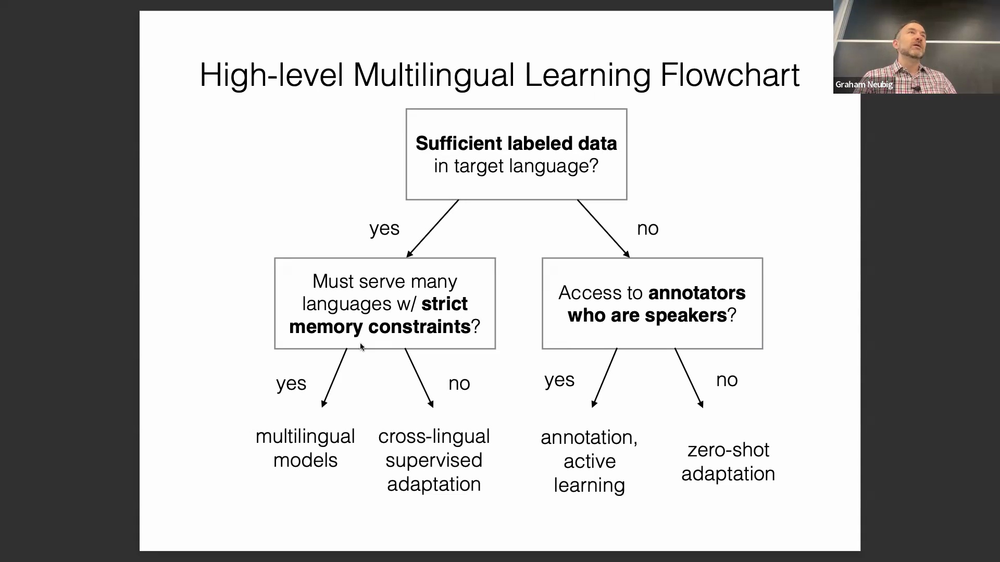
在设计多语言自然语言处理(NLP)系统时，初始架构决策往往取决于部署约束(Deployment Constraints)。若严格的内存限制(Memory Constraints)要求模型同时服务多种语言，则必须采用统一多语言模型(Unified Multilingual Model)。若硬件限制较为宽松，开发者既可部署多语言模型，也可将基础模型(Foundation Model)专门适配至目标语言，后者通常能实现更优越的性能。另一个关键的实践考量是数据可用性。尽管零样本适配(Zero-shot Adaptation)研究致力于在无需标注样本的情况下处理新语言，但生产级系统(Production-grade Systems)若能基于适度规模的标注数据集（如约 1,000 个样本）进行微调(Fine-tuning)，其性能增益将显著更大。零样本方法的核心价值目前更多体现在概念验证或演示阶段，例如在全面收集数据前，向新市场的利益相关者(Stakeholders)展示系统的技术可行性。

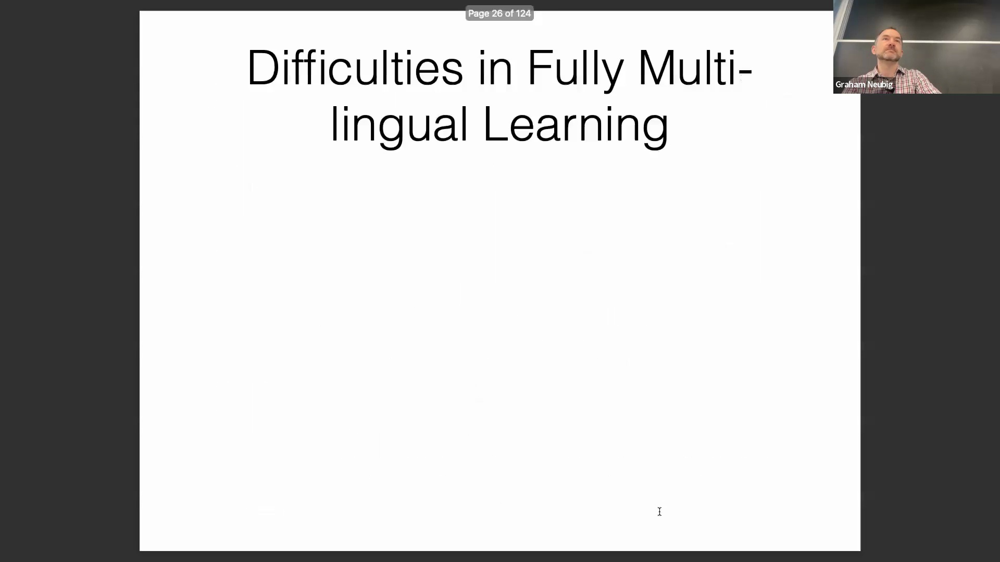

## 输入多语言与输出多语言 & 多语言诅咒
多语言语言建模(Multilingual Language Modeling)通常始于在大规模混合语料库(Large-scale Mixed Corpora)上的预训练。在处理多语言输入时，现代生成式模型(Generative Models)通常具备隐式语言检测能力，无需显式提示(Explicit Prompts)即可自动识别并处理源语言(Source Language)。例如，模型可在接收到翻译请求时，无缝将未明确指定语言的法语或日语文本转换为英语。相比之下，生成多语言输出则需明确的指令引导。系统必须强制模型锁定目标语言(Target Language)，通常的做法是在输入序列前缀添加特定的语言标识符(Language Tags)或控制提示。多年来，这一标签范式(Tagging Paradigm)一直是 Google 翻译等工业级系统的核心组件。

然而，盲目扩展多语言训练会引发著名的“多语言诅咒”(Curse of Multilinguality)。在模型容量固定(Fixed Model Capacity)的前提下，随着支持语言数量的增加，单一语言的性能往往会呈下降趋势。针对 XLM-R 等模型的实证研究表明，尽管初期引入新语言可通过迁移学习(Transfer Learning)有效提升低资源语言(Low-resource Languages)的表现，但当语言种类扩展至数十种时，模型容量将被严重稀释，最终导致高资源语言(High-resource Languages)的准确率也出现下滑。历史上诸如 1750 亿参数规模的 BLOOM 模型等大规模实践表明，若缺乏充足的算力或底层架构优化，过度扩展多语言训练范围反而会导致英语与非英语语言的综合表现均不尽如人意。

## 算力约束与扩展定律
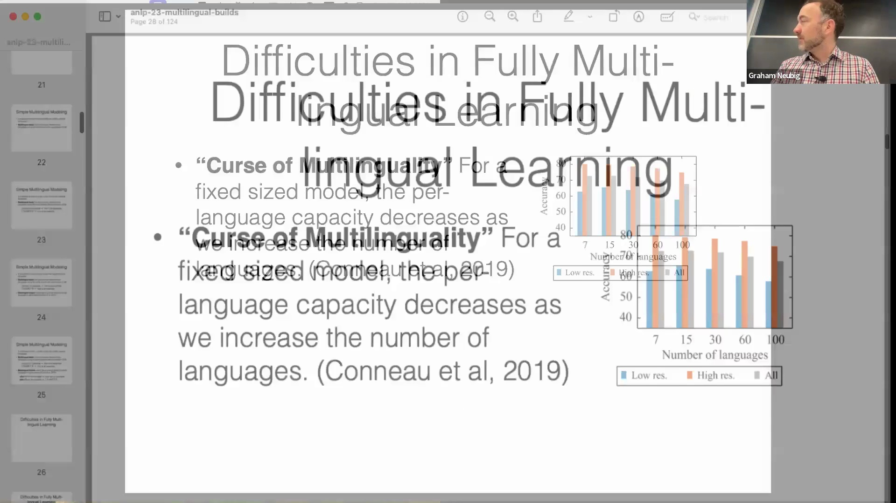
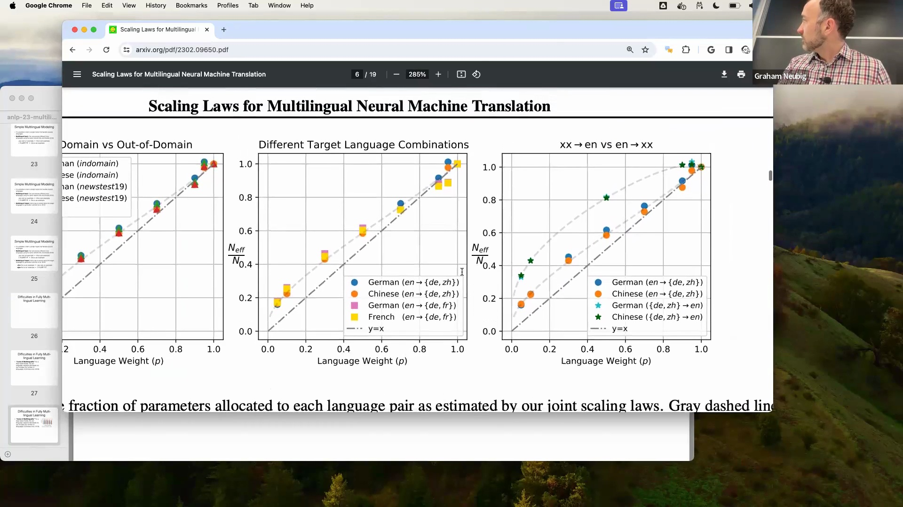
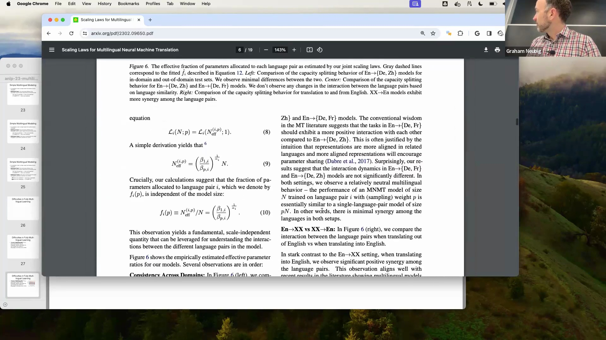
此类性能权衡(Performance Trade-off)从根本上受制于算力预算(Compute Budget)与扩展定律(Scaling Laws)。分配给特定语言的训练时长与算力资源，与其最终的基准测试性能(Benchmark Performance)呈直接正相关。研究指出，参数共享(Parameter Sharing)机制对高资源语言的边际收益递减(Diminishing Returns)，因为此类语言的性能瓶颈通常在于算力限制(Compute Bottleneck)而非数据匮乏。若将固定的算力预算过度分散至众多语言，将直接压缩英语等主导语言(Dominant Languages)的有效训练步数，进而拉低整体模型得分。因此，业界普遍采用一种务实的资源划分策略(Pragmatic Resource Allocation)：将核心算力投入于高度优化的英语单语模型，次要资源用于构建覆盖前 10-15 种主流语言的专用模型，并另设独立项目研发旨在覆盖长尾语言(Long-tail Languages)的广义多语言架构。

## 优化策略与参数共享
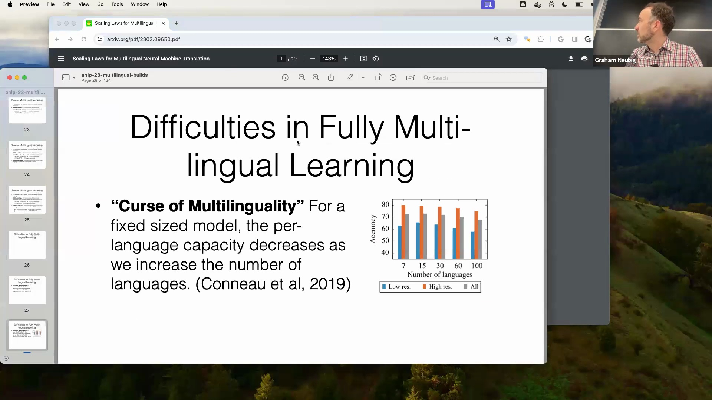
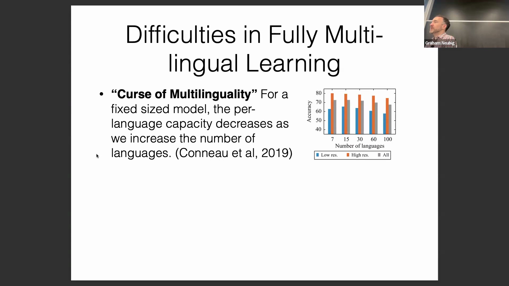
为突破上述瓶颈，业界标准的架构范式是训练单一模型，使所有 Transformer 层参数在不同语言间实现完全共享。这种统一参数空间(Unified Parameter Space)的设计不仅促进了跨语言知识迁移(Cross-lingual Knowledge Transfer)，也极大简化了工程部署流程。该共享原则的唯一主要例外在于词元嵌入层(Token Embedding Layer)。由于各语言在词汇表、形态学规则(Morphological Rules)及书写系统(Writing Systems)上存在本质差异，若强行统一子词嵌入(Subword Embeddings)，势必以牺牲语义表示质量(Semantic Representation Quality)为代价。

## 缓解分词差异

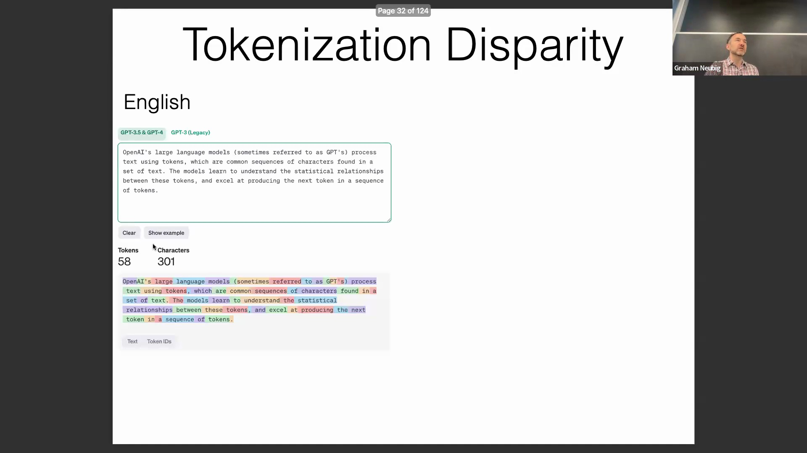
多语言建模面临的核心挑战之一是分词差异(Tokenization Discrepancies)。不同语言需适配截然不同的子词切分策略(Subword Segmentation Strategies)，若在差异悬殊的书写系统（如拉丁字母与中日韩(CJK)文字）间强制推行单一的分词方案，将导致表示效率低下(Inefficient Representation)与模型性能衰减。缓解该问题需对嵌入层与分词流水线(Tokenization Pipeline)进行精细化设计。通过为特定语言隔离独立的子词嵌入(Language-specific Subword Embeddings)，同时保持底层核心模型参数的共享机制，开发者得以在参数效率(Parameter Efficiency)与处理全球多语言文本所需的语言灵活性之间实现最佳平衡。

---

## 共享分词器与跨语言迁移
多语言大语言模型通常依赖于所有支持语言共享的同一个分词器(Tokenizer)。当语言之间存在大量共同词汇时（例如英语和法语），它们的词元嵌入(Token Embeddings)会自然共享，从而促进有效的跨语言知识迁移(Cross-lingual Knowledge Transfer)。然而，共享词表(Vocabulary)对于迁移学习(Transfer Learning)并非绝对必要，研究表明，即使词表没有重叠，模型仍能通过多语言训练获得显著的收益。

## 分词差异问题
由于书写系统(Writing Systems)和字符复杂度的差异，不同语言的分词效率(Tokenization Efficiency)存在巨大差异。一项使用 OpenAI GPT-3.5/4 分词器的实验凸显了这种不均衡：一段特定的英文文本仅产生 58 个词元(Token)。当相同内容被翻译成缅甸语时，词元数量激增至 617 个。这是因为分词器对于核心词表(Core Vocabulary)之外的字符默认采用字节级编码(Byte-level Encoding)。由于缅甸语字符在 UTF-8 编码中通常需要三个字节，每个字节都被视为独立的词元，导致序列长度(Sequence Length)大幅膨胀。

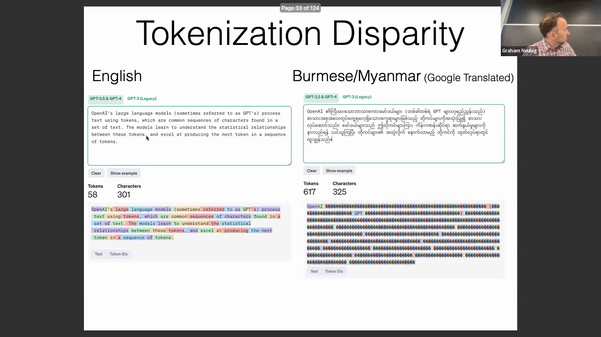

## 带来的影响：成本、速度与模型容量
分词效率低下不仅会带来实际应用的瓶颈，还会暴露模型架构的缺陷。首先，处理低资源文字(Low-resource Scripts)文本的成本会增加十倍以上，因为 API 调用和算力成本通常按词元数量计算。其次，文本生成速度会相应下降，因为自回归模型(Autoregressive Models)以固定速率逐词元生成。更为关键的是，字节级分词(Byte-level Tokenization)迫使模型将大量模型容量(Model Capacity)浪费在将碎片化的字节重新组合成语义单元(Semantic Units)上，而非处理具有语言学意义的子词(Subwords)。这种碎片化不仅增加了出错概率，还消耗了宝贵的参数容量，最终导致整体准确率和性能下降。

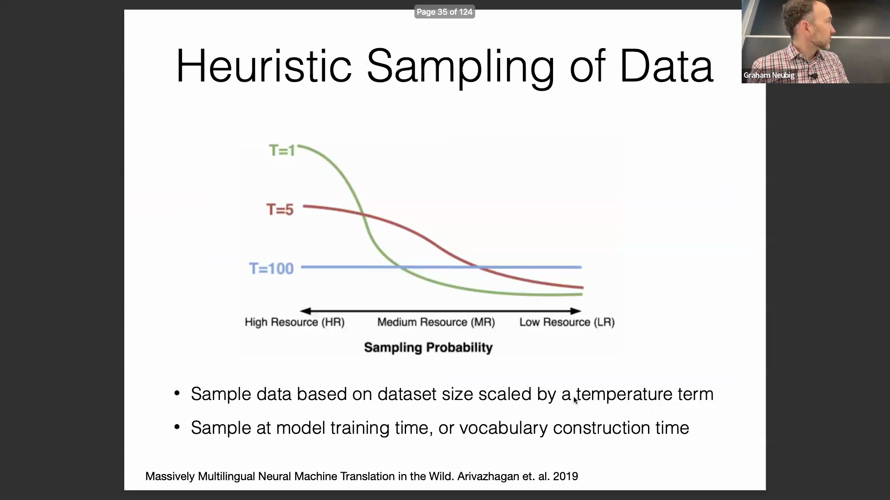

## 用于均衡训练的温度采样
为了缓解这些差异，研究人员通常会采用启发式数据采样(Heuristic Data Sampling)方法，其中最常见的是温度采样(Temperature Sampling)。该技术通过计算各语言数据频率的 $1/T$ 次方（其中 $T$ 为温度参数），并重新进行归一化(Normalization)，来调整从不同语言中采样数据的概率。较低的温度会保留原始的长尾分布(Long-tail Distribution)，使采样高度偏向高资源语言(High-resource Languages)。提高温度会使概率分布趋于平坦，从而确保低资源语言被更频繁地采样。在极高温度下，所有语言的采样概率几乎趋于均匀。该策略在模型训练和初始词表构建阶段均可有效应用。

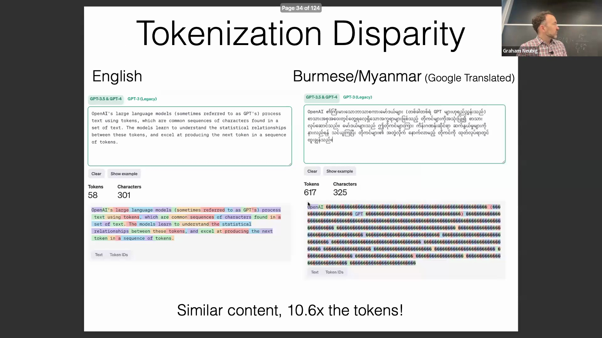

## 词表扩展与现实应用
现代开放权重语言模型(Open-weight Language Models)积极采用这些均衡策略，以提升多语言公平性(Multilingual Fairness)。XLM-R 和 Qwen 等架构在构建词表时利用温度采样，刻意对英语等主导语言进行降采样(Downsampling)，同时对低资源语言进行上采样(Upsampling)，以防止其文本被过度碎片化。此外，Qwen 将其词表大小(Vocabulary Size)大幅扩展至超过 20 万个词元（相比之下，标准规模通常为 3.2 万个），从而实现更广泛的文字覆盖，并在多样化的语系中实现更高效、更符合语言学规律的分词。

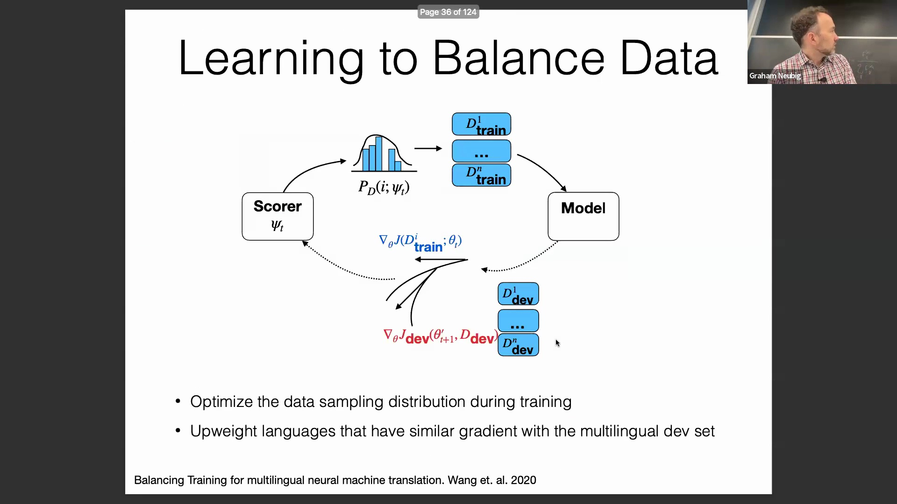

## 批次构建与训练稳定性
在为机器翻译(Machine Translation)或多语言预训练(Multilingual Pre-training)构建批次(Batch)时，通常会避免单个批次内的语言分布完全均匀。按单一语言分组数据或混合比例失衡会导致梯度方差(Gradient Variance)过高，从而使随机梯度下降(Stochastic Gradient Descent, SGD)优化过程不稳定，并引发训练动态的剧烈波动。标准的最佳实践是在批次形成*之前*执行按比例采样(Proportional Sampling)。先进的数据加载器(Data Loaders)通常会预生成、打乱并缓存多样化的批次，以在整个训练过程中保持梯度稳定和学习动态(Learning Dynamics)的一致性。

## 基于梯度对齐的动态数据均衡
除了静态的启发式采样，最新研究还通过梯度对齐(Gradient Alignment)引入了动态数据均衡(Dynamic Data Balancing)方法。该方法在多个特定语言的训练集(Training Sets)上计算梯度，并将其与目标开发集(Development Set)的梯度进行比较。通过测量训练梯度与开发梯度之间的余弦对齐度(Cosine Alignment)，系统可以判断特定语言的数据是否推动模型朝着有益的方向更新。梯度对齐良好的数据会被动态增加权重，而对齐不佳或产生负面影响的数据则会被降低权重。这使得模型能够在训练过程中自动调整采样权重，防止在小规模低资源数据集上发生过拟合(Overfitting)，并且相比固定的温度调节，能够以更高的适应性来优化整体性能。

---

## 动态训练调度与词表扩展
针对多语言大语言模型的研究（例如 NLB 论文）展示了应对资源不均衡的有效策略。一种常见的启发式方法(Heuristic Method)是先在高资源语言(High-resource Languages)上训练模型，然后在训练后期逐步引入低资源语言(Low-resource Languages)。这可以防止模型在具备足够容量(Model Capacity)之前，就对低资源语言的有限数据产生过拟合(Overfitting)。尽管这种方法有效，但它仍依赖于手动设定的启发式规则，理想情况下应实现自动化的学习策略(Automatic Learning Strategy)。 

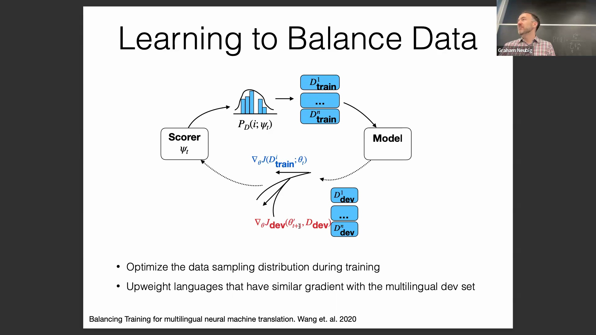

扩展词表大小(Vocabulary Size Expansion)是多语言建模(Multilingual Modeling)中的另一个关键权衡(Trade-off)。虽然将词表从标准的 3.2 万扩展到 20 万以上（例如 21.5 万）会增加最终 Softmax 层的计算成本(Computational Cost)，但它显著缩短了非英语语言的序列长度(Sequence Length)。这种权衡对多语言处理流水线通常是有利的，因为更短的序列抵消了嵌入层(Embedding Layer)计算的开销，从而在数百种语言上实现更高效的处理。

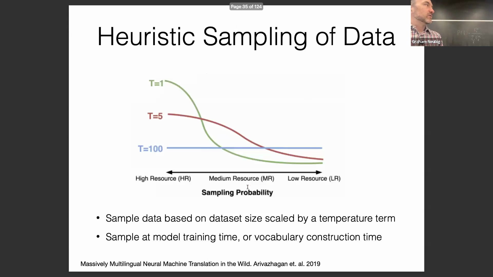

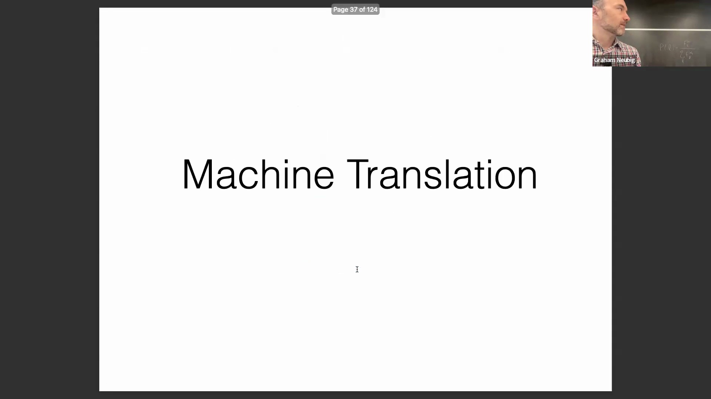

## 句法差异与结构重排序
机器翻译(Machine Translation)仍然是内在最复杂的多语言任务之一，这主要源于不同语言之间的句法差异(Syntactic Differences)。翻译诸如“人工智能的发展至关重要”这样的句子会揭示出显著的结构变化。在西班牙语中，翻译需要添加定冠词(Definite Articles)、调整名词与形容词的语序（这是罗曼语族的普遍规范，英语反而是例外），并用文化对等(Culturally Equivalent)的短语替换习语，而非逐字直译(Literal Translation)。 

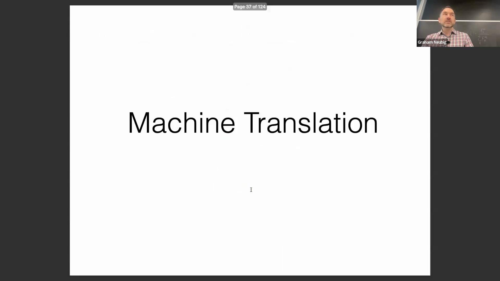

对于像日语这样遵循主-宾-谓（Subject-Object-Verb, SOV）语序的语言，挑战则更为严峻。动词的位置完全移至句末，与英语相比会引发大规模的结构重排序(Structural Reordering)。尽管存在这些极端的句法转换(Syntactic Transformations)，但有时也会出现有趣的跨语言相似性(Cross-lingual Similarities)，例如日语在复合词（如“人工智能”）上保留了原有的词序。理解这些结构映射(Structural Mappings)是构建鲁棒翻译架构(Robust Translation Architectures)的基础。

## 词汇歧义与上下文依赖
除了句法差异外，词汇歧义(Lexical Ambiguity)也是一大障碍。单个英语单词根据上下文(Context)的不同，往往会对应目标语言中多个截然不同的词汇。例如，“leg”一词在指代旅程、动物、家具或人体部位时，需要完全不同的翻译。同样地，动词“run”在应用于马拉松、软件程序、企业管理或服装丝袜时，含义也会发生巨大变化。大多数语言并不共享这种一词多义(Polysemy)现象，这迫使模型在翻译前必须先解析出精确的语义(Semantics)。

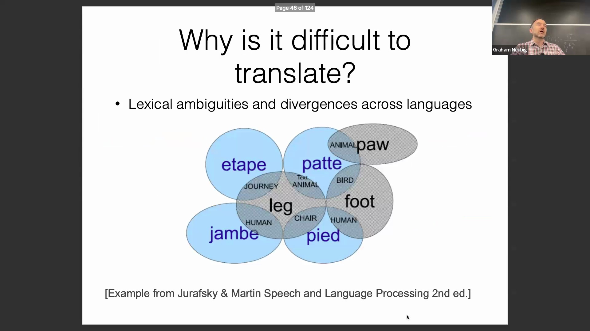

特定语言的语法特性(Grammatical Features)使翻译进一步复杂化。例如，日语在口语中经常省略代词(Pronouns)。单个动词形式如“tabeta”（吃了）可以表示“我吃了”、“你吃了”、“他/她吃了”或“它吃了”，完全依赖上下文或语用线索(Pragmatic Cues)来明确主语。翻译系统通常难以处理这种隐含的上下文(Implicit Context)，往往会错误地推断主语，从而生成令人困惑的输出。处理这些语用(Pragmatics)和上下文细微差别，要求模型具备深层的篇章级理解(Discourse-level Understanding)，而不仅仅局限于句子层面的句法分析。

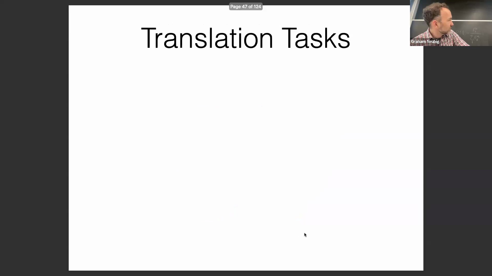

## 评估基准与多语言数据集
机器翻译的进步在很大程度上受到机器翻译研讨会(Workshop on Machine Translation, WMT)等共享任务(Shared Tasks)的推动。WMT 的一个独特之处在于翻译模型与评估系统的协同演进(Co-evolution)：随着翻译模型的改进，研究人员会同步开发更复杂的自动评估指标(Automatic Evaluation Metrics)以跟上发展步伐。这为评估模型能力建立了一个严格且权威的黄金标准基准(Gold Standard Benchmark)。此外，像 FLORES 这样的数据集包含了 200 种语言维基百科文章的高质量人工翻译(Human Translation)，是低资源语言评估的重要资源。构建此类数据集在实际操作中极具挑战，但对于实现全球知识获取的普及至关重要。像国际语音语言翻译研讨会(International Workshop on Spoken Language Translation, IWSLT)这样的语音翻译基准也为多模态系统(Multimodal Systems)提供了关键的评估途径。

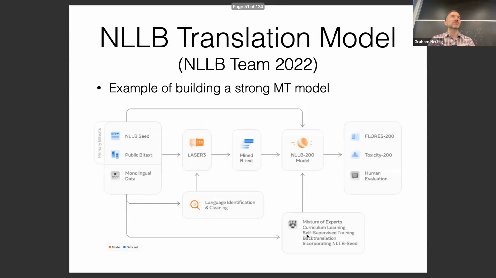

## NLLB 流水线与平行文本挖掘
“不抛弃任何语言”(No Language Left Behind, NLLB) 模型是高性能多语言翻译系统中一个杰出的开源范例。其数据流水线(Data Pipeline)始于少量现有的平行文本种子(Seed Parallel Texts)，并辅以大规模的单语语料库(Monolingual Corpora)。研究人员首先训练一个多语言嵌入模型(Multilingual Embedding Model)，旨在实现跨语言文本的语义对齐(Semantic Alignment)。随后，该嵌入模型被用于扫描海量单语数据集，自动挖掘带有置信度评分(Confidence Scores)的高质量平行双语文本对(Parallel Bilingual Text Pairs)。 

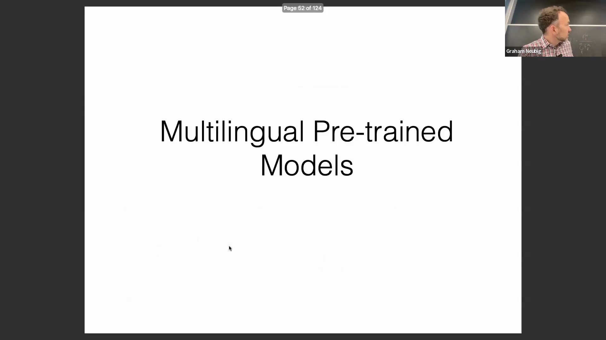

该流水线的一个关键前提是准确的语言识别(Language Identification)，而在区分数百种密切相关的语言时，这一点变得愈发困难。克服这些识别和挖掘挑战，使模型能够有效地覆盖全球语言的长尾分布(Long-tail Distribution)，从而超越传统的启发式采样，迈向数据驱动的自动均衡训练范式(Data-driven Automatic Balancing Paradigm)。

---

## 网络数据中的语言识别挑战
现实中的网络文本为语言识别(Language Identification, LID)系统带来了显著且出人意料的挑战，这一点在构建千语言语料库的研究中尤为突出。标准的LID模型经常会对噪声(Noise)或非规范文本(Non-standard Text)产生误分类(Misclassification)。例如，一串Emoji表情可能会被错误地预测为某种特定语言，而包含装饰性Unicode字符或特殊排版(Special Typography)的推文则可能触发误报(False Positives)。此外，渲染错误的PDF文件、非Unicode字体以及编码文本片段等技术伪影(Technical Artifacts)也会使准确检测变得复杂。要克服这些障碍，需要精心整理的训练数据集(Training Datasets)和可靠的置信度评估指标(Confidence Metrics)，以确保在多样且未经过滤的网络数据源中实现准确的语言分类。
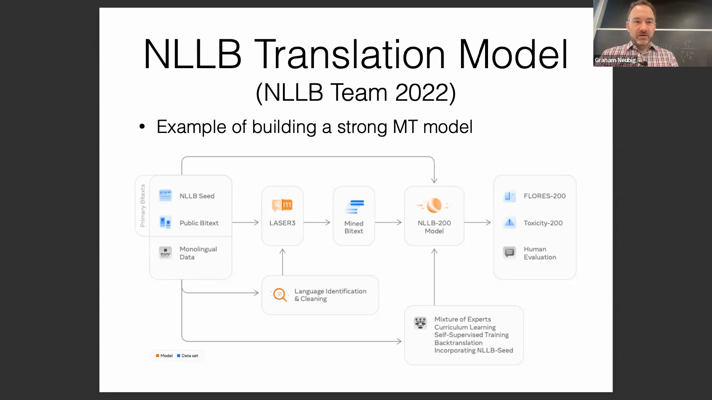
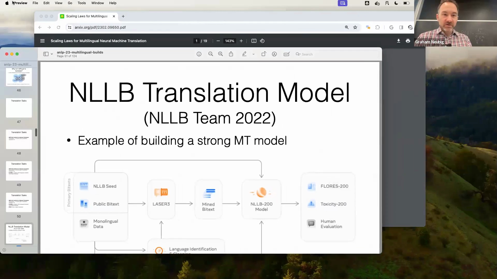

## 多语言翻译的高级建模技术
为应对多语言翻译(Multilingual Translation)的规模与多样性，现代系统采用了多种复杂的架构与训练策略。其中一项核心技术是混合专家模型(Mixture of Experts, MoE)，它允许模型将输入动态路由(Dynamic Routing)至针对特定语言或语系优化的专用参数(Specialized Parameters)，从而提升计算效率与模型容量(Model Capacity)。课程学习(Curriculum Learning)同样被广泛应用，即在训练初期先引入高资源语言(High-resource Languages)，后期再逐步融入低资源语言(Low-resource Languages)，以防止模型在有限数据上过早过拟合(Premature Overfitting)。此外，自监督去噪目标(Self-supervised Denoising Objective)被应用于单语语料库(Monolingual Corpora)，使模型能够从带噪声的输入中重建原始文本，进而在基于平行语料(Parallel Corpora)进行微调(Fine-tuning)之前，夯实其底层的语言表征能力(Linguistic Representations)。
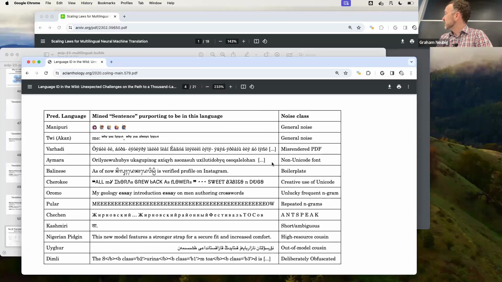
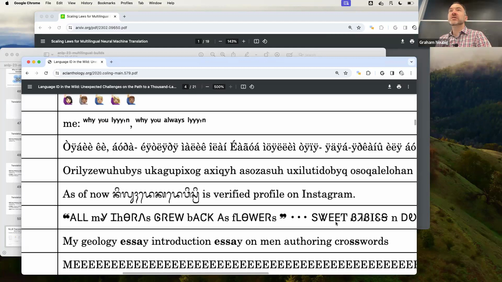
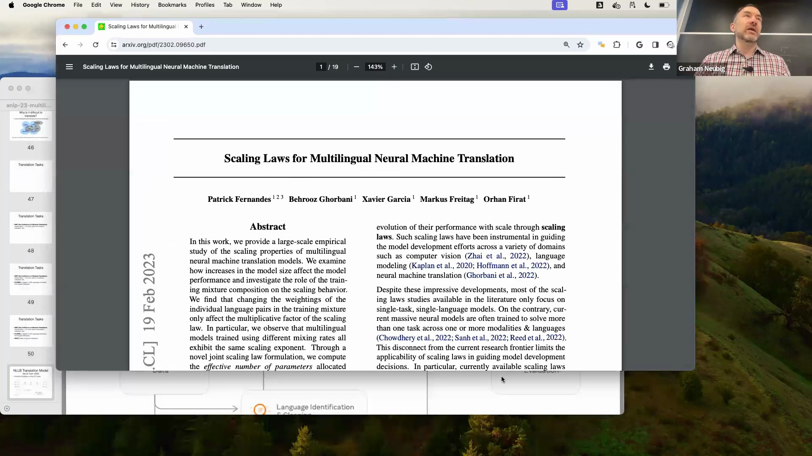

## 通过回译进行数据增强
回译(Back Translation)是提升低资源语言对(Low-resource Language Pairs)翻译性能的基石技术。当平行语料(Parallel Corpora)稀缺但目标语言拥有海量单语数据(Monolingual Data)时，通常会先训练一个反向翻译模型(Reverse Translation Model)（例如斯瓦希里语到英语），以生成合成的平行数据(Synthetic Parallel Data)。随后，该伪平行语料(Pseudo-parallel Corpora)被用于训练主翻译方向(Primary Translation Direction)（如英语到斯瓦希里语）。尽管合成的源文本可能不够自然，但目标输出在语言学上保持自然流畅，这对模型性能至关重要。有趣的是，回译数据的质量往往优于从网络上抓取的、常见的高噪声、过时或机器生成的平行语料，这使其成为扩展和优化训练数据集(Training Datasets)的一种极为有效的方法。

## 模型评估与开源替代方案
对多语言翻译模型的评估揭示了明显的性能分层(Performance Hierarchy)。诸如“不抛弃任何语言”(No Language Left Behind, NLLB)等系统在中低资源语言(Medium-to-Low-resource Languages)（排名40开外）上，展现出与GPT-4等闭源模型(Closed-source Models)相媲美的强劲竞争力，尽管它们在高资源语言对(High-resource Language Pairs)上可能略逊一筹。相反，GPT-4在罗马尼亚语等特定语言上的表现已被证明优于Google翻译等专用工具。除NLLB之外，该开源生态还包括SeamlessM4T等先进的替代方案，其能力已扩展至语音翻译(Speech Translation)领域；以及由卡内基梅隆大学(CMU)开发的Lego MT，为研究人员提供了用于多语言开发与基准测试(Benchmarking)的强大且易用的框架。
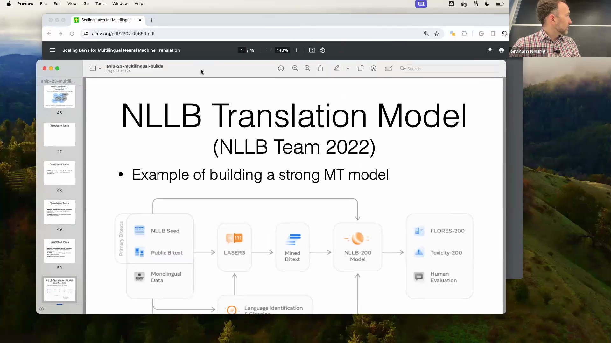

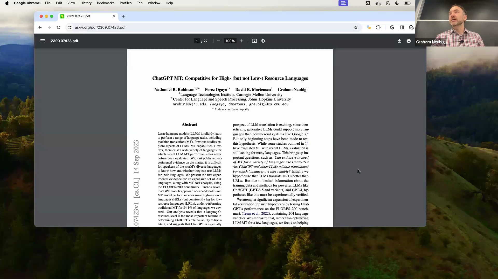
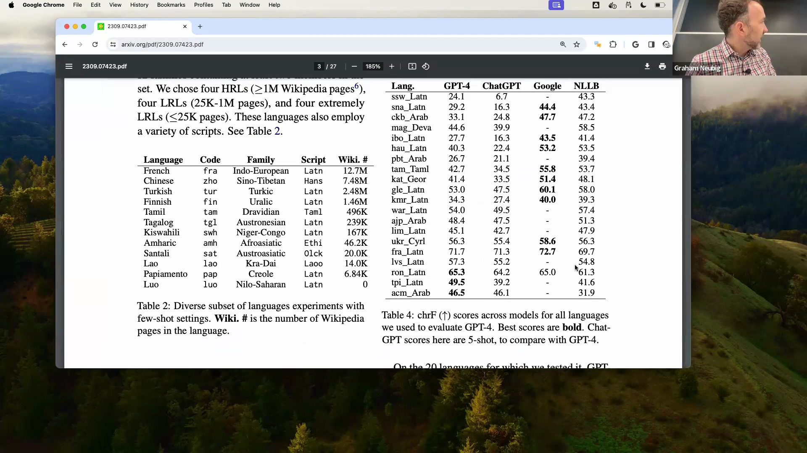

## 多语言预训练模型与自回归模型
尽管GPT-4等闭源大语言模型(Closed-source Large Language Models)凭借庞大的参数规模获得了附带涌现的多语言能力(Emergent Multilingual Capabilities)，但开源自回归模型(Open-source Autoregressive Models)通常通过激进的数据过滤策略(Data Filtering Strategies)优先优化英语，导致高质量的多语言开源替代方案出现空白。因此，研究重心已转向多语言表示学习模型(Multilingual Representation Learning Models)与编码器-解码器架构(Encoder-Decoder Architectures)，这些模型在多语言任务中依然保持极强的竞争力。与标准的因果语言模型(Causal Language Model, Causal LM)不同，掩码语言模型(Masked Language Model, MLM)和序列到序列(Sequence-to-Sequence, Seq2Seq)框架更擅长捕捉深层的跨语言语义对齐(Cross-lingual Semantic Alignment)，这使得它们比纯生成式文本补全(Generative Text Completion)更适合需要强大多语言理解能力的任务。
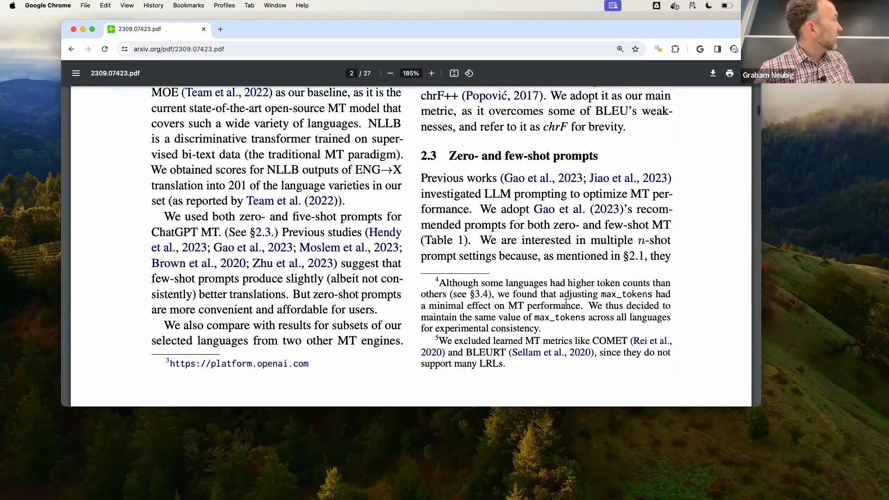
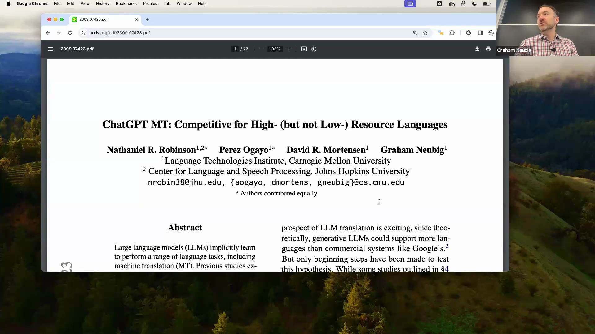

## 跨语言表示学习的基准测试
标准化基准(Standardized Benchmarks)对于评估多语言表示模型(Multilingual Representation Models)至关重要。广泛使用的测试套件(Test Suites)包括XNLI、XNLI-R和X-GLUE，它们涵盖约40种类型学上多样化的语言(Typologically Diverse Languages)，通过句子分类(Sentence Classification)、结构预测、跨语言检索(Cross-lingual Retrieval)和问答(Question Answering)等任务对模型进行评估。在模型训练阶段，研究人员对掩码语言建模(Masked Language Modeling)进行了改进：输入不同语言的平行句对(Parallel Sentence Pairs)，并在两侧同时掩码部分词元(Tokens)。这种跨语言掩码目标(Cross-lingual Masking Objective)迫使模型借助另一种语言的上下文来预测缺失信息，从而在不改变基础MLM训练架构的前提下，有效实现跨语言边界的语义表示对齐(Semantic Representation Alignment)。
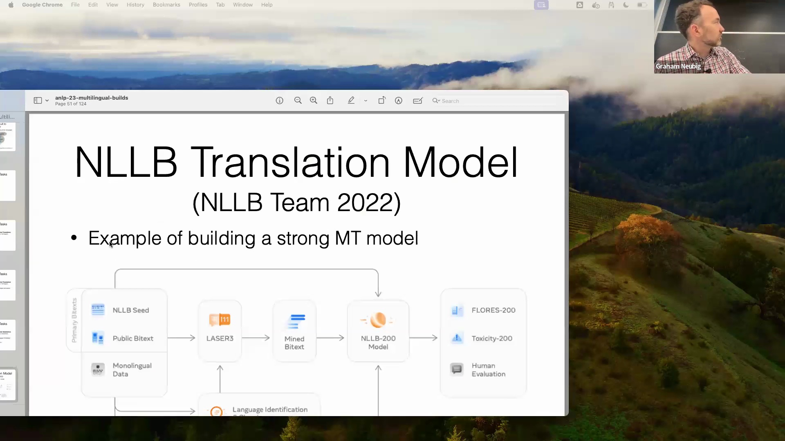
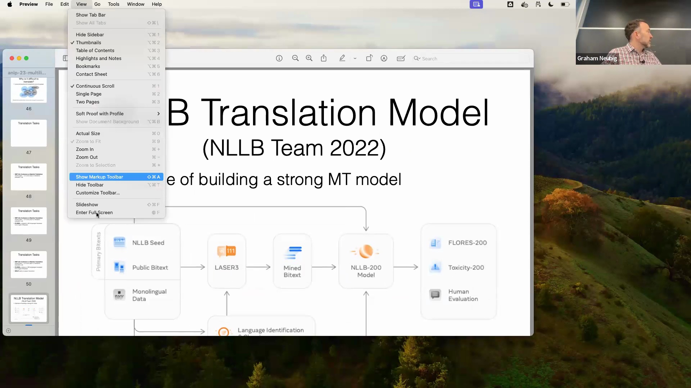
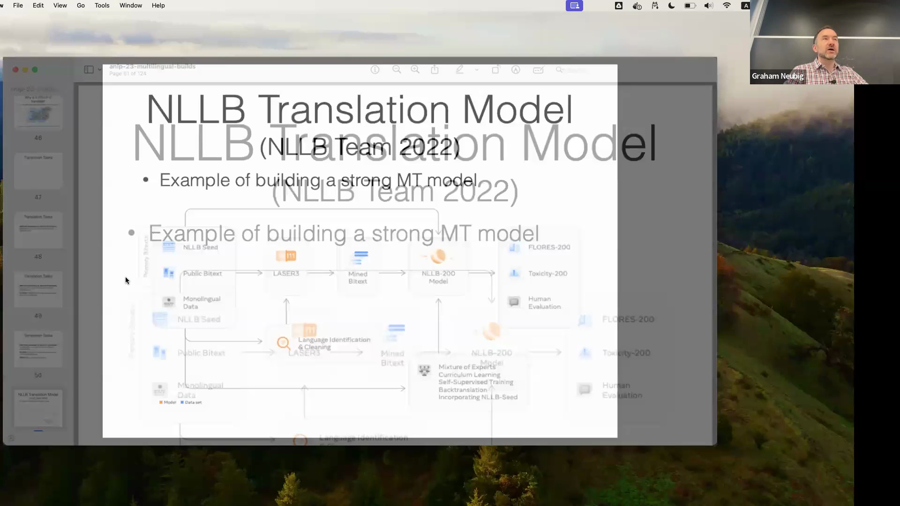
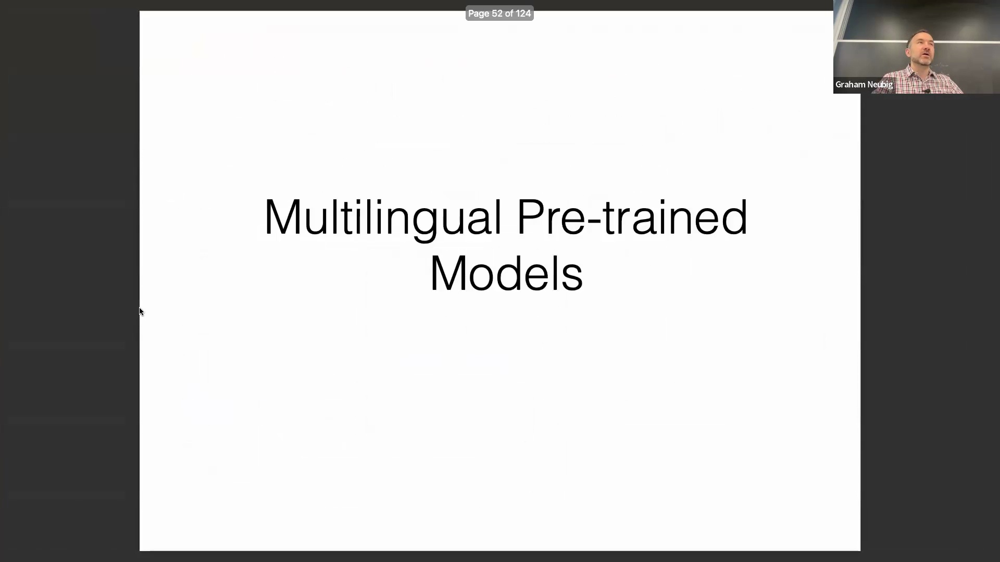
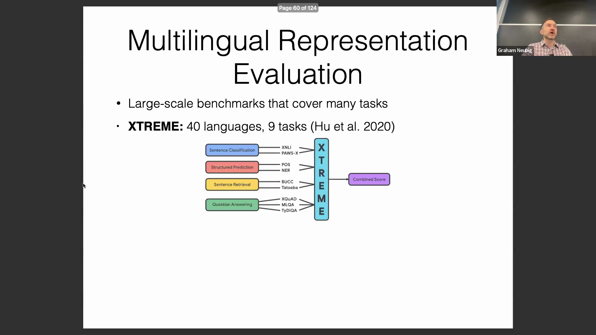
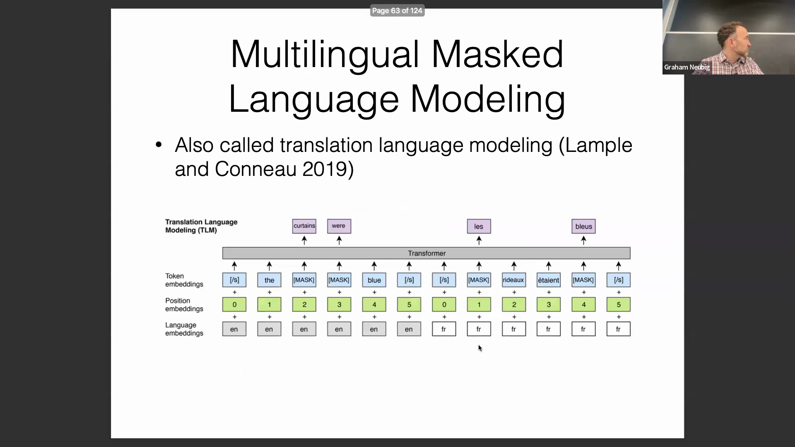

## mT5 编码器-解码器框架
针对稳健的多语言处理任务(Robust Multilingual Processing Tasks)，mT5模型基于T5的编码器-解码器架构(Encoder-Decoder Architecture)，成为一款卓越的开源选择。与纯自回归模型(Pure Autoregressive Models)不同，mT5采用了跨度破坏(Span Corruption)或掩码重建目标(Mask Reconstruction Objective)。在训练过程中，输入文本会经过各种变换操作(Transformation Operations)（如丢弃或替换词元）进行扰动(Perturbation)，模型的任务则是重建原始序列(Original Sequence)。该方法使编码器能够构建深层的上下文表征(Contextual Representations)，同时让解码器学习自回归生成(Autoregressive Generation)，从而构建出一个多功能框架，在数百种语言的理解与生成任务中均表现优异。
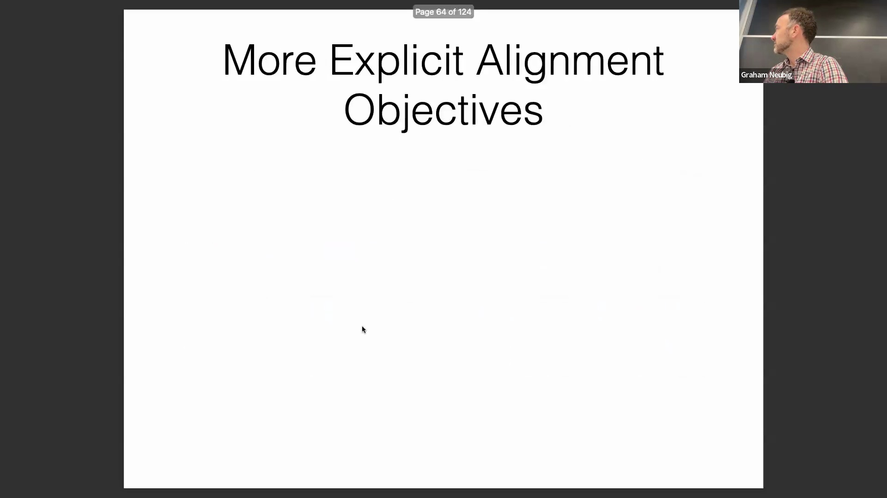
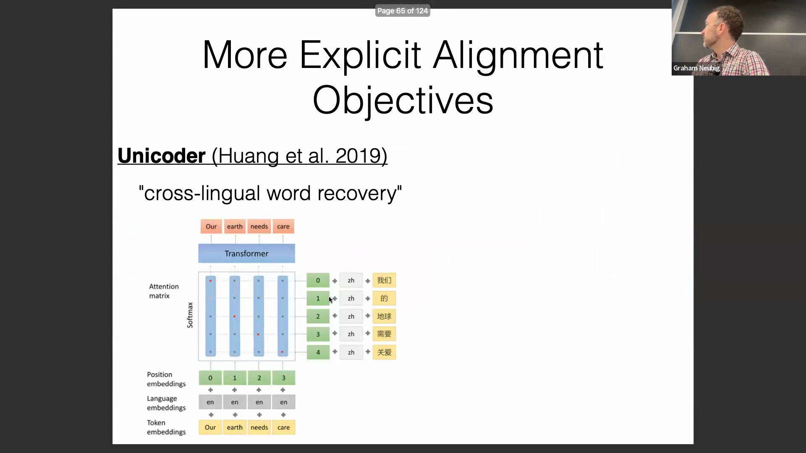

---

## 多语言模型(Multilingual Model)性能概述
该模型在多种语言上进行训练，在广泛的任务中均展现出优异的综合性能。它专为多语言能力而设计，与标准语言模型(Standard Language Model)相比，通常在长尾任务(Long-tail Tasks)上能取得更佳的效果。
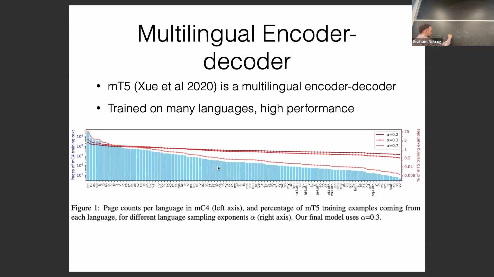

## 模型变体：ByT5、mT5-zero 与指令微调(Instruction Fine-tuning)
为应对不同的多语言挑战，业界发展出了多种架构变体。例如，mT5-zero 与 ByT5 便采用了截然不同的技术路线。ByT5 在训练阶段摒弃了传统的分词(Tokenization)技术，转而采用字节级建模(Byte-level Modeling)。这使得它能够无缝处理任意文字或字符集，有效规避了常见的词表外词汇(OOV)与Unicode编码问题。在实际应用中，mT5 通常展现出更优的性能且更易于部署，因此常被推荐作为多语言任务的入门首选模型。此外，研究团队利用海量的指令微调数据对 mT5 进行了进一步训练，并推出了新版本。作为 mT5-zero 的进阶迭代版本，该模型在指令跟随(Instruction-following)任务中表现尤为强劲。

## 高级建模与预训练(Pre-training)/微调(Fine-tuning)策略
高级建模策略通常依托跨语言迁移学习(Cross-lingual Transfer Learning)，借助一种或多种高资源语言(High-resource Languages)的源数据进行训练。业界广泛采用的标准流程是“预训练-微调”(Pre-train then Fine-tune)，该方法在使模型专精于特定目标语言方面尤为有效。然而，“多语言诅咒”(Curse of Multilinguality)现象使得模型难以在所有语言上同时保持最优性能。当目标语言在原始预训练数据集中已有一定覆盖时，这种预训练与微调方法的效果最佳。若目标语言在预训练阶段完全缺席，由于模型缺乏该语言的基础表征，适配过程将变得极具挑战性。

## 利用相关语言与元学习(Meta-learning)
低资源语言适配(Low-resource Language Adaptation)面临的主要障碍是高质量监督数据的匮乏。为缓解这一问题，可在微调目标语言的同时，引入少量与之密切相关的高资源语言数据进行联合训练。例如，在专注于某种印度地区语言时，引入印地语等相关语言（通常拥有更丰富的可用数据）能显著提升模型性能。尽管并非所有语言都能找到对应的高资源“亲缘”语言，但在适用场景下，这种跨语言协同效应(Cross-lingual Synergy)极为显著。实施此类策略通常较为复杂，往往需要借助元学习(Meta-learning)技术。元学习的核心在于训练一个能够快速适配低资源语言的基座模型，其关键机制是将模型的参数更新方向与预留的开发集(Held-out Development Set)性能对齐。这确保了梯度更新方向能直接针对目标语言进行优化，从而在微调伊始便提升学习效率。
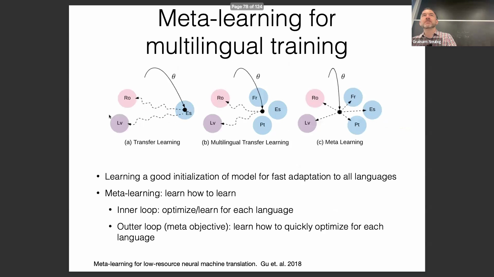
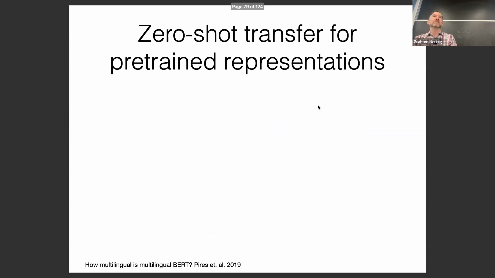

## 零样本迁移(Zero-shot Transfer)范式
另一项主流范式是基于预训练表示(Pre-trained Representations)的零样本迁移。该方法首先利用多语言语料预训练大型语言模型，随后仅使用单一源语言（如英语）的标注数据进行微调，最终直接在截然不同的目标语言（如法语）上进行评估。该方法的成功高度依赖于多语言预训练阶段，使模型能够学习到跨语言共享且具备高迁移性的语义表示。尽管该范式已被广泛研究，但在实际工程应用中，其他替代方案往往能取得与之相当甚至更优的性能。

## 标注投影(Annotation Projection)与“翻译-训练”(Translate-train)方法
一种极具实用价值的替代方案是标注投影(Annotation Projection)，该方法亦常被称为“翻译-训练”(Translate-train)法。该策略主要包含两种实现形式。较为基础的一种是直接将高资源语言（如英语）的标注训练数据中的输入与输出文本，全部翻译为目标语言（如斯瓦希里语）。尽管引入的机器翻译系统(Machine Translation Systems)可能带来一定的翻译偏差，但其生成数据的质量已足够高，使其成为一种直接且高效的策略。较复杂的实现形式则主要针对词元级标注(Token-level Annotation)，例如词性(Part-of-Speech, POS)标签或命名实体(Named Entity)标签。当标注信息无法通过直接翻译迁移时，必须借助词对齐技术(Word Alignment Techniques)将源语言的标注精准投影至目标语言。该过程需谨慎处理语言间的句法结构差异，例如应对“一对多”词对齐(One-to-many Alignment)情况或调整限定词(Determiners)的边界。因此，开发鲁棒的规则或算法以应对上述投影挑战，对于维持跨语言标注的准确性至关重要。

---

## 词对齐简介
在处理多语言数据时，仅依赖简单的翻译往往不够，尤其是在处理复杂的词元级(Token-level)标注任务时。为此，必须引入词对齐(Word Alignment)技术，它是跨语言自然语言处理(Cross-lingual NLP)中的一项基础技术。词对齐旨在建立不同语言句子间单词或短语的映射关系，通常通过输出匹配的索引来构建词与词之间的对应链接。
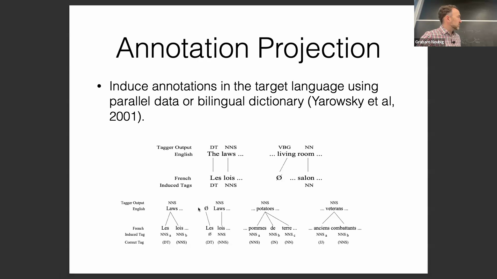

## 无监督对齐方法
词对齐可通过无监督方法(Unsupervised Methods)实现，该类方法主要依赖平行语料库(Parallel Corpora)中的共现统计信息。GIZA++ 是该领域的经典工具，数十年来被广泛用于基于统计共现计算对齐概率(Alignment Probability)。近年来，一种更为现代且高效的方法利用了 SimAlign 等多语言表示模型(Multilingual Representation Models)。SimAlign 通过从多语言 BERT(mBERT)中提取跨语言上下文嵌入向量(Cross-lingual Contextual Embeddings)，识别相似度最高的词元表示并将其作为对齐链接。该方法的准确率显著优于传统的纯统计方法。
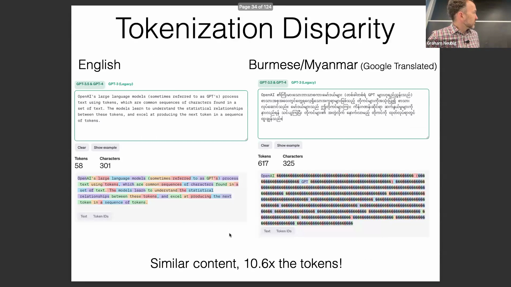
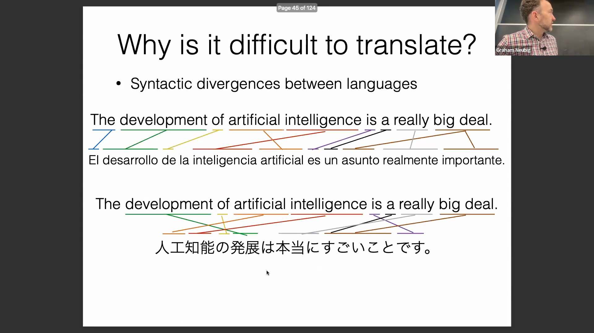

## 有监督对齐技术
为追求更高的对齐精度，有监督对齐(Supervised Alignment)技术会利用少量人工标注数据(Manually Annotated Data)来训练对齐模型。此类模型通常采用对比目标函数(Contrastive Objective Function)进行优化，旨在显式提升正确跨语言链接的权重，同时抑制错误链接的权重。与无监督方案相比，有监督方法通常能生成更为精准的对齐结果。尽管可通过提示工程(Prompt Engineering)驱动 GPT-4 等大型语言模型(LLMs)执行词对齐任务，但其推理成本高昂，且相较于经过专门对比训练的对齐专用工具，其性能提升极为有限。
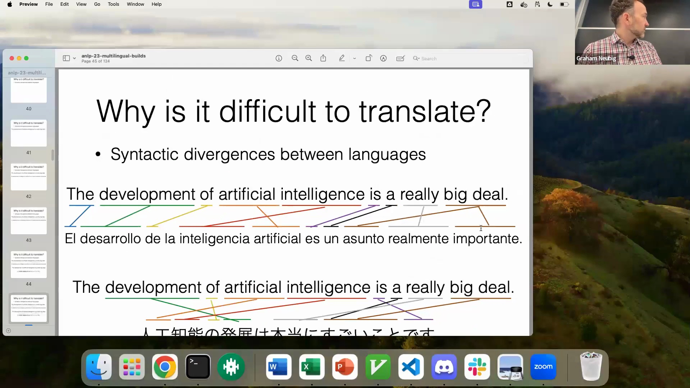

## 枢轴中转与翻译-测试范式
当处理类型学距离(Typological Distance)较远或书写系统截然不同的语言对（如英语与日语）时，直接对齐极具挑战性。一种常见的变通方案是枢轴中转(Pivoting)，即借助英语等高资源语言作为中间枢纽(Hub Language)进行翻译或对齐中转。历史上，Google 翻译等系统曾采用此类黑盒枢轴策略(Black-box Pivoting)，在跨语言转换过程中偶尔会残留英语的语法或词汇痕迹。在特定下游任务中，“翻译-测试”(Translate-test)范式应用了该理念：首先将输入文本翻译为英语，交由性能强大的英语模型（如专用于问答或逻辑推理的模型）进行处理，随后将输出结果翻译回目标语言。尽管该范式在复杂推理任务中表现可行，但其整体性能通常仍逊色于原生训练的高质量多语言模型。

## 优化迁移语言选择
为跨语言迁移(Cross-lingual Transfer)选择合适的源语言至关重要。针对最优迁移策略的研究揭示了一个出人意料且极具预测力的指标：地理邻近性(Geographic Proximity)。尽管地理位置接近的语言在语言学上未必同源（例如西班牙语与巴斯克语），但统计学表明，地理邻近性与共享词汇及句法结构之间存在显著的正相关关系。因此，地理距离可作为一项高度可靠的启发式规则(Heuristic Rule)，用于筛选能够最大化下游任务性能的枢轴语言或源迁移语言。

## 基于国际音标（IPA）的跨书写系统规范化
针对使用完全不同书写系统的语言，另一种可行策略是将文本转换为国际音标(International Phonetic Alphabet, IPA)。通过将词汇规范化(Normalization)为语音表示，模型能够利用亲缘语言间的发音相似性，即便其正字法(Orthography)毫无重叠。然而，应用该技术需谨慎：在英语与法语等特定语言对中，其书面形式反而比实际发音更为接近。盲目地将文本转写为 IPA 可能会破坏预训练模型的词对齐能力并导致性能下降。因此，该策略属于高度依赖语言背景(Context-dependent)的专用技术，而非普适性解决方案。
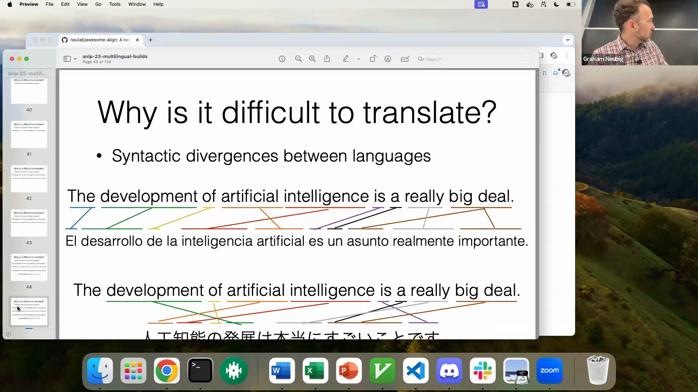
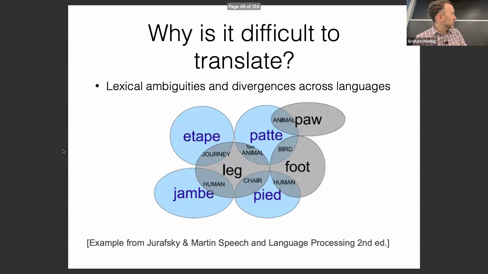
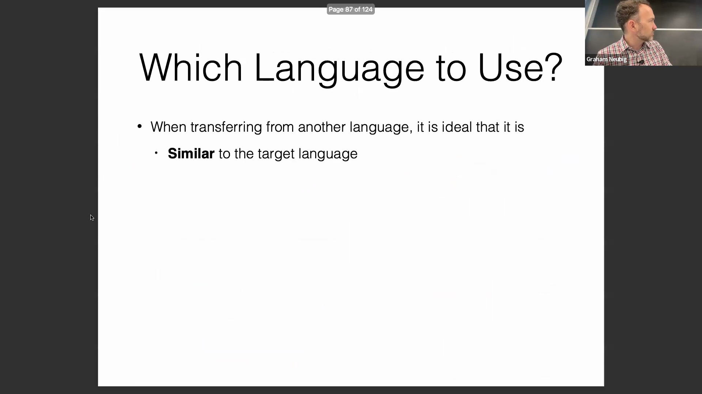
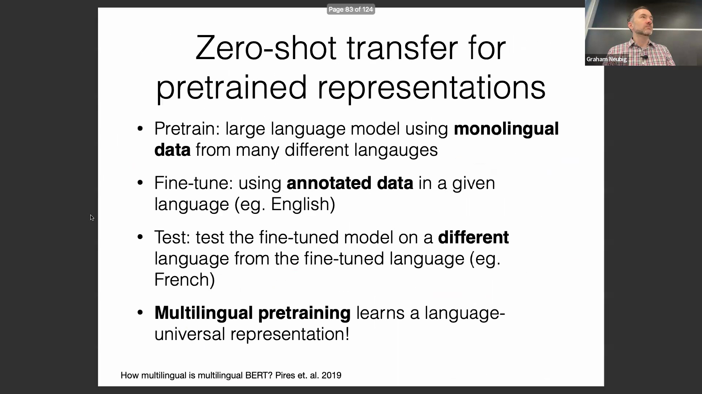

## 参数共享架构
在设计多语言模型时，参数共享策略(Parameter Sharing Strategies)是核心的架构决策。最直接的方案是采用单一统一模型，在所有语言间共享全部参数。早期架构曾探索部分参数共享，例如仅共享编码器(Encoder)、注意力机制(Attention Mechanism)或特定的 Transformer 权重矩阵。更具前瞻性的研究则引入了参数生成器(Parameter Generators/Hypernetworks)，即通过一个独立的控制网络，根据特定语言的元数据动态生成目标模型的权重。尽管该理念在理论上极具潜力，但其巨大的参数开销使其在大规模实际部署中往往缺乏可行性。
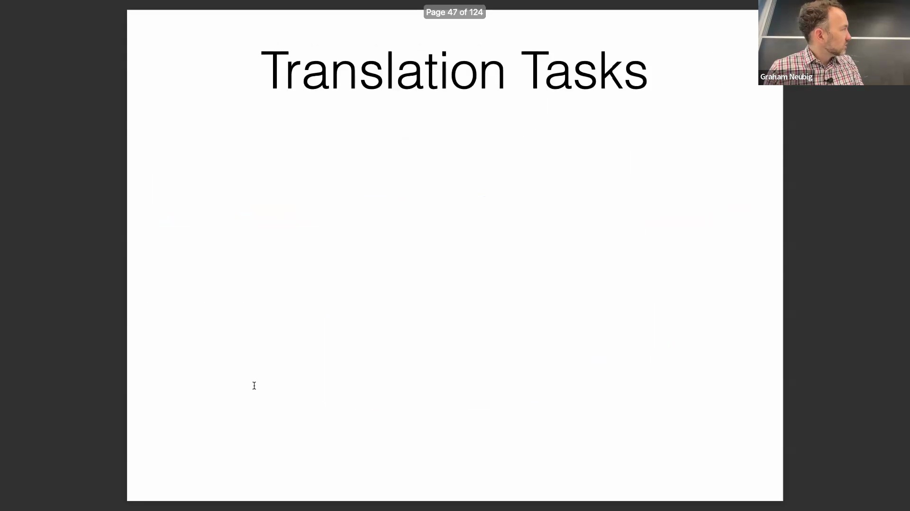
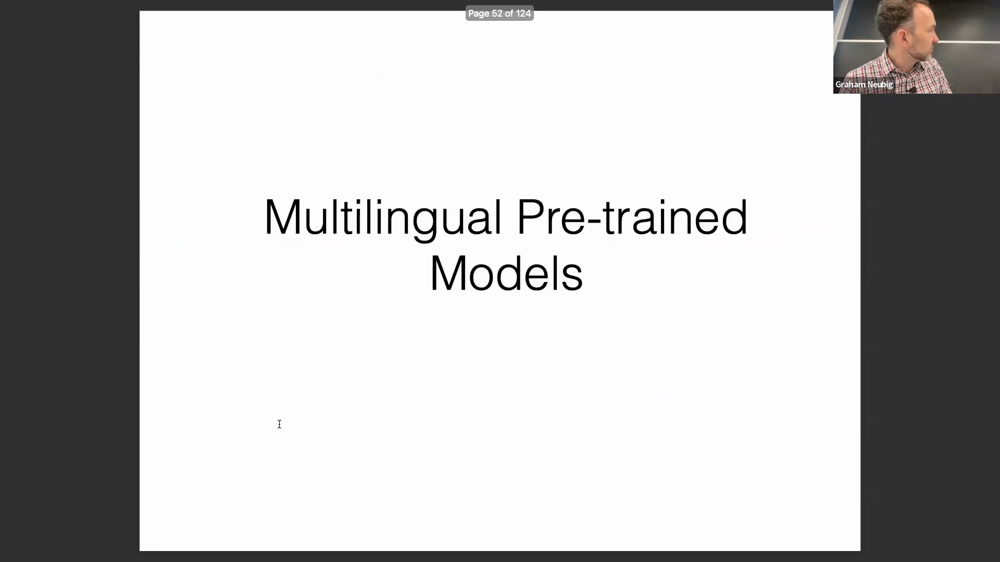
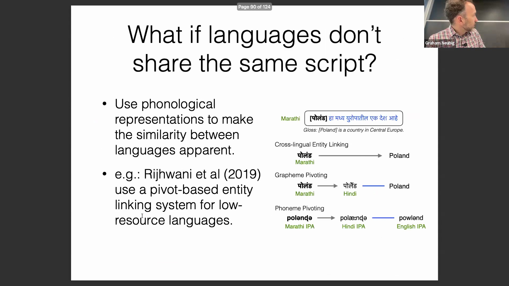

## 语言专家与基于适配器的微调
当前多语言适配的最先进方法(State-of-the-Art)高度依赖参数高效(Parameter-Efficient)架构，例如语言专家(Language Experts)与适配器(Adapters)。该范式摒弃了为每种语言独立训练完整模型的做法，转而在共享的骨干模型(Backbone Model)特定层中插入轻量级模块化组件。这些适配器通常采用瓶颈设计(Bottleneck Design)，先对隐藏层表示(Hidden Representations)进行下投影(Down-projection)，随后再上投影(Up-projection)恢复（其机制类似于 LoRA(Low-Rank Adaptation) 或标准适配器模块）。该方法仅需微调极少量的参数，即可实现高效的特定语言适配，同时完整保留基础模型的跨语言通用知识。

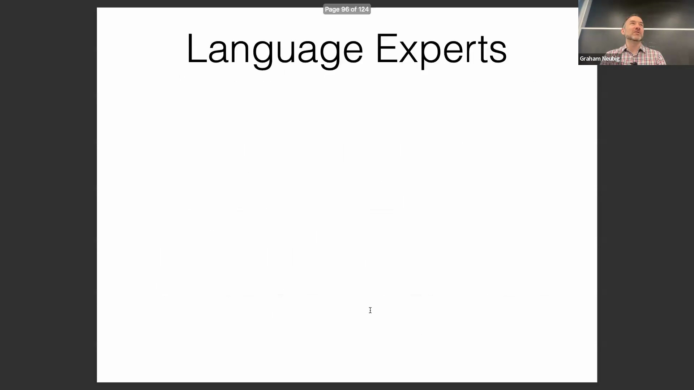
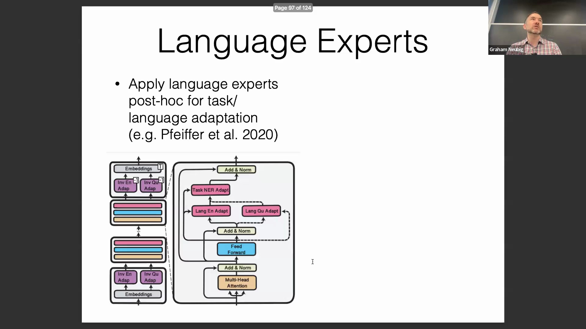

---

## 语言特定参数与基于任务的适配器
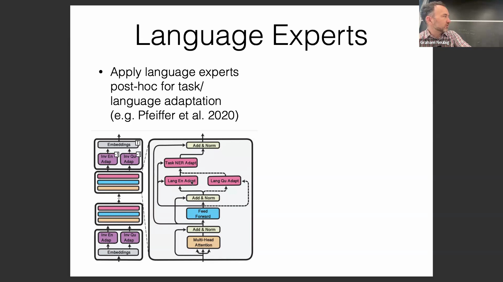
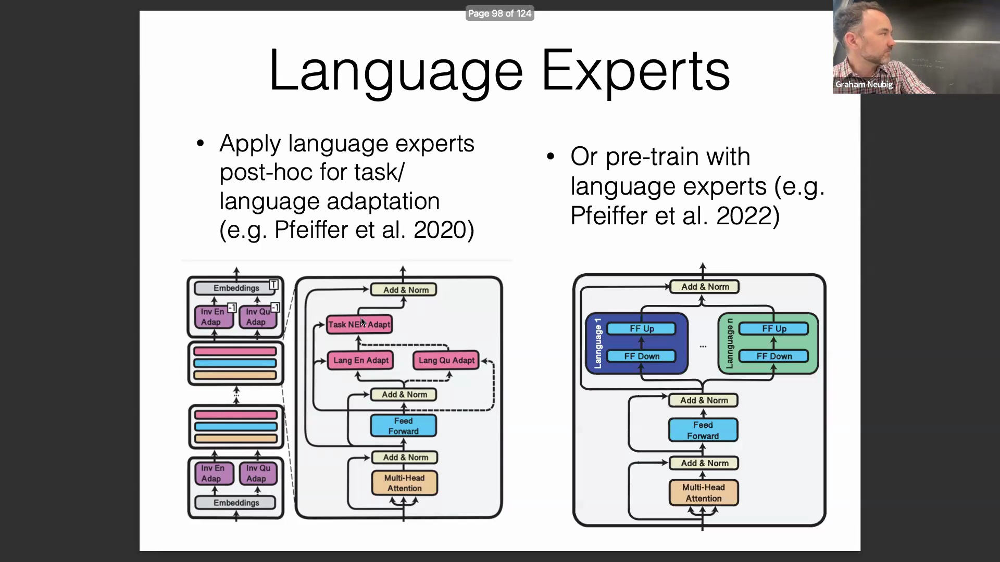
该框架为每种语言引入了语言特定参数(Language-Specific Parameters)，并结合了基于任务的适配器(Task-Based Adapters)。根据所解决的具体任务，适配器会被插入到模型的相应位置。研究还表明，可以在预训练阶段引入语言特定参数，使其在适配器架构中发挥有效作用。

## 用于摘要生成的前缀微调与 LoRA

类似的方法已被应用于文本摘要生成(Text Summarization)任务，相关研究对比了前缀微调(Prefix-Tuning)与 LoRA(Low-Rank Adaptation) 方法。结果表明，可以训练一个统一的单一模型，其中每种语言保留其专属的前缀微调或 LoRA 参数。这种参数高效(Parameter-Efficient)的策略已被证明在提升模型整体容量和适应性方面极为有效。

## 用于低资源数据创建的主动学习
受限于时间，此处需重点强调的另一个关键策略是主动式数据构建。尽管人工标注(Human Annotation)是一种可行方案，但为低资源语言(Low-Resource Languages)获取大规模数据集依然极为困难。为此，可采用主动学习(Active Learning)方法。其核心理念是：利用初始标注数据训练基线模型(Baseline Model)，将其应用于大量未标注数据(Unlabeled Data)，并筛选出模型预测不确定性(Uncertainty)较高的样本进行后续标注。这种定向策略能够高效地识别出当前模型信心不足或表现欠佳的数据样本。尽管主动学习并非多语言学习(Multilingual Learning)所独有，但在标注预算(Annotation Budget)严格受限的情况下，它显得尤为宝贵。
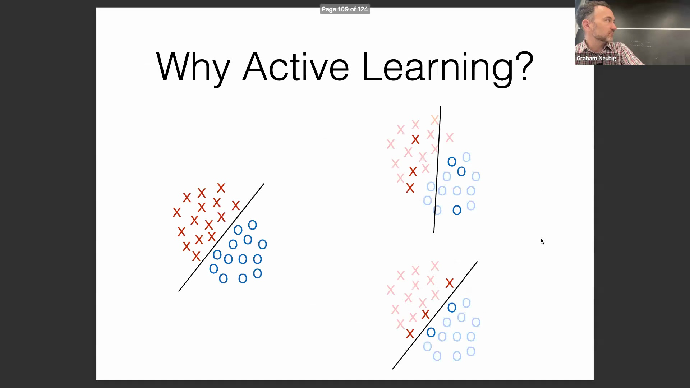
这一基本原理在二分类(Binary Classification)场景中得到了清晰展示。随机标注(Random Annotation)往往难以充分捕捉关键的决策边界(Decision Boundary)，可能导致模型在稀疏且缺乏代表性(Representativeness)的数据点上进行训练，从而影响模型准确性。相比之下，主动学习能够策略性地优先对决策边界附近的数据进行标注，从而生成更高效的训练样本。

## 平衡不确定性与代表性
驱动这一数据选择过程的两个核心概念是：不确定性(Uncertainty)与代表性(Representativeness)。目标是筛选出模型预测不确定性较高且具备数据代表性的样本。仅关注代表性仍能取得相对不错的效果；例如，在机器翻译(Machine Translation)任务中选择富含高频短语的数据，可提升模型对常见表达(Common Expressions)的覆盖范围。反之，关注不确定性有助于识别模型当前的知识盲区。然而，若完全依赖不确定性，可能会引入噪声数据(Noisy Data)或无关数据(Irrelevant Data)（例如仅包含表情符号的样本），这些数据对训练鲁棒(Robust)模型并无益处。

## 多语言嵌入覆盖与总结
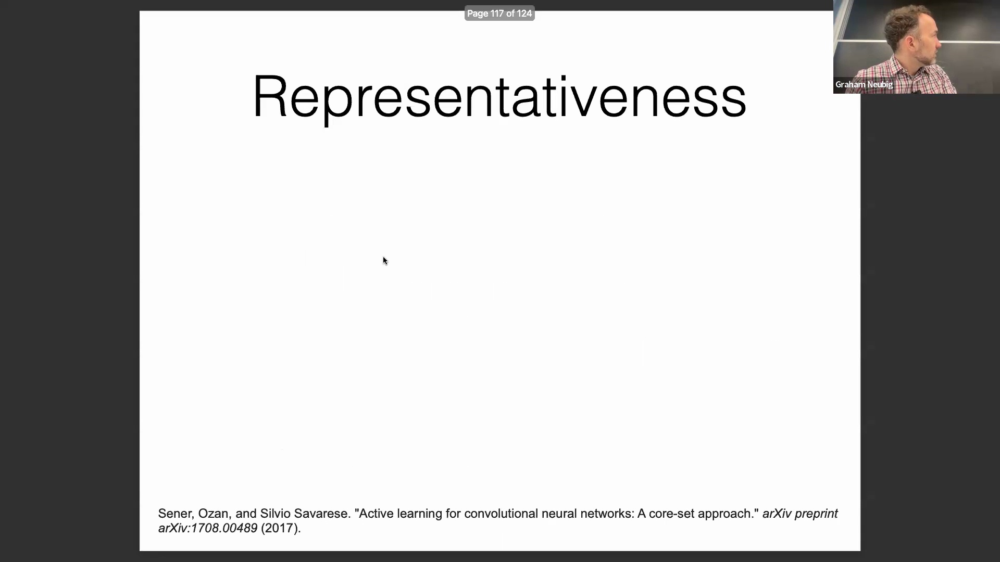
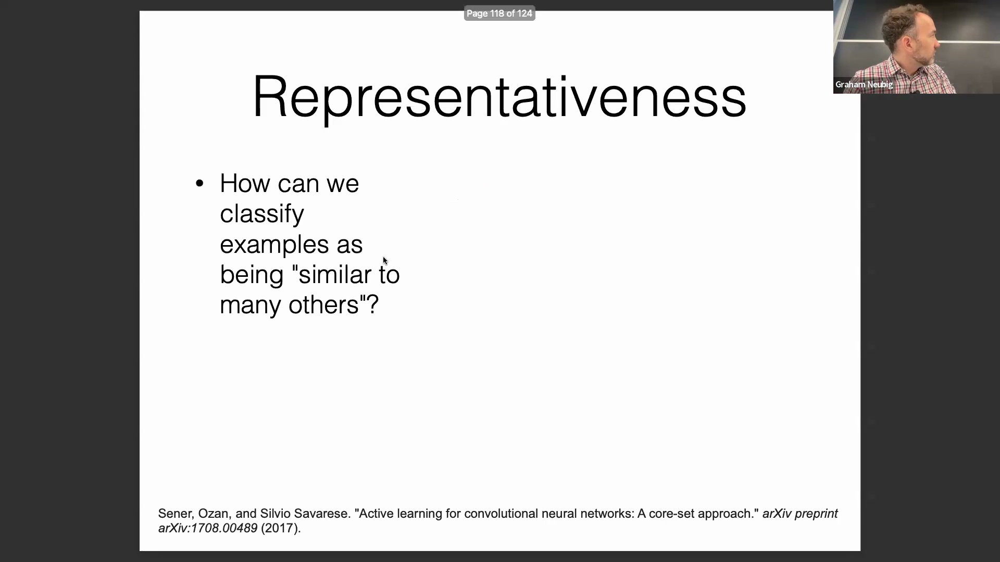
为有效实施这一策略，不确定性可通过模型置信度分数(Confidence Scores)来衡量，而代表性则侧重于在包含所有可用数据的嵌入空间(Embedding Space)中实现全面覆盖。 
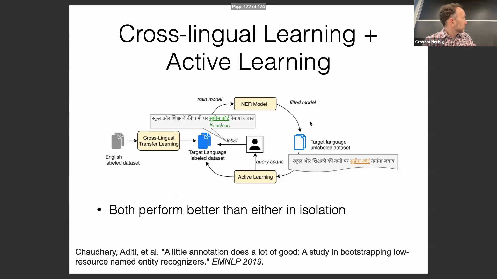
此外，这些主动学习策略可扩展至多语言场景，并与跨语言迁移(Cross-Lingual Transfer)技术相结合，从而在跨语系范围内最大化数据利用效率。 
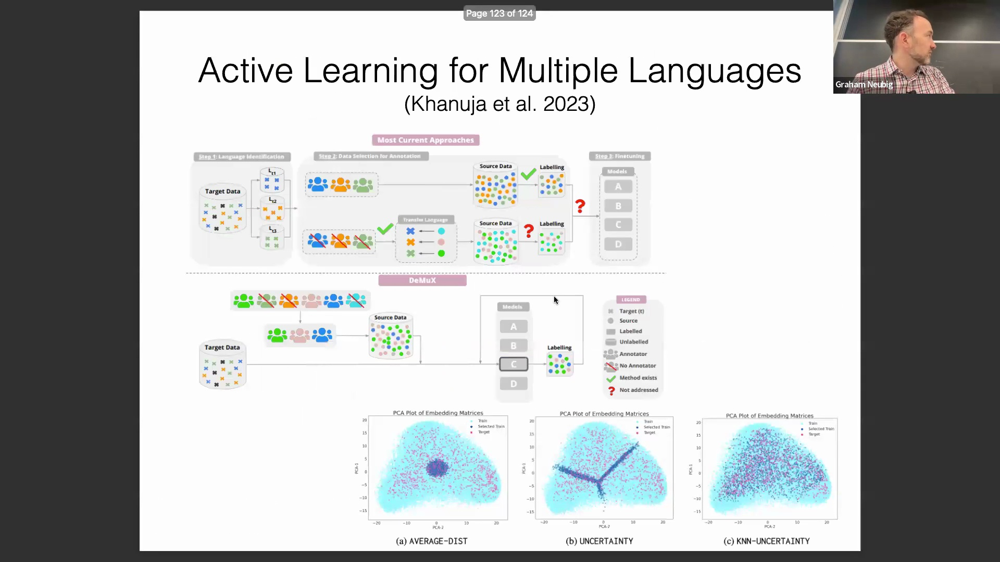
随附的演示文稿中提供了更多关于如何执行该流程的实际示例，作为本次内容的总结。