## 语言模型简介

本次课程将介绍语言模型(Language Modeling)。显然，这是一个宏大的主题，无法在一节课内面面俱到。本堂课主要聚焦于构建语言模型(Language Model)的基础概念：什么是语言模型？如何评估语言模型，以及与之相关的其他问题。在课程接近尾声时，我会简要讲解如何在神经网络中进行高效实现。这部分内容虽不直接涉及语言模型的理论本身，但对于大家完成作业至关重要，因此我也会一并涵盖。

## 生成式模型与判别式模型
好的，首先我想讨论生成式模型(Generative Model)与判别式模型(Discriminative Model)。之所以从这里讲起，是因为我们此前一直在探讨判别式模型。这类模型主要用于计算在给定输入数据条件下，某个潜在特征(Latent Trait)的概率，即计算条件概率 $P(y|x)$。其中，$y$ 是我们想要预测的目标变量，而 $x$ 是输入数据。简单回顾一下上节课的内容：上节课例子中的 $x$ 是什么？有人记得吗？没错，是文本。那 $y$ 呢？应该不难猜。对，在情感分析任务中，$y$ 正是类别或情感标签。
另一方面，生成式模型计算的是数据本身的概率，而不仅限于条件概率。它有多种表现形式。此处的分类并非完全标准的学术术语，而是我个人的归纳总结。在这里，我们首先看到的是数据 $x$ 的边缘概率(Marginal Probability) $P(x)$。

此外，我们也可以计算 $x$ 和 $y$ 的联合概率(Joint Probability) $P(x, y)$。

## 核心功能：打分与生成
概率语言模型(Probabilistic Language Model)的基本功能就是计算此类概率，通常我们将其视为数据 $x$ 的边缘概率(Marginal Probability) $P(x)$，其中 $x$ 可以是一个句子或一篇文档等。它本质上是一种对语言进行概率建模的生成式模型。近年来，“语言模型”的定义有所扩展。如今，人们也将能够计算文本与图像联合概率的模型称为多模态语言模型(Multimodal Language Model)等。我认为这是传统定义的一个重要例外（或扩展）。通常，语言模型主要计算纯文本的概率，但出于本课程的目的，我们暂时先聚焦于文本模态。
使用语言模型(Language Model, LM)主要有两项基本操作，几乎所有其他应用都可以归结为这两类之一。第一项是**句子打分(Sentence Scoring)**，即计算给定句子的概率。例如，计算句子“Jane went to the store.”的概率，理想情况下它会获得很高的分数。而对于像“词语大杂烩(Word Salad)”这样无意义的词串，英语语言模型会赋予其极低的概率。如果引入一个中文语言模型，理想情况下它同样会给这句英文打低分，因为该模型是针对自然中文语料训练的。因此，语言模型的性能也会因其训练目标和语料的不同而有所差异。
另一项核心功能是**句子生成(Sentence Generation)**。关于生成的具体方法我们稍后会详细讨论，但通常可归纳为两类。一类是**采样(Sampling)**，即从语言模型输出的概率分布中（有时会对分布进行温度等参数调整）随机采样生成句子。另一项（幻灯片上未列出）是**寻找最高得分句子**，即基于语言模型找出概率最大的目标序列。在实际应用中，这两种策略我们都会用到。

## 实际应用：问答、排行榜与文本续写
这些功能如何应用于实际场景？它们可以广泛服务于问答任务(Question Answering)。例如，面对一道多项选择题(Multiple-Choice Question)，我们可以对各个备选答案进行打分。具体做法是：将题目 $q$ 与各个选项分别拼接，计算完整序列 $x_1$、$x_2$、$x_3$、$x_4$ 等的概率，随后选择概率最高（即得分最高）的选项。

实际上，业界有一个著名的语言模型排行榜，想必许多人都有所耳闻，那就是 Open LLM Leaderboard（开源大语言模型排行榜）。

该排行榜上的许多评估任务，本质上都是基于上述打分机制。例如 HellaSwag 数据集就类似于多项选择题。你可以将其设想为一系列常识推理任务(Commonsense Reasoning)，它们均通过计算选项得分来评估。这是目前使用语言模型非常普遍的一种范式。
另一个常见应用是**基于提示的文本续写(Prompt-based Text Completion)**。这本质上是一个采样过程。你将输入文本 $X$ 提供给模型，随后要求它生成最可能的后续内容，或者通过采样生成多个补全结果以获取答案。这种交互方式非常普遍，相信大家对此已十分熟悉。

## 进阶应用：分类、语法纠正与自回归模型
除此之外，语言模型还有许多其他用途，例如文本分类(Text Classification)。实现分类有多种途径。其中一种方法是：假设你有一句情感评论“This is great.”（这很棒），你可以构造一个提示(Prompt)“Star rating:”（星级评分：）。

接着在其后补上候选词“Five”（五星）。同理，你也可以构造“Star rating: Four.”、“Star rating: Three.”、“Star rating: Two.”等序列。

以及“Star rating: One.”。随后分别计算所有这些完整序列的概率，并找出概率最高的选项。这是利用语言模型进行分类的常用方法之一。
另一种有趣但尚未被充分探索的方法是：构造类似“Star rating: High.”（高星级）的提示，并让模型**生成(Generation)**输出。其背后的逻辑是：先定义一个代表正面评价的文本概念，然后用它来评估实际评论，判断生成结果是否与预期的正面语义相匹配。已有少数论文探讨了此类方法，这是一篇较早的相关研究。

此外，还有一篇较新的相关研究。

这些研究展示了如何融合生成式(Generative)与判别式(Discriminative)方法来进行分类任务。

这是语言模型的另一种应用范式。还有一种做法是**基于给定文本直接生成分类标签**。例如，输入提示“This is great. Star rating:”，然后让模型直接生成目标词“Five”。

最后，语言模型还可用于语法纠错(Grammatical Error Correction)等任务。例如，你可以计算句子中每个词的条件概率，找出概率异常低的词汇并进行替换；或者直接向模型下达指令，要求它“改写以下短语”，模型便会将其重述为语法更通顺的版本。总而言之，正如我所强调的，语言模型的应用场景非常广泛，能够胜任多种多样的任务。但归根结底，它们的核心操作基本都归结为两类：**打分(Scoring)**或**生成(Generation)**。 
接下来，我将专门介绍一类特定的语言模型——**自回归语言模型(Autoregressive Language Model)**。这类模型通过链式法则逐步因子化(Step-by-step Factorization)序列，以此专门计算此类概率。

---

## 自回归语言模型与方向性

在此框架下，我们首先计算第一个词元(Token)的概率，随后计算在给定前一个词元条件下下一个词元的条件概率(Conditional Probability)，以及在给定前两个词元条件下第三个词元的条件概率。这种计算通常遵循从左到右(Left-to-Right)的顺序，即从序列的起始位置到结束位置依次进行。因此，“下一个词元”是基于上下文(Context)生成的，而此处的上下文通常指序列中先前已出现的词元。大家能想到在什么情况下可能需要从右到左(Right-to-Left)处理，而不是从左到右吗？没错，例如我们刚刚提到的书写方向。这正是我希望听到的答案。对于从右向左书写的语言（如阿拉伯语(Arabic)和希伯来语(Hebrew)），其文本生成在时间顺序上同样遵循“从先到后”的逻辑。试想人们的说话方式：英语使用者的第一个词写在左侧，仅是书写习惯使然；而阿拉伯语使用者的第一个词则写在右侧。这种时间顺序的处理机制正是如此。当然，可能存在其他需要从右到左处理的理由，但真正核心的并非“从左到右”这一绝对方向本身，而是在处理自然语言时，遵循“从序列起始到结束”的线性顺序(Linear Order)至关重要。

## 概率分解与计算复杂度
这里需要指出一点，这基于一条基本的概率法则：若计算多个变量的联合概率(Joint Probability)，即所有变量同时出现的概率，可将其表示为条件概率的连乘形式，即链式法则(Chain Rule)。因此，我们并未引入任何近似(Approximation)或妥协，但该方法的效果完全取决于我们能否准确预测这些条件概率。这里还有一个关键问题：大家知道我们为何要进行这种概率分解吗？为什么不直接尝试预测整个序列 $x$ 的概率呢？即使是较短的句子，为何我们不直接计算其整体概率，而非要采用这种逐步分解的方式呢？如果直接对长序列进行整体建模，确实容易导致概率空间爆炸或生成无意义的“词语大杂烩(Word Salad)”。这一点提得很好。以我们之前讨论的模型为例，上次我仅简要提及，这次展开说明。“This is great.” 这个句子很可能从未在训练数据中出现过。如果我们仅对训练集中出现过的序列分配非零概率，那么对于大量未见过的句子，模型的概率估计将直接归零（即面临严重的稀疏性(Sparsity)问题）。这正是我想强调的核心原因。我们不直接预测整个句子的根本原因在于分类问题的规模(Scale)。预测下一个词时，我们需要解决的分类问题规模仅为词表大小(Vocabulary Size) $V$；但若直接预测整个序列，分类问题的规模将膨胀至 $V^n$（$n$ 为序列长度），这是一个极其庞大的数字。词表本身已足够庞大，直接进行整体预测几乎不可行。因此，通过链式分解，我们将原问题拆解为 $n$ 个规模为 $V$ 的独立预测任务，这在计算上变得切实可行。当然，学术界也确实存在其他替代方案。

## 掩码语言模型与自回归方法
其中一种非常知名且广泛应用的模型是掩码语言模型(Masked Language Model, MLM)。如果你接触自然语言处理(Natural Language Processing, NLP)领域超过两年，很可能听说过 BERT、DeBERTa、RoBERTa 等模型。它们的核心机制是：将句子中的某个词元进行掩盖(Mask)，然后基于剩余上下文来预测该被掩盖的词元。

例如，将单词“is”遮盖，随后尝试基于句子中其他所有词元对其进行预测。这类模型主要存在两个局限。第一，它们无法提供严格归一化(Normalized)的完整序列概率。因为概率的链式法则仅在“以已生成的历史序列为条件”时才严格成立。

因此，从能够直接计算完整序列概率的角度来看，它们并非严格意义上的自回归语言模型。第二，它们难以直接用于文本生成(Text Generation)，因为生成任务需要遵循确定的自回归顺序，而掩码语言模型并未定义这种生成次序。因此，它们在计算上下文表示(Contextual Representation)（如特征向量）方面表现优异，但在生成任务上则显得不够实用。此外，还存在基于能量的语言模型(Energy-Based Language Model)，其本质是构建一个评分函数(Score Function)，并不强制遵循从左到右或从右到左的单向顺序。

这属于相对进阶的主题，若大家感兴趣我可以进一步展开，但首先我们回归主线。另外，如今广为人知的 GPT、Llama 等模型，均属于自回归语言模型。大家对于这部分还有什么疑问吗？有人问：在掩码语言模型中，能否仅掩盖最后一个词元并进行预测？理论上当然可以，但标准 MLM 并非以此方式训练，因此直接这样用效果不佳。如果你持续按照“仅掩盖并预测末尾词元”的方式训练模型，那么它实质上就退化成了自回归语言模型。这相当于又绕回了原点。

## 一元语言模型与未知词处理
接下来介绍一元语言模型(Unigram Language Model)。最基础的语言模型便是基于词频计数的一元模型。其核心假设是：放弃考虑上下文词序，即假设当前词元的出现与历史词元完全独立，从而独立地预测其概率。基于此假设，概率预测变得极为简单：只需统计目标词元在训练语料库中的出现频次，再除以语料库中的总词元数，即可得到其概率。这属于语言模型的“入门级”实现，仅需三行 Python 代码即可完成最基础的一元模型构建。

然而，该模型存在若干显著缺陷。首要问题是如何处理未登录词(Out-Of-Vocabulary, OOV)。在该模型中，若遇到训练集中从未出现过的词元会怎样？包含任何未登录词的序列，其整体概率将如何计算？

没错，整个序列的概率会直接归零。这对于纯生成任务或许影响有限（模型仅输出已见词元即可），但对于概率打分(Scoring)任务而言则是致命缺陷。在机器翻译(Machine Translation)等任务中同样如此：当遇到未登录词时，我们期望模型能进行合理推断或翻译，但一元模型无法做到。因此，这是一个必须解决的关键问题。我们该如何解决呢？主要有几种策略。第一种是采用字符级(Character-level)或子词级(Subword-level)分词(Tokenization)。这也是当前业界的首选方案。例如，使用 SentencePiece 等工具构建子词词表，通过将未知词拆解为更短的子词单元，从根本上消除未登录词问题。若大家对此有深入研究兴趣（例如作为课题研究），还存在其他替代方案。例如构建“未登录词模型(OOV Model)”。其核心思想是：采用词级模型预测已知词元的概率，同时引入字符级模型(Char-level Model)专门处理未登录词的概率估计。由此形成一个层次化模型(Hierarchical Model)：优先尝试词级预测，若失败则回退至字符级预测。尽管该方法如今已较少使用，但理解其设计思路仍具有重要的学术价值。

## 对数概率与数值稳定性

接下来讨论第二个关键细节：对数空间(Log Space)的参数化(Parameterization)。概率的连乘运算可等价转换为对数概率(Log Probability)的累加运算。这一技巧至关重要，并广泛应用于所有语言模型（涵盖一元模型与神经网络语言模型(Neural Language Model)）。采用该方法的原因非常直观：大家能想到原因吗？若将约 30 个词元的概率直接相乘会发生什么？没错，结果将趋近于极小值，极易引发浮点数下溢(Floating-Point Underflow)问题。

---

## 数值下溢与对数概率的使用

本节首先探讨在标准硬件上计算概率时面临的数值下溢（Numerical Underflow）问题。在纯数学中，极小的概率值不会引发问题，但在采用 32 位浮点数（32-bit Floating Point）的计算机系统中，有限的指数范围会导致极小的数值直接下溢为零。 

这将导致原本可能发生的事件被错误地赋予零概率（Zero Probability）。 

为解决这一问题，通常采用对数概率（Log Probability）进行计算。 

通过将类似 $10^{-30}$ 的极小值转换为如 -30 这样便于处理的数值，我们不仅有效避免了数值下溢，还保证了计算的稳定性与人类的可读性。

## 一元模型（Unigram）中的参数

在一元语言模型（Unigram Language Model）中，每个词（Word）的概率均被视为独立的模型参数（Model Parameter）。因此，一元模型的参数总数恰好等于词汇表大小（Vocabulary Size）。该架构十分直观：通过统计词语的出现频次并除以总词元（Token）数量即可计算概率。此过程仅需一段简短的 Python 脚本便可轻松实现。

## 高阶 N-gram 模型与数据稀疏问题

高阶 N-gram 模型（High-order N-gram Model）通过将上下文窗口（Context Window）限制为固定长度 $n$ 来扩展这一概念。其概率计算方式为：统计特定词序列的出现频次，并除以其前置上下文的频次。然而，这种方法引入了一个重大挑战：数据稀疏性（Data Sparsity）。 

每当模型遭遇训练语料中未曾出现的序列时，其对应计数为零，进而导致该序列的整体概率被计算为零。 

为处理未见序列（Unseen Sequences）并避免零概率问题，N-gram 模型引入了一种回退（Backoff）机制，即通过与更短、更低阶的模型进行插值（Interpolation）来予以应对。

## 跨模型阶数的插值

该机制通过在不同上下文长度之间对概率进行插值来运作。例如，一个 4-gram 模型会首先计算其特定概率；若数据稀疏，则会与三元模型（Trigram）进行插值，三元模型继而与二元模型（Bigram）插值，最终与一元模型（Unigram）插值。在此语境下，$n$ 严格指代上下文长度（Context Length）。这种分层插值策略（Hierarchical Interpolation）有效结合了长上下文的高精度与短上下文的强覆盖能力。

## 模型集成与实际应用

这种插值策略是模型集成（Model Ensemble）的基础范例，通过融合多个具有互补优势的模型，在精度与数据稀疏性之间取得平衡。尽管传统 N-gram 模型凭借极高的计算效率在处理海量数据集时依然表现优异，但本文探讨的插值与平滑（Smoothing）技术具备广泛的适用性。即便在采用更现代的神经网络（Neural Network）架构时，这些方法对于提升模型泛化能力（Generalization Ability）及处理词表外（Out-of-Vocabulary, OOV）场景仍具有重要价值。

## 加法平滑技术
插值系数（Interpolation Coefficient，通常记为 $\lambda$）的确定可通过分配固定权重的简单方法实现（例如，为高阶模型设定 $\lambda=0.8$，为回退模型设定 $0.2$）。然而，加法平滑（Additive Smoothing）等更复杂的方法提供了动态调整的能力。该技术通过在概率计算的分子与分母中同时加上一个平滑参数 $\alpha$ 来实现。此举可有效避免零计数（Zero Count）问题，确保模型维持非零的概率基线，从而在缺乏经验证据（Empirical Evidence）时，能够合理地依赖先验分布（Prior Distribution）。

## 基于证据的动态权重调整
加法平滑会根据可用训练证据的规模，动态调整模型对高阶分布的依赖程度。当观测计数为零或极低时，模型会赋予平滑参数 $\alpha$ 更大的权重，从而有效回退至均匀分布（Uniform Distribution）或先验分布。随着观测计数的增加，插值权重将依据公式 $\lambda = \frac{\text{计数总和}}{\text{计数总和} + \alpha}$ 进行动态偏移。 

因此，随着训练证据日益充分与可靠，模型会对特定的高阶 N-gram 概率赋予更高的置信度（Confidence），逐步削弱平滑先验的影响，并最终向真实的经验分布（Empirical Distribution）收敛。

---

## 平滑与折扣法基础
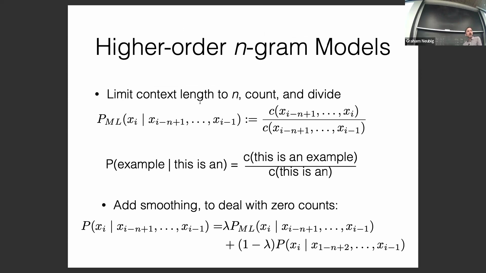
语言模型平滑(Smoothing)背后的核心思想在于模型如何根据上下文对统计证据进行加权。当观测到的计数(Count)总和较大时，模型会更依赖高阶分布(Higher-order distribution)；反之，若计数稀疏，模型则会采用回退(Backoff)策略，转而更依赖低阶分布(Lower-order distribution)。本质上，经验证据越充分，模型对特定上下文的依赖程度就越高。这一原则构成了各类平滑技术的基础。除了简单的插值法(Interpolation)，还有引入折扣系数(Discounting)的折扣法。该方法通过一个超参数从每个观测计数中减去一个固定值（例如 0.x）。实践证明，这种减法操作能更准确地从数学层面拟合自然语言固有的长尾分布(Long-tailed distribution)。该理论可通过严谨的数学推导得出，并在早期奠基性文献中有详细论述。

## Kneser-Ney 平滑与模型集成

在神经网络占据主导地位之前，Kneser-Ney平滑(Kneser-Ney Smoothing)曾是语言建模领域的最前沿技术。该方法不仅对高阶计数应用折扣，还会智能地调整低阶分布(Lower-order distribution)。具体而言，它根据一个词在完全*新颖(Novel)*上下文中出现的频率来调整其低阶计数。其核心逻辑在于：当模型遭遇未见过的或全新的高阶上下文时，应主要依赖低阶分布进行预测。在深刻理解这一回退(Backoff)机制后，研究者能够巧妙地重构低阶分布，从而在主要上下文信号较弱时最大化预测准确率。尽管神经模型在很大程度上已取代了这些传统技术，但其中蕴含的一个关键洞见对现代实践依然至关重要：在组合或集成(Model Ensemble)多个语言模型时，必须审慎评估各模型在特定上下文中的优势，因为不同模型天然会在各异的语言场景中表现出最佳性能。

## 推动向神经网络模型转变的局限性
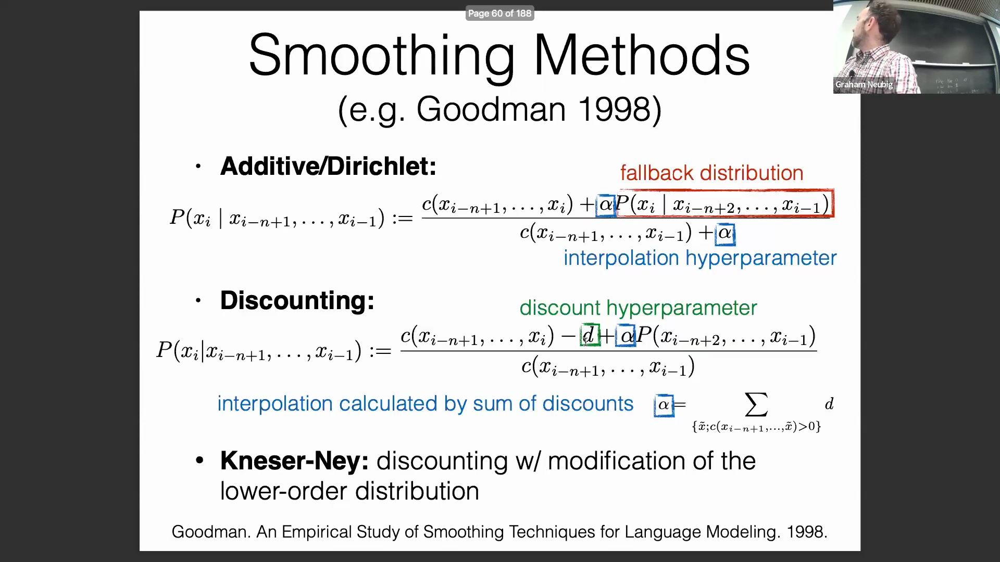
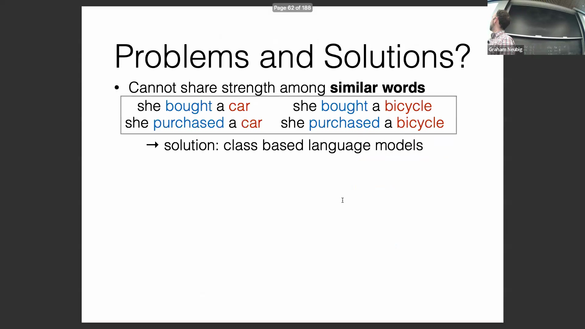
n-gram模型的若干结构性缺陷直接促使业界转向神经语言模型(Neural Language Model)。首先，与早期的文本分类方法类似，n-gram模型无法在语义或句法相似的词之间共享统计强度(Sharing statistical strength)（例如，将 "buy" 和 "purchase" 视为毫无关联的词元(Token)）。其次，它们对中间上下文的鲁棒性较差。一旦上下文窗口中出现罕见或未见过的词，模型便会立即回退至一元分布(Unigram distribution)，从而导致预测质量大幅下降。第三，n-gram架构从根本上无法捕捉超出其固定窗口范围的长距离依赖(Long-range dependency)。在神经网络问世之前，研究人员针对上述问题提出了大量零散的修补方案。然而，将这些方案全部整合的工程实现过于复杂且难以维护，以至于多数从业者最终只能直接采用开箱即用(Out-of-the-box)的标准 n-gram 模型，而这使其难以满足现代应用对可扩展性(Scalability)的需求。

## N-Gram 模型的效率与记忆优势

尽管神经网络在统一应对上述语言建模挑战方面展现出显著的工程优势，但 n-gram 模型仍保有独特的实用价值。虽然神经模型通常能取得更优的生成性能，但 n-gram 模型的概率估计(Estimation)与推理(Inference)速度极快，且计算过程可实现完全并行化。此外，在建模极低频现象(Rare phenomena)时，n-gram 模型有时甚至能超越神经网络。它仅需单次观测即可“记住”特定序列并为其分配高概率。相比之下，神经模型往往难以有效记忆或从孤立样本中泛化(Generalization)，有时会彻底遗忘罕见模式。这一特性使得 n-gram 方法在要求精准且具备数据高效性(Data-efficiency)的检索任务中，依然具有不可替代的实用价值。

## KenLM 与现代大规模应用
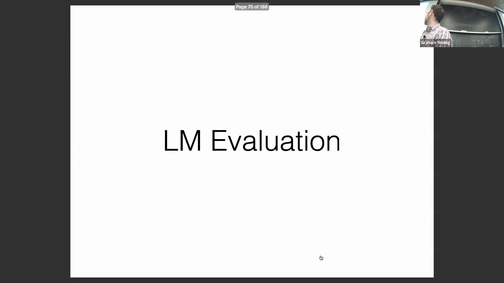

训练与评估 n-gram 模型的标准工具包是 KenLM，其以惊人的运行速度而闻名业界。这也催生了业内的一则趣谈：部分招聘启事要求候选人“具备10年大语言模型(Large Language Models, LLMs)工作经验”。尽管大型神经模型问世不久，但 KenLM 的开发者实际上早已积累了同等量级的经验——他曾在词表规模超 10 万词元(Token)的 Web 级语料库(Web-scale corpus)上训练过庞大的 7-gram 模型。此类模型的理论参数空间(Parameter space)令许多现代神经 LLM 相形见绌，但由于绝大多数 n-gram 计数为零，模型依然保持了高度稀疏性(High sparsity)与内存高效性(Memory efficiency)。这种可扩展性(Scalability)在当今的现代应用中依然大放异彩。例如，近期论文 *Data Selection for Language Models via Importance Resampling*（基于重要性重采样的语言模型数据选择）便充分利用了 n-gram 的高效特性来处理海量网页数据集。由于在全互联网规模上直接运行神经模型计算成本过高，作者采用高效的 n-gram 模型对词频计数拟合高斯分布(Gaussian distribution)，从而为下游的神经模型训练实现了高效的大规模数据筛选。

## 语言模型评估指标

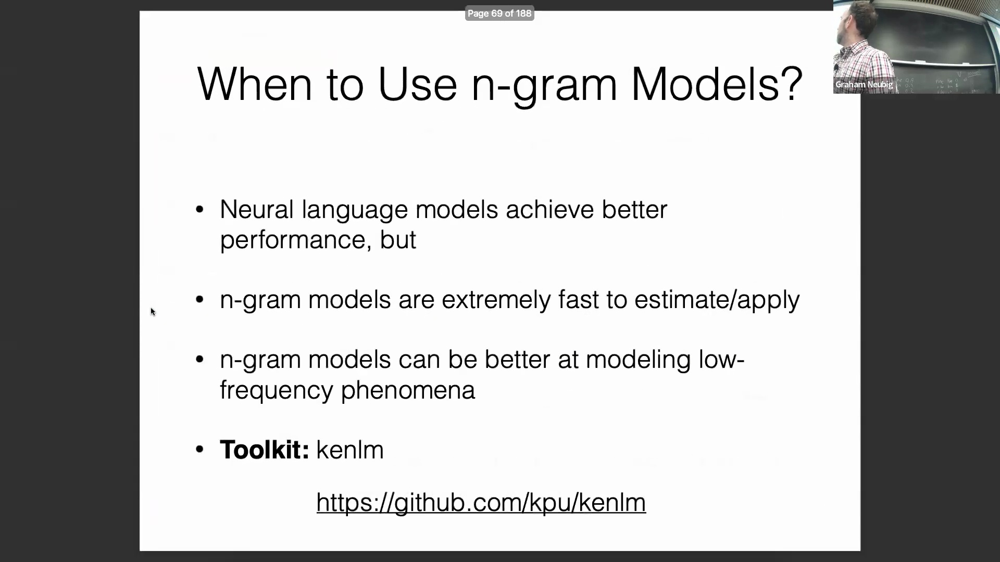
评估语言模型在核心任务上的表现需要标准化的评估指标，其中对数似然(Log-likelihood)是最基础的方法。计算该指标时，需对保留测试集(Held-out test set)中所有句子的概率取对数并求和。然而，原始对数似然极少直接用于模型对比，因其数值与数据集规模高度相关：语料库越大，累计的对数值越负（绝对值越大）。因此，词元级别对数似然(Token-level log-likelihood)成为了业界标准，其计算方式为将语料库的总对数概率除以词元(Token)总数。许多学术论文倾向于报告负对数似然(Negative Log-Likelihood, NLL)，因为它与标准的损失函数定义一致，即数值越低代表模型性能越优。另一项广泛使用的指标是交叉熵(Cross-Entropy)，用于量化模型在独立测试集上的泛化能力。传统上，交叉熵采用以 2 为底的对数进行计算。这一做法在很大程度上源于信息论(Information Theory)的历史沿革：在信息论框架下，概率分布直接对应最优数据压缩方案，因此交叉熵直观地衡量了对测试数据进行编码所需的平均比特数。

---

## 语言模型与数据压缩
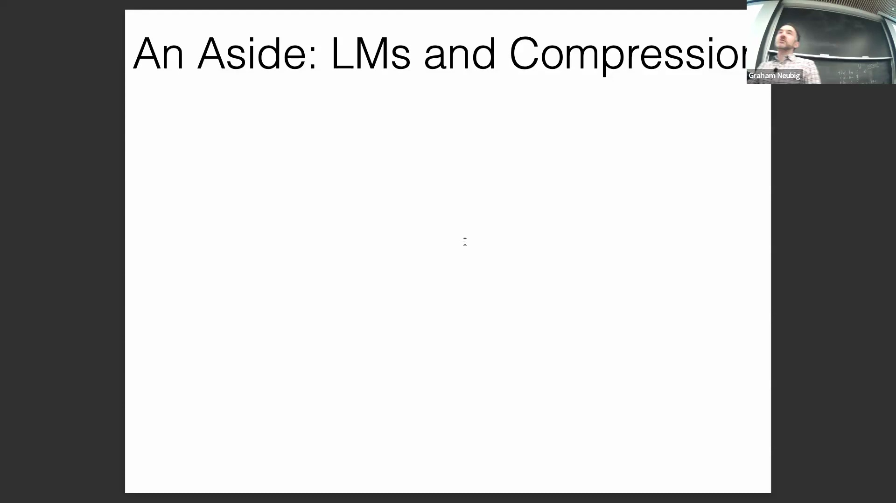
正如 gzip、bz2 或 zip 等工具可以将文件压缩成更小的体积一样，任何概率语言模型(Probabilistic Language Model)从根本上都可用于数据压缩(Data Compression)，将数据转化为更紧凑的表示形式。其核心原理非常直观：高概率的序列（无论是句子还是更长的文档）可被编码(Encoding)为更短的输出字符串。在信息论(Information Theory)中，这代表了一种理想的数据压缩范式。通过为高概率序列分配较短的编码，为低概率序列分配较长的编码，模型有效地最小化了存储或传输文本所需的总比特长度，从而在概率建模(Probabilistic Modeling)与最优压缩策略(Optimal Compression Strategy)之间建立了直接联系。

## 算术编码与区间细分
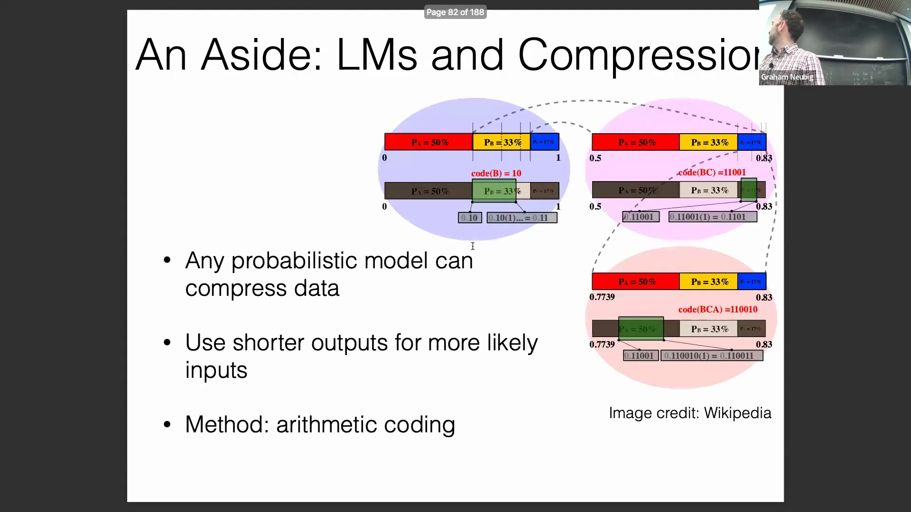
实现这种最优压缩的核心机制是算术编码(Arithmetic Coding)。举例而言，假设词表(Vocabulary)中仅包含三个词元(Token)，其对应概率分别为：Token A 占 50%，Token B 占 33%，Token C 约占 17%。单位区间(Unit Interval) `[0, 1]` 会依据这些概率按比例进行划分。若目标序列仅包含单个 token，算法会递归地细分区间，直至找到一个完全落入该 token 概率范围内的最短二进制字符串。在该概率分布下，Token A 直接映射至二进制前缀(Binary Prefix) `0`；Token B 需进一步细分，映射至 `10`；Token C 概率最低，占据最小区间，映射至 `111`。一旦某个二进制序列完全落入特定 token 的概率区间内，该序列即成为该 token 的压缩表示(Compressed Representation)。

## 上下文概率与编码效率
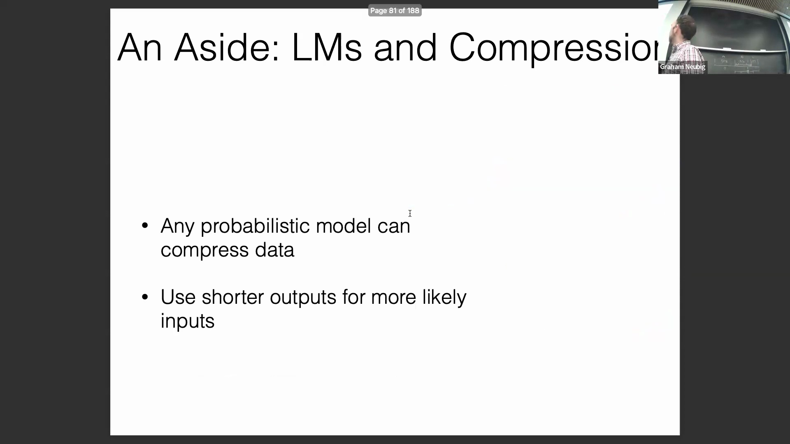
当将算术编码应用于多词元序列(Multi-token Sequence)时（无论采用一元模型(Unigram Model)、n-gram 模型还是神经模型(Neural Model)），该过程会根据上下文动态调整概率分布。若模型判定 Token C 紧跟在 Token B 之后的条件概率(Conditional Probability)极高，则 C 对应的概率区间将显著扩大。区间越大，意味着只需更短的二进制字符串即可唯一标识该范围，从而大幅缩短该序列的编码长度。对于长文本而言，总编码长度将直接收敛至由模型熵值(Entropy)决定的理论比特数。尽管在简化示例中，某些二进制前缀（如示例中的 `110`）可能看似未被使用或存在冗余，但整体编码机制确保了在完整序列中，更高的预测概率始终会转化为更短、更高效的编码。

## 通过预测练习理解困惑度
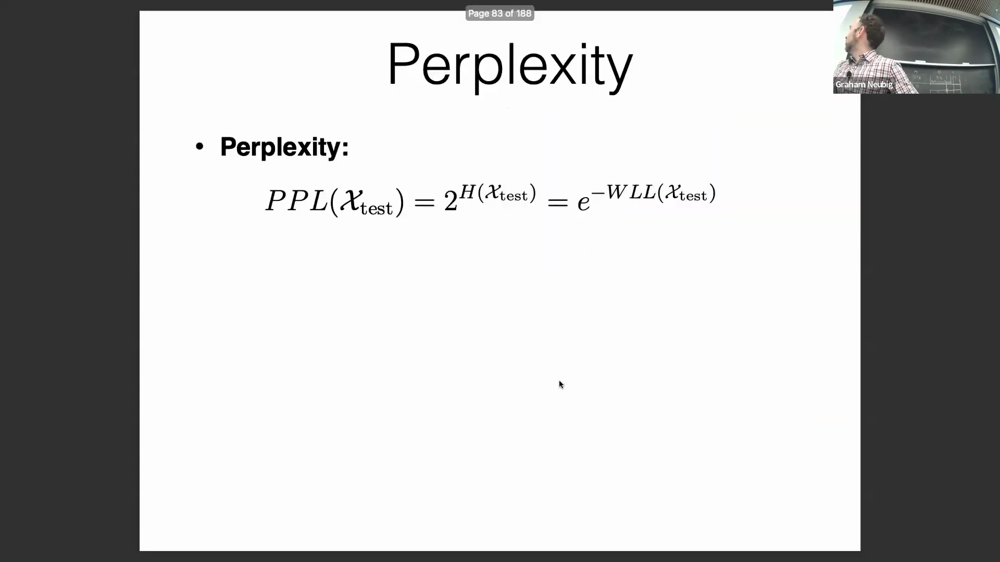
衍生自上述概念的一项核心评估指标是困惑度(Perplexity)，其数学定义通常表示为 $2^{\text{entropy}}$ 或 $e^{-\text{word-level log likelihood}}$（词级对数似然(Word-level Log-likelihood)）。为直观理解困惑度的物理意义，可参考一个交互式预测任务：给定提示语(Prompt) *"If one sees a squirrel, it will usually..."*（如果一个人看到松鼠，它通常会……），人类往往倾向于猜测 *bark*（吠叫）、*run*（跑）或 *chase*（追逐）等符合直觉的动词。然而，像 GPT-2 这类经过充分训练的语言模型则极有可能预测 *start* 或系动词(Copula)。这一现象揭示了人类作为下一词元预测器(Next-token Predictor)时，往往存在认知偏差且概率校准不佳(Poorly Calibrated)。困惑度正是对这一预测难度的量化：它代表了在正确猜出真实下一词元之前，需从模型分布(Model Distribution)中抽样的等效随机选项数量。若模型为正确的词元分配了高概率，其困惑度便会较低（例如约 4.66），这意味着平均而言仅需约 4.66 次猜测即可“命中”正确答案。

## 评估最佳实践与词汇一致性
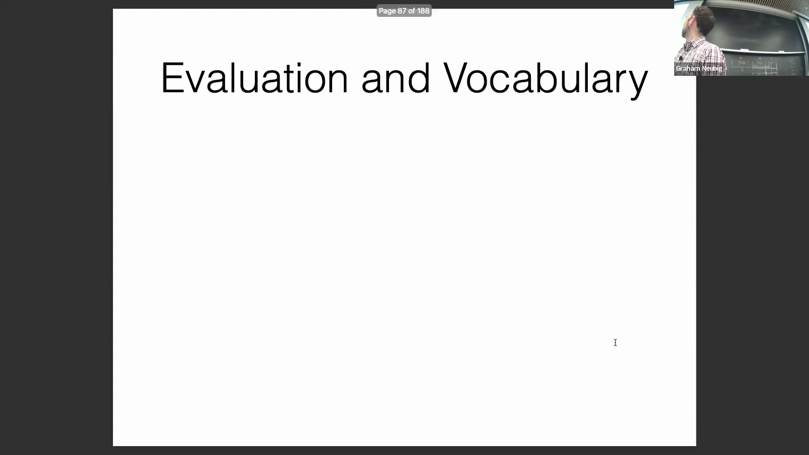
在使用困惑度或对数似然(Log-likelihood)对比不同模型（如 Llama 与 GPT）时，严谨的评估规范(Evaluation Protocol)对于确保基准测试(Benchmarking)的公平性至关重要。其中最关键的因素是，确保所有参与对比模型的归一化分母完全一致。无论困惑度是按词(Word)、词元(Token)还是字符(Character)进行计算，用于除总对数概率的分母（即序列长度）必须保持严格匹配。测试集(Test Set)长度计算方式的细微差异，可能会人为地抬高或压低报告的指标分数，从而导致直接的性能比较(Performance Comparison)产生误导。因此，在解读或发布语言模型评估结果时，统一的分词策略(Tokenization Strategy)与标准化的分母计算是不可妥协的硬性要求。

---

## 公平模型比较与词元化面临的挑战
在比较 Llama 和 GPT-2 等语言模型(Language Model) 时，评估的公平性至关重要。不同的模型采用不同的分词器(Tokenizer)，导致相同文本的词元(Token) 数量存在差异。以不同的分母比较性能指标本质上是不公平的。此外，若允许模型输出未知词或字符（实质上等同于未预测出有效词元），则必须在评估框架(Evaluation Framework) 中对此行为进行明确记录并加以考量。
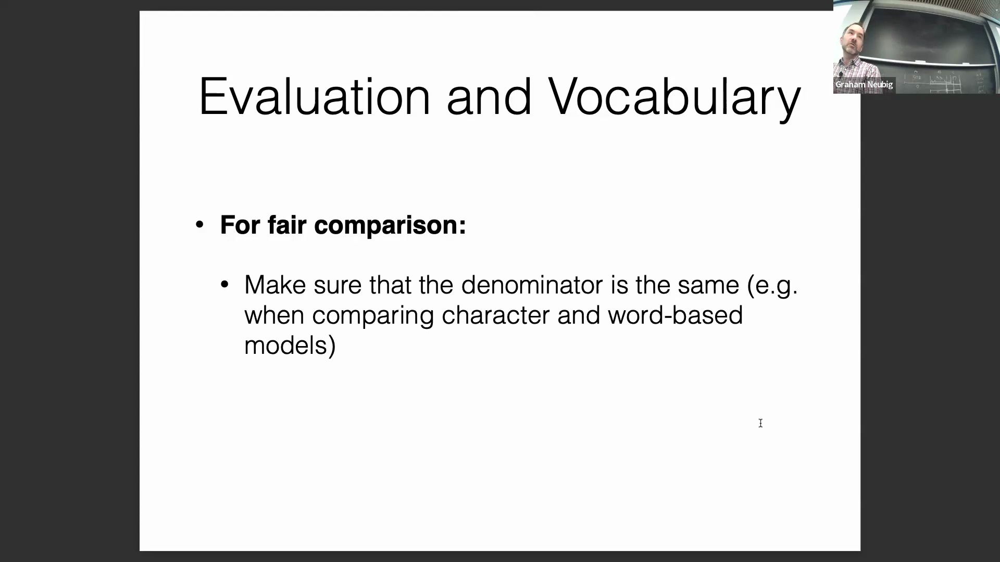

## 基于特征的语言模型
作为传统神经网络与词袋分类器(Bag-of-Words Classifier) 的替代方案，基于特征的模型(Feature-based Model) 会从上下文中提取显式特征(Explicit Feature)，例如前一两个词的具体词汇标识。模型会引入偏置项(Bias Term)，计算得分(Score) 并推导概率(Probability)。特征权重通过随机梯度下降(Stochastic Gradient Descent, SGD) 进行优化。从概念上看，这相当于一个用于预测下一个词元的多分类(Multi-class Classification) 词袋分类器，只是其输出类别被扩展至数万乃至数十万个。这一基础方法约由 Roni Rosenfeld 于 27 年前率先提出，彰显了统计语言模型(Statistical Language Model) 深厚的历史根基。

## 训练机制与固有局限性
尽管在结构上与词袋分类器相似，但特征模型引入了偏置项以及基于特定前序词的条件概率向量(Conditional Probability Vector)，而非仅仅依赖无序的词频统计。训练过程遵循标准范式：计算损失函数(Loss Function) 相对于参数的梯度(Gradient)，并应用反向传播算法(Backpropagation) 更新权重。该架构成功解决了上下文中存在间隔词时的条件建模问题，允许直接进行上下文条件化(Context Conditioning)，而无需强制采用僵化的 n-gram 组合。然而，该模型无法在语义相似的词之间共享统计强度(Statistical Strength)，且仍严格受限于固定的上下文窗口(Context Window)，因此未能解决长距离依赖(Long-range Dependency) 问题。
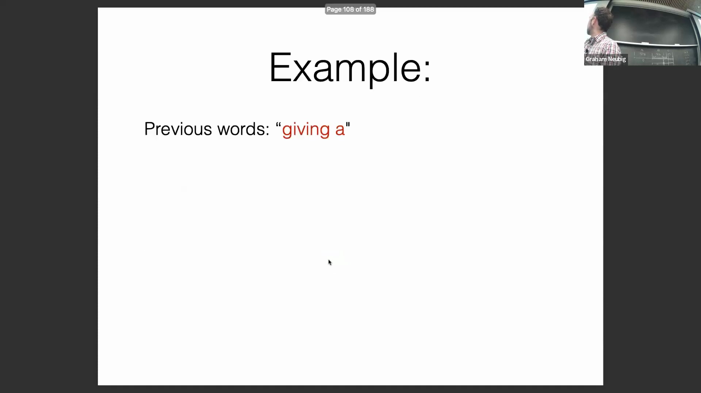
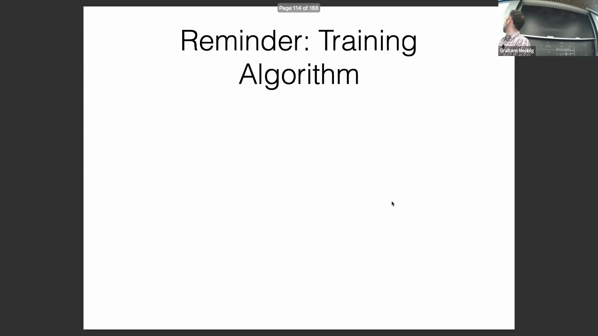
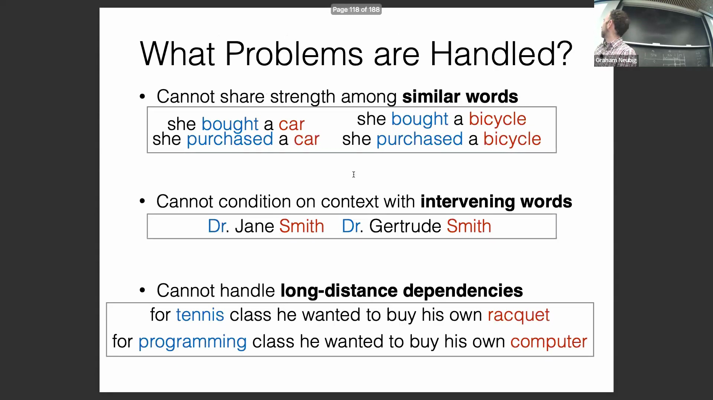
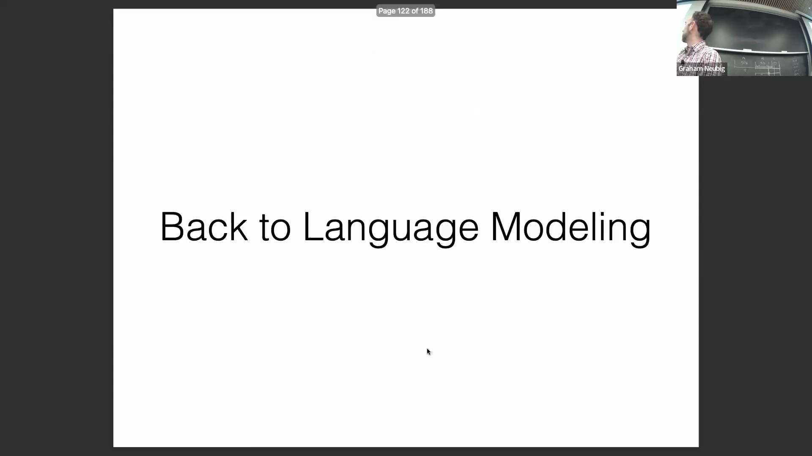

## 前馈神经网络语言模型
在转向神经方法(Neural Approach) 后，前馈语言模型(Feedforward Language Model) 使用稠密词嵌入(Dense Word Embedding) 取代了离散的特征查找。这些词嵌入被拼接(Concatenation) 后，经由中间变换层(Transformation Layer) 处理以提取高阶特征，随后进行权重矩阵乘法与偏置相加，最后通过 Softmax 层转换为概率分布。该架构的一大优势在于具备学习组合特征(Compositional Feature) 的能力（例如，识别能够提升目标词元概率的特定词对）。它实现了强大的统计强度共享：相似的输入词会被映射为相似的嵌入向量(Embedding Vector)，而相似的输出词则在 Softmax 权重矩阵中占据相近的行向量。因此，相似的隐藏状态(Hidden State) 能够自然而然地捕获类似的上下文模式(Contextual Pattern)。
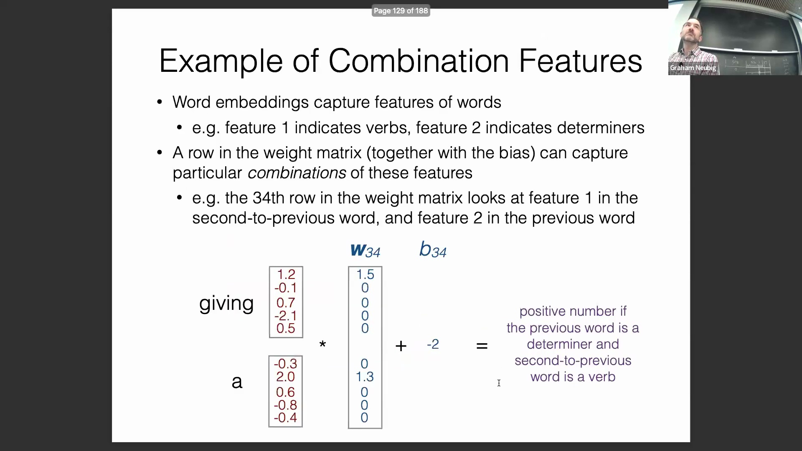
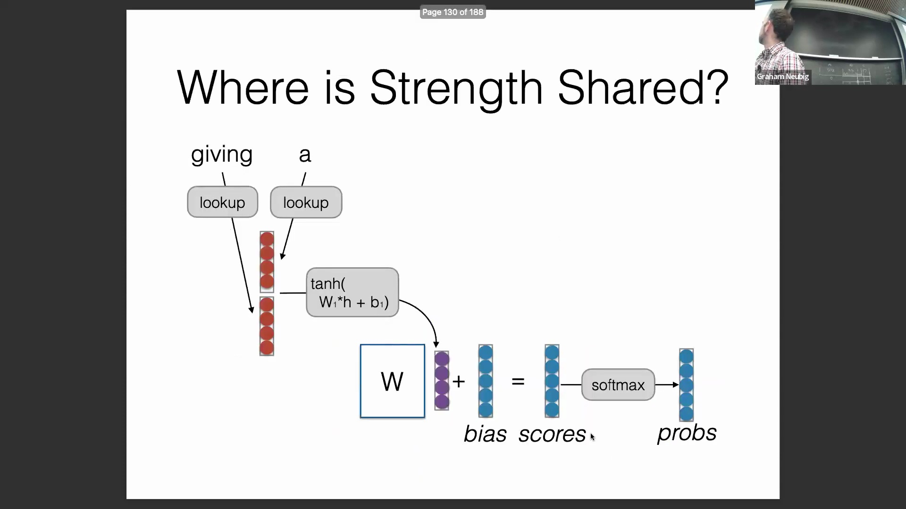

## 通过词嵌入绑定提升参数效率
神经语言模型中广泛采用的一种优化技术是“词嵌入绑定(Embedding Tying)”，即在输入词嵌入查找矩阵与输出 Softmax 投影矩阵之间共享参数。该技术带来两大关键优势：首先，它有效使词嵌入学习的训练信号(Training Signal) 翻倍，因为该矩阵在词汇作为上下文出现和作为目标词被预测时均会得到更新；其次，它显著降低了参数量(Parameter Count) 与内存开销(Memory Footprint)。考虑到词汇表(Vocabulary) 规模常超数十万，且嵌入维度(Embedding Dimension) 可达数百，仅这两个矩阵就可能包含数百万参数。对它们进行绑定不仅缓解了由低频词更新引起的稀疏性(Sparsity) 问题，还大幅提升了计算效率(Computational Efficiency)。
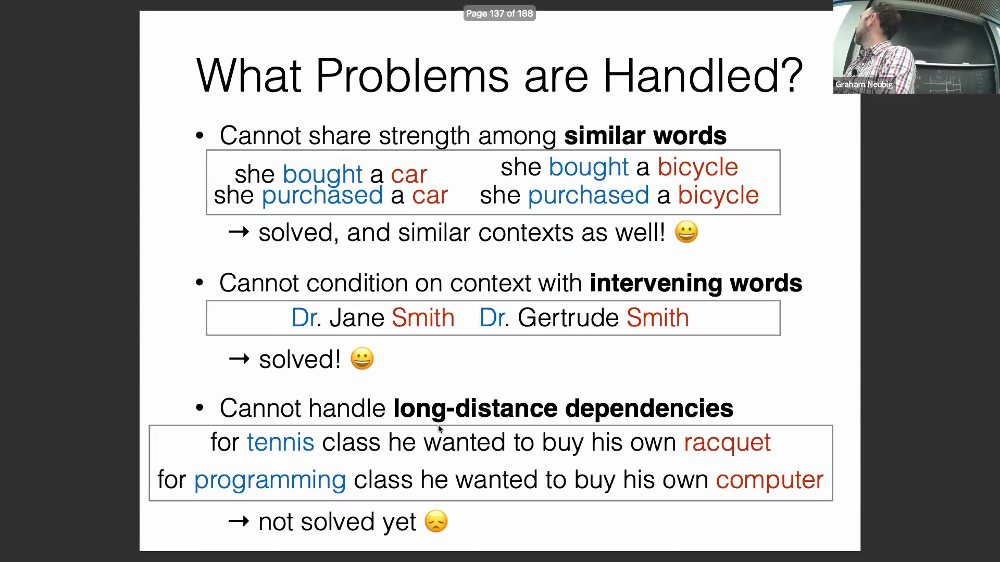

## 应对长距离依赖与未来架构探索
尽管架构有所改进，前馈神经模型仍因其固有的固定上下文窗口，在处理长距离依赖时显得捉襟见肘。若线性扩展该窗口，会导致模型规模线性膨胀，并引发严重的计算瓶颈(Computational Bottleneck)。为突破这一限制，研究重心已转向专为长序列建模(Long-sequence Modeling) 设计的架构：循环神经网络(Recurrent Neural Network, RNN)、卷积神经网络(Convolutional Neural Network, CNN) 以及基于注意力机制(Attention Mechanism) 的 Transformer。尽管 Transformer 目前主导着现代自然语言处理(Natural Language Processing, NLP) 领域，但许多前沿的长上下文(Long-context) 模型仍在积极融合循环或卷积架构的原理。深入理解这些架构之间的协同关系及其各自优势，依然至关重要。
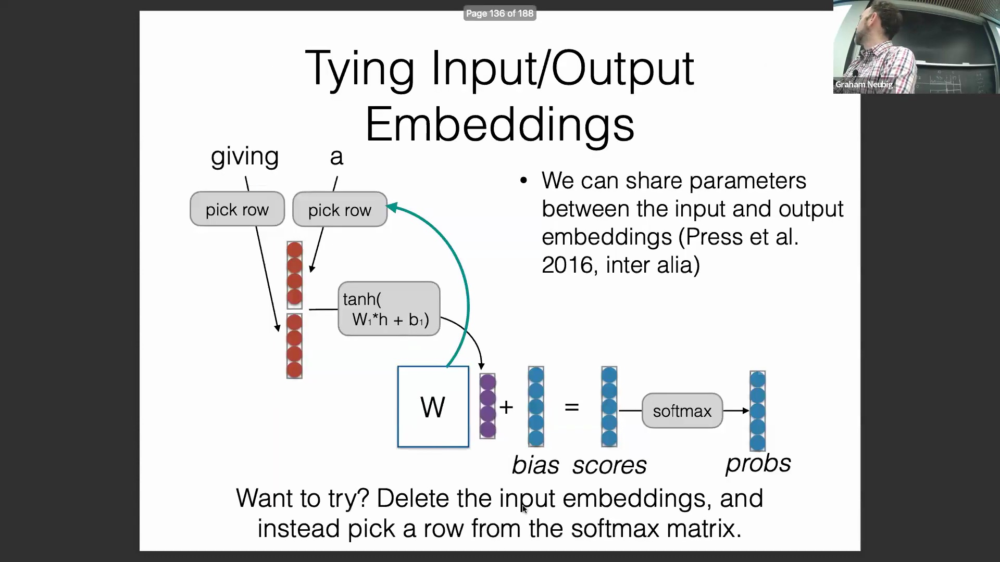

## 模型校准的关键概念
除架构设计与上下文长度外，部署可靠语言模型的一项基本要求是模型校准(Model Calibration)。校准旨在确保模型“清楚自己何时真正知道答案”，即模型输出的预测置信度(Predictive Confidence) 能够准确反映其真实的正确概率。严格来说，校准良好(Well-calibrated) 的模型对某一给定答案输出的概率，应与该答案在历次评估中实际正确的经验频率(Empirical Frequency) 精确吻合。掌握并量化模型校准指标(Calibration Metric)，对于构建透明、可信的 AI 系统不可或缺，也将是后续讨论的核心重点。
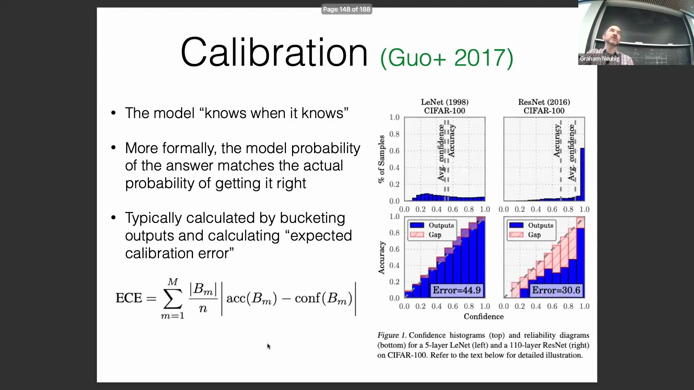

---

## 模型校准的定义
模型校准(Model Calibration)旨在确保模型预测的置信度(Confidence)能够准确反映其实际正确率。严格来说，若模型为某一答案分配了 0.7 的概率(Probability)，则在大量同类预测中，该答案的实际正确比例应约为 70%。这一原则确保模型“清楚自己何时真正知道答案”，从而在生成预测结果的同时提供可靠的置信度或不确定性(Uncertainty)评估，而非仅输出原始答案。

## 使用可靠性图衡量校准程度
由于模型输出的概率值通常具有连续性且极少完全重复，校准程度通常通过将预测结果划分为离散的概率区间(Bin)（如 0.0–0.1、0.1–0.2 等）来进行衡量。在每个区间内，计算平均预测置信度(Average Predicted Confidence)并将其与实际经验准确率(Empirical Accuracy)（即模型实际正确的频率）进行对比。这些对比结果通过可靠性图(Reliability Diagram)进行可视化，图中预测概率与实际概率之间的偏差被用作衡量校准不佳(Miscalibration)的惩罚指标。

## 准确率与校准度
高准确率(High Accuracy)与良好的校准度之间并无必然联系。若模型较低的置信度分数能够准确反映其较高的错误率(Error Rate)，那么即使其整体准确率不高，该模型依然可以具备良好的校准度。相反，高准确率模型往往容易出现极度过度自信(Overconfidence)的现象，尤其是在训练过程中采用基于准确率的早停(Early Stopping)策略时。这种过度自信在生成式人工智能(Generative AI)中尤为危险，因为它极易导致模型“自信地产生幻觉(Hallucination)”。相比之下，一个校准良好的模型即便准确率处于中等水平，也能使用户安全、可靠地甄别哪些输出结果是可信的。

## 评估答案置信度的方法
置信度的计算方法取决于具体的生成设置(Generation Setting)。对于具有唯一正确答案的封闭式任务(Closed-ended Task)，可直接使用模型输出的词元(Token)概率。对于存在多种有效表述的开放式问题(Open-ended Question)，则通常通过对所有可接受答案变体的概率进行求和来估算置信度。当无法直接获取输出概率，或概率信息被冗长的推理过程（如思维链(Chain of Thought, CoT)）所掩盖时，最稳健(Robust)的方法是进行多次采样(Multiple Sampling)，并统计目标答案出现的频率。值得注意的是，直接通过提示词(Prompt)让模型自我报告其置信度也能得出有效的估算结果；然而，基于多次采样的实证方法(Empirical Method)仍是当前的黄金标准(Gold Standard)。

## 模型效率与参数量指标
除预测性能(Predictive Performance)外，模型的实际部署还需重点评估计算效率(Computational Efficiency)。业界通常以模型的原始参数量(Parameter Count)（如 30亿、70亿 或 1万亿 参数）作为基准进行比较，但仅凭单一指标难以真实反映模型的实际可用性或对硬件资源(Hardware Resources)的需求。真正的效率取决于推理延迟(Inference Latency)、内存占用(Memory Footprint)以及底层架构的优化程度。后续讨论将涵盖用于输出风险评估的高级指标，例如最小贝叶斯风险(Minimum Bayes Risk, MBR)，并强调必须将模型规模与实际计算成本及部署可行性进行综合权衡(Trade-off)。

---

## 评估模型效率：精度、内存与延迟
在评估语言模型时，若忽略数值精度(Numerical Precision)，仅凭原始参数量(Raw Parameter Count)进行评估可能会产生误导。例如，一个采用 32 位浮点数(32-bit Float / FP32) 的 70 亿参数模型，与经过 4 位量化(4-bit Quantization) 的同一模型相比，其所需的内存(Memory)和计算资源(Computational Resources)存在巨大差异。关键的效率指标包括**内存使用量(Memory Usage)**，它既涵盖加载模型时的静态内存占用(Static Memory Footprint)，也包含在特定序列长度(Sequence Length)下进行推理(Inference)时的峰值内存消耗(Peak Memory Consumption)。**延迟(Latency)**同样至关重要，通常通过首词元生成时间(Time to First Token, TTFT，主要受预填充阶段影响)以及固定输出长度下的总生成时间(Total Generation Time)来衡量。最后，**吞吐量(Throughput)**用于评估模型每秒能够处理的序列(Sequence)或词元(Token)数量。这些因素共同决定了模型在生产环境(Production Environment)中的实际可部署性(Deployability)。

## 通过小批量处理优化吞吐量
为了最大化硬件利用率(Hardware Utilization)，使用小批量(Mini-batch)处理数据是必不可少的。现代硬件加速器(Hardware Accelerator)执行并行操作(Parallel Operation)的效率远高于顺序操作(Sequential Operation)，这一优势在使用 Python 等解释型语言(Interpreted Language)编写代码时尤为关键。与执行多次独立的向量-矩阵乘法(Vector-Matrix Multiplication)不同，批处理将输入数据拼接(Concatenation)为单一矩阵，从而触发高度优化的矩阵-矩阵乘法(Matrix-Matrix Multiplication / GEMM)操作。在对文本进行批处理时，强烈建议根据**词元数量(Token Count)**而非序列数量(Sequence Count)来定义批次大小(Batch Size)。仅按序列数量进行批处理会导致内存占用剧烈波动（例如，对比 50 条长度为 100 的序列与 50 条长度为 5 的序列），进而极易引发内存溢出(Out-of-Memory, OOM)错误，并破坏训练动态(Training Dynamics)的稳定性。采用基于词元的批处理(Token-based Batching)则能确保计算负载(Computational Load)的一致性，从而保障学习过程的稳定性。

## CPU 与 GPU 架构及开发硬件选择
选择合适的硬件在很大程度上取决于任务规模(Task Scale)与工作负载(Workload)特性。CPU 犹如摩托车：启动开销(Startup Overhead)极低，擅长快速处理小型的顺序任务(Sequential Task)。GPU 则犹如飞机：虽然需要较长的初始化与任务调度时间(Initialization & Scheduling Latency)，但一旦全速运转，便能提供巨大的并行吞吐量(Parallel Throughput)。对于小规模计算任务（例如 16x16 的矩阵乘法），CPU 往往凭借极低的调用开销胜出。然而，随着矩阵维度(Matrix Dimension)的扩大（例如 128x128 及以上），GPU 的性能将呈指数级超越 CPU，在大型神经网络(Large Neural Network)的运算中可实现百倍甚至更高的加速比(Speedup)。针对学术作业(Academic Assignments)或课程项目，搭载 Apple Silicon 芯片的现代 Mac GPU 或 Google Colab 等云平台(Cloud Platform)通常已能为中等规模模型(Mid-sized Model)提供充足的算力(Computational Power)，无需专门采购高端硬件。

## GPU 编程最佳实践与优化
高效利用 GPU 需要遵循严谨的编程实践(Programming Best Practices)。一个常见的陷阱是冗余地重复执行相同的计算操作；开发者应充分利用深度学习框架的图优化或缓存机制，将表达式计算一次并缓存(Cache)中间结果。为了最大化硬件并行度(Parallelism)，应优先使用**矩阵-矩阵乘法(Matrix-Matrix Multiplication)**，避免使用一连串低效的矩阵-向量乘法(Matrix-Vector Multiplication)。此外，应尽量减少主机到设备(Host-to-Device)的数据传输开销。尽早将张量(Tensor)移至目标设备(Target Device)，并尽可能降低跨设备传输的频次。GPU 操作在很大程度上是异步的(Asynchronous)，这意味着计算任务可在后台并行执行，而 CPU 核心可同时准备后续的逻辑步骤。为了精准识别与解决性能瓶颈(Performance Bottleneck)，开发者应使用 Python 性能分析器(Profiler)或 NVIDIA Nsight 等 GPU 剖析工具。这些工具能够提供细粒度的性能洞察(Fine-grained Insights)，从而指导开发者优化计算图(Computational Graph)、内存分配(Memory Allocation)及硬件执行流水线(Execution Pipeline)。
