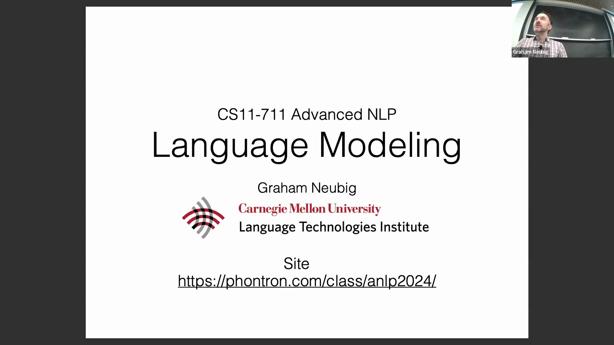
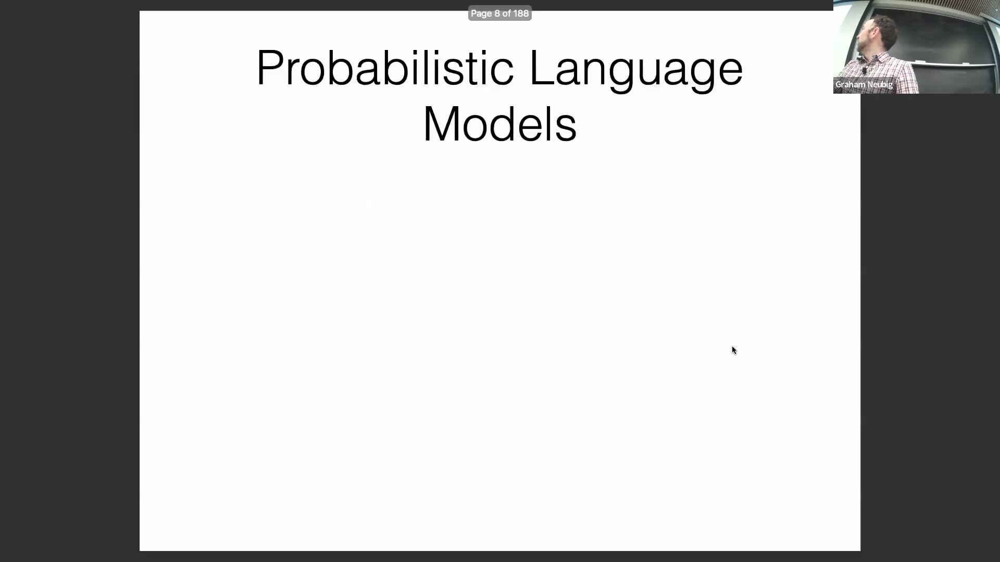
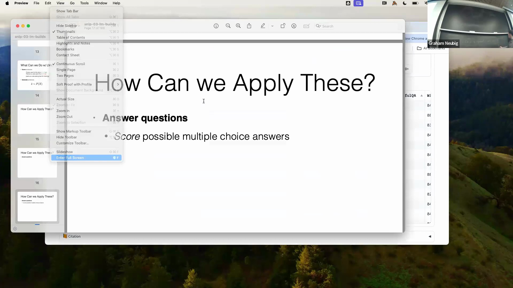
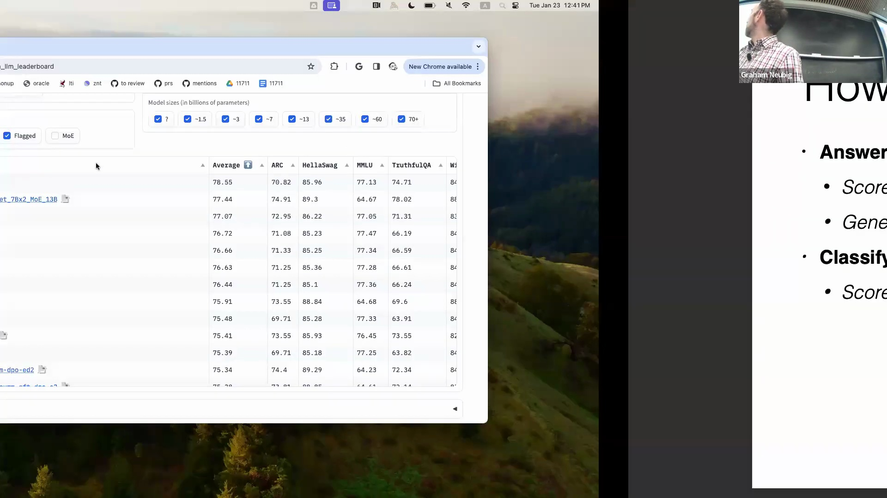
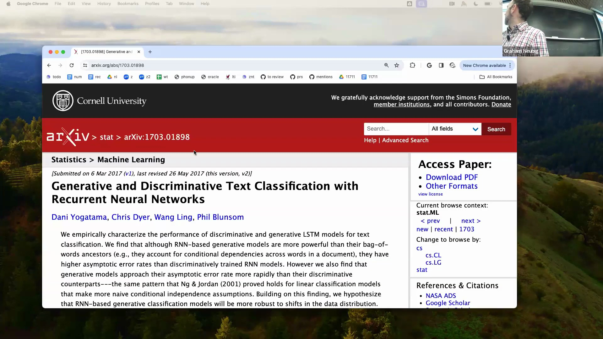
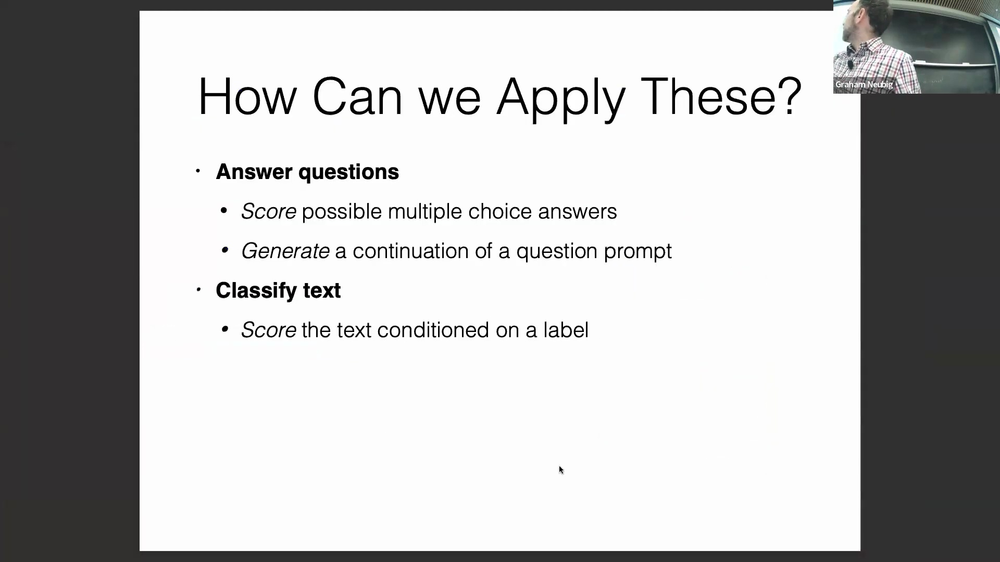

## 语言模型简介

本次课程将介绍语言模型(Language Modeling)。显然，这是一个宏大的主题，无法在一节课内面面俱到。本堂课主要聚焦于构建语言模型(Language Model)的基础概念：什么是语言模型？如何评估语言模型，以及与之相关的其他问题。在课程接近尾声时，我会简要讲解如何在神经网络中进行高效实现。这部分内容虽不直接涉及语言模型的理论本身，但对于大家完成作业至关重要，因此我也会一并涵盖。

## 生成式模型与判别式模型
好的，首先我想讨论生成式模型(Generative Model)与判别式模型(Discriminative Model)。之所以从这里讲起，是因为我们此前一直在探讨判别式模型。这类模型主要用于计算在给定输入数据条件下，某个潜在特征(Latent Trait)的概率，即计算条件概率 $P(y|x)$。其中，$y$ 是我们想要预测的目标变量，而 $x$ 是输入数据。简单回顾一下上节课的内容：上节课例子中的 $x$ 是什么？有人记得吗？没错，是文本。那 $y$ 呢？应该不难猜。对，在情感分析任务中，$y$ 正是类别或情感标签。
另一方面，生成式模型计算的是数据本身的概率，而不仅限于条件概率。它有多种表现形式。此处的分类并非完全标准的学术术语，而是我个人的归纳总结。在这里，我们首先看到的是数据 $x$ 的边缘概率(Marginal Probability) $P(x)$。

此外，我们也可以计算 $x$ 和 $y$ 的联合概率(Joint Probability) $P(x, y)$。

## 核心功能：打分与生成
概率语言模型(Probabilistic Language Model)的基本功能就是计算此类概率，通常我们将其视为数据 $x$ 的边缘概率(Marginal Probability) $P(x)$，其中 $x$ 可以是一个句子或一篇文档等。它本质上是一种对语言进行概率建模的生成式模型。近年来，“语言模型”的定义有所扩展。如今，人们也将能够计算文本与图像联合概率的模型称为多模态语言模型(Multimodal Language Model)等。我认为这是传统定义的一个重要例外（或扩展）。通常，语言模型主要计算纯文本的概率，但出于本课程的目的，我们暂时先聚焦于文本模态。
使用语言模型(Language Model, LM)主要有两项基本操作，几乎所有其他应用都可以归结为这两类之一。第一项是**句子打分(Sentence Scoring)**，即计算给定句子的概率。例如，计算句子“Jane went to the store.”的概率，理想情况下它会获得很高的分数。而对于像“词语大杂烩(Word Salad)”这样无意义的词串，英语语言模型会赋予其极低的概率。如果引入一个中文语言模型，理想情况下它同样会给这句英文打低分，因为该模型是针对自然中文语料训练的。因此，语言模型的性能也会因其训练目标和语料的不同而有所差异。
另一项核心功能是**句子生成(Sentence Generation)**。关于生成的具体方法我们稍后会详细讨论，但通常可归纳为两类。一类是**采样(Sampling)**，即从语言模型输出的概率分布中（有时会对分布进行温度等参数调整）随机采样生成句子。另一项（幻灯片上未列出）是**寻找最高得分句子**，即基于语言模型找出概率最大的目标序列。在实际应用中，这两种策略我们都会用到。

## 实际应用：问答、排行榜与文本续写
这些功能如何应用于实际场景？它们可以广泛服务于问答任务(Question Answering)。例如，面对一道多项选择题(Multiple-Choice Question)，我们可以对各个备选答案进行打分。具体做法是：将题目 $q$ 与各个选项分别拼接，计算完整序列 $x_1$、$x_2$、$x_3$、$x_4$ 等的概率，随后选择概率最高（即得分最高）的选项。

实际上，业界有一个著名的语言模型排行榜，想必许多人都有所耳闻，那就是 Open LLM Leaderboard（开源大语言模型排行榜）。

该排行榜上的许多评估任务，本质上都是基于上述打分机制。例如 HellaSwag 数据集就类似于多项选择题。你可以将其设想为一系列常识推理任务(Commonsense Reasoning)，它们均通过计算选项得分来评估。这是目前使用语言模型非常普遍的一种范式。
另一个常见应用是**基于提示的文本续写(Prompt-based Text Completion)**。这本质上是一个采样过程。你将输入文本 $X$ 提供给模型，随后要求它生成最可能的后续内容，或者通过采样生成多个补全结果以获取答案。这种交互方式非常普遍，相信大家对此已十分熟悉。

## 进阶应用：分类、语法纠正与自回归模型
除此之外，语言模型还有许多其他用途，例如文本分类(Text Classification)。实现分类有多种途径。其中一种方法是：假设你有一句情感评论“This is great.”（这很棒），你可以构造一个提示(Prompt)“Star rating:”（星级评分：）。

接着在其后补上候选词“Five”（五星）。同理，你也可以构造“Star rating: Four.”、“Star rating: Three.”、“Star rating: Two.”等序列。

以及“Star rating: One.”。随后分别计算所有这些完整序列的概率，并找出概率最高的选项。这是利用语言模型进行分类的常用方法之一。
另一种有趣但尚未被充分探索的方法是：构造类似“Star rating: High.”（高星级）的提示，并让模型**生成(Generation)**输出。其背后的逻辑是：先定义一个代表正面评价的文本概念，然后用它来评估实际评论，判断生成结果是否与预期的正面语义相匹配。已有少数论文探讨了此类方法，这是一篇较早的相关研究。

此外，还有一篇较新的相关研究。

这些研究展示了如何融合生成式(Generative)与判别式(Discriminative)方法来进行分类任务。

这是语言模型的另一种应用范式。还有一种做法是**基于给定文本直接生成分类标签**。例如，输入提示“This is great. Star rating:”，然后让模型直接生成目标词“Five”。

最后，语言模型还可用于语法纠错(Grammatical Error Correction)等任务。例如，你可以计算句子中每个词的条件概率，找出概率异常低的词汇并进行替换；或者直接向模型下达指令，要求它“改写以下短语”，模型便会将其重述为语法更通顺的版本。总而言之，正如我所强调的，语言模型的应用场景非常广泛，能够胜任多种多样的任务。但归根结底，它们的核心操作基本都归结为两类：**打分(Scoring)**或**生成(Generation)**。 
接下来，我将专门介绍一类特定的语言模型——**自回归语言模型(Autoregressive Language Model)**。这类模型通过链式法则逐步因子化(Step-by-step Factorization)序列，以此专门计算此类概率。