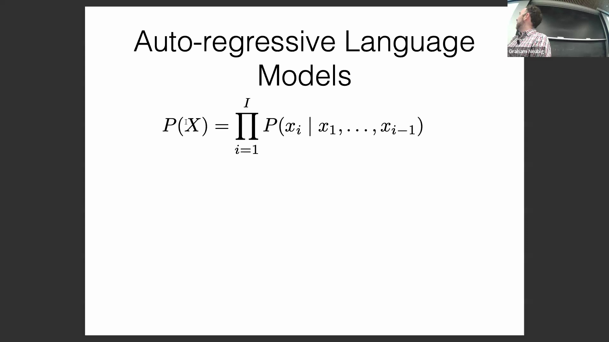
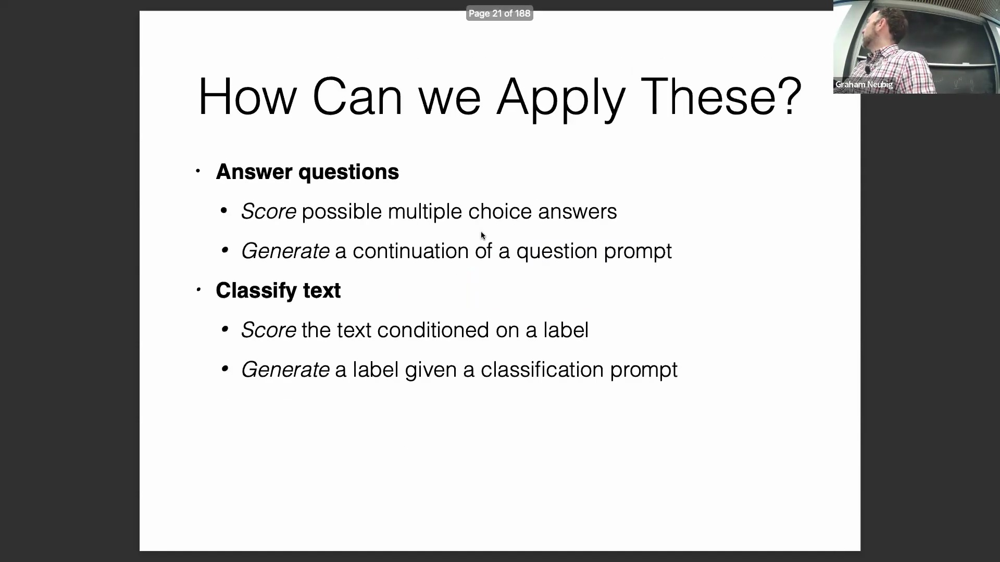
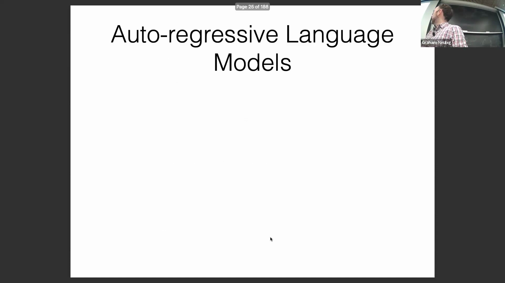
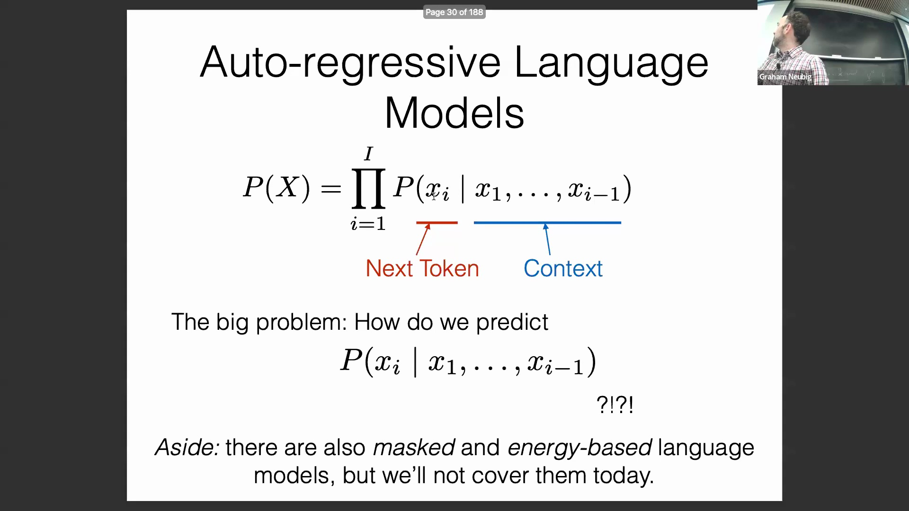
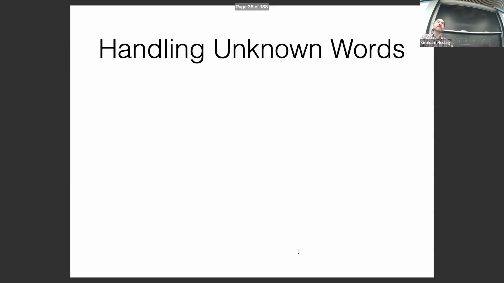
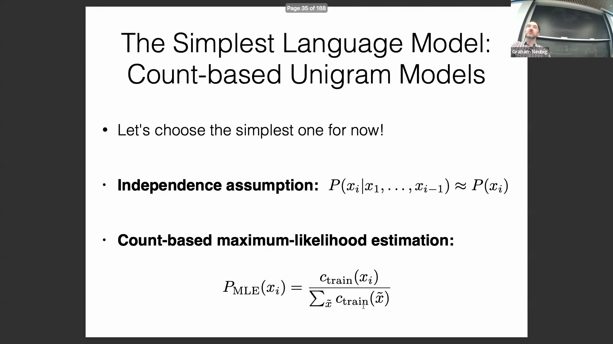
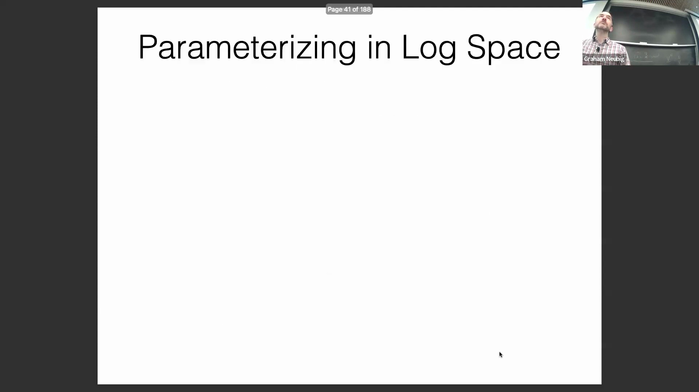

## 自回归语言模型与方向性

在此框架下，我们首先计算第一个词元(Token)的概率，随后计算在给定前一个词元条件下下一个词元的条件概率(Conditional Probability)，以及在给定前两个词元条件下第三个词元的条件概率。这种计算通常遵循从左到右(Left-to-Right)的顺序，即从序列的起始位置到结束位置依次进行。因此，“下一个词元”是基于上下文(Context)生成的，而此处的上下文通常指序列中先前已出现的词元。大家能想到在什么情况下可能需要从右到左(Right-to-Left)处理，而不是从左到右吗？没错，例如我们刚刚提到的书写方向。这正是我希望听到的答案。对于从右向左书写的语言（如阿拉伯语(Arabic)和希伯来语(Hebrew)），其文本生成在时间顺序上同样遵循“从先到后”的逻辑。试想人们的说话方式：英语使用者的第一个词写在左侧，仅是书写习惯使然；而阿拉伯语使用者的第一个词则写在右侧。这种时间顺序的处理机制正是如此。当然，可能存在其他需要从右到左处理的理由，但真正核心的并非“从左到右”这一绝对方向本身，而是在处理自然语言时，遵循“从序列起始到结束”的线性顺序(Linear Order)至关重要。

## 概率分解与计算复杂度
这里需要指出一点，这基于一条基本的概率法则：若计算多个变量的联合概率(Joint Probability)，即所有变量同时出现的概率，可将其表示为条件概率的连乘形式，即链式法则(Chain Rule)。因此，我们并未引入任何近似(Approximation)或妥协，但该方法的效果完全取决于我们能否准确预测这些条件概率。这里还有一个关键问题：大家知道我们为何要进行这种概率分解吗？为什么不直接尝试预测整个序列 $x$ 的概率呢？即使是较短的句子，为何我们不直接计算其整体概率，而非要采用这种逐步分解的方式呢？如果直接对长序列进行整体建模，确实容易导致概率空间爆炸或生成无意义的“词语大杂烩(Word Salad)”。这一点提得很好。以我们之前讨论的模型为例，上次我仅简要提及，这次展开说明。“This is great.” 这个句子很可能从未在训练数据中出现过。如果我们仅对训练集中出现过的序列分配非零概率，那么对于大量未见过的句子，模型的概率估计将直接归零（即面临严重的稀疏性(Sparsity)问题）。这正是我想强调的核心原因。我们不直接预测整个句子的根本原因在于分类问题的规模(Scale)。预测下一个词时，我们需要解决的分类问题规模仅为词表大小(Vocabulary Size) $V$；但若直接预测整个序列，分类问题的规模将膨胀至 $V^n$（$n$ 为序列长度），这是一个极其庞大的数字。词表本身已足够庞大，直接进行整体预测几乎不可行。因此，通过链式分解，我们将原问题拆解为 $n$ 个规模为 $V$ 的独立预测任务，这在计算上变得切实可行。当然，学术界也确实存在其他替代方案。

## 掩码语言模型与自回归方法
其中一种非常知名且广泛应用的模型是掩码语言模型(Masked Language Model, MLM)。如果你接触自然语言处理(Natural Language Processing, NLP)领域超过两年，很可能听说过 BERT、DeBERTa、RoBERTa 等模型。它们的核心机制是：将句子中的某个词元进行掩盖(Mask)，然后基于剩余上下文来预测该被掩盖的词元。

例如，将单词“is”遮盖，随后尝试基于句子中其他所有词元对其进行预测。这类模型主要存在两个局限。第一，它们无法提供严格归一化(Normalized)的完整序列概率。因为概率的链式法则仅在“以已生成的历史序列为条件”时才严格成立。

因此，从能够直接计算完整序列概率的角度来看，它们并非严格意义上的自回归语言模型。第二，它们难以直接用于文本生成(Text Generation)，因为生成任务需要遵循确定的自回归顺序，而掩码语言模型并未定义这种生成次序。因此，它们在计算上下文表示(Contextual Representation)（如特征向量）方面表现优异，但在生成任务上则显得不够实用。此外，还存在基于能量的语言模型(Energy-Based Language Model)，其本质是构建一个评分函数(Score Function)，并不强制遵循从左到右或从右到左的单向顺序。

这属于相对进阶的主题，若大家感兴趣我可以进一步展开，但首先我们回归主线。另外，如今广为人知的 GPT、Llama 等模型，均属于自回归语言模型。大家对于这部分还有什么疑问吗？有人问：在掩码语言模型中，能否仅掩盖最后一个词元并进行预测？理论上当然可以，但标准 MLM 并非以此方式训练，因此直接这样用效果不佳。如果你持续按照“仅掩盖并预测末尾词元”的方式训练模型，那么它实质上就退化成了自回归语言模型。这相当于又绕回了原点。

## 一元语言模型与未知词处理
接下来介绍一元语言模型(Unigram Language Model)。最基础的语言模型便是基于词频计数的一元模型。其核心假设是：放弃考虑上下文词序，即假设当前词元的出现与历史词元完全独立，从而独立地预测其概率。基于此假设，概率预测变得极为简单：只需统计目标词元在训练语料库中的出现频次，再除以语料库中的总词元数，即可得到其概率。这属于语言模型的“入门级”实现，仅需三行 Python 代码即可完成最基础的一元模型构建。

然而，该模型存在若干显著缺陷。首要问题是如何处理未登录词(Out-Of-Vocabulary, OOV)。在该模型中，若遇到训练集中从未出现过的词元会怎样？包含任何未登录词的序列，其整体概率将如何计算？

没错，整个序列的概率会直接归零。这对于纯生成任务或许影响有限（模型仅输出已见词元即可），但对于概率打分(Scoring)任务而言则是致命缺陷。在机器翻译(Machine Translation)等任务中同样如此：当遇到未登录词时，我们期望模型能进行合理推断或翻译，但一元模型无法做到。因此，这是一个必须解决的关键问题。我们该如何解决呢？主要有几种策略。第一种是采用字符级(Character-level)或子词级(Subword-level)分词(Tokenization)。这也是当前业界的首选方案。例如，使用 SentencePiece 等工具构建子词词表，通过将未知词拆解为更短的子词单元，从根本上消除未登录词问题。若大家对此有深入研究兴趣（例如作为课题研究），还存在其他替代方案。例如构建“未登录词模型(OOV Model)”。其核心思想是：采用词级模型预测已知词元的概率，同时引入字符级模型(Char-level Model)专门处理未登录词的概率估计。由此形成一个层次化模型(Hierarchical Model)：优先尝试词级预测，若失败则回退至字符级预测。尽管该方法如今已较少使用，但理解其设计思路仍具有重要的学术价值。

## 对数概率与数值稳定性

接下来讨论第二个关键细节：对数空间(Log Space)的参数化(Parameterization)。概率的连乘运算可等价转换为对数概率(Log Probability)的累加运算。这一技巧至关重要，并广泛应用于所有语言模型（涵盖一元模型与神经网络语言模型(Neural Language Model)）。采用该方法的原因非常直观：大家能想到原因吗？若将约 30 个词元的概率直接相乘会发生什么？没错，结果将趋近于极小值，极易引发浮点数下溢(Floating-Point Underflow)问题。