## 数值下溢与对数概率的使用
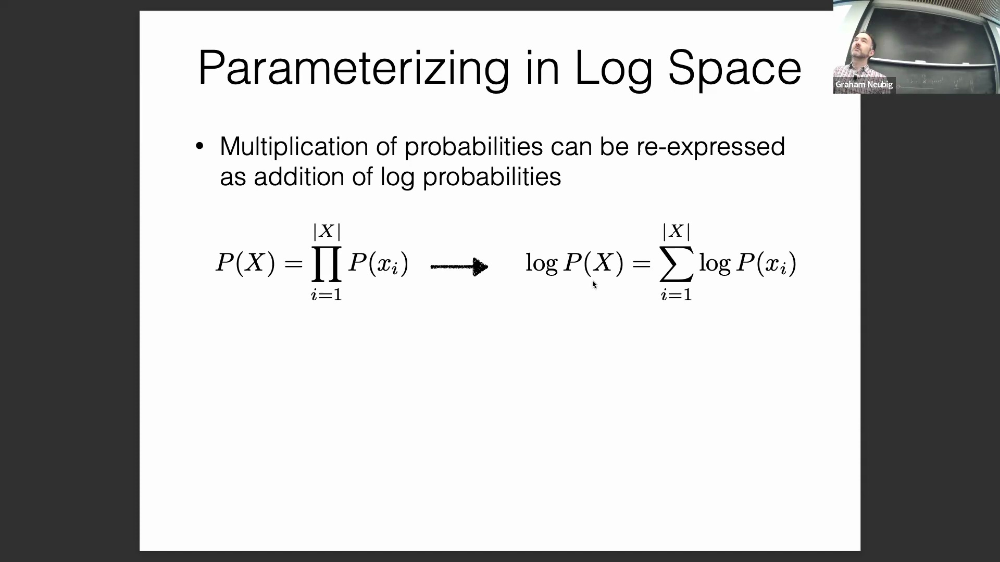
本节首先探讨在标准硬件上计算概率时面临的数值下溢（Numerical Underflow）问题。在纯数学中，极小的概率值不会引发问题，但在采用 32 位浮点数（32-bit Floating Point）的计算机系统中，有限的指数范围会导致极小的数值直接下溢为零。 
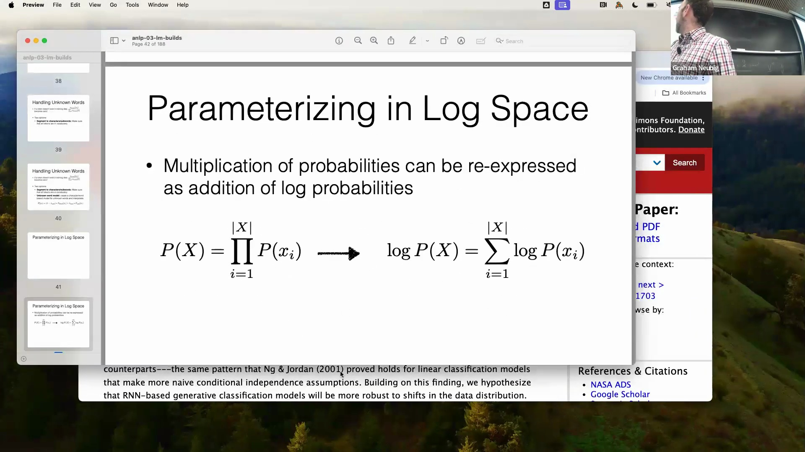
这将导致原本可能发生的事件被错误地赋予零概率（Zero Probability）。 
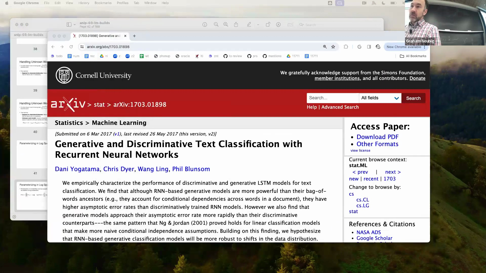
为解决这一问题，通常采用对数概率（Log Probability）进行计算。 
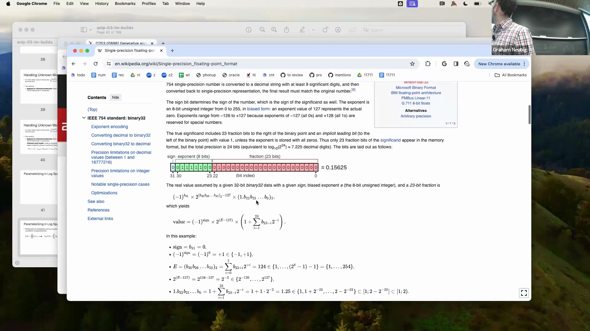
通过将类似 $10^{-30}$ 的极小值转换为如 -30 这样便于处理的数值，我们不仅有效避免了数值下溢，还保证了计算的稳定性与人类的可读性。
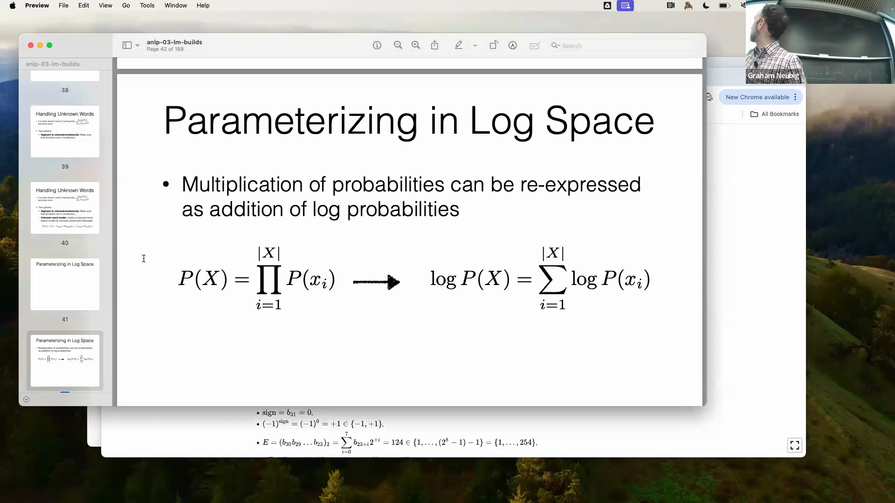

## 一元模型（Unigram）中的参数
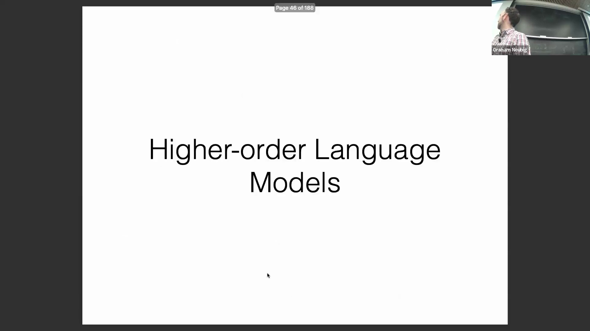
在一元语言模型（Unigram Language Model）中，每个词（Word）的概率均被视为独立的模型参数（Model Parameter）。因此，一元模型的参数总数恰好等于词汇表大小（Vocabulary Size）。该架构十分直观：通过统计词语的出现频次并除以总词元（Token）数量即可计算概率。此过程仅需一段简短的 Python 脚本便可轻松实现。

## 高阶 N-gram 模型与数据稀疏问题
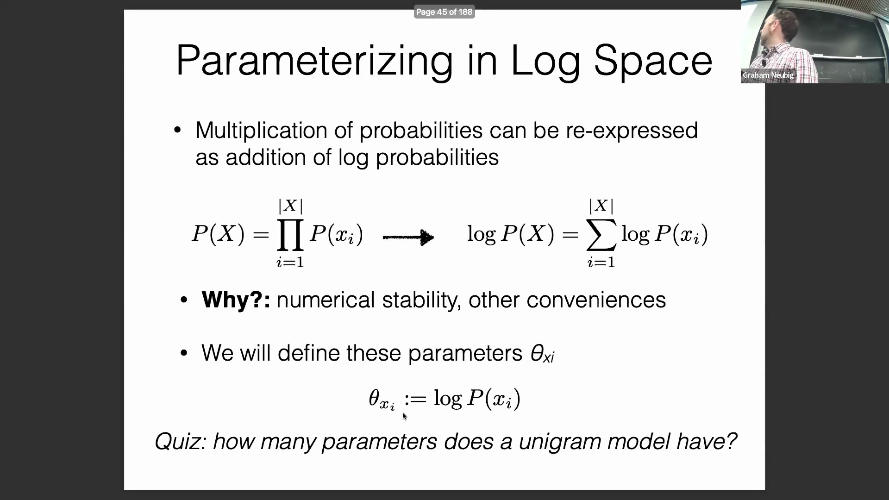
高阶 N-gram 模型（High-order N-gram Model）通过将上下文窗口（Context Window）限制为固定长度 $n$ 来扩展这一概念。其概率计算方式为：统计特定词序列的出现频次，并除以其前置上下文的频次。然而，这种方法引入了一个重大挑战：数据稀疏性（Data Sparsity）。 
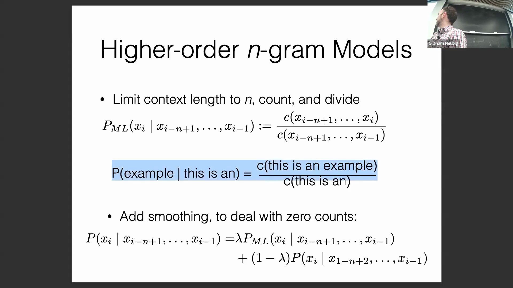
每当模型遭遇训练语料中未曾出现的序列时，其对应计数为零，进而导致该序列的整体概率被计算为零。 
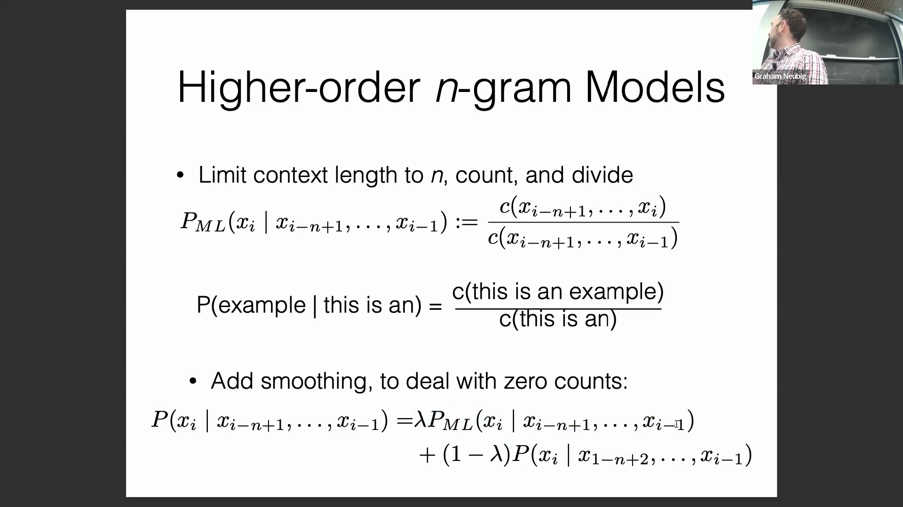
为处理未见序列（Unseen Sequences）并避免零概率问题，N-gram 模型引入了一种回退（Backoff）机制，即通过与更短、更低阶的模型进行插值（Interpolation）来予以应对。

## 跨模型阶数的插值
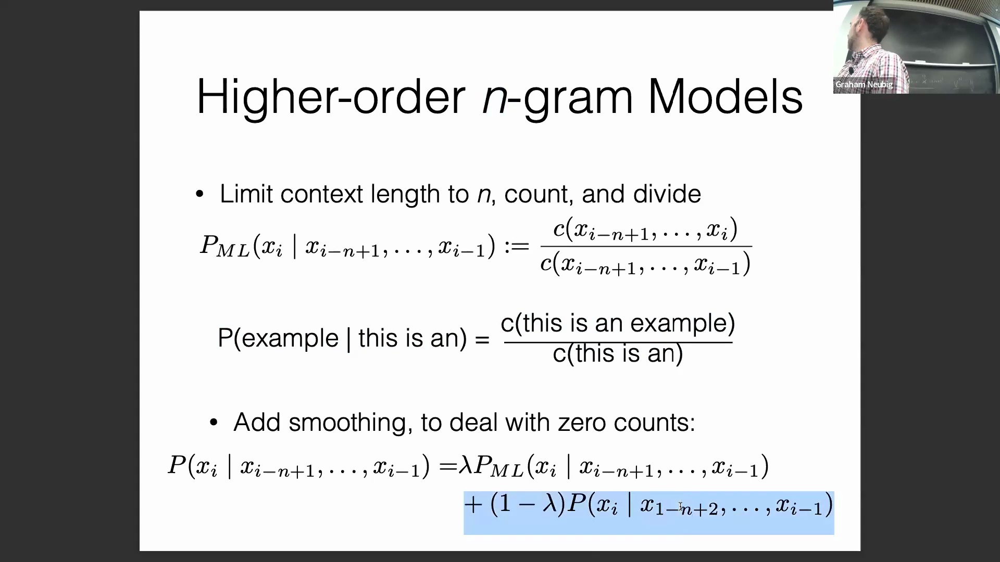
该机制通过在不同上下文长度之间对概率进行插值来运作。例如，一个 4-gram 模型会首先计算其特定概率；若数据稀疏，则会与三元模型（Trigram）进行插值，三元模型继而与二元模型（Bigram）插值，最终与一元模型（Unigram）插值。在此语境下，$n$ 严格指代上下文长度（Context Length）。这种分层插值策略（Hierarchical Interpolation）有效结合了长上下文的高精度与短上下文的强覆盖能力。

## 模型集成与实际应用
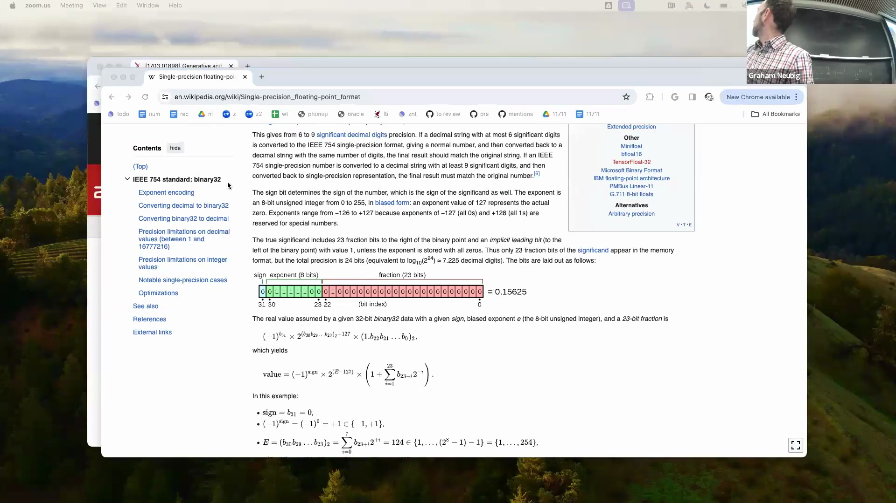
这种插值策略是模型集成（Model Ensemble）的基础范例，通过融合多个具有互补优势的模型，在精度与数据稀疏性之间取得平衡。尽管传统 N-gram 模型凭借极高的计算效率在处理海量数据集时依然表现优异，但本文探讨的插值与平滑（Smoothing）技术具备广泛的适用性。即便在采用更现代的神经网络（Neural Network）架构时，这些方法对于提升模型泛化能力（Generalization Ability）及处理词表外（Out-of-Vocabulary, OOV）场景仍具有重要价值。

## 加法平滑技术
插值系数（Interpolation Coefficient，通常记为 $\lambda$）的确定可通过分配固定权重的简单方法实现（例如，为高阶模型设定 $\lambda=0.8$，为回退模型设定 $0.2$）。然而，加法平滑（Additive Smoothing）等更复杂的方法提供了动态调整的能力。该技术通过在概率计算的分子与分母中同时加上一个平滑参数 $\alpha$ 来实现。此举可有效避免零计数（Zero Count）问题，确保模型维持非零的概率基线，从而在缺乏经验证据（Empirical Evidence）时，能够合理地依赖先验分布（Prior Distribution）。

## 基于证据的动态权重调整
加法平滑会根据可用训练证据的规模，动态调整模型对高阶分布的依赖程度。当观测计数为零或极低时，模型会赋予平滑参数 $\alpha$ 更大的权重，从而有效回退至均匀分布（Uniform Distribution）或先验分布。随着观测计数的增加，插值权重将依据公式 $\lambda = \frac{\text{计数总和}}{\text{计数总和} + \alpha}$ 进行动态偏移。 
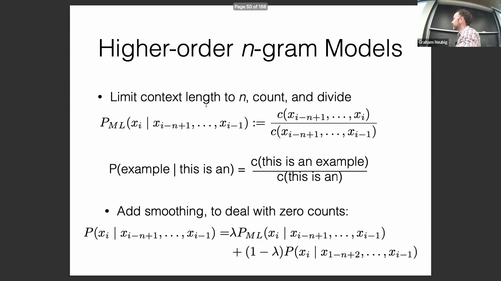
因此，随着训练证据日益充分与可靠，模型会对特定的高阶 N-gram 概率赋予更高的置信度（Confidence），逐步削弱平滑先验的影响，并最终向真实的经验分布（Empirical Distribution）收敛。