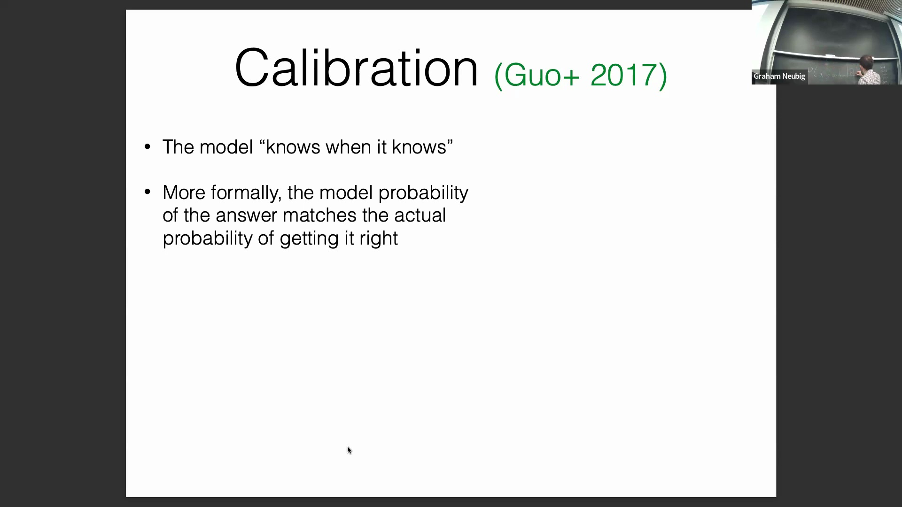
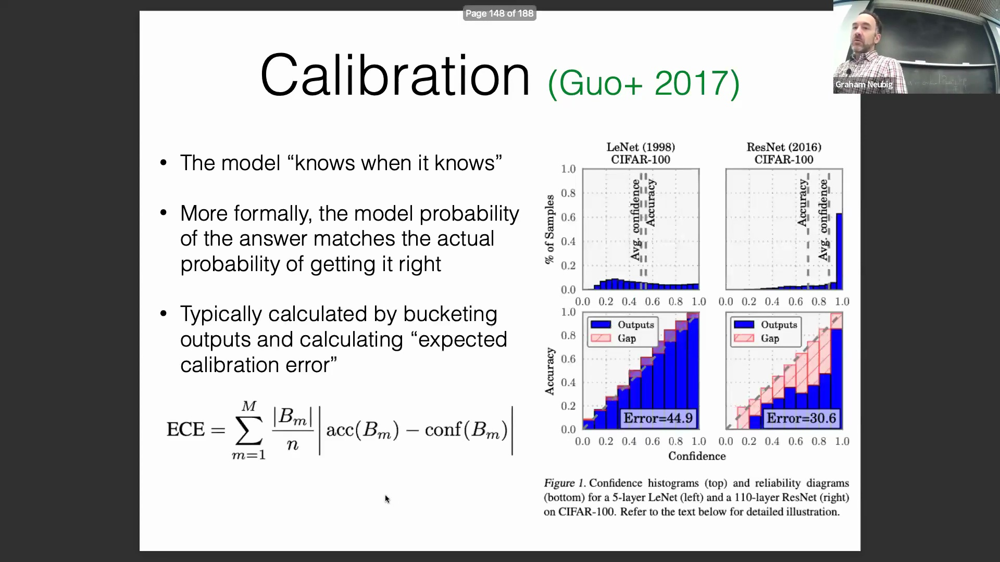
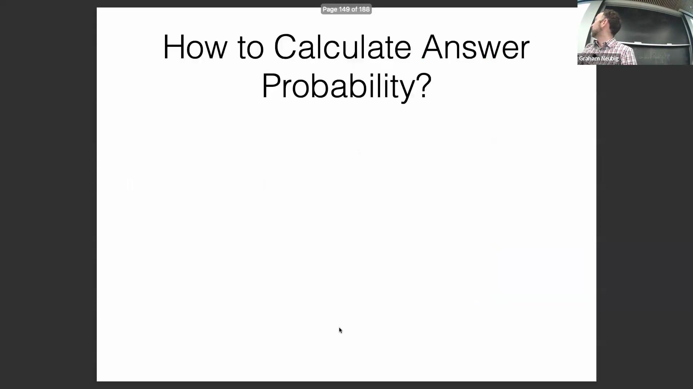

## 模型校准的定义
模型校准(Model Calibration)旨在确保模型预测的置信度(Confidence)能够准确反映其实际正确率。严格来说，若模型为某一答案分配了 0.7 的概率(Probability)，则在大量同类预测中，该答案的实际正确比例应约为 70%。这一原则确保模型“清楚自己何时真正知道答案”，从而在生成预测结果的同时提供可靠的置信度或不确定性(Uncertainty)评估，而非仅输出原始答案。

## 使用可靠性图衡量校准程度
由于模型输出的概率值通常具有连续性且极少完全重复，校准程度通常通过将预测结果划分为离散的概率区间(Bin)（如 0.0–0.1、0.1–0.2 等）来进行衡量。在每个区间内，计算平均预测置信度(Average Predicted Confidence)并将其与实际经验准确率(Empirical Accuracy)（即模型实际正确的频率）进行对比。这些对比结果通过可靠性图(Reliability Diagram)进行可视化，图中预测概率与实际概率之间的偏差被用作衡量校准不佳(Miscalibration)的惩罚指标。

## 准确率与校准度
高准确率(High Accuracy)与良好的校准度之间并无必然联系。若模型较低的置信度分数能够准确反映其较高的错误率(Error Rate)，那么即使其整体准确率不高，该模型依然可以具备良好的校准度。相反，高准确率模型往往容易出现极度过度自信(Overconfidence)的现象，尤其是在训练过程中采用基于准确率的早停(Early Stopping)策略时。这种过度自信在生成式人工智能(Generative AI)中尤为危险，因为它极易导致模型“自信地产生幻觉(Hallucination)”。相比之下，一个校准良好的模型即便准确率处于中等水平，也能使用户安全、可靠地甄别哪些输出结果是可信的。

## 评估答案置信度的方法
置信度的计算方法取决于具体的生成设置(Generation Setting)。对于具有唯一正确答案的封闭式任务(Closed-ended Task)，可直接使用模型输出的词元(Token)概率。对于存在多种有效表述的开放式问题(Open-ended Question)，则通常通过对所有可接受答案变体的概率进行求和来估算置信度。当无法直接获取输出概率，或概率信息被冗长的推理过程（如思维链(Chain of Thought, CoT)）所掩盖时，最稳健(Robust)的方法是进行多次采样(Multiple Sampling)，并统计目标答案出现的频率。值得注意的是，直接通过提示词(Prompt)让模型自我报告其置信度也能得出有效的估算结果；然而，基于多次采样的实证方法(Empirical Method)仍是当前的黄金标准(Gold Standard)。

## 模型效率与参数量指标
除预测性能(Predictive Performance)外，模型的实际部署还需重点评估计算效率(Computational Efficiency)。业界通常以模型的原始参数量(Parameter Count)（如 30亿、70亿 或 1万亿 参数）作为基准进行比较，但仅凭单一指标难以真实反映模型的实际可用性或对硬件资源(Hardware Resources)的需求。真正的效率取决于推理延迟(Inference Latency)、内存占用(Memory Footprint)以及底层架构的优化程度。后续讨论将涵盖用于输出风险评估的高级指标，例如最小贝叶斯风险(Minimum Bayes Risk, MBR)，并强调必须将模型规模与实际计算成本及部署可行性进行综合权衡(Trade-off)。
