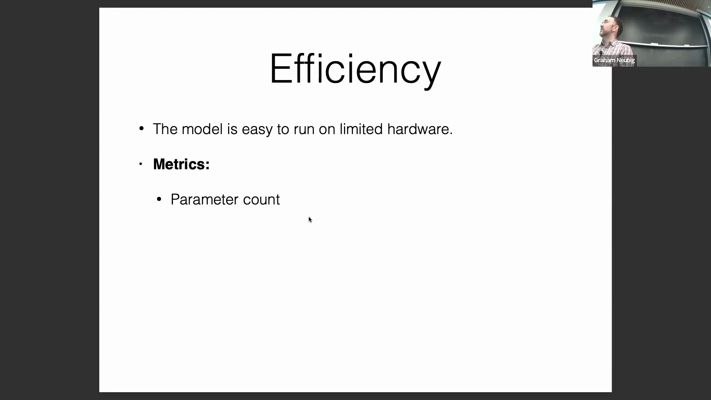
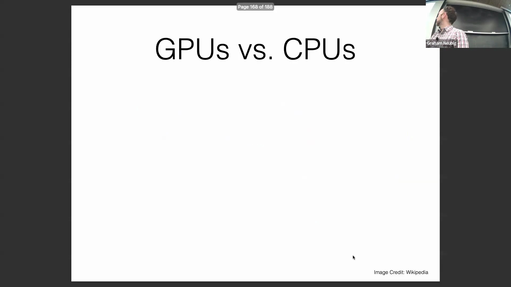
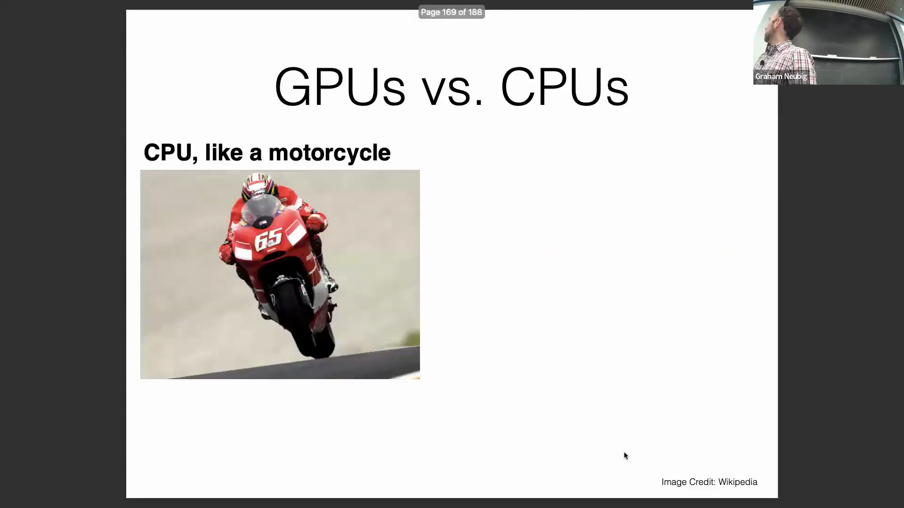
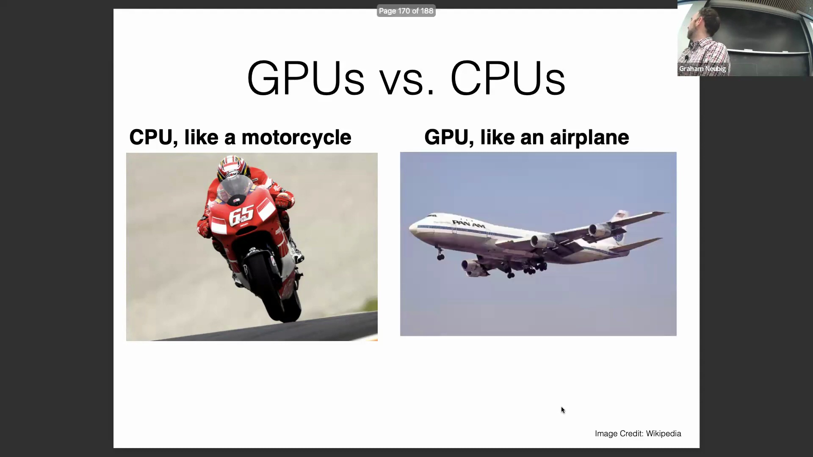
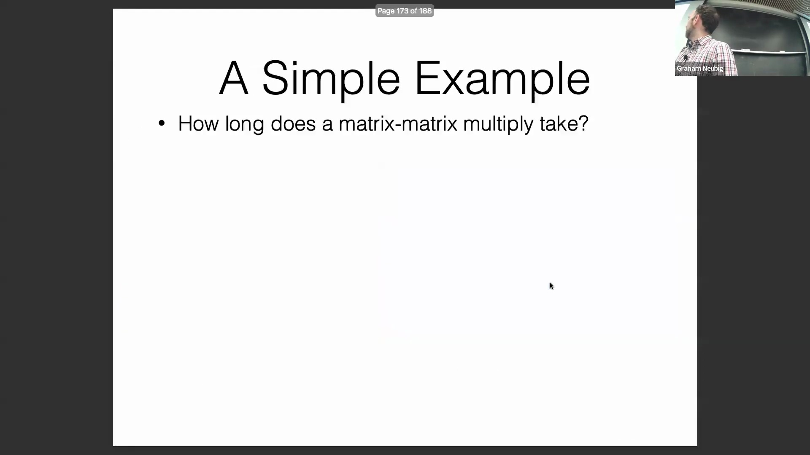
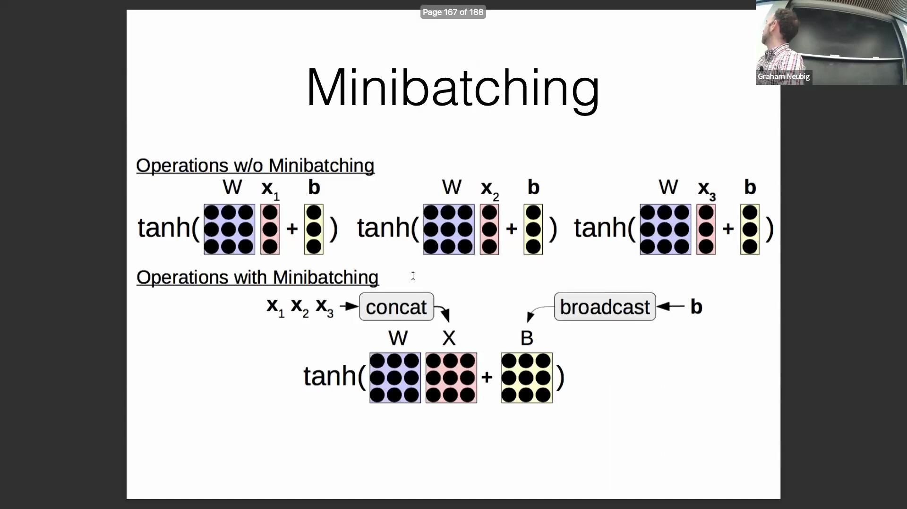
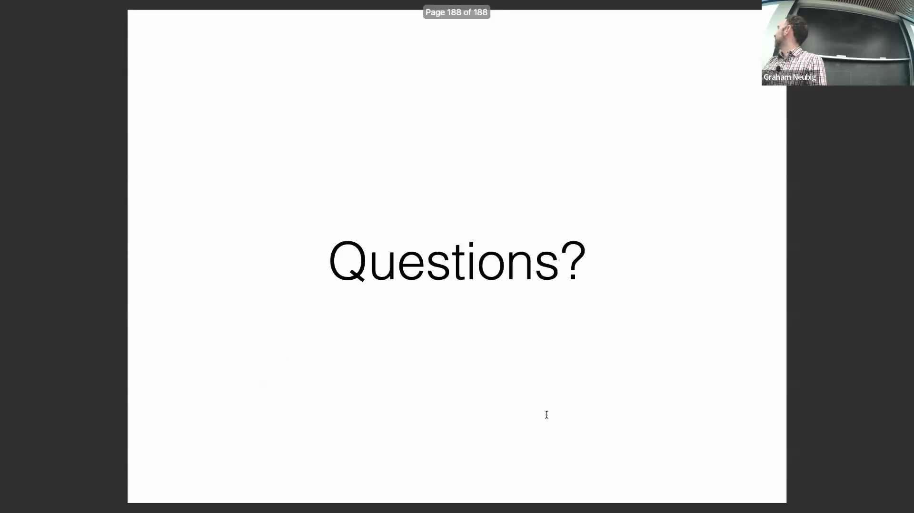

## 评估模型效率：精度、内存与延迟
在评估语言模型时，若忽略数值精度(Numerical Precision)，仅凭原始参数量(Raw Parameter Count)进行评估可能会产生误导。例如，一个采用 32 位浮点数(32-bit Float / FP32) 的 70 亿参数模型，与经过 4 位量化(4-bit Quantization) 的同一模型相比，其所需的内存(Memory)和计算资源(Computational Resources)存在巨大差异。关键的效率指标包括**内存使用量(Memory Usage)**，它既涵盖加载模型时的静态内存占用(Static Memory Footprint)，也包含在特定序列长度(Sequence Length)下进行推理(Inference)时的峰值内存消耗(Peak Memory Consumption)。**延迟(Latency)**同样至关重要，通常通过首词元生成时间(Time to First Token, TTFT，主要受预填充阶段影响)以及固定输出长度下的总生成时间(Total Generation Time)来衡量。最后，**吞吐量(Throughput)**用于评估模型每秒能够处理的序列(Sequence)或词元(Token)数量。这些因素共同决定了模型在生产环境(Production Environment)中的实际可部署性(Deployability)。

## 通过小批量处理优化吞吐量
为了最大化硬件利用率(Hardware Utilization)，使用小批量(Mini-batch)处理数据是必不可少的。现代硬件加速器(Hardware Accelerator)执行并行操作(Parallel Operation)的效率远高于顺序操作(Sequential Operation)，这一优势在使用 Python 等解释型语言(Interpreted Language)编写代码时尤为关键。与执行多次独立的向量-矩阵乘法(Vector-Matrix Multiplication)不同，批处理将输入数据拼接(Concatenation)为单一矩阵，从而触发高度优化的矩阵-矩阵乘法(Matrix-Matrix Multiplication / GEMM)操作。在对文本进行批处理时，强烈建议根据**词元数量(Token Count)**而非序列数量(Sequence Count)来定义批次大小(Batch Size)。仅按序列数量进行批处理会导致内存占用剧烈波动（例如，对比 50 条长度为 100 的序列与 50 条长度为 5 的序列），进而极易引发内存溢出(Out-of-Memory, OOM)错误，并破坏训练动态(Training Dynamics)的稳定性。采用基于词元的批处理(Token-based Batching)则能确保计算负载(Computational Load)的一致性，从而保障学习过程的稳定性。

## CPU 与 GPU 架构及开发硬件选择
选择合适的硬件在很大程度上取决于任务规模(Task Scale)与工作负载(Workload)特性。CPU 犹如摩托车：启动开销(Startup Overhead)极低，擅长快速处理小型的顺序任务(Sequential Task)。GPU 则犹如飞机：虽然需要较长的初始化与任务调度时间(Initialization & Scheduling Latency)，但一旦全速运转，便能提供巨大的并行吞吐量(Parallel Throughput)。对于小规模计算任务（例如 16x16 的矩阵乘法），CPU 往往凭借极低的调用开销胜出。然而，随着矩阵维度(Matrix Dimension)的扩大（例如 128x128 及以上），GPU 的性能将呈指数级超越 CPU，在大型神经网络(Large Neural Network)的运算中可实现百倍甚至更高的加速比(Speedup)。针对学术作业(Academic Assignments)或课程项目，搭载 Apple Silicon 芯片的现代 Mac GPU 或 Google Colab 等云平台(Cloud Platform)通常已能为中等规模模型(Mid-sized Model)提供充足的算力(Computational Power)，无需专门采购高端硬件。

## GPU 编程最佳实践与优化
高效利用 GPU 需要遵循严谨的编程实践(Programming Best Practices)。一个常见的陷阱是冗余地重复执行相同的计算操作；开发者应充分利用深度学习框架的图优化或缓存机制，将表达式计算一次并缓存(Cache)中间结果。为了最大化硬件并行度(Parallelism)，应优先使用**矩阵-矩阵乘法(Matrix-Matrix Multiplication)**，避免使用一连串低效的矩阵-向量乘法(Matrix-Vector Multiplication)。此外，应尽量减少主机到设备(Host-to-Device)的数据传输开销。尽早将张量(Tensor)移至目标设备(Target Device)，并尽可能降低跨设备传输的频次。GPU 操作在很大程度上是异步的(Asynchronous)，这意味着计算任务可在后台并行执行，而 CPU 核心可同时准备后续的逻辑步骤。为了精准识别与解决性能瓶颈(Performance Bottleneck)，开发者应使用 Python 性能分析器(Profiler)或 NVIDIA Nsight 等 GPU 剖析工具。这些工具能够提供细粒度的性能洞察(Fine-grained Insights)，从而指导开发者优化计算图(Computational Graph)、内存分配(Memory Allocation)及硬件执行流水线(Execution Pipeline)。
