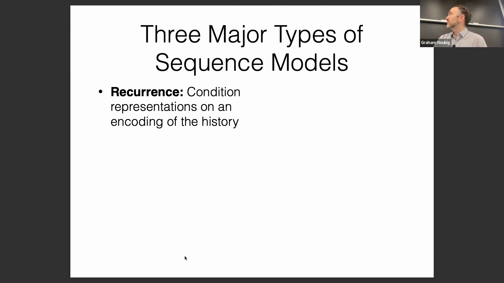
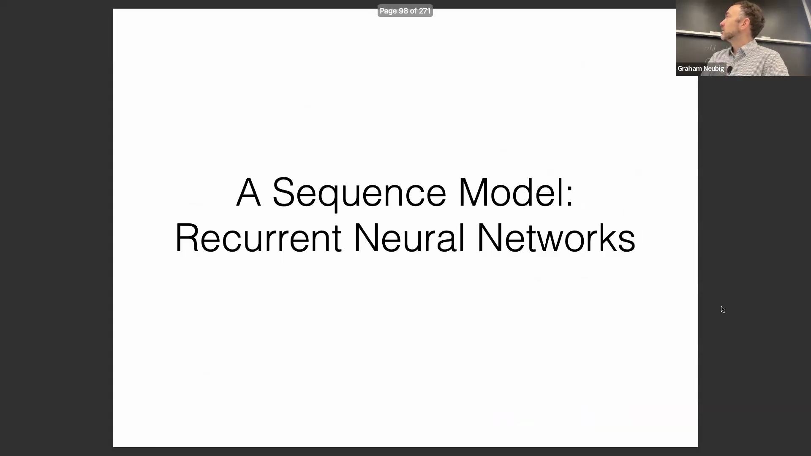
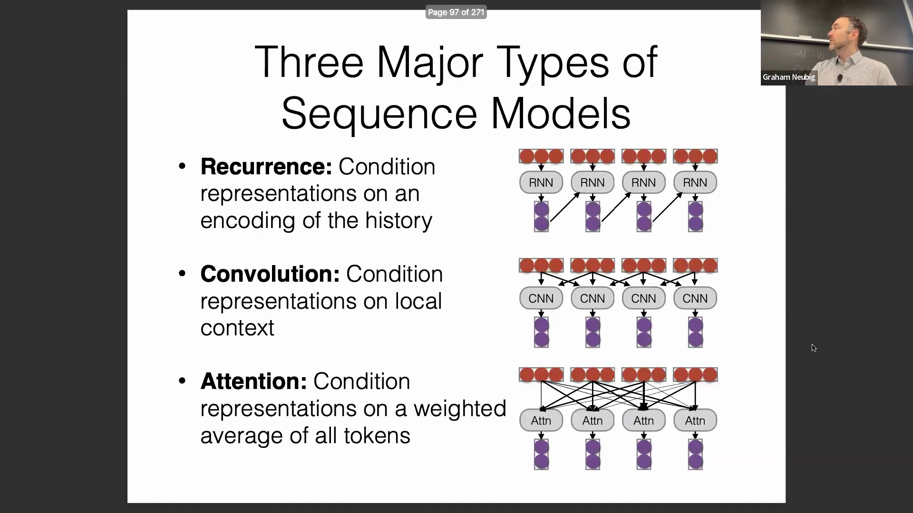
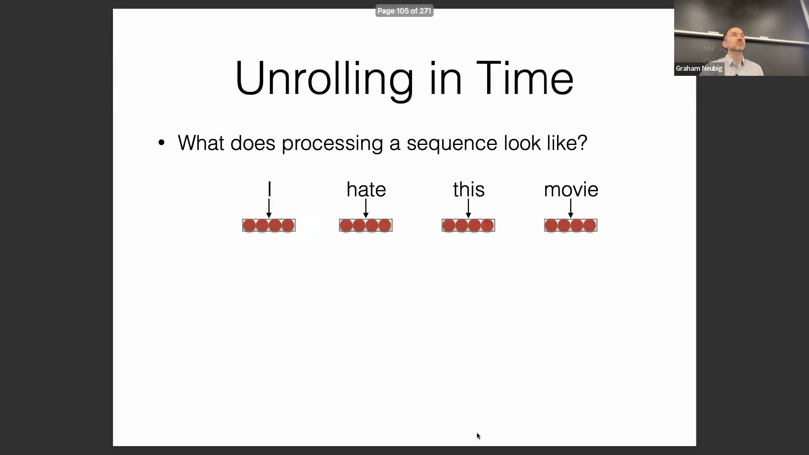
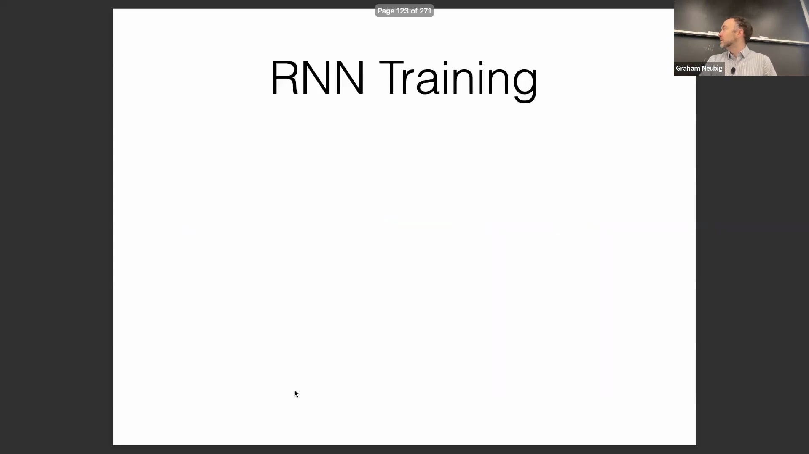
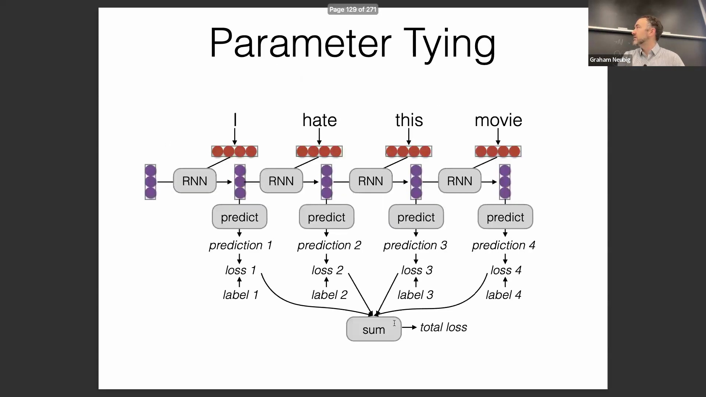
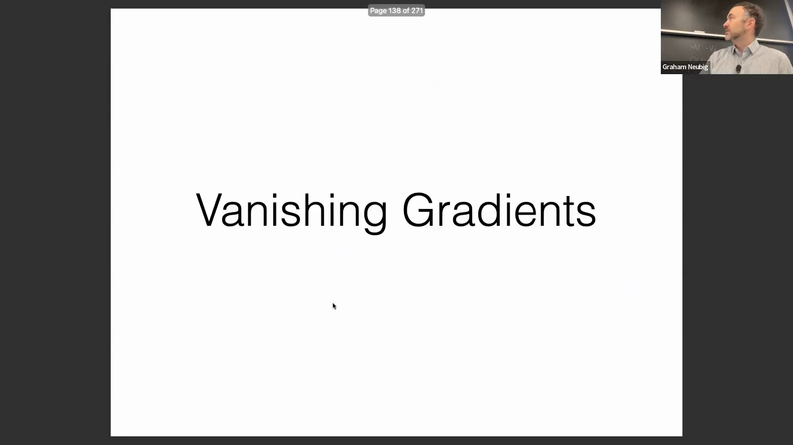
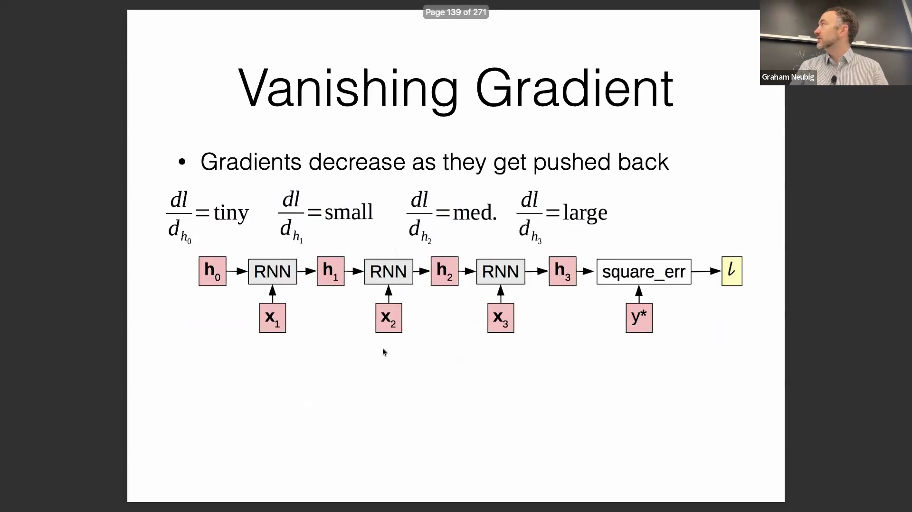

## 引言与课程安排
在深入核心内容之前，讲师概述了本堂课的重点——序列建模(Sequence Modeling)。讲座将涵盖使用序列模型的基本动机，探讨现有的各种模型类型，并介绍三种基础技术：循环神经网络(Recurrent Neural Networks, RNN)、卷积网络(Convolutional Networks)和注意力机制(Attention Mechanism)。

## 序列数据在自然语言处理(NLP)中的普遍性
序列建模是自然语言处理(Natural Language Processing, NLP)的核心，因为该领域本质上建立在序列数据之上。这涵盖了多个粒度，从字符、单词到词元(Token)、句子、段落乃至完整文档。除了单篇文本，序列还出现在时间数据流中，例如连续的社交媒体帖子或多文档语料库(Corpus)。本质上，序列结构在所有NLP任务中无处不在。

## 长距离依赖(Long-Distance Dependencies)与语法一致性
语言建模的一大挑战是捕捉长距离依赖。为了生成流畅且符合语法的文本，模型必须准确追踪相隔较远的词元在数(Number)、性(Gender)和格(Case)上的一致性。例如，反身代词“himself”必须与主语“he”保持一致，而“herself”则需与“she”保持一致。尽管性一致性在英语中相对有限，但在法语及世界上绝大多数语言中，它是一项极为普遍且关键的语法特征，因此成为建模过程中必须妥善处理的核心要求。

## 共指消解(Coreference Resolution)与威诺格拉德模式挑战(Winograd Schema Challenge)
除了句法一致性，模型还必须在更长的上下文中处理选择偏好(Selectional Preferences)、语义连贯性(Semantic Coherence)和事实知识。长上下文依赖的一个经典示例是威诺格拉德模式挑战，该挑战专门用于评估模型的共指消解能力。在句子“The trophy would not fit in the brown suitcase because it was too big”（奖杯放不进棕色手提箱，因为它太大了）中，“it”指代的是奖杯。反之，若句子改为“...because it was too small”（……因为它太小了），则“it”指代的是手提箱。成功消解这些歧义代词(Ambiguous Pronouns)要求模型在整个序列中持续保持并有效运用上下文理解能力。

## 语言能力评估基准(Benchmark)与建议项目(Project)
威诺格拉德模式专门设计用于评估语言模型是真正理解了语言内涵，还是仅仅依赖于统计捷径(Statistical Shortcuts)。通过构建词汇差异极小但正确答案完全相反的成对样本，此类基准测试有效排除了模型对表面特征的依赖。讲师还重点介绍了一个多语言比喻语言基准测试(Figurative Language Benchmark)（例如，解读“This movie had the depth of a wading pool”/“这部电影浅得像涉水池”），该基准已作为建议项目发布在课程论坛Piazza上。鼓励学生深入探索这些基准数据集，以加深对自然语言评估机制的理解。

## 结构化预测(Structured Prediction)与二分类/多分类的对比
讲座将序列预测问题划分为二分类(Binary Classification)、多分类(Multiclass Classification)与结构化预测。与标签集有限的标准分类任务不同，结构化预测需面对指数级增长的输出空间。例如，为句子进行词性标注(Part-of-Speech Tagging)时，模型需评估序列中所有词汇可能产生的标签组合。在机器翻译(Machine Translation)等任务中，这种组合复杂性将进一步加剧，因为输出序列的长度是无界的，且不受限于固定的候选词集合。

## 庞大输出空间的管理与条件概率(Conditional Probability)
为了应对庞大的输出空间，模型通常采用基于规则约束或概率分布的剪枝(Pruning)策略。硬性语言约束可预先排除不合语法的序列（例如，连续出现两个限定词），而实际的生成算法则会通过剪除低概率路径来控制计算负载。结构化预测与语言建模通常不会一次性生成完整序列，而是采用自回归(Autoregressive)范式逐步求解：每次仅预测一个元素，并基于当前上下文计算下一个词元(Token)的条件概率。

## 自回归(Autoregressive)建模与从左到右的序列生成
本部分区分了无条件预测与条件预测。作为现代语言建模基础的从左到右自回归模型，理论上能够关注全部历史上下文，且不受长度限制。然而，受限于数据稀疏性(Data Sparsity)问题，传统的 n-gram 模型(n-gram Model)通常设定固定的上下文窗口（例如三元模型 Trigram）。在可视化依赖结构时，特定词语的预测仅以其直接前驱词为条件，而非完整的历史序列，从而在语言建模的准确性与计算效率之间取得平衡。

---

## 预测架构与上下文约束
讲座首先对比了三元模型(Trigram)等固定上下文架构与支持无限上下文窗口的架构。文中介绍了独立预测（即一元模型(Unigram)）与双向预测，并指出尽管双向模型或掩码语言模型(Masked Language Model, MLM)在学习特征表示方面极为高效，但它们无法为序列生成构建定义明确的联合概率(Joint Probability)。为确保生成过程在数学上严谨，每个词元(Token)的预测必须严格基于已生成的历史上下文，而不能依赖未来的词元。

## 条件自回归生成
条件预测(Conditional Prediction)引入了源输入 `X` 以指导输出序列 `Y` 的生成。条件自回归模型(Conditional Autoregressive Model)构成了ChatGPT等现代对话式人工智能(AI)的核心基础，其中用户的提示词(Prompt)为后续词元的生成设定了上下文。若缺乏条件提示，此类模型仅会从其基础分布(Base Distribution)中采样，往往生成随机或无意义的内容，这充分凸显了初始上下文在引导自回归解码(Autoregressive Decoding)过程中的关键作用。

## 非自回归预测与特征提取范式
除自回归解码外，非自回归条件预测(Non-Autoregressive Conditional Prediction)支持词元的并行生成，广泛应用于序列标注(Sequence Labeling)及部分机器翻译(Machine Translation)架构中。其底层机器学习范式保持一致：从输入 `x` 中提取特征 `h`，进而预测标签 `y`。然而，特征映射(Feature Mapping)的方式因任务而异。文本分类(Text Classification)通常将整个序列压缩为单一表示向量(Representation Vector)，而序列标注则为每个词元生成独立的特征向量，以支持细粒度(Fine-Grained)且针对特定位置的预测。

## 词元级标注：词性、词形还原与形态学
序列标注涵盖了多项基础NLP任务。词性标注(Part-of-Speech Tagging)为每个词元分配语法类别；词形还原(Lemmatization)则预测单词的词典原形(Lemma)，相较于仅依赖后缀剥离规则的粗糙词干提取器(Stemmer)，能提供更精准的语言规范化处理。形态学标注(Morphological Tagging)在此基础上进一步扩展，用于预测时态、数、格等细粒度特征。尽管英语或中文等形态学(Morphology)相对简单的语言所需的标注较为直接，但该任务对于日语、印地语或阿拉伯语等高度屈折变化(Inflection)的语言而言至关重要。

## 跨度标注与实际实体应用
跨度标注(Span Labeling)旨在识别连续的文本片段并为其分配类别标签。其主要应用包括命名实体识别(Named Entity Recognition, NER)、句法分块(Syntactic Chunking，用于识别名词/动词短语)以及语义角色标注(Semantic Role Labeling，用于提取“施事-动作-受事”等语义关系)。一个极具实用价值的延伸应用是实体链接(Entity Linking)，它将识别出的实体映射至Wikidata等结构化知识库(Structured Knowledge Base)。尽管实体链接在算法实现上相对直接，但它在新闻聚合、品牌监控和社交媒体分析等工业级应用中不可或缺。

## 用于跨度预测的 BIO 标注体系
为在标准序列预测框架中实现跨度标注，研究人员通常将跨度边界转换为逐词元的标记格式，即BIO标注体系(BIO Tagging Scheme)。每个词元被标记为`B-`（Begin，跨度起始）、`I-`（Inside，跨度内部）或`O`（Outside，外部/不属于任何跨度）。例如，一个由多词构成的人名将标记为`B-PER, I-PER`。这种线性标签序列可通过确定性规则(Deterministic Rules)无损地还原为结构化跨度，从而无缝衔接序列建模与跨度提取任务。

## 过渡至循环序列模型
在介绍完基础的序列标注任务与标注体系后，讲座将转向支撑现代NLP的核心建模架构。尽管序列模型种类繁多，但绝大多数研究与应用主要依赖于三大范式。其一是循环机制(Recurrence)，该机制通过对完整历史上下文进行压缩编码表示(Compressed Representation)来实现条件预测，为处理序列数据中的长距离依赖(Long-Distance Dependencies)奠定了坚实基础。

---

## 架构范式：循环、卷积与注意力
序列建模的基础建立在三种主要的条件预测(Conditional Prediction)策略之上。循环(Recurrence)机制通过逐步传递整个序列的累积历史信息来进行预测。卷积(Convolution)机制则基于围绕当前词元(Token)的固定局部上下文窗口进行预测。相比之下，注意力机制(Attention Mechanism)通过计算序列中所有词元的加权平均值，并依据学习到的相关性动态调整各词元对当前预测的影响权重。

## 计算复杂度与并行化的权衡
这些架构的计算成本随序列长度 $n$ 的变化呈现出不同的增长规律。循环神经网络(Recurrent Neural Network, RNN)表现出线性复杂度(Linear Complexity) $O(n)$，使其在理论上处理超长序列时极具效率。卷积的复杂度随窗口大小 $w$ 线性增长，为 $O(n \cdot w)$。由于注意力机制涉及所有词元之间的两两交互(Pairwise Interaction)，其复杂度呈二次方增长(Quadratic Complexity) $O(n^2)$。然而，渐近复杂度(Asymptotic Complexity)并不能完全反映实际性能：RNN 必须按顺序处理词元，无法实现并行计算(Parallelization)。相比之下，卷积和注意力机制具有高度的可并行性，尽管其理论复杂度较高，但在实际训练中往往能实现更快的速度。

## 循环神经网络工作机制
尽管基于注意力的模型占据主导地位，但这三种机制仍被广泛使用，且经常以混合架构(Hybrid Architecture)的形式结合。循环神经网络(RNN)于 1990 年左右提出，专为捕捉并维持序列记忆(Sequence Memory)而设计。与孤立处理输入的标准前馈网络(Feedforward Network)不同，Elman 式 RNN(Elman RNN)会将前一时刻的隐藏状态(Hidden State)纳入当前计算中。具体实现方式为：对前一隐藏状态进行线性变换(Linear Transformation)后，将其与当前输入的变换结果相加，最终通过 tanh 或 ReLU 等非线性激活函数(Non-linear Activation Function)进行处理。

## 跨时间步的参数共享
在序列处理过程中，RNN 从初始隐藏状态（通常初始化为零向量或通过学习获得）开始，并在每个时间步(Time Step)迭代应用完全相同的转换函数。RNN 的一个核心特征是参数共享(Parameter Sharing)：无论序列长度或词元处于何种位置，控制循环更新的权重矩阵始终保持一致。这种架构设计确保了模型拥有固定且有限的参数量，从而避免了因输入序列无限增长而导致的参数爆炸(Parameter Explosion)问题。

## 序列训练的损失聚合
在序列标注(Sequence Labeling)等任务上训练 RNN 时，需处理序列上的多个预测节点。在每个时间步，模型会生成一个概率分布(Probability Distribution)并计算独立损失（例如，基于真实标签的负对数似然损失(Negative Log-Likelihood Loss)）。为适配基于梯度的标准优化算法，这些逐时间步的损失会被累加为一个标量损失值(Scalar Loss)。这种聚合操作将顺序计算转化为具有统一终端节点的有效有向无环图(Directed Acyclic Graph, DAG)，从而使其能够无缝兼容标准的反向传播(Backpropagation)算法。

## 随时间反向传播（BPTT）
计算出总损失后，梯度将沿展开的计算图(Unrolled Computational Graph)反向流动。由于 RNN 的权重在所有时间步上共享，每个参数的梯度会从前向传播中应用该权重的所有位置进行累加。这一被称为沿时间反向传播(Backpropagation Through Time, BPTT)的过程，确保了共享参数的更新能够综合考量其对整个序列级损失(Sequence-level Loss)的累积贡献，而非仅依赖孤立时间步的误差。

## 双向 RNN 与计算扩展
对于需要完整上下文感知(Context Awareness)的任务（如序列标注），通常采用双向循环神经网络(Bidirectional RNN, BiRNN)。该架构并行运行两个独立的 RNN：一个沿正向处理序列，另一个沿反向处理序列。在每一步中，两个方向的隐藏状态会被拼接(Concatenation)，从而生成同时融合过去与未来词元信息的上下文表示。尽管该方法会使计算量与内存占用翻倍，但并未改变其渐近线性复杂度(Asymptotic Linear Complexity) $O(n)$，因为在大O符号(Big O Notation)中，常数因子会被忽略。

## 梯度消失挑战
标准 RNN 极易受到梯度消失(Gradient Vanishing)问题的影响，这一关键局限性深刻塑造了后续网络架构的设计。当梯度在连续多个时间步中反向传播时，会反复与小于 1 的权重相乘，导致其呈指数级衰减并趋近于零。这使得网络难以根据早期输入有效更新权重，严重阻碍了长距离依赖(Long-Distance Dependencies)的学习。深入理解这一现象，是掌握现代序列模型为何引入门控机制(Gating Mechanism)或转向注意力架构的关键前提。

---

## 梯度消失与梯度爆炸问题
标准循环神经网络(Recurrent Neural Network, RNN)在处理长序列时面临严重的训练困难，主要源于梯度消失(Gradient Vanishing)或梯度爆炸(Gradient Exploding)问题。在反向传播(Backpropagation)过程中，梯度需连续穿过非线性激活函数(Non-linear Activation Function)（如 tanh，其导数最大值为 1，在其他区域迅速趋近于 0）并反复相乘，导致梯度要么呈指数级衰减，要么失控地暴增。只要变换过程中的有效梯度幅值(Gradient Magnitude)持续小于 1 或大于 1，就会引发该问题，进而导致跨时间步(Time Step)的参数更新(Parameter Update)极不稳定。

## 梯度流动的架构设计原则
深入理解梯度动态特性(Gradient Dynamics)为神经网络架构设计(Neural Network Architecture Design)提供了关键指导。为了最大化模型性能，关键信息应通过直接且无阻碍的路径传递至预测节点，以确保产生强烈的梯度信号(Gradient Signal)。相反，噪声或潜在无关的数据则更适合经由更复杂、间接的路径进行处理，这迫使网络付出更多计算“努力”以提取有效特征，从而降低模型对干扰的敏感性。

## 长短期记忆网络（LSTM）
长短期记忆网络(Long Short-Term Memory, LSTM)通过在时间步之间建立加法连接来解决梯度衰减问题。由于恒等函数(Identity Function)（$f(x)=x$）的导数恒为 1，加法路径能够确保梯度稳定传播，既不被放大也不被衰减。LSTM 通过一个持久化的记忆单元(Memory Cell)实现该机制，该单元受三个可学习门控(Gating Mechanism)调节：控制历史状态保留的遗忘门(Forget Gate)、管理新信息输入的输入门(Input Gate)，以及决定对外输出的输出门(Output Gate)。这种基于加法的门控架构(Gated Architecture)（门控循环单元(Gated Recurrent Unit, GRU)亦采用）至今仍是现代序列建模的基石。

## 跨越网络深度的残差连接
梯度加法保留的原则不仅适用于时序数据，同样延伸至深度前馈网络(Deep Feedforward Network)架构中。残差连接(Residual Connection)（或称跳跃连接(Skip Connection)）将网络模块的输入直接叠加至其输出，构建出一条“高速通道”，使信息与梯度能够绕过复杂的非线性变换(Non-linear Transformation)。若说 LSTM 是在*时间维度*上稳定了梯度，那么残差连接则是在*网络深度维度*上实现了梯度的稳定传播。如今，该技术已成为 BERT 和 GPT 等主流 Transformer 架构的标准配置。

## 卷积模型与领域特定效用
尽管类 RNN 架构在长序列文本建模中表现优异，但卷积网络(Convolutional Network)在语音与图像处理领域仍占据主导地位。这种领域特异性(Domain Specificity)源于数据粒度的差异：语言学词元(Token)（如词或子词(Subword)）本身携带固有语义，而单个音频帧(Audio Frame)或图像像素(Image Pixel)通常缺乏独立语义。卷积操作能够高效地将这些底层单元聚合为高阶特征表示(High-level Feature Representation)，因此在处理原始感知数据(Raw Perceptual Data)或字符级文本(Character-level Text)时极具优势。

## 卷积工作机制与自回归约束
卷积层(Convolutional Layer)的工作机制类似于在局部上下文窗口(Local Context Window)上滑动的前馈网络。该层通常将相邻词元的嵌入向量(Embedding Vector)（例如 $x_{t-1}, x_t, x_{t+1}$）进行拼接(Concatenation)，并施加共享的线性变换(Linear Transformation)。尽管双向窗口(Bidirectional Window)非常适用于序列标注(Sequence Labeling)任务，但语言建模(Language Modeling)要求严格遵守因果约束(Causal Constraint)。在自回归设定(Autoregressive Setting)下，卷积操作必须引入掩码(Masking)或采用因果结构(Causal Structure)以屏蔽未来词元，从而确保预测仅依赖于当前及历史信息。

---

## 卷积语言模型的局限性与解决方案

但它在语言建模(Language Modeling)等任务中表现不佳，因为在此类任务中，模型无法“看到”未来的内容。然而，存在一个非常直观的解决方案：使用仅关注历史信息的卷积操作(Convolution)，基于当前与过去的上下文来预测下一个词元(Token)。例如，在此设定下预测如“movie”这样的词，本质上等价于前文讨论的前馈语言模型(Feedforward Language Model)。因此，你可以将其视为卷积语言模型(Convolutional Language Model)。每当提及前馈或卷积语言模型时，它们在根本架构上是相同的，仅在步长(Striding)等少数实现细节上有所差异。 

好的，我已简要介绍了卷积，因为它也是当今三种主流序列建模(Sequence Modeling)技术中应用最少的一种。关于这部分大家有什么问题吗？还是我可以直接进入注意力机制(Attention Mechanism)的讲解？看来没问题，接下来我将详细阐述注意力机制。

## 交叉注意力的基础
注意力机制的基本思想是将序列中的每个词元(Token)编码为一个向量。对于一个待编码的输入序列，模型会根据注意力权重(Attention Weights)对这些向量进行加权线性组合。注意力机制主要分为两种类型。第一种是交叉注意力(Cross-Attention)，即一个序列中的每个元素关注另一个序列中的元素。它被广泛应用于编码器-解码器架构(Encoder-Decoder Architecture)中，该架构包含独立的编码器(Encoder)与解码器(Decoder)。目前仍采用此架构的主流模型包括 T5 和 mBART。 

在实际应用中（例如英译日），模型会动态调整其关注焦点。在生成首个词元时，模型会显著提升对应源词元(Source Token)的权重。随着生成的推进，注意力会发生转移，转而关注与新生成词元相关的其他源词元。有时，若源句中缺乏直接对应的词元，模型可能会输出一种平滑且弥散的注意力权重分布。然而，当生成诸如“example”等具体术语时，模型则会在源序列中精准对应的词元上表现出强烈且集中的注意力。

## 用于上下文编码的自注意力
第二种是自注意力(Self-Attention)，即序列中的每个元素关注*同一*序列内的其他元素。这是一种极为有效的序列编码方法，类似于我们此前使用的循环神经网络(Recurrent Neural Network, RNN)、双向循环神经网络(Bidirectional RNN, BiRNN)或卷积神经网络(Convolutional Neural Network, CNN)。例如，若我们在翻译前需要对一句英文进行编码，某些词在孤立状态下含义明确，但其准确译法高度依赖于上下文。此时，模型需要关注其他词元以识别共现关系(Co-occurrence)并消除歧义(Disambiguation)。这一原则同样适用于任何涉及消歧或风格迁移的任务。本质上，交叉注意力关注的是不同序列间的关联，而自注意力则聚焦于同一序列内部的关联。

## 机制工作流：查询、键与归一化
从机制层面来看，在使用基于循环神经网络的编码器-解码器模型进行翻译与文本生成时，计算始于当前的隐藏状态(Hidden State)。我们引入查询向量(Query Vector)，它本质上决定了模型“需要关注什么”。同时，我们还有键向量(Key Vector)，用于标识序列中“哪些元素应当被关注”。针对每一对查询-键(Query-Key Pair)，模型会通过特定的兼容性函数(Compatibility Function)计算出一个权重得分。关键在于，该函数在所有位置的计算中是完全一致的。这种参数共享(Parameter Sharing)机制与 RNN 类似，使得模型能够通过复用同一组权重，有效处理任意长度的序列。计算完成后，我们利用 Softmax 函数对这些权重进行归一化(Normalization)，使其总和为 1（例如，输出类似 0.76 的数值）。

## 组合值向量
进入下一步，在获得归一化后的注意力得分后需注意：尽管它们的总和为 1，但这些值并不严格等同于概率。它们主要作为系数，用于融合多个向量。我们引入值向量(Value Vector)，这才是真正需要被组合以生成最终上下文感知表示(Context-aware Representation)的向量。通过利用注意力权重对这些值向量进行加权求和(Weighted Sum)，我们得到一个最终的聚合向量。该结果向量可被集成至模型的任何模块中。注意力机制具有极高的灵活性；尽管如今最常见的应用是如 Transformer 般堆叠多层自注意力层(Self-Attention Layers)，但它同样能高效地应用于解码器及其他各类网络架构中。

## 可视化与无监督对齐
此图选自注意力机制的原始论文(Original Attention Paper)中的实际可视化示例。尽管我将在下节课展示更多关于 Transformer 的案例，但这张英法翻译任务的可视化图清晰地揭示了注意力权重如何与语义对齐(Semantic Alignment)相吻合。若你通晓这两种语言，便可观察到注意力自然地在语义相似的词元之间形成重叠，模型甚至自发学会了合理的词序重排(Word Order Reordering)。值得注意的是，这一过程完全是无监督的(Unsupervised)。模型从未被显式地告知应当关注何处；相反，它纯粹通过梯度下降(Gradient Descent)算法自主学习这种对齐关系，不断调整键向量与查询向量的嵌入(Embedding)，促使它们在向量空间中相互靠近。

## 计算注意力打分函数
接下来探讨注意力打分函数(Attention Scoring Function)的具体计算方式。原始论文中采用了一种前馈神经网络结构：将查询向量与键向量进行拼接(Concatenation)，乘以权重矩阵后应用 tanh 激活函数(tanh Activation Function)，最终通过一个权重向量投影输出得分。尽管该方法表达能力强且灵活（通常在大规模数据集上表现优异），但其引入了额外的参数量与计算开销，因此在当前实践中已较少使用。后续研究提出了替代方案，即采用双线性函数(Bilinear Function)，在键向量与查询向量之间引入一个可学习的权重矩阵。该方法能够高效计算兼容性得分，并因其在模型性能与计算效率之间取得的良好平衡而广受青睐。

---

## 双线性注意力与缩放点积公式

该方法的优势在于能够对键向量(Key Vector)和查询向量(Query Vector)进行联合线性变换。研究人员也曾尝试过标准的点积运算(Dot Product)，其本质上是计算 `query 的转置乘以 key` 或直接求 `query 与 key 的点积`。然而，这强制要求查询向量与键向量必须处于完全相同的向量空间(Vector Space)中，施加了过于严格的限制，且模型扩展性(Scalability)较差，尤其是在大规模数据集上训练时。原始点积运算的一个主要缺陷是，随着向量维度(Dimensionality)的增加，其计算结果的数值规模也会随之增大。为解决此问题，通常会将点积结果除以向量维度的平方根进行缩放(Scaling)。其背后的统计学原理涉及方差(Variance)与标准差(Standard Deviation)：当对来自同一分布的独立随机变量求和时，其标准差会随变量数量的平方根增长。除以该缩放因子能有效对得分分布进行归一化(Normalization)，防止注意力得分过大导致梯度消失。尽管开创性论文《Attention Is All You Need》未对此进行详细数学推导，但该缩放操作具备坚实的统计学基础。

在现代 Transformer 架构中，具体实现会提取键(Key)的隐藏状态(Hidden State)并与一个可训练的权重矩阵相乘，查询向量(Query)亦执行相同的线性变换。随后，这些变换后的向量会除以平方根缩放因子进行归一化处理。尽管该机制通常被称为“缩放点积注意力(Scaled Dot-Product Attention)”，但引入这些可训练的权重矩阵实际上使其演变为一种归一化的双线性注意力模型(Normalized Bilinear Attention Model)。这已成为当前业界最广泛采用的标准范式。

## 用于自回归序列生成的因果掩码

在训练自回归模型(Autoregressive Model)时，防止模型“偷看”未来的词元(Token)至关重要。在训练阶段引用未来信息等同于数据泄露(Data Leakage)，会导致模型在实际的从左到右生成过程中失效，并破坏其概率建模(Probabilistic Modeling)的本质。因此，在无条件的生成模型中，必须严格阻断模型对未来时间步的访问。尽管带条件的编码器-解码器(Encoder-Decoder)模型可以对源序列(Source Sequence)进行双向(Bidirectional)编码，但在处理目标序列(Target Sequence)时，仍必须保持严格的因果性(Causality)。

为强制执行这一约束，我们会构建一个注意力掩码(Attention Mask)，以在生成阶段阻断未来信息。从技术实现上讲，在对原始注意力得分(Attention Scores)（例如 2.1、0.3、0.5）应用 Softmax 函数之前，我们会将负无穷(Negative Infinity)（或一个极大的负数）加至所有需要被屏蔽的位置。经过 Softmax 激活后，这些被掩码位置的权重值将指数级衰减至趋近于零，从而确保模型不会为未来词元分配任何有效权重。该机制被称为注意力掩码(Attention Mask)，是实现因果注意力(Causal Attention)的核心基础组件。

## 序列模型的应用与计算效率

序列模型(Sequence Model)（无论是循环神经网络(RNN)、卷积网络(Convolutional Network)还是 Transformer）主要涵盖几个核心应用场景。其一是将整个输入序列编码为单一的上下文向量(Context Vector)。传统做法是提取序列末尾的最终隐藏状态(Final Hidden State)，并将其输入分类器(Classifier)以执行二分类(Binary Classification)或多分类(Multiclass Classification)任务。该范式也被广泛应用于语义搜索与检索(Semantic Search and Retrieval)领域，其中句子嵌入(Sentence Embedding)会被预先建立索引，并通过近似最近邻搜索(Approximate Nearest Neighbor Search)进行高效查询。然而，相较于单纯依赖最后一个词元的表示，通常更稳健(Robust)的做法是对序列中所有词元的隐藏表示进行池化操作（如均值池化或最大池化），除非该架构经过专门设计，能够将全局信息有效汇聚至最终时间步。

另一大核心应用是面向序列标注(Sequence Labeling)或语言建模(Language Modeling)的词元级编码(Token-level Encoding)。该任务首先需对完整序列进行编码以生成上下文感知表示(Context-aware Representation)，随后在每个词元位置上并行执行预测。从计算效率(Computational Efficiency)的角度审视，这凸显了传统 RNN 的关键瓶颈：每一时间步的计算必须严格依赖于前一步的输出，导致强制性的顺序处理(Sequential Processing)。这种串行特性难以充分利用现代硬件（如 GPU 和 TPU）强大的并行计算(Parallel Computing)能力。相比之下，注意力机制(Attention Mechanism)与卷积操作均打破了这种顺序依赖。尽管标准注意力机制在序列长度较长时存在较高的渐近时间复杂度(Asymptotic Time Complexity, O(n²))，但其能够并行处理所有序列位置的特性，使其在实际工程应用中展现出显著的速度优势与更强的可扩展性(Scalability)。

---

## 并行处理与计算速度
在现代 GPU 上，Transformer 和注意力模型(Attention Models)之所以能实现惊人的计算速度，主要是因为它们消除了传统循环架构(Recurrent Architectures)中固有的顺序瓶颈。通过同时计算序列中的所有位置，这些模型避免了等待前序词元(Token)计算完成的步骤，从而实现了高度并行化的操作，大幅缩短了处理时间。

## 梯度传播与学习效率
除了纯粹的计算速度外，注意力机制(Attention Mechanism)在训练过程中具有更优越的梯度流(Gradient Flow)，因此备受青睐。在循环神经网络(Recurrent Neural Networks, RNN)或长短期记忆网络(Long Short-Term Memory, LSTM)中，将信息从早期的词元传递到较晚的词元，需要穿过数十甚至数百个非线性激活函数。这种深层的顺序路径会显著加剧梯度消失(Vanishing Gradient)问题，使得长距离依赖(Long-range Dependencies)难以学习。注意力模型通过单步建立跨越序列的直接连接，巧妙地规避了这一问题。只要模型学会了合适的注意力权重，信息就能直接流动，而不会因经过多层非线性变换而衰减，这极大地简化了优化地形(Optimization Landscape)。

## 架构对比：RNN、注意力机制与卷积网络
与其他序列建模(Sequence Modeling)方法相比，注意力机制处于依赖传播谱系的极端一端。卷积网络(Convolutional Networks)则处于中间位置；要在长序列中传播信息，必须堆叠多个卷积层以扩大感受野(Receptive Field)，这仍然引入了架构的深度与复杂性。然而，注意力机制仅需单层即可提供即时的全局上下文(Global Context)，使其在捕捉长距离依赖时本质上更加高效，既无需卷积神经网络(Convolutional Neural Networks, CNN)所需的累积深度，也避免了循环神经网络(RNN)的顺序衰减问题。

## 推理并行性与生成瓶颈

尽管注意力模型在编码和并行概率计算方面表现优异，但其在自回归生成(Autoregressive Generation)阶段的性能特征会发生转变。在生成任务中，每个预测出的词元都会成为下一步的输入，从而重新引入了严格的顺序依赖(Sequential Dependency)。因此，Transformer 无法并行解码词元，这使得生成阶段本质上比编码阶段更慢且计算负载更高。这一架构限制解释了为何注意力模型尽管在训练速度上具有巨大优势，但在实时文本生成时仍会面临固有的瓶颈。

## 混合架构与 API 成本影响

为缓解生产系统中的解码延迟(Decoding Latency)，工程师们通常会部署混合架构(Hybrid Architectures)，例如将深层的 Transformer 编码器与浅层、快速的循环神经网络(RNN)解码器相结合。Marian 机器翻译工具包(Marian NMT)等开源框架原生支持此类配置，以优化吞吐量(Throughput)。这种架构拆分也直接影响了商业云 API 的定价策略：解码操作的定价通常高于编码，这正是因为自回归解码过程需要消耗更多的顺序计算资源，且无法充分利用同等程度的硬件并行化能力。

## 小批量处理与序列填充

高效训练序列模型需要妥善处理小批量(Mini-batches)数据。与具有固定输入形状的前馈网络(Feed-forward Networks)不同，自然语言序列的长度差异显著，这增加了批处理的复杂性。标准的解决方案是将较短的序列填充(Padding)至与批次中最长序列相同的长度，并在计算损失时应用注意力掩码(Attention Masks)以忽略这些填充的词元。尽管 PyTorch 和 Hugging Face Transformers 等现代深度学习框架已将此过程自动化，但理解底层的填充与掩码机制对于调试或实现自定义架构仍然至关重要。

## 分桶与排序的计算优化

如果将长度差异巨大的序列简单分组，朴素的小批量处理会导致严重的计算资源浪费。例如，将大量短文档与单个极长序列放在同一个批次中，会迫使 GPU 在整个批次内处理数百个不必要的填充词元。为优化这一问题，从业者通常采用分桶(Bucketing)与排序策略：在构建批次前对数据集进行预处理，将长度相近的序列归入同一组。该策略能最大限度地减少填充开销，并提升 GPU 的利用率。然而，开发者必须密切监控批量大小(Batch Size)的定义方式（例如固定序列数量 vs. 固定词元数量），以避免当意外出现的超长序列进入批次时引发内存溢出(Out-Of-Memory, OOM)错误。

---

## GPU 显存(GPU Memory)限制与数据随机性考量

当处理每个包含上千个词元(token)的序列时，模型极易耗尽 GPU 显存并导致崩溃。这对于长时间运行的计算任务（如需要通宵运行的批处理作业）尤为棘手，若程序仅运行 15 分钟便崩溃，将带来极大的调试负担。尽管通过合理配置 Fairseq 和 Hugging Face 等现代深度学习工具包可在一定程度上缓解该问题，但它依然是工程实践中不可忽视的关键考量。此外，部分节省显存的优化策略可能会在无意中削弱数据打乱(Shuffling)的随机性。由于随机梯度下降(Stochastic Gradient Descent, SGD)的训练效果高度依赖于数据的随机排列与均匀分布，因此在引入任何可能破坏这种随机性的技术前，都必须进行严谨的评估。

## 用于高效序列处理的跨步架构(Strided Architecture)

跨步架构是处理长序列的另一种高效设计。它们在不同的模型家族中以不同的名称出现：例如金字塔型循环神经网络(Pyramidal RNN)、卷积神经网络(Convolutional Neural Network, CNN)中的跨步卷积(Strided Convolution)以及 Transformer 中的稀疏注意力(Sparse Attention)机制。从根本上说，它们都遵循相同的原理：在多层网络结构中，并非来自上一层的每个输入都会被逐一独立处理。例如，循环神经网络(Recurrent Neural Network, RNN)的第一层可能会按顺序处理所有输入，但后续层则可以对部分输入进行合并或跳过。通过将第一个隐藏状态(Hidden State)映射至输入 1 和 2，将第二个隐藏状态映射至输入 3 和 4，依此类推，模型会在每个处理步骤中逐步缩短序列长度。这种渐进式下采样(Progressive Downsampling)策略对于高效管理超长输入序列、避免计算资源枯竭具有极高的实用价值。

## 截断的随时间反向传播(Truncated Backpropagation Through Time, TBPTT)
截断的随时间反向传播是一项被广泛采用的技术，它在较短且连贯的片段上执行反向传播(Backpropagation)，同时保持状态的连续性。在处理新片段时，模型会使用前一片段的隐藏状态进行初始化，但会主动截断并丢弃早期的计算图(Computational Graph)。尽管模型参数不会依据被丢弃计算图中的损失进行梯度更新，但隐藏状态已成功将上下文信息向前传递。该机制使网络能够充分利用历史上下文，同时避免了维护超长计算图所带来的开销。尽管该技术在 RNN 训练中早已成为标准范式，但它同样被成功应用于现代 Transformer 架构中，包括卡内基梅隆大学(CMU)开发的初代 Transformer-XL 以及近期的 Mistral 模型。这充分印证了该技术在当代自然语言处理(Natural Language Processing, NLP)领域持久的生命力与广泛的适用性。

## 问答：条件预测(Conditional Prediction)与无条件预测(Unconditional Prediction)的术语

在最后的问答环节中，主讲人对条件预测所使用的符号表示进行了澄清。主讲人指出，“源 X 到目标 Y”这一术语很可能是从机器翻译(Machine Translation)的语境中沿用而来的；更准确的通用表述应为“输入 X 到输出 Y”。根据具体任务的不同，它可以表示翻译模型中的源语言和目标语言（例如英语到日语），也可以表示标准语言模型中的提示词(Prompt)及其对应的生成输出。 

相比之下，无条件预测仅涉及直接的语言建模(Language Modeling)，不依赖任何特定的输入提示、条件因素或配对的源-目标结构。会议最后通过阐明这些区别圆满结束，并进一步强调了序列建模(Sequence Modeling)方法在不同网络架构设计和下游任务应用中所展现出的高度灵活性。

