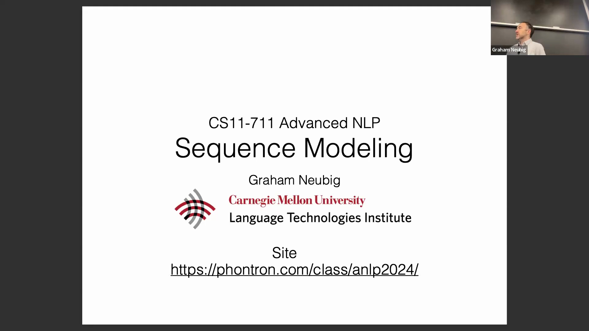
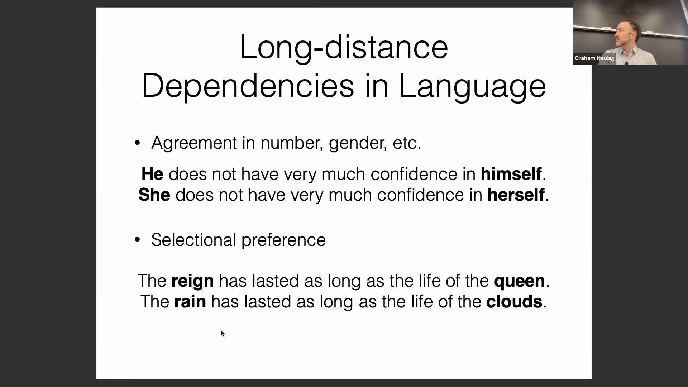
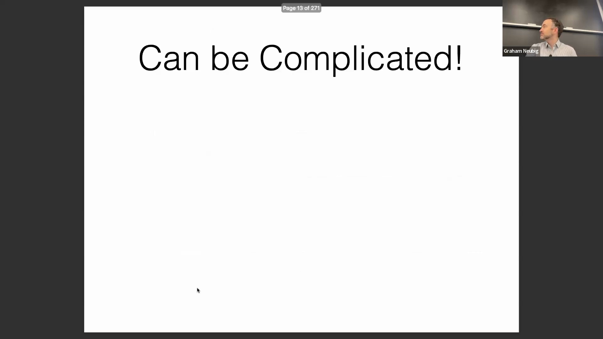
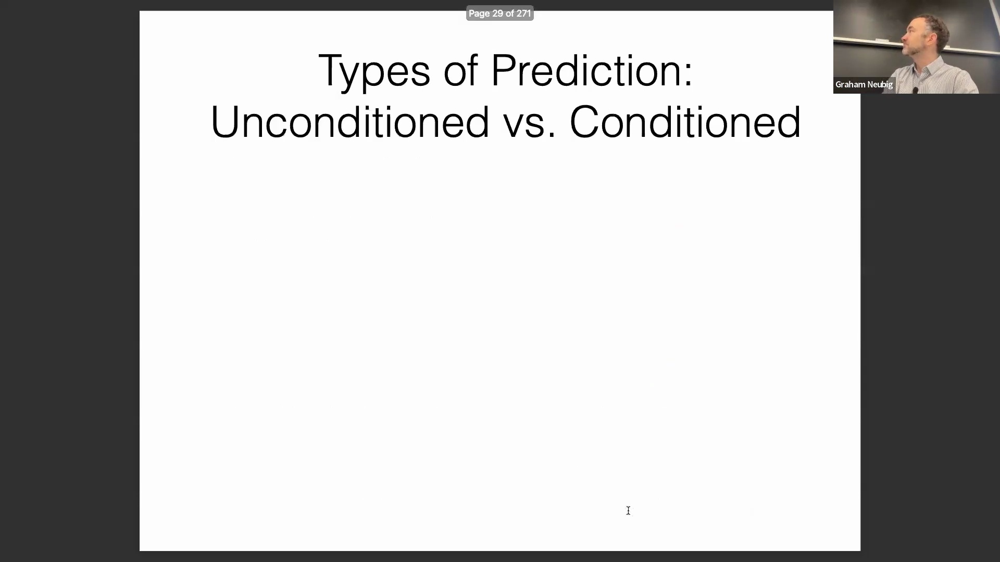
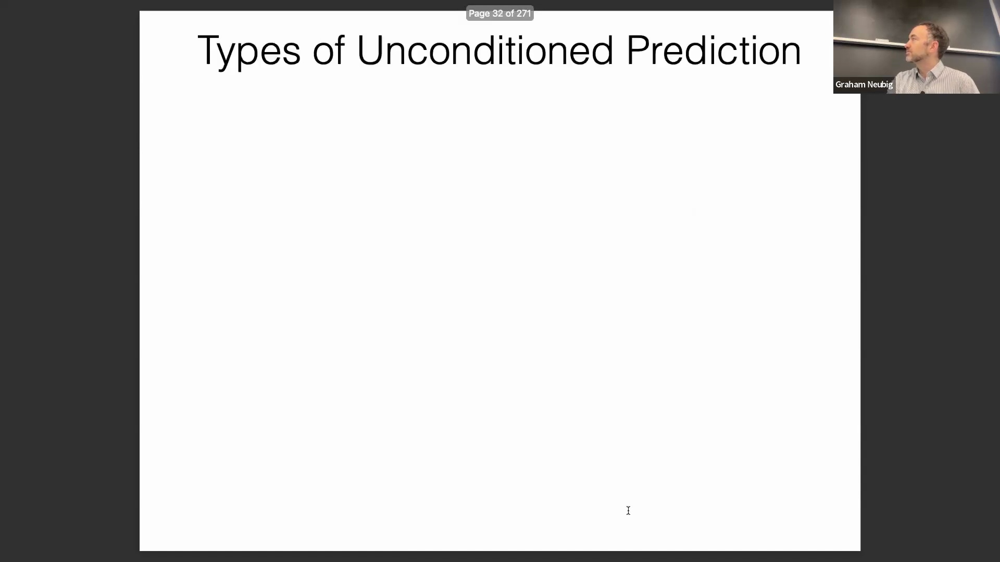

## 引言与课程安排
在深入核心内容之前，讲师概述了本堂课的重点——序列建模(Sequence Modeling)。讲座将涵盖使用序列模型的基本动机，探讨现有的各种模型类型，并介绍三种基础技术：循环神经网络(Recurrent Neural Networks, RNN)、卷积网络(Convolutional Networks)和注意力机制(Attention Mechanism)。

## 序列数据在自然语言处理(NLP)中的普遍性
序列建模是自然语言处理(Natural Language Processing, NLP)的核心，因为该领域本质上建立在序列数据之上。这涵盖了多个粒度，从字符、单词到词元(Token)、句子、段落乃至完整文档。除了单篇文本，序列还出现在时间数据流中，例如连续的社交媒体帖子或多文档语料库(Corpus)。本质上，序列结构在所有NLP任务中无处不在。

## 长距离依赖(Long-Distance Dependencies)与语法一致性
语言建模的一大挑战是捕捉长距离依赖。为了生成流畅且符合语法的文本，模型必须准确追踪相隔较远的词元在数(Number)、性(Gender)和格(Case)上的一致性。例如，反身代词“himself”必须与主语“he”保持一致，而“herself”则需与“she”保持一致。尽管性一致性在英语中相对有限，但在法语及世界上绝大多数语言中，它是一项极为普遍且关键的语法特征，因此成为建模过程中必须妥善处理的核心要求。

## 共指消解(Coreference Resolution)与威诺格拉德模式挑战(Winograd Schema Challenge)
除了句法一致性，模型还必须在更长的上下文中处理选择偏好(Selectional Preferences)、语义连贯性(Semantic Coherence)和事实知识。长上下文依赖的一个经典示例是威诺格拉德模式挑战，该挑战专门用于评估模型的共指消解能力。在句子“The trophy would not fit in the brown suitcase because it was too big”（奖杯放不进棕色手提箱，因为它太大了）中，“it”指代的是奖杯。反之，若句子改为“...because it was too small”（……因为它太小了），则“it”指代的是手提箱。成功消解这些歧义代词(Ambiguous Pronouns)要求模型在整个序列中持续保持并有效运用上下文理解能力。

## 语言能力评估基准(Benchmark)与建议项目(Project)
威诺格拉德模式专门设计用于评估语言模型是真正理解了语言内涵，还是仅仅依赖于统计捷径(Statistical Shortcuts)。通过构建词汇差异极小但正确答案完全相反的成对样本，此类基准测试有效排除了模型对表面特征的依赖。讲师还重点介绍了一个多语言比喻语言基准测试(Figurative Language Benchmark)（例如，解读“This movie had the depth of a wading pool”/“这部电影浅得像涉水池”），该基准已作为建议项目发布在课程论坛Piazza上。鼓励学生深入探索这些基准数据集，以加深对自然语言评估机制的理解。

## 结构化预测(Structured Prediction)与二分类/多分类的对比
讲座将序列预测问题划分为二分类(Binary Classification)、多分类(Multiclass Classification)与结构化预测。与标签集有限的标准分类任务不同，结构化预测需面对指数级增长的输出空间。例如，为句子进行词性标注(Part-of-Speech Tagging)时，模型需评估序列中所有词汇可能产生的标签组合。在机器翻译(Machine Translation)等任务中，这种组合复杂性将进一步加剧，因为输出序列的长度是无界的，且不受限于固定的候选词集合。

## 庞大输出空间的管理与条件概率(Conditional Probability)
为了应对庞大的输出空间，模型通常采用基于规则约束或概率分布的剪枝(Pruning)策略。硬性语言约束可预先排除不合语法的序列（例如，连续出现两个限定词），而实际的生成算法则会通过剪除低概率路径来控制计算负载。结构化预测与语言建模通常不会一次性生成完整序列，而是采用自回归(Autoregressive)范式逐步求解：每次仅预测一个元素，并基于当前上下文计算下一个词元(Token)的条件概率。

## 自回归(Autoregressive)建模与从左到右的序列生成
本部分区分了无条件预测与条件预测。作为现代语言建模基础的从左到右自回归模型，理论上能够关注全部历史上下文，且不受长度限制。然而，受限于数据稀疏性(Data Sparsity)问题，传统的 n-gram 模型(n-gram Model)通常设定固定的上下文窗口（例如三元模型 Trigram）。在可视化依赖结构时，特定词语的预测仅以其直接前驱词为条件，而非完整的历史序列，从而在语言建模的准确性与计算效率之间取得平衡。