## 预测架构与上下文约束
讲座首先对比了三元模型(Trigram)等固定上下文架构与支持无限上下文窗口的架构。文中介绍了独立预测（即一元模型(Unigram)）与双向预测，并指出尽管双向模型或掩码语言模型(Masked Language Model, MLM)在学习特征表示方面极为高效，但它们无法为序列生成构建定义明确的联合概率(Joint Probability)。为确保生成过程在数学上严谨，每个词元(Token)的预测必须严格基于已生成的历史上下文，而不能依赖未来的词元。
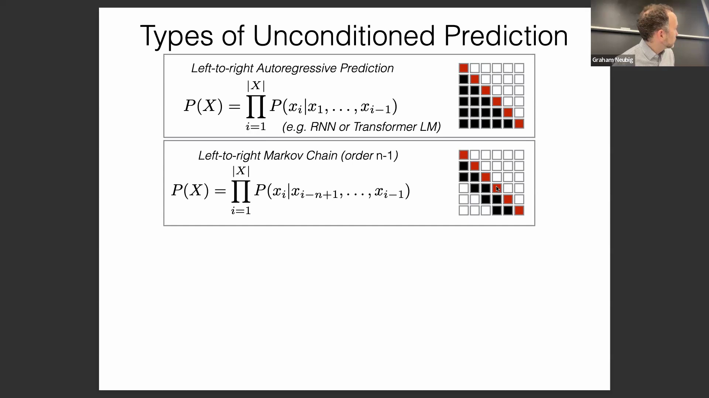

## 条件自回归生成
条件预测(Conditional Prediction)引入了源输入 `X` 以指导输出序列 `Y` 的生成。条件自回归模型(Conditional Autoregressive Model)构成了ChatGPT等现代对话式人工智能(AI)的核心基础，其中用户的提示词(Prompt)为后续词元的生成设定了上下文。若缺乏条件提示，此类模型仅会从其基础分布(Base Distribution)中采样，往往生成随机或无意义的内容，这充分凸显了初始上下文在引导自回归解码(Autoregressive Decoding)过程中的关键作用。
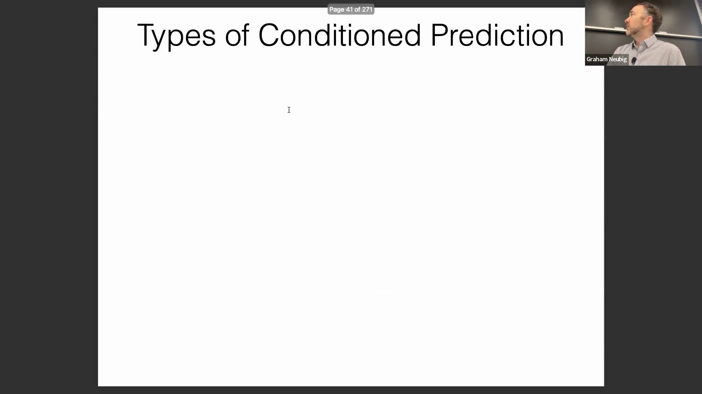

## 非自回归预测与特征提取范式
除自回归解码外，非自回归条件预测(Non-Autoregressive Conditional Prediction)支持词元的并行生成，广泛应用于序列标注(Sequence Labeling)及部分机器翻译(Machine Translation)架构中。其底层机器学习范式保持一致：从输入 `x` 中提取特征 `h`，进而预测标签 `y`。然而，特征映射(Feature Mapping)的方式因任务而异。文本分类(Text Classification)通常将整个序列压缩为单一表示向量(Representation Vector)，而序列标注则为每个词元生成独立的特征向量，以支持细粒度(Fine-Grained)且针对特定位置的预测。
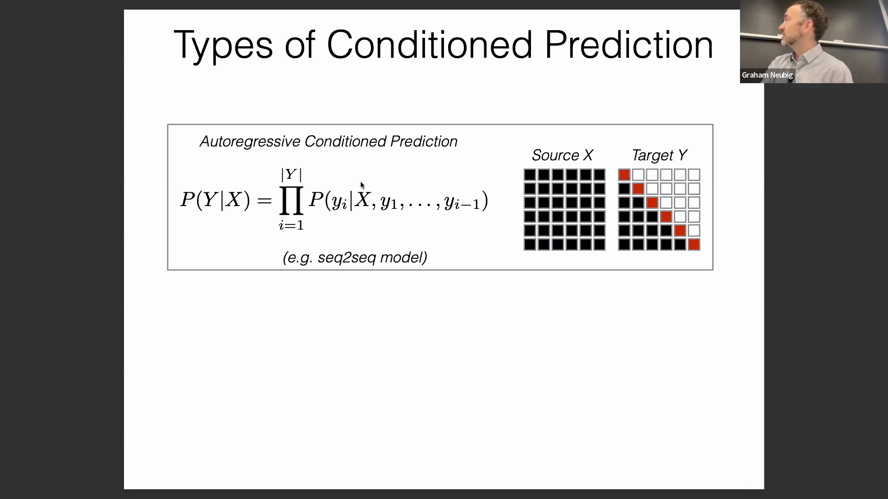
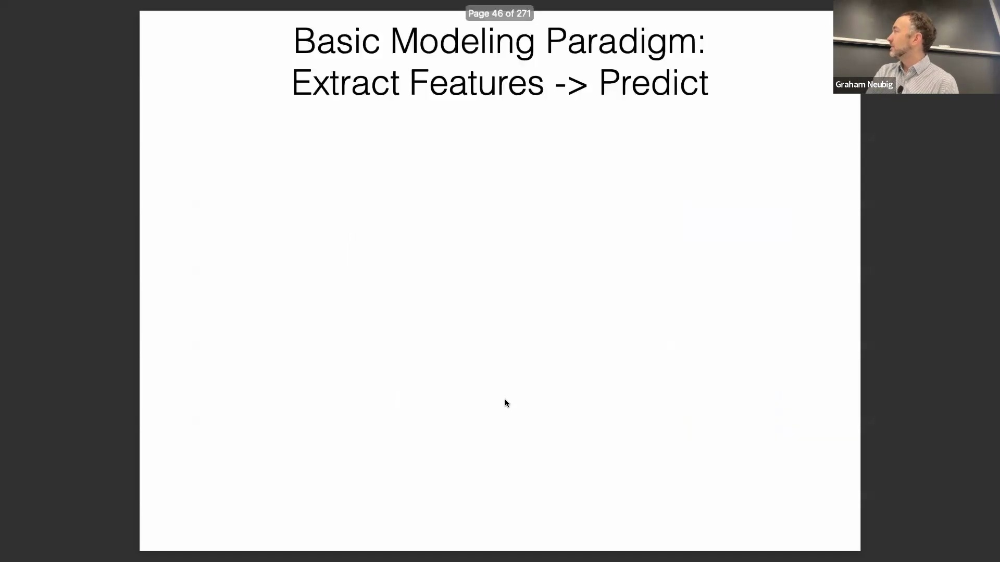

## 词元级标注：词性、词形还原与形态学
序列标注涵盖了多项基础NLP任务。词性标注(Part-of-Speech Tagging)为每个词元分配语法类别；词形还原(Lemmatization)则预测单词的词典原形(Lemma)，相较于仅依赖后缀剥离规则的粗糙词干提取器(Stemmer)，能提供更精准的语言规范化处理。形态学标注(Morphological Tagging)在此基础上进一步扩展，用于预测时态、数、格等细粒度特征。尽管英语或中文等形态学(Morphology)相对简单的语言所需的标注较为直接，但该任务对于日语、印地语或阿拉伯语等高度屈折变化(Inflection)的语言而言至关重要。
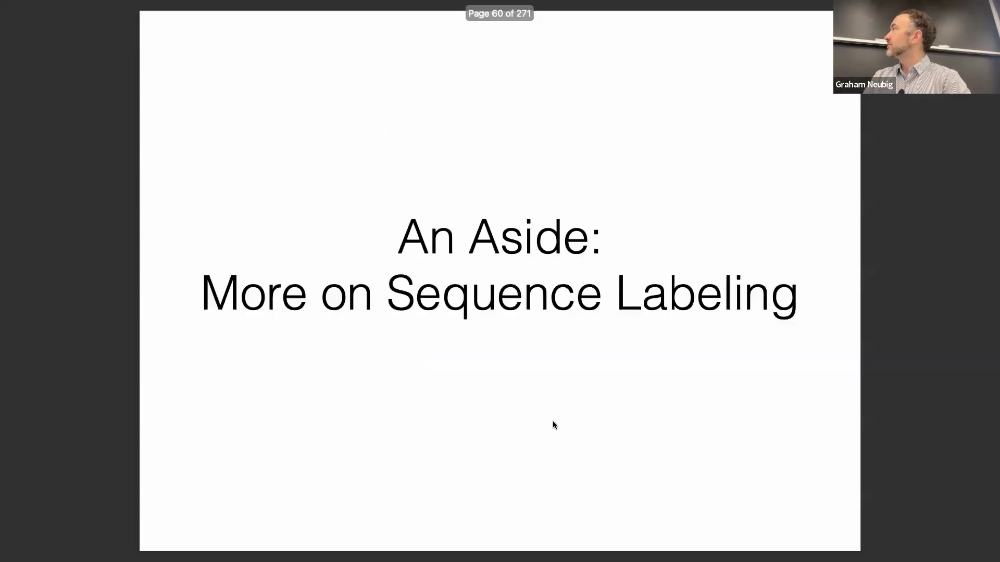
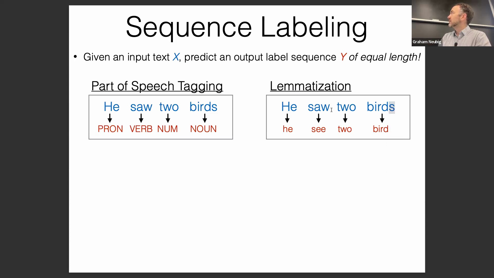

## 跨度标注与实际实体应用
跨度标注(Span Labeling)旨在识别连续的文本片段并为其分配类别标签。其主要应用包括命名实体识别(Named Entity Recognition, NER)、句法分块(Syntactic Chunking，用于识别名词/动词短语)以及语义角色标注(Semantic Role Labeling，用于提取“施事-动作-受事”等语义关系)。一个极具实用价值的延伸应用是实体链接(Entity Linking)，它将识别出的实体映射至Wikidata等结构化知识库(Structured Knowledge Base)。尽管实体链接在算法实现上相对直接，但它在新闻聚合、品牌监控和社交媒体分析等工业级应用中不可或缺。
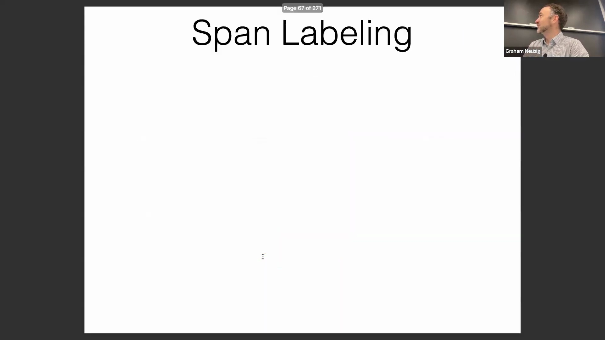
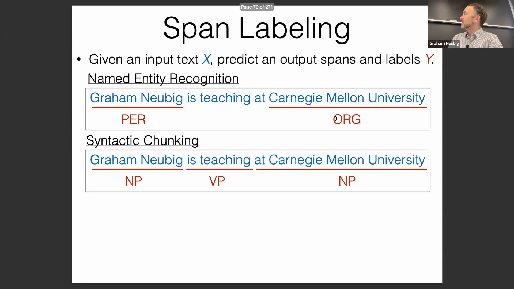

## 用于跨度预测的 BIO 标注体系
为在标准序列预测框架中实现跨度标注，研究人员通常将跨度边界转换为逐词元的标记格式，即BIO标注体系(BIO Tagging Scheme)。每个词元被标记为`B-`（Begin，跨度起始）、`I-`（Inside，跨度内部）或`O`（Outside，外部/不属于任何跨度）。例如，一个由多词构成的人名将标记为`B-PER, I-PER`。这种线性标签序列可通过确定性规则(Deterministic Rules)无损地还原为结构化跨度，从而无缝衔接序列建模与跨度提取任务。
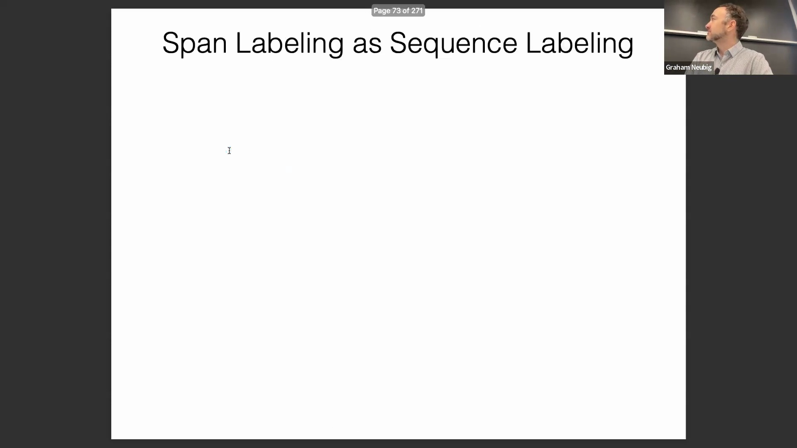
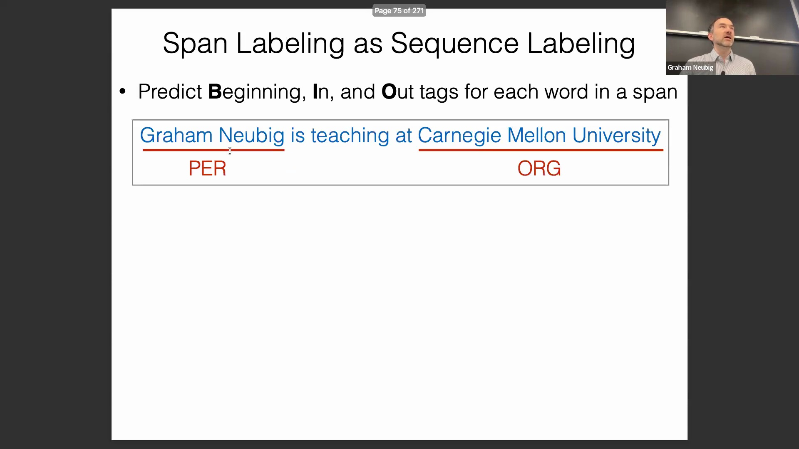
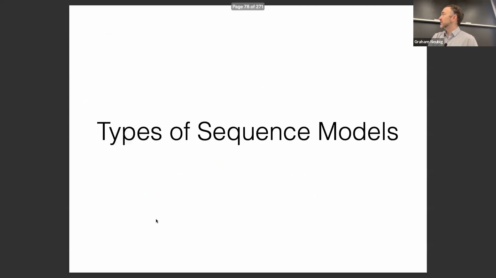

## 过渡至循环序列模型
在介绍完基础的序列标注任务与标注体系后，讲座将转向支撑现代NLP的核心建模架构。尽管序列模型种类繁多，但绝大多数研究与应用主要依赖于三大范式。其一是循环机制(Recurrence)，该机制通过对完整历史上下文进行压缩编码表示(Compressed Representation)来实现条件预测，为处理序列数据中的长距离依赖(Long-Distance Dependencies)奠定了坚实基础。