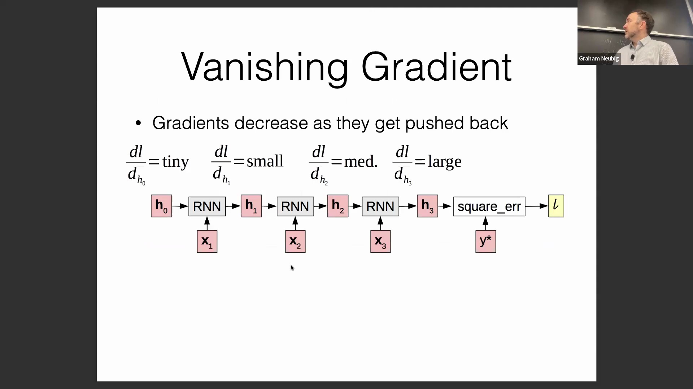
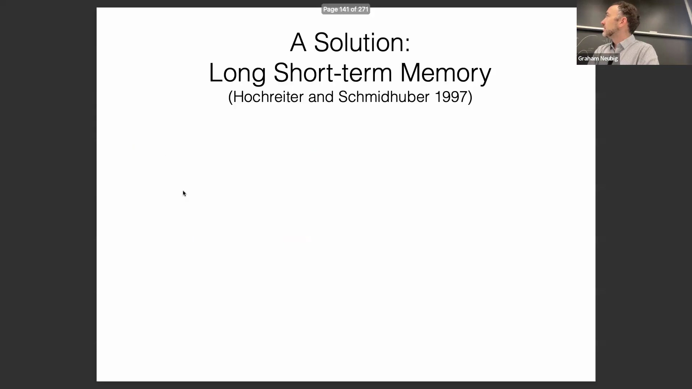
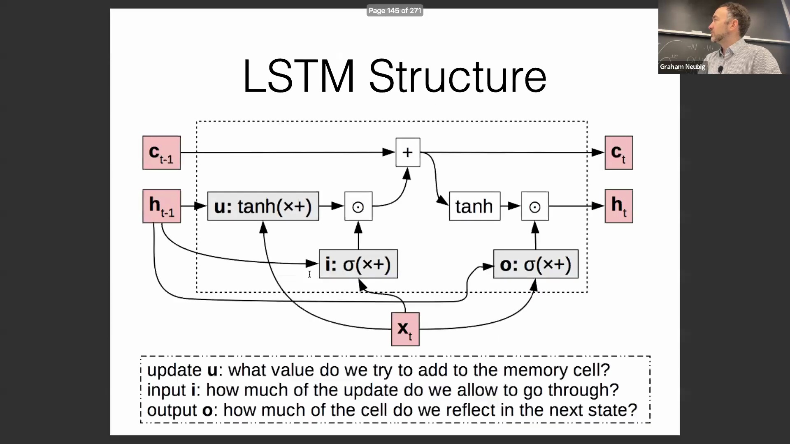
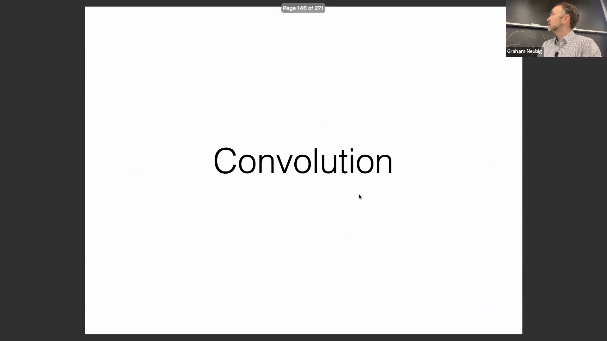
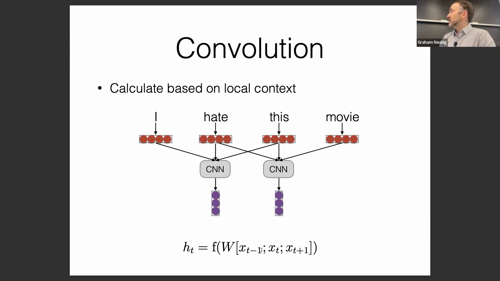

## 梯度消失与梯度爆炸问题
标准循环神经网络(Recurrent Neural Network, RNN)在处理长序列时面临严重的训练困难，主要源于梯度消失(Gradient Vanishing)或梯度爆炸(Gradient Exploding)问题。在反向传播(Backpropagation)过程中，梯度需连续穿过非线性激活函数(Non-linear Activation Function)（如 tanh，其导数最大值为 1，在其他区域迅速趋近于 0）并反复相乘，导致梯度要么呈指数级衰减，要么失控地暴增。只要变换过程中的有效梯度幅值(Gradient Magnitude)持续小于 1 或大于 1，就会引发该问题，进而导致跨时间步(Time Step)的参数更新(Parameter Update)极不稳定。

## 梯度流动的架构设计原则
深入理解梯度动态特性(Gradient Dynamics)为神经网络架构设计(Neural Network Architecture Design)提供了关键指导。为了最大化模型性能，关键信息应通过直接且无阻碍的路径传递至预测节点，以确保产生强烈的梯度信号(Gradient Signal)。相反，噪声或潜在无关的数据则更适合经由更复杂、间接的路径进行处理，这迫使网络付出更多计算“努力”以提取有效特征，从而降低模型对干扰的敏感性。

## 长短期记忆网络（LSTM）
长短期记忆网络(Long Short-Term Memory, LSTM)通过在时间步之间建立加法连接来解决梯度衰减问题。由于恒等函数(Identity Function)（$f(x)=x$）的导数恒为 1，加法路径能够确保梯度稳定传播，既不被放大也不被衰减。LSTM 通过一个持久化的记忆单元(Memory Cell)实现该机制，该单元受三个可学习门控(Gating Mechanism)调节：控制历史状态保留的遗忘门(Forget Gate)、管理新信息输入的输入门(Input Gate)，以及决定对外输出的输出门(Output Gate)。这种基于加法的门控架构(Gated Architecture)（门控循环单元(Gated Recurrent Unit, GRU)亦采用）至今仍是现代序列建模的基石。

## 跨越网络深度的残差连接
梯度加法保留的原则不仅适用于时序数据，同样延伸至深度前馈网络(Deep Feedforward Network)架构中。残差连接(Residual Connection)（或称跳跃连接(Skip Connection)）将网络模块的输入直接叠加至其输出，构建出一条“高速通道”，使信息与梯度能够绕过复杂的非线性变换(Non-linear Transformation)。若说 LSTM 是在*时间维度*上稳定了梯度，那么残差连接则是在*网络深度维度*上实现了梯度的稳定传播。如今，该技术已成为 BERT 和 GPT 等主流 Transformer 架构的标准配置。

## 卷积模型与领域特定效用
尽管类 RNN 架构在长序列文本建模中表现优异，但卷积网络(Convolutional Network)在语音与图像处理领域仍占据主导地位。这种领域特异性(Domain Specificity)源于数据粒度的差异：语言学词元(Token)（如词或子词(Subword)）本身携带固有语义，而单个音频帧(Audio Frame)或图像像素(Image Pixel)通常缺乏独立语义。卷积操作能够高效地将这些底层单元聚合为高阶特征表示(High-level Feature Representation)，因此在处理原始感知数据(Raw Perceptual Data)或字符级文本(Character-level Text)时极具优势。

## 卷积工作机制与自回归约束
卷积层(Convolutional Layer)的工作机制类似于在局部上下文窗口(Local Context Window)上滑动的前馈网络。该层通常将相邻词元的嵌入向量(Embedding Vector)（例如 $x_{t-1}, x_t, x_{t+1}$）进行拼接(Concatenation)，并施加共享的线性变换(Linear Transformation)。尽管双向窗口(Bidirectional Window)非常适用于序列标注(Sequence Labeling)任务，但语言建模(Language Modeling)要求严格遵守因果约束(Causal Constraint)。在自回归设定(Autoregressive Setting)下，卷积操作必须引入掩码(Masking)或采用因果结构(Causal Structure)以屏蔽未来词元，从而确保预测仅依赖于当前及历史信息。
