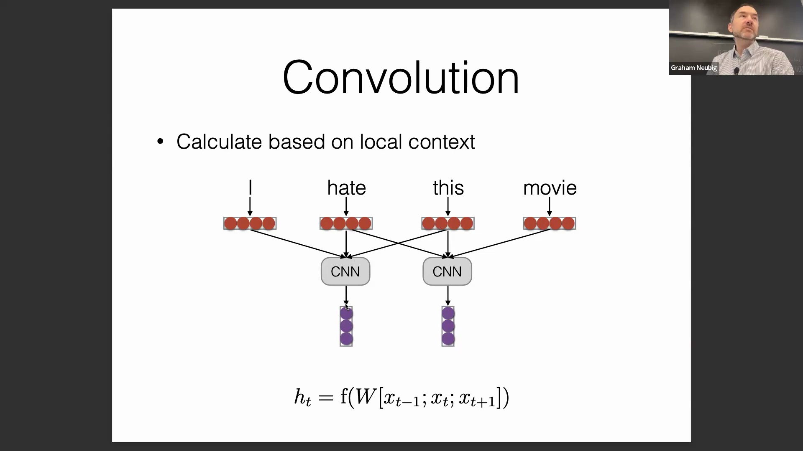
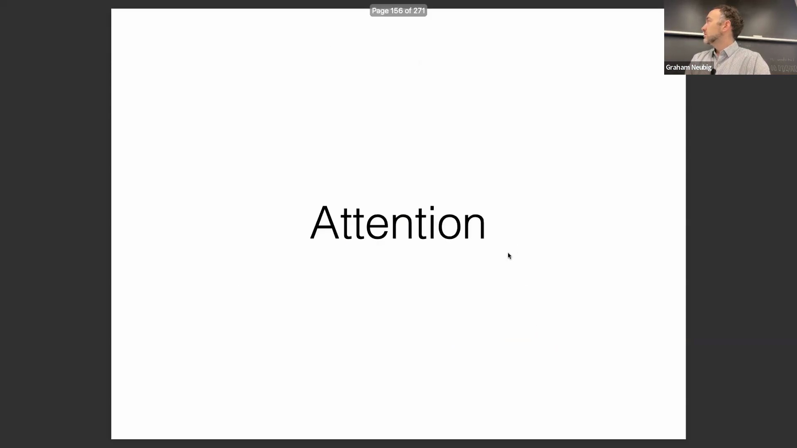
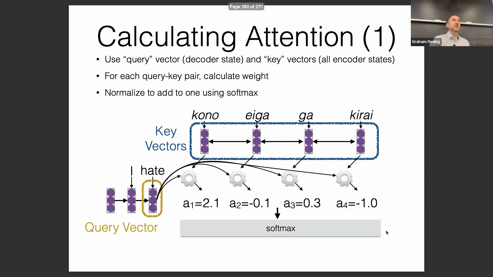
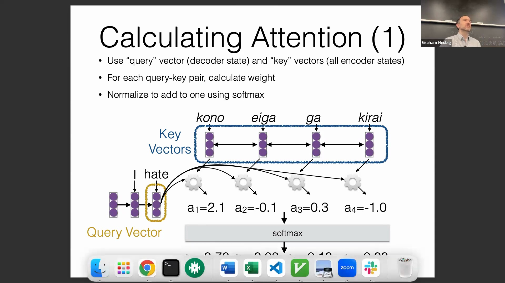
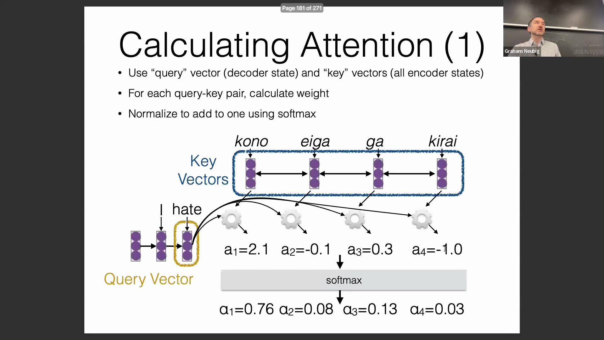
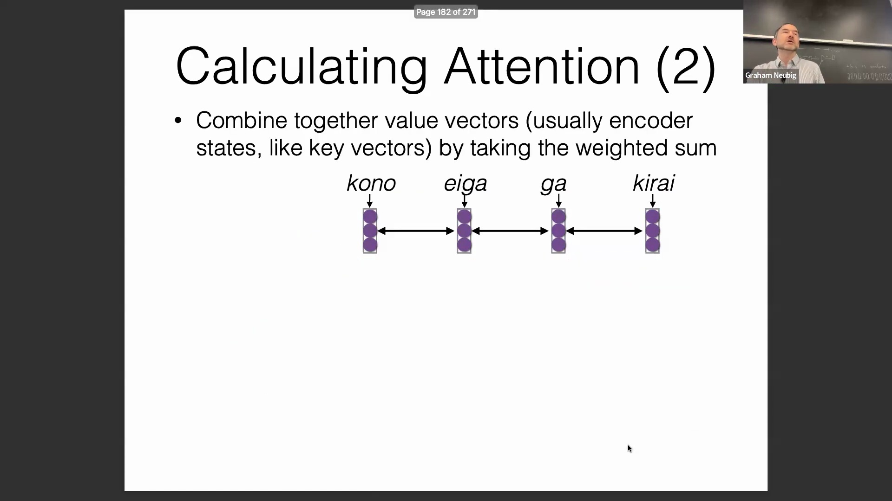
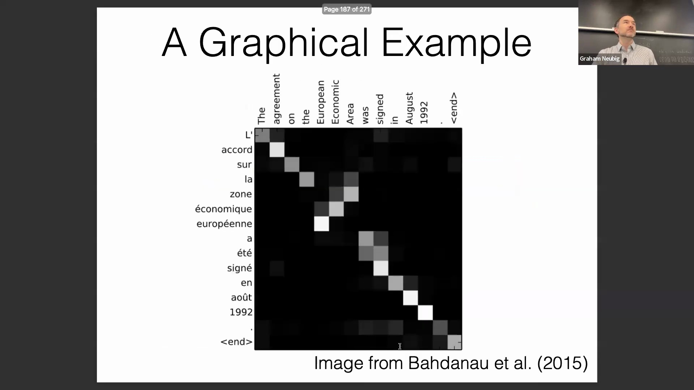
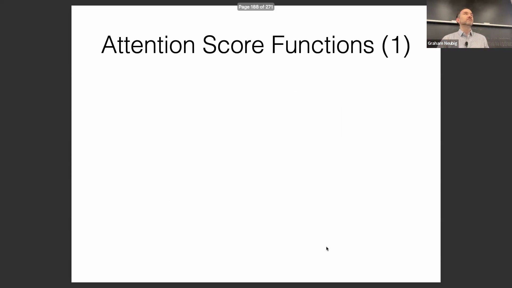

## 卷积语言模型的局限性与解决方案

但它在语言建模(Language Modeling)等任务中表现不佳，因为在此类任务中，模型无法“看到”未来的内容。然而，存在一个非常直观的解决方案：使用仅关注历史信息的卷积操作(Convolution)，基于当前与过去的上下文来预测下一个词元(Token)。例如，在此设定下预测如“movie”这样的词，本质上等价于前文讨论的前馈语言模型(Feedforward Language Model)。因此，你可以将其视为卷积语言模型(Convolutional Language Model)。每当提及前馈或卷积语言模型时，它们在根本架构上是相同的，仅在步长(Striding)等少数实现细节上有所差异。 

好的，我已简要介绍了卷积，因为它也是当今三种主流序列建模(Sequence Modeling)技术中应用最少的一种。关于这部分大家有什么问题吗？还是我可以直接进入注意力机制(Attention Mechanism)的讲解？看来没问题，接下来我将详细阐述注意力机制。

## 交叉注意力的基础
注意力机制的基本思想是将序列中的每个词元(Token)编码为一个向量。对于一个待编码的输入序列，模型会根据注意力权重(Attention Weights)对这些向量进行加权线性组合。注意力机制主要分为两种类型。第一种是交叉注意力(Cross-Attention)，即一个序列中的每个元素关注另一个序列中的元素。它被广泛应用于编码器-解码器架构(Encoder-Decoder Architecture)中，该架构包含独立的编码器(Encoder)与解码器(Decoder)。目前仍采用此架构的主流模型包括 T5 和 mBART。 

在实际应用中（例如英译日），模型会动态调整其关注焦点。在生成首个词元时，模型会显著提升对应源词元(Source Token)的权重。随着生成的推进，注意力会发生转移，转而关注与新生成词元相关的其他源词元。有时，若源句中缺乏直接对应的词元，模型可能会输出一种平滑且弥散的注意力权重分布。然而，当生成诸如“example”等具体术语时，模型则会在源序列中精准对应的词元上表现出强烈且集中的注意力。

## 用于上下文编码的自注意力
第二种是自注意力(Self-Attention)，即序列中的每个元素关注*同一*序列内的其他元素。这是一种极为有效的序列编码方法，类似于我们此前使用的循环神经网络(Recurrent Neural Network, RNN)、双向循环神经网络(Bidirectional RNN, BiRNN)或卷积神经网络(Convolutional Neural Network, CNN)。例如，若我们在翻译前需要对一句英文进行编码，某些词在孤立状态下含义明确，但其准确译法高度依赖于上下文。此时，模型需要关注其他词元以识别共现关系(Co-occurrence)并消除歧义(Disambiguation)。这一原则同样适用于任何涉及消歧或风格迁移的任务。本质上，交叉注意力关注的是不同序列间的关联，而自注意力则聚焦于同一序列内部的关联。

## 机制工作流：查询、键与归一化
从机制层面来看，在使用基于循环神经网络的编码器-解码器模型进行翻译与文本生成时，计算始于当前的隐藏状态(Hidden State)。我们引入查询向量(Query Vector)，它本质上决定了模型“需要关注什么”。同时，我们还有键向量(Key Vector)，用于标识序列中“哪些元素应当被关注”。针对每一对查询-键(Query-Key Pair)，模型会通过特定的兼容性函数(Compatibility Function)计算出一个权重得分。关键在于，该函数在所有位置的计算中是完全一致的。这种参数共享(Parameter Sharing)机制与 RNN 类似，使得模型能够通过复用同一组权重，有效处理任意长度的序列。计算完成后，我们利用 Softmax 函数对这些权重进行归一化(Normalization)，使其总和为 1（例如，输出类似 0.76 的数值）。

## 组合值向量
进入下一步，在获得归一化后的注意力得分后需注意：尽管它们的总和为 1，但这些值并不严格等同于概率。它们主要作为系数，用于融合多个向量。我们引入值向量(Value Vector)，这才是真正需要被组合以生成最终上下文感知表示(Context-aware Representation)的向量。通过利用注意力权重对这些值向量进行加权求和(Weighted Sum)，我们得到一个最终的聚合向量。该结果向量可被集成至模型的任何模块中。注意力机制具有极高的灵活性；尽管如今最常见的应用是如 Transformer 般堆叠多层自注意力层(Self-Attention Layers)，但它同样能高效地应用于解码器及其他各类网络架构中。

## 可视化与无监督对齐
此图选自注意力机制的原始论文(Original Attention Paper)中的实际可视化示例。尽管我将在下节课展示更多关于 Transformer 的案例，但这张英法翻译任务的可视化图清晰地揭示了注意力权重如何与语义对齐(Semantic Alignment)相吻合。若你通晓这两种语言，便可观察到注意力自然地在语义相似的词元之间形成重叠，模型甚至自发学会了合理的词序重排(Word Order Reordering)。值得注意的是，这一过程完全是无监督的(Unsupervised)。模型从未被显式地告知应当关注何处；相反，它纯粹通过梯度下降(Gradient Descent)算法自主学习这种对齐关系，不断调整键向量与查询向量的嵌入(Embedding)，促使它们在向量空间中相互靠近。

## 计算注意力打分函数
接下来探讨注意力打分函数(Attention Scoring Function)的具体计算方式。原始论文中采用了一种前馈神经网络结构：将查询向量与键向量进行拼接(Concatenation)，乘以权重矩阵后应用 tanh 激活函数(tanh Activation Function)，最终通过一个权重向量投影输出得分。尽管该方法表达能力强且灵活（通常在大规模数据集上表现优异），但其引入了额外的参数量与计算开销，因此在当前实践中已较少使用。后续研究提出了替代方案，即采用双线性函数(Bilinear Function)，在键向量与查询向量之间引入一个可学习的权重矩阵。该方法能够高效计算兼容性得分，并因其在模型性能与计算效率之间取得的良好平衡而广受青睐。