## 双线性注意力与缩放点积公式
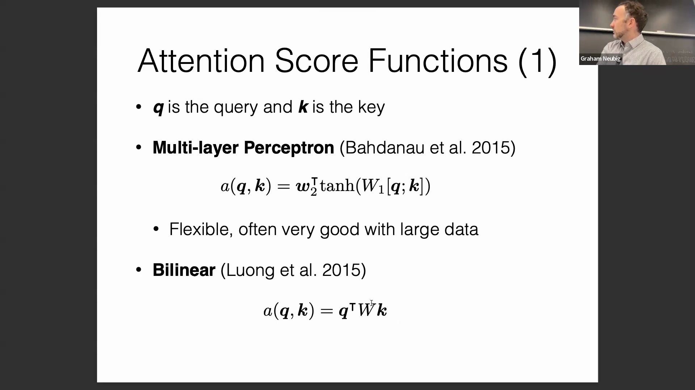
该方法的优势在于能够对键向量(Key Vector)和查询向量(Query Vector)进行联合线性变换。研究人员也曾尝试过标准的点积运算(Dot Product)，其本质上是计算 `query 的转置乘以 key` 或直接求 `query 与 key 的点积`。然而，这强制要求查询向量与键向量必须处于完全相同的向量空间(Vector Space)中，施加了过于严格的限制，且模型扩展性(Scalability)较差，尤其是在大规模数据集上训练时。原始点积运算的一个主要缺陷是，随着向量维度(Dimensionality)的增加，其计算结果的数值规模也会随之增大。为解决此问题，通常会将点积结果除以向量维度的平方根进行缩放(Scaling)。其背后的统计学原理涉及方差(Variance)与标准差(Standard Deviation)：当对来自同一分布的独立随机变量求和时，其标准差会随变量数量的平方根增长。除以该缩放因子能有效对得分分布进行归一化(Normalization)，防止注意力得分过大导致梯度消失。尽管开创性论文《Attention Is All You Need》未对此进行详细数学推导，但该缩放操作具备坚实的统计学基础。
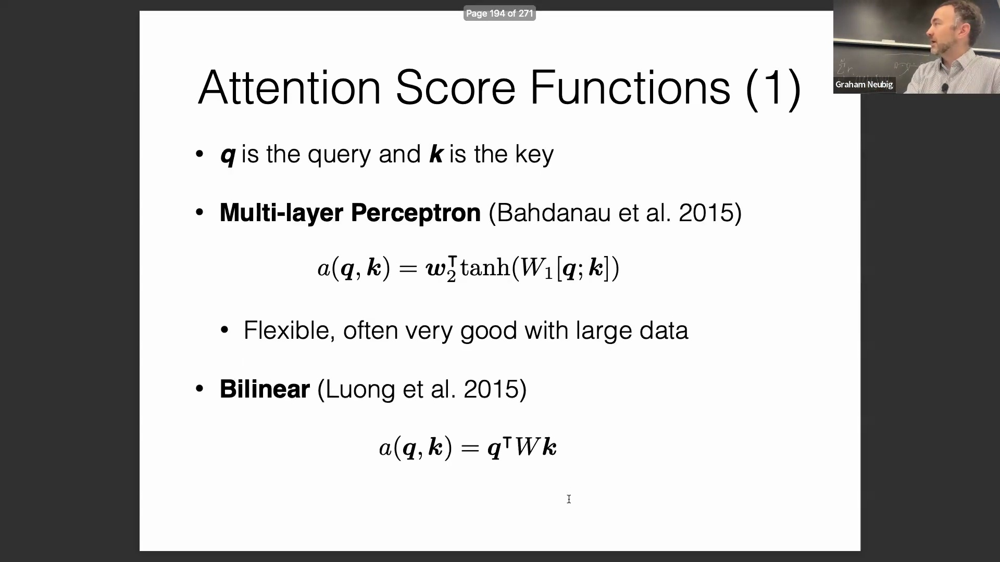
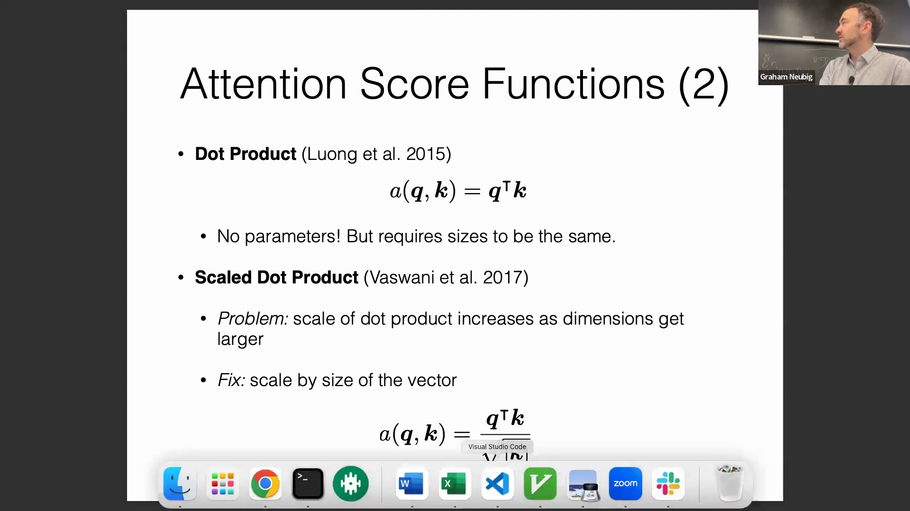
在现代 Transformer 架构中，具体实现会提取键(Key)的隐藏状态(Hidden State)并与一个可训练的权重矩阵相乘，查询向量(Query)亦执行相同的线性变换。随后，这些变换后的向量会除以平方根缩放因子进行归一化处理。尽管该机制通常被称为“缩放点积注意力(Scaled Dot-Product Attention)”，但引入这些可训练的权重矩阵实际上使其演变为一种归一化的双线性注意力模型(Normalized Bilinear Attention Model)。这已成为当前业界最广泛采用的标准范式。

## 用于自回归序列生成的因果掩码
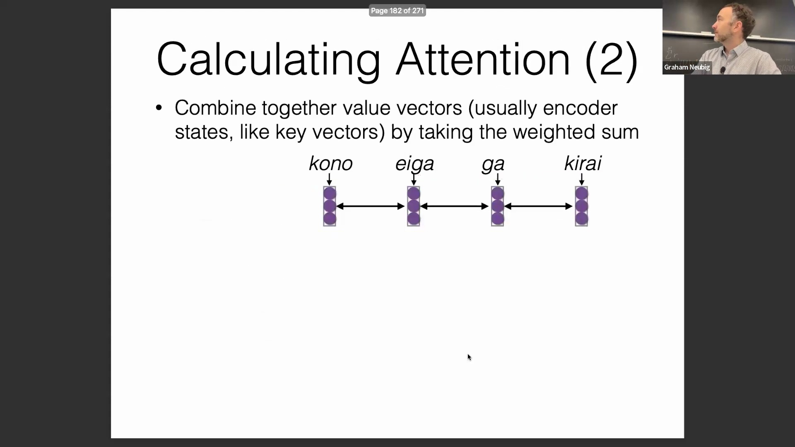
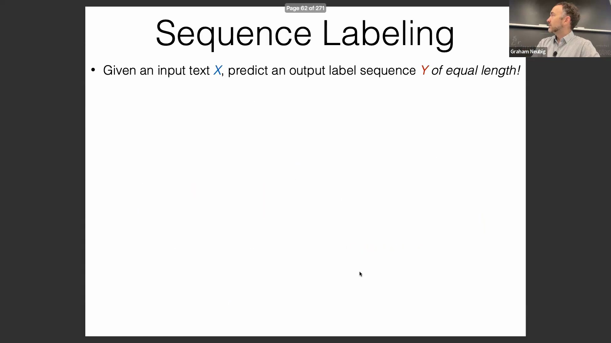
在训练自回归模型(Autoregressive Model)时，防止模型“偷看”未来的词元(Token)至关重要。在训练阶段引用未来信息等同于数据泄露(Data Leakage)，会导致模型在实际的从左到右生成过程中失效，并破坏其概率建模(Probabilistic Modeling)的本质。因此，在无条件的生成模型中，必须严格阻断模型对未来时间步的访问。尽管带条件的编码器-解码器(Encoder-Decoder)模型可以对源序列(Source Sequence)进行双向(Bidirectional)编码，但在处理目标序列(Target Sequence)时，仍必须保持严格的因果性(Causality)。
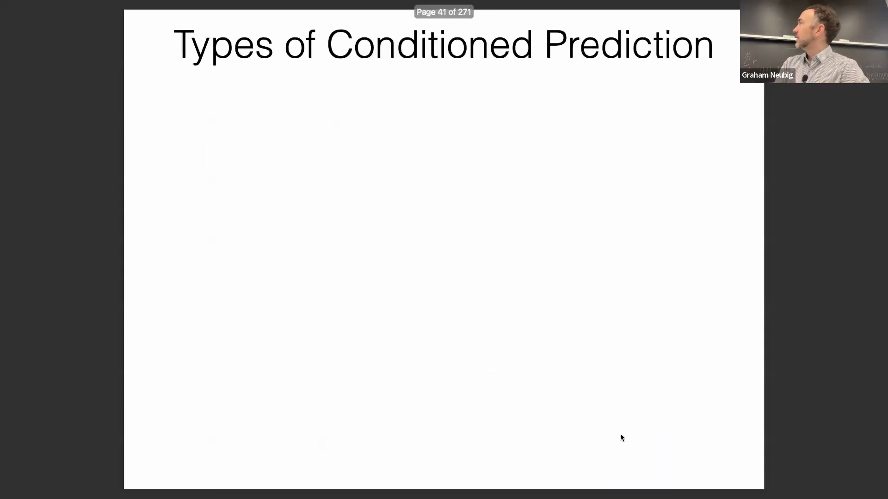
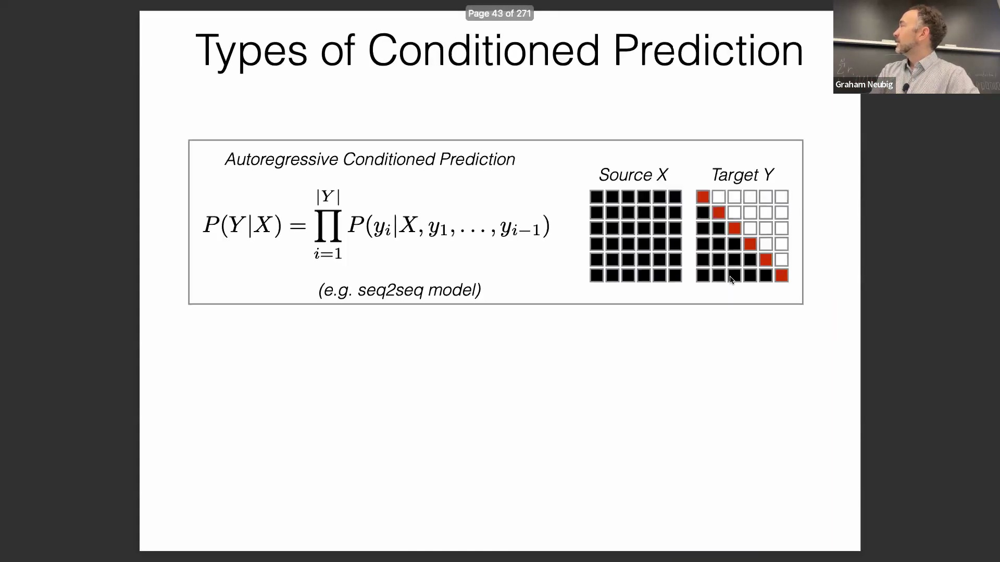
为强制执行这一约束，我们会构建一个注意力掩码(Attention Mask)，以在生成阶段阻断未来信息。从技术实现上讲，在对原始注意力得分(Attention Scores)（例如 2.1、0.3、0.5）应用 Softmax 函数之前，我们会将负无穷(Negative Infinity)（或一个极大的负数）加至所有需要被屏蔽的位置。经过 Softmax 激活后，这些被掩码位置的权重值将指数级衰减至趋近于零，从而确保模型不会为未来词元分配任何有效权重。该机制被称为注意力掩码(Attention Mask)，是实现因果注意力(Causal Attention)的核心基础组件。
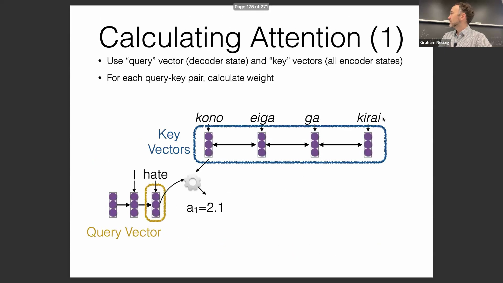
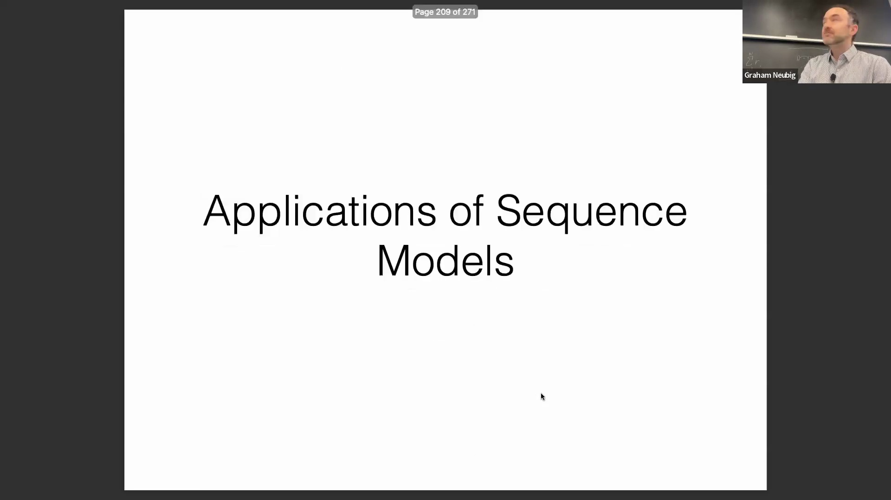

## 序列模型的应用与计算效率
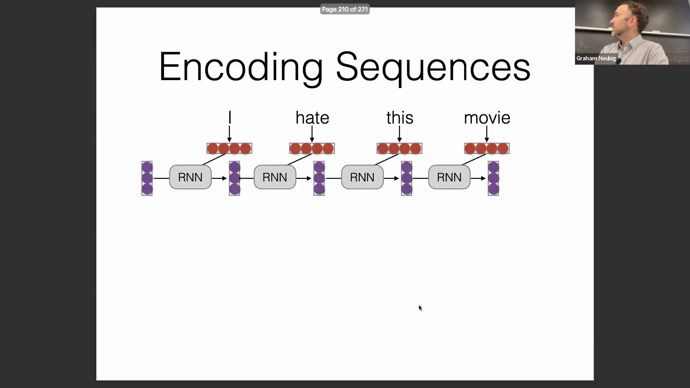
序列模型(Sequence Model)（无论是循环神经网络(RNN)、卷积网络(Convolutional Network)还是 Transformer）主要涵盖几个核心应用场景。其一是将整个输入序列编码为单一的上下文向量(Context Vector)。传统做法是提取序列末尾的最终隐藏状态(Final Hidden State)，并将其输入分类器(Classifier)以执行二分类(Binary Classification)或多分类(Multiclass Classification)任务。该范式也被广泛应用于语义搜索与检索(Semantic Search and Retrieval)领域，其中句子嵌入(Sentence Embedding)会被预先建立索引，并通过近似最近邻搜索(Approximate Nearest Neighbor Search)进行高效查询。然而，相较于单纯依赖最后一个词元的表示，通常更稳健(Robust)的做法是对序列中所有词元的隐藏表示进行池化操作（如均值池化或最大池化），除非该架构经过专门设计，能够将全局信息有效汇聚至最终时间步。
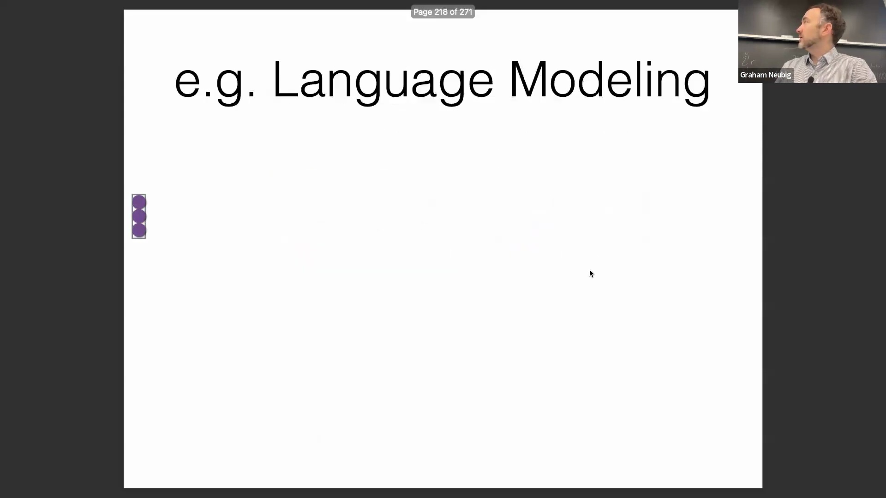
另一大核心应用是面向序列标注(Sequence Labeling)或语言建模(Language Modeling)的词元级编码(Token-level Encoding)。该任务首先需对完整序列进行编码以生成上下文感知表示(Context-aware Representation)，随后在每个词元位置上并行执行预测。从计算效率(Computational Efficiency)的角度审视，这凸显了传统 RNN 的关键瓶颈：每一时间步的计算必须严格依赖于前一步的输出，导致强制性的顺序处理(Sequential Processing)。这种串行特性难以充分利用现代硬件（如 GPU 和 TPU）强大的并行计算(Parallel Computing)能力。相比之下，注意力机制(Attention Mechanism)与卷积操作均打破了这种顺序依赖。尽管标准注意力机制在序列长度较长时存在较高的渐近时间复杂度(Asymptotic Time Complexity, O(n²))，但其能够并行处理所有序列位置的特性，使其在实际工程应用中展现出显著的速度优势与更强的可扩展性(Scalability)。