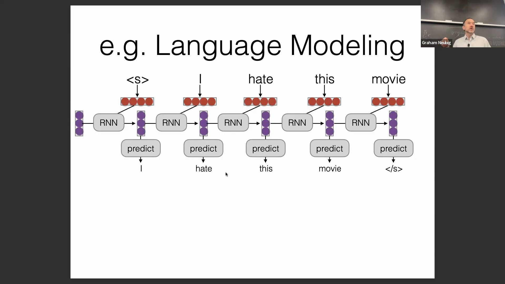
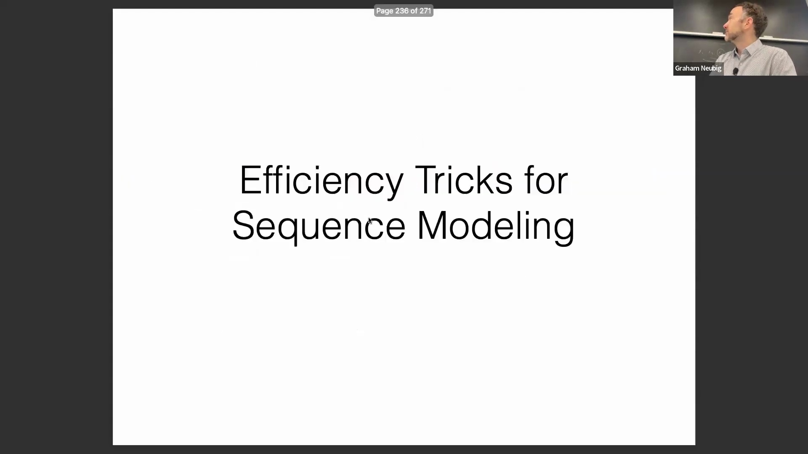
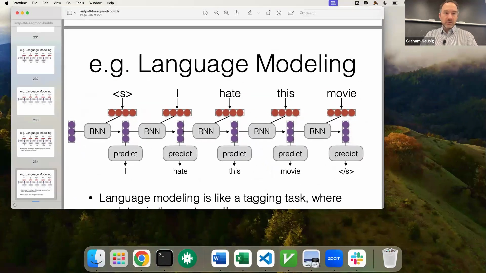
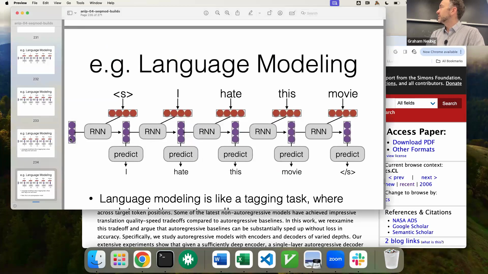
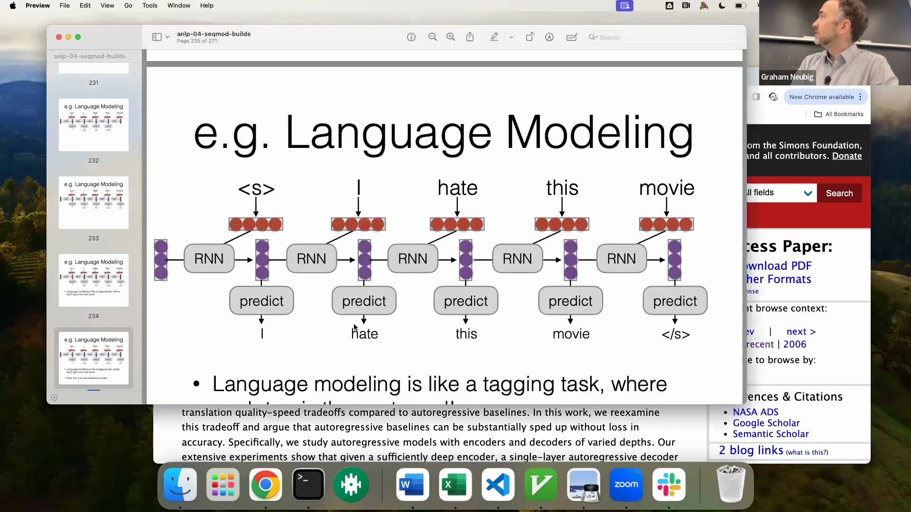
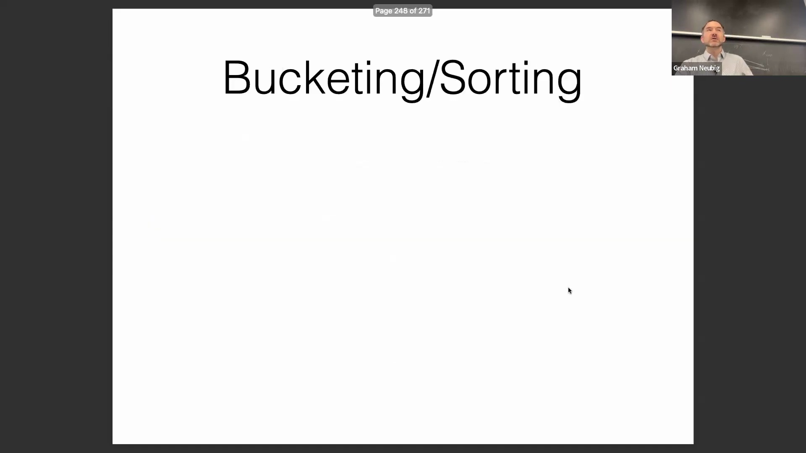

## 并行处理与计算速度
在现代 GPU 上，Transformer 和注意力模型(Attention Models)之所以能实现惊人的计算速度，主要是因为它们消除了传统循环架构(Recurrent Architectures)中固有的顺序瓶颈。通过同时计算序列中的所有位置，这些模型避免了等待前序词元(Token)计算完成的步骤，从而实现了高度并行化的操作，大幅缩短了处理时间。

## 梯度传播与学习效率
除了纯粹的计算速度外，注意力机制(Attention Mechanism)在训练过程中具有更优越的梯度流(Gradient Flow)，因此备受青睐。在循环神经网络(Recurrent Neural Networks, RNN)或长短期记忆网络(Long Short-Term Memory, LSTM)中，将信息从早期的词元传递到较晚的词元，需要穿过数十甚至数百个非线性激活函数。这种深层的顺序路径会显著加剧梯度消失(Vanishing Gradient)问题，使得长距离依赖(Long-range Dependencies)难以学习。注意力模型通过单步建立跨越序列的直接连接，巧妙地规避了这一问题。只要模型学会了合适的注意力权重，信息就能直接流动，而不会因经过多层非线性变换而衰减，这极大地简化了优化地形(Optimization Landscape)。

## 架构对比：RNN、注意力机制与卷积网络
与其他序列建模(Sequence Modeling)方法相比，注意力机制处于依赖传播谱系的极端一端。卷积网络(Convolutional Networks)则处于中间位置；要在长序列中传播信息，必须堆叠多个卷积层以扩大感受野(Receptive Field)，这仍然引入了架构的深度与复杂性。然而，注意力机制仅需单层即可提供即时的全局上下文(Global Context)，使其在捕捉长距离依赖时本质上更加高效，既无需卷积神经网络(Convolutional Neural Networks, CNN)所需的累积深度，也避免了循环神经网络(RNN)的顺序衰减问题。

## 推理并行性与生成瓶颈

尽管注意力模型在编码和并行概率计算方面表现优异，但其在自回归生成(Autoregressive Generation)阶段的性能特征会发生转变。在生成任务中，每个预测出的词元都会成为下一步的输入，从而重新引入了严格的顺序依赖(Sequential Dependency)。因此，Transformer 无法并行解码词元，这使得生成阶段本质上比编码阶段更慢且计算负载更高。这一架构限制解释了为何注意力模型尽管在训练速度上具有巨大优势，但在实时文本生成时仍会面临固有的瓶颈。

## 混合架构与 API 成本影响

为缓解生产系统中的解码延迟(Decoding Latency)，工程师们通常会部署混合架构(Hybrid Architectures)，例如将深层的 Transformer 编码器与浅层、快速的循环神经网络(RNN)解码器相结合。Marian 机器翻译工具包(Marian NMT)等开源框架原生支持此类配置，以优化吞吐量(Throughput)。这种架构拆分也直接影响了商业云 API 的定价策略：解码操作的定价通常高于编码，这正是因为自回归解码过程需要消耗更多的顺序计算资源，且无法充分利用同等程度的硬件并行化能力。

## 小批量处理与序列填充

高效训练序列模型需要妥善处理小批量(Mini-batches)数据。与具有固定输入形状的前馈网络(Feed-forward Networks)不同，自然语言序列的长度差异显著，这增加了批处理的复杂性。标准的解决方案是将较短的序列填充(Padding)至与批次中最长序列相同的长度，并在计算损失时应用注意力掩码(Attention Masks)以忽略这些填充的词元。尽管 PyTorch 和 Hugging Face Transformers 等现代深度学习框架已将此过程自动化，但理解底层的填充与掩码机制对于调试或实现自定义架构仍然至关重要。

## 分桶与排序的计算优化

如果将长度差异巨大的序列简单分组，朴素的小批量处理会导致严重的计算资源浪费。例如，将大量短文档与单个极长序列放在同一个批次中，会迫使 GPU 在整个批次内处理数百个不必要的填充词元。为优化这一问题，从业者通常采用分桶(Bucketing)与排序策略：在构建批次前对数据集进行预处理，将长度相近的序列归入同一组。该策略能最大限度地减少填充开销，并提升 GPU 的利用率。然而，开发者必须密切监控批量大小(Batch Size)的定义方式（例如固定序列数量 vs. 固定词元数量），以避免当意外出现的超长序列进入批次时引发内存溢出(Out-Of-Memory, OOM)错误。