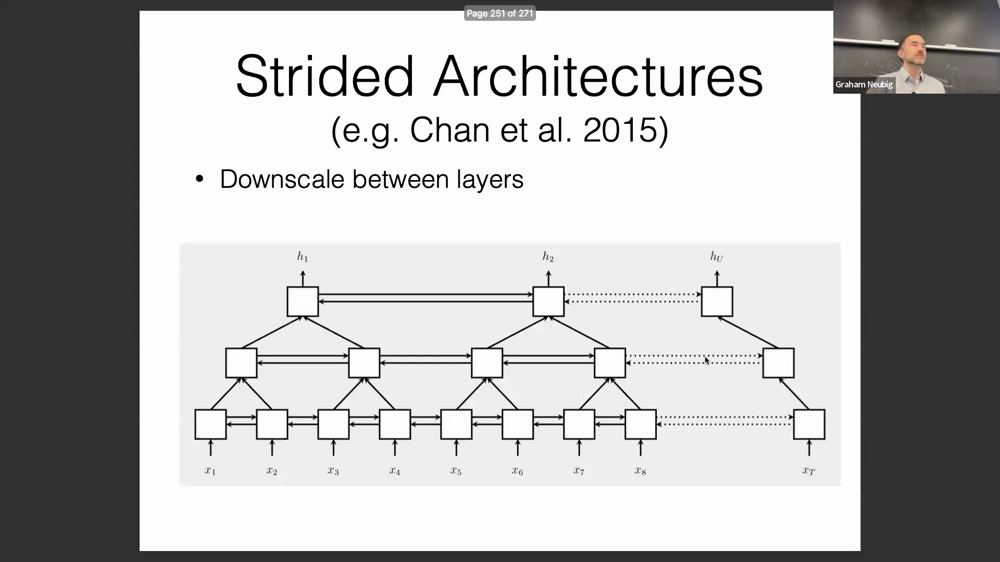
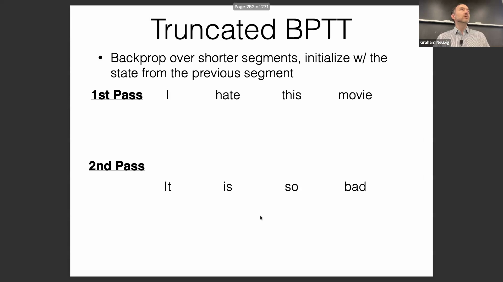
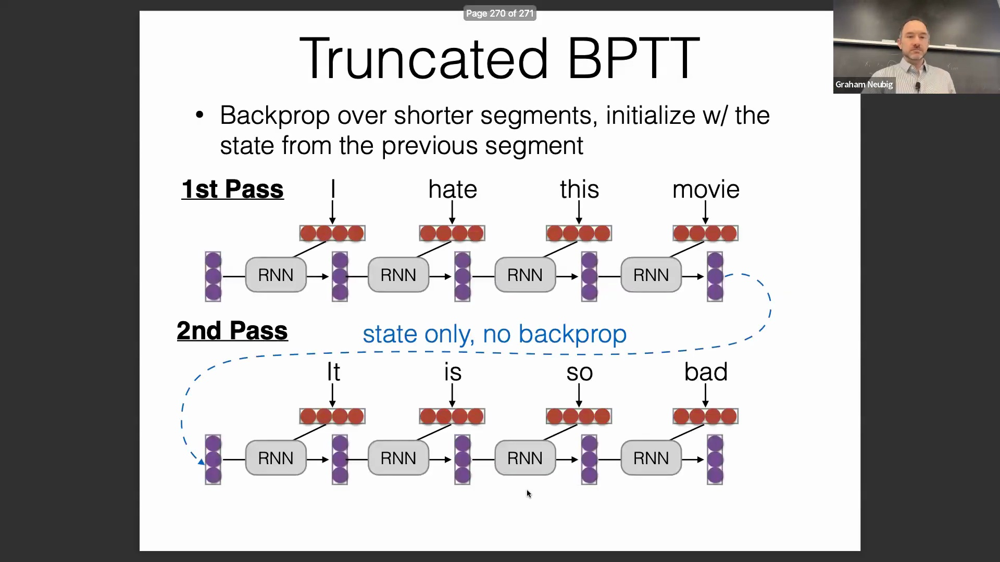

## GPU 显存(GPU Memory)限制与数据随机性考量

当处理每个包含上千个词元(token)的序列时，模型极易耗尽 GPU 显存并导致崩溃。这对于长时间运行的计算任务（如需要通宵运行的批处理作业）尤为棘手，若程序仅运行 15 分钟便崩溃，将带来极大的调试负担。尽管通过合理配置 Fairseq 和 Hugging Face 等现代深度学习工具包可在一定程度上缓解该问题，但它依然是工程实践中不可忽视的关键考量。此外，部分节省显存的优化策略可能会在无意中削弱数据打乱(Shuffling)的随机性。由于随机梯度下降(Stochastic Gradient Descent, SGD)的训练效果高度依赖于数据的随机排列与均匀分布，因此在引入任何可能破坏这种随机性的技术前，都必须进行严谨的评估。

## 用于高效序列处理的跨步架构(Strided Architecture)

跨步架构是处理长序列的另一种高效设计。它们在不同的模型家族中以不同的名称出现：例如金字塔型循环神经网络(Pyramidal RNN)、卷积神经网络(Convolutional Neural Network, CNN)中的跨步卷积(Strided Convolution)以及 Transformer 中的稀疏注意力(Sparse Attention)机制。从根本上说，它们都遵循相同的原理：在多层网络结构中，并非来自上一层的每个输入都会被逐一独立处理。例如，循环神经网络(Recurrent Neural Network, RNN)的第一层可能会按顺序处理所有输入，但后续层则可以对部分输入进行合并或跳过。通过将第一个隐藏状态(Hidden State)映射至输入 1 和 2，将第二个隐藏状态映射至输入 3 和 4，依此类推，模型会在每个处理步骤中逐步缩短序列长度。这种渐进式下采样(Progressive Downsampling)策略对于高效管理超长输入序列、避免计算资源枯竭具有极高的实用价值。

## 截断的随时间反向传播(Truncated Backpropagation Through Time, TBPTT)
截断的随时间反向传播是一项被广泛采用的技术，它在较短且连贯的片段上执行反向传播(Backpropagation)，同时保持状态的连续性。在处理新片段时，模型会使用前一片段的隐藏状态进行初始化，但会主动截断并丢弃早期的计算图(Computational Graph)。尽管模型参数不会依据被丢弃计算图中的损失进行梯度更新，但隐藏状态已成功将上下文信息向前传递。该机制使网络能够充分利用历史上下文，同时避免了维护超长计算图所带来的开销。尽管该技术在 RNN 训练中早已成为标准范式，但它同样被成功应用于现代 Transformer 架构中，包括卡内基梅隆大学(CMU)开发的初代 Transformer-XL 以及近期的 Mistral 模型。这充分印证了该技术在当代自然语言处理(Natural Language Processing, NLP)领域持久的生命力与广泛的适用性。

## 问答：条件预测(Conditional Prediction)与无条件预测(Unconditional Prediction)的术语

在最后的问答环节中，主讲人对条件预测所使用的符号表示进行了澄清。主讲人指出，“源 X 到目标 Y”这一术语很可能是从机器翻译(Machine Translation)的语境中沿用而来的；更准确的通用表述应为“输入 X 到输出 Y”。根据具体任务的不同，它可以表示翻译模型中的源语言和目标语言（例如英语到日语），也可以表示标准语言模型中的提示词(Prompt)及其对应的生成输出。 

相比之下，无条件预测仅涉及直接的语言建模(Language Modeling)，不依赖任何特定的输入提示、条件因素或配对的源-目标结构。会议最后通过阐明这些区别圆满结束，并进一步强调了序列建模(Sequence Modeling)方法在不同网络架构设计和下游任务应用中所展现出的高度灵活性。

