## Transformer 与注意力机制回顾
本次课程重点介绍 Transformer，它是当今大多数现代模型（不仅限于自然语言处理(Natural Language Processing)，还涵盖众多领域）的基础架构。讨论内容将涵盖 Transformer 在 2017 年的原始设计，以及驱动 Llama 等当代语言模型的现代改进版本。在深入新内容之前，有必要快速回顾一下注意力机制(Attention Mechanism)的概念。

注意力机制主要分为两种：交叉注意力(Cross-Attention)和自注意力(Self-Attention)。在交叉注意力中，一个序列作为被关注的键(Keys)，而另一个序列则作为查询(Queries)。相反，自注意力仅涉及单个序列，其中的查询和键对应相同的输入，从而确保序列内部元素相互关注。基于 Transformer 的模型通常单独使用自注意力，或结合使用自注意力与交叉注意力。

## 注意力机制的计算
注意力机制的核心计算涉及将查询向量(Query Vector)与所有键向量(Key Vector)进行比对。对于每一对查询和键，都会计算出一个相似度分数(Similarity Score)。随后，这些分数会通过 Softmax 函数(Softmax Function)进行归一化处理，使其总和为 1，从而形成一个概率分布(Probability Distribution)。

基于这些归一化后的权重，将对应的值向量(Value Vector)进行加权求和，从而为每个查询生成最终的输出向量(Output Vector)。本质上，单个查询向量会生成一个加权后的值向量。

此次回顾为理解 Transformer 的运作机制奠定了基础。

## 范式转变：《Attention is All You Need》
Vaswani 等人于 2017 年发表的开创性论文《Attention is All You Need》提出了一种序列模型(Sequence Model)，该模型能够完全基于注意力机制来生成序列。

该论文的潜力在当时便迅速获得认可，此后已成为现代人工智能(Artificial Intelligence)的基石。在此之前，序列建模(Sequence Modeling)严重依赖于基于循环神经网络(Recurrent Neural Network, RNN)的编码器(Encoder)和解码器(Decoder)，而注意力机制仅作为辅助组件，用于编码器与解码器之间的交叉注意力计算。

Transformer 的关键创新在于彻底摒弃了 RNN 作为主要序列建模组件的地位，完全用自注意力(Self-Attention)取而代之。这一架构转变最初在机器翻译(Machine Translation)任务中取得了优异成果，随后被证明在几乎所有自然语言处理(Natural Language Processing, NLP)任务中都极为高效。

## 计算效率与并行化
除了架构上的优雅之外，Transformer 还具备一个显著的实际优势：速度。其计算主要由高度结构化的矩阵乘法(Matrix Multiplication)构成，这些操作具有极高的并行化(Parallelization)潜力。与受限于序列依赖性(Sequential Dependency)的 RNN 不同（RNN 必须按顺序逐步计算，处理完前一个词元(Token)才能进行下一步），Transformer 能够对整个序列进行并行处理。这种并行化能力无疑是其在该领域迅速普及并广受欢迎的主要驱动力。

## 编码器-解码器架构 vs 仅解码器架构
接下来，讲座将探讨两种主要的 Transformer 架构：编码器-解码器模型(Encoder-Decoder Model)（如 T5 和 BART）以及仅解码器模型(Decoder-Only Model)（如 GPT 和 Llama）。

仅解码器模型仅包含单一的网络层堆叠(Layer Stack)结构，因此在架构上更为简洁。相比之下，编码器-解码器模型则由两个独立的模块组成。两种架构均以输入嵌入(Input Embeddings)和位置编码(Positional Encoding)为起点，随后接入多头注意力模块(Multi-Head Attention Module)和前馈网络(Feed-Forward Network)。多头注意力层负责处理核心的注意力计算，而前馈网络则负责特征的非线性变换与映射。

在编码器-解码器模型中，解码器还额外引入了掩码多头注意力(Masked Multi-Head Attention)（用于确保解码器内部的自回归生成）以及交叉注意力模块，以便与编码器的输出进行交互。

## 应用场景与架构选择
架构的选择通常取决于任务的结构。编码器-解码器模型在输入与输出边界清晰的场景中表现优异，例如文档摘要(Document Summarization)或机器翻译，其中编码器处理源文本，解码器生成目标文本。然而，在对话式人工智能(Conversational AI)或聊天机器人应用中，这种划分往往变得模糊。界定输入上下文(Input Context)的结束位置与模型输出的起始位置并不总是直观的。仅解码器模型通过将整个交互过程视为单一的连续序列来规避这一问题，从而提供了更高的灵活性与便利性。

## 参数效率与模型扩展
仅解码器模型因其结构简洁且单层参数开销(Parameter Overhead)较低而备受青睐，因为它们无需为编码器和交叉注意力配置独立的模块。这种高效性使得研究人员能够在相同的计算预算(Compute Budget)下，通过扩大隐藏层维度或增加网络深度，来有效扩展模型容量(Model Capacity)。针对观众关于不同架构参数量是否相当的提问，研究表明：尽管直接对比的结果因具体实现而异，且如 T5 论文等研究指出编码器-解码器模型在特定结构化任务中可能具备微弱优势，但仅解码器模型凭借其卓越的可扩展性与架构简洁性，已在现代生成式人工智能(Generative AI)应用中占据了绝对主导地位。

---

## 课程目标与概述
讲座首先概述了核心学习目标：全面理解 Transformer 架构(Transformer Architecture)的基本组件，并探讨 Llama 等现代模型如何对原始设计进行改进。

讲师强调，掌握这些基础要素对于理解当代架构调整(Contemporary Architectural Modifications)的动因及其如何提升模型性能至关重要。

## Transformer 的基础组件
在深入探讨具体机制之前，本节列出了 Transformer 的核心构建模块：位置编码(Positional Encoding)、多头注意力(Multi-Head Attention)、掩码注意力(Masked Attention)、残差连接(Residual Connection)和层归一化(Layer Normalization)。

讲座简要回顾了输入数据与嵌入(Embedding)的处理方式，指出基于 Transformer 的模型主要依赖于子词分词(Subword Tokenization)和标准的查找表嵌入(Embedding Lookup)。这种方法已成为行业规范，几乎所有主流的 Transformer 架构都采用了某种形式的子词分词技术。

## 多头注意力的直觉理解
随后，讨论转向了 Transformer 最重要的创新之一：多头注意力(Multi-Head Attention)。

其核心直觉在于，序列的不同片段通常蕴含着针对不同任务或上下文的有用信息。如果仅依赖单个注意力头(Single Attention Head)，模型将被迫对输入中哪些部分需要优先考虑做出硬性取舍，从而可能导致丢失宝贵的上下文信号(Contextual Signal)。

## 句法与语义：对多重上下文的需求
为了阐明这一概念，讲师以单词“run”为例进行了案例分析。该词既可作动词也可作名词，其具体语义会根据上下文发生显著变化（例如，“经营一家企业”与“进行跑步锻炼”，或“程序在内存栈中运行”与“参加马拉松比赛”）。

消除词性歧义(Part-of-Speech Ambiguity)（即句法层面(Syntax)）通常只需考察局部上下文(Local Context)，例如限定词或相邻名词的存在与否。相比之下，确定具体语义往往需要捕捉更长距离的依赖关系(Long-range Dependencies)。多头注意力巧妙地解决了这一问题，它允许模型并行关注局部句法线索和远距离语义关系，而无需强制采用单一且受限的关注焦点。

## 数学公式与架构设计
讲座接着讲解了多头注意力的数学原理与结构机制，并参考了备受推崇的 PyTorch 代码实现资源《The Annotated Transformer》。

该架构设计的一个关键优势在于序列长度的灵活性：虽然键向量(Key Vectors)和值向量(Value Vectors)的数量必须保持一致，但查询向量(Query Vectors)的数量可以有所不同。这种设计天然契合交叉注意力(Cross-Attention)场景或自回归解码步骤，即较短的生成序列能够有效关注较长的编码源序列。

## 权重矩阵、张量运算与实现效率
多头注意力的实际计算始于将输入序列通过三个独立的可学习权重矩阵(Weight Matrices)进行线性投影(Linear Projection)，从而生成查询(Query)、键(Key)和值(Value)表示。

为提升计算效率，现代实现方式与原始论文中逐步计算的公式略有不同。实际架构通常避免在矩阵乘法前对向量进行拆分，而是先执行一次大规模的批量矩阵乘法(Batch Matrix Multiplication)，随后将输出的 3D 张量(Tensor)进行重塑(Reshape)，并通过切分嵌入维度(Embedding Dimension)将其分配至多个注意力头。例如，一个隐藏维度为 4 的张量可被切分为两个维度为 2 的独立注意力头。这种实现策略优先执行大规模、可高度并行化的张量运算，随后再进行维度切分与独立的注意力计算，从而最大化了硬件加速器(Hardware Accelerator)的利用率。

---

## 多头注意力中的高效张量计算
直接在三维张量(3D Tensor)上执行注意力计算，比使用标准循环遍历(Iterative Loop)分割后的组件要高效得多。其核心机制通过计算查询向量(Query Vector)与键向量(Key Vector)的点积得到注意力分数(Attention Scores)，经归一化后与值向量(Value Vector)相乘，再对结果求和，从而生成加权表示(Weighted Representation)。 
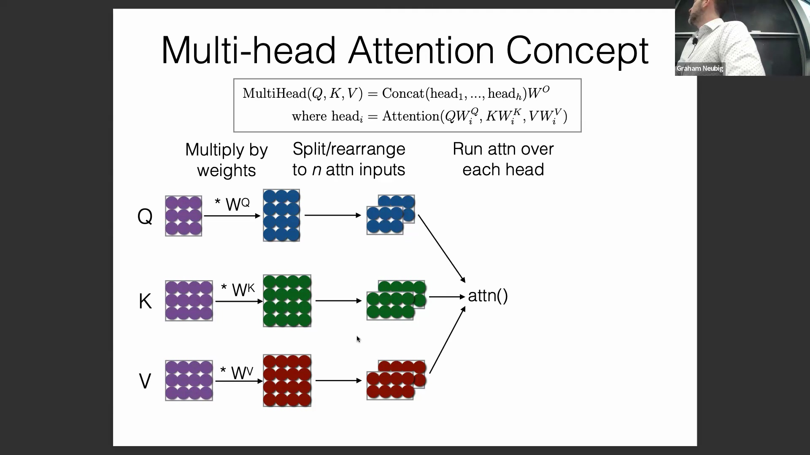
输出表示的序列维度与查询(Query)数量保持一致，因为每个查询位置都会生成独立的上下文表示。随后，这些来自并行注意力头(Attention Head)的输出会被拼接(Concatenated)成一个更大的复合向量。在进入最终的线性投影层(Linear Projection Layer)之前，每个头都会贡献其独特且已学习到的特征表示。

## 实现流程与注意力可视化
实际实现流程首先通过线性投影(Linear Projection)生成查询(Query)、键(Key)和值(Value)矩阵。随后对这些矩阵进行重塑(Reshape)，以分离出指定数量的注意力头(Attention Heads)。 
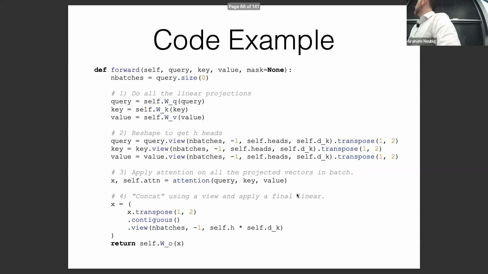
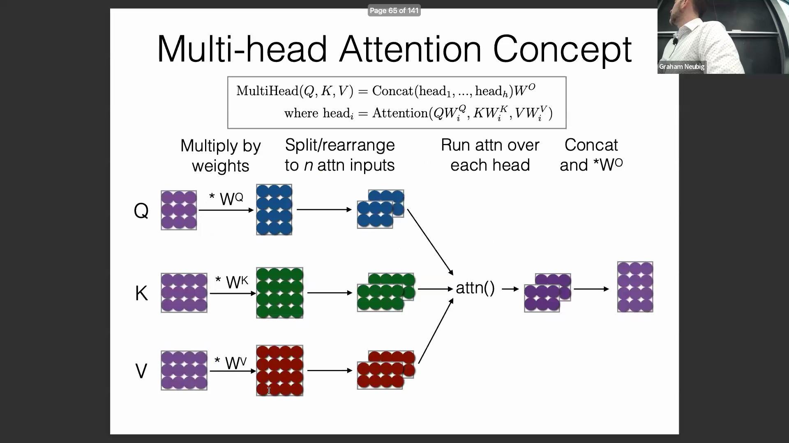
在所有注意力头上并行执行注意力计算后，结果将被拼接(Concatenation)并传入最终的输出线性层(Output Linear Layer)。Vaswani 等人原始论文中的可视化图(Visualization)有效展示了自注意力(Self-Attention)如何消解诸如“making”一词的歧义。 
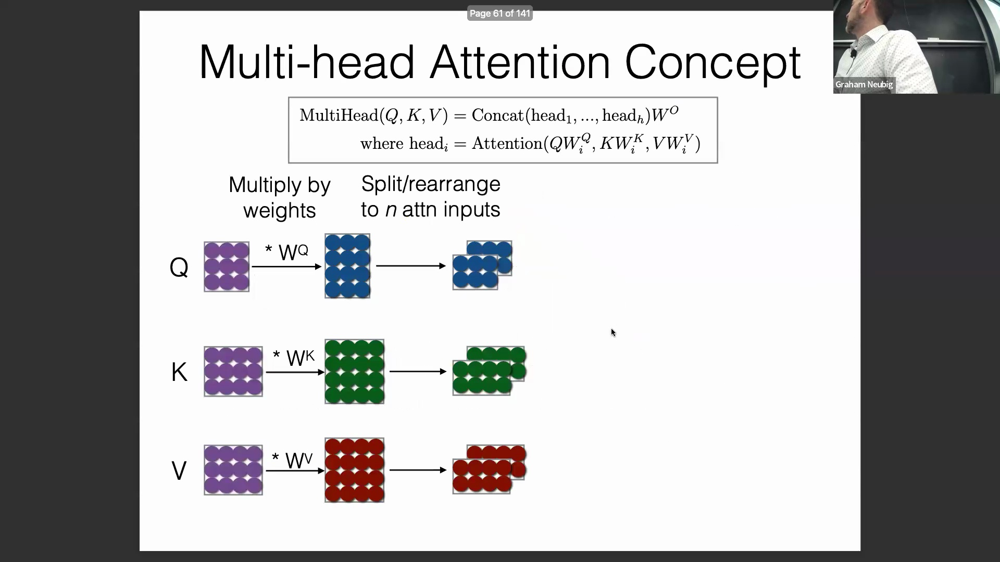
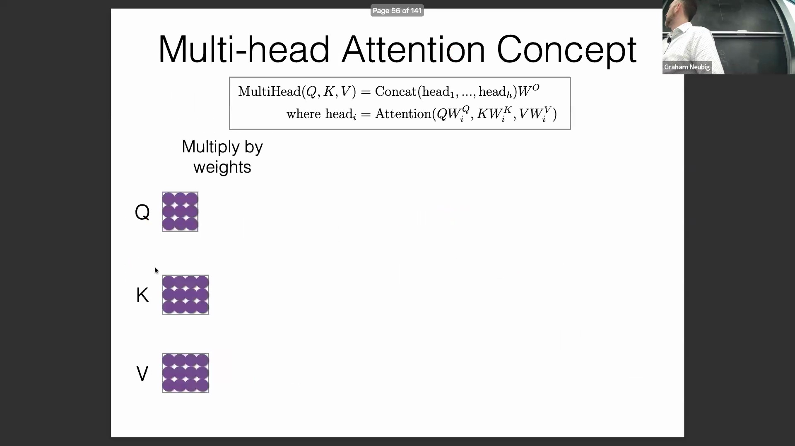
不同的注意力头专注于捕获不同类型的上下文信息：部分头聚焦于远距离的语义线索(Semantic Cues)以区分具体含义（例如，“making something difficult”与“making a cake”），而其他头则关注邻近的句法成分(Syntactic Components)或词元(Token)本身。这种跨头的功能专门化(Functional Specialization)正是多头注意力(Multi-Head Attention)的核心优势。

## 序列长度与注意力头数量约束
一个常见的架构疑问是：当输入序列长度(Input Sequence Length)小于注意力头数量时是否会引发问题。答案是否定的，因为多头分割操作是沿着特征/嵌入维度(Embedding Dimension)进行的，而非沿着序列长度(Sequence Length)维度。 
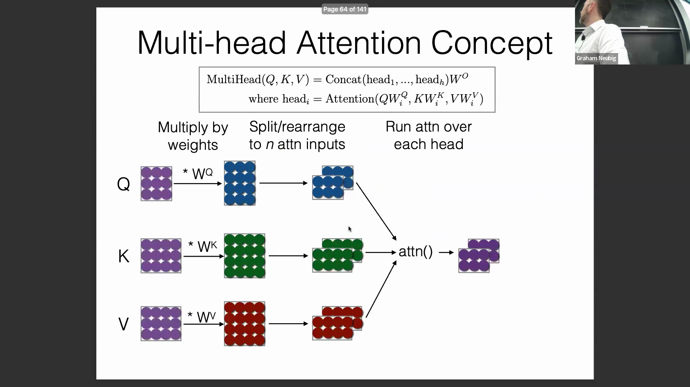
模型设计者通常会确保隐藏维度(Hidden Dimension)的大小（如 512、768）能被注意力头数量（如 8）整除，从而保证无论输入序列长短，都能实现规整的维度划分。尽管历史上曾提出过细粒度注意力(Fine-grained Attention)等变体（即为每个嵌入维度分配独立的注意力头），但因计算开销(Computational Overhead)过大而被广泛弃用。

## 掩码注意力与架构演进
注意力掩码机制(Attention Masking)的发展深刻影响了现代模型的设计。早期的注意力模型曾尝试将双向循环神经网络(Bi-directional RNN)与因果注意力(Causal Attention)相结合。掩码注意力(Masked Attention)在原始 Transformer 论文中被正式引入并标准化，最初仅应用于解码器(Decoder)内部。 
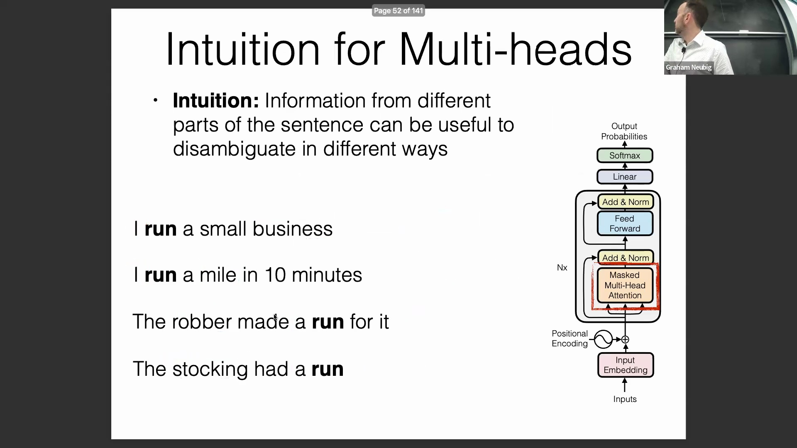
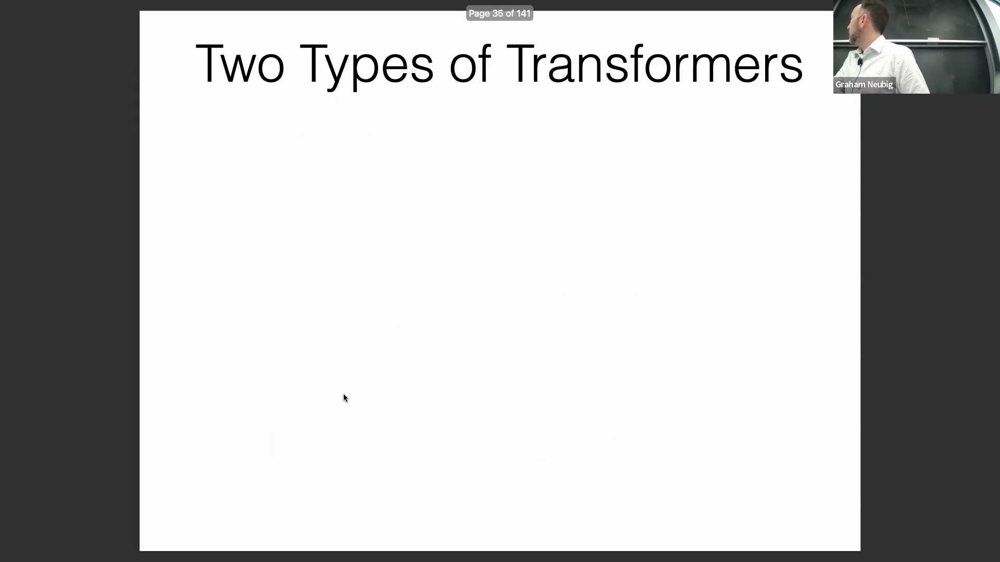
GPT 等仅解码器架构(Decoder-Only Architecture)在自回归生成(Autoregressive Generation)过程中利用该掩码机制，以防止当前词元(Token)关注到未来的位置（即防止信息泄露）。 
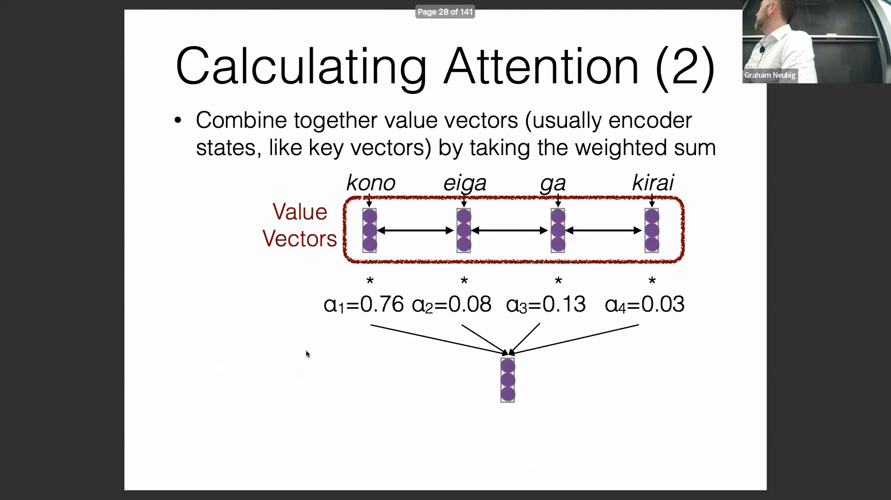
相比之下，编码器-解码器架构(Encoder-Decoder Architecture)在输入序列处理上保留了双向注意力(Bi-directional Attention)。一种被称为前缀语言建模(Prefix Language Modeling)的混合训练策略，曾尝试通过结合掩码与非掩码注意力阶段来训练仅解码器架构以提升性能，但其引入的额外复杂性限制了该方法的广泛采用。
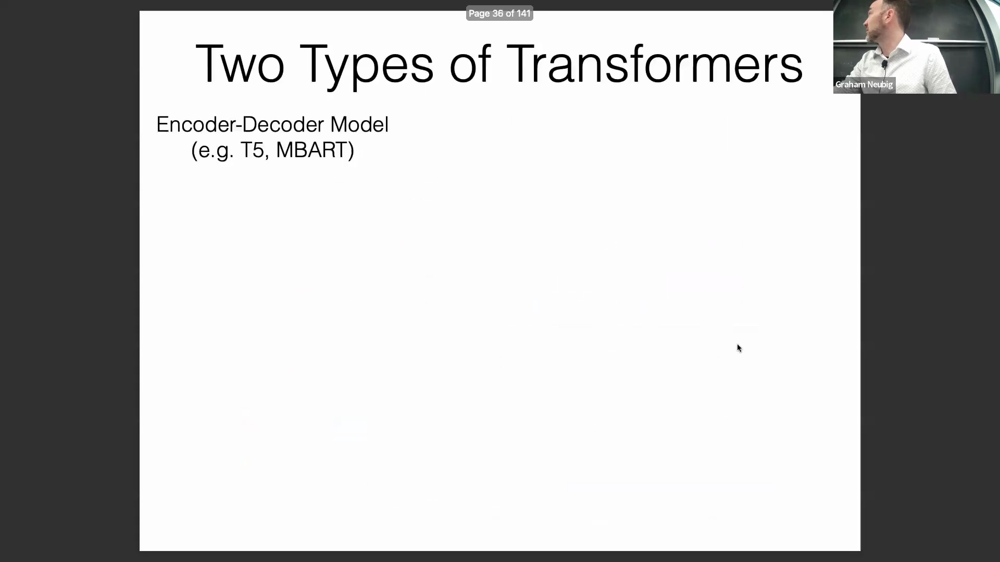
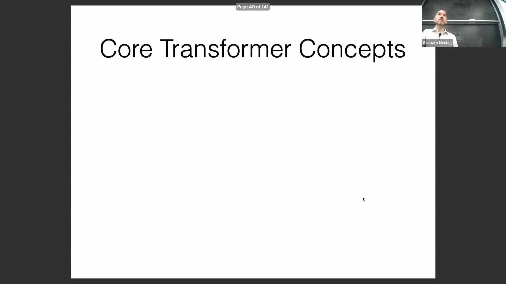
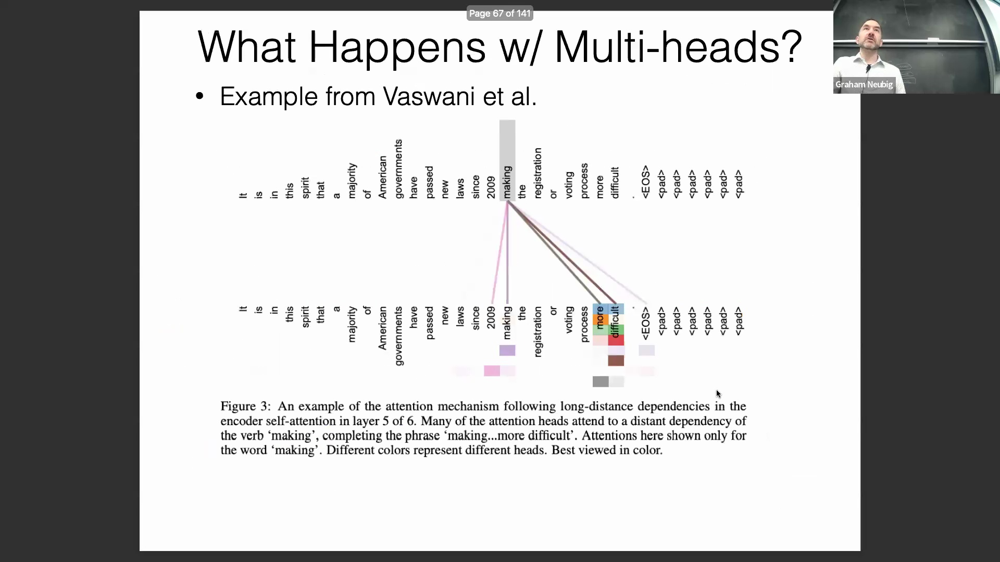

## 可扩展性与序列无关处理
注意力机制(Attention Mechanism)的根本优势在于其数学上的一致性：无论输入序列长度(Input Sequence Length)如何变化，它都执行完全相同的权重计算与特征变换。 
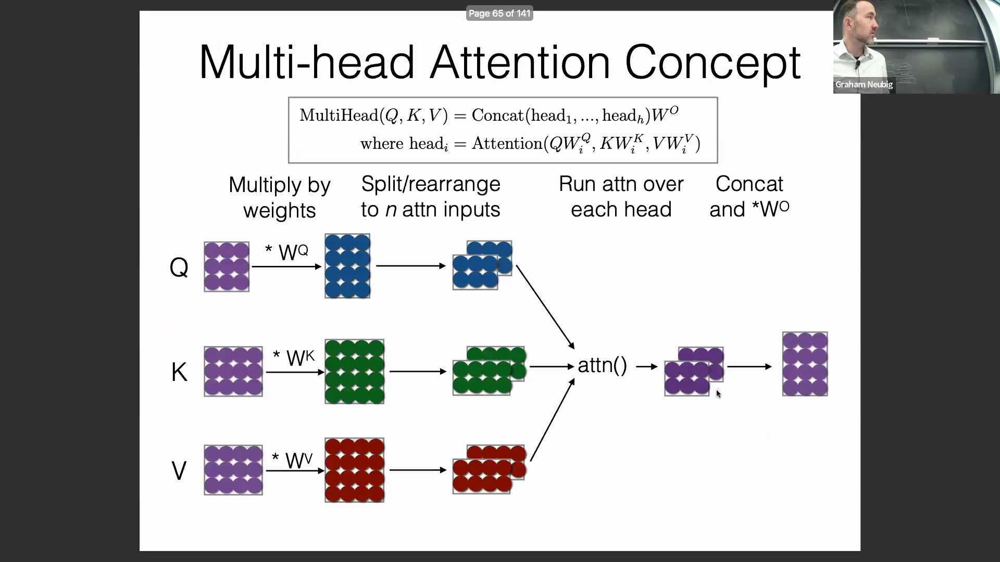
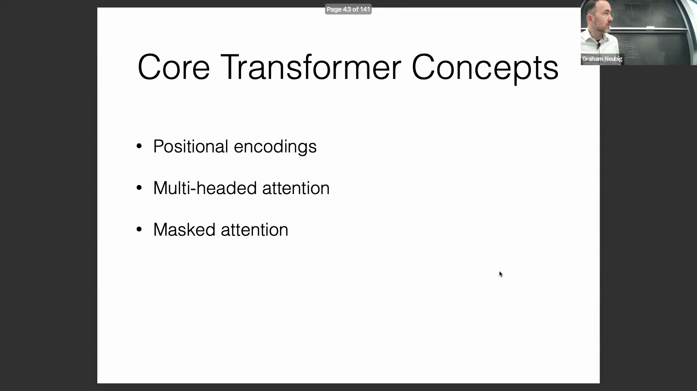
这种统一性使得 Transformer 能够灵活地泛化(Generalize)至任意长度的序列。早期试图通过将句子切分为固定块(Fixed Chunks)或等分段落来处理可变长度输入的方法被证明十分脆弱且难以扩展，而注意力机制固有的长度无关特性(Length-Agnostic Property)则为不同尺寸的序列提供了稳健且一致的性能表现。
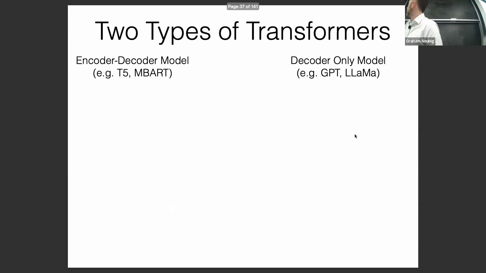
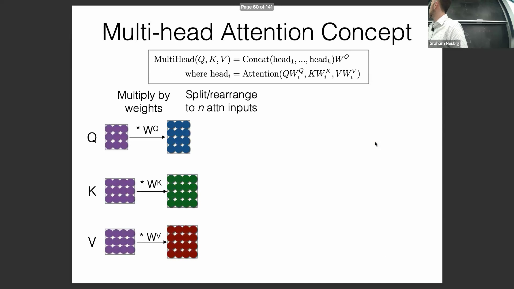

## 位置编码的整合
由于 Transformer 完全依赖注意力机制(Attention Mechanism)，且缺乏循环神经网络(RNN)或卷积结构的归纳偏置(Inductive Bias)，因此其架构本身不具备对词元顺序(Token Order)的感知能力。 
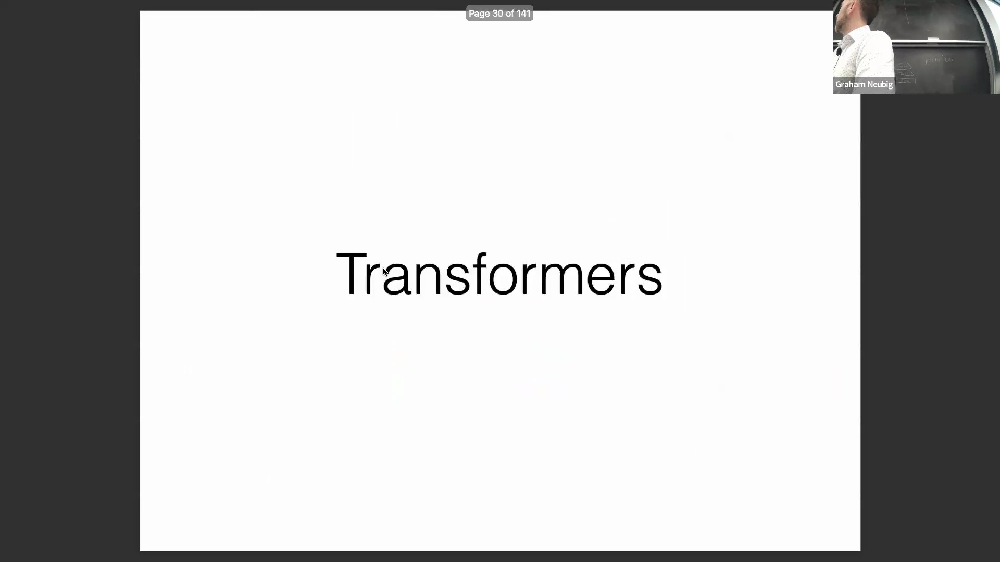
为解决这一问题，在进入注意力层之前，位置编码(Positional Encoding)会以逐元素相加(Element-wise Addition)的方式与输入嵌入(Input Embeddings)进行融合。 
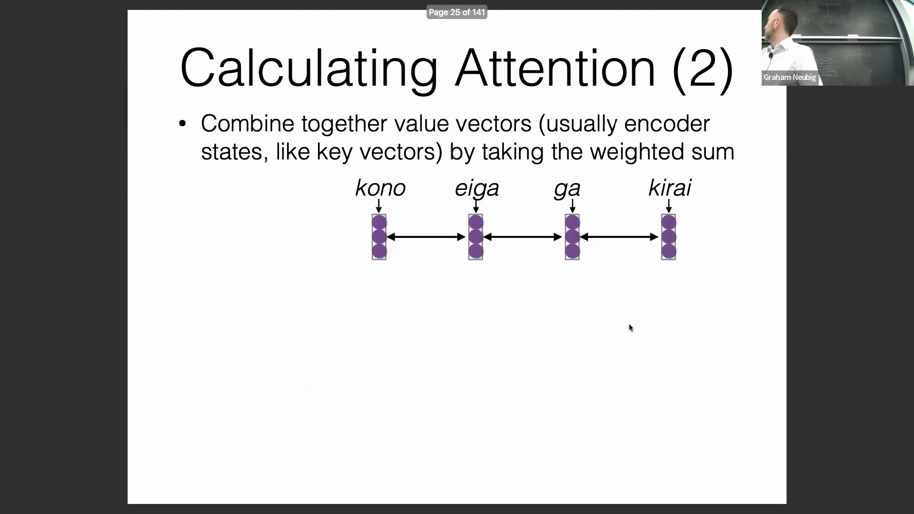
若缺乏这些编码，模型会将相同词汇但语序不同的句子视为无法区分的词袋(Bag-of-Words)表示，因为标准的注意力机制本质上具有排列不变性(Permutation Invariance)。 
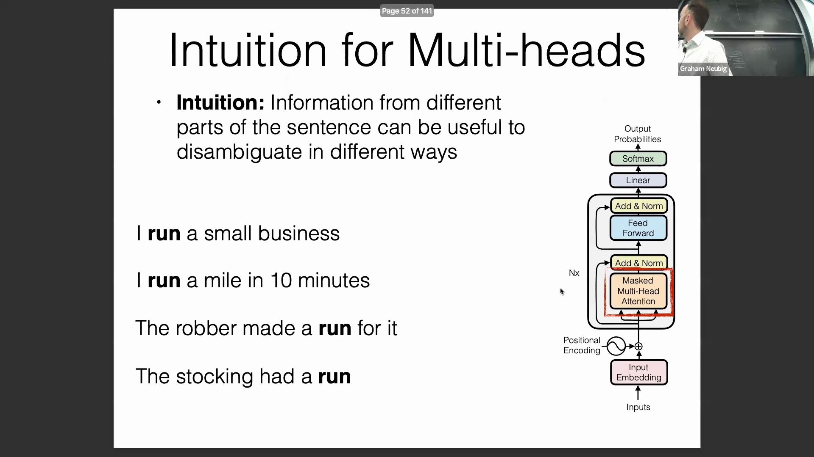
位置编码为模型注入了必要的序列结构信息，使其能够有效捕获句法关系(Syntactic Relationships)与词序(Word Order)。

---

## 位置信息的必要性
注意力机制(Attention Mechanism)本质上具有排列不变性(Permutation Invariance)，这意味着无论相同的词元(Token)出现在序列的哪个位置，它们都会获得相同的注意力权重(Attention Weights)。这带来了重大挑战，因为句法规则(Syntax Rules)和上下文语义(Contextual Semantics)高度依赖于词序(Word Order)和局部连贯性(Local Coherence)。尽管循环神经网络(Recurrent Neural Network, RNN)通过逐步处理词元天然地编码了序列位置(Sequence Position)，但 Transformer 为了最大化并行计算(Parallel Computation)能力而特意摒弃了循环结构。

为了在不退回到串行序列处理(Sequential Processing)的情况下解决这一问题，Transformer 在输入嵌入(Input Embeddings)进入注意力层之前，直接将显式的位置信息(Explicit Positional Information)注入其中。

## 正弦位置编码
2017 年原始的 Transformer 论文通过引入确定性的正弦位置编码(Sinusoidal Positional Encoding)解决了这一问题。该编码为序列中的每个位置生成一个向量，利用交替的正弦函数(对应偶数维度)和余弦函数(对应奇数维度)，并依据位置索引(Position Index)和频率参数(Frequency Parameter)进行缩放。

尽管原始论文仅简要论证了该设计，但后续分析揭示了其内在的数学优雅性。当计算这些位置向量的点积(Dot Product)时，物理位置更接近的词元会产生更高的相似度分数(Similarity Score)。

这在网络的初始层中天然地促使注意力机制偏向局部上下文(Local Context)，而捕捉邻近的句法关系(Syntax Relations)在浅层网络中最为关键。随着数据流经更深的网络层(Network Layer)和残差连接(Residual Connection)，这些初始位置信号(Positional Signals)得以保留，并逐渐融合到更全局的语义表示(Semantic Representation)中。

## 可学习位置编码
一种更为直接的替代方案是可学习位置编码(Learnable Positional Encoding)，其中位置向量被视为可训练参数(Trainable Parameters)，其性质类似于标准的词嵌入(Word Embedding)。模型会在训练过程中自动学习出能够最小化损失函数(Loss Function)的最优位置表示。

尽管该方案高度灵活且易于实现，但存在一个根本性局限：无法外推(Extrapolate)至训练期间未见过的更长序列。由于模型仅学习了固定位置索引的查找表(Lookup Table)，当遇到更长序列时，模型不得不处理分布外(Out-of-Distribution, OOD)的位置索引，这通常会导致性能显著下降。理论上，正弦编码通过连续的数学函数避免了截断问题，但在实际应用中，即使是具备理论外推能力的编码方案，在面对显著增长的上下文长度(Extended Context Length)时，性能仍往往会出现衰减。

## 绝对位置编码与相对位置编码
位置编码(Positional Encoding)策略大致可分为绝对位置编码(Absolute Positional Encoding)与相对位置编码(Relative Positional Encoding)。绝对编码为每个位置索引独立分配一个固定向量，不显式建模查询(Query)与键(Key)之间的距离。相对位置编码则直接将词元之间的相对偏移量(Relative Offset)纳入注意力计算(Attention Computation)中。

早期的相对位置编码实现会为每个可能的相对距离（例如 -128 到 +128）学习一个标量偏置(Scalar Bias)，并将超出该范围的距离进行截断(Clipping)，统一映射至一个共享的嵌入向量。

然而，该方法引入了额外的可学习参数，并且需要在注意力计算中执行计算成本高昂的偏置加法(Bias Addition)操作，因此在模型大规模扩展与部署时效率较低。

## 旋转位置编码（RoPE）
为兼顾绝对位置编码与相对位置编码的优势，研究人员提出了旋转位置编码(Rotary Positional Embedding, RoPE)。RoPE 通过根据绝对位置对查询(Query)和键(Key)向量施加旋转变换(Rotation Transformation)，巧妙地弥合了两者之间的差距。

RoPE 的核心数学特性在于：当旋转后的查询与键向量进行点积运算时，其结果仅取决于原始特征表示(Feature Representation)及其相对距离(Relative Distance)，而完全独立于它们的绝对索引(Absolute Index)。这一特性使得模型既能保留绝对编码的简洁性与外推能力，又能有效捕获相对编码的距离感知(Distance-Aware)优势，从而使其成为现代 Transformer 架构中广泛采用的标准组件。

---

## 旋转位置编码（RoPE）与相对定位
设计相对位置编码(Relative Positional Encoding)的核心挑战在于彻底摒弃绝对位置信息(Absolute Positional Information)，确保模型仅依赖于词元(Token)之间的距离。这一约束对于模型稳健地外推(Extrapolate)至训练期间未见过的序列长度(Sequence Length)至关重要。其解决方案涉及运用基于三角函数(Trigonometric Functions)和复数(Complex Numbers)的数学公式。通过对查询(Query)和键(Key)向量应用旋转变换(Rotation Transformation)（该变换融入了按位置索引(Position Index)缩放的余弦和正弦函数），模型能够计算出仅依赖于相对距离(Relative Distance)的注意力分数(Attention Scores)。

这种被称为旋转位置编码(Rotary Positional Embedding, RoPE)的机制有效保障了模型强大的外推性能(Extrapolation Performance)，因为它消除了可能导致模型过拟合(Overfit)于训练序列长度的绝对位置偏差(Absolute Positional Bias)。RoPE 现已成为 Llama 等现代架构中的标准组件，显著提升了模型处理长上下文(Long Context)任务的能力。

## 外推能力与序列敏感性
一个常见的疑问是：RoPE 是否会对序列开头或结尾的词元(Token)表现出更高的敏感性。从数学角度看，其旋转模式(Rotational Pattern)具有周期性重复(Periodicity)的特征，这意味着序列首尾的词元会表现出相似的旋转变换特性。

与绝对位置编码(Absolute Positional Encoding)不同（后者容易过拟合(Overfit)于特定的索引范围，且在输入序列超出训练长度时性能往往急剧下降），RoPE 没有固有的最大上下文窗口(Context Window)限制。由于它利用连续的数学函数(Continuous Mathematical Functions)动态计算位置信息，理论上具备向任意长序列外推(Extrapolate)的潜力。在实际应用中，采用 RoPE 的模型在长上下文(Long Context)任务上的泛化能力(Generalization Ability)显著优于依赖可学习绝对嵌入(Learnable Absolute Embeddings)的模型，因为后者在面对未见过的位置索引时缺乏有效的先验知识。

这种数学上的灵活性使 RoPE 成为关键的架构设计(Architectural Design)选择，尤其适用于需要稳健处理可变及扩展上下文窗口(Extended Context Window)的任务。

## 训练稳定性：层归一化与残差连接
随着 Transformer 模型通过堆叠多层(Network Layer Stacking)而不断加深，它们面临着与早期循环神经网络(Recurrent Neural Network, RNN)相似的梯度消失(Vanishing Gradient)和梯度爆炸(Exploding Gradient)问题。为缓解这一难题，现代架构高度依赖残差连接(Residual Connection)与层归一化(Layer Normalization)。残差连接主要确保梯度能在网络中顺畅地进行反向传播(Backpropagation)，而层归一化则主要致力于抑制梯度爆炸并稳定网络输出。

层归一化(Layer Normalization)对每个独立样本的特征向量内的激活值(Activations)进行标准化处理。该过程首先计算输入向量所有元素的均值(Mean)和标准差(Standard Deviation)，随后将数值缩放至零均值(Zero Mean)和单位方差(Unit Variance)的标准正态分布。

关键之处在于，标准化并非终点：归一化后的数值会进一步通过一个可学习的增益(Gain/Scale)参数进行缩放，并通过一个可学习的偏置(Bias/Shift)参数进行平移。这一机制在确保激活值被约束在可预测的稳定范围内以防范梯度爆炸(Exploding Gradients)的同时，赋予了模型灵活调整特征分布尺度与中心位置的自由度。

通过将网络输出一致地映射到表示空间(Representation Space)的受控区域内，层归一化显著提升了深层 Transformer 堆叠(Deep Transformer Stack)的训练稳定性(Training Stability)。

## 层归一化与批归一化的区别
必须将层归一化(Layer Normalization)与在计算机视觉(Computer Vision)领域广泛应用的批归一化(Batch Normalization)严格区分。批归一化是针对整个小批量(Mini-batch)数据的统计量(Statistics)进行归一化，这使其性能高度依赖于批次大小(Batch Size)，且难以适配可变长度的序列。相比之下，层归一化严格针对每个独立样本(Independent Sample)的特征向量内部计算统计量。这种对批次动态(Batch Dynamics)的独立性，使得层归一化在处理文本等序列数据(Sequential Data)时更为稳健高效，因为此类数据的序列长度(Sequence Length)与批次构成往往存在显著差异。

---

## 批归一化与层归一化
本部分首先对比了批归一化(Batch Normalization)与层归一化(Layer Normalization)。历史上，批归一化在序列模型中存在局限性，因为其统计量计算依赖于整个小批量(Mini-batch)。这会导致训练与推理阶段产生显著的不匹配，因为在推理时无法获取批次数据，或批次统计量不一致，迫使模型必须依赖滑动平均值(Running Average)。 

相比之下，层归一化(Layer Normalization)严格作用于当前独立样本。由于它对每个特征向量进行独立归一化，因此无论批次大小(Batch Size)或批次组成如何，输出都能保持稳定一致，这使其极适合处理可变长度序列(Variable-length Sequences)。

## RMSNorm：一种精简的替代方案
为提升计算效率(Computational Efficiency)，Llama 等现代架构广泛采用了 RMSNorm(Root Mean Square Layer Normalization)。RMSNorm 通过完全移除均值减法(Mean Subtraction)和可学习偏置项(Learnable Bias)，简化了标准层归一化(Standard LayerNorm)的计算公式，仅保留基于均方根(Root Mean Square, RMS)的缩放操作。 

RMSNorm 不再强制将特征分布中心化至零，而是直接在保留向量在表示空间(Representation Space)中原始方向的同时，仅对其幅值(Magnitude)进行缩放调节。 

尽管其在下游任务中的实际性能与标准层归一化相当，但 RMSNorm 显著降低了计算开销(Computational Overhead)与参数量(Parameter Count)，已成为当代大语言模型(Large Language Models, LLMs)中极为高效的标准化组件。

## 残差连接与注意力动态
残差连接(Residual Connection)是构建深层 Transformer(Deep Transformer)的基石，它在子层(Sub-layer)的输入与输出之间提供了一条直接的恒等映射通路(Identity Mapping Pathway)。这种架构设计不仅有效缓解了梯度消失(Vanishing Gradient)问题，还将网络的学习目标从预测绝对输出(Absolute Output)转变为预测残差增量(Residual Increment)。

关键在于，残差连接从根本上重塑了注意力头(Attention Head)的行为模式。由于原始输入向量被完整保留并通过残差通路直接叠加，注意力机制(Attention Mechanism)无需再耗费容量去关注词元(Token)自身。相反，各个注意力头可专注于从周围词元中提取上下文信息(Contextual Information)。这解释了注意力可视化(Attention Visualization)中的一个常见规律：通常仅有一个头会高度关注词元自身，而其余的头则专门负责从序列的其他位置捕获多样化的上下文线索。

## 预归一化与后归一化
归一化层(Normalization Layer)在残差通路中的放置位置对训练稳定性(Training Stability)至关重要。原始 Transformer 架构采用后归一化(Post-Normalization)，即在注意力模块和前馈子层*之后*应用层归一化(LayerNorm)。然而，将非线性的归一化操作直接置于残差求和之后会破坏梯度的平滑流动，极易在极深网络(Very Deep Networks)中阻碍反向传播(Backpropagation)。

现代实现已全面转向预归一化(Pre-Normalization)，即在注意力层和前馈网络*之前*应用归一化操作。这种架构调整为信号从网络底层传递至顶层构建了一条直接且无中断的残差高速通路(Highway)。通过确保残差相加路径不受非线性缩放函数的干扰，梯度得以沿近似恒等映射(Identity Mapping)的连接顺畅反向传播，从而显著提升了模型的整体训练稳定性与收敛速度(Convergence Rate)。

## 前馈网络与特征提取
在每个注意力块(Attention Block)之后，Transformer 会应用逐位置前馈网络(Position-wise Feed-Forward Network, FFN)来进一步处理与重组已聚合的特征。该网络独立作用于序列中每个词元的向量，使模型能够提取并组合复杂的非线性特征(Non-linear Features)。

标准的 FFN 通常先将输入向量通过线性投影(Linear Projection)映射至一个维度显著更高的中间隐藏空间(Intermediate Hidden Space)，随后再投影回原始维度。这种升维扩展(Expansion)操作构建了一个高容量的特征空间，其中的单个神经元(Neuron)往往对应特定的语言学特征或事实性知识概念。因此，FFN 的激活模式(Activation Patterns)在模型可解释性研究(Model Interpretability)中备受重视，因为它们常被用于定位模型记忆事实或编码语义知识(Semantic Knowledge)的区域。为简化计算并降低潜在的数值不稳定性，现代架构设计通常会在这些线性层中移除偏置项(Bias Terms)。

## Transformer 中的激活函数
本部分最后探讨了前馈网络中使用的非线性激活函数(Non-linear Activation Function)。2017 年原始 Transformer 架构采用了线性整流单元(Rectified Linear Unit, ReLU)，其数学表达式为 `max(0, x)`。 

尽管 ReLU 成功引入了深度学习所必需的非线性变换能力，但后续研究与现代架构普遍探索了更平滑的替代激活函数，旨在进一步优化梯度流(Gradient Flow)与模型在大规模扩展下的性能表现。

---

## 激活函数：从 ReLU 到 Swish/SiLU
讲座首先探讨了 Transformer 前馈网络(Feed-Forward Network)中使用的激活函数(Activation Function)。原始 Transformer 架构采用了线性整流单元(Rectified Linear Unit, ReLU)，其数学定义为 `max(0, x)`。 
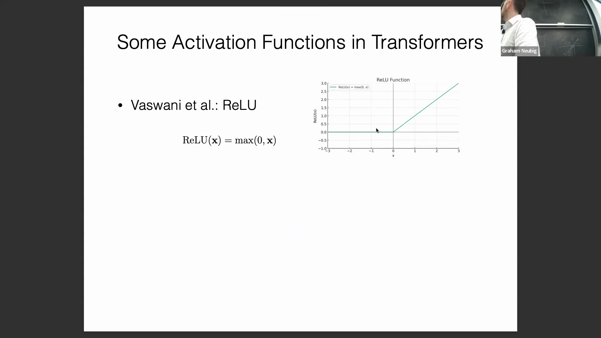
尽管计算效率(Computational Efficiency)较高，但 ReLU 存在一个显著缺陷：它对所有负输入均输出零梯度(Zero Gradient)，这可能导致优化停滞并引发神经元“死亡”(Dying Neuron)现象。为解决该问题，Llama 等现代架构广泛采用了 Swish 或 SiLU(Sigmoid Linear Unit) 激活函数。 
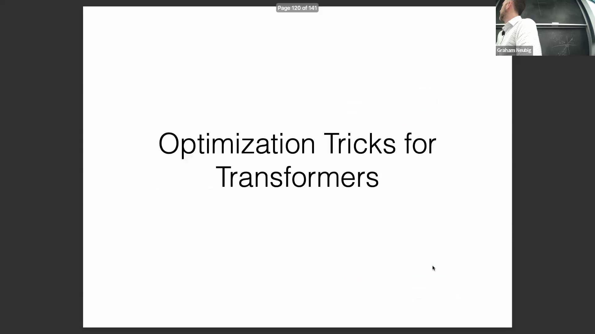
Swish/SiLU 的数学表达式为 `x * sigmoid(βx)`（通常设 `β=1`）。在正值区间，其行为与 ReLU 高度相似；但在负值区间，它能保持平滑且非零的梯度(Smooth Non-zero Gradient)。这种柔和的曲率(Curvature)特性为反向传播提供了有益的“推力”，有效缓解了梯度消失、防止神经元死亡，并在实践中显著提升了大规模模型(Large-scale Models)的训练稳定性。

## 优化 Transformer 的固有挑战
尽管 Transformer 表征能力强大，但其优化过程(Optimization Process)众所周知地极不稳定且难以驾驭，尤其是在模型参数量(Parameters)膨胀至数千亿级别时。讲师引用了 Meta 公开的 1750 亿参数 OPT 模型训练日志(Training Logs)，将其作为剖析真实世界深度学习工程挑战的典型案例。 
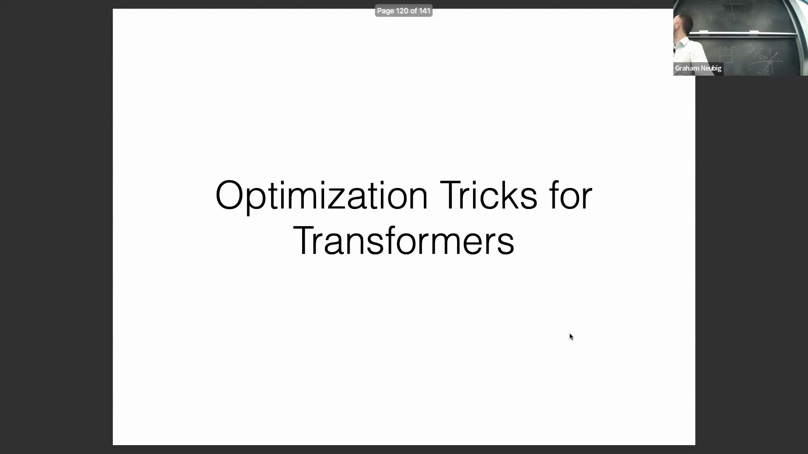
即便拥有顶尖的工程团队，大模型训练(Large Model Training)仍频繁遭遇硬件故障(Hardware Failures)、损失函数突然发散(Loss Divergence)以及需要手动回滚检查点(Manual Checkpoint Rollback)等状况。深刻认识到优化不稳定性是超大规模训练生命周期中的常态而非偶然故障，凸显了部署稳健优化策略(Robust Optimization Strategies)与实施主动监控机制(Proactive Monitoring)的必要性。

## 学习率调度与 AdamW 优化器
早期 Transformer 训练主要依赖随机梯度下降(Stochastic Gradient Descent, SGD)或标准 Adam 等优化器(Optimizer)，并辅以精细调参的学习率调度策略(Learning Rate Scheduling)。2017 年的原始论文引入了线性预热(Linear Warmup)阶段（例如 4000 步），随后进行衰减(Decay)，以确保模型平稳度过早期的训练动态(Training Dynamics)阶段。 
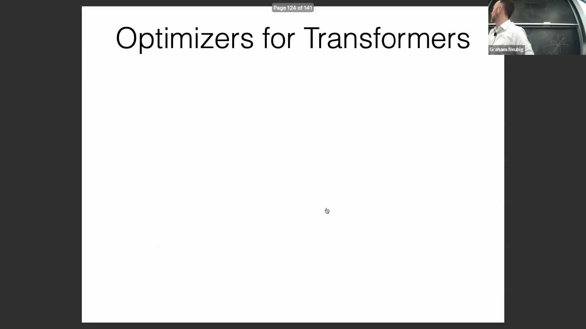
尽管现代预归一化(Pre-Normalization)架构在一定程度上降低了对激进学习率预热(Aggressive Learning Rate Warmup)的依赖，但采用预热机制仍被业界视为训练最佳实践(Training Best Practice)。近年来，AdamW 优化器在很大程度上已取代标准 Adam，成为 Transformer 训练的主流选择。 
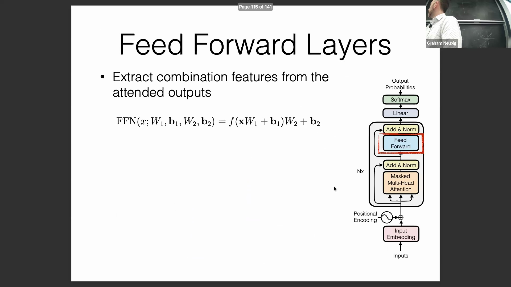
AdamW 的核心改进在于将权重衰减(Weight Decay)与梯度更新(Gradient Update)过程解耦(Decoupled)，使其作为独立的 L2 正则化项(L2 Regularization Term)直接作用于权重，从而避免了标准 Adam 中动量(Momentum)与自适应学习率(Adaptive Learning Rate)对正则化效果的干扰。这一数学修正显著增强了模型的泛化能力(Generalization Ability)，有效防止了权重数值异常膨胀，并大幅缓解了大规模训练中的过拟合(Overfitting)问题。

## 低精度训练：FP16 与 BF16
使用完整的 32 位浮点数(FP32)训练超大规模模型在计算算力(Compute Power)与显存占用(Memory Footprint)上均难以承受，这使得 16 位精度训练(16-bit Precision Training)成为现代深度学习工作流(Deep Learning Workflow)的标准配置。标准的半精度浮点数(FP16)仅分配 5 位给指数(Exponent)部分、10 位给尾数(Mantissa)部分，这严重限制了其动态范围(Dynamic Range)，导致模型在处理极端梯度值(Extreme Gradient Values)时容易出现数值溢出或下溢。 
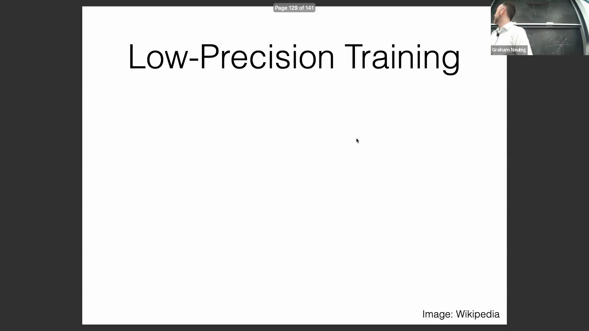
为突破这一瓶颈，Google Brain 研发了 BF16(Brain Floating Point 16) 格式。BF16 重新分配了位宽(Bit-width)，采用 8 位指数与 7 位尾数的组合。 
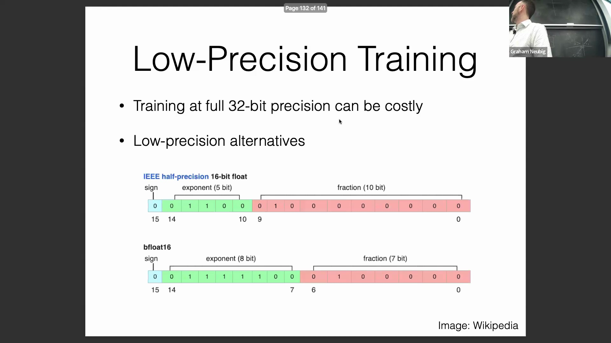
该设计以轻微牺牲尾数精度(Precision)为代价，大幅扩展了可表示的数值范围(Numeric Range)，使其动态范围与 FP32 完全对齐。BF16 能够更稳健地处理梯度尖峰(Gradient Spikes)与微小权重更新(Weight Updates)，从而提供卓越的训练稳定性(Training Stability)，现已成为现代 GPU 加速训练(GPU-accelerated Training)工作流中强烈推荐的行业标准。

## 监控梯度范数与训练恢复
即便采用了最优的架构设计、优化器(Optimizer)与数据精度格式(Data Precision Format)，模型训练仍可能意外发散(Training Divergence)。一项至关重要的诊断工具是在训练全周期持续监控梯度范数(Gradient Norm)。 

正如 Meta 的 OPT 模型训练日志(Training Logs)所示，梯度范数的突然急剧飙升(Spike)通常是优化过程即将陷入不稳定(Instability)的早期预警信号。 
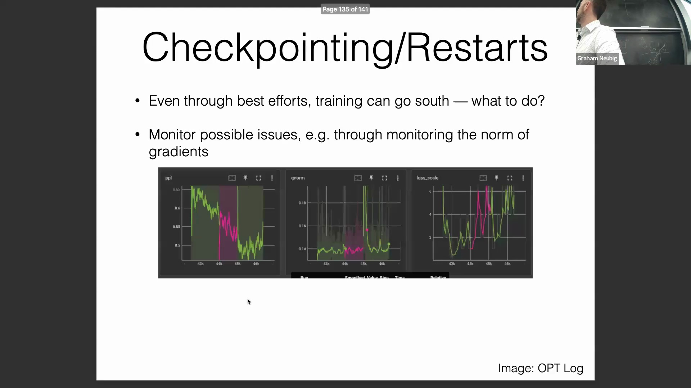
尽管在出现梯度尖峰后，损失函数(Loss Function)可能短暂地继续下降，但模型参数实际上已滑入退化的参数空间(Degraded Parameter Space)，且无法依靠自身优化轨迹恢复。标准的故障恢复流程(Fault Recovery Pipeline)通常包括：回滚(Rollback)至尖峰发生前保存的模型检查点(Model Checkpoint)，跳过或重新采样部分训练数据(Training Data)，随后恢复训练。这一操作为后续的梯度更新注入了有益的随机扰动(Stochastic Perturbation)，通常能在避免从头训练(Training from Scratch)的前提下重新稳定训练轨迹(Training Trajectory)。尽管现代自动化训练平台(Automated Training Platforms)已能越来越多地自动执行此类回滚与恢复逻辑，但开发人员仍须严格审查底层代码实现，以从根本上排查并修复潜在的工程缺陷(Engineering Bugs)。

---

## 诊断训练不稳定与梯度尖峰
训练过程中频繁出现的梯度尖峰(Gradient Spikes)往往并非随机现象；它们通常预示着底层存在数值不稳定(Numerical Instability)或代码实现层面的缺陷。例如，对趋近于零的数值应用对数函数(Logarithmic Function)可能会引发数值极大甚至趋近无穷大的梯度。确保代码具备鲁棒性(Robust)、经过充分测试且避免危险的数值操作(Numerically Unsafe Operations)，并结合适当调整的学习率(Learning Rate)，可大幅降低此类异常的发生频率。当梯度尖峰持续出现时，这是一个明确的警告信号，表明必须仔细审查模型实现代码并优化计算图(Computational Graph)的稳定性。

## 实践调试经验的作用
深度学习优化(Deep Learning Optimization)的很大一部分工作依赖于通过动手实验(Hands-on Experimentation)与故障排除(Troubleshooting)所积累的“实战经验(Empirical Knowledge)”。当遭遇持续的训练瓶颈(Training Bottlenecks)时，强烈建议向讲师、助教(Teaching Assistants)或经验丰富的同行寻求指导。在夯实这些基础调试原则(Debugging Principles)之后，接下来的讨论将转向对 Transformer 架构历史演进(Architectural Evolution)的关键对比。

## 核心架构分歧：原始与现代 Transformer
尽管 Llama 等现代大语言模型(Large Language Models, LLMs)仍遵循 Vaswani 等人奠定的基础 Transformer 范式(Transformer Paradigm)，但它们已融入了多项关键的架构演进(Architectural Shifts)。2017 年的原始设计高度依赖后归一化(Post-Normalization)，而现代架构已广泛采用预归一化(Pre-Normalization)予以替代，以确保梯度(Gradients)在深层残差通路(Deep Residual Pathways)中更顺畅地反向传播。此外，标准的层归一化(Layer Normalization)在很大程度上已被均方根归一化(RMSNorm)取代；后者移除了均值中心化(Mean Centering)步骤，在维持训练稳定性的同时显著提升了计算效率(Computational Efficiency)。

## 激活函数与位置编码的升级
除归一化技术外，非线性激活函数(Non-linear Activation Functions)与位置编码(Positional Encoding)方案也经历了显著优化。原始的 ReLU 激活函数易因负输入区间的零梯度(Zero Gradient)引发神经元“死亡”(Dying ReLU)现象，现已被 SiLU/Swish 激活函数广泛取代。后者在整个定义域内均保持平滑且非零的梯度(Smooth Non-zero Gradients)，从而为模型优化(Optimization Process)提供了更优的动力学特性。此外，传统的固定正弦位置编码(Fixed Sinusoidal Positional Encoding)已逐渐被淘汰，取而代之的是旋转位置编码(Rotary Positional Embedding, RoPE)。RoPE 在捕捉词元相对距离(Token Relative Distances)以及向未见过的序列长度进行外推(Extrapolation to Unseen Sequence Lengths)方面展现出卓越性能。

## 经验证据：训练 FLOPs 的效率差距
尽管这些架构调整(Architectural Tweaks)看似微小，但实证研究(Empirical Studies)表明它们带来了巨大的实际性能收益。一项备受瞩目的研究直接将原始 Transformer 架构与现代类 Llama 的“Transformer++”设计进行了横向对比，评估指标涵盖对数尺度下的困惑度(Log-scale Perplexity)与总训练浮点运算次数(Total Training FLOPs)。结果令人瞩目：传统架构需要消耗约十倍于现代变体的计算量(Computational Cost)，方能达到同等的困惑度水平。

## 重新审视“规模即一切”
这一高达 10 倍的效率差距(Efficiency Gap)从根本上挑战了“规模即一切(Scale is All You Need)”的传统观念。尽管扩大参数量(Parameter Scaling)与增加训练数据(Data Scaling)依然重要，但精细的架构工程(Architectural Engineering)对于推动该领域的发展同样不可或缺。近年来实现的大部分模型性能(Model Performance)与训练速度(Training Speed)的提升，均归功于这些经过深思熟虑的优化设计(Optimized Design Choices)，而非单纯依赖算力与数据的暴力堆砌(Brute-force Scaling)。严谨的架构优化(Architectural Optimization)依然是实现高效大规模模型开发(Efficient Large-scale Model Development)的基石。
