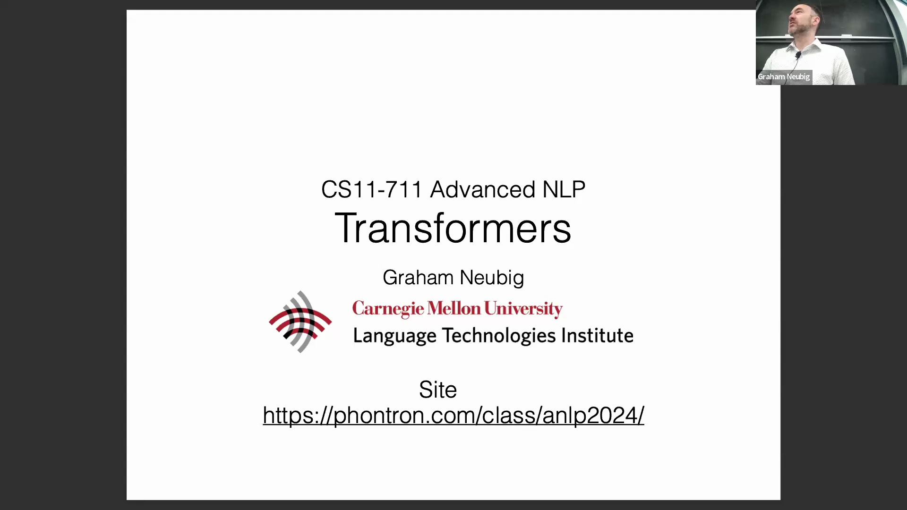
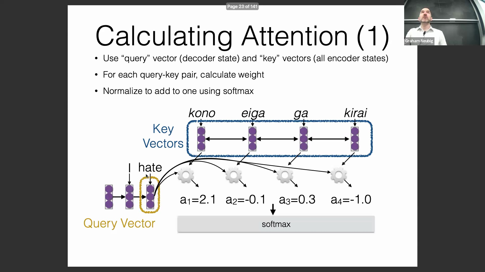
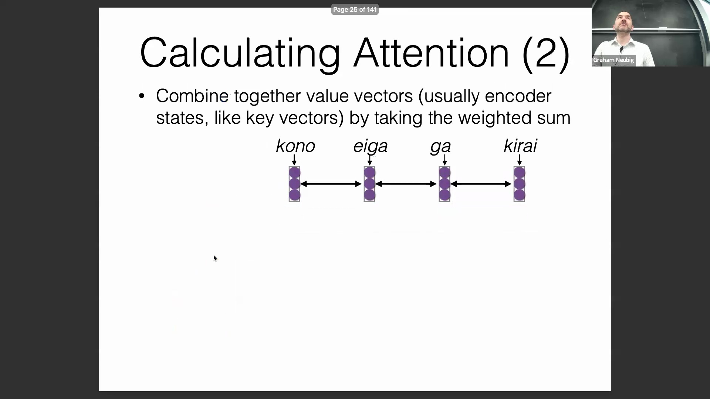
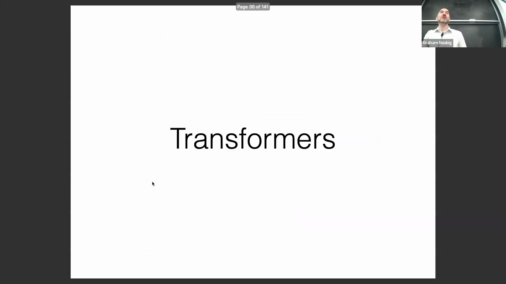
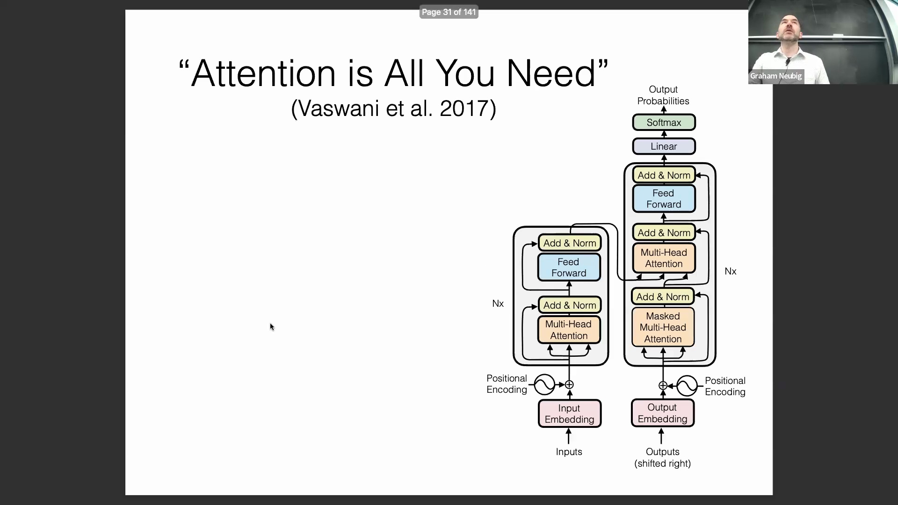
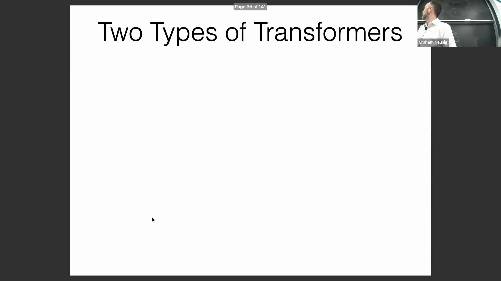
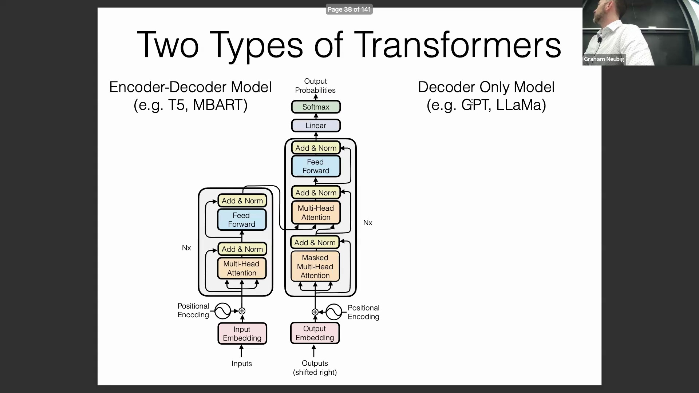

## Transformer 与注意力机制回顾
本次课程重点介绍 Transformer，它是当今大多数现代模型（不仅限于自然语言处理(Natural Language Processing)，还涵盖众多领域）的基础架构。讨论内容将涵盖 Transformer 在 2017 年的原始设计，以及驱动 Llama 等当代语言模型的现代改进版本。在深入新内容之前，有必要快速回顾一下注意力机制(Attention Mechanism)的概念。

注意力机制主要分为两种：交叉注意力(Cross-Attention)和自注意力(Self-Attention)。在交叉注意力中，一个序列作为被关注的键(Keys)，而另一个序列则作为查询(Queries)。相反，自注意力仅涉及单个序列，其中的查询和键对应相同的输入，从而确保序列内部元素相互关注。基于 Transformer 的模型通常单独使用自注意力，或结合使用自注意力与交叉注意力。

## 注意力机制的计算
注意力机制的核心计算涉及将查询向量(Query Vector)与所有键向量(Key Vector)进行比对。对于每一对查询和键，都会计算出一个相似度分数(Similarity Score)。随后，这些分数会通过 Softmax 函数(Softmax Function)进行归一化处理，使其总和为 1，从而形成一个概率分布(Probability Distribution)。

基于这些归一化后的权重，将对应的值向量(Value Vector)进行加权求和，从而为每个查询生成最终的输出向量(Output Vector)。本质上，单个查询向量会生成一个加权后的值向量。

此次回顾为理解 Transformer 的运作机制奠定了基础。

## 范式转变：《Attention is All You Need》
Vaswani 等人于 2017 年发表的开创性论文《Attention is All You Need》提出了一种序列模型(Sequence Model)，该模型能够完全基于注意力机制来生成序列。

该论文的潜力在当时便迅速获得认可，此后已成为现代人工智能(Artificial Intelligence)的基石。在此之前，序列建模(Sequence Modeling)严重依赖于基于循环神经网络(Recurrent Neural Network, RNN)的编码器(Encoder)和解码器(Decoder)，而注意力机制仅作为辅助组件，用于编码器与解码器之间的交叉注意力计算。

Transformer 的关键创新在于彻底摒弃了 RNN 作为主要序列建模组件的地位，完全用自注意力(Self-Attention)取而代之。这一架构转变最初在机器翻译(Machine Translation)任务中取得了优异成果，随后被证明在几乎所有自然语言处理(Natural Language Processing, NLP)任务中都极为高效。

## 计算效率与并行化
除了架构上的优雅之外，Transformer 还具备一个显著的实际优势：速度。其计算主要由高度结构化的矩阵乘法(Matrix Multiplication)构成，这些操作具有极高的并行化(Parallelization)潜力。与受限于序列依赖性(Sequential Dependency)的 RNN 不同（RNN 必须按顺序逐步计算，处理完前一个词元(Token)才能进行下一步），Transformer 能够对整个序列进行并行处理。这种并行化能力无疑是其在该领域迅速普及并广受欢迎的主要驱动力。

## 编码器-解码器架构 vs 仅解码器架构
接下来，讲座将探讨两种主要的 Transformer 架构：编码器-解码器模型(Encoder-Decoder Model)（如 T5 和 BART）以及仅解码器模型(Decoder-Only Model)（如 GPT 和 Llama）。

仅解码器模型仅包含单一的网络层堆叠(Layer Stack)结构，因此在架构上更为简洁。相比之下，编码器-解码器模型则由两个独立的模块组成。两种架构均以输入嵌入(Input Embeddings)和位置编码(Positional Encoding)为起点，随后接入多头注意力模块(Multi-Head Attention Module)和前馈网络(Feed-Forward Network)。多头注意力层负责处理核心的注意力计算，而前馈网络则负责特征的非线性变换与映射。

在编码器-解码器模型中，解码器还额外引入了掩码多头注意力(Masked Multi-Head Attention)（用于确保解码器内部的自回归生成）以及交叉注意力模块，以便与编码器的输出进行交互。

## 应用场景与架构选择
架构的选择通常取决于任务的结构。编码器-解码器模型在输入与输出边界清晰的场景中表现优异，例如文档摘要(Document Summarization)或机器翻译，其中编码器处理源文本，解码器生成目标文本。然而，在对话式人工智能(Conversational AI)或聊天机器人应用中，这种划分往往变得模糊。界定输入上下文(Input Context)的结束位置与模型输出的起始位置并不总是直观的。仅解码器模型通过将整个交互过程视为单一的连续序列来规避这一问题，从而提供了更高的灵活性与便利性。

## 参数效率与模型扩展
仅解码器模型因其结构简洁且单层参数开销(Parameter Overhead)较低而备受青睐，因为它们无需为编码器和交叉注意力配置独立的模块。这种高效性使得研究人员能够在相同的计算预算(Compute Budget)下，通过扩大隐藏层维度或增加网络深度，来有效扩展模型容量(Model Capacity)。针对观众关于不同架构参数量是否相当的提问，研究表明：尽管直接对比的结果因具体实现而异，且如 T5 论文等研究指出编码器-解码器模型在特定结构化任务中可能具备微弱优势，但仅解码器模型凭借其卓越的可扩展性与架构简洁性，已在现代生成式人工智能(Generative AI)应用中占据了绝对主导地位。