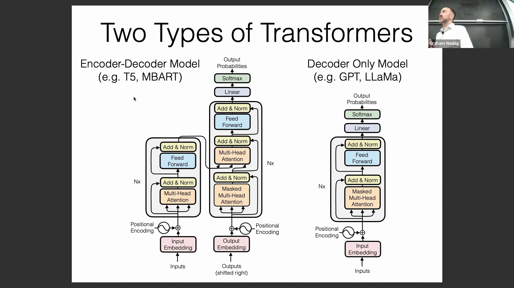
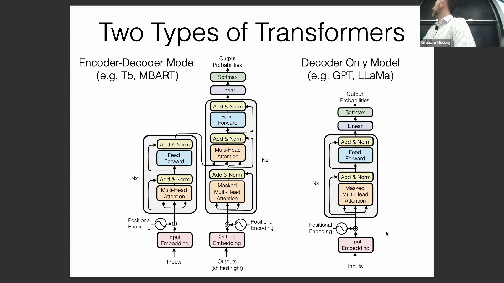
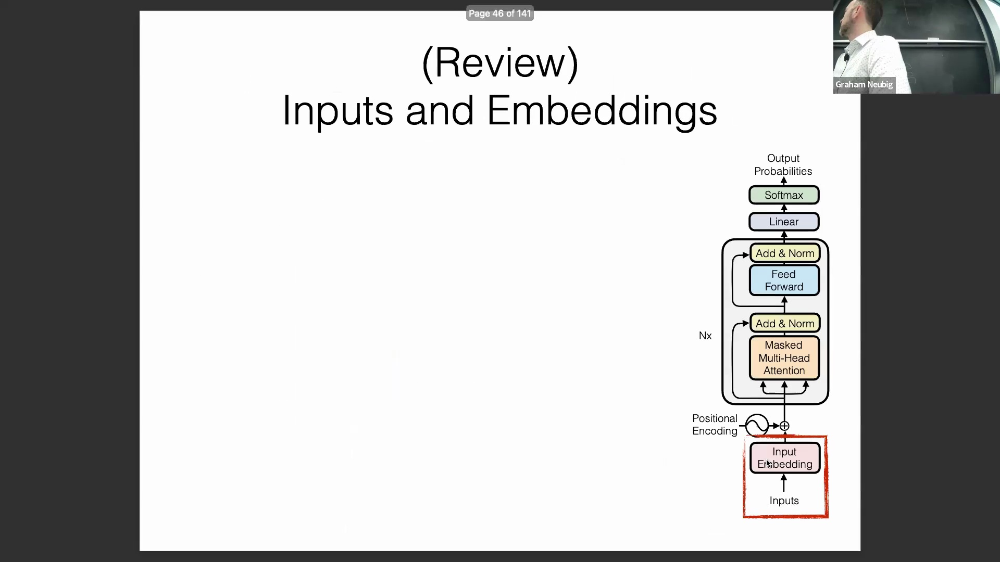
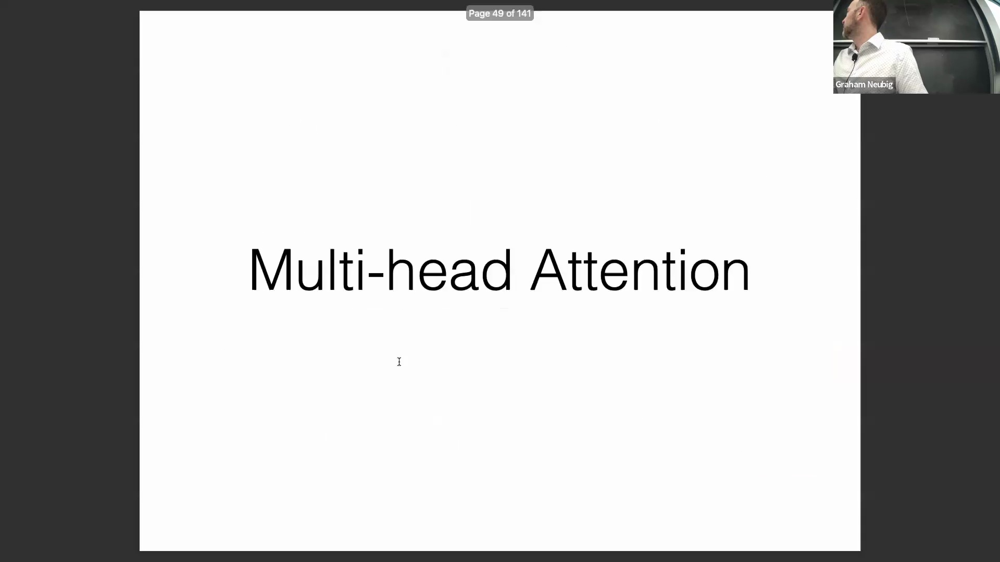
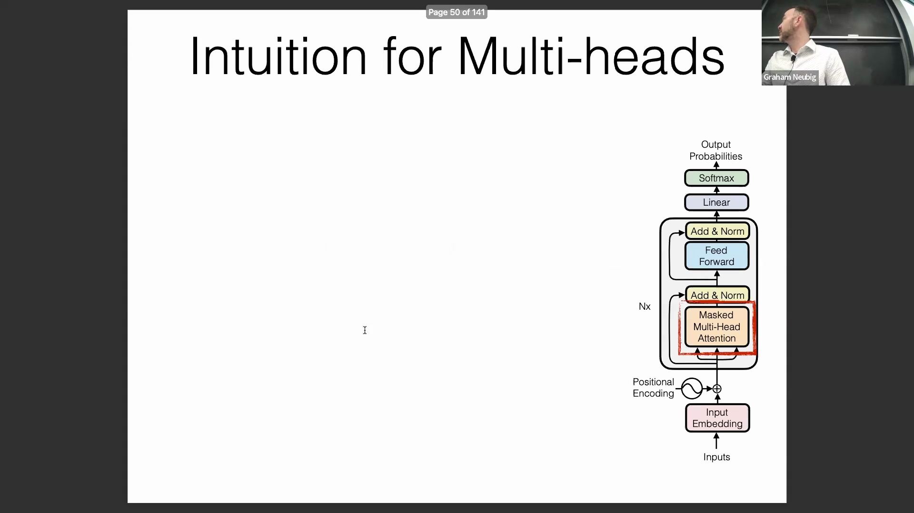
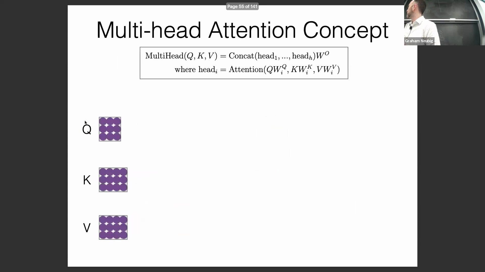
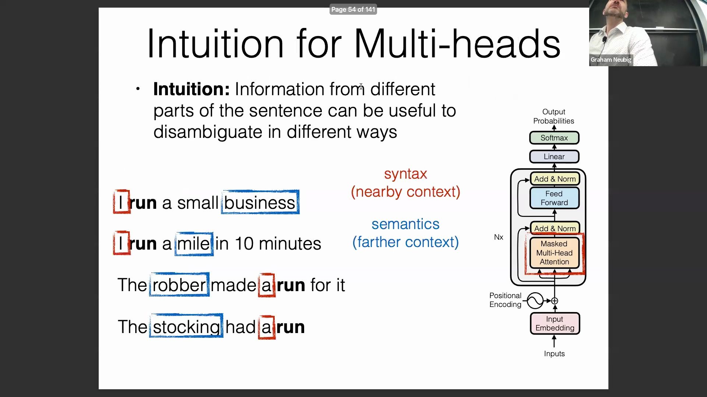

## 课程目标与概述
讲座首先概述了核心学习目标：全面理解 Transformer 架构(Transformer Architecture)的基本组件，并探讨 Llama 等现代模型如何对原始设计进行改进。

讲师强调，掌握这些基础要素对于理解当代架构调整(Contemporary Architectural Modifications)的动因及其如何提升模型性能至关重要。

## Transformer 的基础组件
在深入探讨具体机制之前，本节列出了 Transformer 的核心构建模块：位置编码(Positional Encoding)、多头注意力(Multi-Head Attention)、掩码注意力(Masked Attention)、残差连接(Residual Connection)和层归一化(Layer Normalization)。

讲座简要回顾了输入数据与嵌入(Embedding)的处理方式，指出基于 Transformer 的模型主要依赖于子词分词(Subword Tokenization)和标准的查找表嵌入(Embedding Lookup)。这种方法已成为行业规范，几乎所有主流的 Transformer 架构都采用了某种形式的子词分词技术。

## 多头注意力的直觉理解
随后，讨论转向了 Transformer 最重要的创新之一：多头注意力(Multi-Head Attention)。

其核心直觉在于，序列的不同片段通常蕴含着针对不同任务或上下文的有用信息。如果仅依赖单个注意力头(Single Attention Head)，模型将被迫对输入中哪些部分需要优先考虑做出硬性取舍，从而可能导致丢失宝贵的上下文信号(Contextual Signal)。

## 句法与语义：对多重上下文的需求
为了阐明这一概念，讲师以单词“run”为例进行了案例分析。该词既可作动词也可作名词，其具体语义会根据上下文发生显著变化（例如，“经营一家企业”与“进行跑步锻炼”，或“程序在内存栈中运行”与“参加马拉松比赛”）。

消除词性歧义(Part-of-Speech Ambiguity)（即句法层面(Syntax)）通常只需考察局部上下文(Local Context)，例如限定词或相邻名词的存在与否。相比之下，确定具体语义往往需要捕捉更长距离的依赖关系(Long-range Dependencies)。多头注意力巧妙地解决了这一问题，它允许模型并行关注局部句法线索和远距离语义关系，而无需强制采用单一且受限的关注焦点。

## 数学公式与架构设计
讲座接着讲解了多头注意力的数学原理与结构机制，并参考了备受推崇的 PyTorch 代码实现资源《The Annotated Transformer》。

该架构设计的一个关键优势在于序列长度的灵活性：虽然键向量(Key Vectors)和值向量(Value Vectors)的数量必须保持一致，但查询向量(Query Vectors)的数量可以有所不同。这种设计天然契合交叉注意力(Cross-Attention)场景或自回归解码步骤，即较短的生成序列能够有效关注较长的编码源序列。

## 权重矩阵、张量运算与实现效率
多头注意力的实际计算始于将输入序列通过三个独立的可学习权重矩阵(Weight Matrices)进行线性投影(Linear Projection)，从而生成查询(Query)、键(Key)和值(Value)表示。

为提升计算效率，现代实现方式与原始论文中逐步计算的公式略有不同。实际架构通常避免在矩阵乘法前对向量进行拆分，而是先执行一次大规模的批量矩阵乘法(Batch Matrix Multiplication)，随后将输出的 3D 张量(Tensor)进行重塑(Reshape)，并通过切分嵌入维度(Embedding Dimension)将其分配至多个注意力头。例如，一个隐藏维度为 4 的张量可被切分为两个维度为 2 的独立注意力头。这种实现策略优先执行大规模、可高度并行化的张量运算，随后再进行维度切分与独立的注意力计算，从而最大化了硬件加速器(Hardware Accelerator)的利用率。