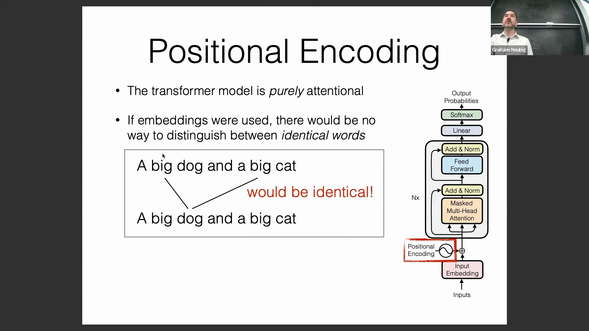
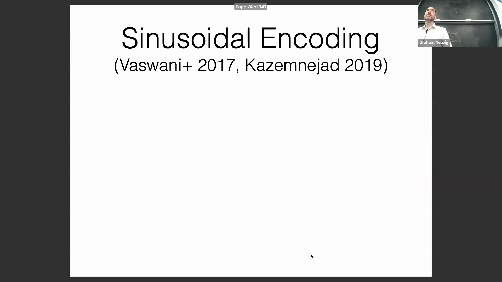
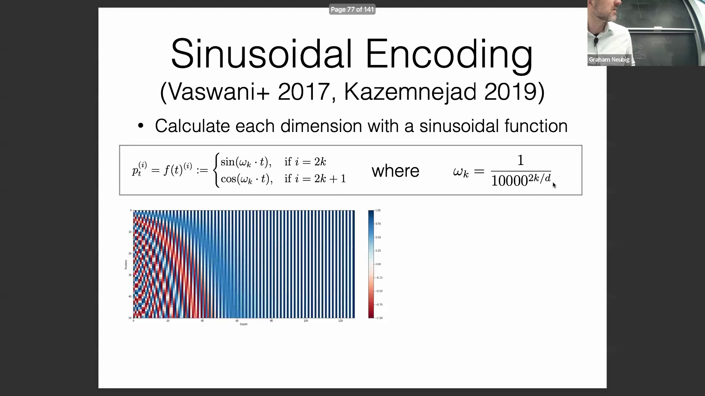
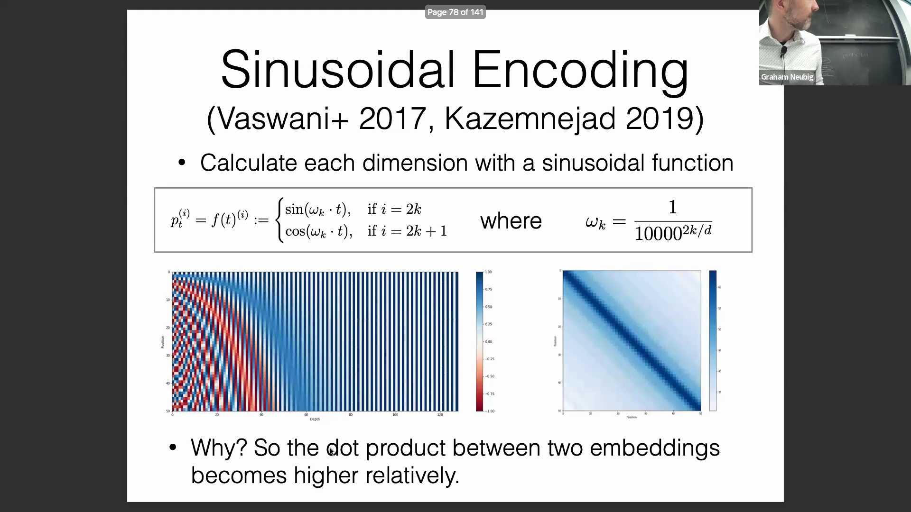
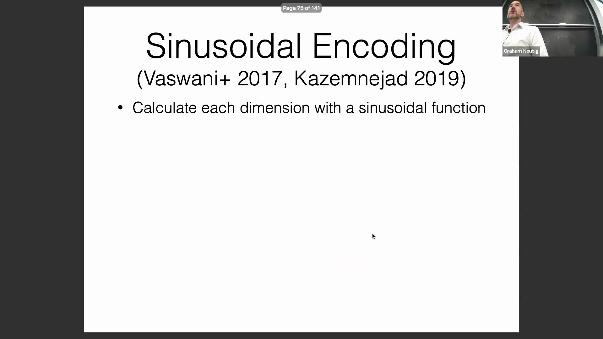
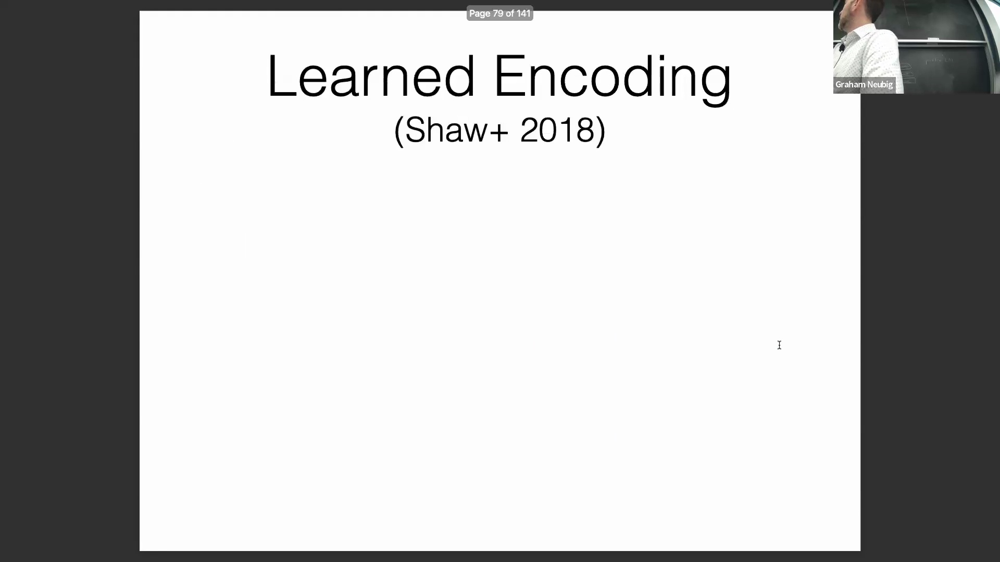
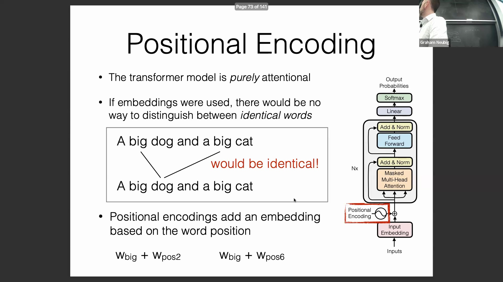
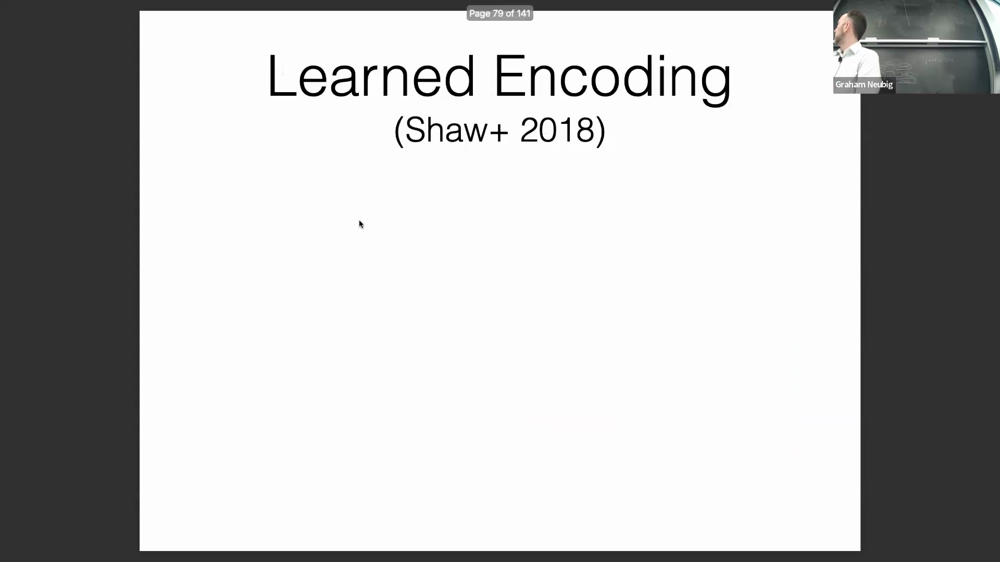

## 位置信息的必要性
注意力机制(Attention Mechanism)本质上具有排列不变性(Permutation Invariance)，这意味着无论相同的词元(Token)出现在序列的哪个位置，它们都会获得相同的注意力权重(Attention Weights)。这带来了重大挑战，因为句法规则(Syntax Rules)和上下文语义(Contextual Semantics)高度依赖于词序(Word Order)和局部连贯性(Local Coherence)。尽管循环神经网络(Recurrent Neural Network, RNN)通过逐步处理词元天然地编码了序列位置(Sequence Position)，但 Transformer 为了最大化并行计算(Parallel Computation)能力而特意摒弃了循环结构。

为了在不退回到串行序列处理(Sequential Processing)的情况下解决这一问题，Transformer 在输入嵌入(Input Embeddings)进入注意力层之前，直接将显式的位置信息(Explicit Positional Information)注入其中。

## 正弦位置编码
2017 年原始的 Transformer 论文通过引入确定性的正弦位置编码(Sinusoidal Positional Encoding)解决了这一问题。该编码为序列中的每个位置生成一个向量，利用交替的正弦函数(对应偶数维度)和余弦函数(对应奇数维度)，并依据位置索引(Position Index)和频率参数(Frequency Parameter)进行缩放。

尽管原始论文仅简要论证了该设计，但后续分析揭示了其内在的数学优雅性。当计算这些位置向量的点积(Dot Product)时，物理位置更接近的词元会产生更高的相似度分数(Similarity Score)。

这在网络的初始层中天然地促使注意力机制偏向局部上下文(Local Context)，而捕捉邻近的句法关系(Syntax Relations)在浅层网络中最为关键。随着数据流经更深的网络层(Network Layer)和残差连接(Residual Connection)，这些初始位置信号(Positional Signals)得以保留，并逐渐融合到更全局的语义表示(Semantic Representation)中。

## 可学习位置编码
一种更为直接的替代方案是可学习位置编码(Learnable Positional Encoding)，其中位置向量被视为可训练参数(Trainable Parameters)，其性质类似于标准的词嵌入(Word Embedding)。模型会在训练过程中自动学习出能够最小化损失函数(Loss Function)的最优位置表示。

尽管该方案高度灵活且易于实现，但存在一个根本性局限：无法外推(Extrapolate)至训练期间未见过的更长序列。由于模型仅学习了固定位置索引的查找表(Lookup Table)，当遇到更长序列时，模型不得不处理分布外(Out-of-Distribution, OOD)的位置索引，这通常会导致性能显著下降。理论上，正弦编码通过连续的数学函数避免了截断问题，但在实际应用中，即使是具备理论外推能力的编码方案，在面对显著增长的上下文长度(Extended Context Length)时，性能仍往往会出现衰减。

## 绝对位置编码与相对位置编码
位置编码(Positional Encoding)策略大致可分为绝对位置编码(Absolute Positional Encoding)与相对位置编码(Relative Positional Encoding)。绝对编码为每个位置索引独立分配一个固定向量，不显式建模查询(Query)与键(Key)之间的距离。相对位置编码则直接将词元之间的相对偏移量(Relative Offset)纳入注意力计算(Attention Computation)中。

早期的相对位置编码实现会为每个可能的相对距离（例如 -128 到 +128）学习一个标量偏置(Scalar Bias)，并将超出该范围的距离进行截断(Clipping)，统一映射至一个共享的嵌入向量。

然而，该方法引入了额外的可学习参数，并且需要在注意力计算中执行计算成本高昂的偏置加法(Bias Addition)操作，因此在模型大规模扩展与部署时效率较低。

## 旋转位置编码（RoPE）
为兼顾绝对位置编码与相对位置编码的优势，研究人员提出了旋转位置编码(Rotary Positional Embedding, RoPE)。RoPE 通过根据绝对位置对查询(Query)和键(Key)向量施加旋转变换(Rotation Transformation)，巧妙地弥合了两者之间的差距。

RoPE 的核心数学特性在于：当旋转后的查询与键向量进行点积运算时，其结果仅取决于原始特征表示(Feature Representation)及其相对距离(Relative Distance)，而完全独立于它们的绝对索引(Absolute Index)。这一特性使得模型既能保留绝对编码的简洁性与外推能力，又能有效捕获相对编码的距离感知(Distance-Aware)优势，从而使其成为现代 Transformer 架构中广泛采用的标准组件。