## 旋转位置编码（RoPE）与相对定位
设计相对位置编码(Relative Positional Encoding)的核心挑战在于彻底摒弃绝对位置信息(Absolute Positional Information)，确保模型仅依赖于词元(Token)之间的距离。这一约束对于模型稳健地外推(Extrapolate)至训练期间未见过的序列长度(Sequence Length)至关重要。其解决方案涉及运用基于三角函数(Trigonometric Functions)和复数(Complex Numbers)的数学公式。通过对查询(Query)和键(Key)向量应用旋转变换(Rotation Transformation)（该变换融入了按位置索引(Position Index)缩放的余弦和正弦函数），模型能够计算出仅依赖于相对距离(Relative Distance)的注意力分数(Attention Scores)。
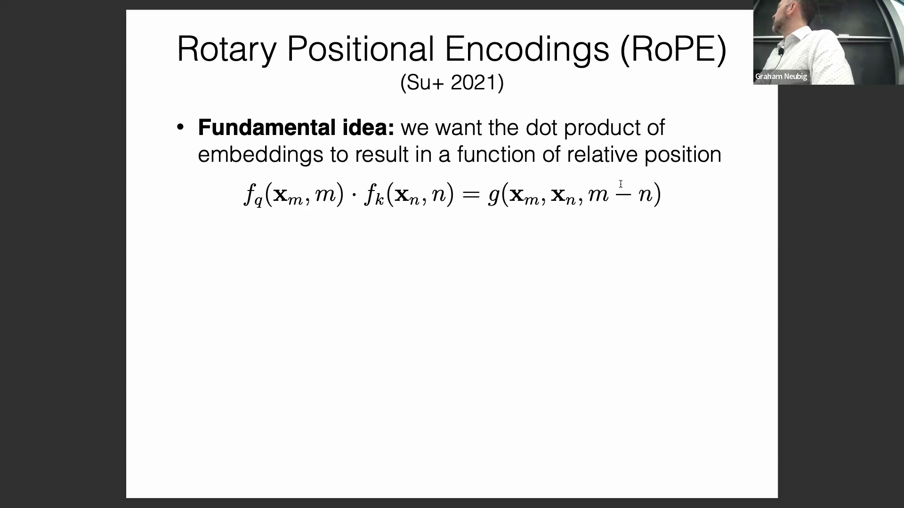
这种被称为旋转位置编码(Rotary Positional Embedding, RoPE)的机制有效保障了模型强大的外推性能(Extrapolation Performance)，因为它消除了可能导致模型过拟合(Overfit)于训练序列长度的绝对位置偏差(Absolute Positional Bias)。RoPE 现已成为 Llama 等现代架构中的标准组件，显著提升了模型处理长上下文(Long Context)任务的能力。

## 外推能力与序列敏感性
一个常见的疑问是：RoPE 是否会对序列开头或结尾的词元(Token)表现出更高的敏感性。从数学角度看，其旋转模式(Rotational Pattern)具有周期性重复(Periodicity)的特征，这意味着序列首尾的词元会表现出相似的旋转变换特性。
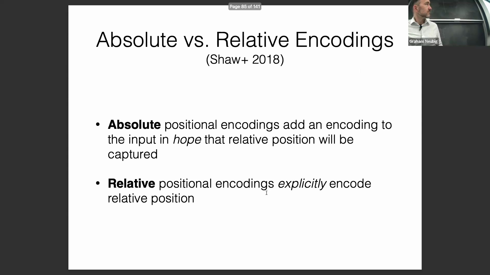
与绝对位置编码(Absolute Positional Encoding)不同（后者容易过拟合(Overfit)于特定的索引范围，且在输入序列超出训练长度时性能往往急剧下降），RoPE 没有固有的最大上下文窗口(Context Window)限制。由于它利用连续的数学函数(Continuous Mathematical Functions)动态计算位置信息，理论上具备向任意长序列外推(Extrapolate)的潜力。在实际应用中，采用 RoPE 的模型在长上下文(Long Context)任务上的泛化能力(Generalization Ability)显著优于依赖可学习绝对嵌入(Learnable Absolute Embeddings)的模型，因为后者在面对未见过的位置索引时缺乏有效的先验知识。
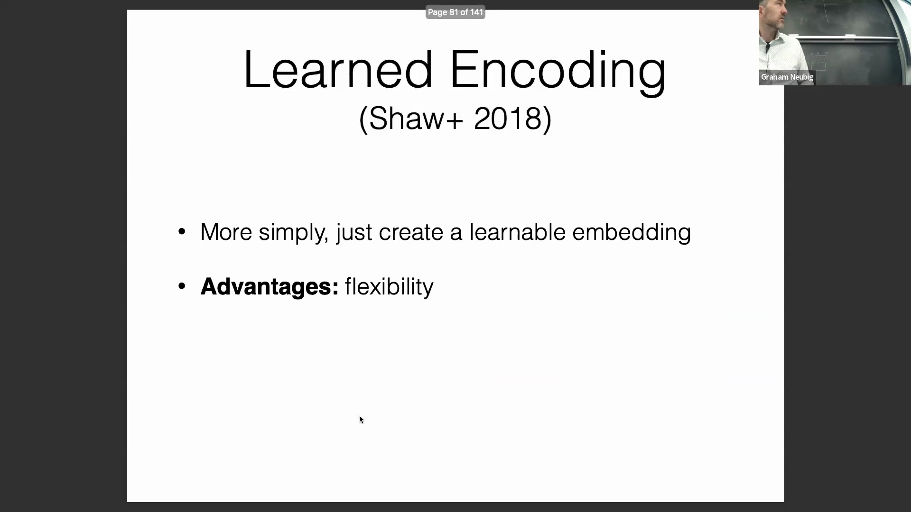
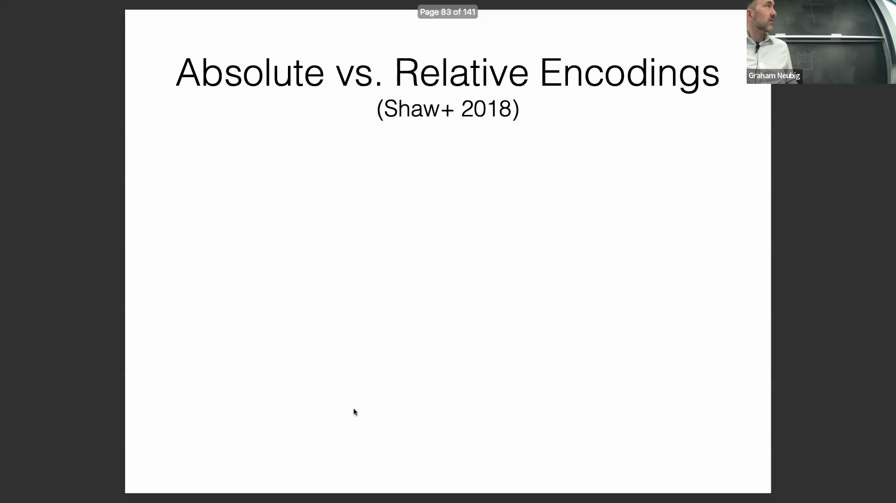
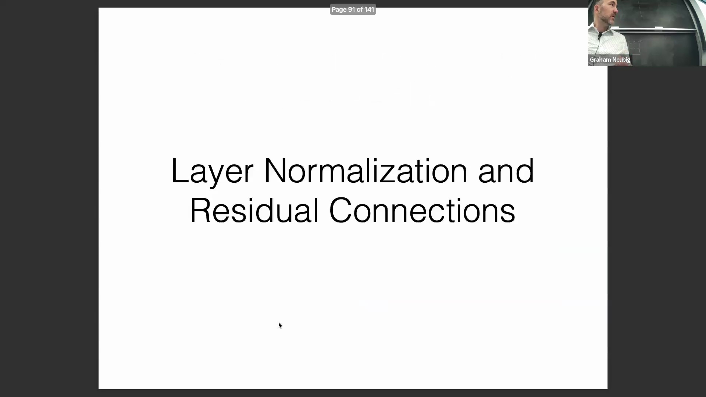
这种数学上的灵活性使 RoPE 成为关键的架构设计(Architectural Design)选择，尤其适用于需要稳健处理可变及扩展上下文窗口(Extended Context Window)的任务。
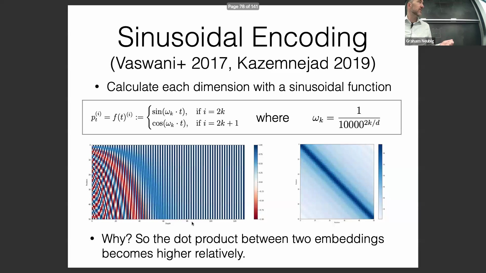

## 训练稳定性：层归一化与残差连接
随着 Transformer 模型通过堆叠多层(Network Layer Stacking)而不断加深，它们面临着与早期循环神经网络(Recurrent Neural Network, RNN)相似的梯度消失(Vanishing Gradient)和梯度爆炸(Exploding Gradient)问题。为缓解这一难题，现代架构高度依赖残差连接(Residual Connection)与层归一化(Layer Normalization)。残差连接主要确保梯度能在网络中顺畅地进行反向传播(Backpropagation)，而层归一化则主要致力于抑制梯度爆炸并稳定网络输出。
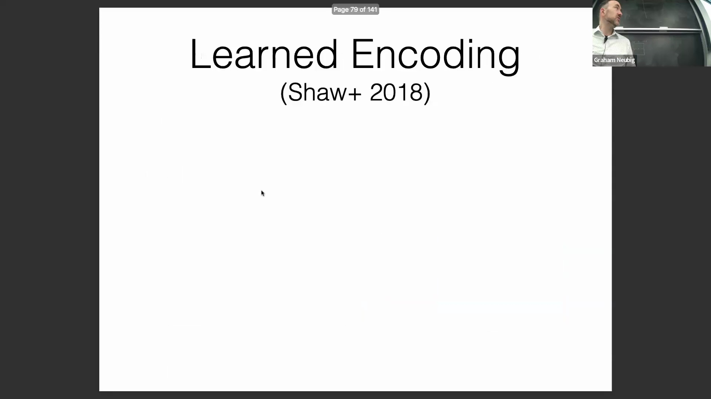
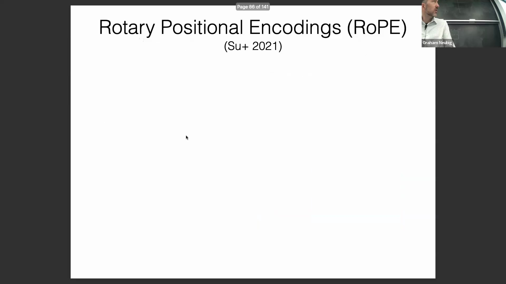
层归一化(Layer Normalization)对每个独立样本的特征向量内的激活值(Activations)进行标准化处理。该过程首先计算输入向量所有元素的均值(Mean)和标准差(Standard Deviation)，随后将数值缩放至零均值(Zero Mean)和单位方差(Unit Variance)的标准正态分布。
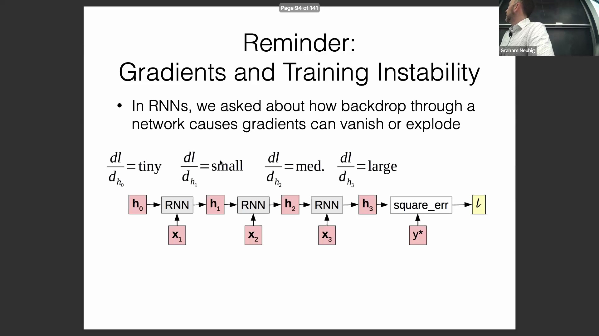
关键之处在于，标准化并非终点：归一化后的数值会进一步通过一个可学习的增益(Gain/Scale)参数进行缩放，并通过一个可学习的偏置(Bias/Shift)参数进行平移。这一机制在确保激活值被约束在可预测的稳定范围内以防范梯度爆炸(Exploding Gradients)的同时，赋予了模型灵活调整特征分布尺度与中心位置的自由度。
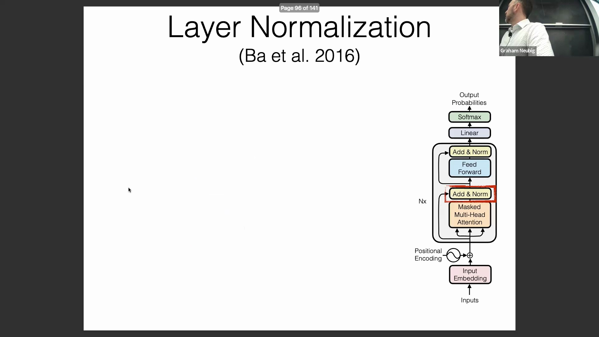
通过将网络输出一致地映射到表示空间(Representation Space)的受控区域内，层归一化显著提升了深层 Transformer 堆叠(Deep Transformer Stack)的训练稳定性(Training Stability)。

## 层归一化与批归一化的区别
必须将层归一化(Layer Normalization)与在计算机视觉(Computer Vision)领域广泛应用的批归一化(Batch Normalization)严格区分。批归一化是针对整个小批量(Mini-batch)数据的统计量(Statistics)进行归一化，这使其性能高度依赖于批次大小(Batch Size)，且难以适配可变长度的序列。相比之下，层归一化严格针对每个独立样本(Independent Sample)的特征向量内部计算统计量。这种对批次动态(Batch Dynamics)的独立性，使得层归一化在处理文本等序列数据(Sequential Data)时更为稳健高效，因为此类数据的序列长度(Sequence Length)与批次构成往往存在显著差异。
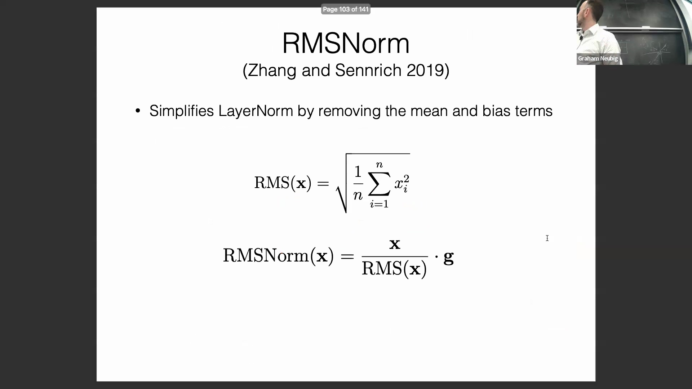