## 批归一化与层归一化
本部分首先对比了批归一化(Batch Normalization)与层归一化(Layer Normalization)。历史上，批归一化在序列模型中存在局限性，因为其统计量计算依赖于整个小批量(Mini-batch)。这会导致训练与推理阶段产生显著的不匹配，因为在推理时无法获取批次数据，或批次统计量不一致，迫使模型必须依赖滑动平均值(Running Average)。 
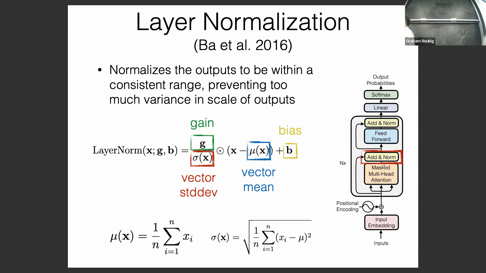
相比之下，层归一化(Layer Normalization)严格作用于当前独立样本。由于它对每个特征向量进行独立归一化，因此无论批次大小(Batch Size)或批次组成如何，输出都能保持稳定一致，这使其极适合处理可变长度序列(Variable-length Sequences)。

## RMSNorm：一种精简的替代方案
为提升计算效率(Computational Efficiency)，Llama 等现代架构广泛采用了 RMSNorm(Root Mean Square Layer Normalization)。RMSNorm 通过完全移除均值减法(Mean Subtraction)和可学习偏置项(Learnable Bias)，简化了标准层归一化(Standard LayerNorm)的计算公式，仅保留基于均方根(Root Mean Square, RMS)的缩放操作。 
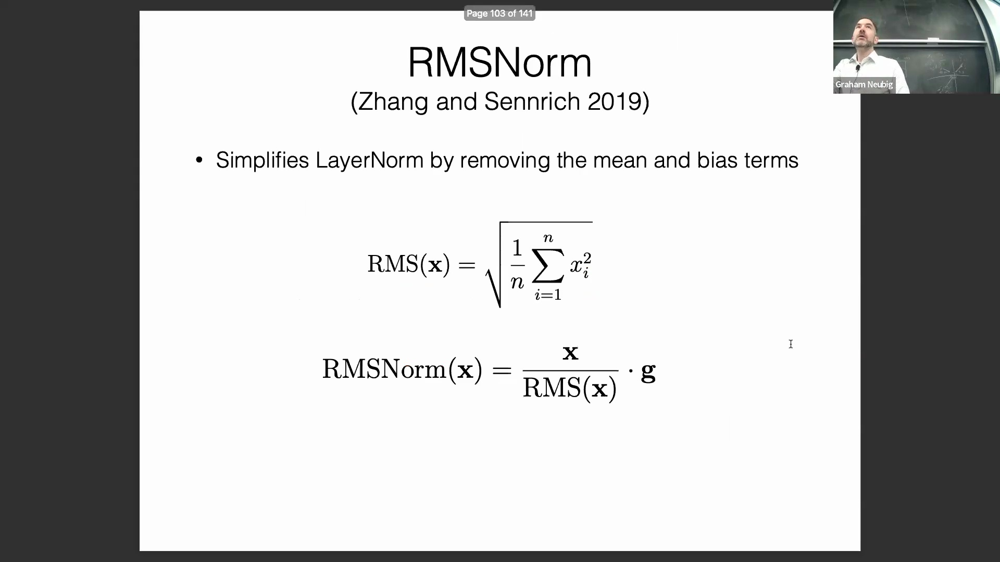
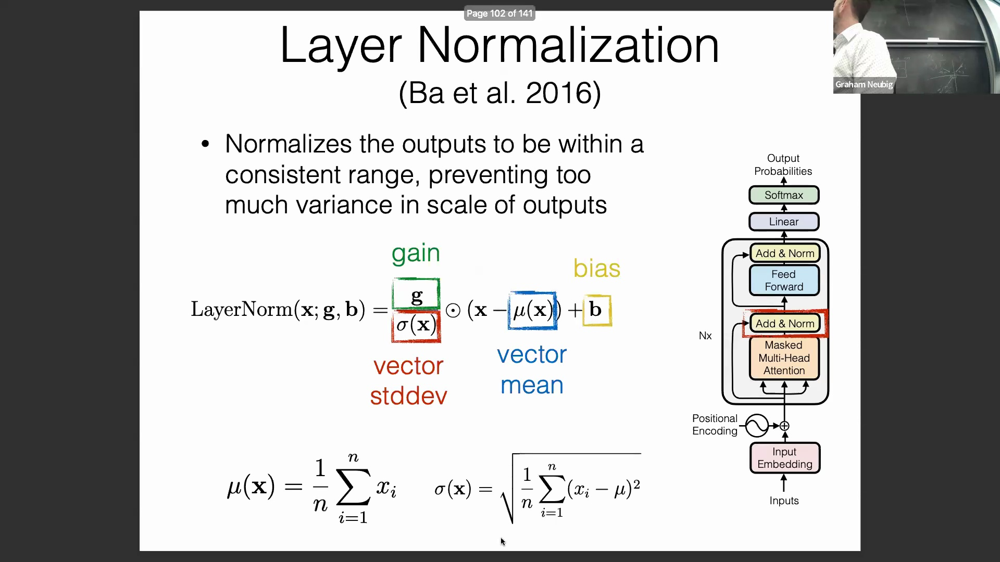
RMSNorm 不再强制将特征分布中心化至零，而是直接在保留向量在表示空间(Representation Space)中原始方向的同时，仅对其幅值(Magnitude)进行缩放调节。 
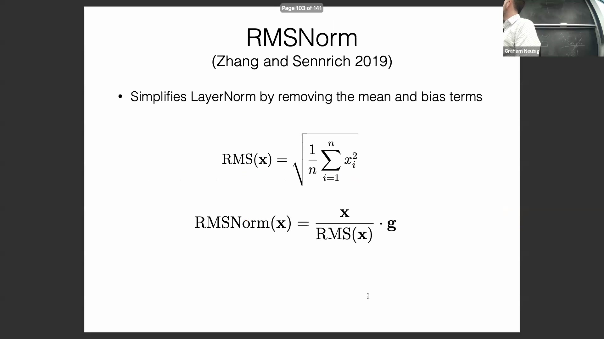
尽管其在下游任务中的实际性能与标准层归一化相当，但 RMSNorm 显著降低了计算开销(Computational Overhead)与参数量(Parameter Count)，已成为当代大语言模型(Large Language Models, LLMs)中极为高效的标准化组件。

## 残差连接与注意力动态
残差连接(Residual Connection)是构建深层 Transformer(Deep Transformer)的基石，它在子层(Sub-layer)的输入与输出之间提供了一条直接的恒等映射通路(Identity Mapping Pathway)。这种架构设计不仅有效缓解了梯度消失(Vanishing Gradient)问题，还将网络的学习目标从预测绝对输出(Absolute Output)转变为预测残差增量(Residual Increment)。
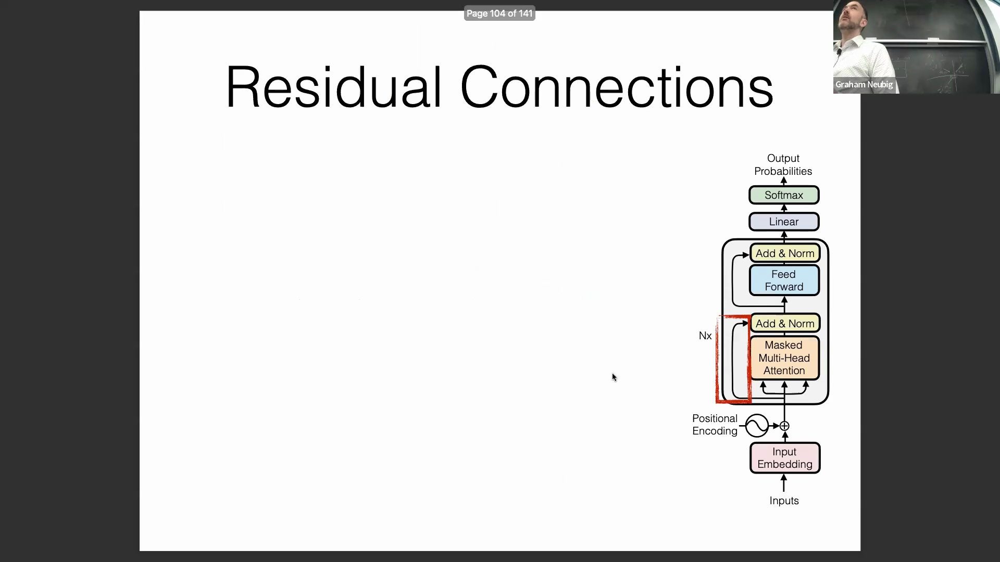
关键在于，残差连接从根本上重塑了注意力头(Attention Head)的行为模式。由于原始输入向量被完整保留并通过残差通路直接叠加，注意力机制(Attention Mechanism)无需再耗费容量去关注词元(Token)自身。相反，各个注意力头可专注于从周围词元中提取上下文信息(Contextual Information)。这解释了注意力可视化(Attention Visualization)中的一个常见规律：通常仅有一个头会高度关注词元自身，而其余的头则专门负责从序列的其他位置捕获多样化的上下文线索。
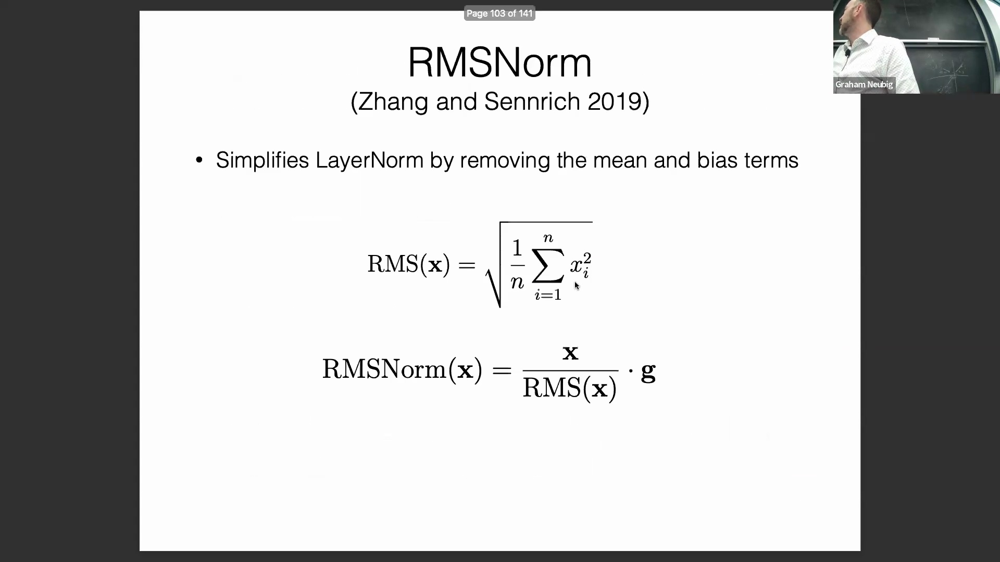
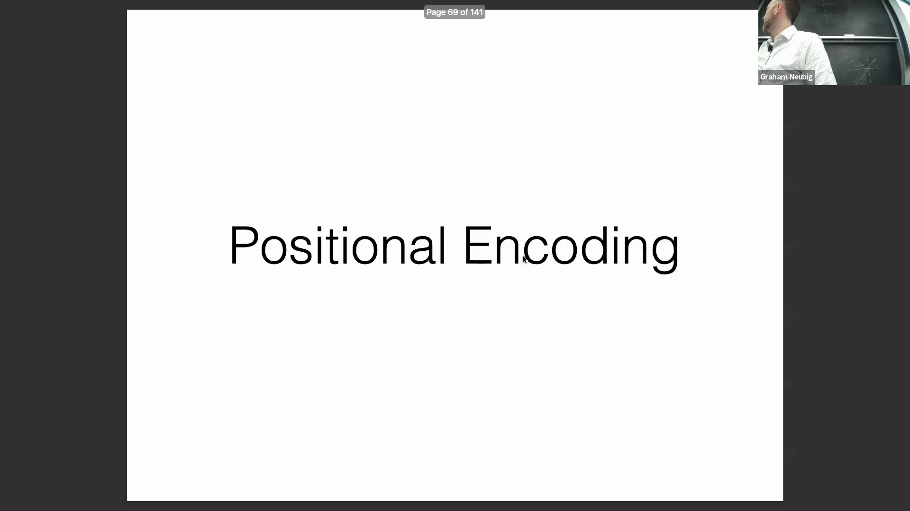
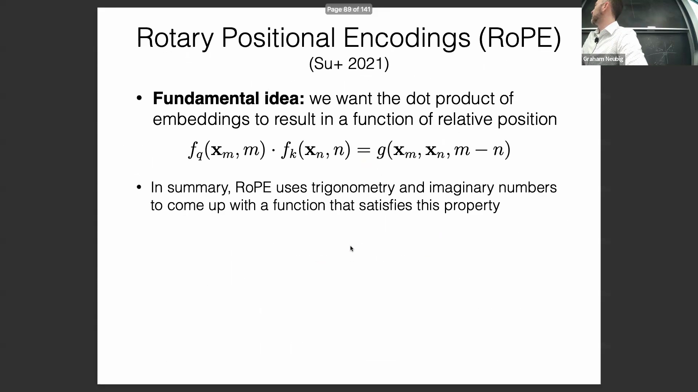

## 预归一化与后归一化
归一化层(Normalization Layer)在残差通路中的放置位置对训练稳定性(Training Stability)至关重要。原始 Transformer 架构采用后归一化(Post-Normalization)，即在注意力模块和前馈子层*之后*应用层归一化(LayerNorm)。然而，将非线性的归一化操作直接置于残差求和之后会破坏梯度的平滑流动，极易在极深网络(Very Deep Networks)中阻碍反向传播(Backpropagation)。
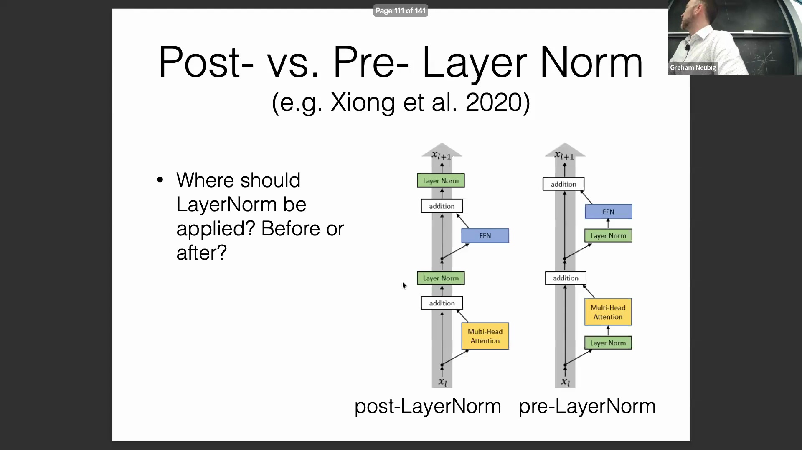
现代实现已全面转向预归一化(Pre-Normalization)，即在注意力层和前馈网络*之前*应用归一化操作。这种架构调整为信号从网络底层传递至顶层构建了一条直接且无中断的残差高速通路(Highway)。通过确保残差相加路径不受非线性缩放函数的干扰，梯度得以沿近似恒等映射(Identity Mapping)的连接顺畅反向传播，从而显著提升了模型的整体训练稳定性与收敛速度(Convergence Rate)。

## 前馈网络与特征提取
在每个注意力块(Attention Block)之后，Transformer 会应用逐位置前馈网络(Position-wise Feed-Forward Network, FFN)来进一步处理与重组已聚合的特征。该网络独立作用于序列中每个词元的向量，使模型能够提取并组合复杂的非线性特征(Non-linear Features)。
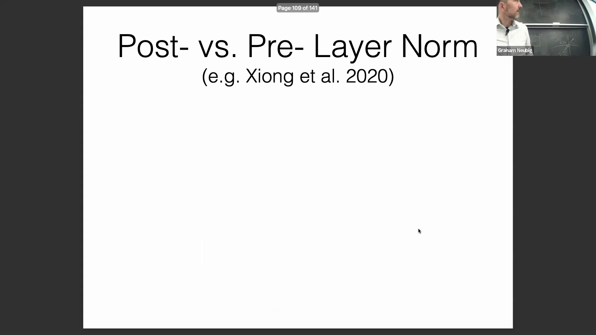
标准的 FFN 通常先将输入向量通过线性投影(Linear Projection)映射至一个维度显著更高的中间隐藏空间(Intermediate Hidden Space)，随后再投影回原始维度。这种升维扩展(Expansion)操作构建了一个高容量的特征空间，其中的单个神经元(Neuron)往往对应特定的语言学特征或事实性知识概念。因此，FFN 的激活模式(Activation Patterns)在模型可解释性研究(Model Interpretability)中备受重视，因为它们常被用于定位模型记忆事实或编码语义知识(Semantic Knowledge)的区域。为简化计算并降低潜在的数值不稳定性，现代架构设计通常会在这些线性层中移除偏置项(Bias Terms)。
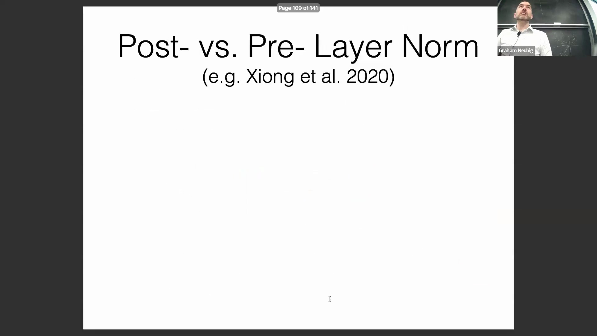
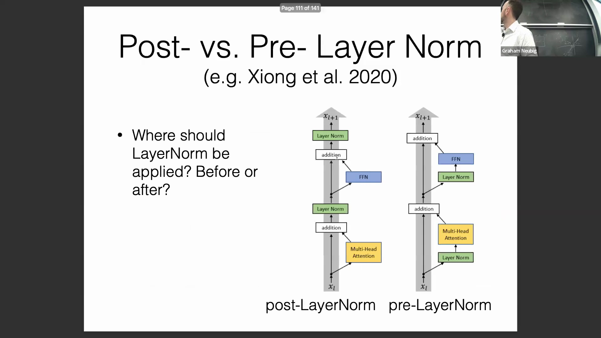
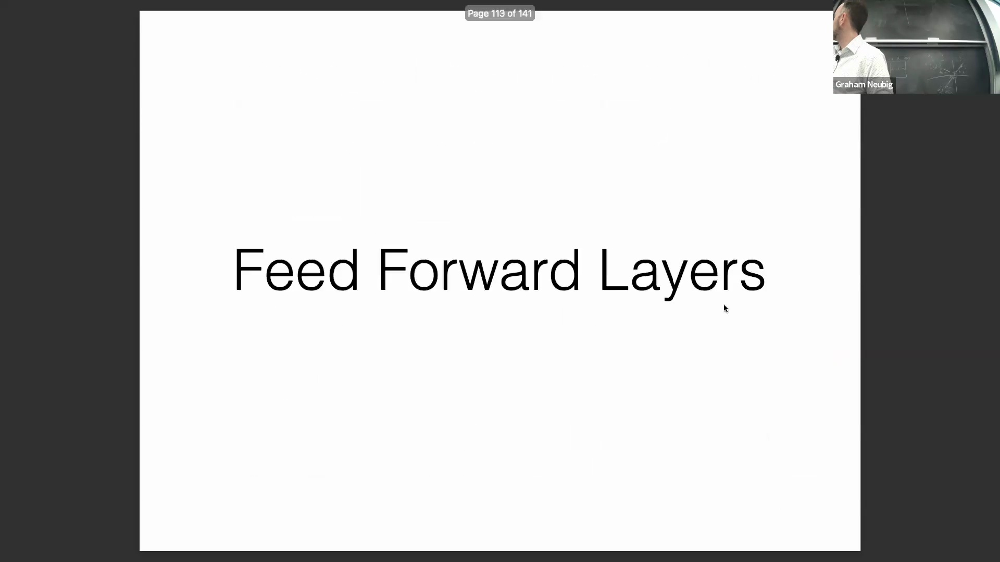
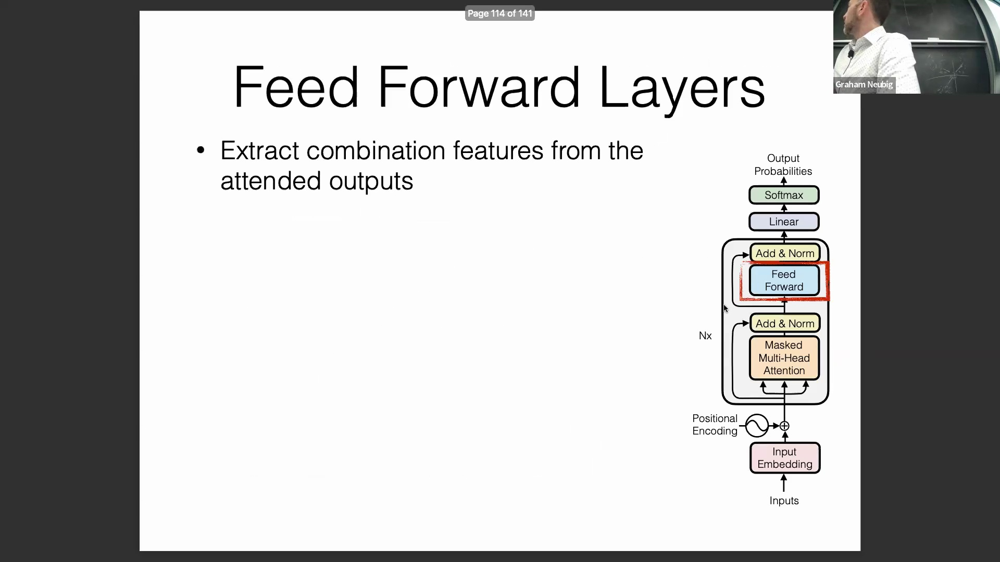

## Transformer 中的激活函数
本部分最后探讨了前馈网络中使用的非线性激活函数(Non-linear Activation Function)。2017 年原始 Transformer 架构采用了线性整流单元(Rectified Linear Unit, ReLU)，其数学表达式为 `max(0, x)`。 
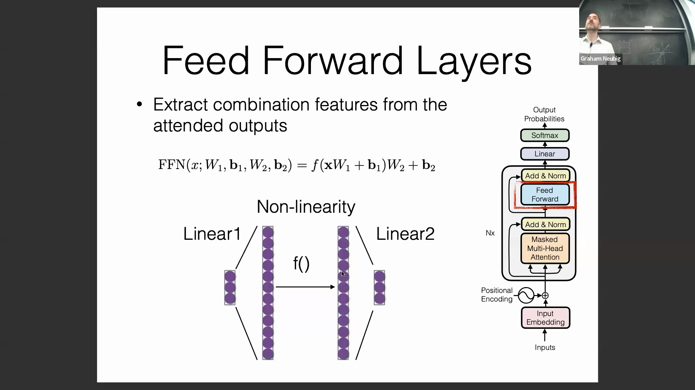
尽管 ReLU 成功引入了深度学习所必需的非线性变换能力，但后续研究与现代架构普遍探索了更平滑的替代激活函数，旨在进一步优化梯度流(Gradient Flow)与模型在大规模扩展下的性能表现。