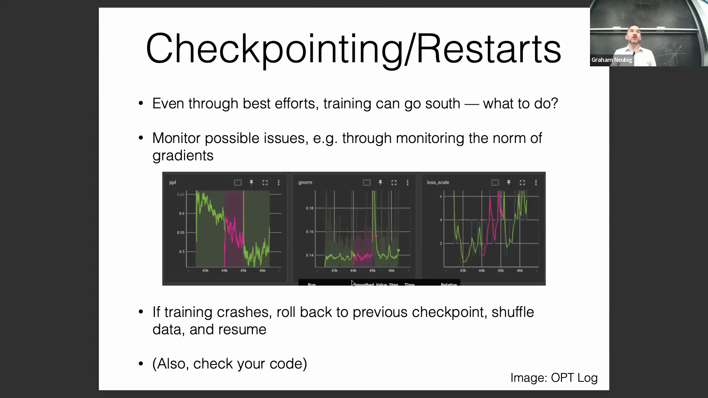
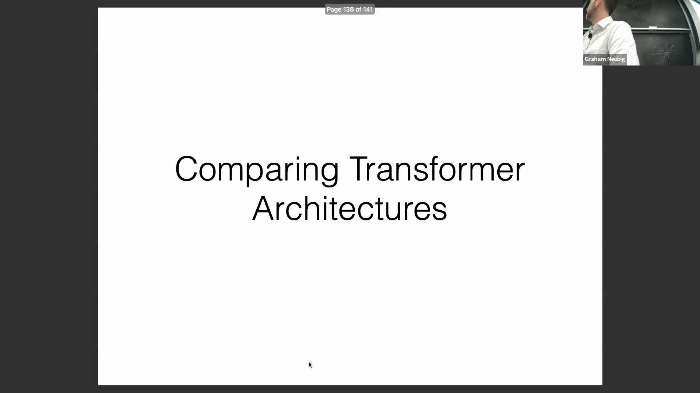
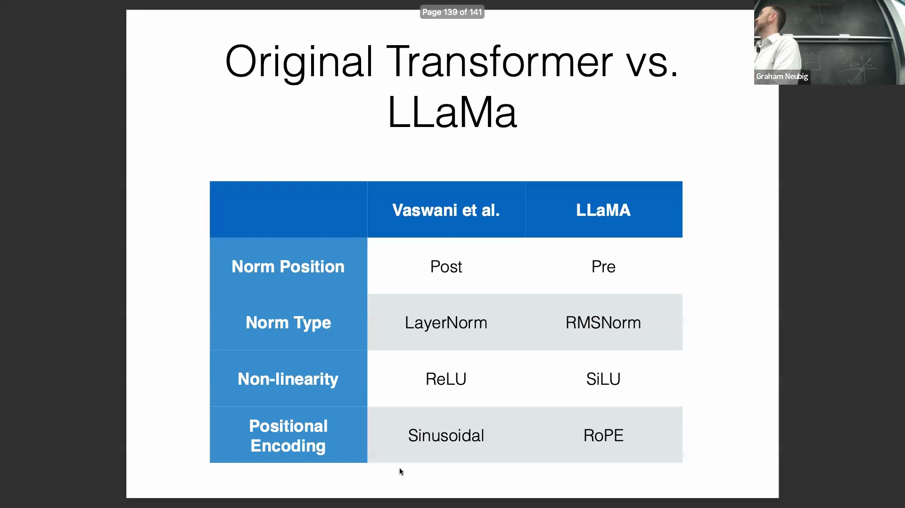
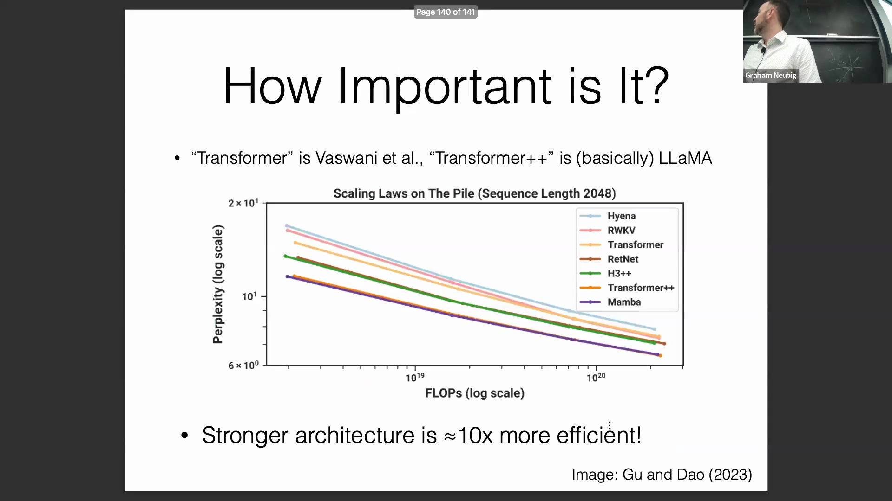
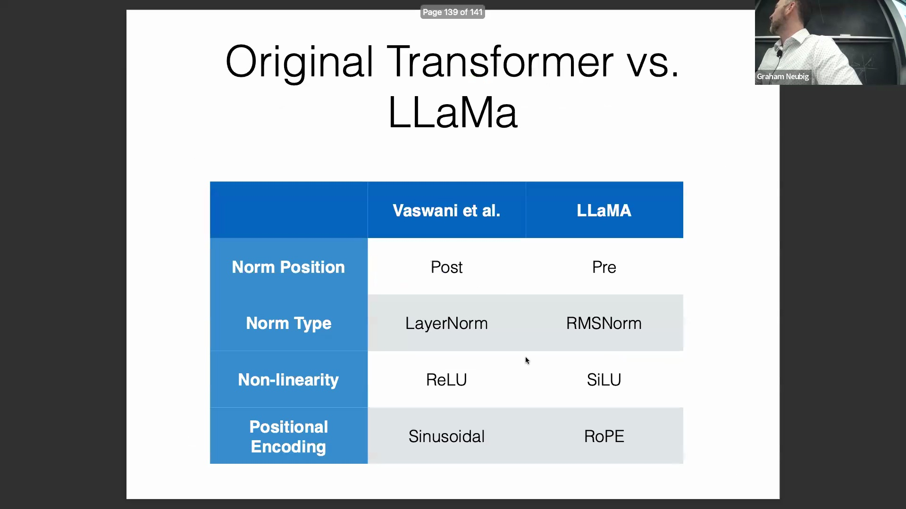
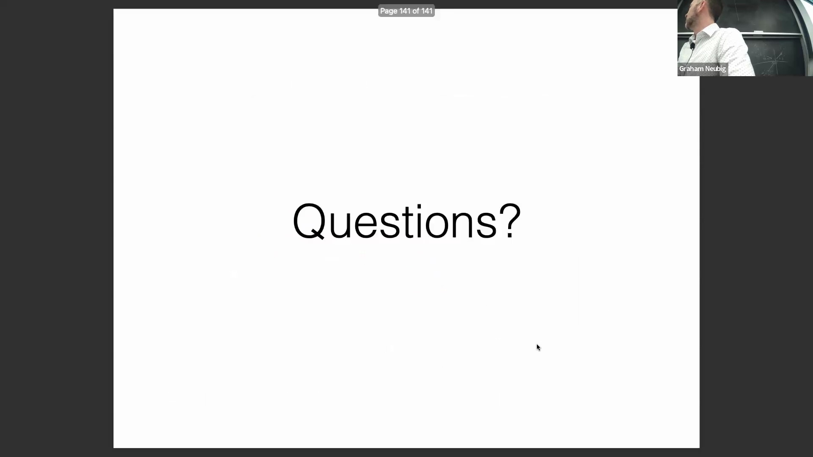

## 诊断训练不稳定与梯度尖峰
训练过程中频繁出现的梯度尖峰(Gradient Spikes)往往并非随机现象；它们通常预示着底层存在数值不稳定(Numerical Instability)或代码实现层面的缺陷。例如，对趋近于零的数值应用对数函数(Logarithmic Function)可能会引发数值极大甚至趋近无穷大的梯度。确保代码具备鲁棒性(Robust)、经过充分测试且避免危险的数值操作(Numerically Unsafe Operations)，并结合适当调整的学习率(Learning Rate)，可大幅降低此类异常的发生频率。当梯度尖峰持续出现时，这是一个明确的警告信号，表明必须仔细审查模型实现代码并优化计算图(Computational Graph)的稳定性。

## 实践调试经验的作用
深度学习优化(Deep Learning Optimization)的很大一部分工作依赖于通过动手实验(Hands-on Experimentation)与故障排除(Troubleshooting)所积累的“实战经验(Empirical Knowledge)”。当遭遇持续的训练瓶颈(Training Bottlenecks)时，强烈建议向讲师、助教(Teaching Assistants)或经验丰富的同行寻求指导。在夯实这些基础调试原则(Debugging Principles)之后，接下来的讨论将转向对 Transformer 架构历史演进(Architectural Evolution)的关键对比。

## 核心架构分歧：原始与现代 Transformer
尽管 Llama 等现代大语言模型(Large Language Models, LLMs)仍遵循 Vaswani 等人奠定的基础 Transformer 范式(Transformer Paradigm)，但它们已融入了多项关键的架构演进(Architectural Shifts)。2017 年的原始设计高度依赖后归一化(Post-Normalization)，而现代架构已广泛采用预归一化(Pre-Normalization)予以替代，以确保梯度(Gradients)在深层残差通路(Deep Residual Pathways)中更顺畅地反向传播。此外，标准的层归一化(Layer Normalization)在很大程度上已被均方根归一化(RMSNorm)取代；后者移除了均值中心化(Mean Centering)步骤，在维持训练稳定性的同时显著提升了计算效率(Computational Efficiency)。

## 激活函数与位置编码的升级
除归一化技术外，非线性激活函数(Non-linear Activation Functions)与位置编码(Positional Encoding)方案也经历了显著优化。原始的 ReLU 激活函数易因负输入区间的零梯度(Zero Gradient)引发神经元“死亡”(Dying ReLU)现象，现已被 SiLU/Swish 激活函数广泛取代。后者在整个定义域内均保持平滑且非零的梯度(Smooth Non-zero Gradients)，从而为模型优化(Optimization Process)提供了更优的动力学特性。此外，传统的固定正弦位置编码(Fixed Sinusoidal Positional Encoding)已逐渐被淘汰，取而代之的是旋转位置编码(Rotary Positional Embedding, RoPE)。RoPE 在捕捉词元相对距离(Token Relative Distances)以及向未见过的序列长度进行外推(Extrapolation to Unseen Sequence Lengths)方面展现出卓越性能。

## 经验证据：训练 FLOPs 的效率差距
尽管这些架构调整(Architectural Tweaks)看似微小，但实证研究(Empirical Studies)表明它们带来了巨大的实际性能收益。一项备受瞩目的研究直接将原始 Transformer 架构与现代类 Llama 的“Transformer++”设计进行了横向对比，评估指标涵盖对数尺度下的困惑度(Log-scale Perplexity)与总训练浮点运算次数(Total Training FLOPs)。结果令人瞩目：传统架构需要消耗约十倍于现代变体的计算量(Computational Cost)，方能达到同等的困惑度水平。

## 重新审视“规模即一切”
这一高达 10 倍的效率差距(Efficiency Gap)从根本上挑战了“规模即一切(Scale is All You Need)”的传统观念。尽管扩大参数量(Parameter Scaling)与增加训练数据(Data Scaling)依然重要，但精细的架构工程(Architectural Engineering)对于推动该领域的发展同样不可或缺。近年来实现的大部分模型性能(Model Performance)与训练速度(Training Speed)的提升，均归功于这些经过深思熟虑的优化设计(Optimized Design Choices)，而非单纯依赖算力与数据的暴力堆砌(Brute-force Scaling)。严谨的架构优化(Architectural Optimization)依然是实现高效大规模模型开发(Efficient Large-scale Model Development)的基石。
