## 生成算法简介
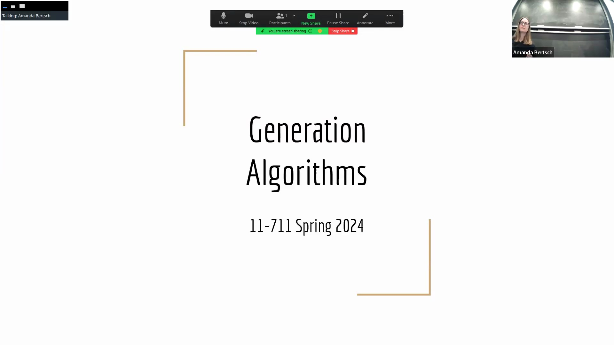
今天的课程将全面介绍最常见的生成算法，探讨它们的实际应用及其背后的理论基础。讲座将按顺序逐一讲解核心概念，并在各章节之间预留互动与提问环节。

## 作为条件概率分布(Conditional Probability Distribution)的大语言模型

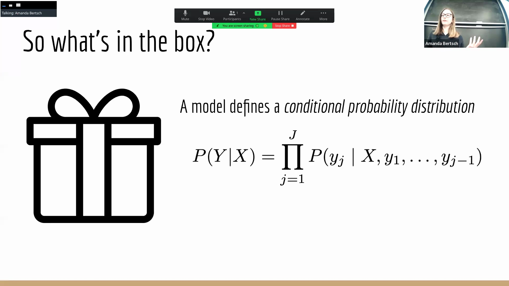
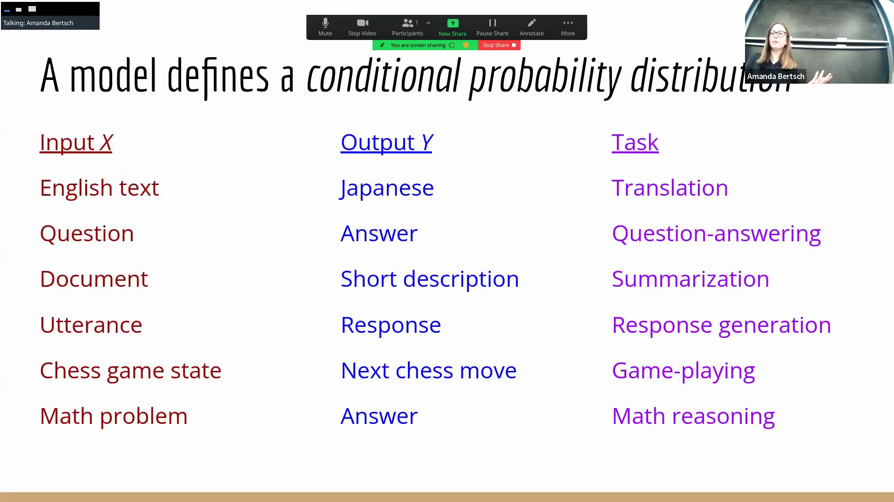
尽管现代模型架构的规模令人印象深刻（例如在数万亿词元(Token)上预训练的 70 亿参数模型），但其基本的数学本质却出奇地简单。这些模型的核心运作机制本质上就是条件概率分布。给定输入 `x` 和迄今已生成的序列，模型会计算下一个词元 `y_j` 的概率。根据链式法则(Chain Rule)，将这些逐步计算的概率相乘，即可确定在给定输入 `x` 的条件下，任意完整输出序列 `y` 的联合概率(Joint Probability)。最终，无论模型架构多么复杂、训练过程多么繁复，其本质都归结为一个单一且明确定义的数学函数：条件概率分布。

## 任务灵活性与概率输出的权衡
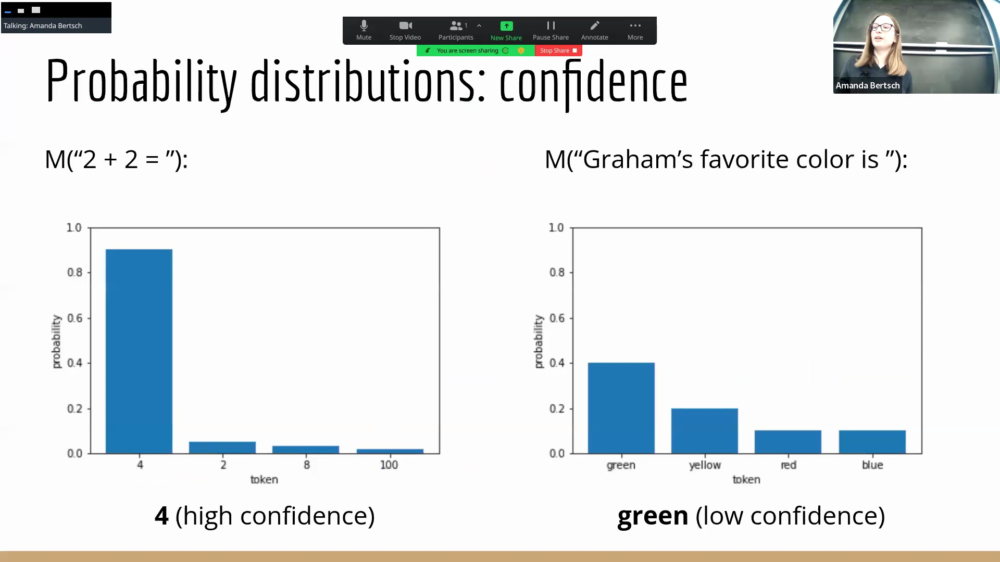
这种概率框架(Probabilistic Framework)赋予了模型非凡的灵活性。只需重新定义输入 `x` 和期望输出 `y` 的格式，同一个底层模型便能轻松适配机器翻译(Machine Translation)、文本摘要(Text Summarization)及复杂推理(Complex Reasoning)等多种任务。然而，这种设计也伴随着优势与权衡。其积极的一面在于，该分布为衡量模型置信度(Confidence)与校准度(Calibration)提供了天然的指标。对于 `2 + 2 =` 这类确定性提示(Deterministic Prompt)，概率质量(Probability Mass)会高度集中在正确的词元上，表明模型具有极高的置信度。相反，面对“预测某位历史人物最爱的颜色”这类开放式提示(Open-ended Prompt)，概率分布则会趋于平坦，反映出模型内在的不确定性。然而，其主要弊端在于，概率分布本质上会为错误、次优甚至冒犯性的输出分配非零概率。理论保证(Theoretical Guarantees)表明，无论训练数据多么纯净，总不可避免地会有部分概率质量“泄漏”至可能引发幻觉(Hallucination)或质量较低的词元中。

## 祖先采样(Ancestral Sampling)与长尾问题(Long-tail Problem)
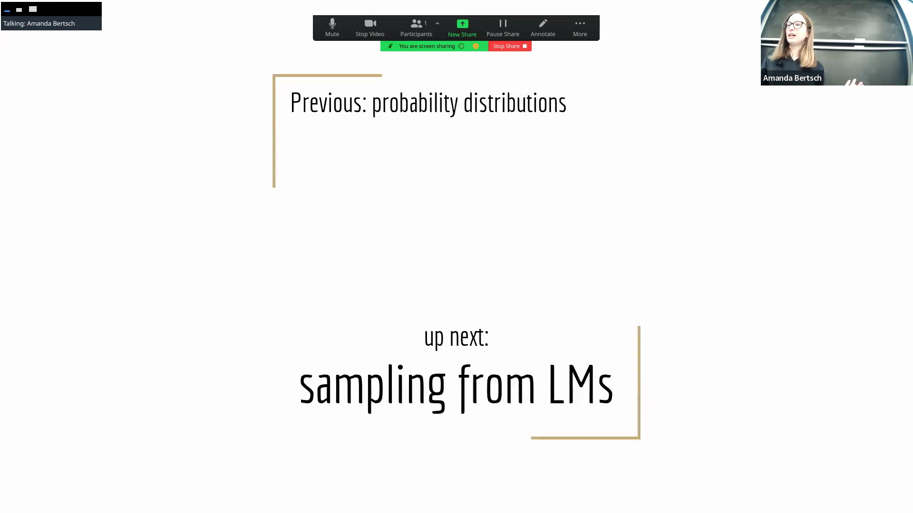
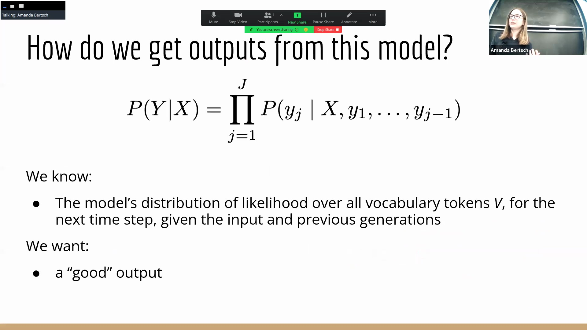
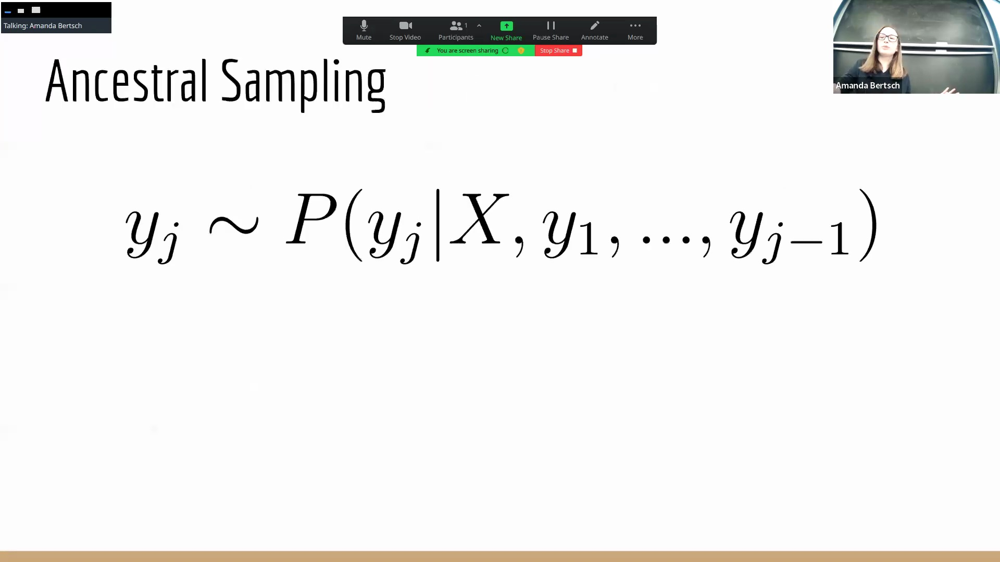
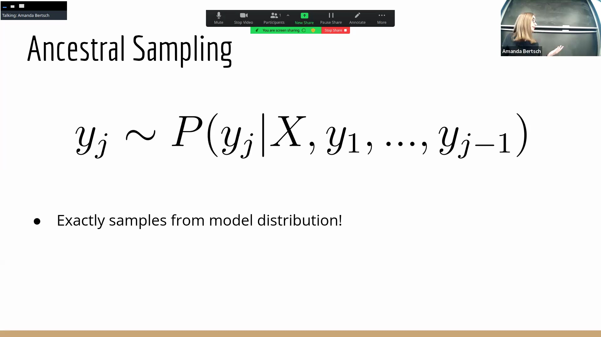
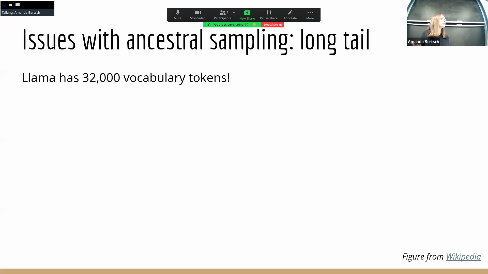
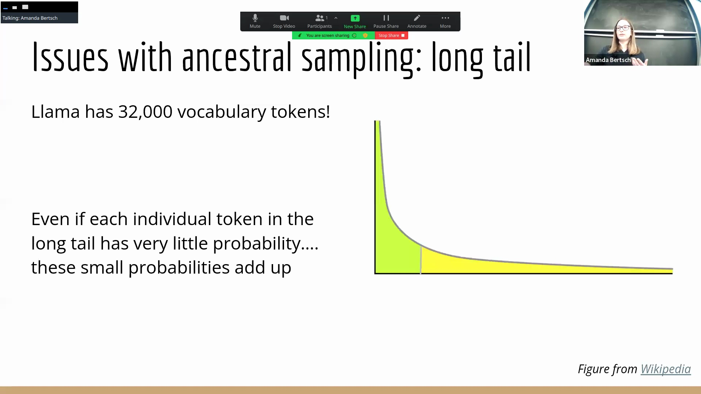
为了从该分布中获取有效输出，我们需要引入采样技术(Sampling Techniques)。最直接的方法是祖先采样，即在每个解码步骤(Decoding Step)中，严格按照词元被分配的概率进行随机抽取。尽管该方法能严格遵循模型的真实分布，生成数学意义上准确的样本，但它存在一个致命缺陷：长尾问题。在拥有庞大词表(Vocabulary)的模型（例如包含 32,000 个词元）中，数千个词元各自仅被赋予极低的概率。然而，将这些低概率词元累加后，长尾部分往往能占据总概率质量的相当大比例，通常高达 50% 左右。因此，祖先采样极易选中无意义或低概率的词元，从而导致生成内容缺乏连贯性。为此，必须在采样前采取特定策略对分布进行剪枝(Pruning)或约束。

## Top-K 采样(Top-K Sampling)：基于词元数量的约束
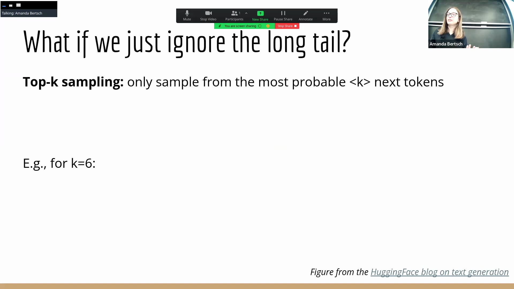
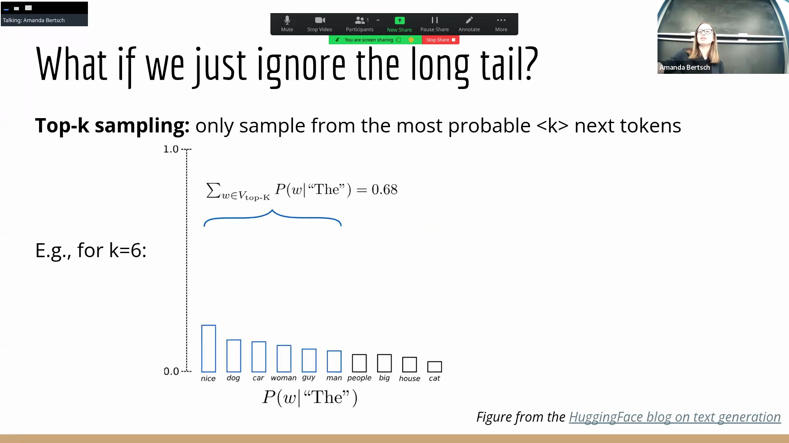
解决长尾问题的一种直接方案是 Top-K 采样。该方法在每一步生成时，将候选词元池严格限制为概率最高的 `K` 个词元。通过直接截断低概率的尾部区域，该方法显著降低了生成无关或无意义文本的风险。然而，Top-K 采样的效果高度依赖于概率分布的形态。在具有多个合理续写选项的平坦分布(Flat Distribution)中，固定的 `K` 值（例如 6）可能仅能覆盖极少部分的概率质量。相反，在由一两个词元主导的尖峰分布(Peaked Distribution)中，同样的 `K` 值却可能覆盖接近 100% 的概率质量。这虽然使约束极为有效，但也可能导致采样过程过于僵化。

## Top-P 采样(Top-P Sampling)、Epsilon 采样(Epsilon Sampling)与分布整形(Distribution Shaping)
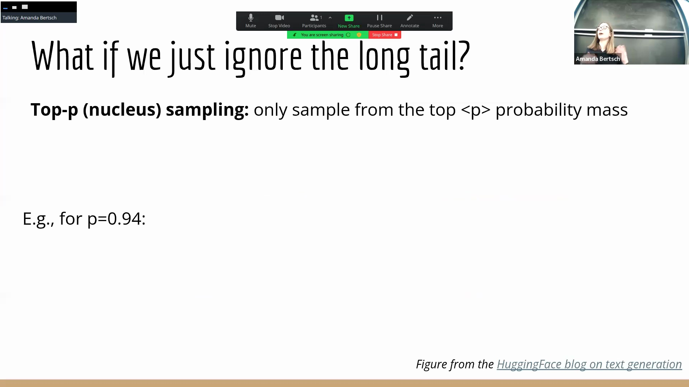
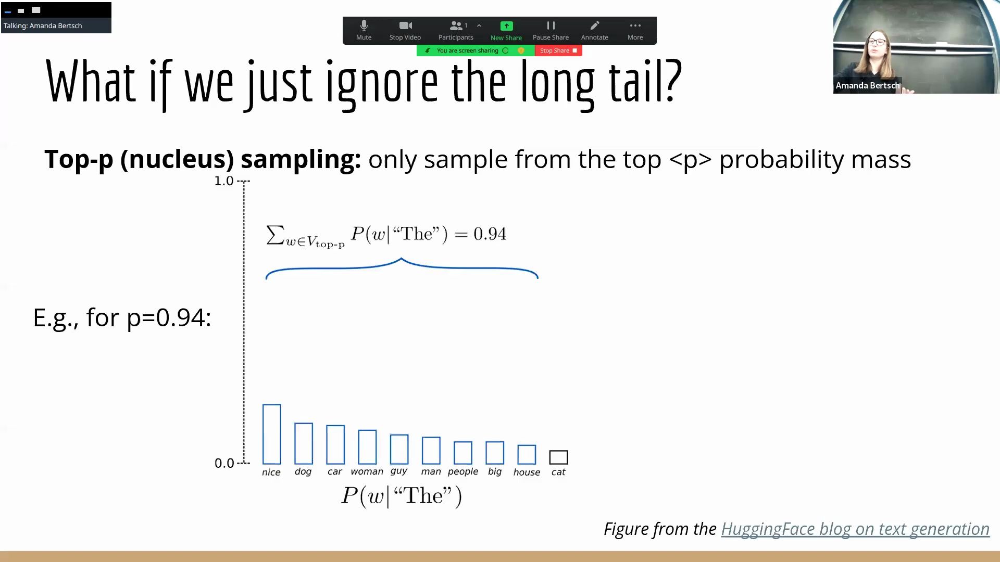

为克服 Top-K 采样的僵化缺陷，Top-P 采样（或称核采样(Nucleus Sampling)）引入了基于累积概率(Cumulative Probability)的动态阈值，不再依赖固定的词元数量。通过设定目标概率质量 `P`（例如 0.94），模型会按概率从高到低依次累加词元，直至累积总和达到或超过 `P`。该方法能够自适应概率分布的形态：当模型不确定性较高时，候选池会自动扩大以纳入更多词元；而当模型置信度较高时，候选范围则会迅速收缩至少数几个主导词元。另一种变体是 Epsilon 采样，它通过设定严格的绝对概率阈值(Absolute Probability Threshold)来过滤候选词元，确保仅保留概率不低于基线水平的词元。尽管这些方法成功裁剪了长尾，但它们并非优化生成的唯一手段。在进一步提升生成质量的逻辑链条中，下一步的关键操作是在采样执行前，对分布本身的形态（如峰值高度或尖锐程度）进行动态调整。

---

## 通过温度采样(Temperature Sampling)调节分布锐度
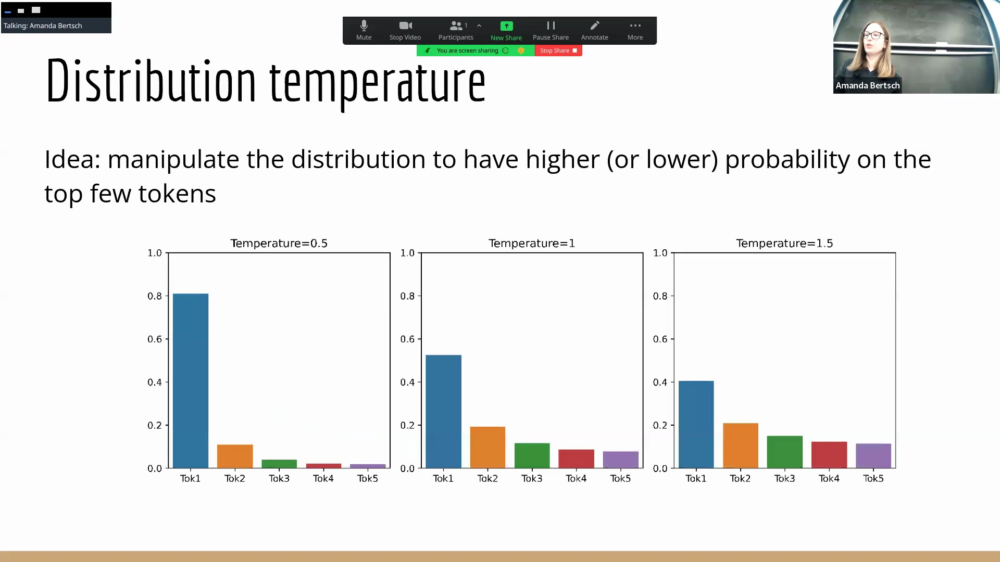
除了简单截断概率分布的长尾之外，我们还可以通过调整整个分布的“峰值”或锐度，来适配不同任务的需求。对于故事生成等开放式、创造性任务，我们通常期望输出更具多样性和新颖性。这可以通过使分布更加平坦来实现，即将概率质量(Probability Mass)更均匀地分散至更广泛的词元集合中。相反，对于数学推理等精确任务（通常仅存在一两个正确答案），我们可以使分布更加尖锐，将更多的概率质量高度集中于排名靠前的预测结果上。在技术实现上，这一过程通过修改模型的 Logits（Softmax 函数(Softmax Function)应用前最后一层的输出）来完成。在应用 Softmax 之前，将这些 Logits 除以一个称为**温度(Temperature)**的超参数，即可精准控制分布形态：温度大于 1 会使分布趋于平坦，而小于 1 则会使分布更加尖锐。将温度缩放机制与采样技术相结合的策略，被广泛称为温度采样。

## 对比解码(Contrastive Decoding)：利用弱模型优化专家输出
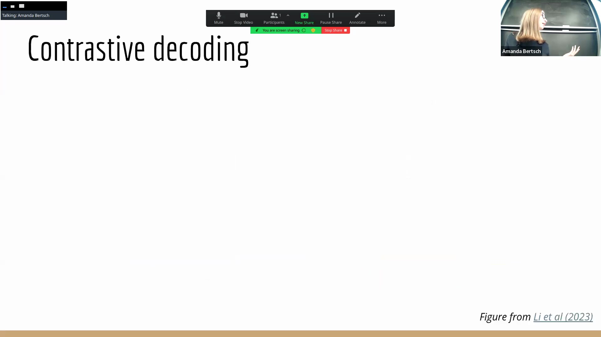
一种较新且更为复杂的分布修正方法是**对比解码(Contrastive Decoding)**。该方法旨在通过识别并利用较小或能力较弱模型（即“业余模型(Amateur Model)”）中常见的缺陷模式（如内容重复循环或事实性幻觉），来主动提升较大“专家模型(Expert Model)”的输出质量。其核心直觉十分明确：若专家模型为某一词元分配了高概率，而业余模型却认为该词元极不可能出现，则该词元往往代表了模型真正掌握的高级知识，而非某种退化模式(Degradation Pattern)。

在具体解码过程中，算法会在每一步将业余模型的概率分布从专家模型的概率分布中相减。例如，在生成关于贝拉克·奥巴马(Barack Obama)出生地的文本时，朴素采样或标准核采样(Nucleus Sampling)可能会产生重复内容或错误地点（如华盛顿特区）。引入对比解码后，算法会对两个模型均偏好的输出（如简单、重复的序列）施加惩罚，同时显著提升仅被专家模型判定为正确的词元（如准确的出生地信息）的概率。这一机制有效过滤了浅层或退化的生成行为，同时保留并强化了专家模型深层次的事实性理解能力。

## 实现细节与实际考量
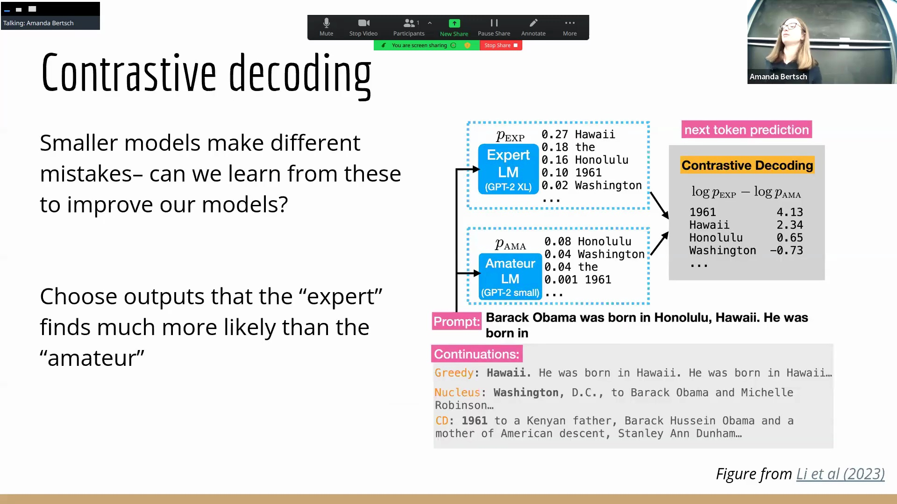
在实际应用对比解码时，需考虑以下几个关键问题。首先，概率减法操作需在序列生成的**每一个时间步(Time Step)**严格执行，而非仅针对模型高度不确定的时刻。其次，对“弱”模型的选择需经过审慎校准。业余模型的性能不宜与专家模型过于接近，否则相减操作可能会误删有效且高质量的候选输出；反之，其也不应因训练不足而无法捕捉基础的语言学特征或特定任务模式。理想的目标是构建一个均衡的模型对，使较弱模型能够作为已学习退化模式(Degradation Patterns)的“基线(Baseline)”，从而让对比机制有效隔离噪声，并放大专家模型的核心能力。值得注意的是，该流程完全在推理阶段(Inference Stage)运行，无需进行任何额外的模型训练。

## 贪婪解码(Greedy Decoding)与最优序列搜索
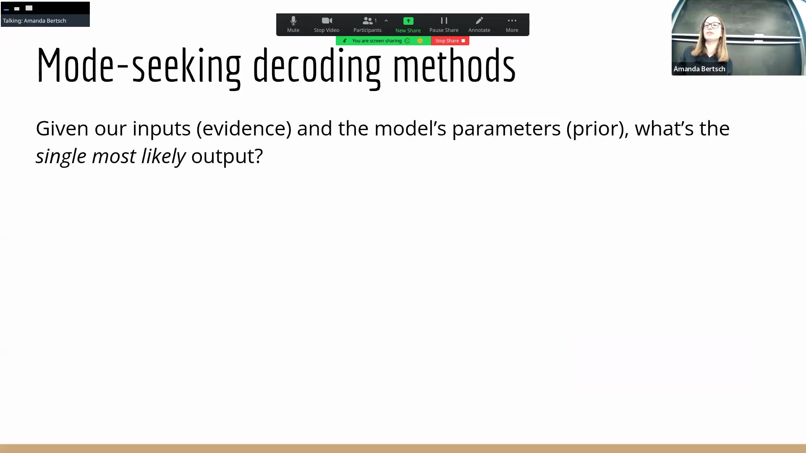
除基于采样的方法外，另一种思路是直接寻找全局概率最高的单一序列，即追求概率分布的全局最大值(Global Maximum)。实现这一目标最直观的方法是**贪婪解码(Greedy Decoding)**：在每一步生成中，算法仅选择当前概率最高的词元，直至生成停止词元(Stop Token)。尽管贪婪解码能保证每一步的局部预测最优，但它从根本上无法保证生成整个多词元序列的全局概率最高。
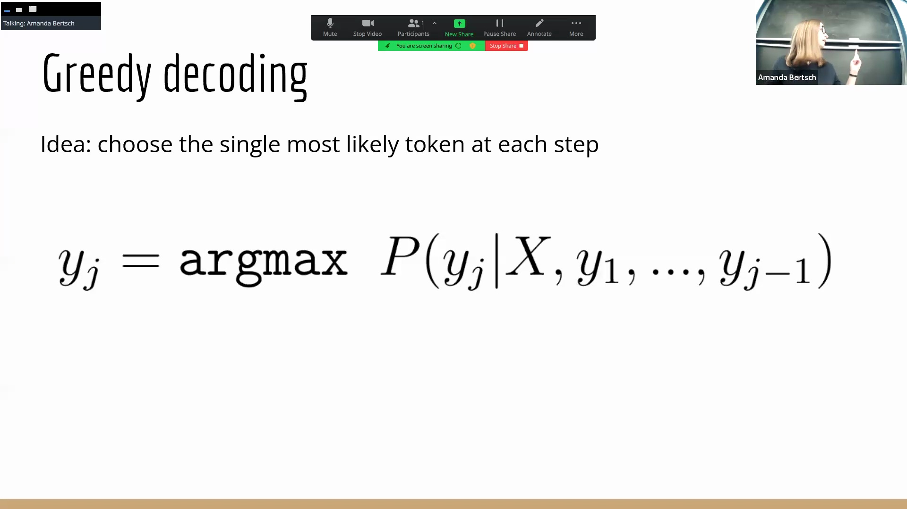
这一局限性源于序列概率的连乘特性。一个全局最优的句子，其首个词元在第一步的排名可能仅为第二或第三，但后续却能衔接一条累积概率极高的续写路径。由于贪婪解码完全受限于当前的局部最优选择(Local Maximum)，它会过早地剪枝这些潜在的更优路径，最终往往只能收敛至一个整体次优的序列。

## 集束搜索(Beam Search)简介
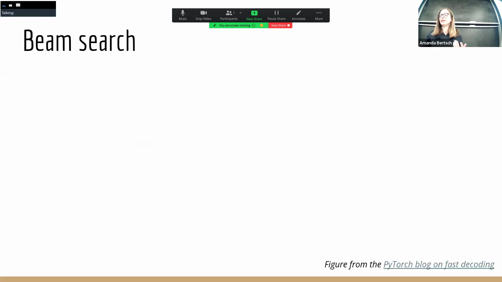
为克服贪婪解码的短视缺陷，**集束搜索(Beam Search)**被广泛采用为一种更为鲁棒(Robust)的搜索策略。集束搜索本质上是对序列空间进行广度优先探索。它不再追踪单一生成路径，而是在每个解码步骤中维护固定数量（`k`，即束宽(Beam Width)）的得分最高的部分序列(Partial Sequences)。在每一个时间步，算法会基于所有可能的下一个词元对当前候选序列进行扩展，计算其累积概率，并仅保留排名前 `k` 的序列进入下一轮迭代。该机制有效确保了那些以低概率前缀开头、但后续蕴含高概率路径的候选序列不会被过早丢弃，从而大幅提升了模型捕获全局最优解(Global Optimum)或接近最优的高质量序列的概率。

---

## 集束搜索简介
我们将考察下一个时间步(Time Step)的多种候选项(Candidates)。与贪婪解码(Greedy Decoding)逐词生成完整序列的方式不同，该方法通过在每个步骤中保留固定数量的候选序列，在一个“束(Beam)”中进行探索。在此例中，我们在第一个时间步保留了三个候选项。针对这三个候选项中的每一个，我们分别找出第二个时间步中概率最高的三个后续词元(Token)延续。因此，在每一步中，我们并非仅选择概率最高的单个词元，而是始终维护三个并行的候选序列。
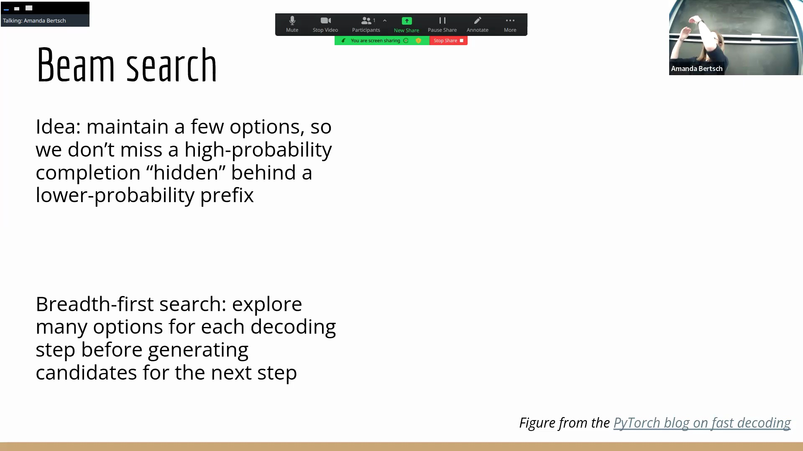

## 剪枝与序列选择
此时，第一个时间步的三个候选项在第二个时间步各自扩展出三个选项，总共形成九条路径。然而，若不加限制地持续扩展，将导致组合爆炸(Combinatorial Explosion)。为控制计算复杂度，我们通过计算双词元序列的联合概率(Joint Probability)对搜索空间进行剪枝(Pruning)，并保留整体概率最高的子集。在此例中，我们可能从第一组保留一条序列，从第二组保留两条序列，从而将候选序列数量重新缩减至三个，且每条序列长度均为两个词元(Token)。随后，我们在后续时间步继续生成，在每个阶段均通过剪枝保留排名靠前的候选项，直至序列生成结束。最终，我们只需从这三个候选序列中挑选概率最高的一条作为输出返回。
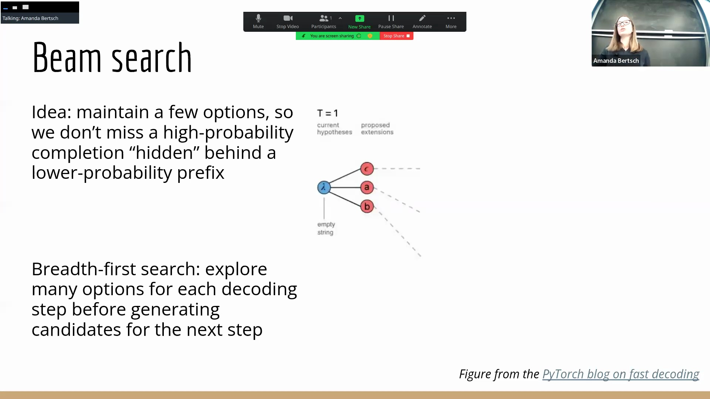

## 局限性与多样性问题
该方法并不能保证找到全局概率最高的序列，且仍面临在早期步骤中错误剪枝掉高概率路径的风险。然而总体而言，其表现远优于贪婪解码，在缺乏特定解码(Decoding)策略指导时，可作为可靠的默认选择。尽管具备上述优势，集束搜索(Beam Search)也存在显著缺陷。其中最突出的问题之一是，基于最大似然估计(Maximum Likelihood Estimation)的解码策略天生会牺牲输出多样性。最终生成的多个输出结果往往惊人地相似：尽管由不同的词元序列构成，但传达的语义内容几乎完全一致。
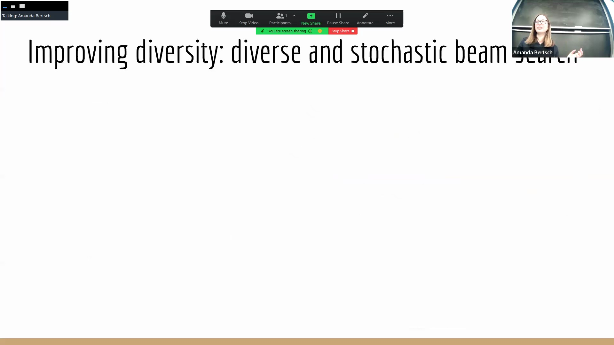

## 多样性集束搜索
为解决多样性匮乏的问题，研究人员开发了多种改进方法，旨在保留集束搜索优势的同时，仍以生成高概率序列为目标。多样性集束搜索(Diverse Beam Search)修改了束选择过程中的评分(Scoring)机制，明确引入约束以避免选择彼此过于相似的序列。例如，若概率最高的序列为 A，另一个候选项概率略低但与 A 高度相似，而第三个候选项概率略低但差异显著，算法将倾向于优先选择差异更大的序列。该方法通过修改评分函数，使其同时兼顾序列似然度(Likelihood)与束间相似度(Inter-beam Similarity)，从而最大化输出多样性，为后续生成步骤提供更丰富的候选空间。

## 随机集束搜索
另一种替代方案是随机集束搜索(Stochastic Beam Search)。该方法保留了标准的评分机制，但采用概率分布采样替代了确定性的 Top-K 选择(Top-K Selection)。在扩展每个束时，算法不再贪婪地挑选概率最高的词元，而是直接从模型输出的概率分布中进行采样（可通过直接采样、温度(Temperature)调节或 Top-p 采样(Top-p Sampling)实现）。其目标与多样性集束搜索类似：实现对模型输出空间更广泛的探索，避免最终收敛于高度相似的序列。
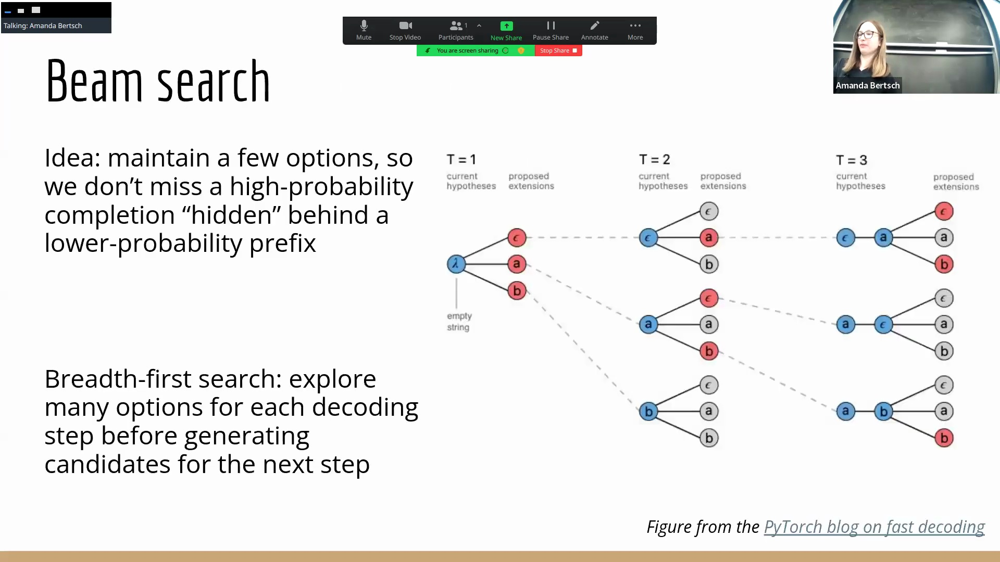

## 关于采样机制与相似度指标的问答
一个常见的问题是：如何衡量束之间的相似度？实际上，可采用任意相似度指标(Similarity Metric)，例如基于词元重叠率(Token Overlap)的计算（如对共享 50% 词元的序列施加惩罚）。随机集束搜索的一个关键特性在于其采用**无放回采样(Sampling Without Replacement)**机制。传统的有放回采样(Sampling With Replacement)可能生成重复的词元序列，而无放回采样则能确保每个被选中的候选序列都是唯一的。标准集束搜索总是返回概率排名前 k 的路径，而随机集束搜索在强制路径唯一性的同时，严格依照模型的概率分布返回结果，从而允许对概率分布的长尾(Long-tail)部分进行有效探索。
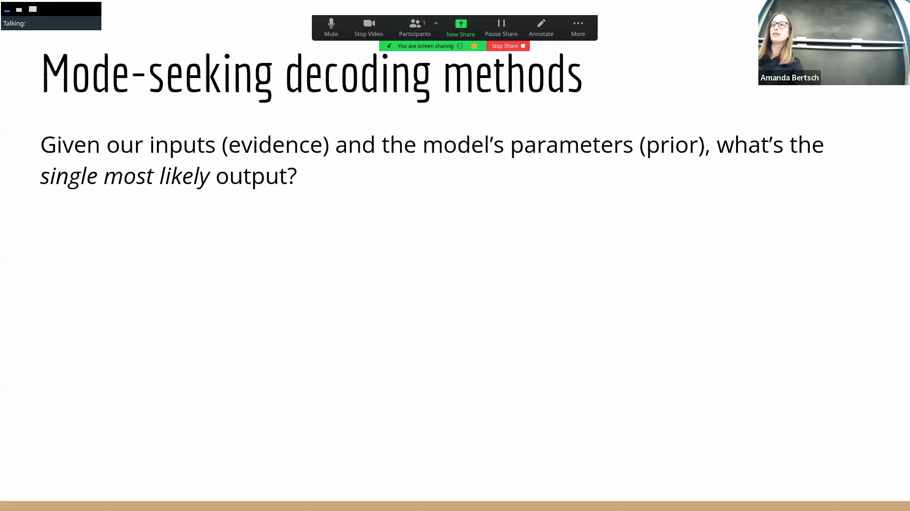
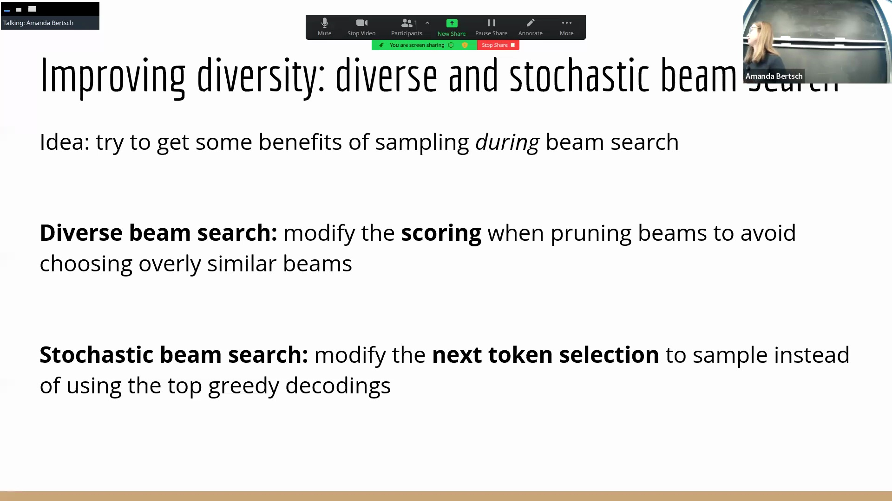

## 重新思考最大似然目标
迄今为止，我们探讨的方法均围绕寻找最可能序列的优化目标展开。然而，我们需要重新审视：最大化生成概率真的是文本生成的终极目标吗？众所周知，极低概率的输出往往语义不通或逻辑断裂（例如，在给定提示(Prompt)后，“猫长出了翅膀”比“猫坐了下来”的概率低得多，且上下文连贯性较差）。然而，在中等至高概率的输出区间内，概率高低并不必然与文本质量或人类偏好正相关。“猫坐了下来”一定优于“猫跑开了”吗？尽管两者概率存在细微差异，但均为合理的表达。这一复杂性表明，严格追求最大似然序列(Maximum Likelihood Sequence)未必始终契合以人类为中心的生成目标，这也促使研究转向基于采样的策略(Sampling-based Strategies)，将文本质量与多样性置于原始概率分数之上。

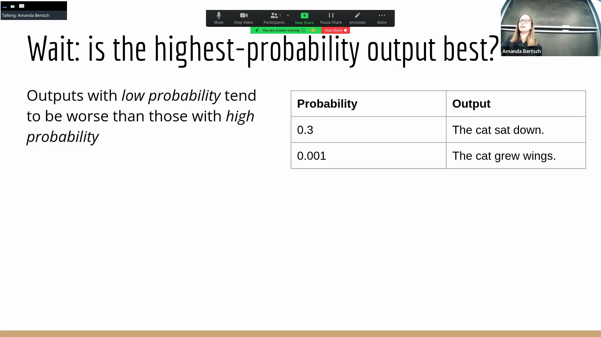

---

## 概率质量与最大似然
在评估生成输出时，我们不应仅局限于单个词元序列(Token Sequence)，而应着眼于更广泛的概率分布(Probability Distribution)。例如，给定一个关于猫的提示(Prompt)，概率最高的单一输出可能是“猫坐了下来”，而“跑开了”、“飞奔而去”或“溜走了”等其他选项的概率则略低。像“它长出了翅膀”这类语义荒谬的选项，其概率则最低。若严格遵循最大似然解码(Maximum Likelihood Decoding)，我们将直接输出“坐了下来”。然而，该方法忽略了一个关键细节：表达“猫离开了该区域”这一语义的概率质量(Probability Mass)实际上分散在了三个不同的有效序列中。将这三者的概率相加，其总概率将是单个最高概率序列的两倍。最大似然搜索无法捕捉到这种语义层面的共识(Semantic Consensus)。
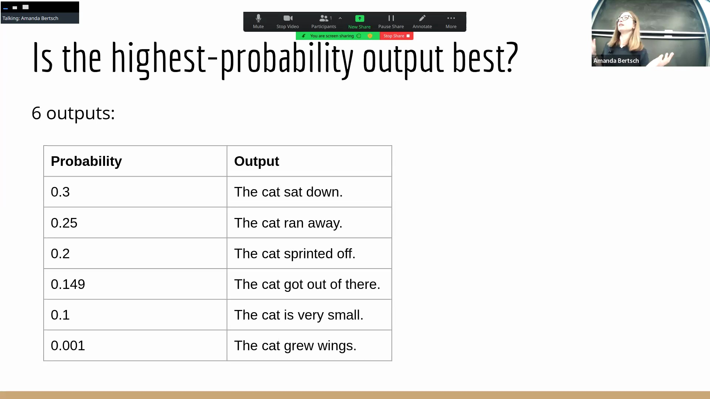

## 重新思考输出质量：共识与风险
这引出了一个根本性问题：若概率并非衡量生成质量的唯一指标，那么何种标准才能使输出真正卓越？我们需要区分单一的高概率孤立序列(Isolated Sequence)与一组共享相似语义的中等概率输出集合。采用基于输出集群(Output Clustering)的解码策略，本质上具有更低的风险。试想一个假设性类比：当你向同伴征集答案时，若仅有一名顶尖学生给出答案 A，而其余所有同学均给出答案 B，那么选择答案 B 能最大程度地降低决策风险。孤立序列虽可能极其准确，但也可能是罕见的错误，而共识则提供了更为稳妥的选择。因此，我们的目标应是寻找在相对高概率与低风险（即高一致性/High Consistency）之间取得最佳平衡的输出。
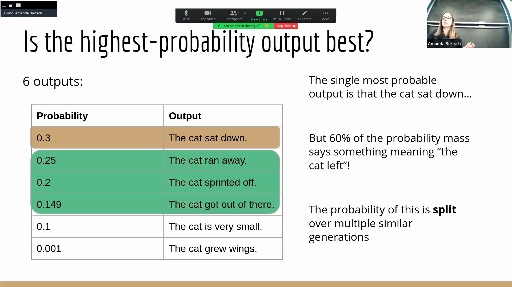
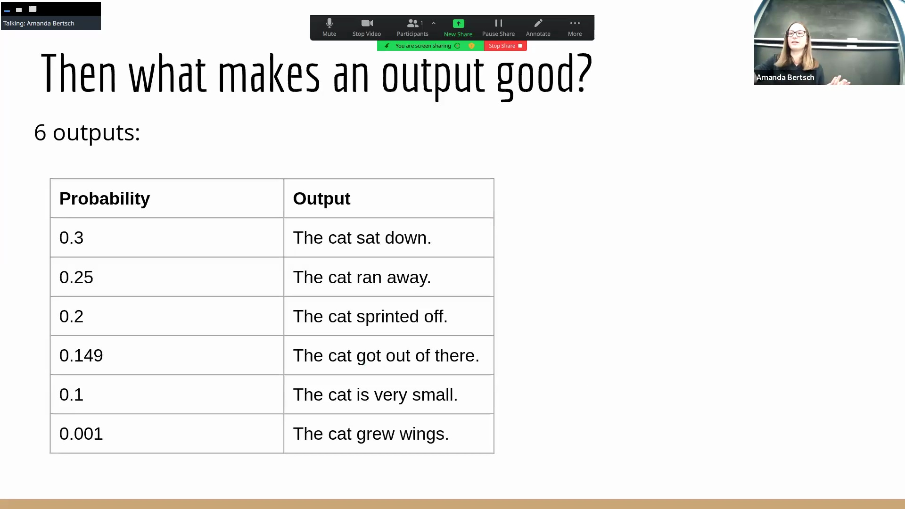
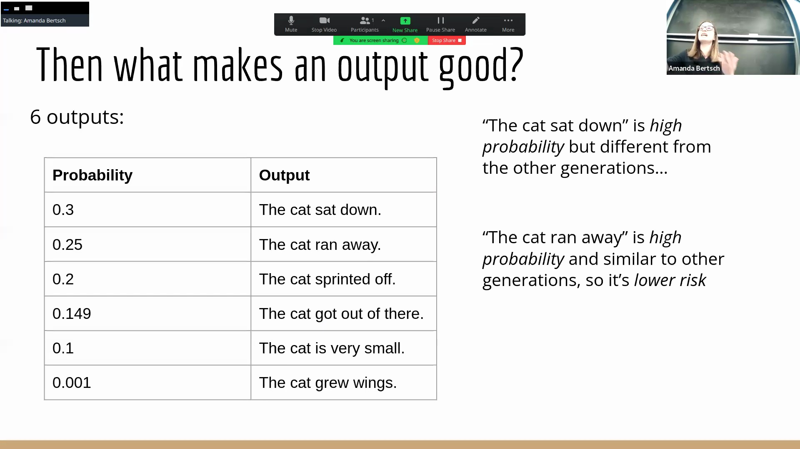

## 通过采样估计概率与风险
为将这一理念付诸实践，我们需要可靠的方法来估计概率与风险。概率可通过蒙特卡洛采样(Monte Carlo Sampling)进行近似估计：从模型中抽取大量但数量可控的序列（例如 100 个），即可通过统计频率来近似底层概率分布(Underlying Distribution)。风险估计(Risk Estimation)则将这些采样输出视为伪参考序列(Pseudo-references)。随后，利用成熟的评估指标(Evaluation Metrics)计算候选输出与样本集中其余输出之间的一致性或相似度。
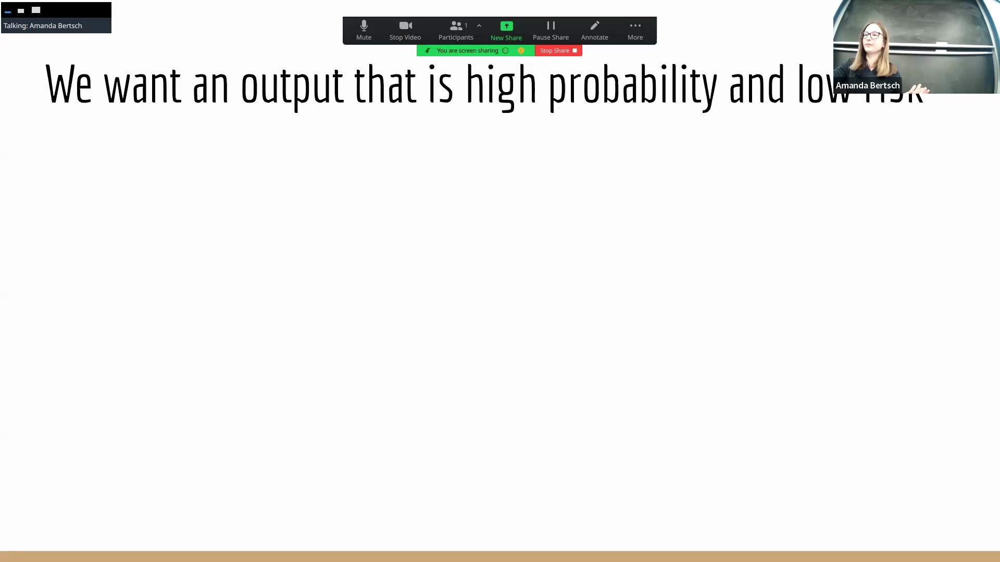

## 最小贝叶斯风险（MBR）解码
这一理论框架自然引出了最小贝叶斯风险(Minimum Bayes Risk, MBR)解码。MBR 通过在采样分布中最小化期望损失(Expected Loss)（或最大化期望相似度(Expected Similarity)），将“选择低风险、高共识输出”的直觉进行了数学形式化。该方法会依据每个伪参考序列的概率，对其相似度得分进行加权处理。实践表明，在文本摘要任务中应用 MBR（以 ROUGE 指标作为相似度度量，并抽取 100 个样本），其表现稳定优于标准解码、集束搜索(Beam Search，束宽为 5 或 10)以及多样性集束搜索(Diverse Beam Search)。尽管当 MBR 优化指标与下游评估指标(Downstream Evaluation Metrics)一致时性能提升最为显著，但即便两者不同，其性能改进依然保持稳健。
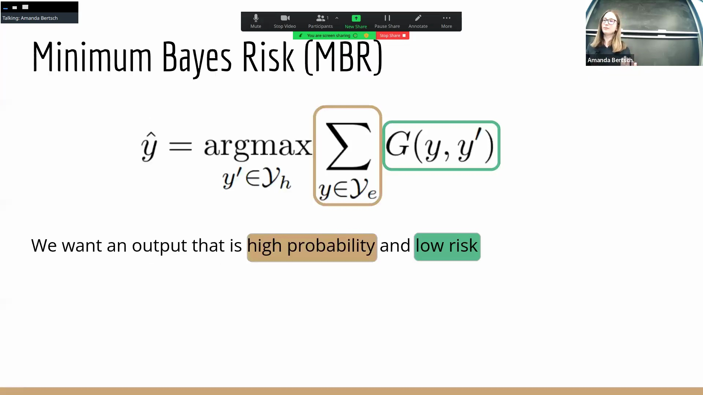
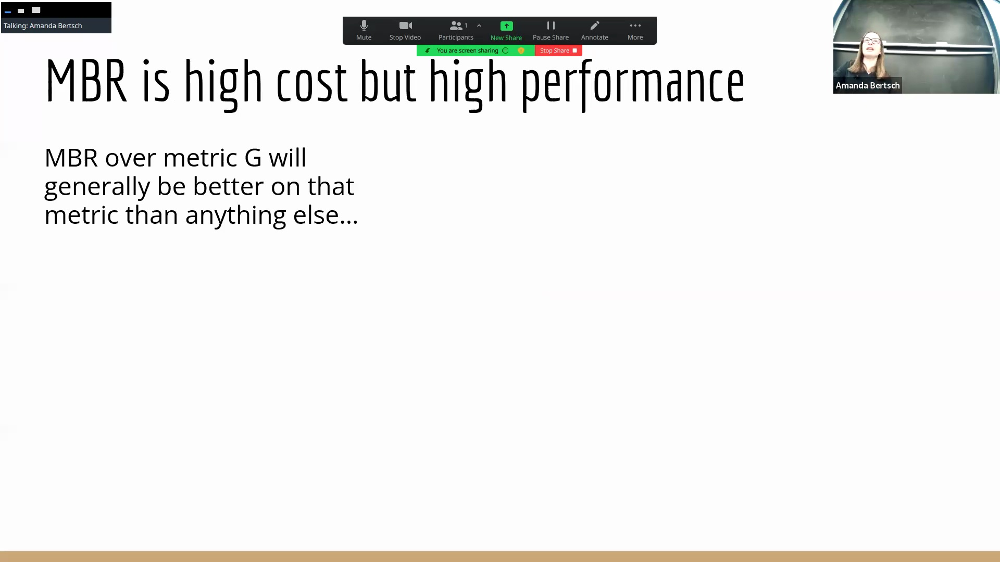
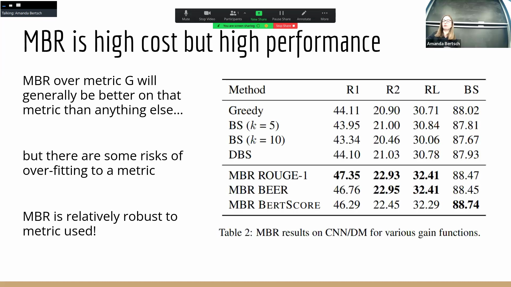

## 权衡：计算成本与集束搜索的诅咒
MBR 的主要缺点是计算成本(Computational Cost)高昂。与单次解码(Single-pass Decoding)方法相比，在推理(Inference)阶段生成并交叉比对 100 个候选序列不仅速度更慢，且资源消耗显著增加。此外，课程还探讨了一个被称为“集束搜索的诅咒(Curse of Beam Search)”的著名现象。尽管理论上增加束宽(Beam Width)应能更有效地逼近真正的最大似然序列，但这往往会导致下游任务的性能不升反降。这是因为概率分布的绝对数学众数(Mathematical Mode)往往并非人类最偏好或上下文语境中最优的输出，这进一步凸显了采用基于共识的解码方法（如 MBR）的必要性。
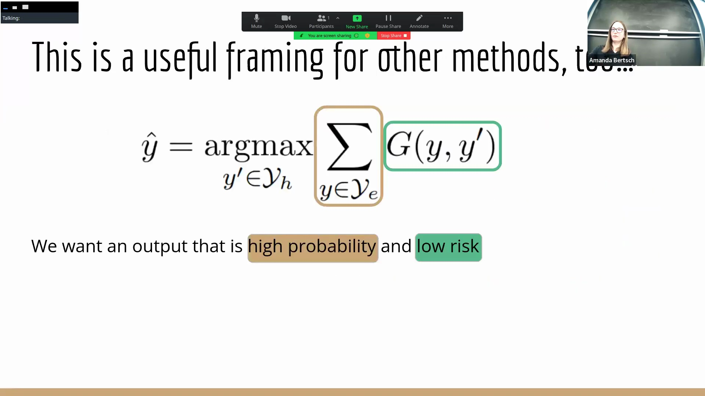

## 训练目标与模型退化
这一解码挑战与语言模型(Language Model)的训练方式密切相关。最大似然估计(Maximum Likelihood Estimation, MLE)旨在优化模型准确拟合潜在答案完整概率分布的能力，而非显式地最大化单一最佳回答的质量。面对开放式或复杂的提示，安全且通用的回答（例如“我不知道”）所占据的概率质量通常远超任何具体、详实回答的概率。因此，采用 MLE 训练的模型可能会表现出退化行为(Degenerate Behavior)，例如生成过短文本、陷入重复循环(Repetition Loop)，甚至输出空序列。从数学角度看，这些结果可能恰恰代表了模型所学分布的真实众数。
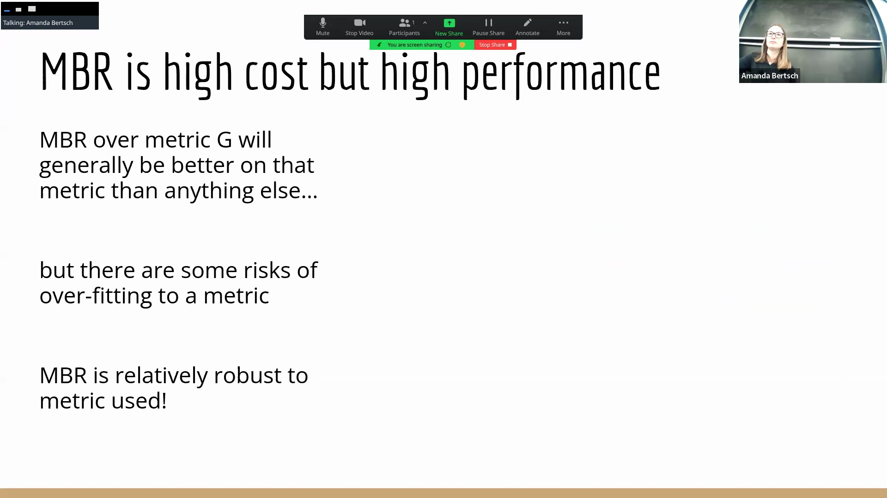

---

## 置信度与语义校准
模型的置信度得分(Confidence Score)通常仅反映单一确切词元序列(Token Sequence)的概率，而未能捕捉更广泛的语义空间(Semantic Space)。生成任务中的真实置信度应当考虑所有传达相同底层含义的序列的聚合概率(Aggregated Probability)。厘清这一区别，是应对当前持续挑战、校准语言模型(Language Model)以实现可靠长序列生成的基础。
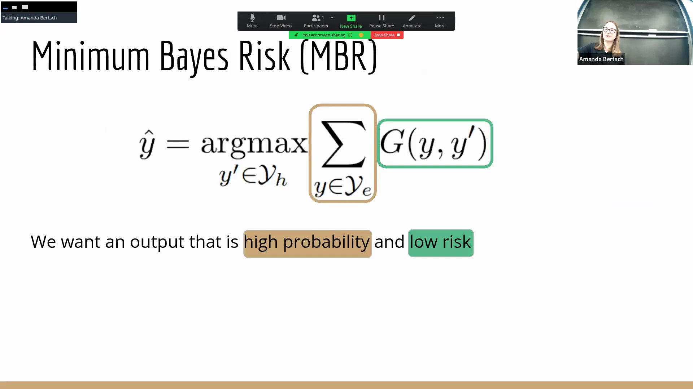

## MBR 变体：输出集成与自洽性
最小贝叶斯风险(Minimum Bayes Risk, MBR)框架很自然地延伸到了各类推理时策略(Inference-time Strategies)中。跨模型**输出集成(Output Ensembling)**将来自不同模型架构(Model Architectures)的生成结果视为一个统一集合，利用嵌入相似度(Embedding Similarity)来识别达成跨模型共识的回答。另一个强大的变体是**自洽性(Self-Consistency)**，在数学或逻辑推理任务中尤为有效。该方法通过提示(Prompt)模型生成思维链(Chain-of-Thought)、采样多条推理路径，并忽略中间推导步骤，直接对最终答案进行多数投票(Majority Voting)，从而优先选择出现频率最高的结论。这实质上是一种采用精确匹配(Exact Match)指标的 MBR 方法，其核心在于倾向于选择高概率、低风险的共识结果，而非依赖单一推理轨迹(Reasoning Trajectory)。
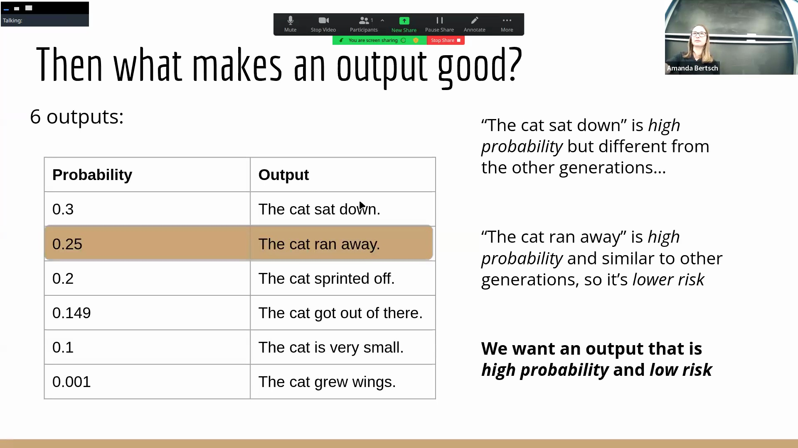
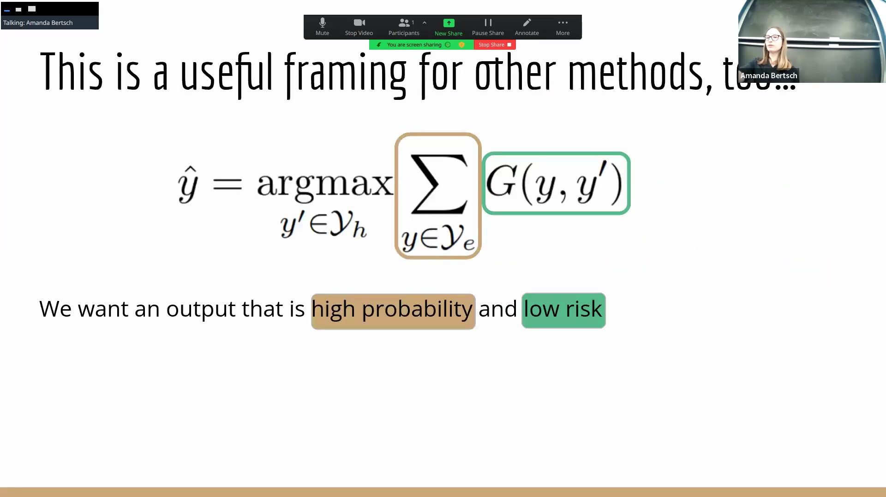

## 推理范式与伪参考序列要求
文本生成技术通常可分为三大范式：直接采样(Direct Sampling)、结构化搜索(Structured Search，如集束搜索)和样本重排序(Sample Reranking，如 MBR)。一个常见的疑问是：为何仅对模型权重进行平均(Weight Averaging)不被归类为 MBR？MBR 的决定性特征在于，需将候选输出与多个伪参考序列(Pseudo-references)进行显式比较，以量化风险与一致性(Consistency)。权重平均仅仅是将多个概率分布合并为一个新的单一模型分布，完全跳过了基于共识进行选择时所必需的、对生成序列进行交叉比较的关键步骤。
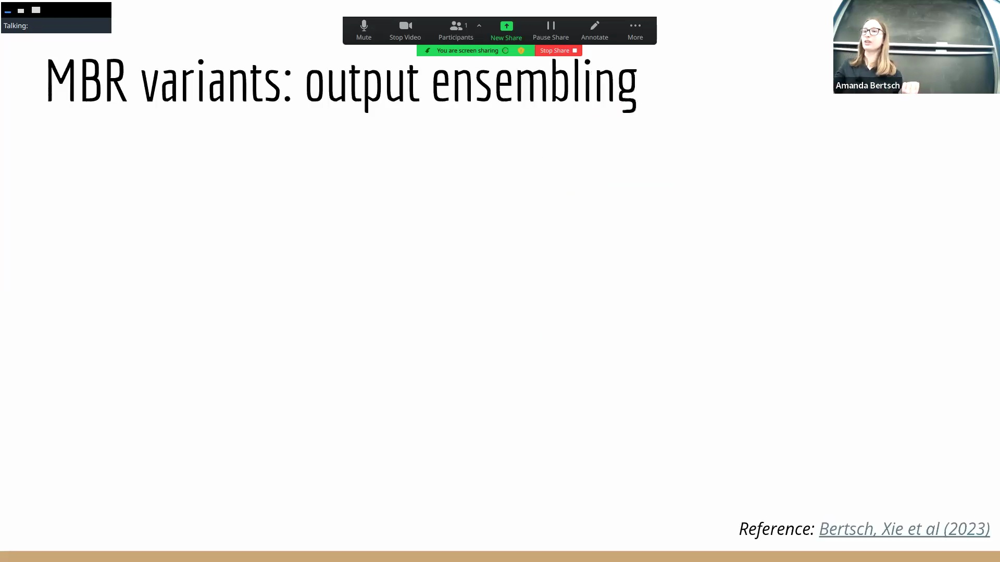

## 朴素约束执行的挑战
除了优化通用质量(General Quality)外，实际应用场景往往施加严格的约束条件(Constraints)，例如禁止模型提及特定主题。尽管提示指令(Prompt Instructions)提供了一个初始切入点，但其固有的脆弱性(Fragility)众所周知；随着模型输出发生漂移或寻找到语义上的变通途径(Semantic Workarounds)，这些约束极易被绕过。一种更为直接的干预方法是 Logits 调整(Logit Adjustment)：在 Softmax 操作之前，对禁止词元(Forbidden Tokens)施加极大的负偏置，强制将其生成概率降为零。然而，该方法过于僵化。它缺乏上下文感知能力(Context Awareness)（例如会错误地屏蔽词汇在特定语境下的正面用法），难以处理多词元短语(Multi-token Phrases)，且无法应对生成序列后期出现的语义关联词或同义词。
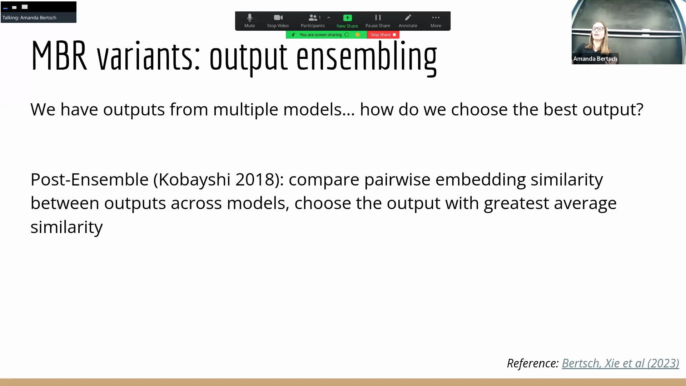
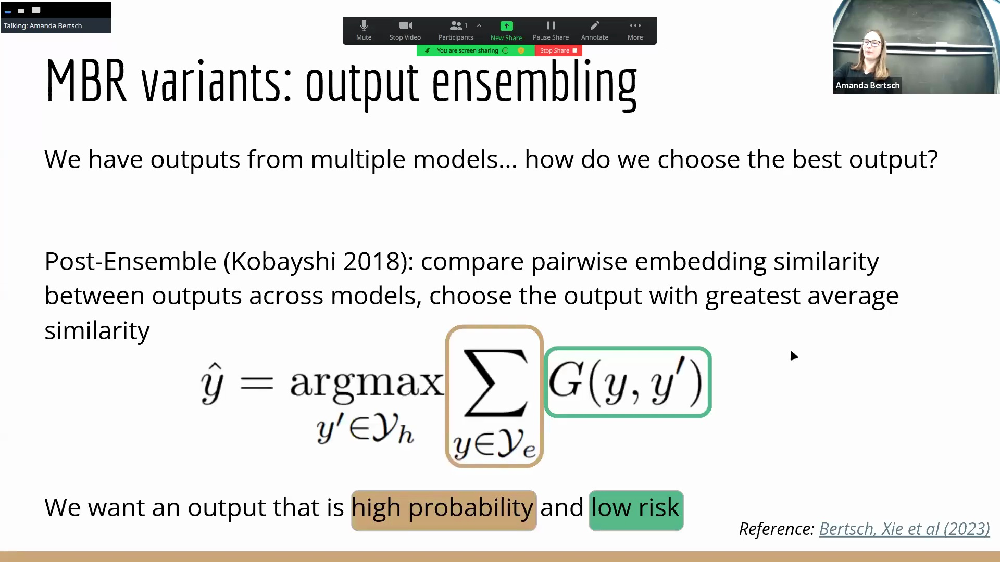

## 拒绝采样的低效性
另一种常见策略是拒绝采样(Rejection Sampling)：批量生成候选输出，利用分类器(Classifier)或关键词过滤器(Keyword Filter)验证其合规性(Compliance)，并直接丢弃任何违反约束的结果。尽管事后验证(Post-hoc Verification)逻辑直接，但当约束条件与模型固有的训练倾向(Inherent Training Bias)发生冲突时，该方法的计算开销(Computational Overhead)将呈指数级增长，变得难以承受。若模型强烈倾向于生成被禁止的内容，为获取单个合规输出可能需生成并过滤数十万份样本，这使其完全无法胜任实时(Real-time)或大规模可扩展(Scalable)的推理任务。
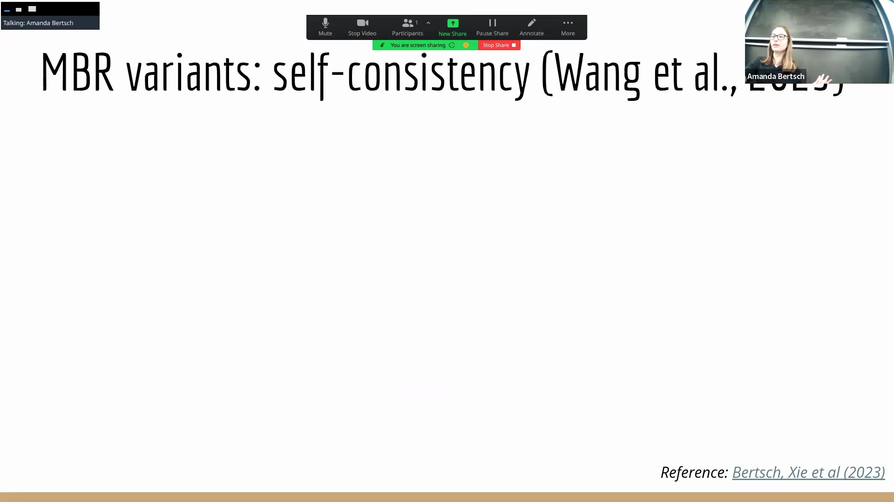

## FUDGE：动态约束感知解码
为克服上述局限，**FUDGE** 等前沿方法将约束处理(Constraint Handling)直接集成至解码过程(Decoding Process)中。与传统屏蔽词元或事后过滤完整序列的做法不同，FUDGE 通过将基础模型(Base Model)的词元分布与来自约束预测模型(Constraint Predictor)的辅助分布(Auxiliary Distribution)相融合，实现对生成过程的主动引导。例如，若需强制文本语气正式，辅助模型会实时估算当前已生成的部分序列最终满足该约束的概率。通过将两者分布相乘，解码步骤会动态调整权重，优先选择在语言模型下概率较高、且极可能满足目标约束的词元。该方法无需依赖高昂的拒绝循环(Rejection Loop)成本，即可高效生成合规文本。
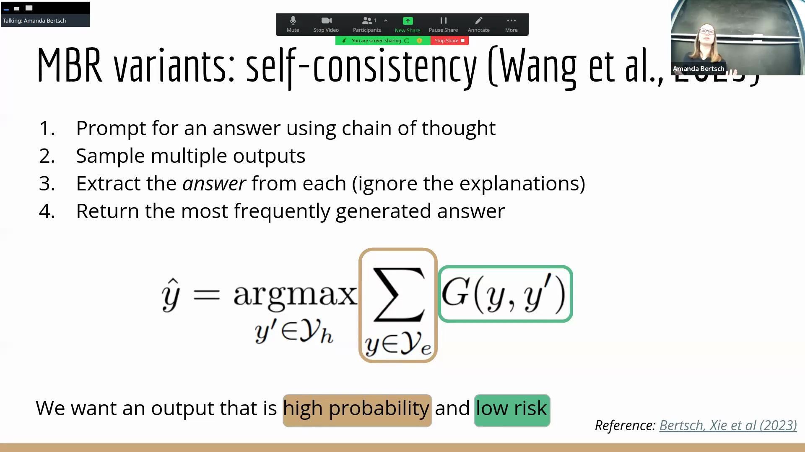
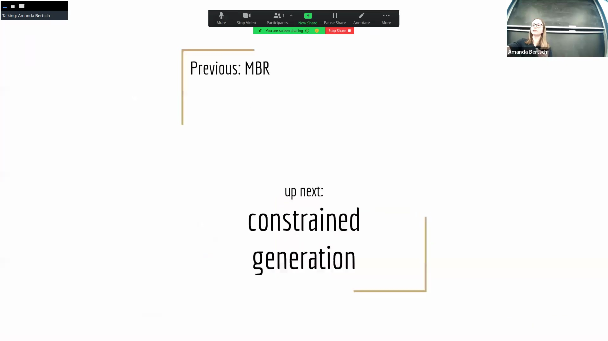
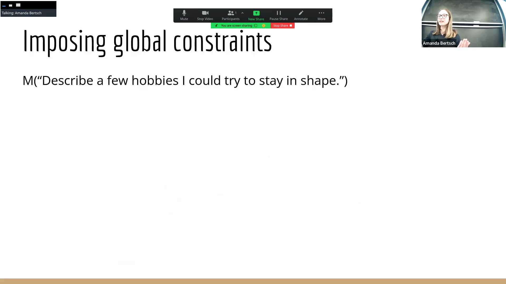

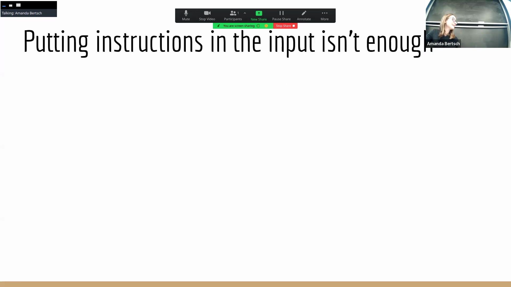

## 机制与预测性引导
FUDGE 的核心创新在于其能够基于部分生成序列(Partially Generated Sequence)，实时预测最终输出对约束条件的合规性。这种预测性引导(Predictive Guidance)在每一个词元生成步骤中持续重塑采样分布(Sampling Distribution)，确保所生成的序列从起始到终结均能自然地与目标属性(Target Attribute)保持一致。该方法的命名巧妙契合了其机制：它采用一种温和且前瞻的引导策略，在完整生成周期内持续推动模型满足约束条件，而非依赖突兀的硬性修正、僵化的词元屏蔽或低效的后处理过滤器(Post-processing Filters)。
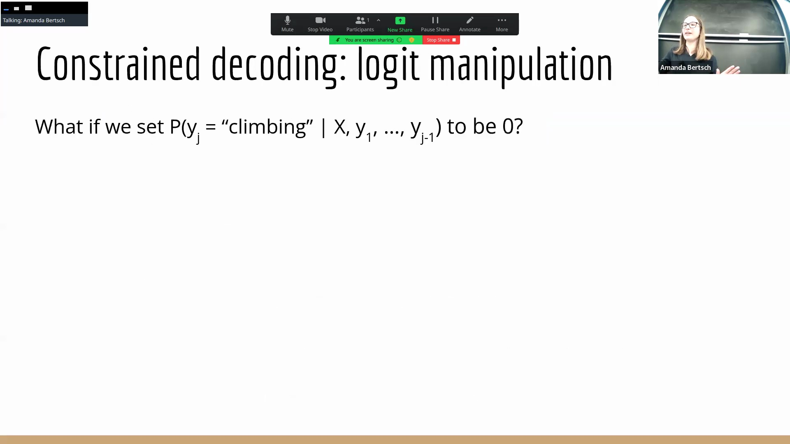
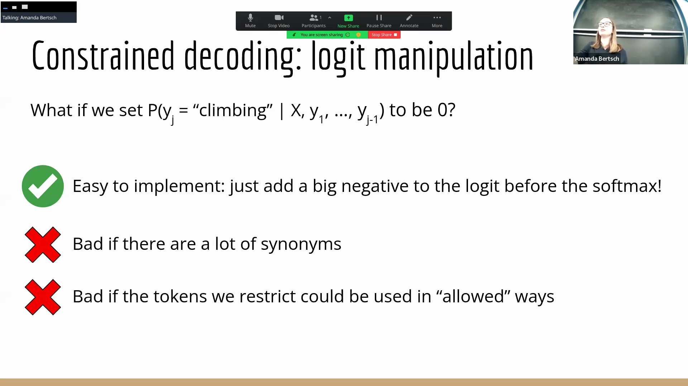
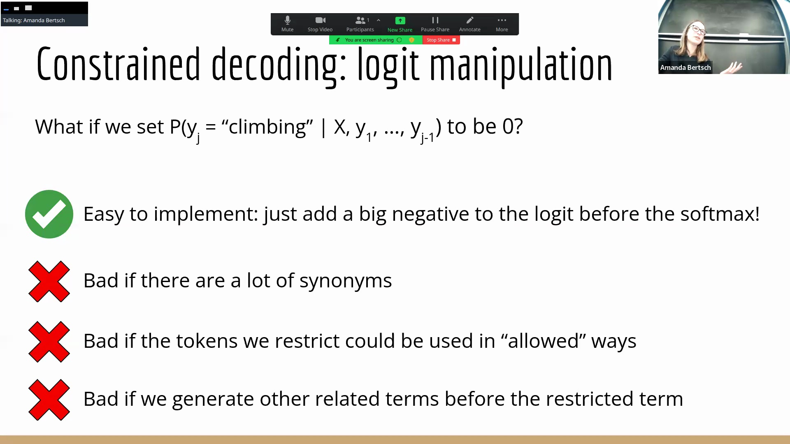

---

## FUDGE 与未来判别器简介
FUDGE 一词源于“未来判别器”(Future Discriminator)。该方法通过在句子前缀(Sentence Prefix)上训练模型，以预测最终生成的完整序列是否满足特定约束条件(Constraint，例如语体正式程度)。通过将正式与非正式数据集中的句子拆分为前缀序列，判别器能够学习估算部分生成的序列最终属于目标类别的概率。
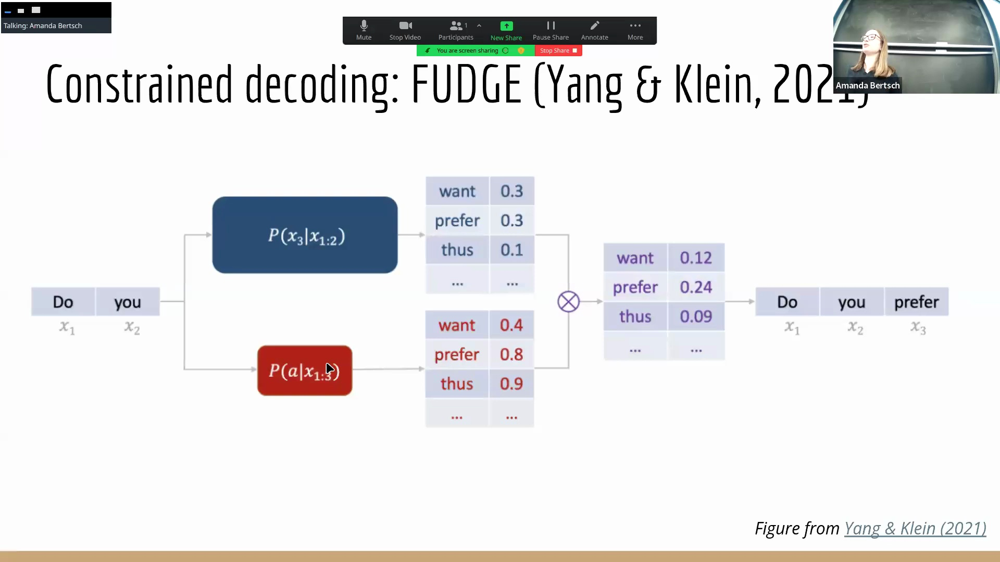

## 从 RLHF 到贝叶斯推断的转变
尽管受限解码(Constrained Decoding)传统上侧重于结构约束，但其另一核心目标是使模型输出与人类偏好保持一致，这通常通过基于人类反馈的强化学习(Reinforcement Learning from Human Feedback, RLHF)实现。RLHF 将基础模型(Base Model)的概率分布与奖励模型(Reward Model)的评估信号相结合，经微调后得到一个倾向于生成高奖励序列的“已对齐模型”(Aligned Model)。本质上，该过程可视为贝叶斯推断(Bayesian Inference)，其目标分布在数学上等价于基础模型的似然函数(Likelihood Function)与满足特定奖励条件概率的结合。
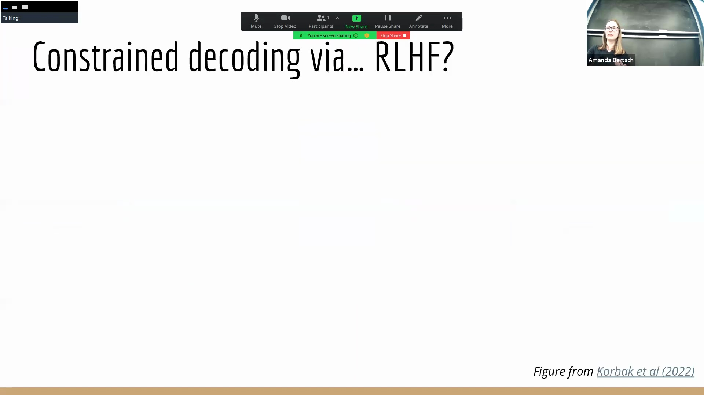
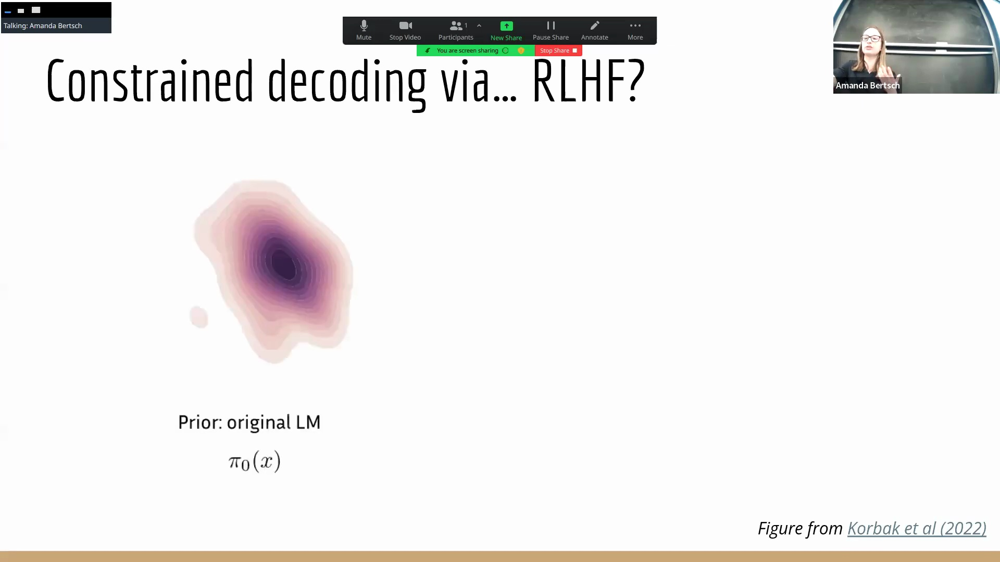
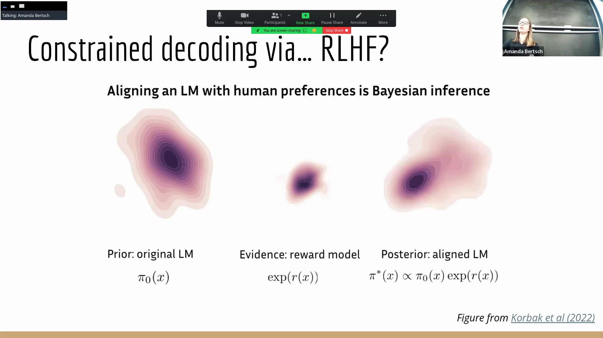

## 无需强化学习的解码时对齐
在认识到 RLHF 本质上是概率分布的融合后，研究人员提出了在解码阶段(Decoding Stage)直接施加外部约束的方法，从而避免了高昂的模型微调成本。近期的一种方法在生成的每一步都会预测序列的预期奖励。通过利用基于前缀训练的奖励预测器（其机制类似于未来判别器），系统可评估每个候选词元(Token)的潜在奖励。最终词元的选择，是通过将基础语言模型(Base Language Model)的输出概率与这些预测奖励进行加权融合后计算得出的。
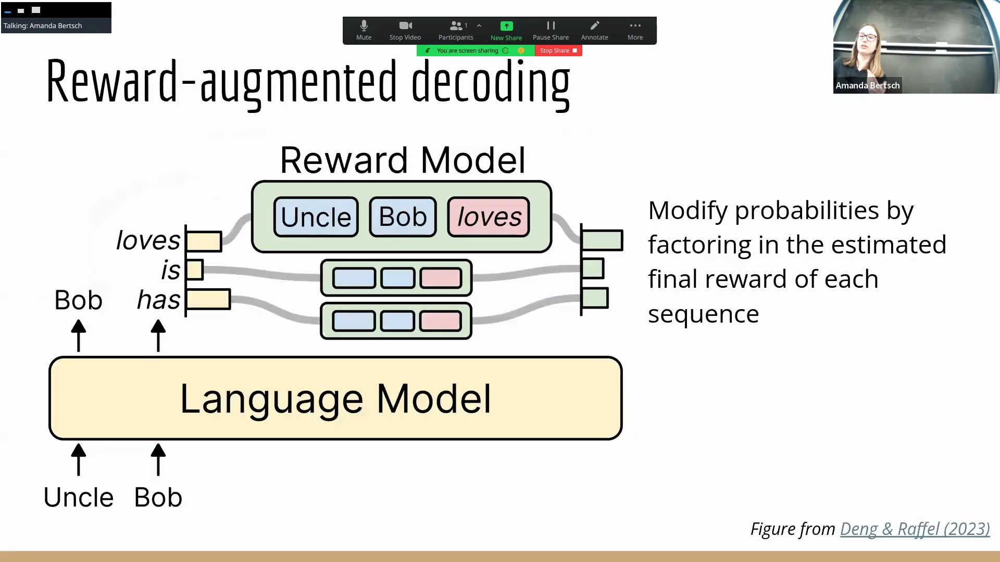

## 解码时约束整合的优势
这种解码时策略(Decoding-time Strategy)无需进行实际的强化学习训练，即可实现 RLHF 的诸多对齐优势。它将人类偏好匹配与约束满足转化为模块化的动态参数，可在生成过程中实时施加。这种灵活性不仅显著降低了计算开销(Computational Overhead)，也大幅简化了对齐语言模型在多场景下的部署流程。
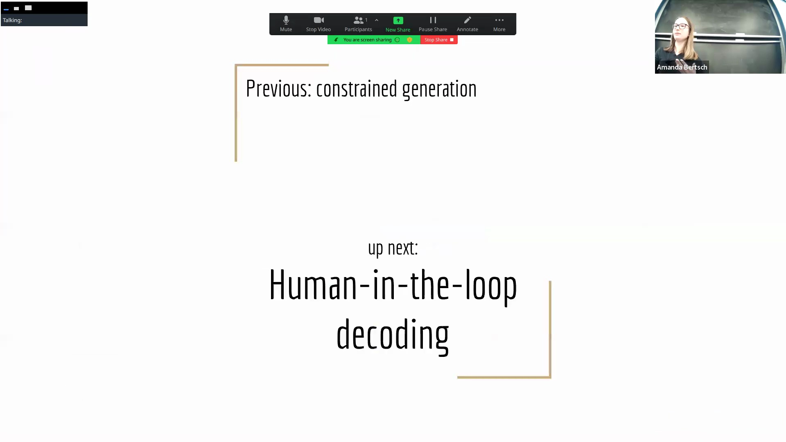

## 问答：判别器训练与计算效率
约束判别器的训练需针对每种约束条件提供标注的正负样本(Positive/Negative Samples)。尽管引入新约束通常需要重新训练模型，但其计算负担依然较低。判断序列是否违反约束是一项远轻于预测下一个词元(Next-token Prediction)的任务，因此开发者可采用参数量相对较小的分类器(Classifier)。即便需处理多个约束（例如输出 100 维向量），与标准词表上的 Softmax 操作（维度通常超 32,000）相比，其额外引入的推理成本(Inference Cost)也微乎其微。

## 问答：处理负向约束与奖励模型适配
为强制执行负向约束(Negative Constraints，如规避特定主题)，可训练统一的多标签判别器(Multi-label Discriminator)，或聚合多个专用模型的评分，并利用最大违规得分(Maximum Violation Score)来引导或阻断生成过程。在解码时对齐框架中，奖励模型通常基于标准的 RLHF 偏好数据集进行适配。该模型不再对完整序列进行整体打分，而是基于序列前缀进行训练以预测下游奖励值；期间常辅以数据增强(Data Augmentation)技术来提升预测精度，且无需对基础模型进行全量重训。
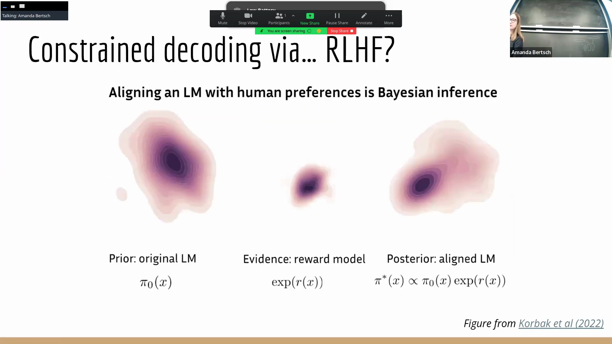
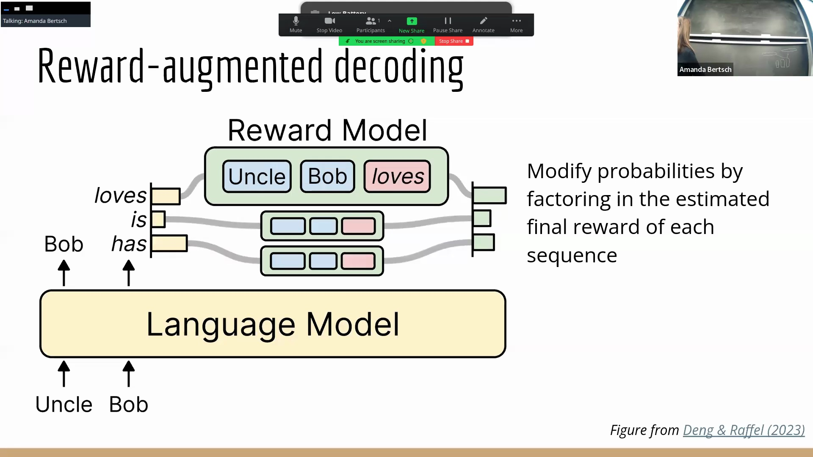

## 问答：实际应用与自我验证策略
该技术的实际应用范围广泛，涵盖提升对话系统的共情能力(Empathy)到过滤有害或冒犯性内容。相较于训练独立判别器，一种高效的替代方案是直接利用语言模型进行自我验证(Self-verification)。通过提示(Prompting)模型评估其自身生成的前缀是否存在违规约束（例如是否涉及暴力主题），开发者可实施一种轻量级的“采样-检查”(Sample-and-Check)策略。由于验证文本是否满足约束通常远比从头生成受控文本更为简单，这种自洽性(Self-consistency)方法已被证明兼具高效性与资源节约优势。
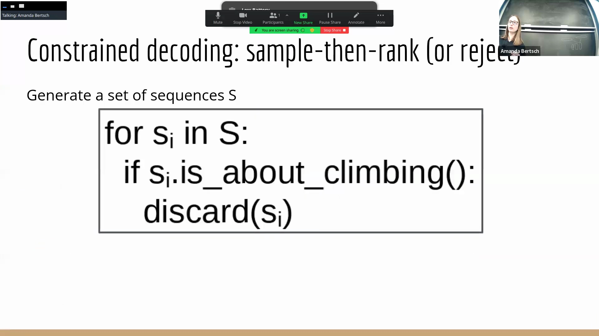
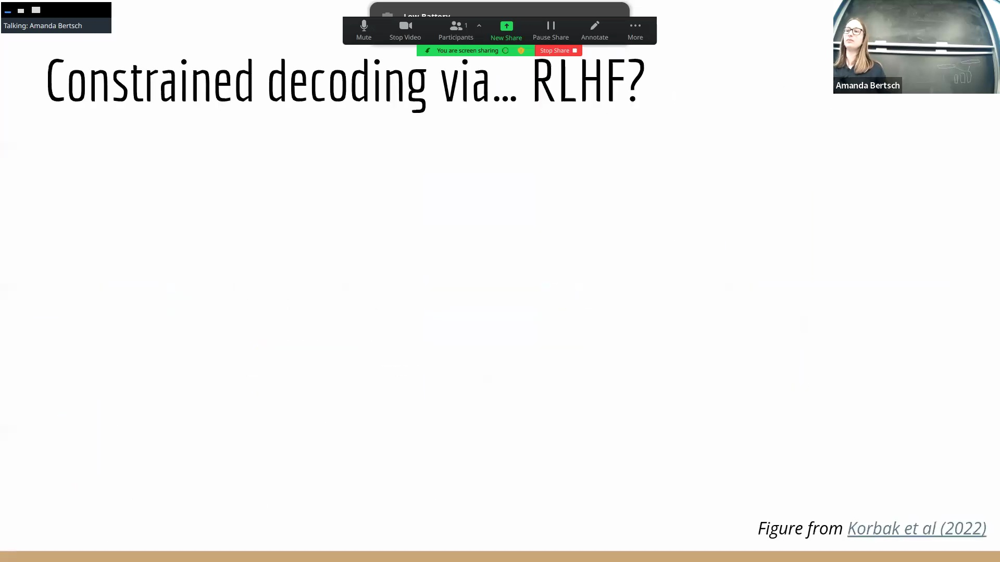

## 问答：数据收集与启发式标注
针对如何获取约束判别器的训练数据，演讲者强调，现有的精选数据集(Curated Datasets)通常是主要来源。对于公开数据匮乏的高度特定或长尾约束，开发者可构建启发式规则(Heuristic Rules，如关键词匹配、模式检测(Pattern Detection)或基于规则的过滤)来自动标注正负样本。这一流程使得针对特定领域快速、低成本地训练定向约束预测器成为可能。

---

## 约束判别器的数据收集
训练有效的判别器(Discriminator)需要精心整理的正负样本(Positive/Negative Samples)。对于长尾或小众约束(Long-tail/Niche Constraints)，开发者可能需要爬取专业论坛或应用启发式规则(Heuristic Rules)进行自动数据标注；然而，许多常见约束可直接利用现有的风格迁移数据集(Style Transfer Datasets)（例如语体正式度转换、情感极性修改）。最终，开发者需进行一项战略权衡(Trade-off)：是支付一次性的计算成本(Computational Cost)进行模型微调(Fine-tuning)，还是在推理阶段(Inference Stage)承担持续的开销，于生成过程中动态施加约束。最优方案在很大程度上取决于实际部署的规模与调用频率。
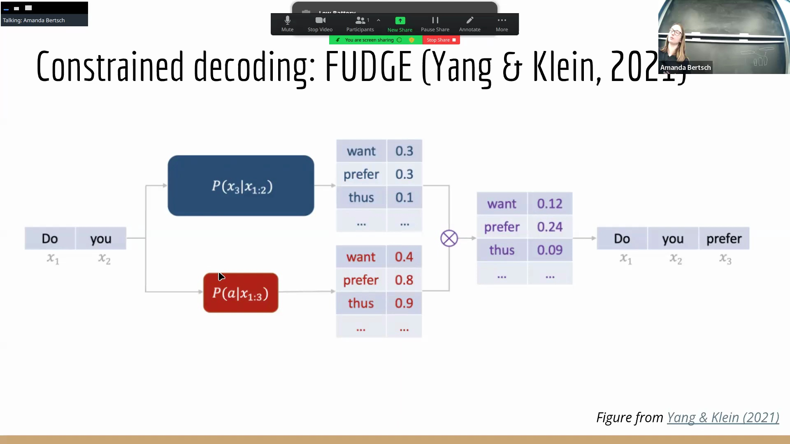

## 人在回路的解码与交互式生成
超越传统的黑盒生成(Black-box Generation)模式，“人在回路”(Human-in-the-Loop) 解码将直接的用户交互引入文本生成流程。该范式对于需持续监管的高风险应用、协同创意任务或对话式 AI(Conversational AI) 至关重要。系统不再局限于单次“输入-输出”传递，而是执行一系列解码步骤(Decoding Steps)，并在关键节点穿插人类反馈(Human Feedback)。诸如 Wordcraft 等框架已验证了此类交互策略在协作故事生成(Collaborative Story Generation)中的有效性，使用户得以动态引导叙事走向。
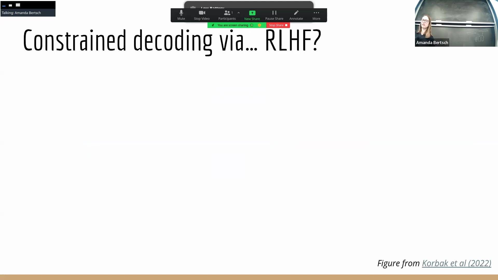
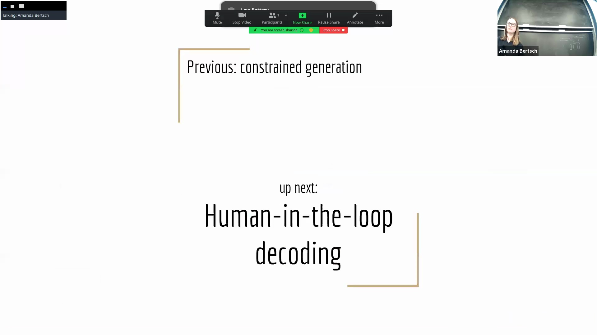

## 交互式文本编辑与细粒度控制
一种核心交互策略采用人类撰写与模型生成交替进行的模式，允许用户在生成过程中随时暂停、编辑或干预叙事走向。此外，用户可通过高亮特定文本片段并下达针对性修改指令（例如增强描述性、精简篇幅或调整情感基调），实现细粒度文本替换(Fine-grained Text Editing)。此类编辑可通过定向提示词优化(Prompt Tuning)、调用具备双向上下文感知能力(Bi-directional Context Awareness)的专用文本填充模型(Infilling Model，在代码补全 Code Completion 场景中尤为有效），或结合受限解码技术(Constrained Decoding)与判别器来严格约束模型的后续生成路径。
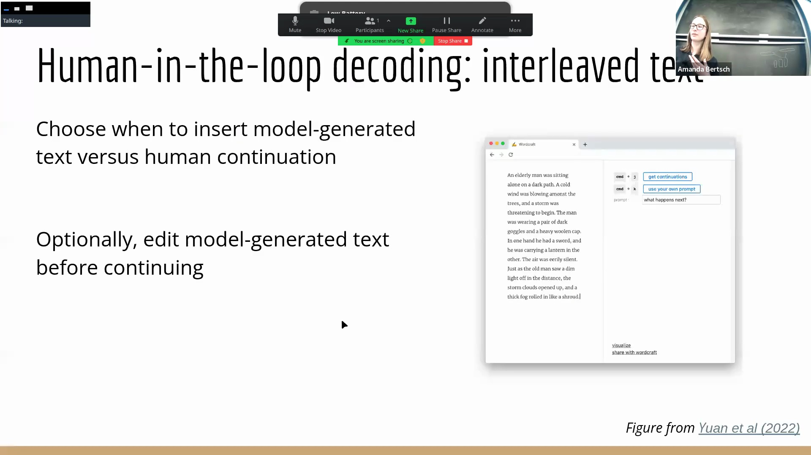

## 采样、重排序与基于模型的评估
交互式解码通常依赖采样(Sampling)与重排序(Reranking)机制，由人类从多项候选输出中筛选偏好结果或触发“重新生成”。这种人类中介的筛选机制有效充当了算法控制层(Algorithmic Control Layer)。近期的研究进一步扩展了该概念，尝试以 AI 模型替代人工评估者。例如，“Poetry of Thought”（思维之诗）等技术会生成多个中间推理步骤(Intermediate Reasoning Steps)或短序列，随后调用验证模型(Verifier Model)在继续生成前对其进行排序、过滤或校验。该机制在原理上类似束搜索(Beam Search)，但其运作于更高的语义层级（如句子或思维粒度），而非仅依赖词元级概率(Token-level Probability)，通过引入外部反馈来动态引导解码轨迹。
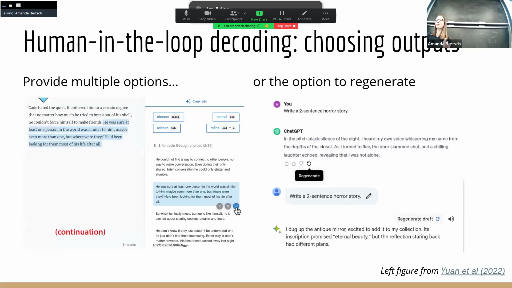
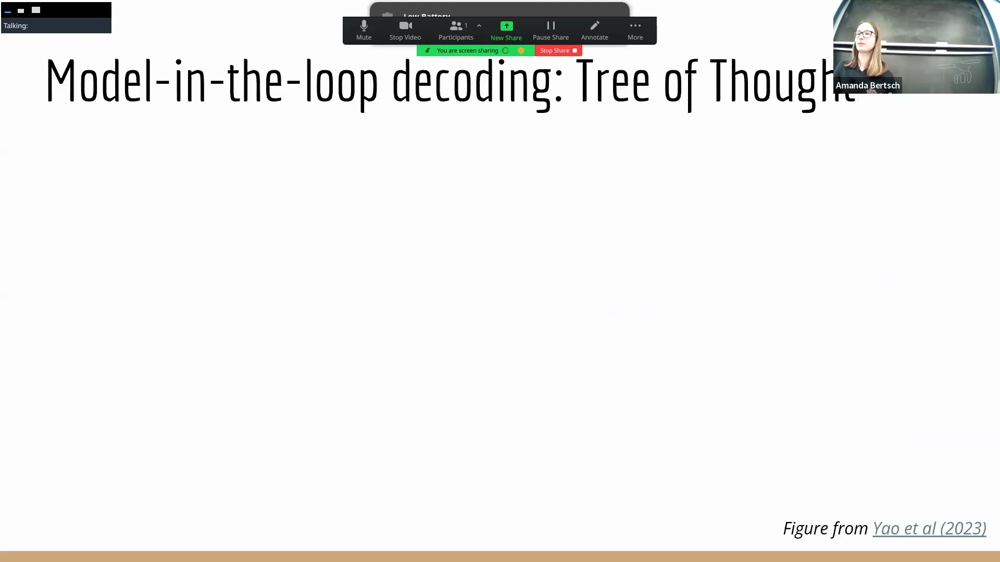

## 使用投机解码优化推理速度
自回归生成(Autoregressive Generation)的核心瓶颈在于其顺序的逐词元(Token-by-token)解码过程，这在流式传输或实时对话应用中会引入显著延迟。投机解码(Speculative Decoding)技术通过引入一个更小、更快的“草稿”模型(Draft Model)，在单次前向传递(Forward Pass)中并行预测多个后续词元，从而有效缓解该问题。随后，更大的目标模型(Target Model)充当验证器，校验这些草稿词元是否符合其自身的概率分布(Probability Distribution)。若校验通过，则一次性批量输出多个词元；若在某处被拒绝，大模型将即时修正序列并回退至标准解码(Standard Decoding)流程。该方法大幅降低了高成本前向传递的执行次数，已成为现代生产级大语言模型实现低延迟响应的关键技术。
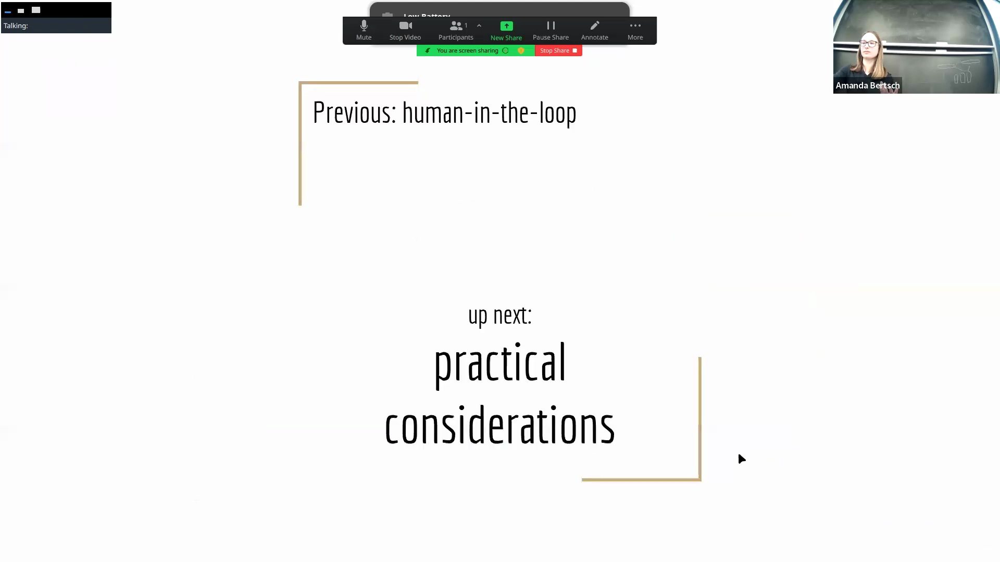
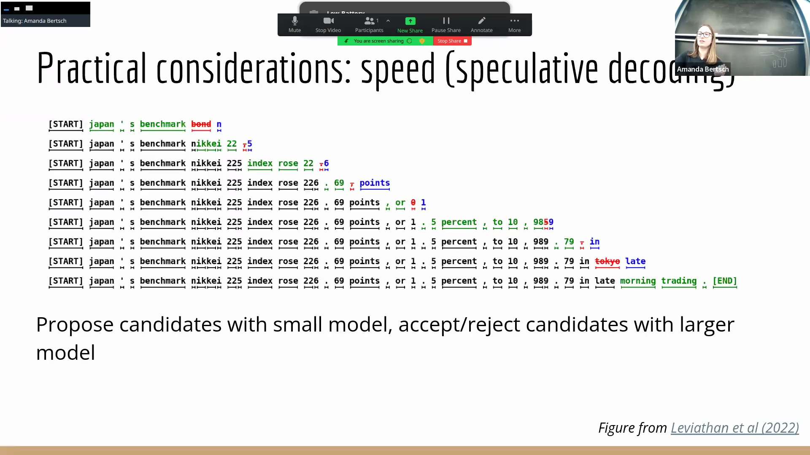

## 实际实现与生态工具
受限解码(Constrained Decoding)与快速解码(Fast Decoding)的理论架构已获现代机器学习库及底层基础设施的充分支持。开发者可直接调用投机解码的优化实现，并结合注意力机制的高效键值缓存(Key-Value Cache, KV Cache)等硬件级加速技术。针对严格的格式规范，`Outlines` 等专业工具库可在词元级别强制实施受限解码，确保输出结构化的有效 JSON 或其他符合预定义模式(Schema)的数据。此外，核采样(Nucleus Sampling/Top-p Sampling)、束搜索(Beam Search)与 Top-k 采样(Top-k Sampling)等标准解码策略已深度集成至主流开发框架中，大幅降低了先进文本生成技术的接入门槛，使其全面达到生产就绪(Production-ready)状态。
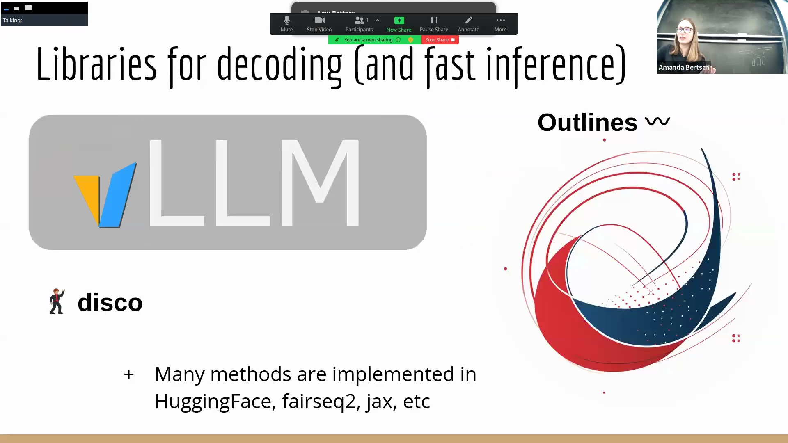

---

## 解码实现概述与核心类别
现代机器学习框架（如 Hugging Face、PyTorch 和 JAX）通常将最小贝叶斯风险(Minimum Bayes Risk, MBR) 解码等高级算法作为标准组件集成。从根本上讲，依据生成策略与模型初始下一个词元(Token) 概率分布(Probability Distribution) 的交互方式，可将其划分为两大类别。第一类作用于词元级别(Token-level)，在解码的每一步应用特定函数来动态调整概率分布。此类技术包括截断低概率尾部、调节生成温度(Generation Temperature)，或注入源自辅助模型与判别器(Discriminator) 的外部信号。
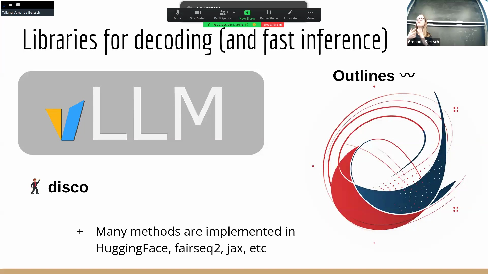
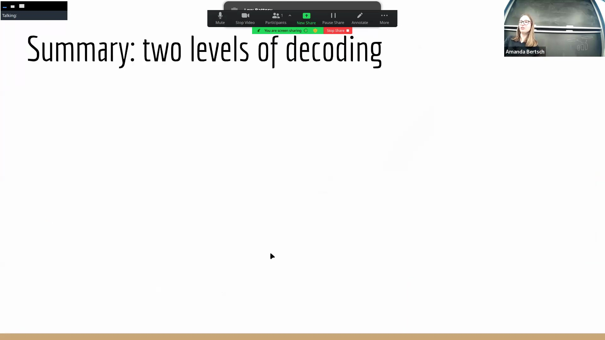

## 序列级选择与组合策略
第二类策略作用于更长的序列跨度，侧重于对完整或部分生成序列进行评估与筛选，而非仅关注单个词元。该类别涵盖了用于探索多路径下一词元的束搜索(Beam Search)，以及基于最小贝叶斯风险(MBR) 和采样-重排序(Sample-and-Rerank) 流水线的完整序列评估方法。值得注意的是，这两类范式具有高度互补性，支持协同部署。一个鲁棒的生成系统(Robust Generation System) 通常会并行应用词元级分布调整机制与高层级的序列选择算法，从而共同确定最终的最优输出。
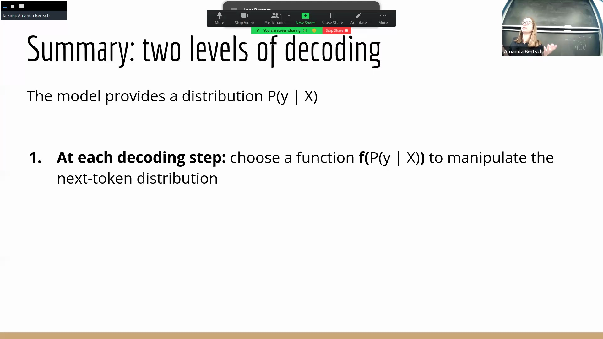
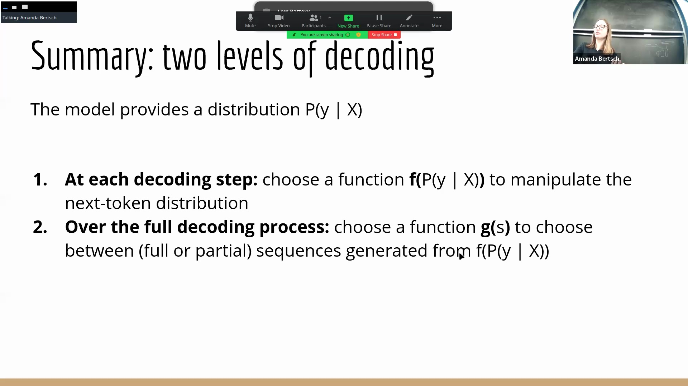

## 计算权衡与推理时补偿
高级解码技术(Advanced Decoding Techniques) 提供了一种强有力的机制，可在无需修改基础模型(Base Model) 的前提下控制输出特征、施加约束，或融合奖励信号(Reward Signals) 与外部知识。尽管此类解码策略无法从根本上将架构能力较弱的模型提升至最先进(State-of-the-Art, SOTA) 水平，但它实现了一种有效的战略权衡：通过在推理阶段(Inference Stage) 增加计算开销，来弥补训练阶段(Training Stage) 的轻量级设定或领域适配不足。对于缺乏大规模 GPU 集群以进行持续微调(Fine-tuning) 的开发者而言，该方案极具实用价值。前沿研究进一步探索了知识蒸馏(Knowledge Distillation) 路径，即通过定向训练，将复杂解码策略生成的高质量输出“蒸馏”回模型参数中，从而在保持性能的同时降低长期推理延迟。
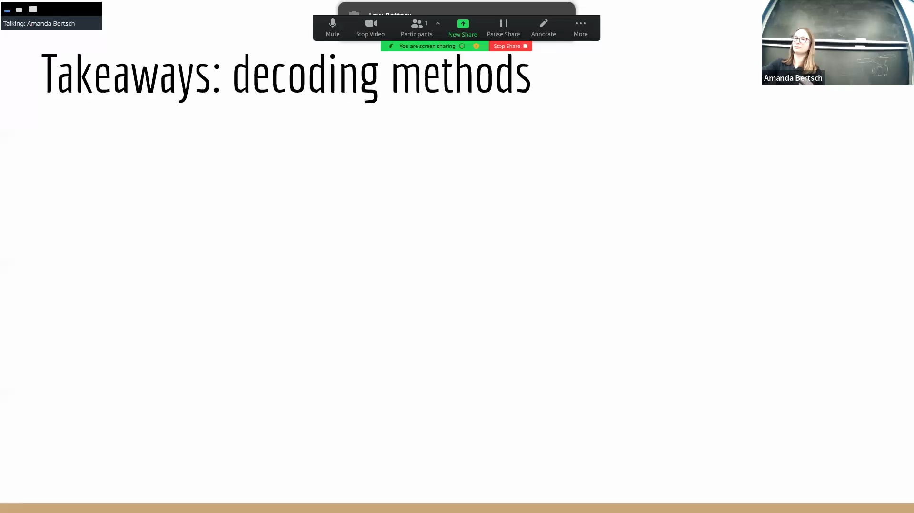

## 平衡质量、多样性与推理速度
每种解码算法均需在输出质量(Output Quality)、文本多样性(Text Diversity) 与计算效率(Computational Efficiency) 之间进行内在权衡。直接的无过滤采样(Unfiltered Sampling) 虽具备极快的推理速度并能生成高度多样化的回复，但常伴随连贯性下降或事实偏差(Factual Deviation)。相比之下，贪婪解码(Greedy Decoding) 或标准束搜索(Standard Beam Search) 等约束性方法可显著提升输出质量与聚焦度，却以牺牲多样性为代价，且易引发重复生成现象(Repetition)（可通过多样化束搜索(Diverse Beam Search) 等技术予以缓解）。反之，基于最小贝叶斯风险(MBR) 或采样-重排序(Sample-and-Rerank) 等先进的多轮生成(Multi-pass Generation) 策略虽能逼近最优质量，但受限于高昂的计算开销，其推理延迟显著增加。

## 策略选择对性能的关键影响
解码策略的选择对下游任务性能具有决定性影响。仅通过切换解码算法，同一基础模型即可呈现出截然不同的生成效果。这表明，盲目依赖开发库的默认配置往往会错失显著的性能增益。在模型部署或针对幻觉(Hallucination)、文本重复等异常行为进行调试时，从业者应优先尝试调整解码策略。引入具有特定归纳偏置(Inductive Bias) 的定制化算法，通常无需经历昂贵且耗时的额外训练周期，即可有效缓解系统性缺陷。
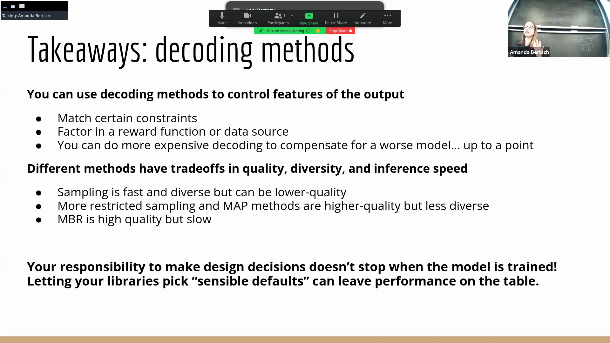

## 可预测性、直觉与实际应用
相较于模型参数训练所呈现的“黑盒”特性，推理阶段的解码操作通常具备更高的可预测性与可诊断性。例如，基于最大似然估计(Maximum Likelihood Estimation) 配合束搜索的模型往往倾向于输出简洁但偏短的文本，而贪婪解码则易生成冗长且高度重复的序列。深入理解这些典型行为模式，有助于开发者快速定位问题根源并实施精准的解码干预。尽管动态解码(Dynamic Decoding) 的效用已获广泛验证，但在实际工程中仍属于未被充分挖掘的优化层(Optimization Layer)。在断言基础模型存在架构缺陷之前，强烈建议优先开展跨解码策略的系统性对比实验。
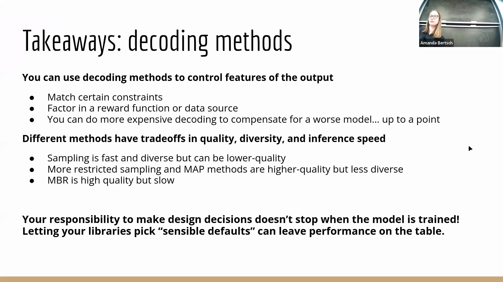