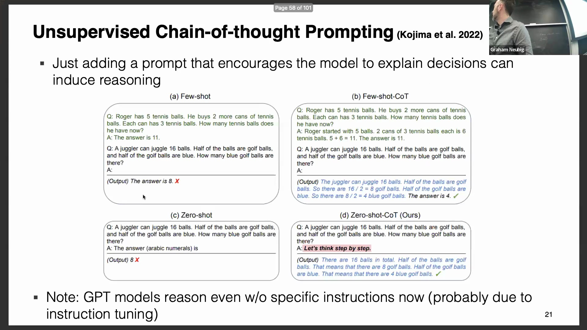
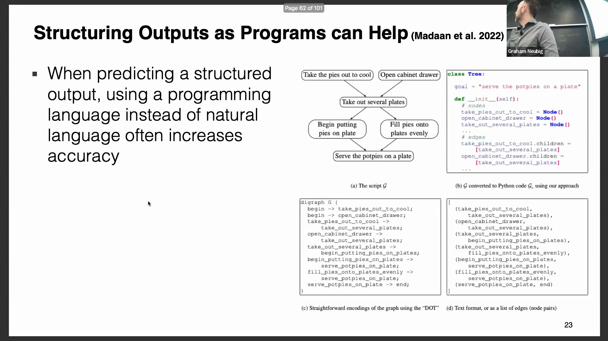
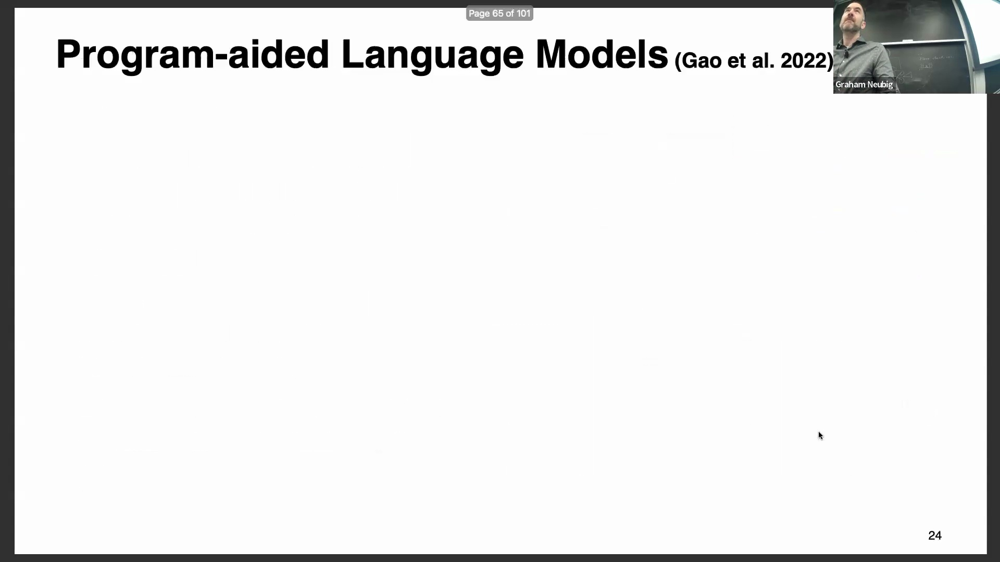
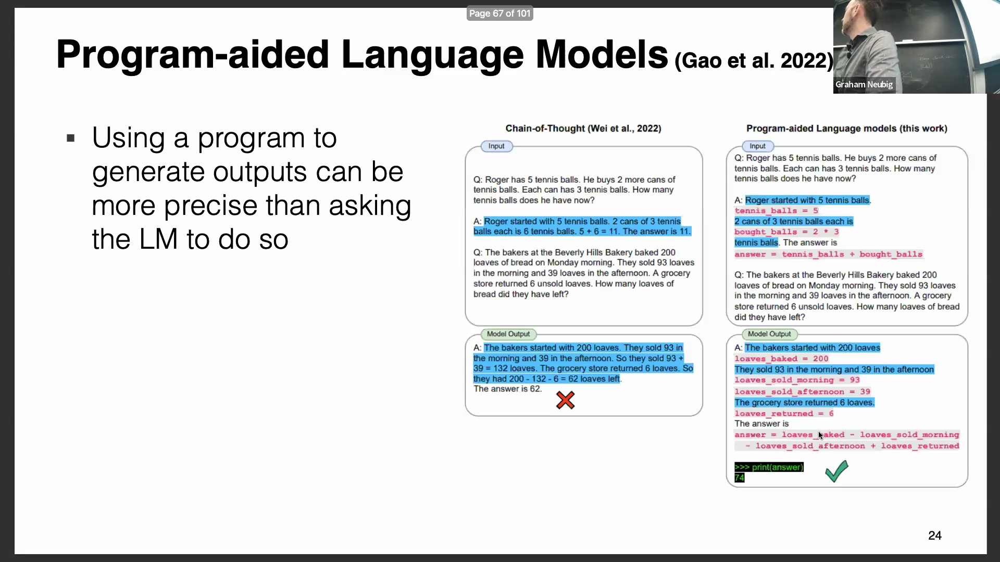
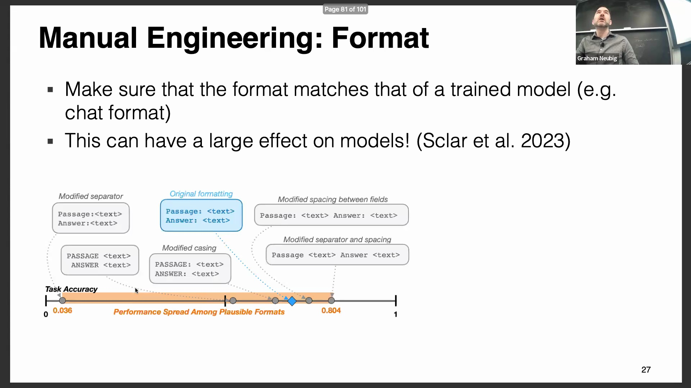

## 指令微调与基座模型的重要性
在现场演示(Live Demo)中，演讲者向 ChatGPT 提出了一个复杂的计算问题，且未使用“让我们一步步思考”等显式推理提示词(Explicit Reasoning Prompt)。然而，模型依然自主生成了代码以解决问题。该现象源于现代 GPT 模型经历了大规模的指令微调(Instruction Fine-tuning)；它们在监督微调数据(Supervised Fine-tuning, SFT)上进行了针对性训练，因此即便缺乏特定的用户提示，也能展现出逐步推理(Step-by-step Reasoning)与代码生成(Code Generation)的能力。

对于从事提示词工程(Prompt Engineering)实验的学生或研究人员而言，充分考量此类固有先验偏差(Inherent Prior Bias)至关重要。若旨在受控环境中评估新型提示词技术，应优先选用原始基座模型(Base Model)（例如未经过对话微调(Dialogue Fine-tuning)的 Llama 2），而非指令微调版本。因为后者已内嵌了特定的行为偏好(Behavioral Bias)，极易导致实验结果产生偏差。

## 代码与结构化格式的有效性
强制模型输出程序代码或结构化数据格式(Structured Data Format)，能显著提升任务性能，即便该任务本身与编程无关。在一项针对程序性知识依赖关系(Procedural Knowledge Dependencies)预测（例如生成派的制作步骤）的研究中，研究人员对比了自然文本(Natural Text)、DOT 图格式(DOT Graph Format)与 Python 代码的输出效果。结果显示，Python 代码始终取得了最佳性能。

该成功主要归因于两大因素。首先，模型在预训练(Pre-training)阶段学习了海量 Python 代码语料，使其极擅长生成语法正确(Syntax-correct)的代码。其次，代码语言本身具备高度结构化特性。当模型切换至“代码生成模式”时，其更倾向于严格引用已定义的变量并维持逻辑依赖关系。相较于自由形态的自然语言，该模式显著降低了模型产生幻觉(Hallucination)或输出随意内容的倾向。

## JSON 的可靠性与程序辅助语言模型
当任务要求精确的结构化输出(Structured Output)时，强制模型输出 JSON 格式(JavaScript Object Notation)是一种高度可靠的策略。尽管模型时常忽略自然语言形式的格式约束，但得益于 JSON 在训练语料中占据极高的比例，模型几乎总能生成语法有效的 JSON 对象(Valid JSON)。这使得 JSON 成为通过编程方式解析模型回复的理想媒介。
鉴于代码生成的显著优势，程序辅助语言模型(Program-Aided Language Models, PAL)方法更进一步：它引导大语言模型(Large Language Models, LLMs)直接生成可执行代码(Executable Code)以解决问题，而非仅依赖纯文本形式的思维链推理(Chain-of-Thought Reasoning)。该方法在处理数值计算、数学推导或逻辑推理任务时表现出极高的精准度。ChatGPT 的代码解释器(Code Interpreter)或高级数据分析(Advanced Data Analysis)等现代实现已将此流程自动化：模型自主决策何时生成代码，在隔离的沙盒环境(Sandbox Environment)中执行代码并返回结果，甚至能动态生成数据可视化图表(Data Visualization Charts)（如直方图）。

## 提示词工程：手动微调与格式敏感性
提示词工程(Prompt Engineering)可通过人工设计或自动搜索算法(Automated Search Methods)（如探索离散文本空间(Discrete Text Space)或连续嵌入空间(Continuous Embedding Space)）来实现。然而，人工调优(Manual Tuning)依然发挥着关键作用，尤其在把控格式细节方面。研究证实，模型对提示词中微小的结构变动极其敏感。
细微的调整，例如在字段标识符(Field Identifiers)后增删冒号、更改大小写(Capitalization)，甚至在段落与问题间插入单个空格，均可能导致模型准确率(Accuracy)发生剧烈波动。在一项实验中，格式错乱的提示词(Malformatted Prompt)致使准确率趋近于零，而仅添加一个必要的空格后，模型性能便跃升至 75% 以上。

此类敏感性在不同模型架构间具有普遍性，这为提示词工程提供了核心启示：对格式细节的严谨把控绝非可有可无。微小的语法调整(Syntax Adjustments)足以根本性地改变模型解析上下文(Context Parsing)与生成回复的机制。因此，严谨的提示词设计(Rigorous Prompt Design)是获取最优模型性能的先决条件。
