## 格式敏感性与标准提示词设计
实证分析表明，尽管大多数合理的提示词变体(Prompt Variants)平均准确率较低，但少数特定格式的变体却能展现出卓越的性能。这些高性能格式通常与模型在预训练(Pre-training)或指令微调(Instruction Fine-tuning)阶段所接触的结构模式高度契合。因此，采用特定模型架构官方推荐的标准提示词模板(Standard Prompt Templates)至关重要。尽管 GPT-4 等能力强大且经过大规模训练的模型对格式变化展现出较强的鲁棒性(Robustness)，但参数量较小的模型或基座模型(Base Models)依然对语法细节高度敏感。在使用此类模型时，严格遵循既定格式规范是防止性能显著下降的首要步骤。
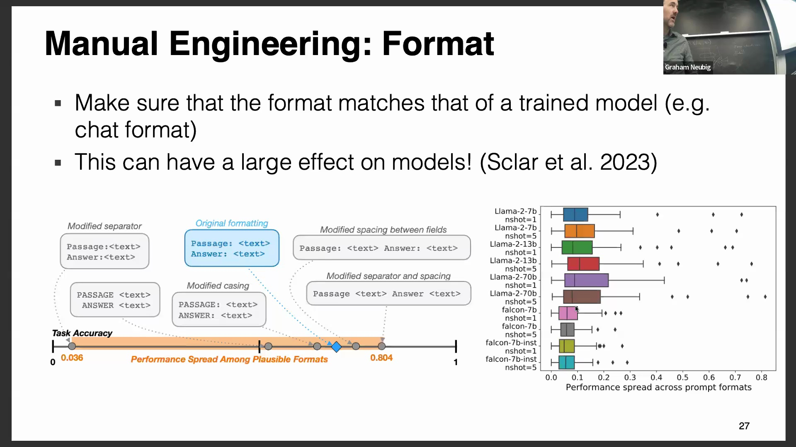
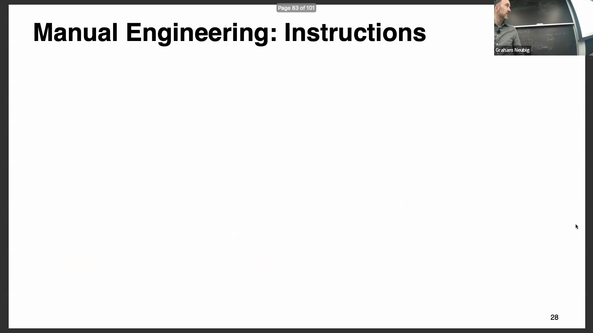

## 清晰精准指令的艺术
撰写高效提示词与清晰的人类沟通(Human Communication)同理：指令必须明确、简洁且无歧义(Unambiguous)。有效引导先进的大语言模型(Large Language Models, LLMs)需要有意识地训练任务表述的清晰度。一项可靠的策略是，从使用明确动作动词（如“撰写”、“分类”或“总结”）的简明指令入手。具体化(Specificity)能显著提升输出质量。诸如“保持简短”这类模糊请求，其效果远不及“用两到三句话向高中生解释提示词工程”这样的精确约束(Precise Constraints)。与人类协作者不同，当前的大语言模型在指令模糊时不会主动请求澄清，因此确保表述精准的责任完全落在提示词设计者(Prompt Designer)身上。
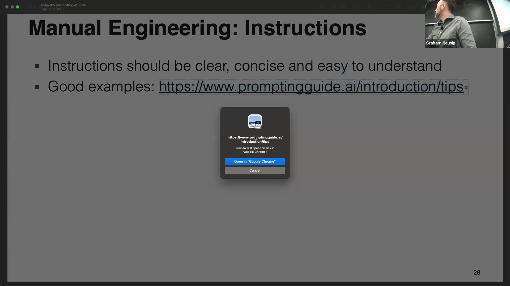

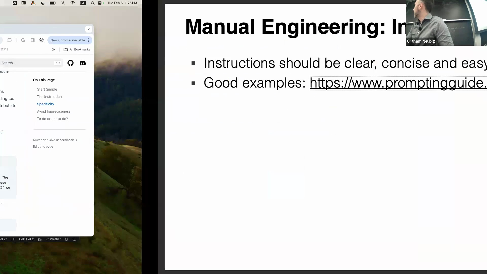

## 自动提示词改写
除手动调优外，自动搜索技术(Automated Search Techniques)可系统化地优化提示词性能。一种易于上手的方法是提示词改写(Prompt Rewriting)，即利用改写模型或大语言模型对初始提示词进行处理，批量生成自然语言变体(Natural Language Variants)。通过在验证集(Validation Set)上评估数十个候选版本并择优选用，用户可稳定提升任务准确率。该流程可进行迭代扩展(Iterative Expansion)：生成一批改写版本，筛选出高性能候选，并将其作为下一轮迭代的种子(Seed Prompts)。这种进化式迭代方法通常比单次尝试更能产出高效的提示词，同时保持了文本的人类可读性(Human Readability)。
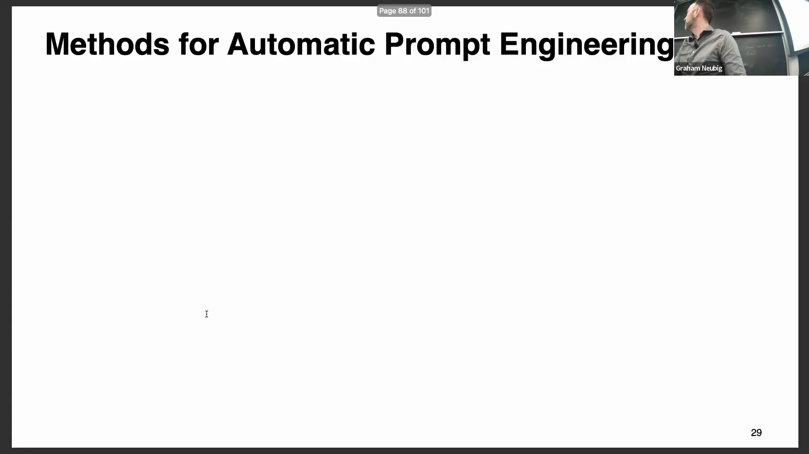
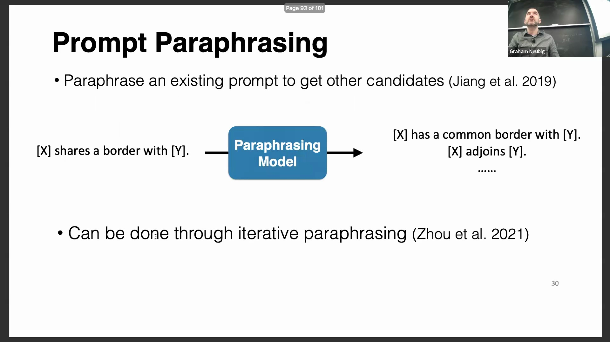
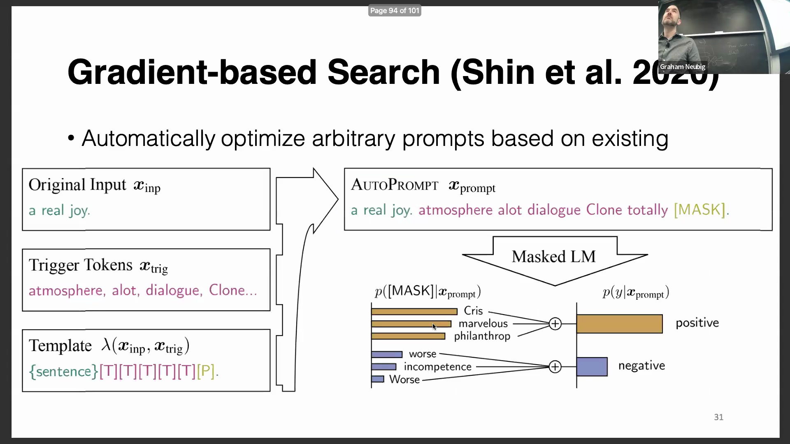

## 基于梯度的离散提示词搜索与对抗性攻击
一种更为复杂的优化技术是基于梯度的离散提示词搜索(Gradient-based Discrete Prompt Search)。该方法将输入词元(Input Tokens)视为可训练的嵌入向量(Embedding Vectors)，并通过反向传播(Backpropagation)进行优化，以最大化任务准确率。优化完成后，这些连续嵌入向量会被映射回模型词汇表(Vocabulary)中最邻近的离散词元。有趣的是，该过程通常会生成极其不自然甚至看似无意义的提示词，却能实现卓越的性能表现。该技术已成为对抗性人工智能(Adversarial AI)研究的基础，尤其在生成“越狱”提示词(Jailbreak Prompts)方面应用广泛。研究表明，优化后的对抗性提示词(Adversarial Prompts)能够成功绕过异构模型架构（如同时影响开源 Llama 与闭源 GPT 模型）的安全对齐(Safety Alignment)机制，揭示了超越单一训练流程的系统性漏洞(Systemic Vulnerabilities)。
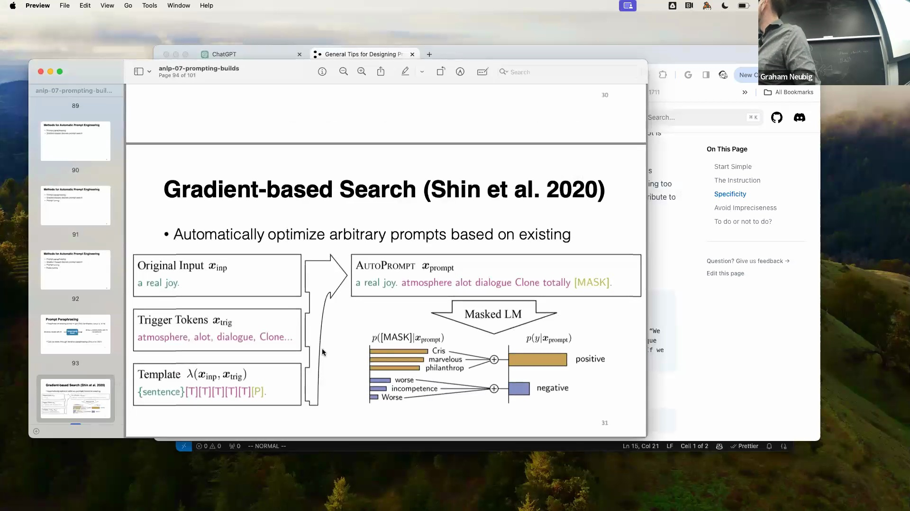

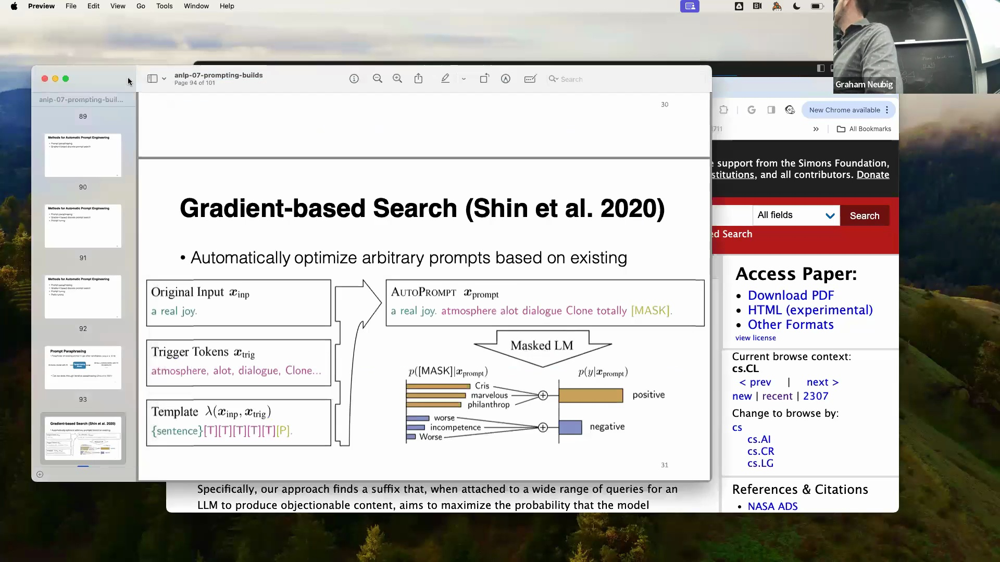

## 提示词微调与前缀微调
基于梯度优化的进一步延伸催生了提示词微调(Prompt Tuning)与前缀微调(Prefix Tuning)，二者有效弥合了提示词工程与全参数微调(Full-parameter Fine-tuning)之间的鸿沟。在提示词微调中，优化后的连续嵌入向量将被直接应用，无需映射回词汇表中的离散词元。这些学习到的嵌入向量仅被前置拼接(Prepended)至模型的输入层。通过仅训练极少量参数（如 10-20 个词元的嵌入序列），而非整个数十亿参数(Billion-parameter)的模型，即可实现高效的任务适配(Task Adaptation)。前缀微调在此基础上进一步扩展，它将可训练的前缀向量注入至 Transformer 架构的*每一层*隐藏状态(Hidden States)中，而非仅限于输入层。这使得前缀微调成为表达能力更强、功能更完善的变体，为跨多数据集与多任务的传统模型微调，提供了一种高度可扩展、参数高效(Parameter-Efficient)的替代方案。
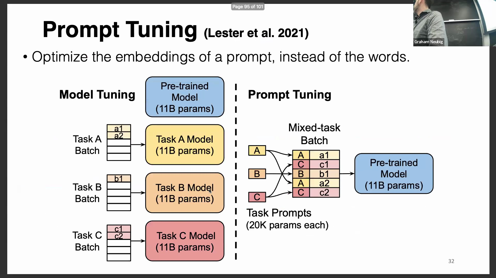
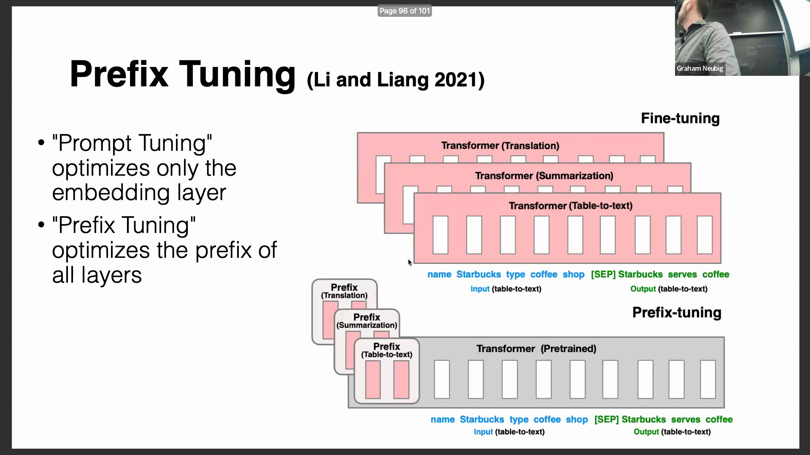

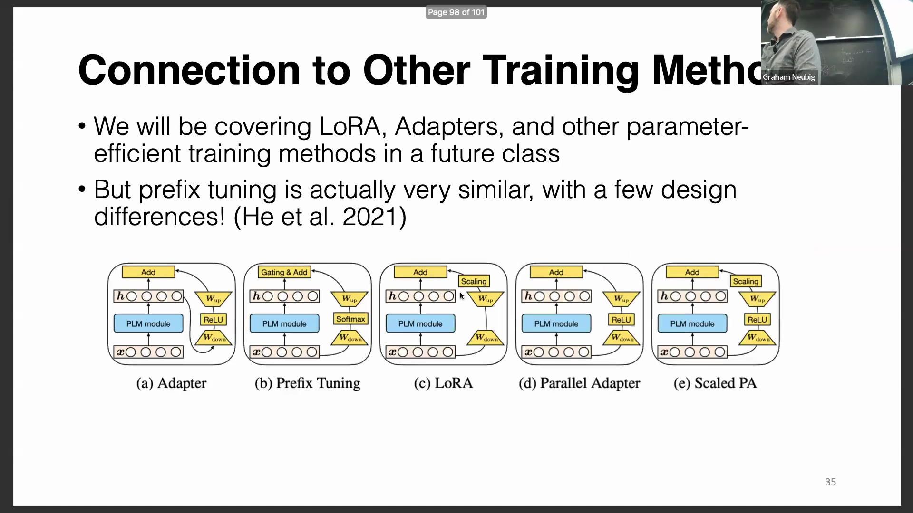