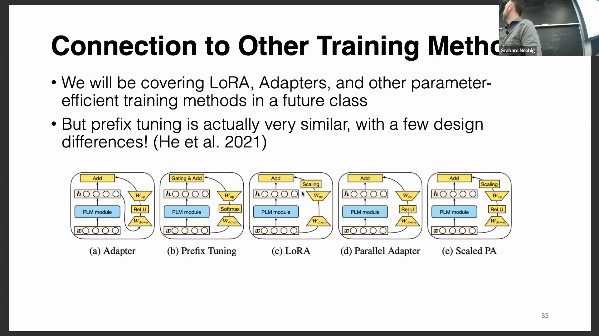
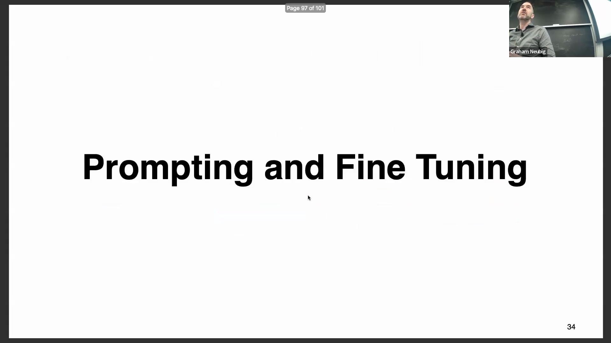
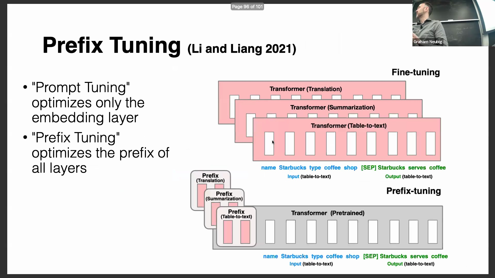
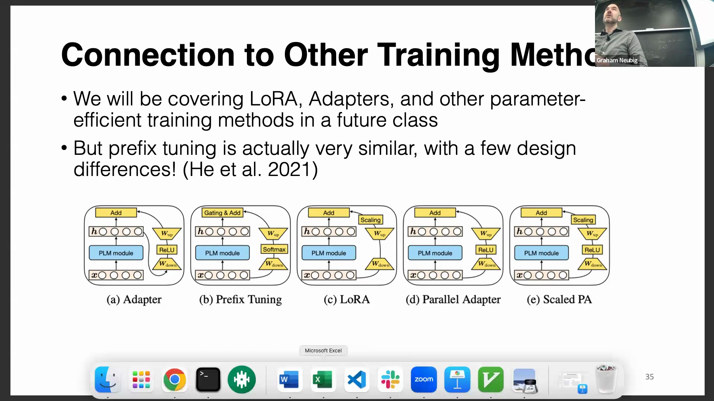
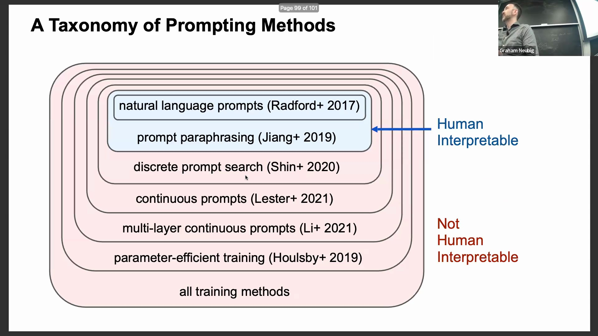
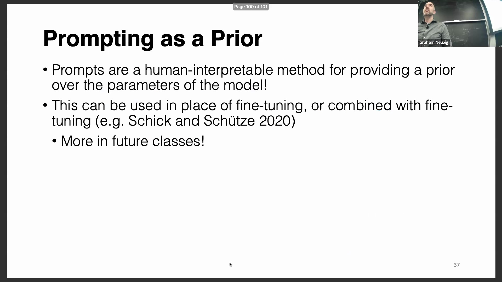
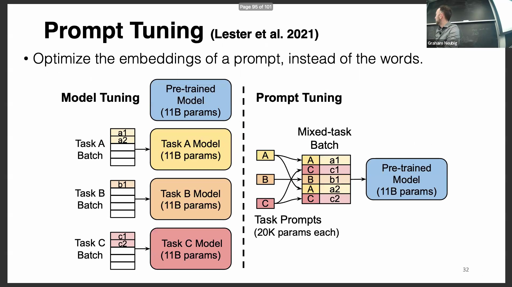

## 提示词到微调的演进谱系
提示词微调(Prompt Tuning)与前缀微调(Prefix Tuning)并非孤立的技术，而是参数高效微调(Parameter-Efficient Fine-Tuning, PEFT)这一更广泛范畴下的具体实现。该范畴还涵盖了低秩自适应(Low-Rank Adaptation, LoRA)和适配器(Adapters)等方法。这一视角将提示词本身重新定义为一种规范化且结构化的微调机制。完整的分类体系清晰勾勒出这些技术的演进路径：从人工编写的自然语言提示词(Natural Language Prompts)出发，演进至用于广泛探索的自动提示词改写(Automatic Prompt Rewriting)，再发展为可能生成非自然语言词元(Token)序列的离散提示词搜索(Discrete Prompt Search)。该体系进一步向上延伸，历经连续提示词微调(Continuous Prompt Tuning)与多层前缀微调(Multi-layer Prefix Tuning)，最终演进至完整的模型全量微调(Full Fine-tuning)。

## 提示词作为贝叶斯先验
批评者常将手动提示词工程(Manual Prompt Engineering)视为一种“经验性试错”，并将其与数学上更为严谨的微调方法(Fine-tuning Methods)相对立。然而，提示词实际上发挥着深刻的理论作用，其内在原理与贝叶斯统计学(Bayesian Statistics)高度契合。精心设计的提示词能够为模型构建强有力的先验概率分布(Prior Probability Distribution)，在模型开始生成文本前，即明确界定了任务上下文(Task Context)与预期行为(Expected Behavior)。这一先验机制使得模型无需更新任何权重(Weights)即可直接部署用于推理(Inference)，为充分调用模型预训练知识(Pre-trained Knowledge)提供了一条高效基线(Efficient Baseline)。

## 提示词与基于梯度训练的融合
将提示词的明确指导(Explicit Guidance)与基于梯度的微调(Gradient-based Fine-tuning)的统计建模能力相结合，能够构建出最为稳健的工作流(Robust Workflow)。从业者无需将提示词工程与模型训练(Model Training)视为互斥选项，而是可利用人工设计的提示词初始化模型对任务的理解，随后在特定数据集(Specific Dataset)上进行微调。模式利用训练(Pattern-Exploiting Training, PET)等方法将这种协同效应(Synergy)进行了规范化。它使开发者能够借助自然语言先验(Natural Language Priors)快速搭建系统原型，并无缝过渡至数据驱动优化(Data-driven Optimization)阶段，从而最大化模型的准确率与可靠性。
