## 微调(Fine-tuning)与指令微调(Instruction Tuning)简介

微调与指令微调是将大语言模型(Large Language Model, LLM)部署为 ChatGPT 或 Gemini 等交互式聊天机器人的基础步骤。该流程旨在充分发挥大语言模型处理多样化任务的能力，而每种任务均需匹配特定类型的训练数据。尽管模型训练的早期阶段主要聚焦于语言建模(Language Modeling)等纯文本目标，但现实世界的应用往往需要更广泛的数据源。部分任务可依赖无需人工干预即可获取的自然产生数据(Naturally Occurring Data)，而其他任务则需要精心构建与人工标注的数据集。

## 利用自然产生与隐含的网络数据
机器翻译(Machine Translation)是自然产生数据的典型范例；无论是否借助人工智能工具，全球范围内的翻译活动都在持续进行，由此积累了庞大的语料库(Corpus)供模型学习。相比之下，问答(Question Answering)或命名实体识别(Named Entity Recognition)等任务通常依赖成本高昂的人工标注。有趣的是，研究表明仅使用原始文本(Raw Text)训练模型同样能取得显著成效，因为互联网本身隐含了可直接服务于特定任务的结构化信息。例如，在线短语手册(Phrasebooks)和多语言网站往往无意中提供了大量平行翻译数据(Parallel Translation Data)。研究甚至在标准的网络爬取数据(Web Crawl Data)中发掘出涵盖 44 种语言的超 3000 万个翻译对，这充分证明，通过常规途径获取的互联网数据已蕴含了丰富的监督信号(Supervisory Signals)。

此类现象同样适用于其他数据格式，例如包含结构化问答对的 FAQ(Frequently Asked Questions) 页面。在将模型适配为聊天机器人时，其底层训练已大量吸纳了此类自然产生的网络数据。这些数据无需进行显式的任务特定标注(Explicit Task-specific Annotation)，即可被直接采集与整合。

## 基座语言模型(Base Language Model)的局限性

尽管自然产生的网络数据十分丰富，但仅依赖无监督文本训练(Unsupervised Text Training)仍可能引发不可预测且缺乏专业性的输出。例如，在测试 GPT 的英译日功能时，模型在绝大多数情况下表现准确，但偶尔会输出罗马音(Romaji)而非标准的日文字符。这种异常行为源于模型过度拟合了在线语言学习短语手册中的常见模式，而罗马音往往是初学者使用的。专业级翻译系统通常能规避此类问题。此类边缘情况(Edge Cases)凸显了基座语言模型的核心局限：若缺乏针对性的引导(Targeted Guidance)，模型极易机械照搬互联网上的原始内容，即便这些内容在特定语境下并不适用。

## 多任务学习(Multi-task Learning)策略

为克服上述不稳定性，现代人工智能开发广泛引入了多任务学习策略，即训练模型同时完成多项任务。其核心原则在于跨任务共享参数(Parameter Sharing)。在大规模 LLM 中，几乎所有参数均为共享状态；而在 BERT 等架构中，共享的骨干网络(Backbone Network)通常会额外接入特定任务的分类头(Classification Head)。具体实现方式较为直观：模型可在不同任务间交替输入小批量数据(Mini-batch Data)，亦可将各任务专属数据集混合至统一的训练语料库中。当所有数据均以文本形式呈现时，混合策略能显著简化训练流程，促使模型学习到具备跨领域泛化(Cross-domain Generalization)能力的联合表示(Joint Representation)。

## 预训练(Pre-training)与微调(Fine-tuning)范式

与同步多任务训练(Synchronous Multi-task Training)相对的另一种路径是顺序式预训练与微调。在此范式下，模型首先攻克语言建模等通用目标，随后再针对特定的下游任务(Downstream Tasks)进行适配。该路径主要由计算效率(Computational Efficiency)驱动：若为每个新任务都从头训练一个参数量达 700 亿(70B)的模型，其成本将极为高昂且资源消耗巨大。通过集中算力完成计算密集的预训练阶段，广大开发者即可高效利用规模较小的专用数据集对模型进行微调。此外，这种两阶段分离架构也显著提升了模型安全性：基础预训练(Base Pre-training)可兼容海量且未经过滤的原始互联网数据，而后续精细的微调阶段则能有效过滤有害内容(Harmful Content)，确保模型输出符合既定规范与安全标准。

然而，该策略并非在所有场景下均为最优解。若针对特定任务的高质量微调数据极为稀缺，采用标准的多任务学习往往是更优选择，从而在最大化利用有限资源的同时有效抑制过拟合(Overfitting)。最终在顺序微调与同步多任务学习之间作何抉择，取决于数据可获取性、计算预算(Computational Budget)，以及模型在泛化能力(Generalization Capability)与特定任务性能之间所需达成的平衡。

---

## 联合多任务学习(Joint Multi-task Learning)与顺序微调(Sequential Fine-tuning)

在联合多任务学习与“先预训练后微调(Pre-train then Fine-tune)”范式之间进行抉择时，数据分布(Data Distribution)与表征学习(Representation Learning)是关键考量因素。尽管调整小批量采样比例(Mini-batch Sampling Ratio)能在一定程度上缓解特定任务数据稀缺的问题，但研究表明，同时联合训练多个目标通常能在下游任务(Downstream Tasks)中取得更优异的性能。其核心假设在于：联合训练会促使模型学习出共享的内部表征(Shared Internal Representations)，并针对所有任务进行全局优化。相比之下，仅基于语言建模(Language Modeling)进行预训练可能导致模型陷入局部最优(Local Optima)，从而缺乏执行最终目标任务（如情感分析(Sentiment Analysis)或结构化标注(Structured Labeling)）所需的特定特征显著性(Feature Salience)。

## 早期安全性整合(Early Safety Integration)与标准流水线(Standard Pipeline)

早期目标整合的优势同样延伸至模型对齐(Model Alignment)与安全性领域。近期关于毒性缓解(Toxicity Mitigation)的研究表明，在初始训练阶段即融入安全概念(Safety Concepts)，相较于模型收敛(Convergence)后再进行安全微调(Safety Fine-tuning)，能够产生显著更稳健的结果。早期的介入塑造了优化景观(Optimization Landscape)，有效防止模型固化那些在后期难以消除的有害模式(Harmful Patterns)。尽管联合训练具备上述技术优势，但顺序式预训练与微调(Sequential Pre-training and Fine-tuning)的工作流依然是行业标准。其主要驱动力在于计算效率(Computational Efficiency)：只需投入一次大规模预训练的成本，即可让广大研究社区高效地将基础模型(Foundation Model)适配至众多下游应用中，从而避免重复承担高昂的初始计算开销。

## 指令微调(Instruction Tuning)：融合提示(Prompting)与微调

指令微调(Instruction Tuning)在静态提示(Static Prompt)与传统微调之间架起了桥梁。标准提示方法通常依赖于冻结的预训练编码器(Frozen Pre-trained Encoder)，并通过固定文本前缀(Fixed Text Prefix)来定义任务；而指令微调则主动更新模型权重(Update Model Weights)，以优化基于提示的生成效果。在训练阶段，模型会学习大量特定任务的提示及其期望输出(Expected Outputs)，从而掌握识别指令线索(Instruction Cues)并生成准确且具备上下文感知能力(Context-aware)的回复。这种混合机制确保模型不仅理解提示的结构化格式，更内化了可靠执行多样化用户指令所需的行为灵活性(Behavioral Flexibility)。

## 全量微调(Full Fine-tuning)的内存瓶颈(Memory Bottleneck)
全量微调(Full Fine-tuning)在概念上虽直观，但在实践中却面临严峻的显存限制(Memory Constraints)。更新大语言模型(Large Language Model)需同时在显存中存储模型参数(Model Parameters)、梯度(Gradients)以及优化器状态(Optimizer States)。以参数量达 650 亿(65B)的模型为例，仅权重与梯度在 16 位精度(16-bit Precision)下便会占用约 260 GB 显存。若进一步引入 Adam 等优化器（需维护一阶矩估计(First Moment Estimate)与二阶矩估计(Second Moment Estimate)），内存挑战将急剧加剧。传统上，为避免数值下溢与上溢(Numerical Underflow/Overflow)及训练不稳定，这些矩估计需以 32 位精度存储，这就要求额外保留一份 32 位的主参数副本(Master Parameter Copy)。再叠加前向传播(Forward Propagation)与反向传播(Backward Propagation)所产生的激活内存(Activation Memory)（其容量与批次大小(Batch Size)和序列长度(Sequence Length)呈正相关），一套基础的全量微调配置往往需要 1000 至 1400 GB 的 GPU 显存。

## 现代精度进步(Modern Precision Advances)与硬件限制(Hardware Constraints)

数值精度(Numerical Precision)领域的最新进展在一定程度上缓解了上述显存压力。业界从标准 FP16 向 BF16 (Brain Float 16) 的演进显著提升了训练稳定性(Training Stability)，使得优化器状态能够以更紧凑的格式高效存储，从而免除了冗余的 32 位参数副本。此项优化将平均每个参数的内存占用降至约 8 字节，但整体基础需求依然庞大。尽管软件层面取得了这些突破，激活内存(Activation Memory)仍构成一项硬性瓶颈。将上述需求与标准 GPU 的显存规格(VRAM Specifications)及市场定价进行交叉对比后可明确看出：全量微调必须依赖企业级硬件(Enterprise-grade Hardware)，或需借助参数高效微调(Parameter-Efficient Fine-Tuning, PEFT) 技术，方能实现更广泛的应用普及。

---

## GPU 硬件限制与规模经济

标准计算硬件(Standard Computing Hardware)对全量模型微调(Full Fine-tuning)构成了重大障碍。消费级与云端 GPU 的显存(Video RAM, VRAM)容量通常介于 24GB 至 80GB 之间，而 Apple Silicon 芯片则依赖于 CPU 与 GPU 共享的统一内存架构(Unified Memory Architecture)。此类单设备配置均无法同时容纳存储大语言模型(Large Language Model, LLM)参数、梯度(Gradients)及优化器状态(Optimizer States)所需的约 130GB 显存开销。尽管存在 TPU(Tensor Processing Unit)、Google 定制训练芯片及 AWS Trainium 等专用加速器(Dedicated Accelerators)，但标准 NVIDIA GPU 仍是学术界与科研界的首选方案。这主要归因于其在处理动态计算图(Dynamic Computational Graphs)与非传统架构时的灵活性，尽管其底层硬件设计本质上是针对静态、大规模矩阵运算(Static, Large-scale Matrix Operations)进行了优化。

从头开始训练(Training from Scratch)模型的替代方案，对大多数研究者而言在经济上难以承受。工业级训练集群(Industrial-scale Training Clusters)——例如 Meta 部署的数十万块 H100 GPU——往往意味着数十亿美元的资金投入。这种极高的成本结构解释了为何学术界与开发者社区高度依赖通过微调来适配现有的基础模型(Foundation Models)，而非从零开始训练全新模型。

## 使用 DeepSpeed ZeRO 进行分布式训练(Distributed Training)

为突破单张 GPU 的显存限制(Memory Constraints)，多 GPU 分布式训练成为核心的工程解决方案。该领域应用最广泛的框架是 DeepSpeed ZeRO(Zero Redundancy Optimizer)，它通过在多设备间系统化地划分模型训练状态(Model Training States)，有效消除了冗余的显存占用。

DeepSpeed 采用渐进式阶段(Progressive Stages)策略来实现显存优化。阶段 1(Stage 1) 仅对优化器状态进行划分（例如 Adam 优化器的一阶矩与二阶矩估计），这通常占据最大的显存开销。阶段 2(Stage 2) 在此基础上进一步将梯度在设备间进行分片(Sharding)，而阶段 3(Stage 3) 则进一步划分模型参数(Model Parameters)本身。每一后续阶段均能显著降低显存需求，但也会引入更高的 GPU 间通信开销(Inter-GPU Communication Overhead)。在实际应用中，部署阶段 1 或阶段 2 通常能实现最佳的权衡，使得数十亿参数规模(Billion-scale Parameters)的模型仅凭少量 GPU 即可高效微调，且不会引发严重的性能衰减。

## 用于分布式训练的现代生态系统框架
从业者通常无需手动实现 ZeRO 分区(Zero Partitioning)，而是借助高级训练库(High-level Training Libraries)来封装分布式状态管理的复杂性。诸如 Hugging Face Accelerate、TRL(Transformer Reinforcement Learning) 及 Ax 等框架，均在底层集成了 DeepSpeed 或类似的分布式策略(Distributed Strategies)。这些工具使研究人员仅需极少配置即可在多设备间扩展训练(Scaling Training)，从而无需深厚的底层分布式系统工程(Distributed Systems Engineering)专业知识，即可实现大模型的高效适配。

## 参数高效微调(Parameter-Efficient Fine-Tuning, PEFT)与适配器架构

作为更新全量模型权重的高效替代方案，参数高效微调(PEFT)应运而生。通过冻结绝大部分预训练参数并仅更新极小部分参数，PEFT 大幅降低了显存开销，使在受限硬件上针对多样化数据集进行快速适配成为可能。早期方法如前缀微调(Prefix Tuning)通过优化注入至每个 Transformer 层的软提示(Soft Prompts)来实现目标，但此后更具结构化的方法逐渐占据主流。

适配器(Adapter)是一种广泛采用的 PEFT 策略，它将轻量级神经网络模块直接插入标准 Transformer 架构中。适配器通常嵌入于多头注意力层(Multi-Head Attention Layer)与前馈神经网络层(Feed-Forward Network)之间，采用瓶颈结构(Bottleneck Design)：下投影层(Down-projection Layer)将隐藏表征(Hidden Representations)压缩至低维空间，经非线性激活函数(Non-linear Activation Function)处理后，再由上投影层(Up-projection Layer)恢复至原始维度，最终将其叠加至残差流(Residual Stream)中。

在保持原始基础权重(Base Weights)冻结的前提下，将数据流导向这些小型可训练路径，适配器能够以极少的计算资源与 GPU 显存，实现与全量微调相媲美的下游任务(Downstream Tasks)性能。

---

## Transformer 架构回顾
正如图中所示，这里包含了权重矩阵(W Matrix)，以及查询(Query)、键(Key)和值(Value)矩阵。此外，还有 Transformer 架构中的输出矩阵(Output Matrix)。这部分即是我们上图中提及的多头注意力(Multi-Head Attention)机制。下方是一个双层前馈网络(Two-Layer Feed-Forward Network)。它本质上由两个线性层与非线性激活函数交替组成（即线性-激活-线性(Linear-Activation-Linear)结构），因此通常被称为前馈块(Feed-Forward Block)。以上即构成了标准的 Transformer 架构。
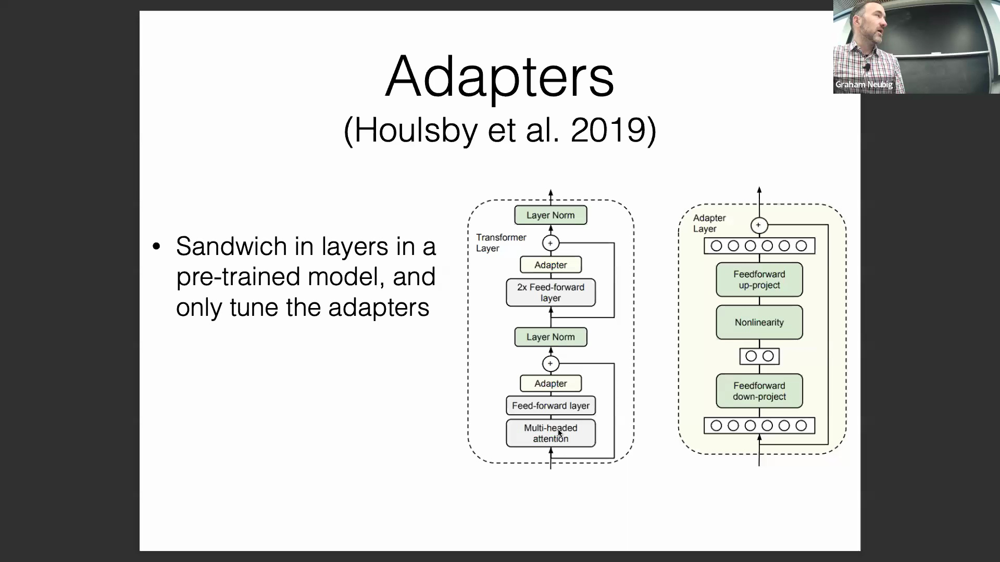

## 适配器机制与参数效率
适配器(Adapter)的核心思想便是在此处额外插入一层结构。在训练时，我们会冻结图中灰色标注的模块（如前馈网络(Feed-Forward Network)和多头注意力(Multi-Head Attention)等），仅对适配器进行训练。其具体工作原理如下：首先输入一个标准的高维表示向量，随后通过一个下投影层(Down-Projection Layer)将其维度压缩至极低维度；接着经过非线性激活函数处理，再通过一个上投影层(Up-Projection Layer)将维度恢复至原始空间。最后，该适配器的输出会通过残差连接(Residual Connection)与原始特征相加。

## 维度权衡与 PEFT 优势
理想情况下，该结构会将向量维度从 512 压缩至 16 左右，随后再恢复至 512。若仅使用单一的线性层，参数量将会十分庞大。而采用这种瓶颈结构(Bottleneck Structure)可大幅减少参数。例如，适配器的参数量可能仅为原始层的 1/16；若将中间隐藏维度进一步降至 2 或 1，参数量将急剧缩减。简而言之，通过使这些投影矩阵变得极其“瘦长”，我们可以将额外的参数开销降至最低。

关于此结构有一个常见问题：为何要先降维再升维？核心目的正是为了压缩参数量。若保持维度不变，参数量将直接翻倍，过多的参数反而可能损害模型性能。尽管在小规模模型中过度压缩维度可能会略微削弱拟合能力，但在拥有海量训练数据时，适当增加适配器的中间维度确实能提升拟合效果。然而，若数据量充足且显存(VRAM)足以支撑更大模型的训练，则直接进行全量微调(Full Fine-Tuning)是更优选择。参数高效微调(Parameter-Efficient Fine-Tuning, PEFT)方法具备两大核心优势：其一，如前所述，它能显著降低训练所需的显存占用；其二，由于可训练参数大幅减少，模型更不易过拟合。在训练数据稀缺时，全量微调极易过拟合且训练过程不稳定；而 PEFT 凭借极少的可训练参数，天然具备更强的抗过拟合能力，从而获得更优的泛化能力(Generalization Ability)。
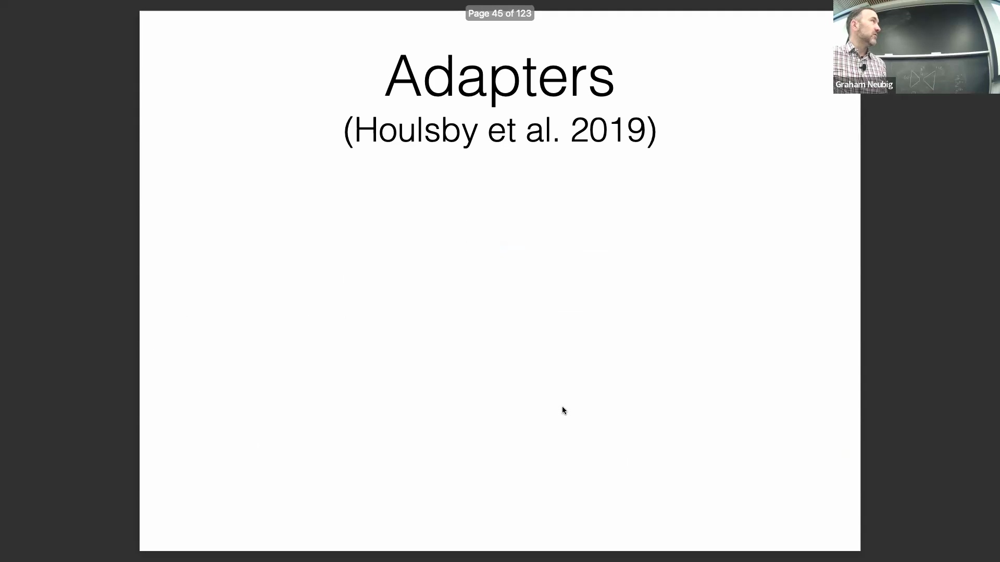

## PEFT 中的梯度计算与反向传播
因此，在微调过程中，我们仅更新适配器的参数。假设已加载一个预训练模型(Pre-trained Model)（即图中灰色部分），我们将在此基础上展开微调。此处引出一个关键问题：即使仅微调适配器层，是否仍需为其他冻结层存储梯度？换言之，我们是否需要保留这部分梯度信息？答案是否定的。在执行反向传播(Backpropagation)时，我们只需对参数需更新的路径计算并存储梯度即可。
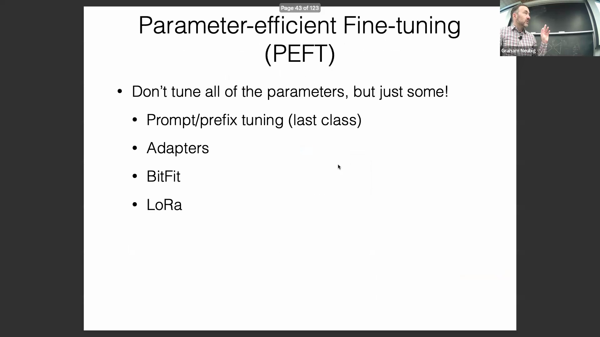
举例而言，由损失函数(Loss Function)计算出的梯度会从此处流入，并反向流经前馈网络、适配器及注意力层。我们确实需要让梯度信号穿过这些模块，以便向前传播至网络更浅层。然而，对于不参与更新的冻结权重，我们无需计算其梯度，也无需保存相关梯度信息，只需计算并更新适配器部分的梯度。实际上，你甚至可以对冻结模块执行梯度阻断(Gradient Detachment)，避免不必要的反向传播计算。当然，在前向传播(Forward Pass)阶段，仍需使用这些冻结权重完成数据流的计算。借助这种针对计算图(Computational Graph)的优化策略，可有效节省显存与算力资源。
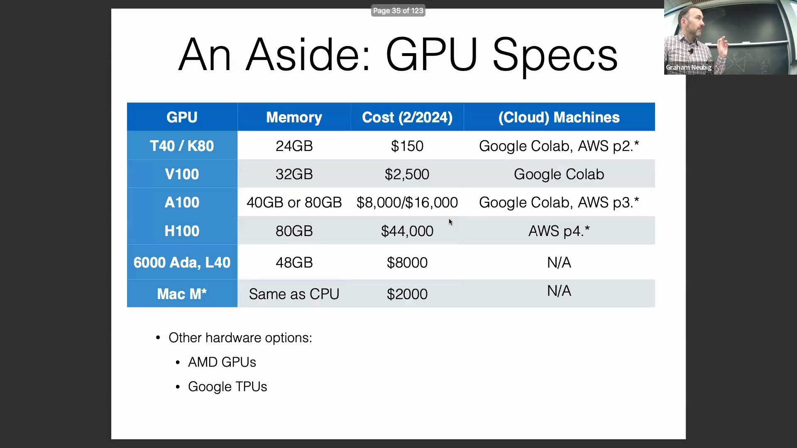

## 内存优化与初始化策略
此外，还有一种常用的显存优化技术称为检查点技术(Checkpointing)，例如计算图检查点或前向/反向传播检查点。其基本原理是：在计算图的前向传播过程中，仅保留部分关键节点的计算结果，并主动丢弃中间激活值(Intermediate Activations)。例如，你可以执行前向传播至某一阶段后，释放所有中间状态；待反向传播阶段需要时，再重新计算这些激活值。此类优化显存的技巧有很多，其中最典型的就是激活检查点(Activation Checkpointing)。关于实现细节，这里补充一点：虽然该策略常与 LoRA(Low-Rank Adaptation) 结合使用，但其核心思想具有通用性。
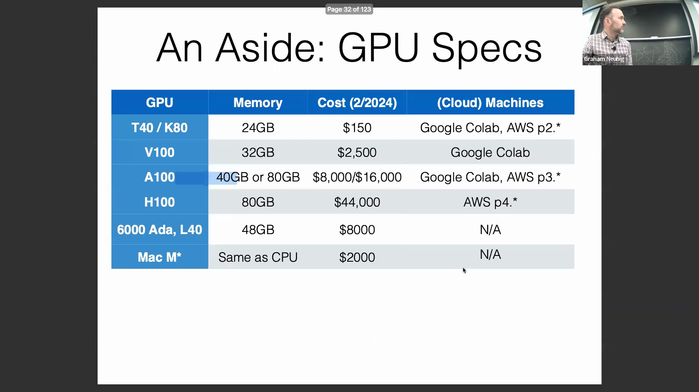
在 LoRA 架构中，上投影矩阵(Up-Projection Matrix)通常初始化为全零矩阵，而下投影矩阵(Down-Projection Matrix)则进行随机初始化。将上投影矩阵置零的原因在于：训练初始阶段，适配器模块不会产生任何附加输出，从而确保模型的初始行为与原始预训练模型完全一致。这是一种标准的参数初始化策略。
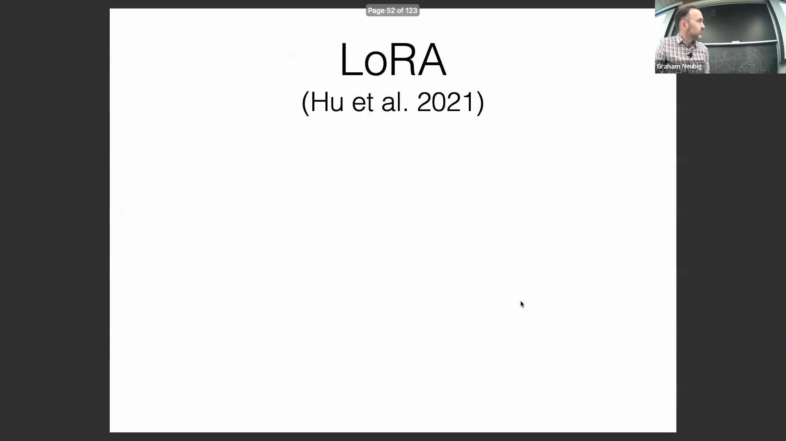
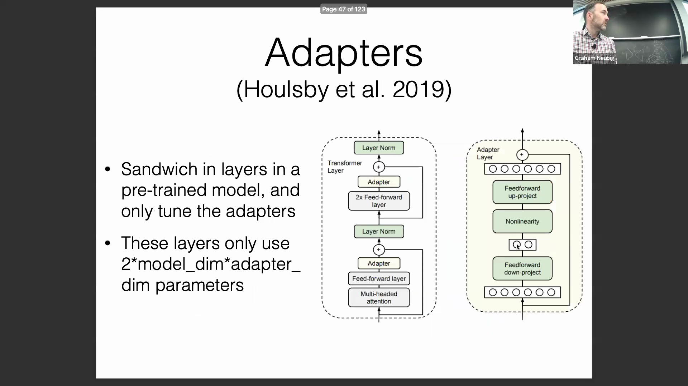

## 适配器融合：多任务集成
最后，我想介绍一项颇具巧思的技术。尽管它并非当前绝对的主流方案，但因其设计精妙，仍值得深入探讨，这便是“适配器融合”(Adapter Fusion)。其核心思想是：针对不同的下游任务分别训练独立的适配器，随后将这些适配器进行集成。因此，网络中不再仅包含单一适配器层，而是部署多个并行适配器，并在其上方引入适配器融合模块(Adapter Fusion Module)。如前所述，单个适配器的工作原理保持不变；而适配器融合模块的本质，则是为这些适配器引入注意力机制(Attention Mechanism)。借助该机制，模型能够根据当前输入特征，动态加权并决定调用哪个适配器。每个适配器均基于特定任务的专属数据独立训练而成。例如，利用海量问答语料可训练出一个问答适配器，利用平行翻译语料则可训练出翻译适配器，依此类推。在实际推理或部署时……
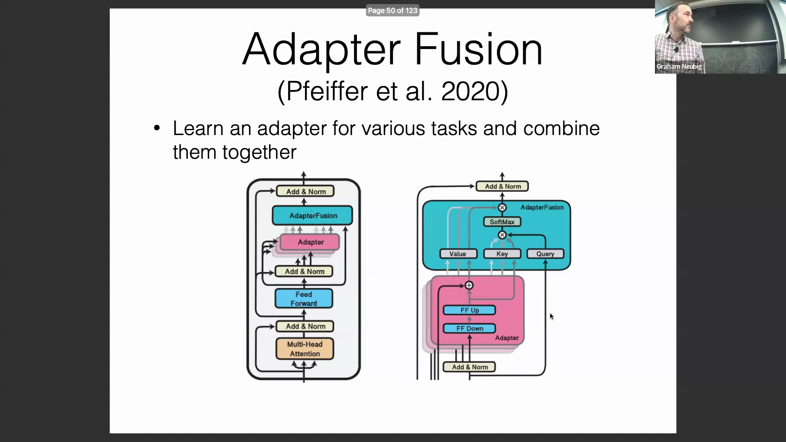

---

## 基于适配器的方法与多任务灵活性

讨论首先围绕适配器（Adapter）模块展开，重点介绍了其注意力机制（Attention Mechanism），该机制使模型能够根据当前任务动态选择特定的适配器。这种模块化设计允许为单一任务训练专用组件，并在推理阶段将它们组合调用。文中还介绍了多语言（Multilingual）与多任务（Multi-task）的变体，允许集成语言专属（Language-specific）和任务专属（Task-specific）的适配器。从概念上看，该方法与“混合专家”（Mixture of Experts, MoE）架构相似，为模型适配提供了一条灵活且富有创新性的路径。

## LoRA：工作原理与微调后部署的便利性

LoRA（低秩自适应，Low-Rank Adaptation）作为一种被广泛采用的技术被引入，它与适配器共享概念基础，但在架构上存在关键差异。 

与传统适配器不同，LoRA 完全去除了非线性层（Non-linear Layers）。相反，它依赖于由降维矩阵（Down-projection Matrix）与升维矩阵（Up-projection Matrix）相乘构成的纯线性变换。尽管早期的示意图将其描绘为并行计算路径，但 LoRA 的更新值实际上可以直接叠加到预训练权重矩阵（Pre-trained Weight Matrix）上，从而在数学上实现完全等效的结果。

LoRA 的广泛流行主要归功于其微调后部署的便利性。微调完成后，训练得到的低秩矩阵（Low-Rank Matrices）可无缝合并回原始模型权重中。

这使得模型的参数量与架构保持原样，无需引入额外组件或修改推理流程。这与基于适配器的方法形成鲜明对比，后者通常需要加载额外的模型组件并依赖专门的推理代码。

## QLoRA：将量化与高效微调相结合

接下来重点介绍 QLoRA，它将模型量化（Model Quantization）与参数高效微调（Parameter-Efficient Fine-Tuning, PEFT）相结合，从而大幅降低了显存需求。

通过将模型参数从标准的 16 位精度（16-bit Precision）压缩至 4 位，内存占用急剧减少。例如，一个 16 位的 LLaMA 模型大约需要 130GB 的显存，而 4 位量化版本可将这一需求降至约 32.5GB。

这种极小的模型体积使得在更广泛的硬件上进行微调成为可能，包括高端 GPU（如 NVIDIA A100、H100）以及配备大容量统一内存（Unified Memory）的消费级设备（如 MacBook）。

QLoRA 还通过 CPU 与 GPU 显存之间的高效分页机制（Paging Mechanism）进一步提升了资源利用率。针对潜在的精度损失担忧，讲者明确指出，优化过程并非在低精度下执行；基座模型（Base Model）始终以 4 位格式冻结，而梯度计算与传播则通过轻量级的 LoRA 层完成。大量实证结果充分验证了该方法的有效性。对于在硬件受限条件下训练大规模模型的场景，强烈推荐 QLoRA；而对于单张 GPU 上的较小规模模型（如 7B 或 13B 参数），标准 LoRA 依然能够胜任。

## BitFit 与 PEFT 方法的统一分解框架

BitFit 被提出作为一种极其简单却高效的替代方案，该方法仅微调模型的偏置参数（Bias Parameters），而其余所有权重均保持冻结。它无需任何架构修改或额外的代码实现。

为了系统性地梳理这些技术，讲者引入了一个统一的分析框架，将各类参数高效微调（PEFT）方法解构为若干核心设计维度（Core Design Dimensions）。 

这些维度涵盖：非线性激活函数（Non-linear Activation Function）的形式、模块在网络中的插入位置、输入表示的修改方式，以及将修改后输出与原始表示进行融合的合并函数（Combination Function）。对比分析表明，适配器、LoRA 与前缀微调（Prefix Tuning）在本质上高度相似，其核心差异仅在于输入表示的注入位置以及非线性函数的选择（如 ReLU、Softmax 或无）。此外，LoRA 还额外引入了一个可学习的缩放因子（Scaling Factor）作为关键超参数。

## 参数高效微调方法的策略性选择

这一统一的分解框架不仅清晰地阐释了现有方法，还催生了更高效的变体，例如并行适配器（Parallel Adapter）与缩放并行适配器（Scaled Parallel Adapter）。在实际部署时，技术选型往往取决于部署便利性与任务复杂度之间的权衡。 

若追求极致的部署便利性与无缝集成，LoRA 与 BitFit 是最佳选择，因为它们完整保留了原始模型的架构。对于文本分类等相对简单的任务，即便是仅更新偏置的 BitFit 也能展现出与复杂方法相媲美的竞争力。针对参数预算（Parameter Budget）受限但任务复杂度较高的场景，前缀微调（Prefix Tuning）通常能提供卓越的性能。最后，在面对复杂任务且参数预算相对充裕时，采用传统适配器或多种 PEFT 技术的混合组合（Hybrid PEFT）往往能取得最优效果。

---

## 用于模型微调的自然语言处理(Natural Language Processing)任务简介
使用适配器(Adapters)或多种方法的混合方案通常能取得更好的效果。当前的研究重点已转向探索具体的自然语言处理任务，这一点至关重要，因为传统的微调(Fine-tuning)通常针对单一任务，而指令微调(Instruction Tuning)旨在构建能够同时处理多项任务的通用型模型。回顾这些任务主要有两个目的：它们代表了自然语言处理领域中关键的现实应用，并且构成了基础模型论文（如GPT(Generative Pre-trained Transformer)和Gemini）中用于展示模型能力的标准评估基准。

（提问过渡环节）

理解特定任务微调(Single-Task Fine-tuning)与通用建模(General Modeling)之间的差异，为评估模型在不同基准测试(Benchmarks)中的表现奠定了基础。

## 无上下文（闭卷）问答(Context-Free QA)
第一大类别是无上下文（或闭卷）问答，要求模型在不依赖特定外部文档的情况下回答问题。这类似于ChatGPT等模型在未进行网络搜索时响应提示词(Prompt)的工作方式。该领域广泛使用的基准是MMLU(Massive Multitask Language Understanding)数据集，其中包含专业法律等高难度领域的挑战性问题。例如，数据集可能会给出一个场景：一名推销员无视禁止擅入的标志，被地产上的爆炸装置炸伤。尽管该问题在法律上较为复杂，但正确答案通常会强调地产所有者设置陷阱所应承担的责任。

通过分析此类示例可以清楚地看出，这些数据集旨在测试模型的内部知识储备，而非外部检索能力。

## 上下文问答与检索(Contextual QA & Retrieval)
下一项任务是上下文问答(Contextual QA)，其答案必须严格基于所提供的文档。该领域的一个知名数据集是Natural Questions，它主要依赖于维基百科文章。该任务主要有两种形式：“机器阅读理解”(Machine Reading Comprehension)，即模型基于单篇给定文档进行回答；以及检索增强生成(Retrieval-Augmented Generation, RAG)，即模型需在更庞大的语料库中进行检索，以定位相关信息并回答查询。对于致力于构建实用、可投入生产环境的自然语言处理系统的开发者和研究人员而言，这项能力具有极高的优先级。

## 代码生成(Code Generation)
代码生成是另一项备受关注的任务，尤其在构建自动化开发系统方面。它涉及根据自然语言指令生成编程代码（如Python或SQL）。HumanEval数据集是该领域的标准基准(Benchmark)，其中的提示词(Prompt)要求模型根据文本描述和输入/输出示例，使用标准库编写函数。需要注意的是，HumanEval仅作为一个相对简单的基线(Baseline)，不包含外部依赖库；针对该领域的高级研究，还有更复杂的数据集可供选择。

处理这些编程提示词突显了模型如何根据纯文本指令精准处理语法结构、逻辑关系及第三方库的调用。

## 文本摘要(Text Summarization)任务
文本摘要任务主要分为单文档摘要(Single-Document Summarization)和多文档摘要(Multi-Document Summarization)两类。单文档摘要旨在将一篇长文本压缩为较短的版本，目前在英语场景下开箱即用(out-of-the-box)的效果已相当出色。然而，多文档摘要在很大程度上仍面临挑战。它需要将大量主题相同但通常彼此缺乏连贯性的文档，综合提炼成一篇逻辑连贯的概述。WikiSum数据集是这方面的典型代表，它提供指向多个维基百科页面的链接，并要求模型生成相应主题的引言段落。这项能力对于自动生成文献综述、市场报告及其他综合性洞察具有极高的应用价值。

解决多文档摘要问题需要模型能够有效过滤噪声、消除信息矛盾，并在多个信息源之间保持语义连贯性。

## 信息抽取(Information Extraction)
信息抽取侧重于从非结构化文本中提取结构化数据。它包含几个核心子任务：命名实体识别(Named Entity Recognition)、实体链接(Entity Linking)、实体共指消解(Entity Coreference Resolution)以及事件抽取(Event Extraction)。像OntoNotes这样的数据集为这些任务提供了大量深度标注的样本。在实际应用中，这直接赋能业务流程自动化，例如根据非结构化文本输入，自动填充Excel或Google Sheet中的结构化字段。

## 机器翻译(Machine Translation)与全球信息公平
机器翻译涉及将文本从一种语言转换为另一种语言。评估翻译（及摘要）质量颇具挑战，通常依赖于与人工参考译文进行对比的传统相似度指标（如BLEU）或现代神经评估指标(Neural Evaluation Metrics)。FLORES数据集是一个突出的基准，它包含了约一千篇被翻译为101种不同语言的维基百科文章。该数据集备受重视，因为提升低资源语言(Low-Resource Languages)的翻译能力，将直接促进全球信息的公平传播。

## 通用基准测试(General Benchmarks)
除了针对特定行业的应用之外，还存在一些通用基准测试，旨在评估模型的基础语言能力与推理能力。BIG-bench(Beyond the Imitation Game Benchmark)就是一个典型例子，它包含多种多样的任务，例如追踪在朋友间传递并打乱顺序的物品、计算历史日期，以及解决涉及“诚实者与说谎者”逻辑的多步推理谜题。现代大语言模型（如Gemini）会针对这些多样化的任务类别进行广泛评估，以衡量其整体的认知水平与语言熟练度。

这些综合性基准测试提供了对模型能力的全面视角，超越了单一任务的表现，转而评估更广泛的复杂推理技能。

---

## 评估中数据污染的检测与预防
在模型基准测试(Benchmarking)中，一个核心关注点是确保测试数据(Test Data)未泄露至训练语料库(Training Corpus)中。尽管在概念相似的数据上进行训练通常是可以接受的（因为模型在预训练阶段不可避免地会接触到网络上的常见语言模式），但训练集中包含完全重复的测试样本会严重损害评估的有效性。为检测数据泄露(Data Contamination)，研究人员会对测试集施加受控的扰动(Controlled Perturbations)，例如打乱多项选择题的选项顺序或更改数学题中的具体数值。若模型在这些逻辑等价(Logically Equivalent)的变体上准确率显著下降，则强烈表明其依赖的是死记硬背(Rote Memorization)，而非真正的推理能力(Reasoning)。

预防策略多种多样，既包括简单的技术屏障（例如为数据集压缩包设置密码以拦截自动网络爬虫(Web Crawlers)），也包括维护严格私有的数据集版本（杜绝公共API访问或防止训练输出暴露）。

## 测试复杂度的测量与控制
如何定义衡量测试复杂度(Test Complexity)的通用指标，仍是一个开放的研究问题。当前的主流方法通常通过控制序列长度(Sequence Length)或多步骤任务所需的推理步数(Reasoning Steps/Hops)来近似评估复杂度。诸如 BREAK 基准测试(BREAK Benchmark)等框架，会将复杂的自然语言查询(Natural Language Queries)分解为类似数据库的基本操作（如选择、过滤、投影），以此量化任务的认知负荷(Cognitive Load)。

其他近期研究则采用将数学或编程问题映射为计算图(Computational Graphs)的方法，以深入分析 Transformer 架构如何处理不同结构深度(Structural Depth)的任务。

鉴于任务难度具有多面性，一种行之有效的评估实践是根据关键维度（如主题分布(Topic Distribution)、语言或文体风格模式）对测试数据进行分层细分，并分别分析模型在这些独立子集(Subsets)上的准确率。

## 指令微调的机制
指令微调(Instruction Tuning)由 Google 与 Hugging Face 的研究团队几乎同期提出，该方法能够将基础语言模型(Foundational Language Models)转化为多功能的通用型模型。该方法的核心是在海量且多样化的任务集合上执行监督微调(Supervised Fine-Tuning, SFT)。数据被统一格式化为明确的“指令-输入”(Instruction-Input)对，模型则被训练以生成对应的预期输出。

该范式的突破性在于其卓越的跨任务泛化能力(Cross-Task Generalization)：经此训练的模型不仅在已微调的任务上表现稳健，在面对完全未见过的任务(Unseen Tasks)时也能发挥出色。如今，这种能力已成为现代生产级大语言模型(Large Language Models, LLMs)的标配。

指令微调还可进一步强化，以提升模型的上下文学习能力(In-Context Learning)。具体做法是在训练阶段进行数据采样，并将多个演示示例(Demonstration Examples)直接拼接至上下文窗口(Context Window)中，从而使模型学会在推理阶段更高效地利用少样本提示(Few-Shot Prompting)。

## 标准化指令微调数据集
手动整理与格式化多样化的任务数据极为耗时费力，因此标准化的数据集合集对于保障可重复研究(Reproducible Research)至关重要。针对这些资源的综合综述（例如介绍 Flan 数据集集合的开创性论文）提供了关键的元数据(Metadata)，涵盖数据集名称、训练样本规模、提示词格式（零样本(Zero-Shot) 对比 少样本(Few-Shot)）、任务数量及具体的实现细节。

目前应用最广泛的资源包括 Flan 数据集集合(Flan Collection)、Natural Instructions 以及 Self-Instruct。这些经过精心策展的数据集提供了必要的规模与格式一致性，使得研究者无需承担手动数据聚合(Data Aggregation)的开销，即可高效地对模型执行指令微调。

## 面向生产环境的推荐指令微调模型
对于负责模型部署的从业者而言，选型建议在很大程度上取决于预期的应用场景。Flan T5 采用编码器-解码器架构(Encoder-Decoder Architecture)，提供最高达 110 亿参数的版本。凭借其卓越的参数效率，该模型在代码生成、机器翻译和文本摘要等结构化输入输出任务上表现优异。

然而，由于其训练优化目标侧重于任务指令的完成度，而非开放式对话(Open-Ended Dialogue)，因此它并不太适合用于交互式对话类应用。

针对交互式聊天工作负载(Interactive Chat Workloads)，Llama 2 Chat 是更为理想的选择。该模型在指令微调之后，进一步接受了基于人类反馈的强化学习(Reinforcement Learning from Human Feedback, RLHF)训练，使其输出与人类偏好高度对齐，因而在对话式AI(Conversational AI)场景中表现极为出色。

综上所述，选择合适的模型关键在于将模型的架构与微调范式(Fine-Tuning Paradigm)，同特定应用场景中的结构化处理或对话交互需求进行精准匹配。

---

## 推荐的纯解码器(Decoder-Only)架构
Mixtral Instruct 凭借其出色的性能与高效的参数利用率脱颖而出，是一款功能强大的纯解码器(Decoder-Only)混合专家模型(Mixture of Experts, MoE)。因此，它被广泛推荐作为纯解码器工作流(Decoder-Only Workflows)的默认基座选择。反之，若特定流水线(Pipeline)的需求允许或更倾向于编码器-解码器架构(Encoder-Decoder Architecture)，Flan-T5 依然是一个稳健可靠的备选方案。
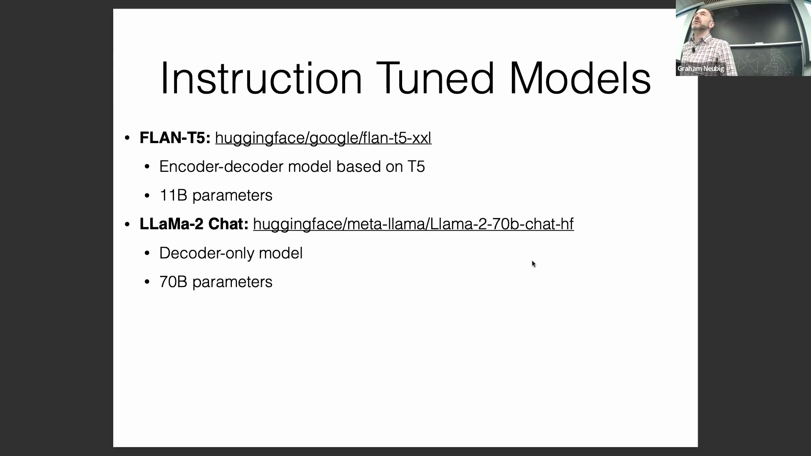
最终，在这两种架构间的抉择取决于具体应用场景：是更需要从双向上下文编码(Bidirectional Contextual Encoding)中获益，还是更追求高效精简的纯解码器生成流程。
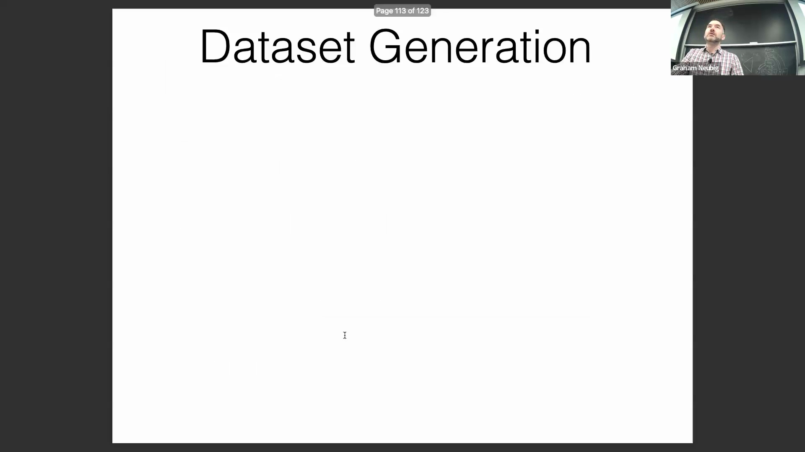

## 基于 Self-Instruct 的自动化数据集生成
指令微调(Instruction Tuning)领域的一项重大突破在于实现了训练数据的自动化合成。基础的 Self-Instruct 方法从一个小型种子指令池（例如包含 175 个任务）出发。模型通过自我提示(Self-Prompting)生成新任务，对其进行分类，并构建相应的输入-输出对(Input-Output Pairs)。经过初步过滤（剔除重复项或非文本依赖内容）后，新生成的数据会递归地反馈至种子池中，从而迅速拓宽数据集在跨领域任务上的覆盖范围。对生成器模型本身进行微调可进一步强化这一迭代过程。正如 Orca 模型所采用的思维链微调(Chain-of-Thought Fine-Tuning)所示，该方法利用模型自动生成的解释性推理轨迹(Reasoning Traces)来反哺训练。此外，Evol-Instruct 方法通过系统性地提升提示词复杂度(Prompt Complexity)对该范式进行了扩展，迫使模型逐步应对并解决难度递增的任务。
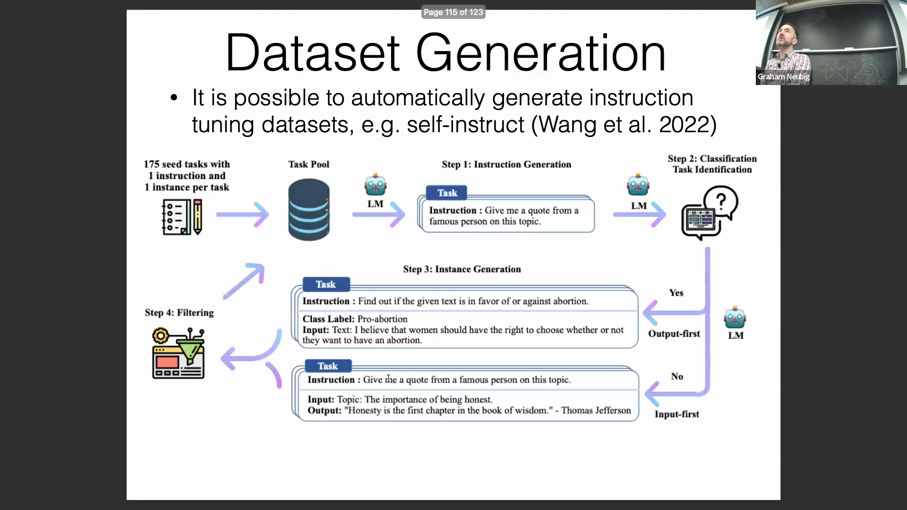
如今，这些合成数据生成技术(Synthetic Data Generation Techniques)已成为扩展指令微调规模不可或缺的手段，使相关研究得以摆脱对高昂人工标注(Manual Annotation)的单一依赖。
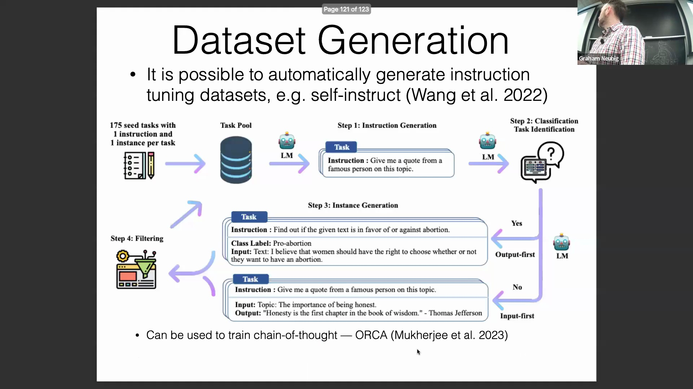

## 战略选择：单任务微调(Single-Task Fine-Tuning) vs. 指令微调(Instruction Tuning)
在单任务微调与通用指令微调之间进行战略抉择，主要取决于任务定义的明确程度、数据可用性(Data Availability)以及模型容量(Model Capacity)。对于定义明确且标注数据充足的特定任务，专用的单任务微调通常能带来更高的准确率。这一点对于参数容量有限、缺乏跨领域泛化能力的小规模模型尤为关键。显著的成功案例包括：针对文本转SQL(Text-to-SQL)任务进行深度微调的 Llama 2-7B 模型，以及 NLLB 模型（33 亿参数）。后者在翻译任务上，尤其是在低资源语言(Low-Resource Languages)场景下，表现匹敌甚至超越了规模大得多的基线模型。此外，当应用场景要求输出格式必须严格且高度可预测，而通用指令微调模型难以始终保证稳定性时，单任务微调同样是强烈推荐的技术路线。
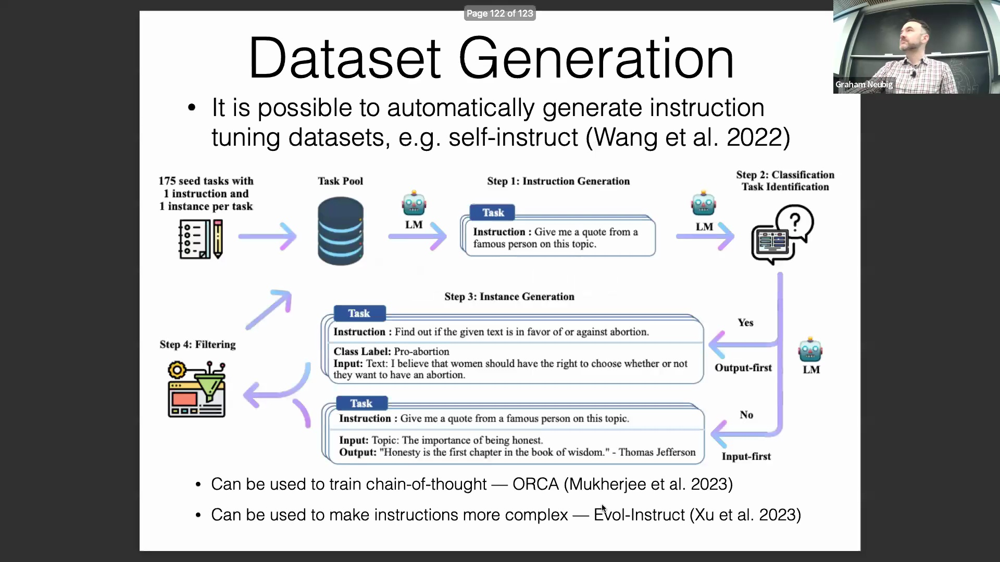

## 实现细节与课程总结
在落地应用自生成指令数据(Self-Generated Instruction Data)时，必须实施严格的质量控制(Quality Control)。当模型从种子提示词中采样以构建新指令时，通常需要部署专用的分类器或过滤机制(Filtering Mechanisms)对输出进行验证，以确保新指令与原始种子集存在实质性差异，并维持合理的难度梯度。这种自动化数据合成与严格过滤相结合的策略，有效实现了高质量数据集的可扩展构建。随着对上述核心方法论的深入探讨——涵盖架构选型、合成数据生成以及战略性微调权衡(Strategic Fine-Tuning Trade-offs)——本系列讲座至此圆满收官，为现代自然语言处理(Natural Language Processing, NLP)模型的适配与优化奠定了坚实的理论基础。
