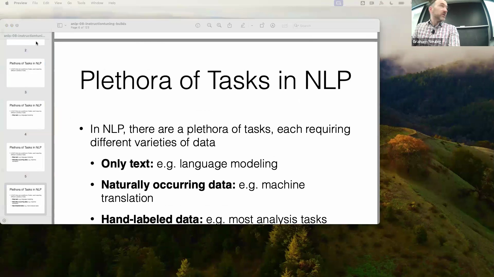
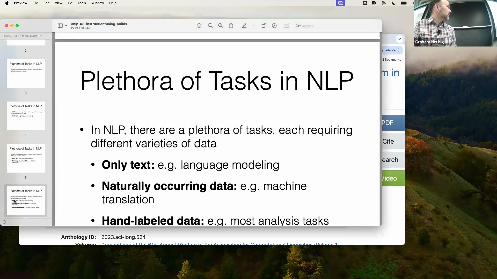
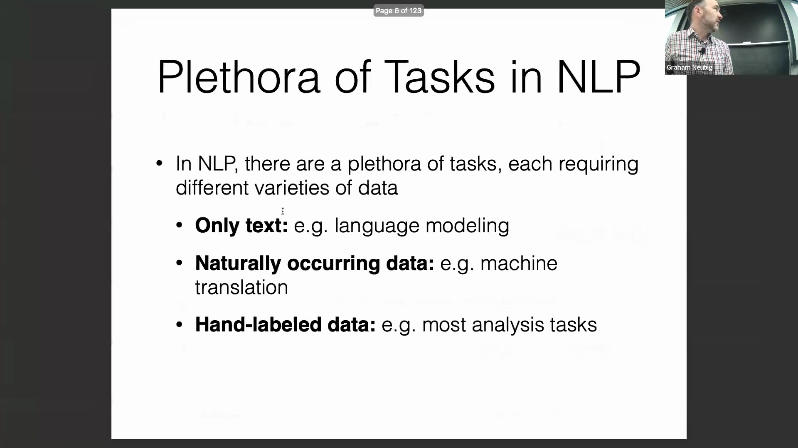
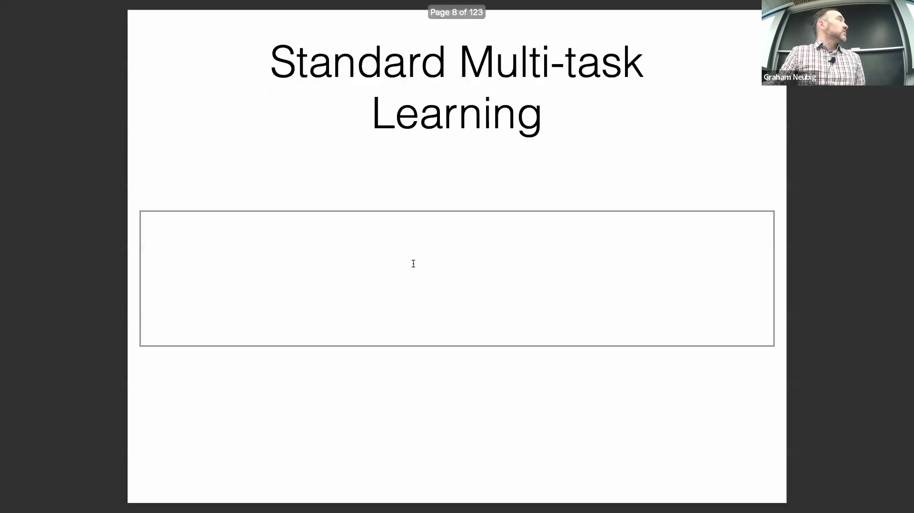
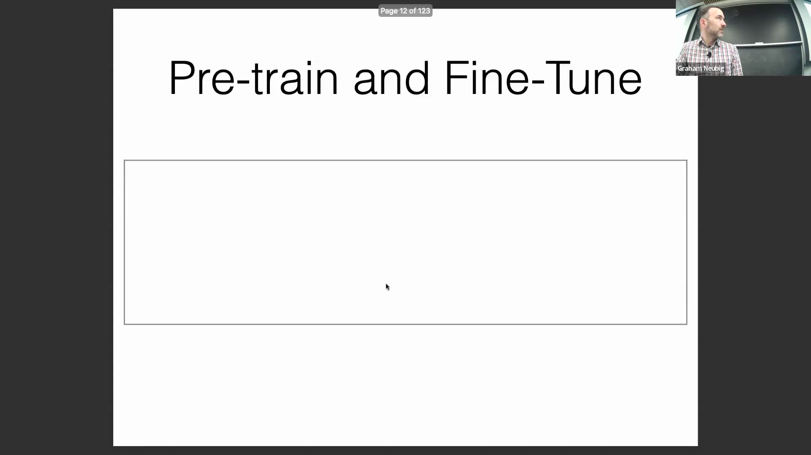
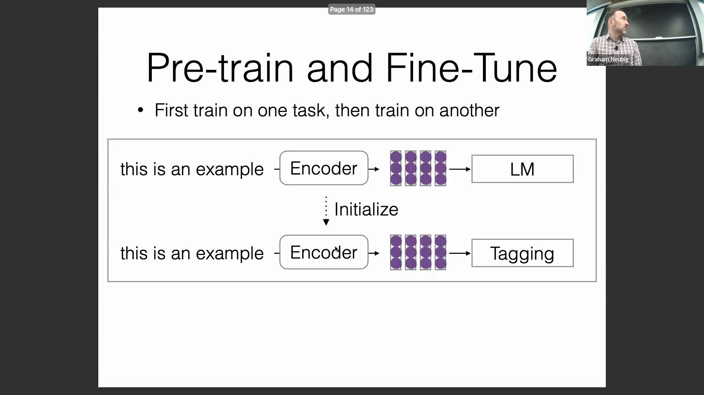
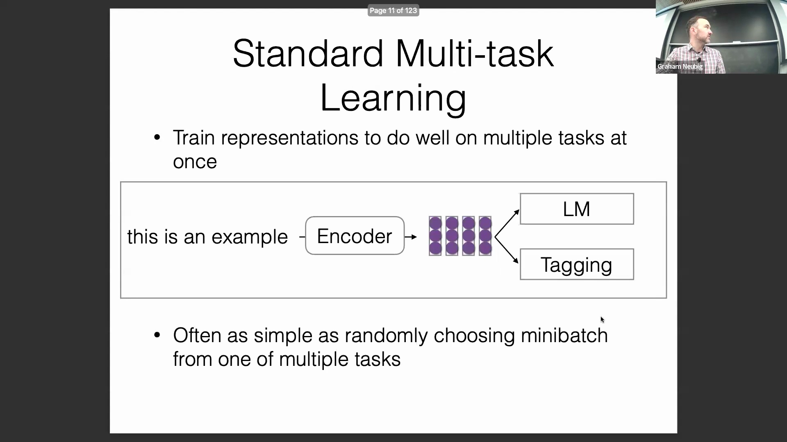
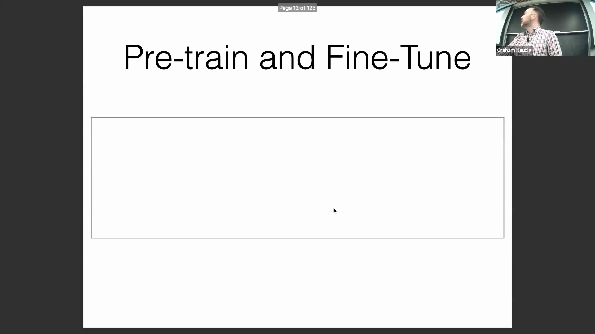

## 微调(Fine-tuning)与指令微调(Instruction Tuning)简介

微调与指令微调是将大语言模型(Large Language Model, LLM)部署为 ChatGPT 或 Gemini 等交互式聊天机器人的基础步骤。该流程旨在充分发挥大语言模型处理多样化任务的能力，而每种任务均需匹配特定类型的训练数据。尽管模型训练的早期阶段主要聚焦于语言建模(Language Modeling)等纯文本目标，但现实世界的应用往往需要更广泛的数据源。部分任务可依赖无需人工干预即可获取的自然产生数据(Naturally Occurring Data)，而其他任务则需要精心构建与人工标注的数据集。

## 利用自然产生与隐含的网络数据
机器翻译(Machine Translation)是自然产生数据的典型范例；无论是否借助人工智能工具，全球范围内的翻译活动都在持续进行，由此积累了庞大的语料库(Corpus)供模型学习。相比之下，问答(Question Answering)或命名实体识别(Named Entity Recognition)等任务通常依赖成本高昂的人工标注。有趣的是，研究表明仅使用原始文本(Raw Text)训练模型同样能取得显著成效，因为互联网本身隐含了可直接服务于特定任务的结构化信息。例如，在线短语手册(Phrasebooks)和多语言网站往往无意中提供了大量平行翻译数据(Parallel Translation Data)。研究甚至在标准的网络爬取数据(Web Crawl Data)中发掘出涵盖 44 种语言的超 3000 万个翻译对，这充分证明，通过常规途径获取的互联网数据已蕴含了丰富的监督信号(Supervisory Signals)。

此类现象同样适用于其他数据格式，例如包含结构化问答对的 FAQ(Frequently Asked Questions) 页面。在将模型适配为聊天机器人时，其底层训练已大量吸纳了此类自然产生的网络数据。这些数据无需进行显式的任务特定标注(Explicit Task-specific Annotation)，即可被直接采集与整合。

## 基座语言模型(Base Language Model)的局限性

尽管自然产生的网络数据十分丰富，但仅依赖无监督文本训练(Unsupervised Text Training)仍可能引发不可预测且缺乏专业性的输出。例如，在测试 GPT 的英译日功能时，模型在绝大多数情况下表现准确，但偶尔会输出罗马音(Romaji)而非标准的日文字符。这种异常行为源于模型过度拟合了在线语言学习短语手册中的常见模式，而罗马音往往是初学者使用的。专业级翻译系统通常能规避此类问题。此类边缘情况(Edge Cases)凸显了基座语言模型的核心局限：若缺乏针对性的引导(Targeted Guidance)，模型极易机械照搬互联网上的原始内容，即便这些内容在特定语境下并不适用。

## 多任务学习(Multi-task Learning)策略

为克服上述不稳定性，现代人工智能开发广泛引入了多任务学习策略，即训练模型同时完成多项任务。其核心原则在于跨任务共享参数(Parameter Sharing)。在大规模 LLM 中，几乎所有参数均为共享状态；而在 BERT 等架构中，共享的骨干网络(Backbone Network)通常会额外接入特定任务的分类头(Classification Head)。具体实现方式较为直观：模型可在不同任务间交替输入小批量数据(Mini-batch Data)，亦可将各任务专属数据集混合至统一的训练语料库中。当所有数据均以文本形式呈现时，混合策略能显著简化训练流程，促使模型学习到具备跨领域泛化(Cross-domain Generalization)能力的联合表示(Joint Representation)。

## 预训练(Pre-training)与微调(Fine-tuning)范式

与同步多任务训练(Synchronous Multi-task Training)相对的另一种路径是顺序式预训练与微调。在此范式下，模型首先攻克语言建模等通用目标，随后再针对特定的下游任务(Downstream Tasks)进行适配。该路径主要由计算效率(Computational Efficiency)驱动：若为每个新任务都从头训练一个参数量达 700 亿(70B)的模型，其成本将极为高昂且资源消耗巨大。通过集中算力完成计算密集的预训练阶段，广大开发者即可高效利用规模较小的专用数据集对模型进行微调。此外，这种两阶段分离架构也显著提升了模型安全性：基础预训练(Base Pre-training)可兼容海量且未经过滤的原始互联网数据，而后续精细的微调阶段则能有效过滤有害内容(Harmful Content)，确保模型输出符合既定规范与安全标准。

然而，该策略并非在所有场景下均为最优解。若针对特定任务的高质量微调数据极为稀缺，采用标准的多任务学习往往是更优选择，从而在最大化利用有限资源的同时有效抑制过拟合(Overfitting)。最终在顺序微调与同步多任务学习之间作何抉择，取决于数据可获取性、计算预算(Computational Budget)，以及模型在泛化能力(Generalization Capability)与特定任务性能之间所需达成的平衡。
