## 联合多任务学习(Joint Multi-task Learning)与顺序微调(Sequential Fine-tuning)
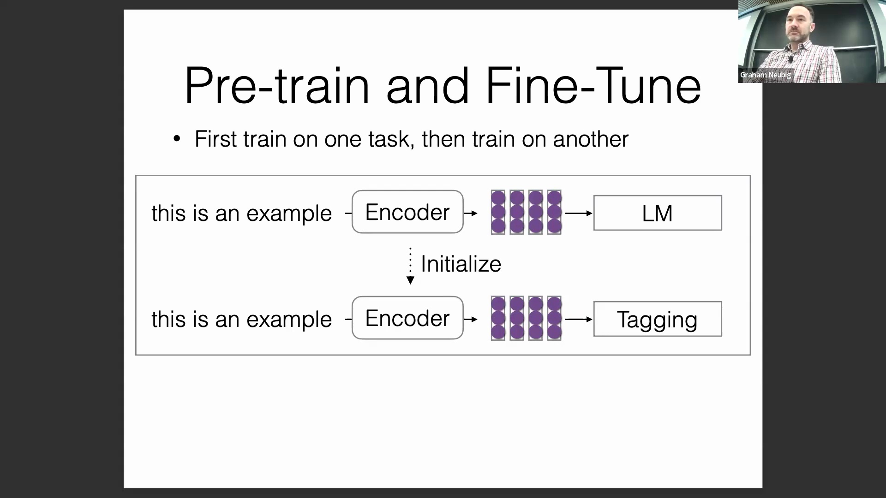
在联合多任务学习与“先预训练后微调(Pre-train then Fine-tune)”范式之间进行抉择时，数据分布(Data Distribution)与表征学习(Representation Learning)是关键考量因素。尽管调整小批量采样比例(Mini-batch Sampling Ratio)能在一定程度上缓解特定任务数据稀缺的问题，但研究表明，同时联合训练多个目标通常能在下游任务(Downstream Tasks)中取得更优异的性能。其核心假设在于：联合训练会促使模型学习出共享的内部表征(Shared Internal Representations)，并针对所有任务进行全局优化。相比之下，仅基于语言建模(Language Modeling)进行预训练可能导致模型陷入局部最优(Local Optima)，从而缺乏执行最终目标任务（如情感分析(Sentiment Analysis)或结构化标注(Structured Labeling)）所需的特定特征显著性(Feature Salience)。
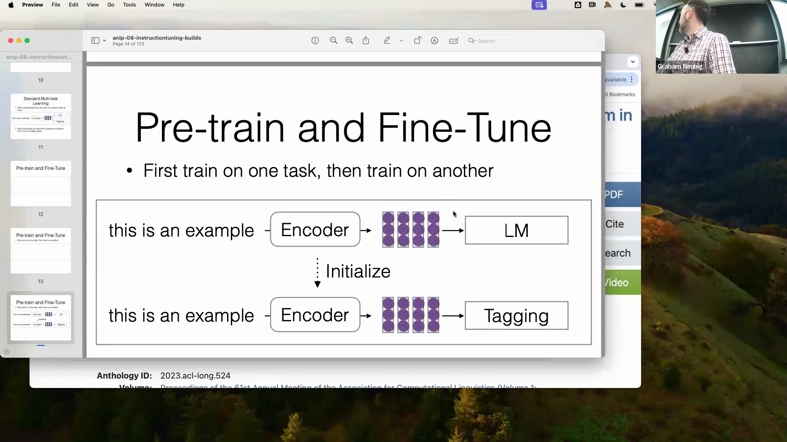

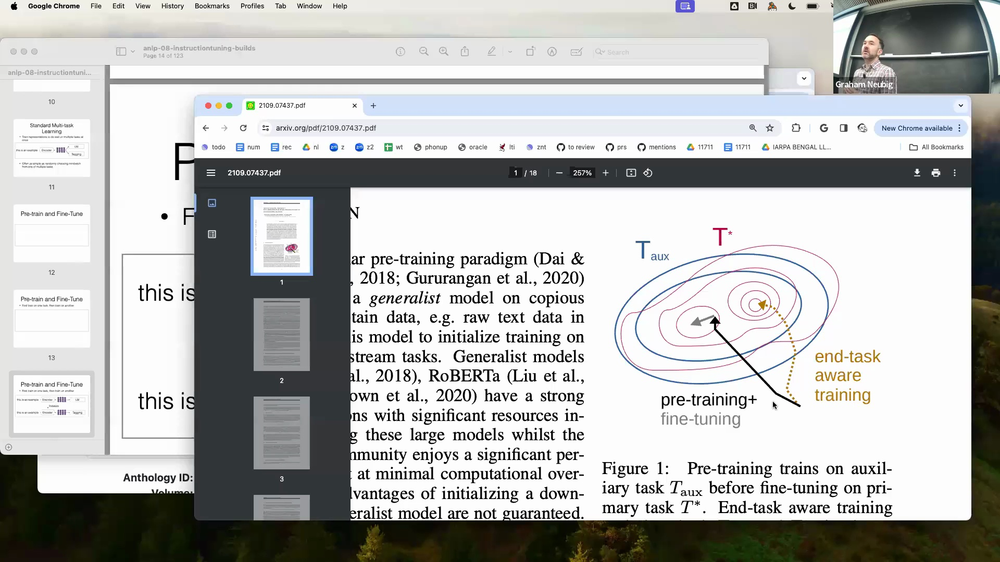

## 早期安全性整合(Early Safety Integration)与标准流水线(Standard Pipeline)
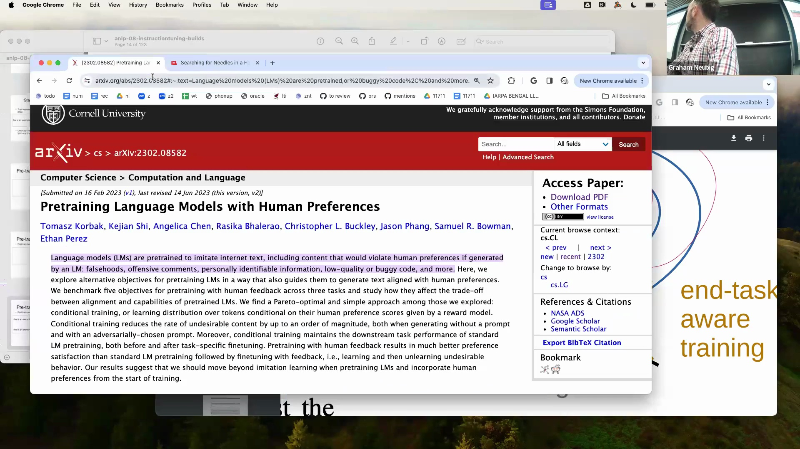
早期目标整合的优势同样延伸至模型对齐(Model Alignment)与安全性领域。近期关于毒性缓解(Toxicity Mitigation)的研究表明，在初始训练阶段即融入安全概念(Safety Concepts)，相较于模型收敛(Convergence)后再进行安全微调(Safety Fine-tuning)，能够产生显著更稳健的结果。早期的介入塑造了优化景观(Optimization Landscape)，有效防止模型固化那些在后期难以消除的有害模式(Harmful Patterns)。尽管联合训练具备上述技术优势，但顺序式预训练与微调(Sequential Pre-training and Fine-tuning)的工作流依然是行业标准。其主要驱动力在于计算效率(Computational Efficiency)：只需投入一次大规模预训练的成本，即可让广大研究社区高效地将基础模型(Foundation Model)适配至众多下游应用中，从而避免重复承担高昂的初始计算开销。
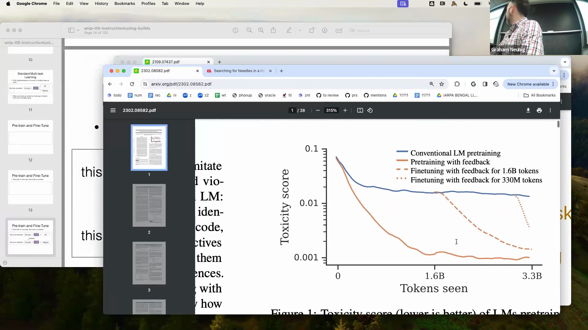

## 指令微调(Instruction Tuning)：融合提示(Prompting)与微调
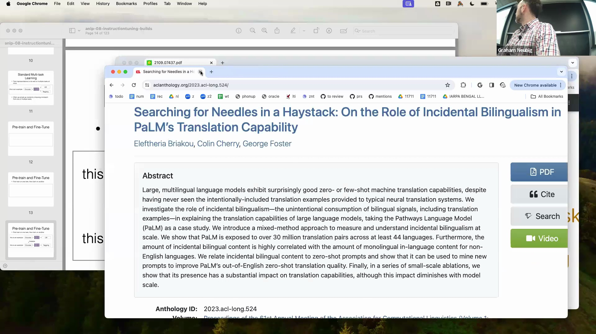
指令微调(Instruction Tuning)在静态提示(Static Prompt)与传统微调之间架起了桥梁。标准提示方法通常依赖于冻结的预训练编码器(Frozen Pre-trained Encoder)，并通过固定文本前缀(Fixed Text Prefix)来定义任务；而指令微调则主动更新模型权重(Update Model Weights)，以优化基于提示的生成效果。在训练阶段，模型会学习大量特定任务的提示及其期望输出(Expected Outputs)，从而掌握识别指令线索(Instruction Cues)并生成准确且具备上下文感知能力(Context-aware)的回复。这种混合机制确保模型不仅理解提示的结构化格式，更内化了可靠执行多样化用户指令所需的行为灵活性(Behavioral Flexibility)。
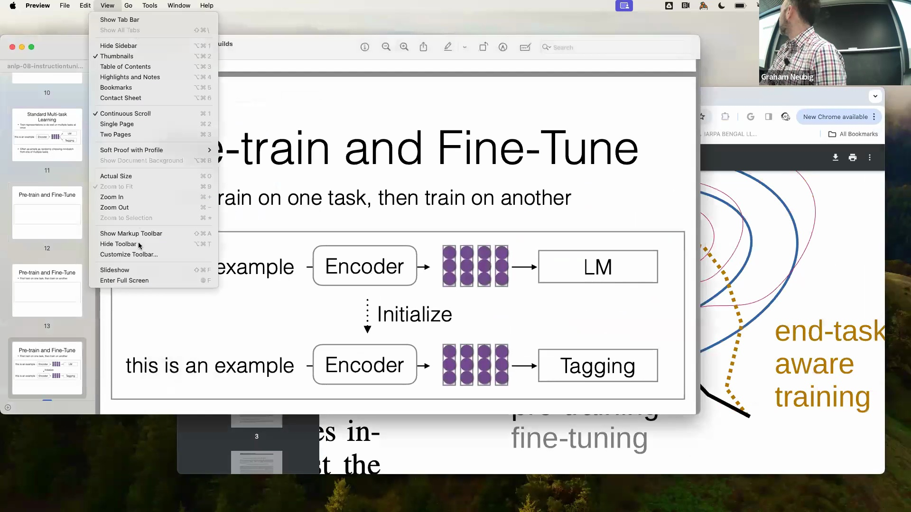
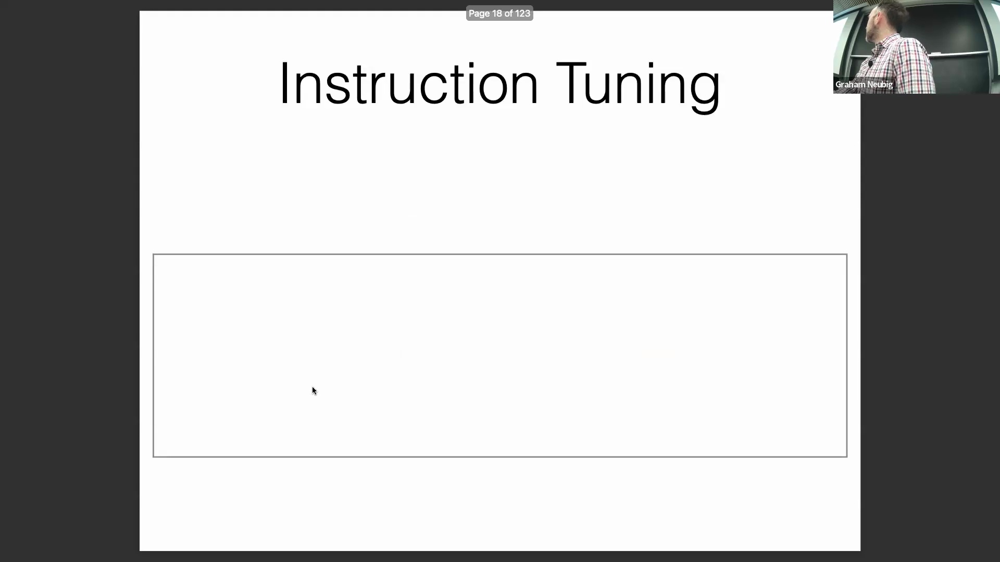
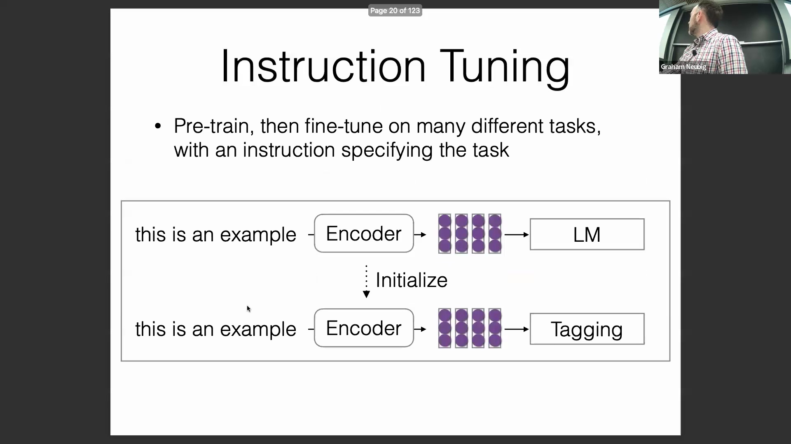

## 全量微调(Full Fine-tuning)的内存瓶颈(Memory Bottleneck)
全量微调(Full Fine-tuning)在概念上虽直观，但在实践中却面临严峻的显存限制(Memory Constraints)。更新大语言模型(Large Language Model)需同时在显存中存储模型参数(Model Parameters)、梯度(Gradients)以及优化器状态(Optimizer States)。以参数量达 650 亿(65B)的模型为例，仅权重与梯度在 16 位精度(16-bit Precision)下便会占用约 260 GB 显存。若进一步引入 Adam 等优化器（需维护一阶矩估计(First Moment Estimate)与二阶矩估计(Second Moment Estimate)），内存挑战将急剧加剧。传统上，为避免数值下溢与上溢(Numerical Underflow/Overflow)及训练不稳定，这些矩估计需以 32 位精度存储，这就要求额外保留一份 32 位的主参数副本(Master Parameter Copy)。再叠加前向传播(Forward Propagation)与反向传播(Backward Propagation)所产生的激活内存(Activation Memory)（其容量与批次大小(Batch Size)和序列长度(Sequence Length)呈正相关），一套基础的全量微调配置往往需要 1000 至 1400 GB 的 GPU 显存。
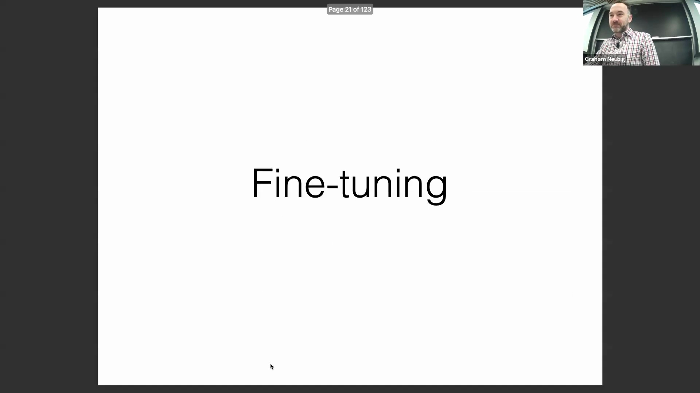

## 现代精度进步(Modern Precision Advances)与硬件限制(Hardware Constraints)
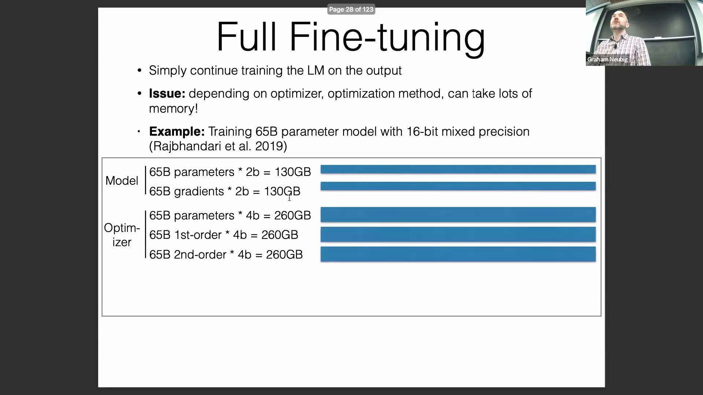
数值精度(Numerical Precision)领域的最新进展在一定程度上缓解了上述显存压力。业界从标准 FP16 向 BF16 (Brain Float 16) 的演进显著提升了训练稳定性(Training Stability)，使得优化器状态能够以更紧凑的格式高效存储，从而免除了冗余的 32 位参数副本。此项优化将平均每个参数的内存占用降至约 8 字节，但整体基础需求依然庞大。尽管软件层面取得了这些突破，激活内存(Activation Memory)仍构成一项硬性瓶颈。将上述需求与标准 GPU 的显存规格(VRAM Specifications)及市场定价进行交叉对比后可明确看出：全量微调必须依赖企业级硬件(Enterprise-grade Hardware)，或需借助参数高效微调(Parameter-Efficient Fine-Tuning, PEFT) 技术，方能实现更广泛的应用普及。
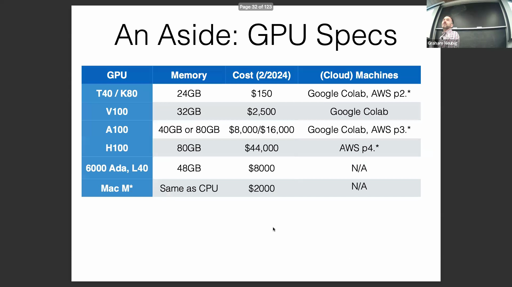