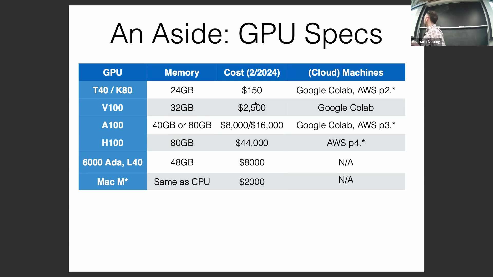
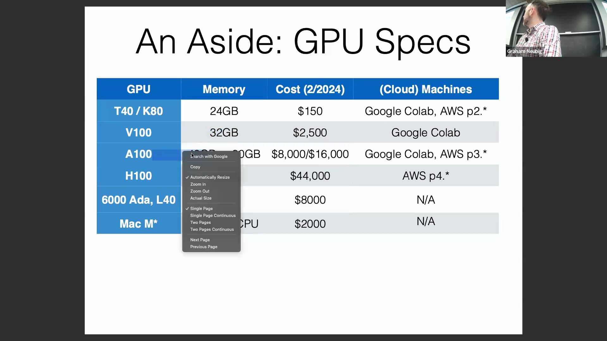
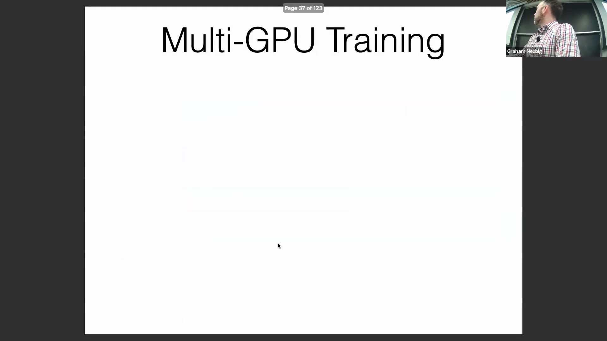
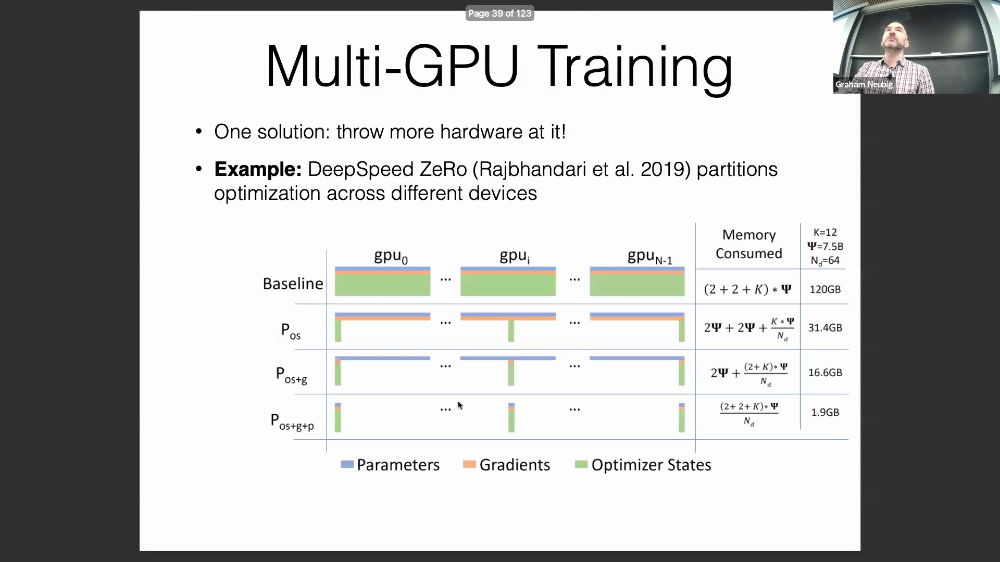
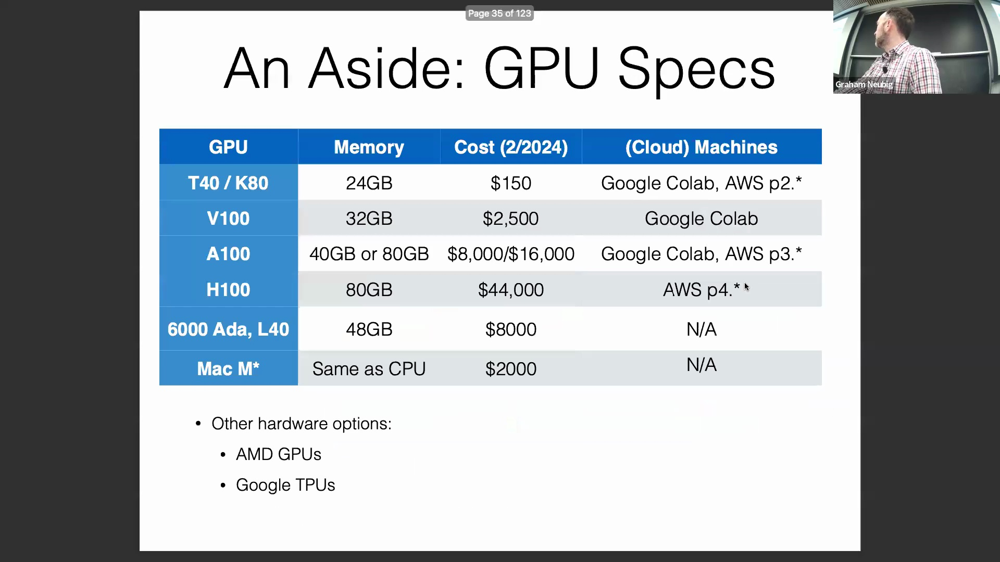
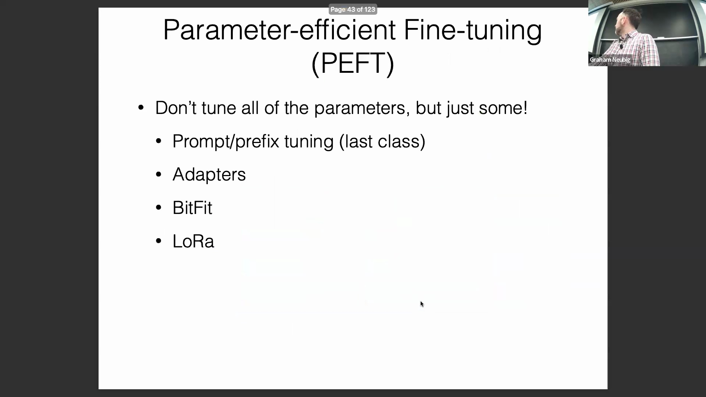
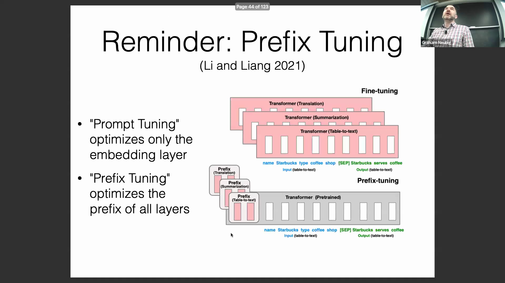
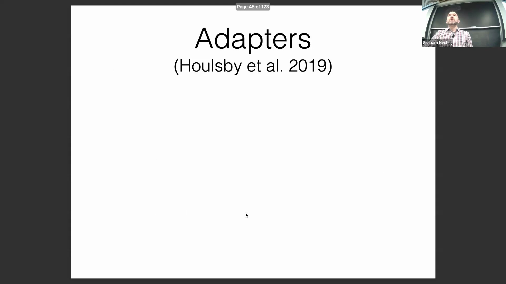
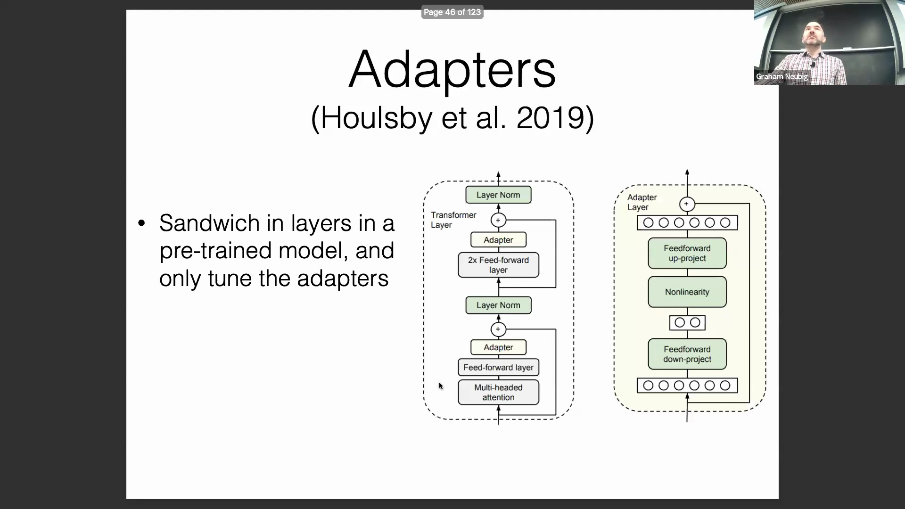

## GPU 硬件限制与规模经济

标准计算硬件(Standard Computing Hardware)对全量模型微调(Full Fine-tuning)构成了重大障碍。消费级与云端 GPU 的显存(Video RAM, VRAM)容量通常介于 24GB 至 80GB 之间，而 Apple Silicon 芯片则依赖于 CPU 与 GPU 共享的统一内存架构(Unified Memory Architecture)。此类单设备配置均无法同时容纳存储大语言模型(Large Language Model, LLM)参数、梯度(Gradients)及优化器状态(Optimizer States)所需的约 130GB 显存开销。尽管存在 TPU(Tensor Processing Unit)、Google 定制训练芯片及 AWS Trainium 等专用加速器(Dedicated Accelerators)，但标准 NVIDIA GPU 仍是学术界与科研界的首选方案。这主要归因于其在处理动态计算图(Dynamic Computational Graphs)与非传统架构时的灵活性，尽管其底层硬件设计本质上是针对静态、大规模矩阵运算(Static, Large-scale Matrix Operations)进行了优化。

从头开始训练(Training from Scratch)模型的替代方案，对大多数研究者而言在经济上难以承受。工业级训练集群(Industrial-scale Training Clusters)——例如 Meta 部署的数十万块 H100 GPU——往往意味着数十亿美元的资金投入。这种极高的成本结构解释了为何学术界与开发者社区高度依赖通过微调来适配现有的基础模型(Foundation Models)，而非从零开始训练全新模型。

## 使用 DeepSpeed ZeRO 进行分布式训练(Distributed Training)

为突破单张 GPU 的显存限制(Memory Constraints)，多 GPU 分布式训练成为核心的工程解决方案。该领域应用最广泛的框架是 DeepSpeed ZeRO(Zero Redundancy Optimizer)，它通过在多设备间系统化地划分模型训练状态(Model Training States)，有效消除了冗余的显存占用。

DeepSpeed 采用渐进式阶段(Progressive Stages)策略来实现显存优化。阶段 1(Stage 1) 仅对优化器状态进行划分（例如 Adam 优化器的一阶矩与二阶矩估计），这通常占据最大的显存开销。阶段 2(Stage 2) 在此基础上进一步将梯度在设备间进行分片(Sharding)，而阶段 3(Stage 3) 则进一步划分模型参数(Model Parameters)本身。每一后续阶段均能显著降低显存需求，但也会引入更高的 GPU 间通信开销(Inter-GPU Communication Overhead)。在实际应用中，部署阶段 1 或阶段 2 通常能实现最佳的权衡，使得数十亿参数规模(Billion-scale Parameters)的模型仅凭少量 GPU 即可高效微调，且不会引发严重的性能衰减。

## 用于分布式训练的现代生态系统框架
从业者通常无需手动实现 ZeRO 分区(Zero Partitioning)，而是借助高级训练库(High-level Training Libraries)来封装分布式状态管理的复杂性。诸如 Hugging Face Accelerate、TRL(Transformer Reinforcement Learning) 及 Ax 等框架，均在底层集成了 DeepSpeed 或类似的分布式策略(Distributed Strategies)。这些工具使研究人员仅需极少配置即可在多设备间扩展训练(Scaling Training)，从而无需深厚的底层分布式系统工程(Distributed Systems Engineering)专业知识，即可实现大模型的高效适配。

## 参数高效微调(Parameter-Efficient Fine-Tuning, PEFT)与适配器架构

作为更新全量模型权重的高效替代方案，参数高效微调(PEFT)应运而生。通过冻结绝大部分预训练参数并仅更新极小部分参数，PEFT 大幅降低了显存开销，使在受限硬件上针对多样化数据集进行快速适配成为可能。早期方法如前缀微调(Prefix Tuning)通过优化注入至每个 Transformer 层的软提示(Soft Prompts)来实现目标，但此后更具结构化的方法逐渐占据主流。

适配器(Adapter)是一种广泛采用的 PEFT 策略，它将轻量级神经网络模块直接插入标准 Transformer 架构中。适配器通常嵌入于多头注意力层(Multi-Head Attention Layer)与前馈神经网络层(Feed-Forward Network)之间，采用瓶颈结构(Bottleneck Design)：下投影层(Down-projection Layer)将隐藏表征(Hidden Representations)压缩至低维空间，经非线性激活函数(Non-linear Activation Function)处理后，再由上投影层(Up-projection Layer)恢复至原始维度，最终将其叠加至残差流(Residual Stream)中。

在保持原始基础权重(Base Weights)冻结的前提下，将数据流导向这些小型可训练路径，适配器能够以极少的计算资源与 GPU 显存，实现与全量微调相媲美的下游任务(Downstream Tasks)性能。