## 基于适配器的方法与多任务灵活性
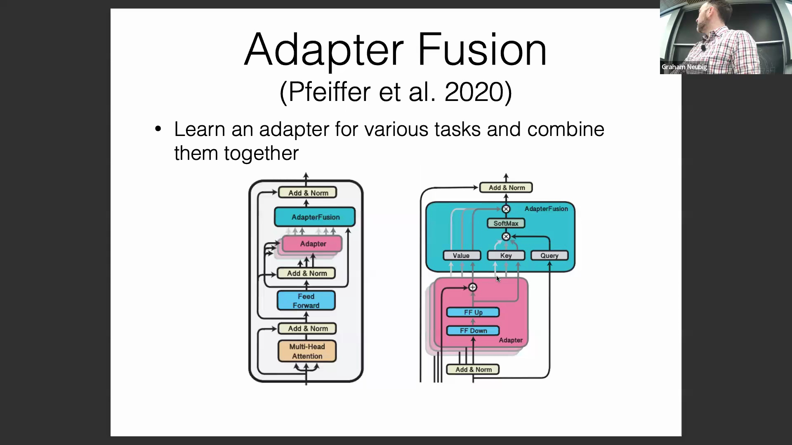
讨论首先围绕适配器（Adapter）模块展开，重点介绍了其注意力机制（Attention Mechanism），该机制使模型能够根据当前任务动态选择特定的适配器。这种模块化设计允许为单一任务训练专用组件，并在推理阶段将它们组合调用。文中还介绍了多语言（Multilingual）与多任务（Multi-task）的变体，允许集成语言专属（Language-specific）和任务专属（Task-specific）的适配器。从概念上看，该方法与“混合专家”（Mixture of Experts, MoE）架构相似，为模型适配提供了一条灵活且富有创新性的路径。

## LoRA：工作原理与微调后部署的便利性
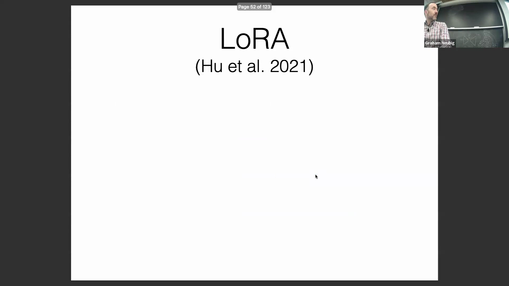
LoRA（低秩自适应，Low-Rank Adaptation）作为一种被广泛采用的技术被引入，它与适配器共享概念基础，但在架构上存在关键差异。 
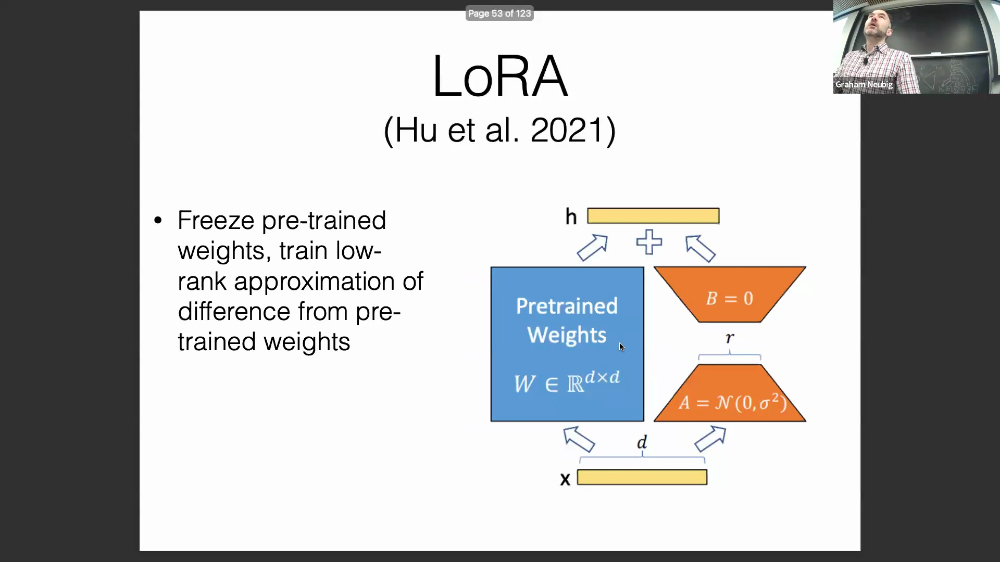
与传统适配器不同，LoRA 完全去除了非线性层（Non-linear Layers）。相反，它依赖于由降维矩阵（Down-projection Matrix）与升维矩阵（Up-projection Matrix）相乘构成的纯线性变换。尽管早期的示意图将其描绘为并行计算路径，但 LoRA 的更新值实际上可以直接叠加到预训练权重矩阵（Pre-trained Weight Matrix）上，从而在数学上实现完全等效的结果。
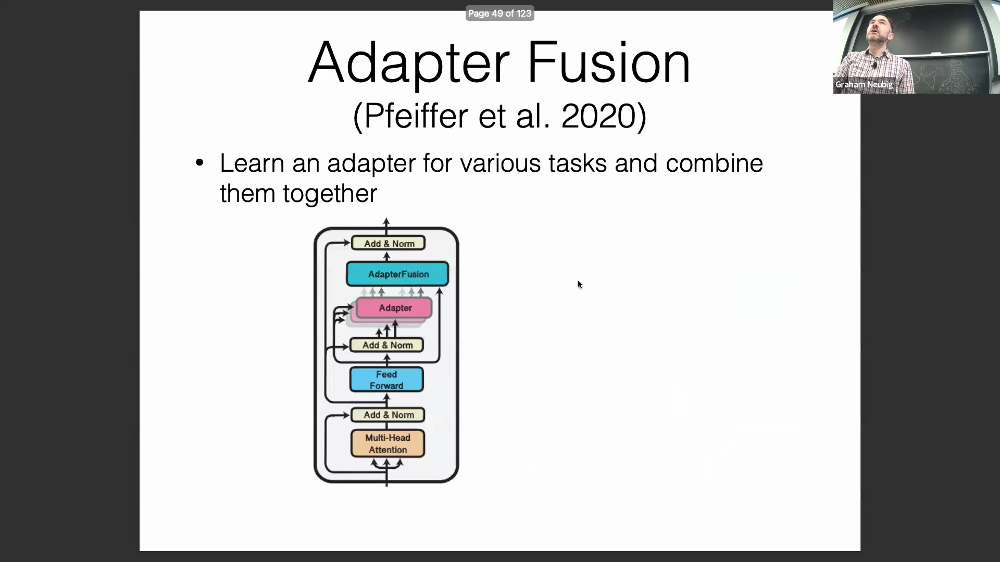
LoRA 的广泛流行主要归功于其微调后部署的便利性。微调完成后，训练得到的低秩矩阵（Low-Rank Matrices）可无缝合并回原始模型权重中。
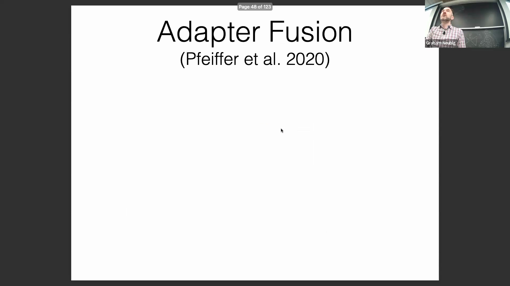
这使得模型的参数量与架构保持原样，无需引入额外组件或修改推理流程。这与基于适配器的方法形成鲜明对比，后者通常需要加载额外的模型组件并依赖专门的推理代码。

## QLoRA：将量化与高效微调相结合
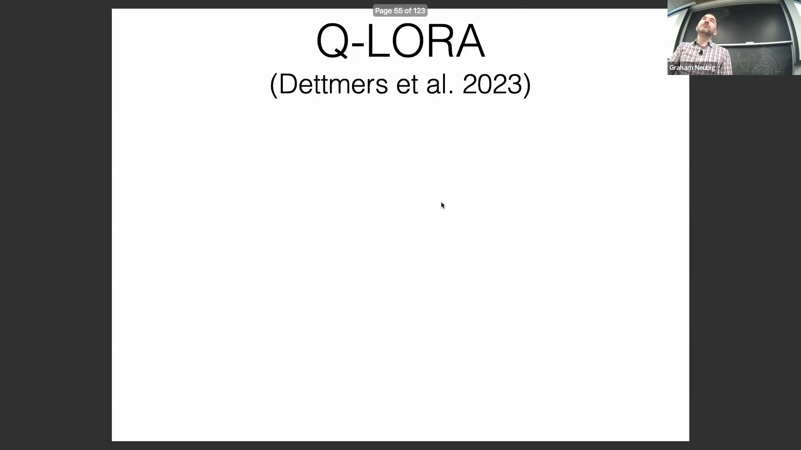
接下来重点介绍 QLoRA，它将模型量化（Model Quantization）与参数高效微调（Parameter-Efficient Fine-Tuning, PEFT）相结合，从而大幅降低了显存需求。
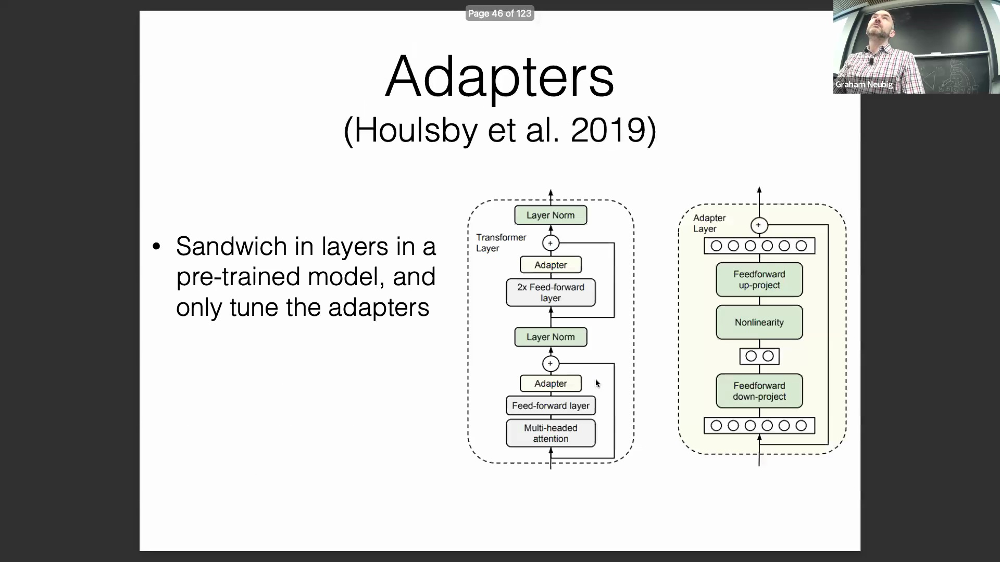
通过将模型参数从标准的 16 位精度（16-bit Precision）压缩至 4 位，内存占用急剧减少。例如，一个 16 位的 LLaMA 模型大约需要 130GB 的显存，而 4 位量化版本可将这一需求降至约 32.5GB。
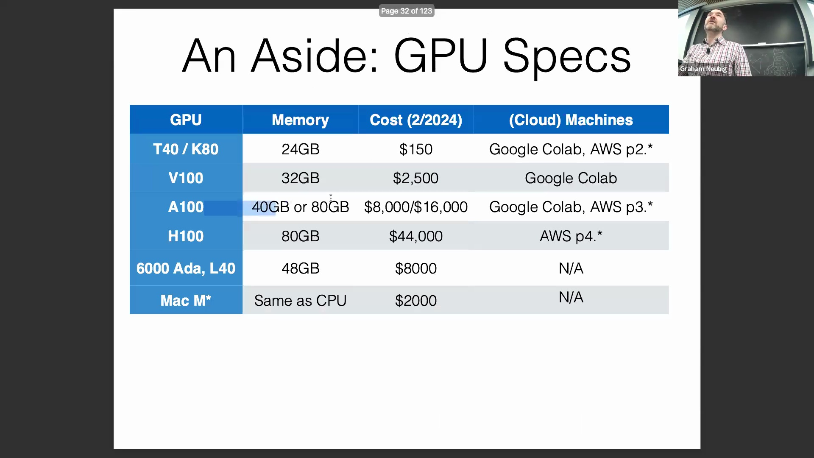
这种极小的模型体积使得在更广泛的硬件上进行微调成为可能，包括高端 GPU（如 NVIDIA A100、H100）以及配备大容量统一内存（Unified Memory）的消费级设备（如 MacBook）。
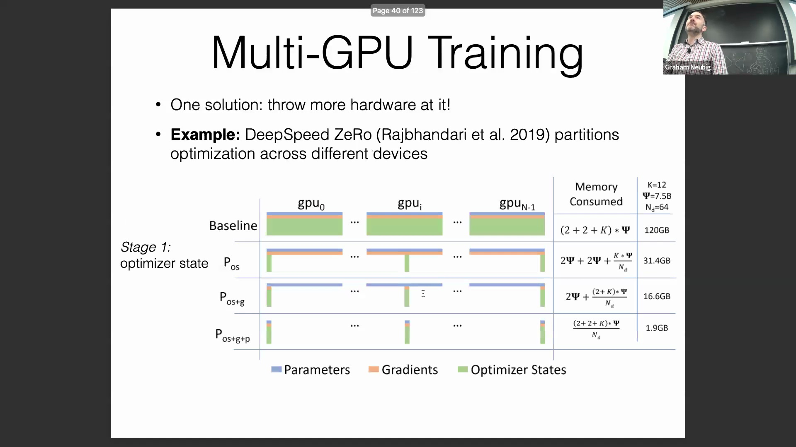
QLoRA 还通过 CPU 与 GPU 显存之间的高效分页机制（Paging Mechanism）进一步提升了资源利用率。针对潜在的精度损失担忧，讲者明确指出，优化过程并非在低精度下执行；基座模型（Base Model）始终以 4 位格式冻结，而梯度计算与传播则通过轻量级的 LoRA 层完成。大量实证结果充分验证了该方法的有效性。对于在硬件受限条件下训练大规模模型的场景，强烈推荐 QLoRA；而对于单张 GPU 上的较小规模模型（如 7B 或 13B 参数），标准 LoRA 依然能够胜任。
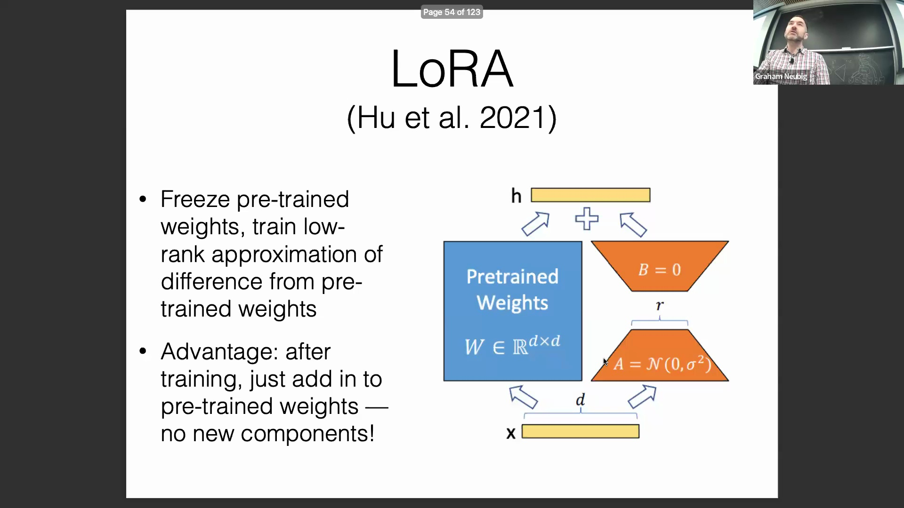

## BitFit 与 PEFT 方法的统一分解框架
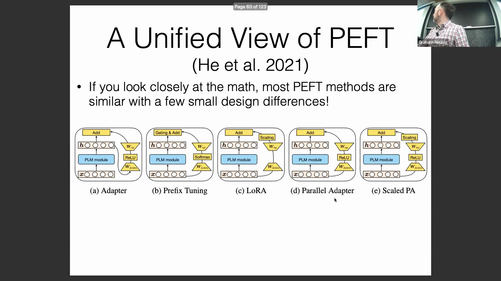
BitFit 被提出作为一种极其简单却高效的替代方案，该方法仅微调模型的偏置参数（Bias Parameters），而其余所有权重均保持冻结。它无需任何架构修改或额外的代码实现。
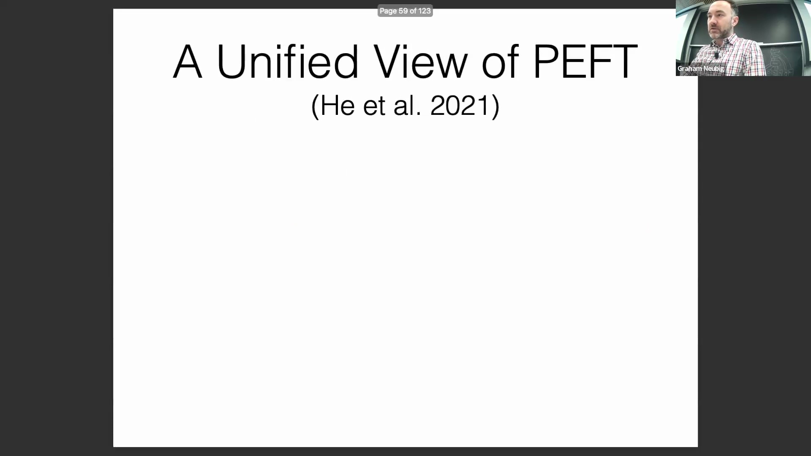
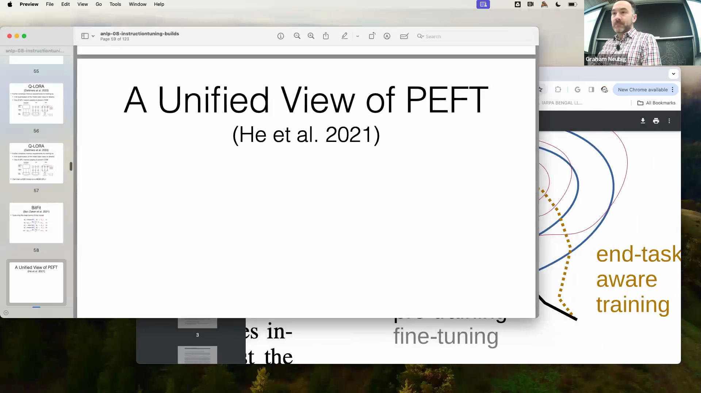
为了系统性地梳理这些技术，讲者引入了一个统一的分析框架，将各类参数高效微调（PEFT）方法解构为若干核心设计维度（Core Design Dimensions）。 
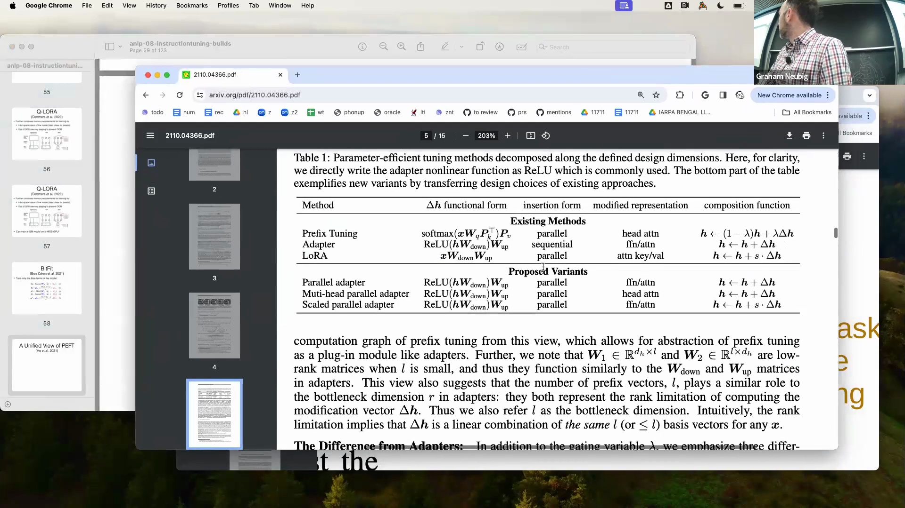
这些维度涵盖：非线性激活函数（Non-linear Activation Function）的形式、模块在网络中的插入位置、输入表示的修改方式，以及将修改后输出与原始表示进行融合的合并函数（Combination Function）。对比分析表明，适配器、LoRA 与前缀微调（Prefix Tuning）在本质上高度相似，其核心差异仅在于输入表示的注入位置以及非线性函数的选择（如 ReLU、Softmax 或无）。此外，LoRA 还额外引入了一个可学习的缩放因子（Scaling Factor）作为关键超参数。

## 参数高效微调方法的策略性选择
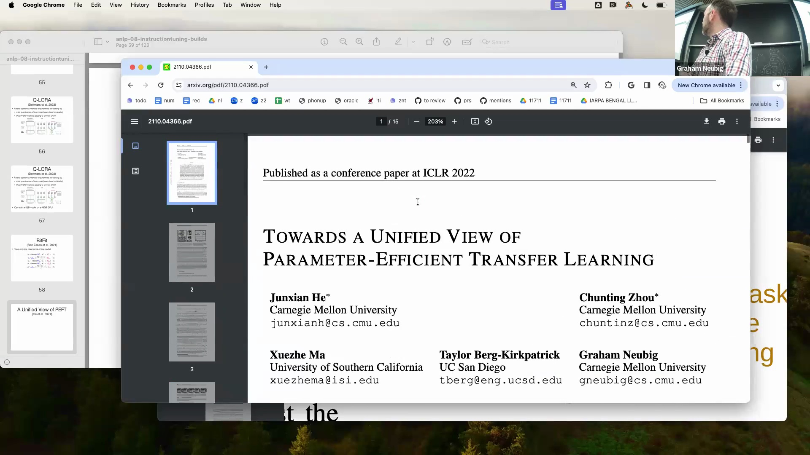
这一统一的分解框架不仅清晰地阐释了现有方法，还催生了更高效的变体，例如并行适配器（Parallel Adapter）与缩放并行适配器（Scaled Parallel Adapter）。在实际部署时，技术选型往往取决于部署便利性与任务复杂度之间的权衡。 

若追求极致的部署便利性与无缝集成，LoRA 与 BitFit 是最佳选择，因为它们完整保留了原始模型的架构。对于文本分类等相对简单的任务，即便是仅更新偏置的 BitFit 也能展现出与复杂方法相媲美的竞争力。针对参数预算（Parameter Budget）受限但任务复杂度较高的场景，前缀微调（Prefix Tuning）通常能提供卓越的性能。最后，在面对复杂任务且参数预算相对充裕时，采用传统适配器或多种 PEFT 技术的混合组合（Hybrid PEFT）往往能取得最优效果。