## 用于模型微调的自然语言处理(Natural Language Processing)任务简介
使用适配器(Adapters)或多种方法的混合方案通常能取得更好的效果。当前的研究重点已转向探索具体的自然语言处理任务，这一点至关重要，因为传统的微调(Fine-tuning)通常针对单一任务，而指令微调(Instruction Tuning)旨在构建能够同时处理多项任务的通用型模型。回顾这些任务主要有两个目的：它们代表了自然语言处理领域中关键的现实应用，并且构成了基础模型论文（如GPT(Generative Pre-trained Transformer)和Gemini）中用于展示模型能力的标准评估基准。
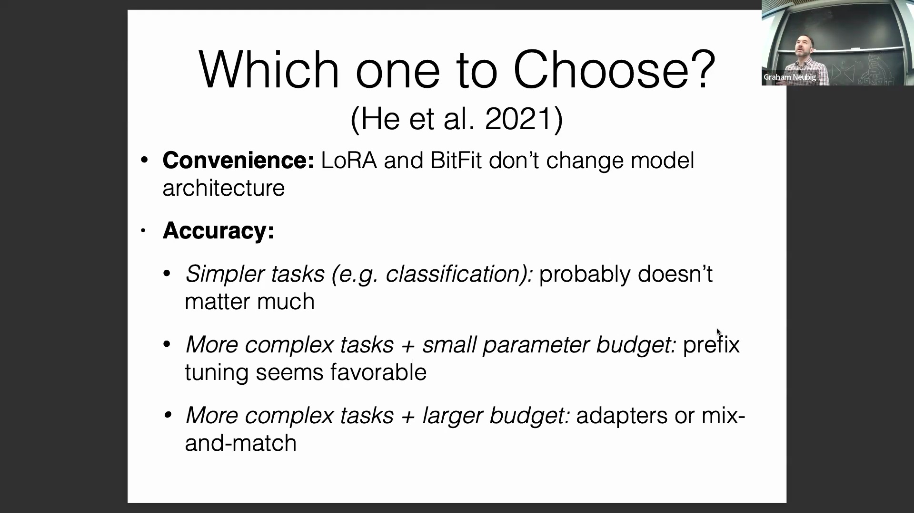
（提问过渡环节）
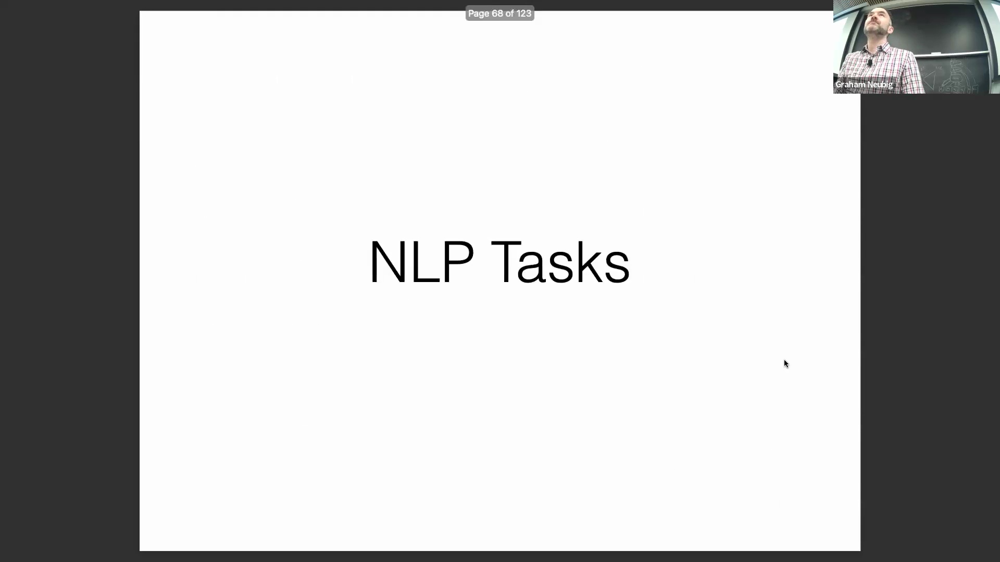
理解特定任务微调(Single-Task Fine-tuning)与通用建模(General Modeling)之间的差异，为评估模型在不同基准测试(Benchmarks)中的表现奠定了基础。
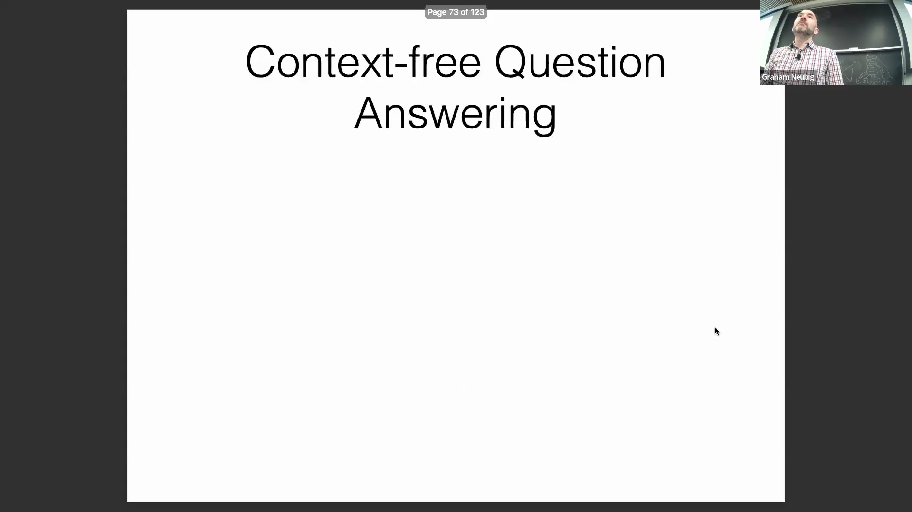

## 无上下文（闭卷）问答(Context-Free QA)
第一大类别是无上下文（或闭卷）问答，要求模型在不依赖特定外部文档的情况下回答问题。这类似于ChatGPT等模型在未进行网络搜索时响应提示词(Prompt)的工作方式。该领域广泛使用的基准是MMLU(Massive Multitask Language Understanding)数据集，其中包含专业法律等高难度领域的挑战性问题。例如，数据集可能会给出一个场景：一名推销员无视禁止擅入的标志，被地产上的爆炸装置炸伤。尽管该问题在法律上较为复杂，但正确答案通常会强调地产所有者设置陷阱所应承担的责任。
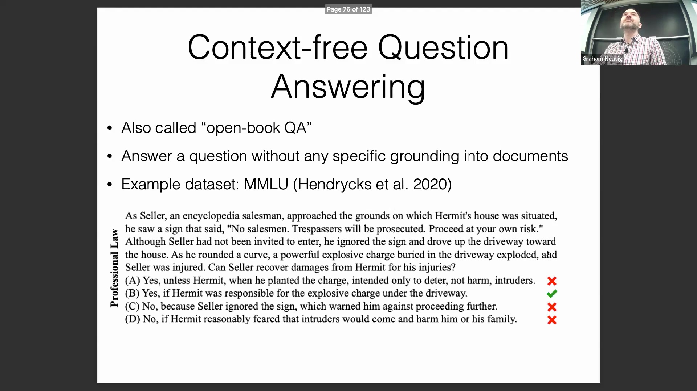
通过分析此类示例可以清楚地看出，这些数据集旨在测试模型的内部知识储备，而非外部检索能力。
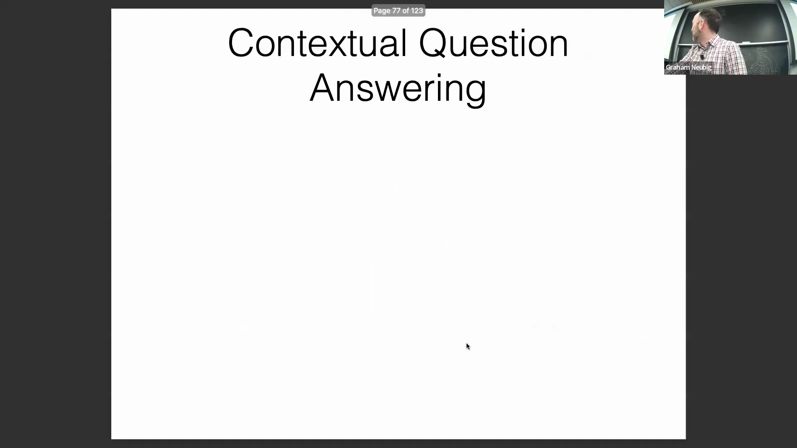

## 上下文问答与检索(Contextual QA & Retrieval)
下一项任务是上下文问答(Contextual QA)，其答案必须严格基于所提供的文档。该领域的一个知名数据集是Natural Questions，它主要依赖于维基百科文章。该任务主要有两种形式：“机器阅读理解”(Machine Reading Comprehension)，即模型基于单篇给定文档进行回答；以及检索增强生成(Retrieval-Augmented Generation, RAG)，即模型需在更庞大的语料库中进行检索，以定位相关信息并回答查询。对于致力于构建实用、可投入生产环境的自然语言处理系统的开发者和研究人员而言，这项能力具有极高的优先级。
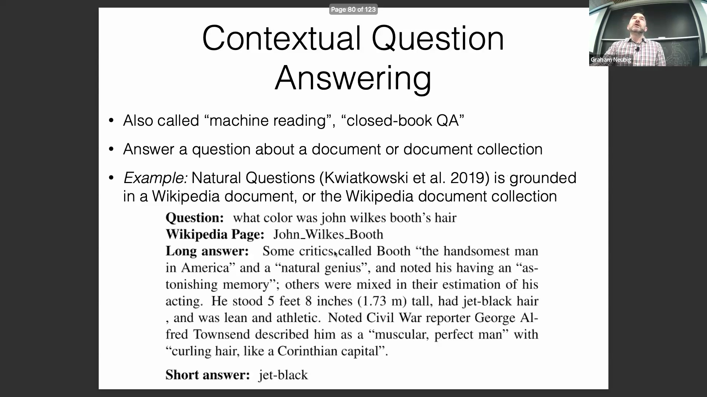

## 代码生成(Code Generation)
代码生成是另一项备受关注的任务，尤其在构建自动化开发系统方面。它涉及根据自然语言指令生成编程代码（如Python或SQL）。HumanEval数据集是该领域的标准基准(Benchmark)，其中的提示词(Prompt)要求模型根据文本描述和输入/输出示例，使用标准库编写函数。需要注意的是，HumanEval仅作为一个相对简单的基线(Baseline)，不包含外部依赖库；针对该领域的高级研究，还有更复杂的数据集可供选择。
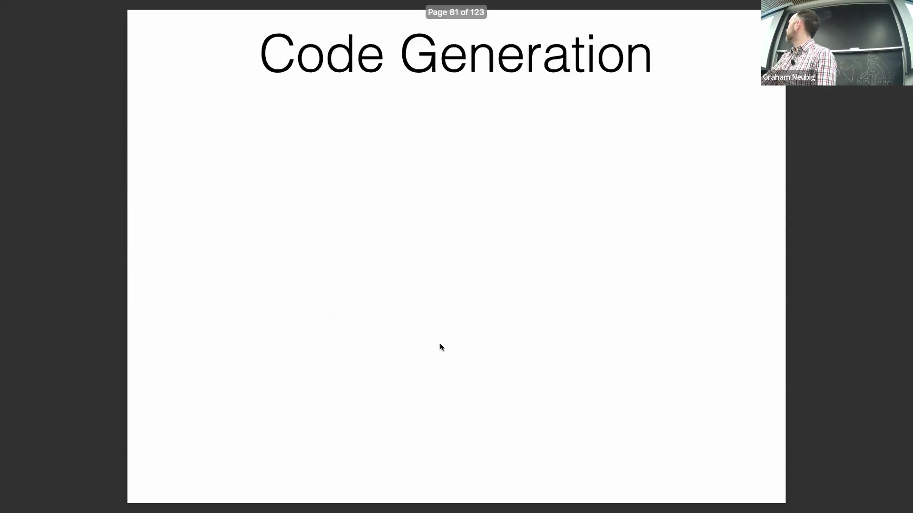
处理这些编程提示词突显了模型如何根据纯文本指令精准处理语法结构、逻辑关系及第三方库的调用。
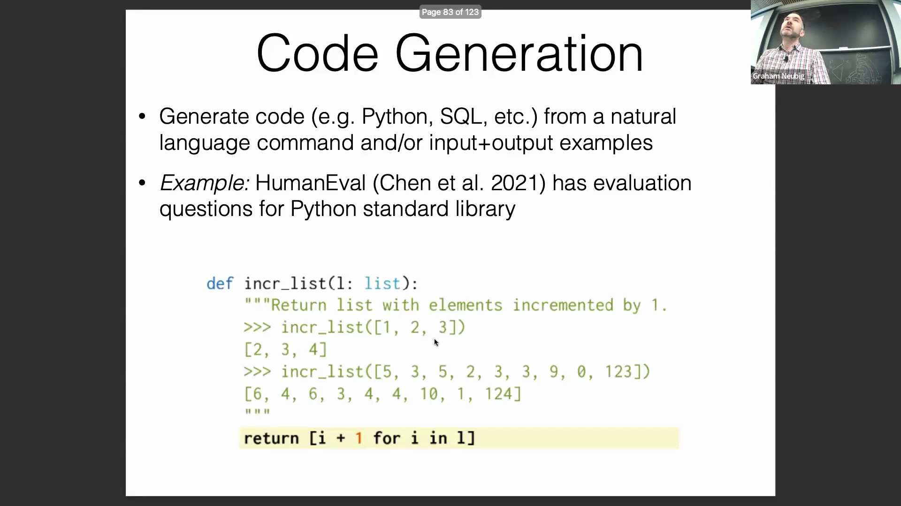

## 文本摘要(Text Summarization)任务
文本摘要任务主要分为单文档摘要(Single-Document Summarization)和多文档摘要(Multi-Document Summarization)两类。单文档摘要旨在将一篇长文本压缩为较短的版本，目前在英语场景下开箱即用(out-of-the-box)的效果已相当出色。然而，多文档摘要在很大程度上仍面临挑战。它需要将大量主题相同但通常彼此缺乏连贯性的文档，综合提炼成一篇逻辑连贯的概述。WikiSum数据集是这方面的典型代表，它提供指向多个维基百科页面的链接，并要求模型生成相应主题的引言段落。这项能力对于自动生成文献综述、市场报告及其他综合性洞察具有极高的应用价值。
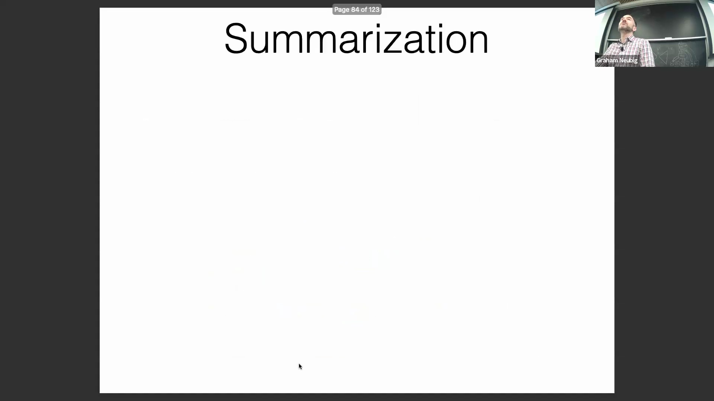
解决多文档摘要问题需要模型能够有效过滤噪声、消除信息矛盾，并在多个信息源之间保持语义连贯性。
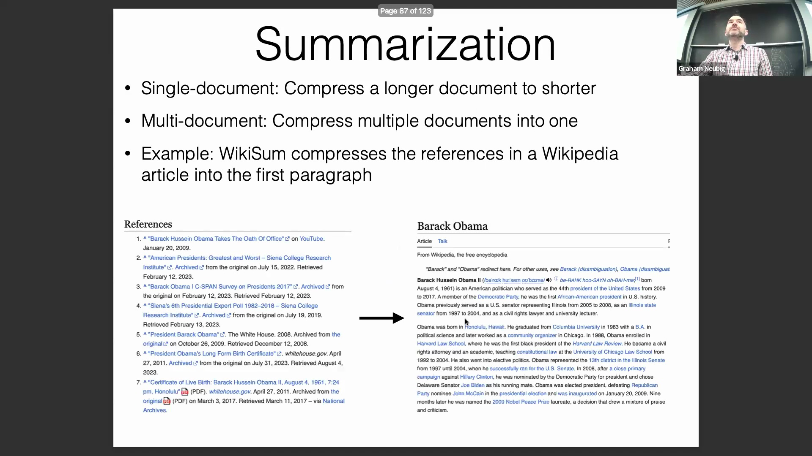

## 信息抽取(Information Extraction)
信息抽取侧重于从非结构化文本中提取结构化数据。它包含几个核心子任务：命名实体识别(Named Entity Recognition)、实体链接(Entity Linking)、实体共指消解(Entity Coreference Resolution)以及事件抽取(Event Extraction)。像OntoNotes这样的数据集为这些任务提供了大量深度标注的样本。在实际应用中，这直接赋能业务流程自动化，例如根据非结构化文本输入，自动填充Excel或Google Sheet中的结构化字段。
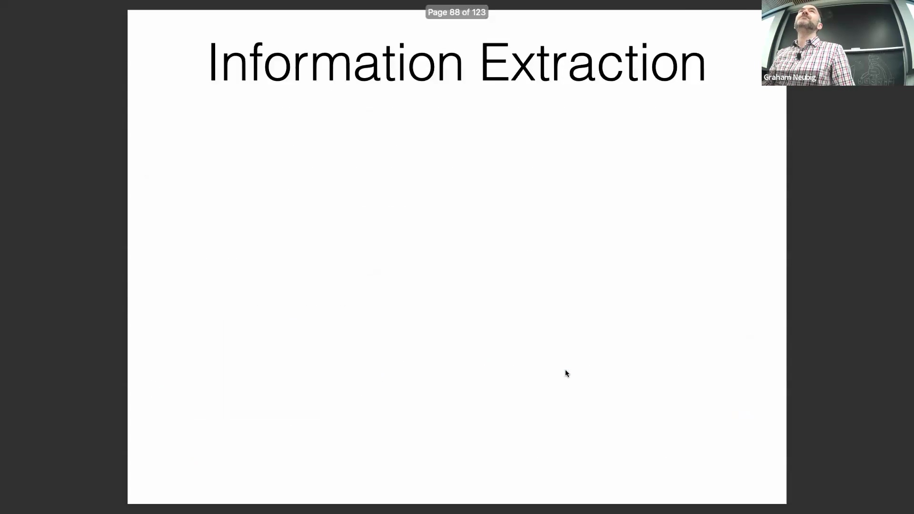

## 机器翻译(Machine Translation)与全球信息公平
机器翻译涉及将文本从一种语言转换为另一种语言。评估翻译（及摘要）质量颇具挑战，通常依赖于与人工参考译文进行对比的传统相似度指标（如BLEU）或现代神经评估指标(Neural Evaluation Metrics)。FLORES数据集是一个突出的基准，它包含了约一千篇被翻译为101种不同语言的维基百科文章。该数据集备受重视，因为提升低资源语言(Low-Resource Languages)的翻译能力，将直接促进全球信息的公平传播。
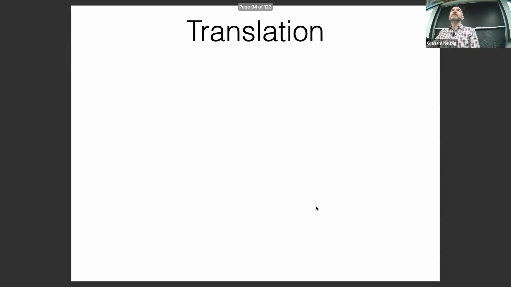

## 通用基准测试(General Benchmarks)
除了针对特定行业的应用之外，还存在一些通用基准测试，旨在评估模型的基础语言能力与推理能力。BIG-bench(Beyond the Imitation Game Benchmark)就是一个典型例子，它包含多种多样的任务，例如追踪在朋友间传递并打乱顺序的物品、计算历史日期，以及解决涉及“诚实者与说谎者”逻辑的多步推理谜题。现代大语言模型（如Gemini）会针对这些多样化的任务类别进行广泛评估，以衡量其整体的认知水平与语言熟练度。
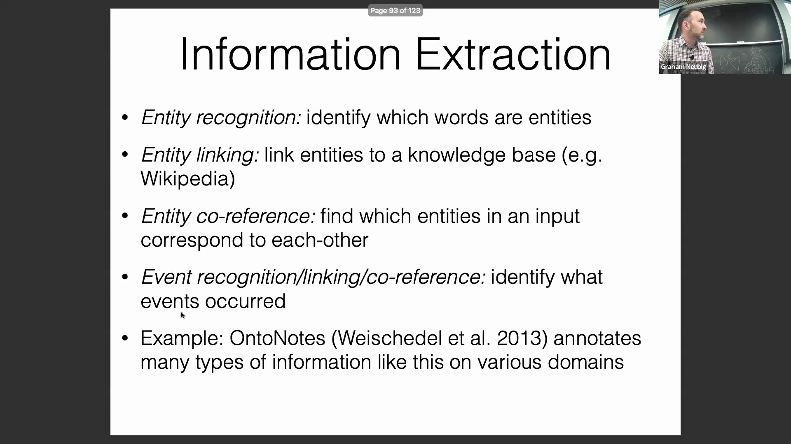
这些综合性基准测试提供了对模型能力的全面视角，超越了单一任务的表现，转而评估更广泛的复杂推理技能。
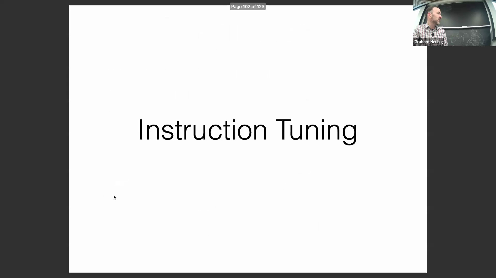