## 评估中数据污染的检测与预防
在模型基准测试(Benchmarking)中，一个核心关注点是确保测试数据(Test Data)未泄露至训练语料库(Training Corpus)中。尽管在概念相似的数据上进行训练通常是可以接受的（因为模型在预训练阶段不可避免地会接触到网络上的常见语言模式），但训练集中包含完全重复的测试样本会严重损害评估的有效性。为检测数据泄露(Data Contamination)，研究人员会对测试集施加受控的扰动(Controlled Perturbations)，例如打乱多项选择题的选项顺序或更改数学题中的具体数值。若模型在这些逻辑等价(Logically Equivalent)的变体上准确率显著下降，则强烈表明其依赖的是死记硬背(Rote Memorization)，而非真正的推理能力(Reasoning)。
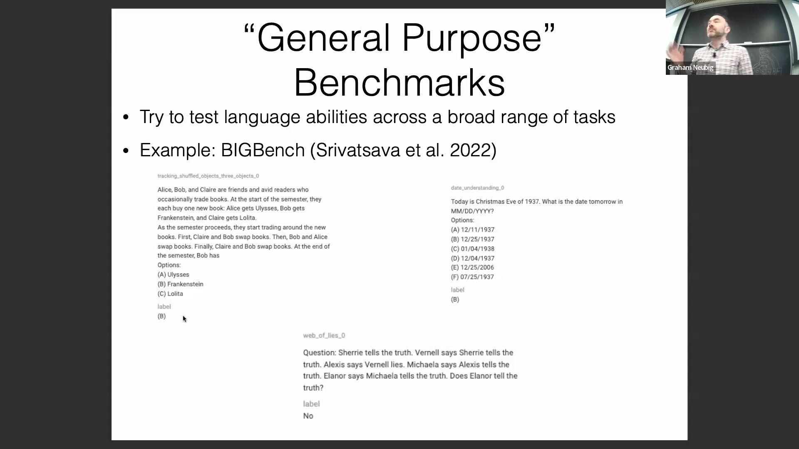
预防策略多种多样，既包括简单的技术屏障（例如为数据集压缩包设置密码以拦截自动网络爬虫(Web Crawlers)），也包括维护严格私有的数据集版本（杜绝公共API访问或防止训练输出暴露）。

## 测试复杂度的测量与控制
如何定义衡量测试复杂度(Test Complexity)的通用指标，仍是一个开放的研究问题。当前的主流方法通常通过控制序列长度(Sequence Length)或多步骤任务所需的推理步数(Reasoning Steps/Hops)来近似评估复杂度。诸如 BREAK 基准测试(BREAK Benchmark)等框架，会将复杂的自然语言查询(Natural Language Queries)分解为类似数据库的基本操作（如选择、过滤、投影），以此量化任务的认知负荷(Cognitive Load)。
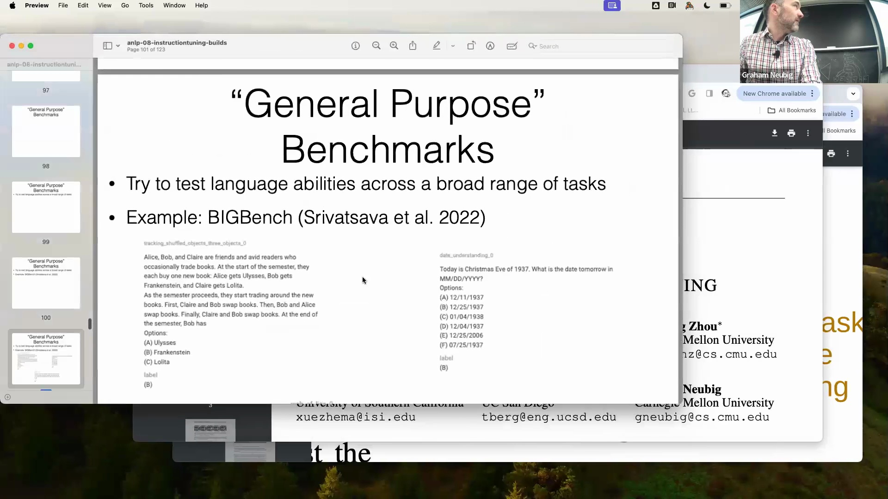
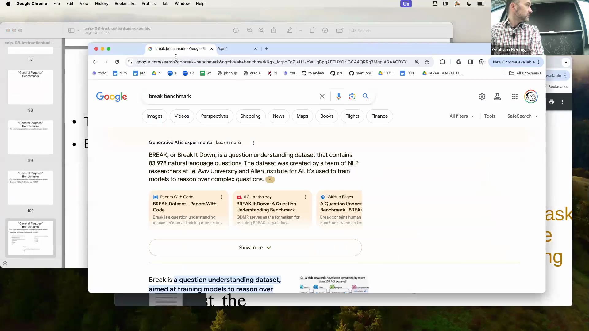
其他近期研究则采用将数学或编程问题映射为计算图(Computational Graphs)的方法，以深入分析 Transformer 架构如何处理不同结构深度(Structural Depth)的任务。
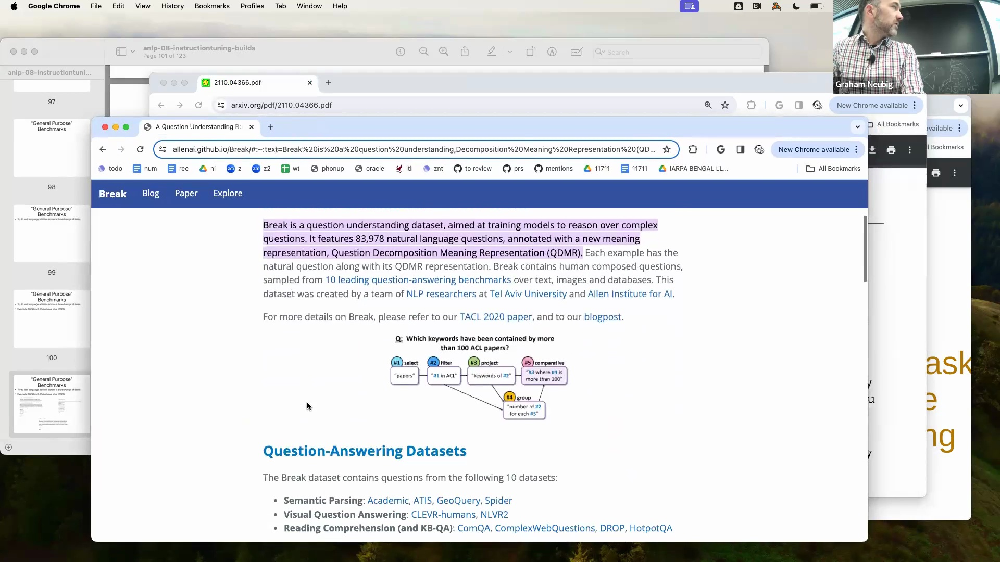
鉴于任务难度具有多面性，一种行之有效的评估实践是根据关键维度（如主题分布(Topic Distribution)、语言或文体风格模式）对测试数据进行分层细分，并分别分析模型在这些独立子集(Subsets)上的准确率。
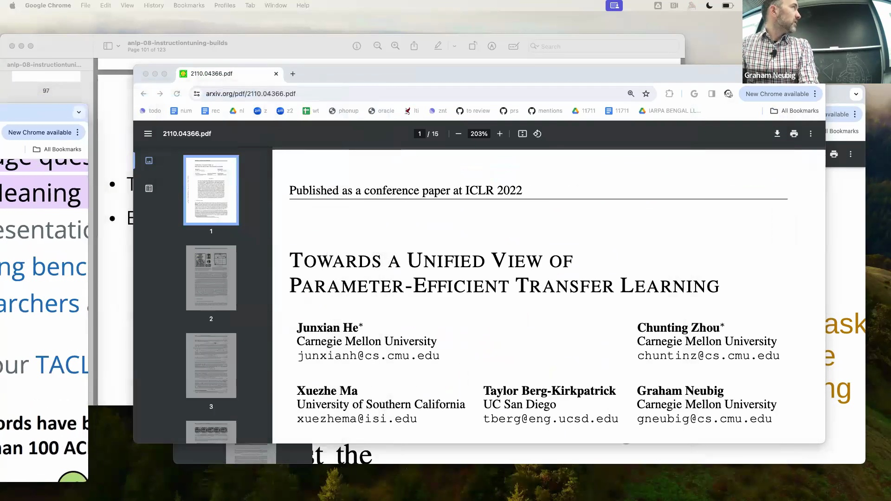

## 指令微调的机制
指令微调(Instruction Tuning)由 Google 与 Hugging Face 的研究团队几乎同期提出，该方法能够将基础语言模型(Foundational Language Models)转化为多功能的通用型模型。该方法的核心是在海量且多样化的任务集合上执行监督微调(Supervised Fine-Tuning, SFT)。数据被统一格式化为明确的“指令-输入”(Instruction-Input)对，模型则被训练以生成对应的预期输出。
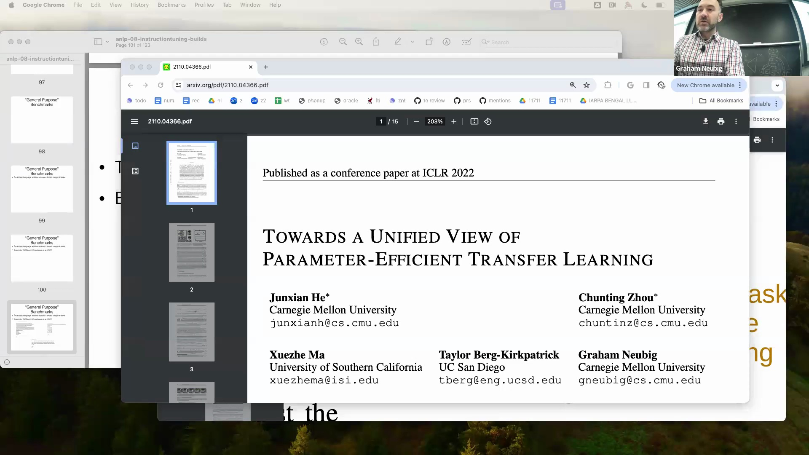
该范式的突破性在于其卓越的跨任务泛化能力(Cross-Task Generalization)：经此训练的模型不仅在已微调的任务上表现稳健，在面对完全未见过的任务(Unseen Tasks)时也能发挥出色。如今，这种能力已成为现代生产级大语言模型(Large Language Models, LLMs)的标配。
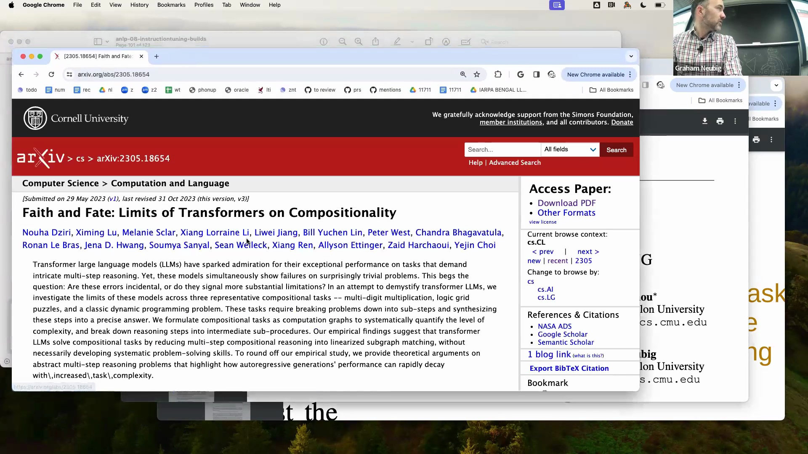
指令微调还可进一步强化，以提升模型的上下文学习能力(In-Context Learning)。具体做法是在训练阶段进行数据采样，并将多个演示示例(Demonstration Examples)直接拼接至上下文窗口(Context Window)中，从而使模型学会在推理阶段更高效地利用少样本提示(Few-Shot Prompting)。

## 标准化指令微调数据集
手动整理与格式化多样化的任务数据极为耗时费力，因此标准化的数据集合集对于保障可重复研究(Reproducible Research)至关重要。针对这些资源的综合综述（例如介绍 Flan 数据集集合的开创性论文）提供了关键的元数据(Metadata)，涵盖数据集名称、训练样本规模、提示词格式（零样本(Zero-Shot) 对比 少样本(Few-Shot)）、任务数量及具体的实现细节。
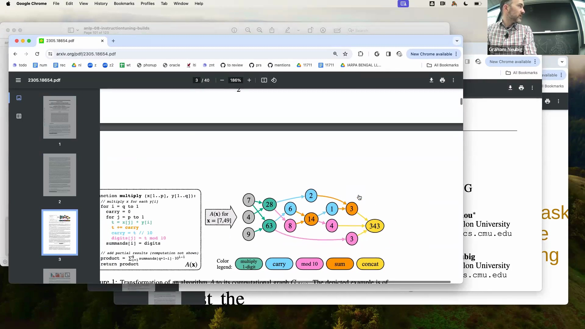
目前应用最广泛的资源包括 Flan 数据集集合(Flan Collection)、Natural Instructions 以及 Self-Instruct。这些经过精心策展的数据集提供了必要的规模与格式一致性，使得研究者无需承担手动数据聚合(Data Aggregation)的开销，即可高效地对模型执行指令微调。
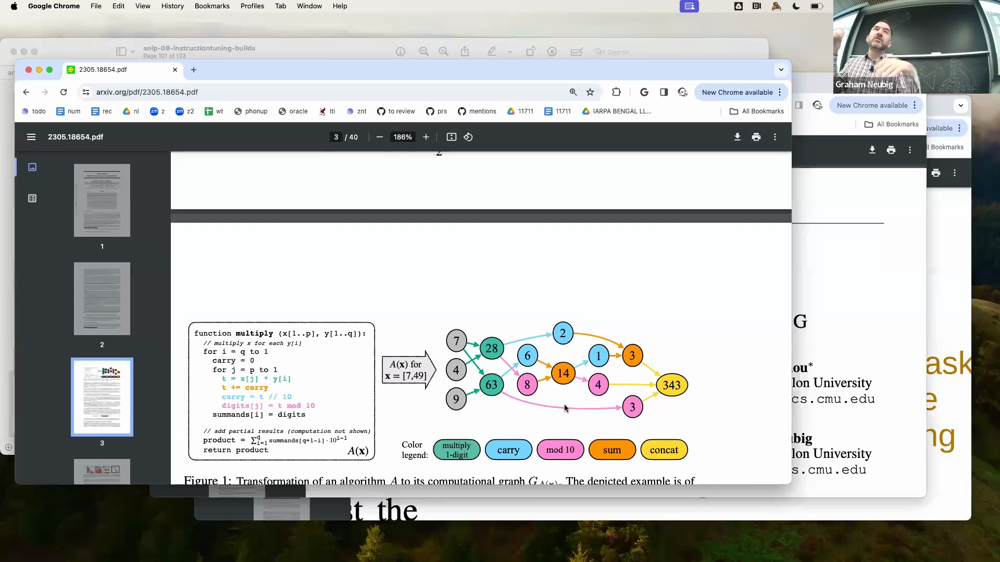

## 面向生产环境的推荐指令微调模型
对于负责模型部署的从业者而言，选型建议在很大程度上取决于预期的应用场景。Flan T5 采用编码器-解码器架构(Encoder-Decoder Architecture)，提供最高达 110 亿参数的版本。凭借其卓越的参数效率，该模型在代码生成、机器翻译和文本摘要等结构化输入输出任务上表现优异。
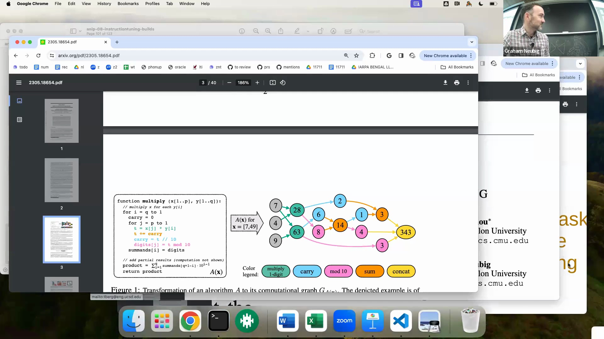
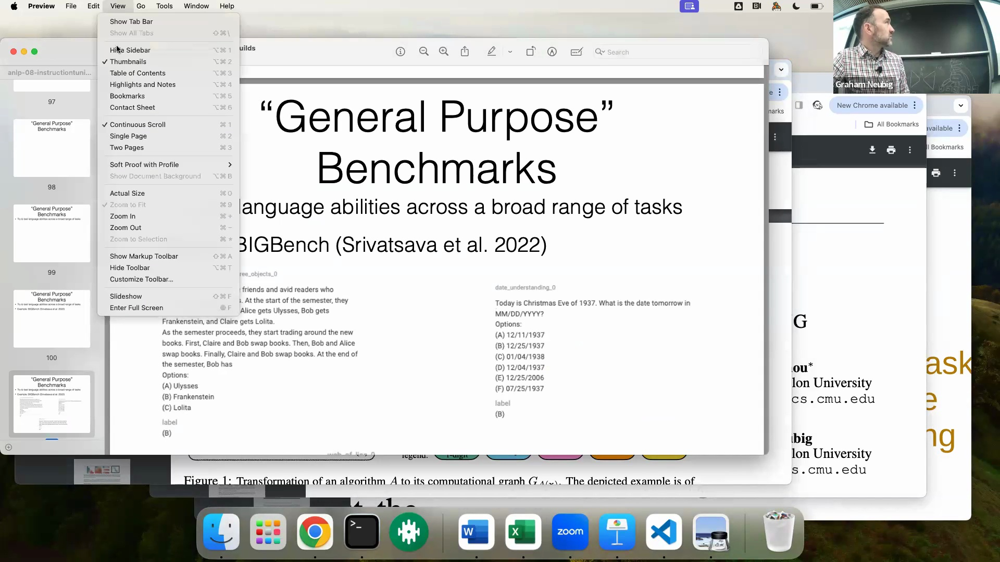
然而，由于其训练优化目标侧重于任务指令的完成度，而非开放式对话(Open-Ended Dialogue)，因此它并不太适合用于交互式对话类应用。
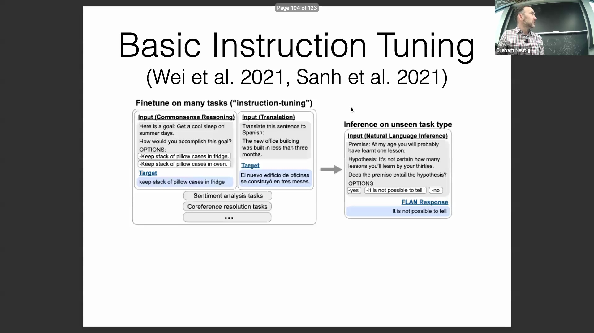
针对交互式聊天工作负载(Interactive Chat Workloads)，Llama 2 Chat 是更为理想的选择。该模型在指令微调之后，进一步接受了基于人类反馈的强化学习(Reinforcement Learning from Human Feedback, RLHF)训练，使其输出与人类偏好高度对齐，因而在对话式AI(Conversational AI)场景中表现极为出色。
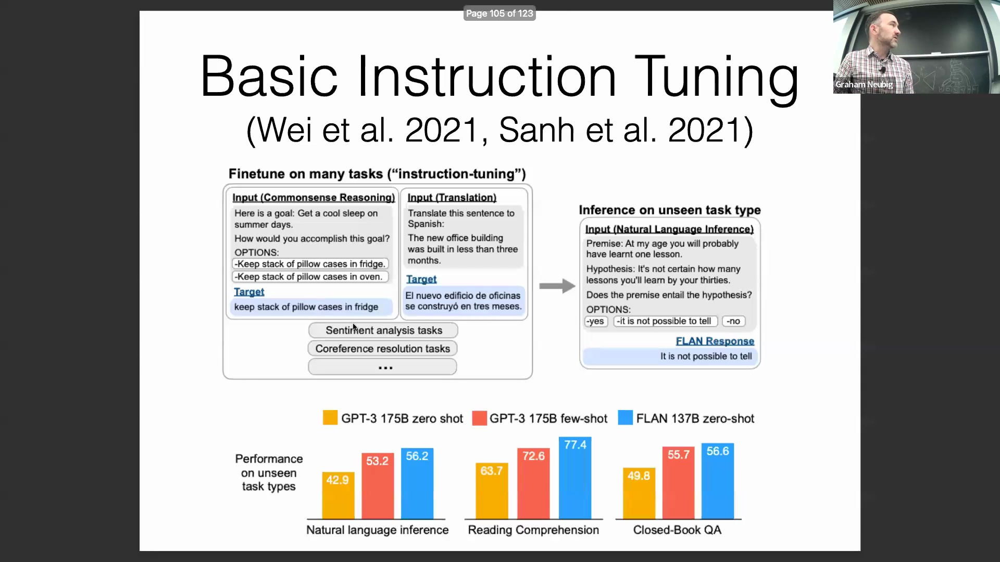
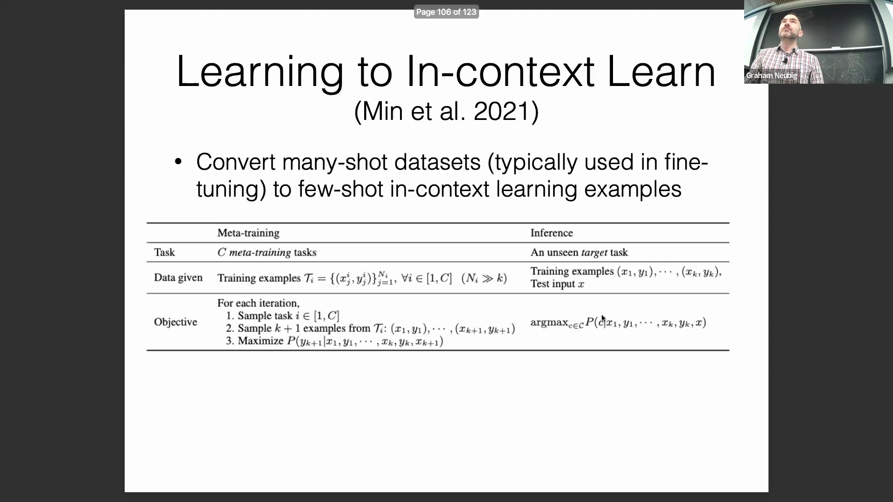
综上所述，选择合适的模型关键在于将模型的架构与微调范式(Fine-Tuning Paradigm)，同特定应用场景中的结构化处理或对话交互需求进行精准匹配。
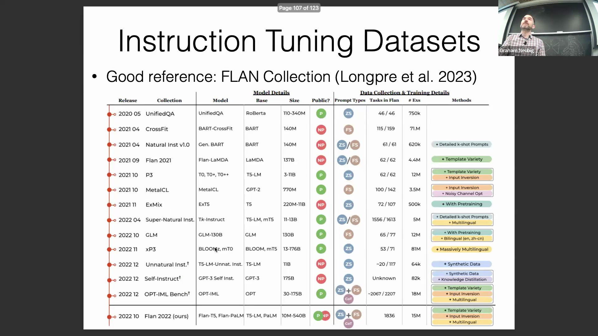
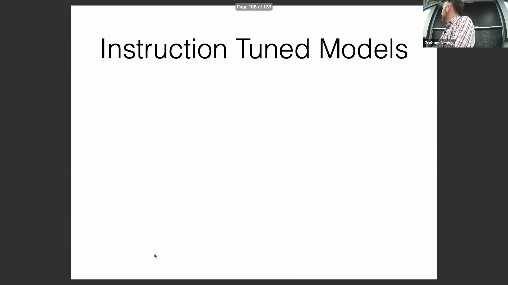