## 科学方法简介
对于初学者而言，简要了解科学方法(Scientific Method)将大有裨益，它概述了如何高效地启动新的研究项目。该流程始于观察或提出问题，接着是文献调研(Literature Review)、提出假设(Hypothesis Formulation)、实验验证(Experimental Validation)、数据分析(Data Analysis)，并最终得出结论(Conclusion Drawing)。即使在处理偏重工程的项目时，将研究工作纳入这一逻辑框架，也能显著提升研发流程的效率与质量。
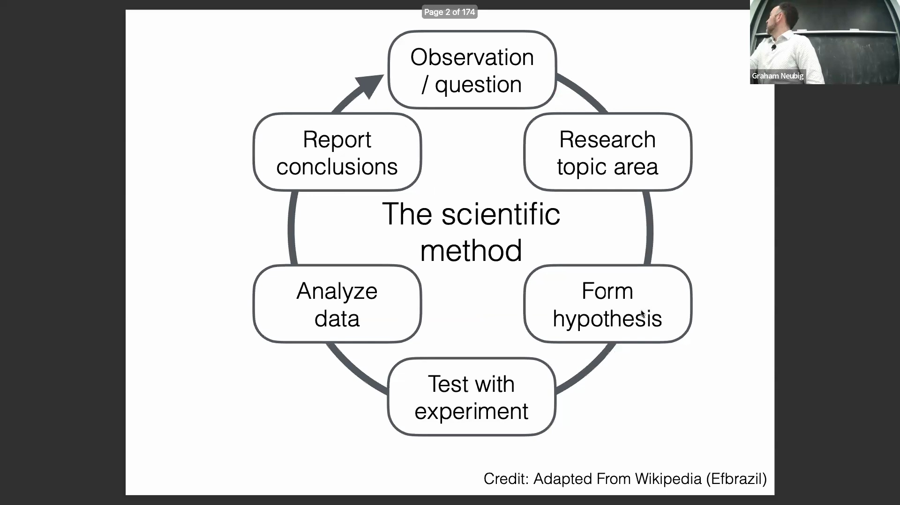

## NLP 研究的两大核心动机
在从观察或问题出发探寻有前景的研究方向时，理解开展自然语言处理(Natural Language Processing, NLP)研究的根本动机至关重要。通常，学术研究主要由两大驱动力推动：应用驱动型研究(Application-driven Research)与好奇心驱动型研究(Curiosity-driven Research)。应用驱动型工作侧重于构建实用系统或优化现有系统，涵盖了绝大多数 NLP 项目。而好奇心驱动型研究则源于解答关于语言本质或认知机制核心问题的渴望，并不以追求立竿见影的实际应用价值为目标。尽管部分论文成功融合了这两种路径（例如，通过分析模型内部机制(Mechanistic Interpretability)来回答理论问题，再将所得洞见用于提升模型性能），但单篇论文往往难以在两方面都做到兼顾。因此，强烈建议将其中一种作为主要研究侧重点，让另一种作为有价值的次要成果自然呈现。

## 应用驱动型研究案例
应用驱动型研究通常旨在提出新任务或新方法，以解决现实中面向用户的实际问题。例如，Pang 等人最初提出情感分析(Sentiment Analysis)，旨在帮助读者快速把握文本中的核心观点与情感倾向。Reddy 等人引入了对话式问答(Conversational Question Answering)任务，以解决虚拟助手在多轮交互中难以维持上下文连贯性(Contextual Coherence)的缺陷。Demirbirel 开发了一种自下而上的抽象式摘要(Abstractive Summarization)方法，旨在改善现有神经摘要模型在内容选择(Content Selection)上的不足。同样，Kudo 与 Richardson 设计了 SentencePiece 进行无监督子词分词(Unsupervised Subword Tokenization)，以消除对特定语言预处理步骤的依赖，从而大幅提升多语言模型(Multilingual Models)的训练效率。这些案例表明，应用驱动型工作并非仅局限于提升模型准确率(Model Accuracy)，它同样可以致力于改善系统的易用性、运行效率(Inference Efficiency)或整体可用性。
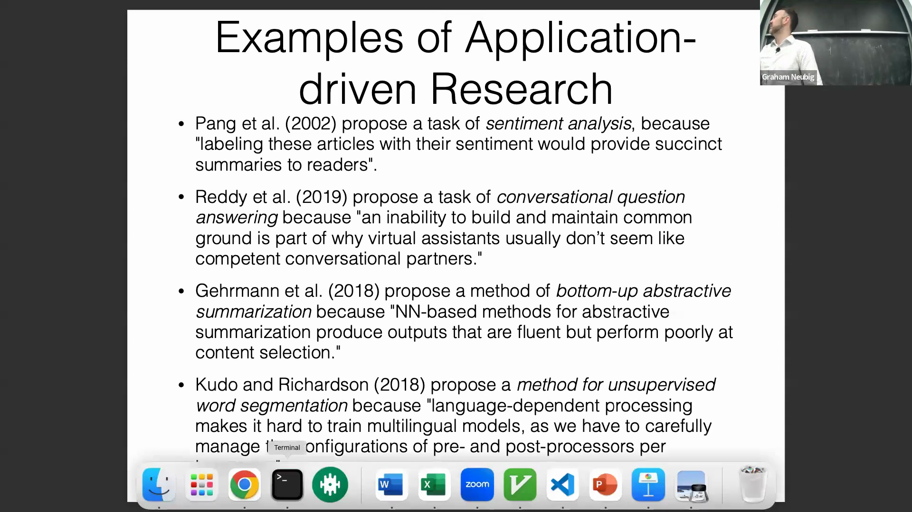
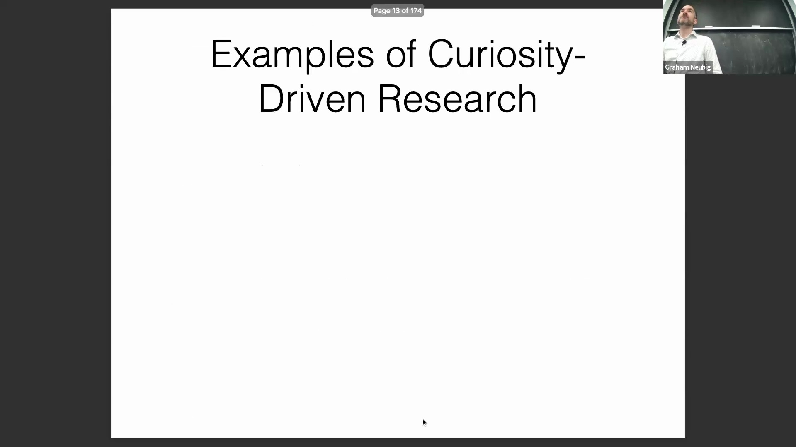

## 好奇心驱动型研究案例
好奇心驱动型研究在主流发表渠道中虽不如前者常见，但仍具有深远的学术影响力。这类研究优先致力于解答基础科学问题，而非急于构建实用工具。例如，Rink 等人调查了真实新闻与讽刺或宣传文章之间的语言差异，其重心纯粹在于探究语言学特征(Linguistic Features)的分布规律，而非构建虚假新闻分类器(Fake News Classifier)。Federico 等人探讨了不同语言对语言模型(Language Models)而言是否具有相同的建模难度，考察了语言固有的类型学结构特征是否会使某些语言对现有架构更具挑战性。Tenney 等人量化了特定语言信息在 BERT 模型中的编码位置，发现句法特征(Syntactic Features)主要分布于较浅层网络，而语义与语用信息(Semantic and Pragmatic Information)则涌现于较深层。尽管这些洞见最终可能反哺下游应用，但其核心目的始终是推动科学发现。

## 迈向研究构思的生成
厘清应用驱动型与好奇心驱动型研究的区别，自然会引出一个实践层面的核心挑战：研究者究竟如何生成新颖的研究构思？这也是一个高频问题，尤其在规划原创性项目时。该过程通常遵循一种双向演进的路径：将对现有研究局限(Research Limitations)的具体认知，提炼为更高层次的实验性问题。这可以通过两种策略性路径来实现：自下而上的探索(Bottom-up Exploration)或自上而下的设计(Top-down Design)。

## 研究构思的自下而上探索
自下而上的探索始于仔细审视具体数据与现有系统的失败案例，以精准定位特定缺陷。该方法在推动成熟任务取得渐进式进展(Incremental Progress)或拓展其应用场景时尤为有效。例如，在评估多语言问答模型时，研究者可能会发现模型在命名实体(Named Entities)处理上频频出错。通过直接分析数据中的错误模式(Error Patterns)，研究者可识别出最常见且影响最显著的问题。相较于修复罕见的边界案例(Edge Cases)，针对这些高频痛点进行优化往往能带来显著的准确率提升，这使得自下而上的分析成为迭代优化系统的高效策略。

## 研究构思的自上而下设计
相反，自上而下的设计始于一个宏观的概念性问题或核心假设，随后逐步落实为具体的实验验证。这种方法更青睐雄心勃勃、具有范式转移(Paradigm Shift)潜力的构想，但也伴随着脱离当前技术可行性的风险。一个经典的成功案例是神经机器翻译(Neural Machine Translation, NMT)与序列到序列模型(Sequence-to-Sequence, seq2seq)的研发。Geoffrey Hinton 与 Yoshua Bengio 等学者长期秉持一个基本信念：神经网络是解决复杂问题的最优路径。尽管初期饱受质疑，他们仍坚持推进这一自上而下的愿景，最终彻底变革了该领域，并将整体研究范式全面引向神经网络架构。尽管风险较高，但成功落地的自上而下构想往往能催生出具有变革性、甚至重新定义整个领域的重大突破。

---

## 自上而下研究的风险与要求
尽管自上而下设计(Top-down Design)能够催生革命性突破（例如向神经网络架构的范式转变(Paradigm Shift)），但也伴随着极高的风险。每一个成功定义新研究方向的构想背后，都隐藏着无数未能获得关注的失败尝试。要有效实施自上而下方法，研究者必须具备坚定的信念、初步的实证支撑(Empirical Evidence)或敏锐的学术直觉。关键在于，这种直觉必须能够通过中间验证步骤或试点研究(Pilot Study)进行检验，从而在投入大量计算与时间资源前验证该构想的可行性。
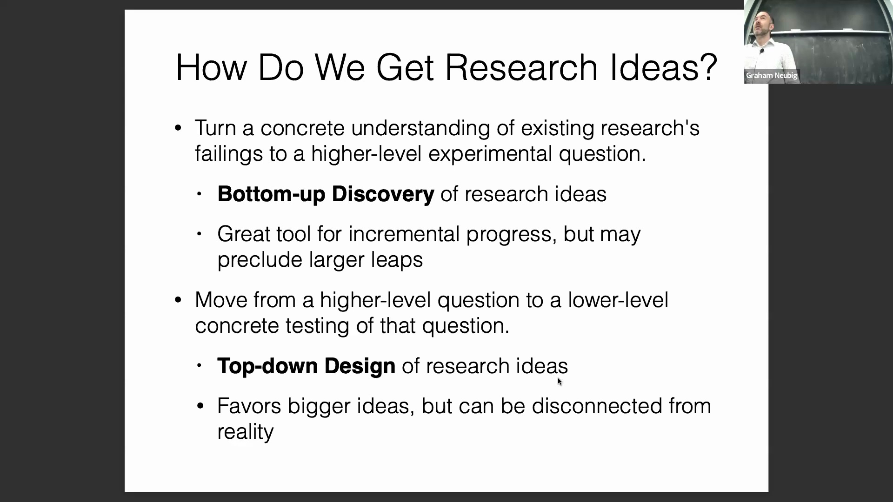

## 主题领域调研与文献总结
明确研究方向后，下一步的关键是对该主题领域展开全面调研(Literature Survey)。该过程通常始于在学术数据库中进行关键词检索，以定位奠基性文献(Seminal Papers)与最新前沿论文。强烈建议遵循的做法是：在深入探究最相关研究的方法细节之前，优先精读其摘要(Abstract)与引言(Introduction)。为确保深度理解并形成长期记忆，研究者应为每篇文献撰写简明的阅读笔记(Reading Notes)。这种消化并重新阐述概念的主动学习过程，不仅能巩固知识内化，还能作为检验是否完全掌握论文核心贡献(Core Contribution)的可靠标准。
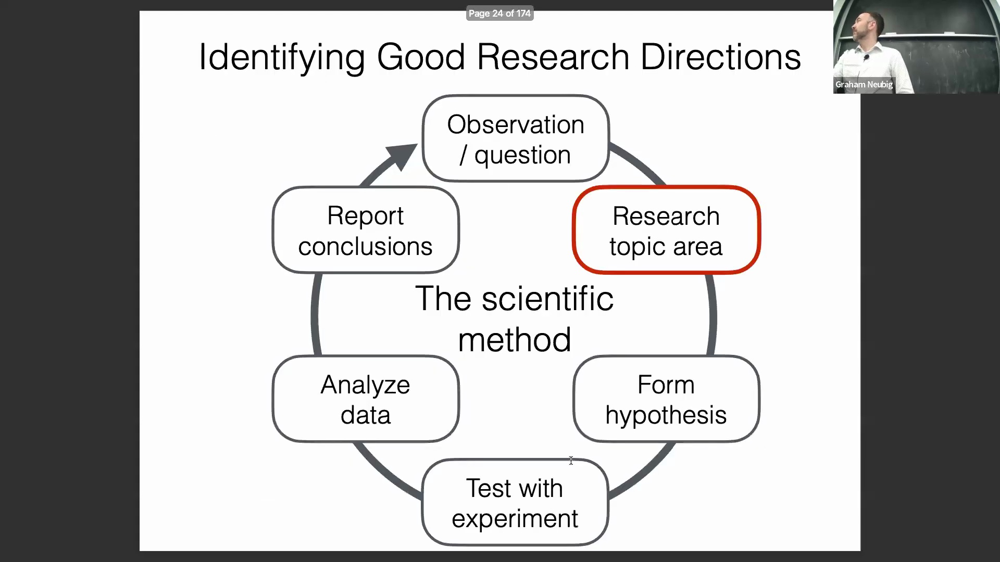

## 驾驭 NLP 文献：ACL Anthology
在搜集自然语言处理(Natural Language Processing, NLP)领域的论文时，ACL Anthology 是一个组织极为完善的文献库，全面收录了 ACL、EMNLP、NAACL 及 TACL 等顶级会议与期刊的论文。与通用学术搜索引擎或更广泛的机器学习(Machine Learning)会议资源不同，ACL Anthology 提供了简洁直观的检索界面，便于高效追踪 NLP 领域的特定研究进展。一项实用的检索策略是：系统浏览过去三至五年顶级会议的论文集(Conference Proceedings)，并辅以针对性的关键词搜索。例如，搜索“multilingual（多语言）”将迅速筛选出高度相关的近期工作，涵盖跨语言掩码(Cross-lingual Masking)、将模型扩展至数百种语言的适配，以及组合泛化能力(Compositional Generalization)评估等前沿课题。
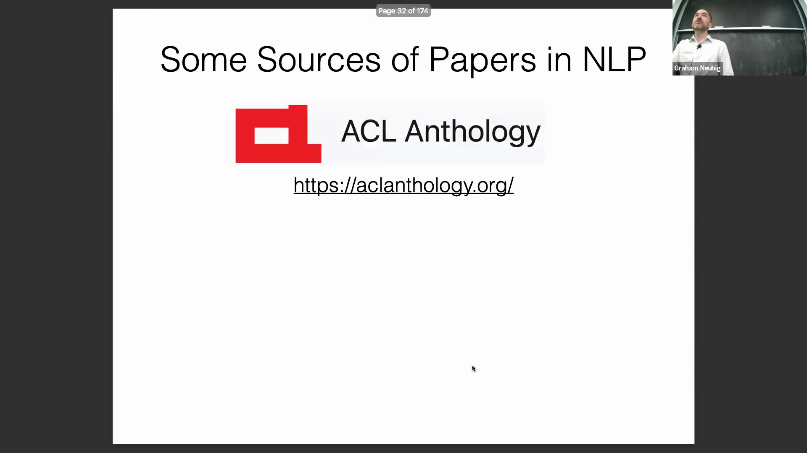
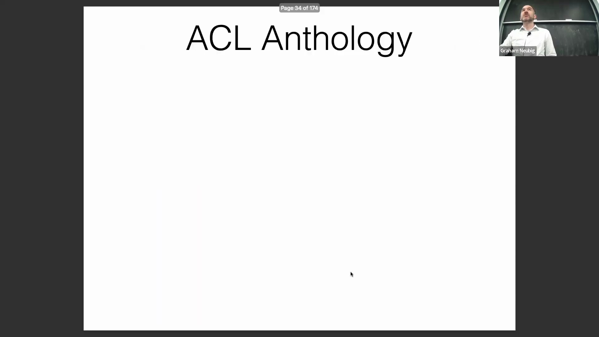

## 利用 Google Scholar 与引文追踪
Google Scholar（谷歌学术）提供了互补的检索功能，尤其适用于更广泛或跨学科(Interdisciplinary)的研究主题。使用时，筛选近期发表的文献至关重要，因为早期的方法学论文(Methodology Papers)可能已依赖于过时的技术或模型架构(Model Architecture)。谷歌学术最强大的功能之一便是引文追踪(Citation Tracking)。通过查阅引用了某篇奠基性文献的后续研究，并在引文网络中进行二次检索，研究者可以清晰追溯某一学术概念的演变轨迹，或洞察其如何被迁移至新范式（例如，近期研究中状态空间模型(State Space Models, SSMs)的整合应用）。此外，通过查阅当代高质量论文的参考文献列表(References)，也能逆向追溯并发现早期的奠基性工作。
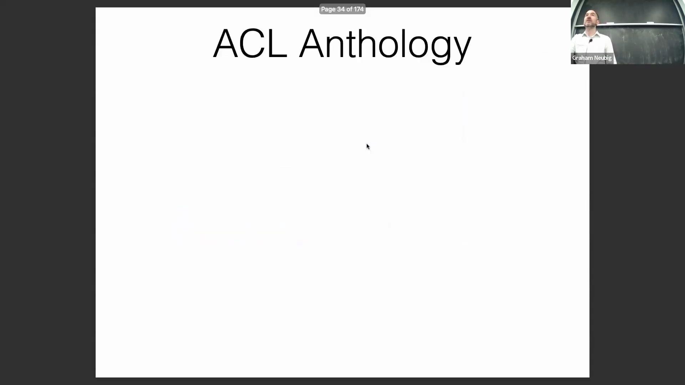
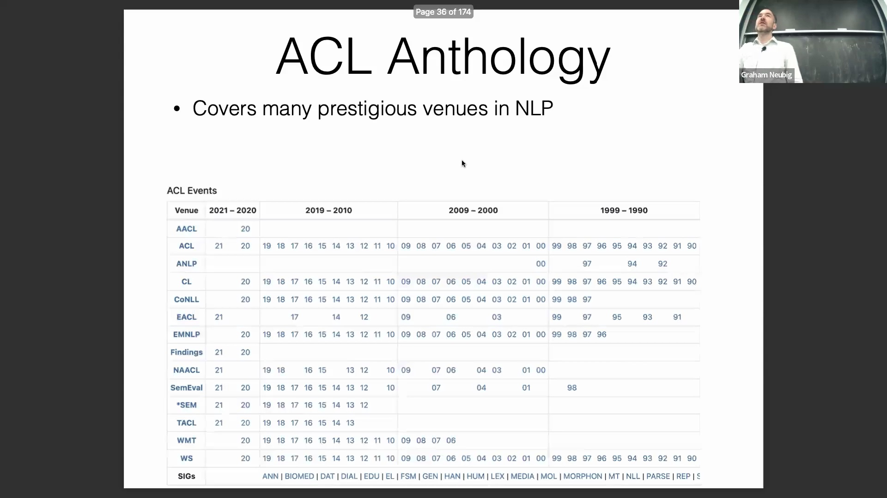
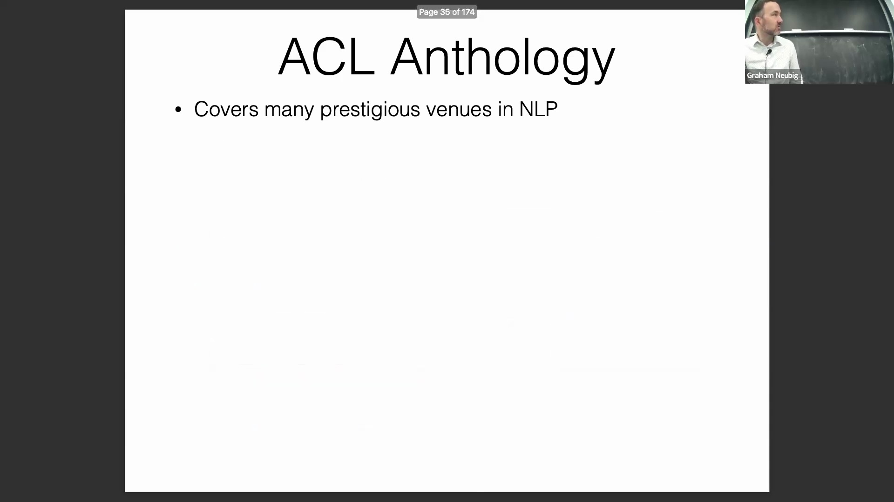
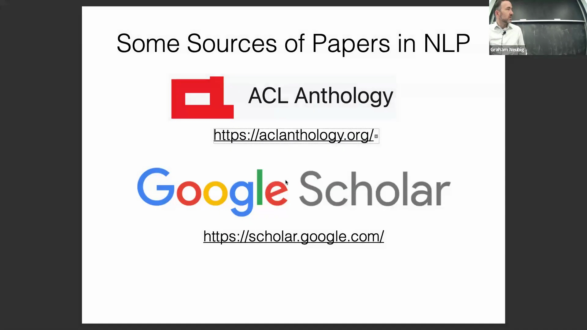

## 避免文献发现中的算法偏差
研究者在依赖 Twitter、LinkedIn 等社交媒体平台，乃至基于热度排序的学术资讯推送时应保持审慎，因为这些渠道往往呈现出对该领域有失偏颇的视角。推荐算法(Recommendation Algorithms)倾向于过度放大热门话题（如大语言模型(Large Language Models, LLMs)训练），从而制造出一种错觉，仿佛这是唯一活跃的研究方向。实际上，NLP 领域的研究图景远比此更为多样化与细致入微。为抵消此类算法偏差(Algorithmic Bias)，强烈建议研究者手动系统浏览会议论文集，并有意探索那些未被算法重点推荐的论文，以确保文献综述(Literature Review)的全面性与客观平衡。

## 前期文献调研的双刃剑效应
在启动项目前进行广泛的文献综述具有显著优势：它既能避免无意重复已有研究，又能借助成熟技术扩充研究者的方法工具箱(Methodological Toolbox)。然而，这也伴生着一个显著风险，即可能无形中限制创造性思维(Creative Thinking)。一旦对既有方法过于熟悉，研究者可能会在潜意识中将自己禁锢于已知框架内，仅进行渐进式改进(Incremental Improvements)。为激发真正具有原创性的研究构想，不妨借鉴一位经济学诺贝尔奖得主的建议：在深入现有学术解决方案之前，先将目光投向学术期刊之外，直接观察现实世界中未经学术过滤的原始问题。

## 从现实观察开启研究
将这一原则应用于自然语言处理领域，研究者在深入学术文献之前，应首先明确实际应用中的痛点或尚未被充分满足的用户需求(User Needs)。不妨反思：在与当前人工智能(Artificial Intelligence, AI)系统交互时，哪些环节最令人感到挫败？你期望系统具备哪些目前尚无法实现的能力？将最初的研究好奇心扎根于实际观察与现实应用场景中，便能提出新颖且以用户为中心(User-centric)的研究问题。在此基础上，研究者可进一步探索现有工具或工业界如何应对这些能力缺口，并利用相关文献验证并完善原始构想，从而为其提供坚实的理论基础与技术支撑。

---

## 从技术演示与跨学科工具中发掘研究构思
除了传统学术文献，观察现实世界中的技术演示(Technology Demos)同样能激发实用的研究构思。尽管企业发布的演示往往呈现出高度完善与流畅的表象，但它们通常无法反映底层系统的真实鲁棒性(Robustness)，这恰恰揭示了现有系统的薄弱环节，为研究者提供了潜在的切入点。此外，高价值的研究构思也频繁源于机器学习(Machine Learning)或数学等相邻学科(Adjacent Disciplines)。研究者可搜寻严谨的数学工具或理论框架(Theoretical Frameworks)，并探索其在特定自然语言处理(Natural Language Processing, NLP)挑战中的适用性。然而，此类跨学科方法同样需遵循自上而下研究(Top-down Research)的常规准则：它需要坚定的学术信念与严密的实证验证，以确保所引入的工具真正契合当前的语言学问题。
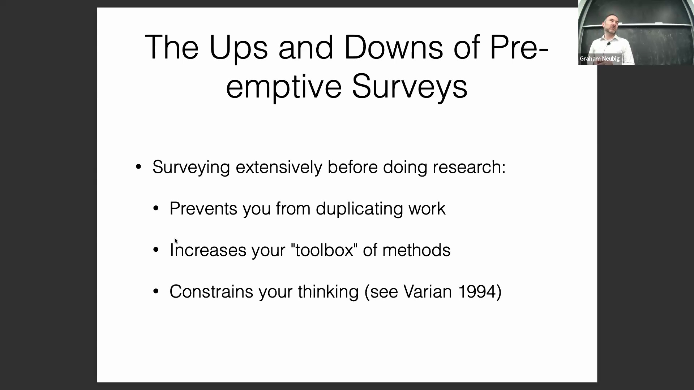

## 战略性文献调研与作业要求
开展全面的文献综述(Literature Review)是作业3(Assignment 3)的强制性要求，但其执行时机相对于研究构思的生成需具备策略性(Timing Strategy)。尽管广泛的前期调研有时可能无形中限制创造性思维，但它在评估研究可行性(Feasibility Assessment)与避免重复造轮子(Redundant Work)方面极为有效。建议研究者不应仅将该阶段用于罗列现有方法，而应主动绘制已解决问题与开放性问题(Open Problems)的全景图。若在调研前已形成初步构思，文献综述可用于对其进行打磨与迭代；反之，若从文献调研起步，则可让前人研究中的空白(Research Gap)自然而然地指引后续的研究方向。
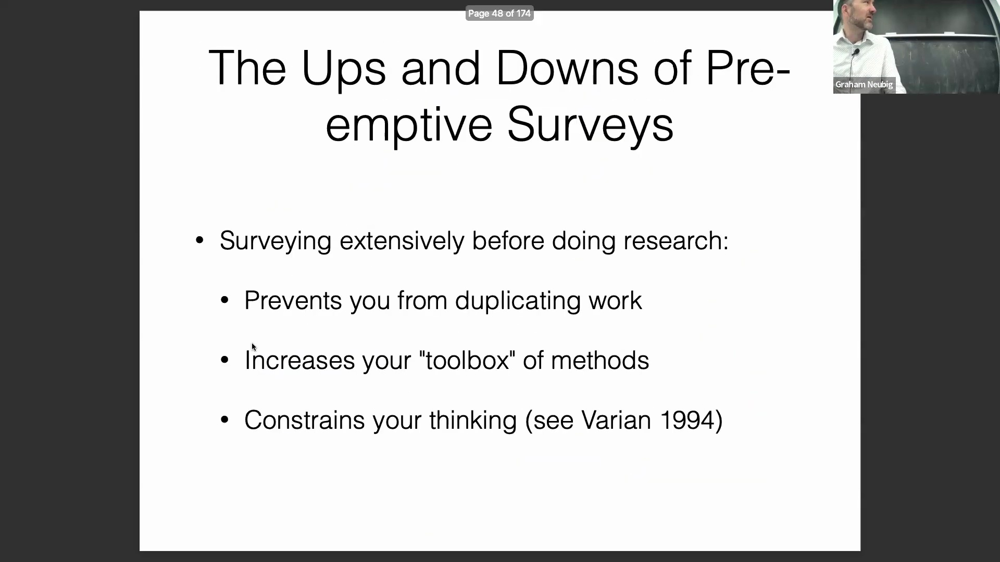

## 构建明确且可证伪的假设
在充分掌握某一主题后，下一步的关键是提出精确的研究问题(Research Question)及相应的研究假设(Research Hypothesis)。常见的陷阱在于提出过于模糊或宽泛的开放式问题；有效的研究问题应当边界清晰，且最好能以“是/否”(Binary)形式进行发问。相应的假设必须预先阐明对预期结果的判断，且至关重要的一点是，它必须具备可证伪性(Falsifiability)。这意味着实验设计必须能够产生明确支持该假设或清晰证伪该假设的结果。若缺乏可证伪性，实验将丧失得出具有科学价值结论所需的学术严谨性(Scientific Rigor)。
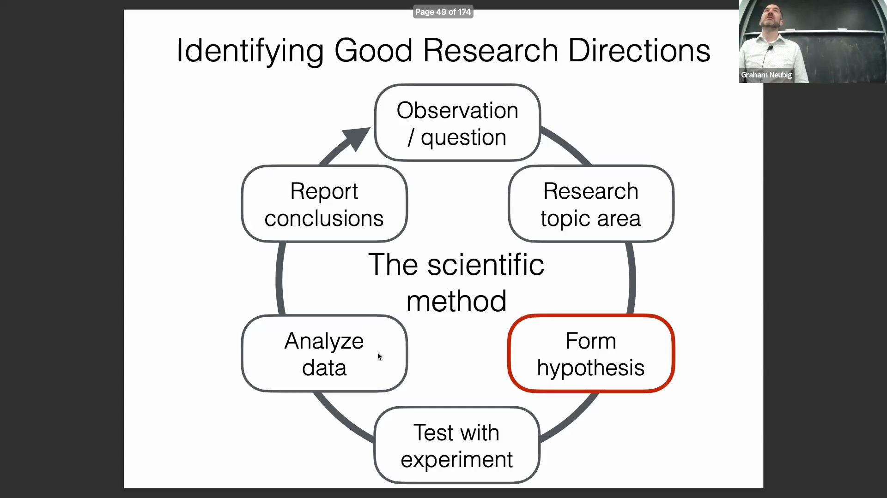
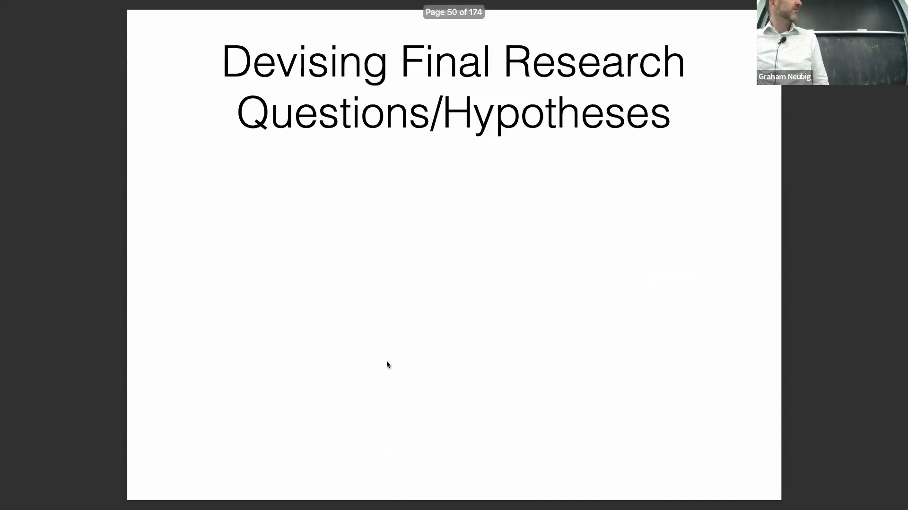

## 好奇心驱动型研究问题示例
好奇心驱动型(Curiosity-driven)的研究假设通常更易于结构化。例如，针对“所有语言对语言模型(Language Models)而言是否同样困难？”这一问题，可引申出如下假设：语言类型与结构特征的差异将内在导致不同语言在建模难度(Modeling Difficulty)上存在显著区别。若实验结果表明，无论语言特征如何变化，模型性能均保持一致，则该假设即可被明确证伪。同样地，在研究播客(Podcast)用户参与度(Engagement)时，研究者可将网络流传的经验法则（例如“减少填充词(Filler Words)能有效提升听众参与度”）转化为可检验的假设。通过对热门与非热门播客进行实证对比(Empirical Comparison)，研究者能够从统计学(Statistical)层面验证或反驳这些关于人类语言交流、虽广为流传却缺乏实证的通俗假设。
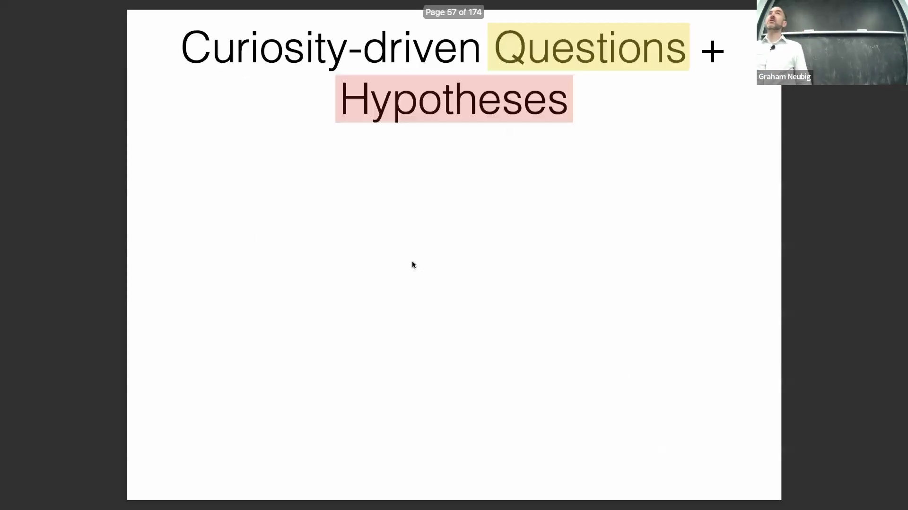
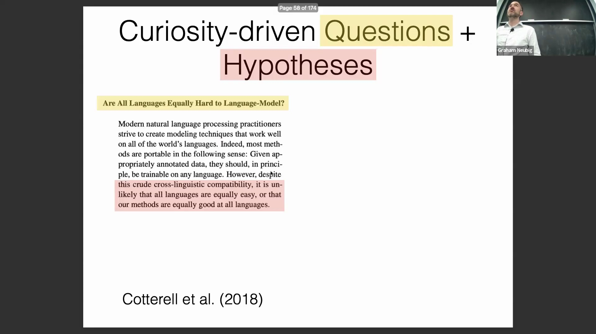

## 拆解应用驱动型研究问题
应用驱动型研究(Application-driven Research)需要将宏大的研究目标拆解为具体、可检验的子问题(Sub-problems)。以基础性问题“预训练词嵌入(Pre-trained Word Embeddings)是如何以及为何能提升神经机器翻译(Neural Machine Translation, NMT)性能的？”为例，该宏观探究可分解为若干可证伪的假设：词嵌入在低资源环境(Low-resource Settings)下是否收益更大？跨语言对齐(Cross-lingual Alignment)能否直接提升翻译性能？多语言系统(Multilingual Systems)相较于双语系统(Bilingual Systems)是否存在可量化的性能优势？其中部分子问题带有较强的先验预期(Prior Expectations)（例如，在训练数据稀缺时，引入词嵌入应能带来不成比例的性能增益），而其余问题则保持探索性(Exploratory)质。通过此种方式构建应用驱动型研究，能将单纯的性能指标追逐转化为对模型内在行为(Model Behavior)的严谨科学探究。
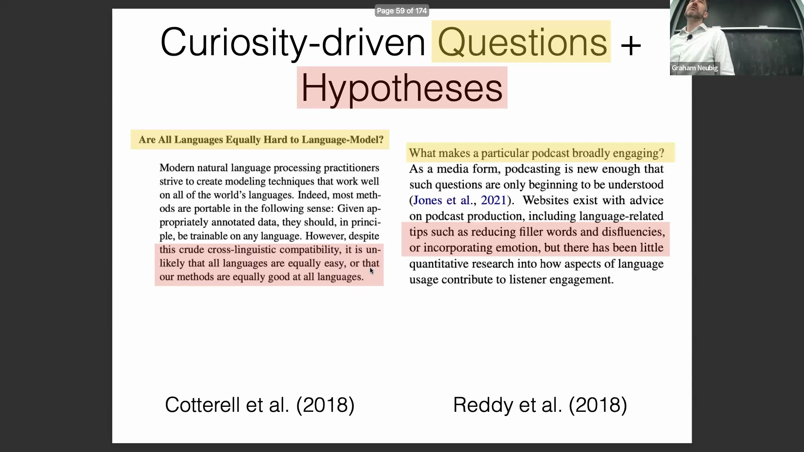
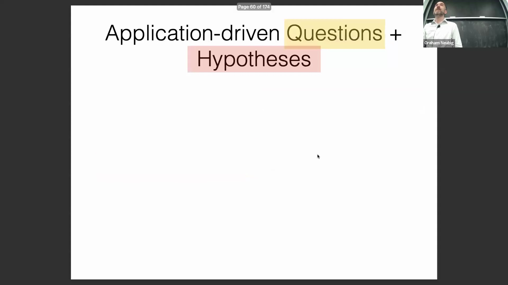
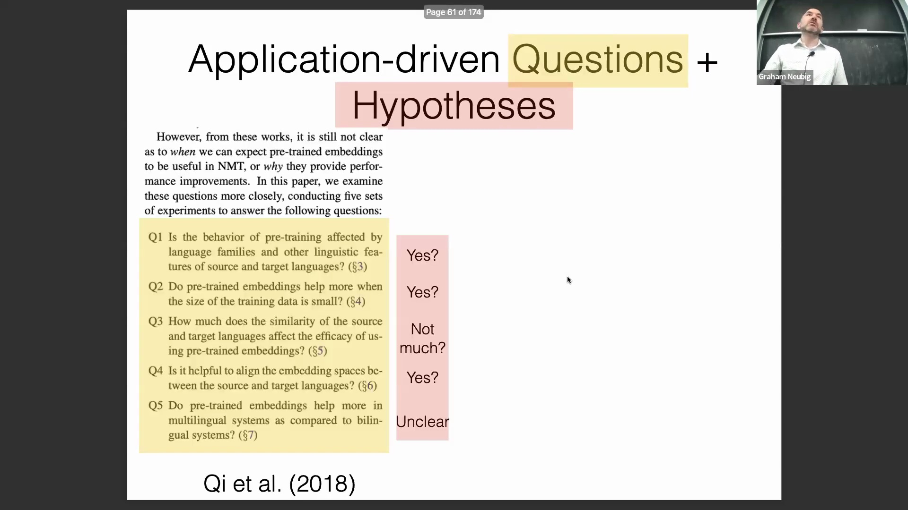

## 超越表面的性能指标
应用导向研究面临的一大核心挑战在于，诸如“方法X能否提升评估指标Y(Evaluation Metric Y)？”这类基线问题往往过于间接且流于表面。若实验未显示出性能提升，研究者往往难以断定失败根源：是核心理论假设有误，还是源于代码实现缺陷(Implementation Flaws)、训练数据不足，亦或是评估指标选择不当。为消除这种模糊性，研究者必须针对新方法*为何*有效提出机制性假设，并设计对照实验(Control Experiments)或消融实验(Ablation Studies)以直接验证其底层机制。通过剥离并独立检验这些基础假设，即使得到负面结果(Negative Results)，也能具备重要的诊断价值(Diagnostic Value)，而非仅仅被视为一次失败的尝试。
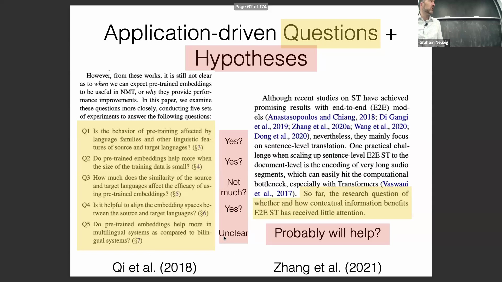

## 通过针对性数据设计验证核心假设
为验证核心假设，研究者可构建玩具数据集(Toy Datasets)或精心筛选的特定数据子集，以专门触发(target)待研究的现象。机器翻译领域的一个历史案例完美印证了这一点：早期尝试引入上下文信息(Contextual Information)始终未能提升翻译质量。该失败并非源于算法缺陷，而是因为研究者在长且语义自包含(Self-contained)的新闻句子上进行评估，在此类语料中，单句内部的上下文已绰绰有余。当评估转向以简短、高度依赖上下文为特征的对话数据集(Conversational Datasets)时，完全相同的上下文建模方法却带来了显著的性能跃升。这表明，有效验证一项假设，通常要求实验设置(Experimental Setup)必须与假设在逻辑上适用的条件严格匹配。
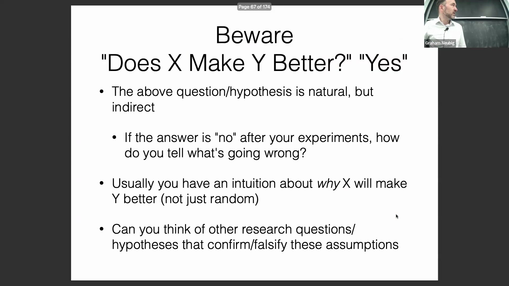

## 隔离变量以检验基本前提
在设计实验以检验核心前提时，必须明确区分对完整系统流水线(System Pipeline)的整体评估与对特定理论变量的隔离检验。例如，若要检验“上下文信息是否必要”，绝不能仅在新数据集上运行模型并观测BLEU分数(BLEU Score)的变化。它要求实验设计能够精确控制上下文变量，从而使研究者得以排除模型架构(Model Architecture)或训练数据规模(Training Data Scale)等其他混杂因素(Confounding Factors)的干扰，独立量化上下文带来的边际贡献(Marginal Contribution)。唯有通过严谨地隔离并控制这些实验组件，研究者才能具备充分的学术自信，去证实或证伪推动其研究前行的基础假设(Fundamental Hypothesis)。

---

## 通过受控实验验证假设
为了严谨地检验诸如“上下文信息对翻译是否真正必要”这类具体假设，研究者必须设计能够隔离变量(Isolating Variables)的实验，而非仅仅依赖黑盒模型对比(Black-box Model Comparison)。如果底层模型架构本身就难以捕捉上下文依赖关系(Contextual Dependencies)，那么简单地训练有上下文和无上下文的模型是远远不够的。一种经典的实证方法涉及受控的人机评估(Controlled Human-Machine Evaluation)，例如一项复用第二语言水平测试(Second Language Proficiency Test)的研究。该研究将英语测试题通过机器翻译转换为日语，并交由日本学生作答。研究对比了标准机器翻译系统(Standard Machine Translation Systems)与人类译者在提供或缺失上下文信息条件下的表现。结果清晰表明，在拥有上下文信息时，人类译者的表现显著优于其他所有实验条件，从而从实证角度验证了“上下文至关重要”这一核心假设(Core Hypothesis)。这突显了将宏观研究目标拆解为更小、可直接检验的子问题的重要性。此外，研究者经常创建合成数据集(Synthetic Datasets)或玩具数据集(Toy Datasets)，以确保数据中必然包含特定的语言现象，从而在将模型扩展至复杂基准测试(Complex Benchmarks)之前，验证其是否成功捕捉到了预期机制(Expected Mechanisms)。
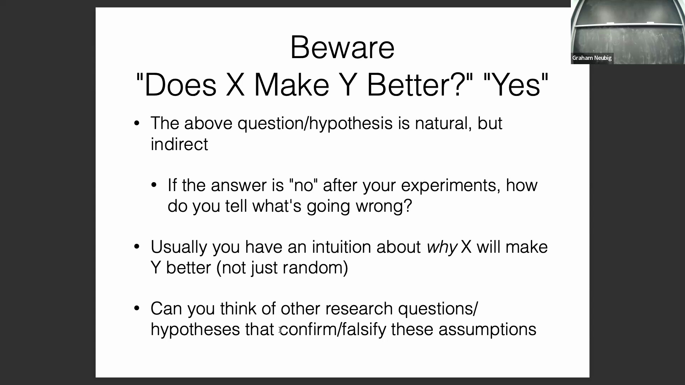

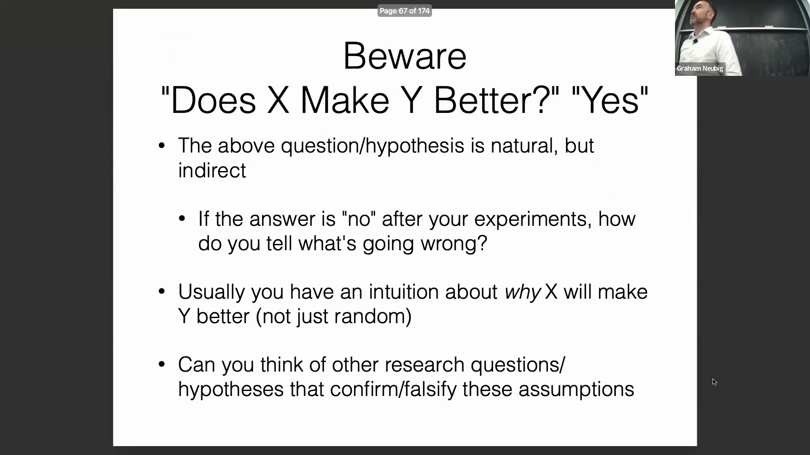
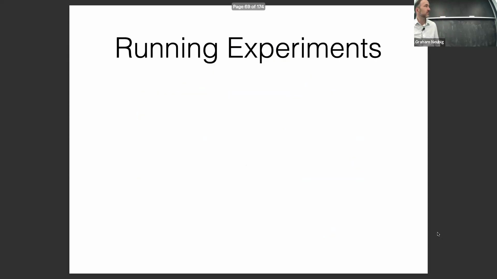

## 获取与构建实验数据
开展研究项目通常遵循一套系统化流程：获取测试数据(Test Data)、运行实验、计算评估指标(Evaluation Metrics)以及分析结果效应。在基于前人工作展开研究时，最可靠的策略是采用现有文献中已确立的标准数据集(Standard Datasets)，以确保对比的公平性与实验的可复现性(Reproducibility)。针对新颖的研究问题，研究者通常可复用现有数据集，或借助专门的数据发现工具寻找合适的替代数据源。然而，在工业界应用与前沿学术探索中，往往需要从头收集并标注全新的数据集。自然语言处理领域的关键数据资源包括已演变为现代标准枢纽的 Hugging Face Datasets 仓库，以及 ELRA（欧洲语言资源协会）和语言学数据联盟(Linguistic Data Consortium, LDC)等传统语料库档案馆。此外，Papers with Code 等平台能够自动从学术论文中提取数据集引用(Dataset Citations)。即使这些数据未托管于中心化仓库，该功能也能极大简化基准测试数据集(Benchmark Datasets)的检索流程。

## 数据标注与统计显著性检验
在构建自定义数据集(Custom Datasets)时，严谨的数据标注(Data Annotation)至关重要。研究者必须确定合理的样本量(Sample Size)、起草清晰的标注指南(Annotation Guidelines)，并亲自标注或管理受监督的标注人员(Annotators)，同时实施严格的数据质量评估(Data Quality Assessment)。确定测试数据的必要规模是一个常见挑战，而解决之道在于统计功效(Statistical Power)：必须收集足量样本，才能可靠地将真实的模型性能提升与随机波动(Random Fluctuations)区分开来。统计显著性检验(Statistical Significance Testing)为此类评估提供了严密的数学框架。通过对比模型在多个数据集或数据划分(Data Splits)上的表现，研究者可判定观察到的准确率差距究竟代表一致的性能趋势，还是仅源于抽样噪声(Sampling Noise)。该过程的核心指标为 p 值(p-value)，用于估计观察到的差异由偶然因素导致的概率。通常以 p < 0.05 作为统计显著性的标准阈值，表明模型间存在真实且可靠的性能差距(Performance Gap)。常用的辅助分析工具包括置信区间(Confidence Intervals)（用于界定重复实验中的预期性能波动范围），以及配对检验(Paired Tests)与非配对检验(Unpaired Tests)的严格区分（决定了性能比较是在同源匹配的数据样本还是独立的数据样本之间进行）。熟练掌握这些统计学概念，能够确保实验结论具备稳健性(Robustness)、可复现性与科学有效性(Scientific Validity)。
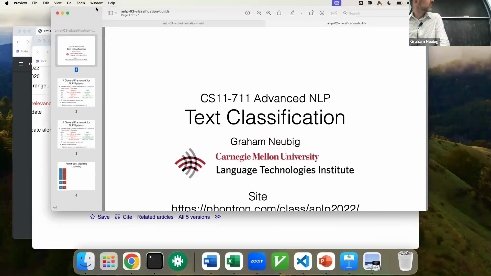
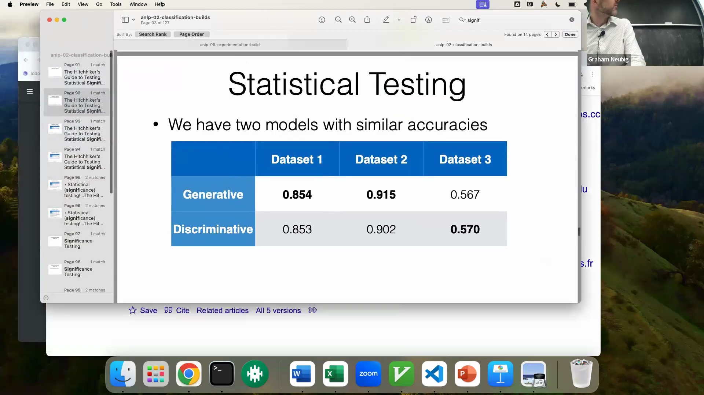
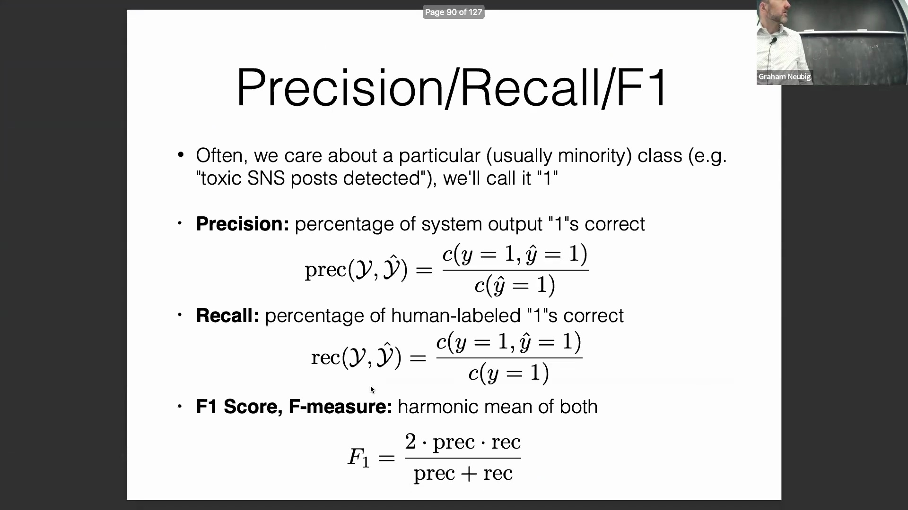
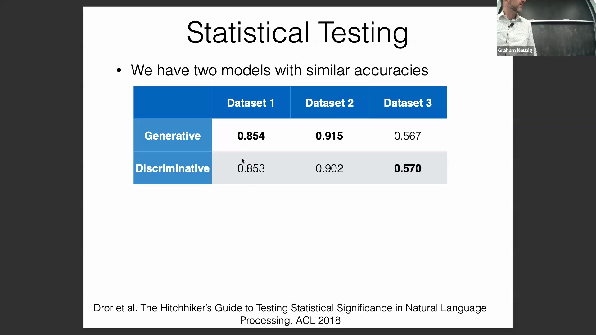
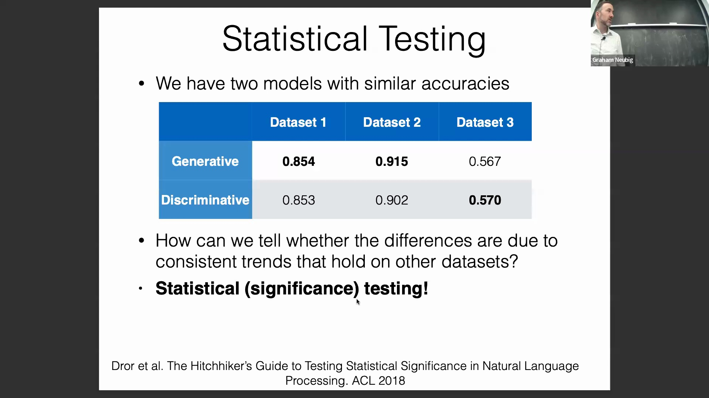
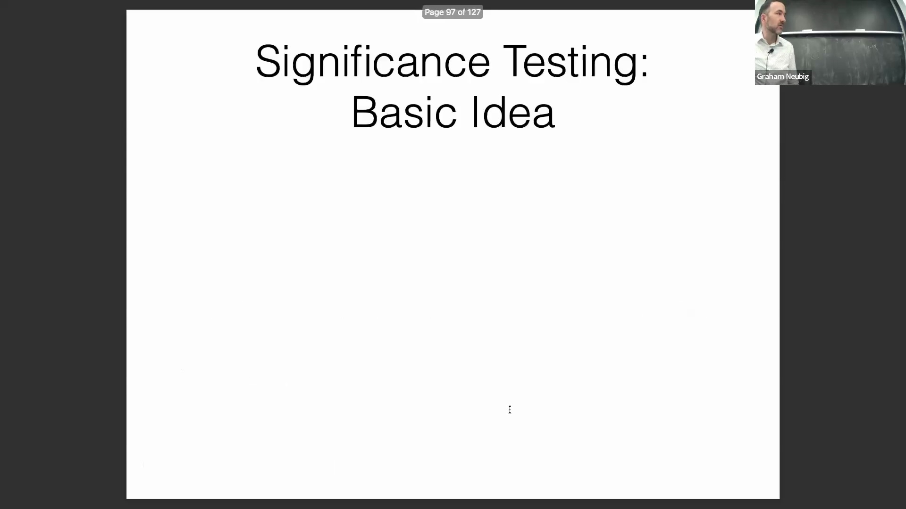
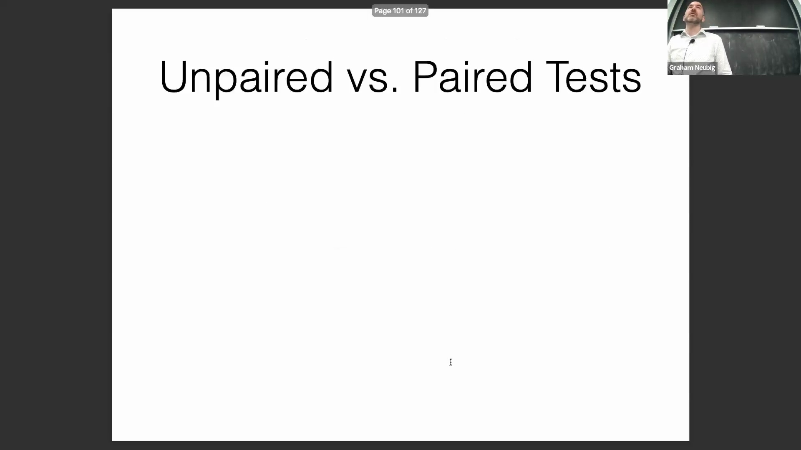

---

## 配对检验与非配对检验
理解配对检验(Paired Tests)与非配对检验(Unpaired Tests)的区别，是进行严谨的自然语言处理(Natural Language Processing, NLP)实验设计(Experimental Design)的基础。非配对检验用于比较两个完全独立数据集(Data Splits)上某项评估指标的均值，旨在帮助研究者判断观测到的差异是源于数据本身的真实分布差异，还是仅由抽样噪声(Sampling Noise)引起。相比之下，配对检验则在完全相同的数据样本上评估两种不同条件（如两个竞争模型(Competing Models)）。该领域普遍倾向于使用配对检验，因为它能够充分控制样本实例层面的变异性。通过分析模型在每个独立样本上的表现差异，而非仅仅对比总体均值，配对检验能大幅提升统计功效(Statistical Power)，从而更灵敏地检测出真实的性能提升。
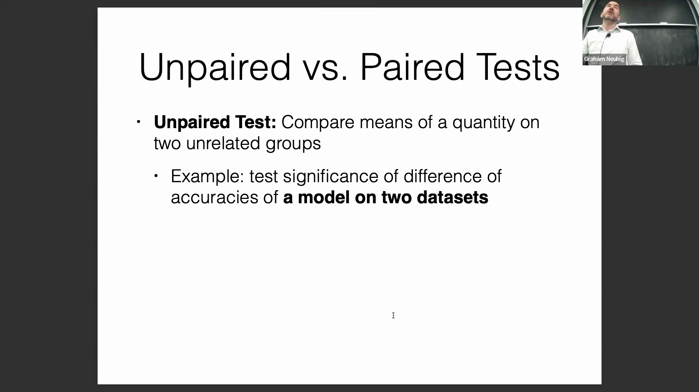
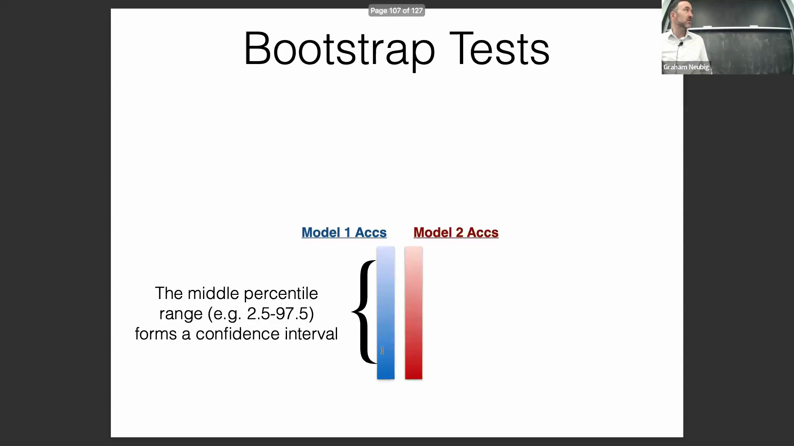

## 用于显著性检验的自助法（Bootstrap）
评估统计显著性(Statistical Significance)的一种高度通用且被广泛采用的方法是自助法(Bootstrap Resampling)。与依赖严格数据分布假设的参数检验(Parametric Tests)不同，自助法具备指标无关性(Metric-agnostic)，可无缝适配各类评估指标(Evaluation Metrics)，无论是准确率(Accuracy)、F值(F1-score)、BLEU分数(BLEU Score)还是词错误率(Word Error Rate, WER)。该方法的核心机制是对原始测试集(Test Set)进行有放回的重采样(Resampling with Replacement)，从而生成数千个自助样本(Bootstrap Samples)。通过在这些重采样迭代中计算目标指标，研究者能够以经验方式推导出95%置信区间(Confidence Interval)（通常取第2.5至第97.5百分位数），或计算出精确的p值(p-value)。这为判断观测到的性能差距(Performance Gap)是否具有统计学意义上的可靠性，抑或仅是随机波动的结果，提供了一种稳健且数据驱动(Data-driven)的评估手段。
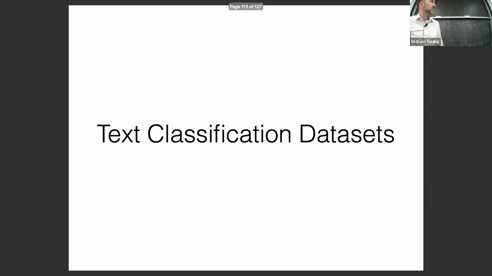

## 重采样动态与数据集规模
自助法的实际运行机制可通过一个简单的分类任务案例加以说明。当在极小规模的数据集上评估两个系统时，有放回的重采样会产生方差极大的子样本。在某次随机重采样中，系统A可能显著优于系统B；而在下一次迭代中，结果可能发生逆转或趋于持平。由于这种高方差(High Variance)特性，只有当某一系统在绝大多数（例如 >95%）自助法迭代中始终保持一致(Consistently)的优越表现时，才能断言其具有统计显著性。这揭示了一个关键的实验现实：小规模测试集本质上会导致置信区间宽泛且不稳定，从而极难证实统计显著性。随着数据集规模的扩大，重采样后的经验分布会自然趋于收敛，使研究者能够可靠地将模型的真实性能提升与抽样假象(Sampling Artifacts)区分开来。
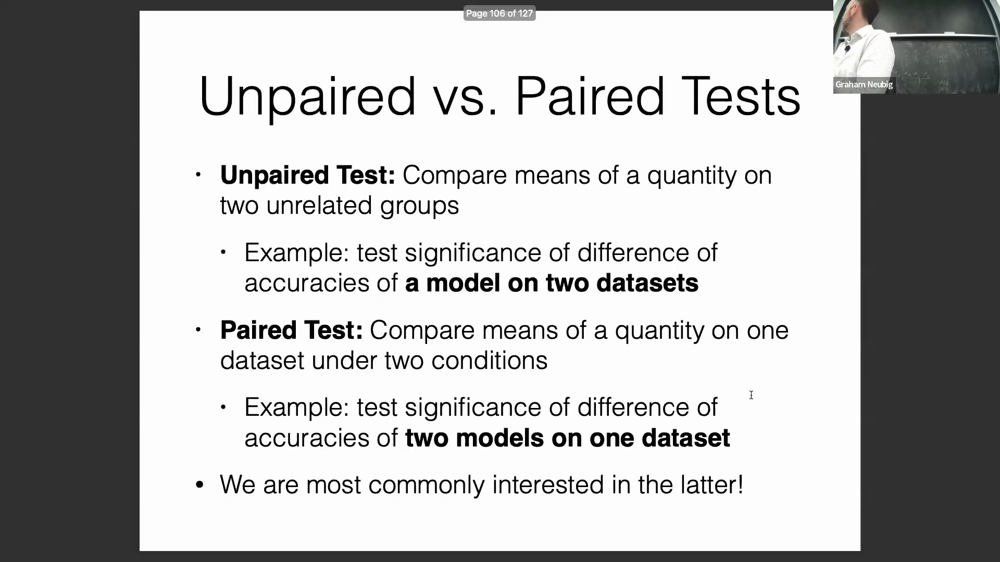

## 指标兼容性与检验方法选择
尽管传统参数检验（如学生t检验(Student's t-test)）在处理可加性指标(Additive Metrics)（例如准确率，其单个样本的正确或错误预测可直接求和并取平均）时计算效率较高，但在应对非可加性或复杂评估指标时则会从根本上失效。以F值(F-score)为例，该指标是对精确率(Precision)与召回率(Recall)进行调和平均计算，无法清晰拆解为独立的样本级贡献，这直接违背了参数检验的核心假设。在此类场景下，自助法重采样便成为不可或缺的工具。该方法通过直接估计经验抽样分布(Empirical Sampling Distribution)，绕开了复杂的解析数学推导，确保无论评估指标多么复杂或呈非线性，严谨的统计验证(Statistical Validation)依然可行且准确。
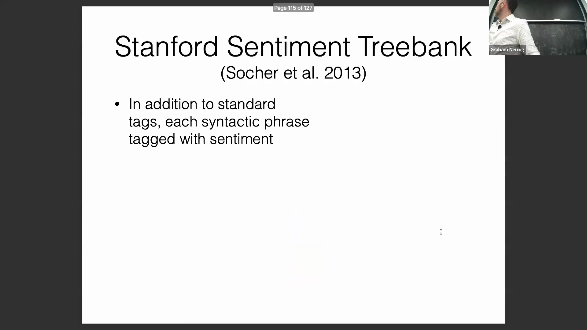
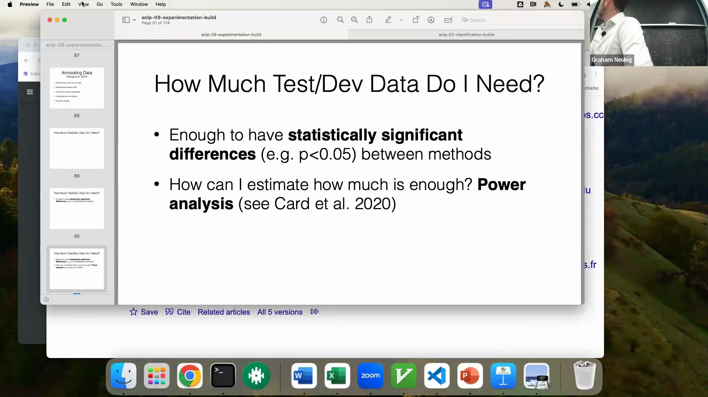

## 用于确定测试集规模的功效分析
在选定合适的检验方法后，研究者必须解决一个关键的实际问题：究竟需要多少标注测试数据(Annotated Test Data)？统计功效分析(Statistical Power Analysis)为此提供了严谨的数学框架。通过设定目标显著性阈值(Significance Threshold)（通常为 p < 0.05）、可接受的统计功效水平以及预估的效应量(Effect Size)（例如基线模型(Baseline Model)与新提出模型之间的预期性能差距），研究者即可精确计算出可靠检测出该差异所需的最小测试集规模。例如，若经验表明基线模型的预期准确率为90%，而新方法旨在实现微小但具有实际意义的性能提升，功效分析便能精确量化所需收集的测试样本数量。这种前瞻性规划能够有效避免因统计功效不足(Underpowered)而导致结论模糊的实验，同时通过规避不必要的大规模、高成本标注工作，实现计算与标注资源的最优配置。

---

## 通过统计功效分析(Statistical Power Analysis)确定数据集规模(Dataset Size)
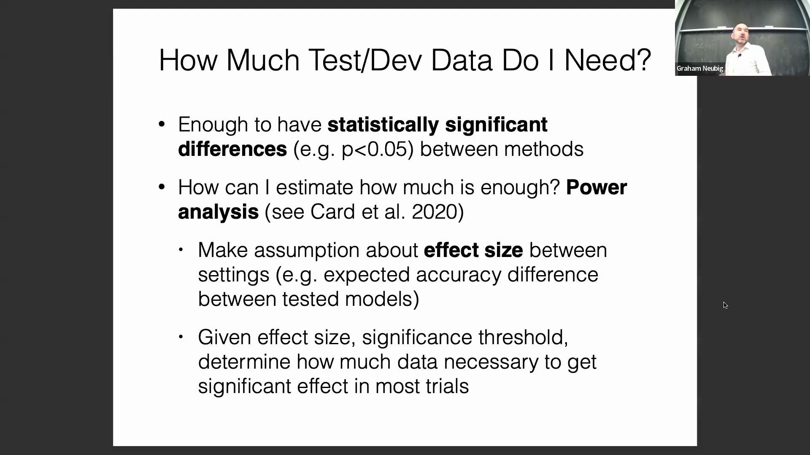
在评估模型性能时，仅凭直观观察数据是远远不够的。若我们预期模型准确率约为 93%，并希望以 0.05 的 $p$ 值(p-value) 阈值来确立统计显著性(Statistical Significance)，便可计算出所需的确切数据集规模(Dataset Size)。基于这些参数，我们可得出结论：至少需要 500 个训练样本和 500 个测试样本，才能可靠地区分准确率为 90% 与 93% 的两个模型。

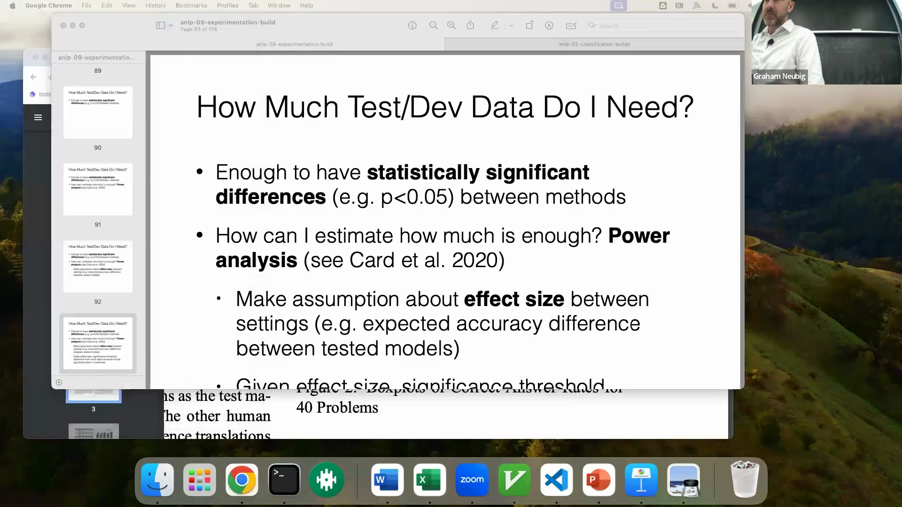
如相关文献所述，该底层算法的核心原理是对数据集进行重抽样(Resampling)，并计算预期效应量(Effect Size)及其对应的 $p$ 值。 随后，通过统计 $p$ 值低于预设阈值的频次，并结合效应方向(Direction of Effect)，即可计算出统计功效(Statistical Power)。  通过对不同数据集规模重复此过程，可系统性地确定获得统计显著结果所需的最小数据量。该方法为“数据集规模应设定为多大？”这一常见问题提供了严谨的统计学依据，并将直接应用于后续作业中关于数据集规模选择的论证。

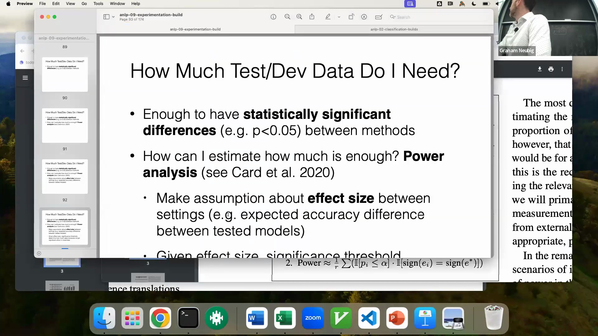

## 评估训练数据需求与现代提示技术(Prompting)
尽管在模型微调(Model Fine-tuning)过程中通常遵循“数据越多，效果越好”的原则，但具体需要多少训练数据并无定论。若当前模型性能未达预期，扩充数据集往往是有益的。然而，随着高性能预训练模型的崛起，零样本(Zero-shot)或少样本(Few-shot)提示技术通常无需任何微调即可展现出可观的性能。 因此，在特定应用场景下，所需的训练数据量实际上可能为零。最优策略取决于你对模型准确率的具体要求，以及你侧重于模型微调、提示词工程(Prompt Engineering)抑或其他技术路线。

## 策略性采样、数据覆盖与文档记录
为加速模型性能提升，可引入主动学习(Active Learning)策略，以智能筛选出兼具代表性与挑战性的数据点。在为微调进行数据采样(Data Sampling)时，确保对目标领域的全面覆盖至关重要，采样范围应涵盖多样化的语言变体(Language Variants)及用户群体特征。此外，强烈建议对数据收集全过程进行详尽记录。Bender 与 Friedman 在《自然语言处理数据声明》(Data Statements for NLP) 一文中提出的框架，为规范记录数据采集的动因与方法提供了重要指南。该实践现已得到广泛应用，并被整合至 Hugging Face 的数据集卡片(Dataset Cards)中，其中已包含大量面向实际行业应用的元数据(Metadata)。

## 制定标注指南与边界情况管理(Edge Cases)
无论是与人工标注员协作还是调用大语言模型(Large Language Model, LLM)，提供清晰详尽的说明都至关重要。首要且高效的一步是亲自试标。这种实践能迅速暴露出模糊的边界情况(Edge Cases)与判定边界，例如如何界定“非常积极”与“积极”的情感差异，或判定问答输出应采用简洁短语还是完整句子。历史上，详尽的标注指南（如 1995 年宾州树库(Penn Treebank)项目的规范）为每个类别制定了精确的规则与示例。有趣的是，这些传统指南与现代提示技术高度契合：其本质等同于零样本指令(Zero-shot Instruction)与少样本示例(Few-shot Examples)的结合。这表明，高效的标注工作始终依赖于清晰的上下文框架(Contextual Framework)。

## 招募标注人员与确保质量控制
对于小型项目，自行标注或招募亲友与同事（通常以餐饮招待作为酬劳）是一种切实可行的方案。针对规模更大或专业性更强的任务，Upwork 等平台可对接专业自由职业者。此类人员通常具备更强的责任心、职业素养与领域知识，但相应成本也较高。此外，Amazon Mechanical Turk 或 Prolific 等众包平台(Crowdsourcing Platforms)提供了高扩展性的解决方案，但必须辅以严格的质量控制机制。值得注意的是，当前大语言模型的输出质量已能达到甚至超越众多众包工作者的水平，且许多人工标注员已在实际工作中借助 AI 工具进行辅助。为规避风险，最佳实践是在全面铺开前开展小规模试点研究(Pilot Study)（如 20-50 个样本），以预先评估标注准确率与时效性。最后，学术研究人员需特别注意：涉及主观判断的标注任务通常须通过机构审查委员会(Institutional Review Board, IRB)的伦理审批，而纯客观任务（如统计文本中的动词数量）则一般无需此项批准。

---

## IRB 审查考量与标注质量评估
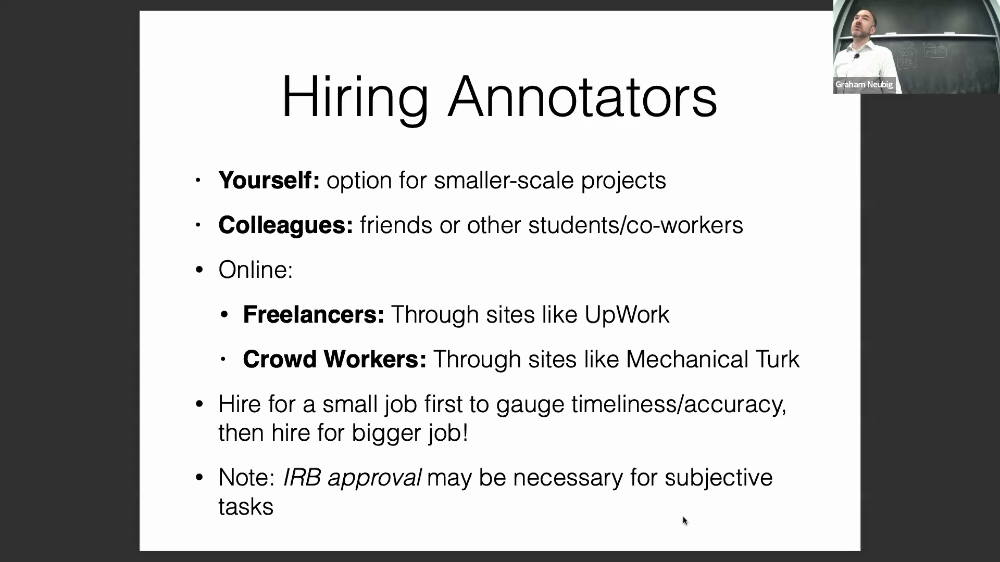
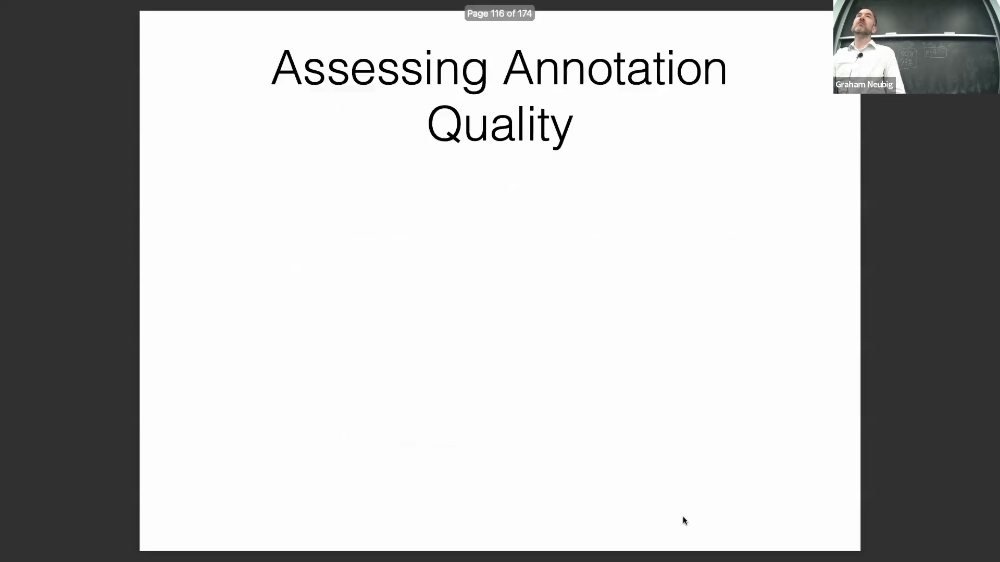
在开展学术研究时，具有明确答案的客观任务通常无需经过机构审查委员会(Institutional Review Board, IRB)的伦理审批，但对于涉及边界情况(Edge Cases)的任务仍需进行核实确认。为评估标注质量，一种行之有效的方法是对数据子集进行双人交叉标注(Dual Annotation)以衡量人工水平，并采用与评估模型完全一致的指标（例如机器翻译任务中的 BLEU 或 chrF 分数）。此举建立了一个可直接与模型输出对比的人工基线(Human Baseline)，有助于研究人员判断当前大语言模型是否已彻底“攻克”该数据集或任务。对于分类任务，科恩卡帕系数(Cohen's Kappa)等指标至关重要，因其能有效剔除随机一致性(Random Agreement)带来的干扰。在类别分布极度不平衡的数据集中，单纯依赖准确率(Accuracy)极易产生误导（例如模型倾向于始终预测多数类），而 Kappa 系数则能准确揭示标注员之间真实的一致性水平。若一致性得分持续偏低，则表明需进一步优化标注指南、重新培训标注人员，或从根本上重新评估该任务是否具备人工标注的可行性(Human Annotatability)（例如可靠地甄别虚假评论）。

## 实验的模块化工作流自动化
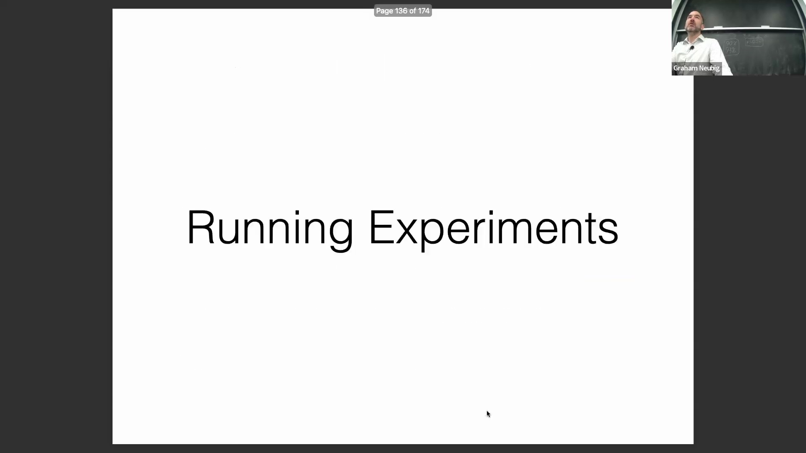
高效的实验设计高度依赖于工作流自动化(Workflow Automation)与模块化流水线架构(Modular Pipeline Architecture)。实验流程中的每个阶段（如数据筛选(Data Selection)、预处理(Preprocessing)、分词(Tokenization)、模型训练(Model Training)及评估(Evaluation)）均应被视为独立的模块，并具备明确定义的输入与输出目录。通过基于特定超参数(Hyperparameters)构建命名规范的文件夹结构（例如 `transformer_layer8_nod512_dropout0.5`），研究者可轻松追溯实验配置，并避免重复执行计算成本高昂的冗余步骤。评估脚本仅需加载既有的模型检查点(Model Checkpoints)，并将新生成的指标结果追加至日志文件。这种基于模块化检查点的方法既可通过 Python 从零实现（利用基础的文件存在性校验(File Existence Checks)逻辑），也可借助 `ducttape` 等专业工作流管理工具(Workflow Management Tools)进行配置，从而确保实验兼具高度的可重复性(Reproducibility)、严谨的组织结构以及卓越的算力效率。

## 结果报告与影响力规划策略
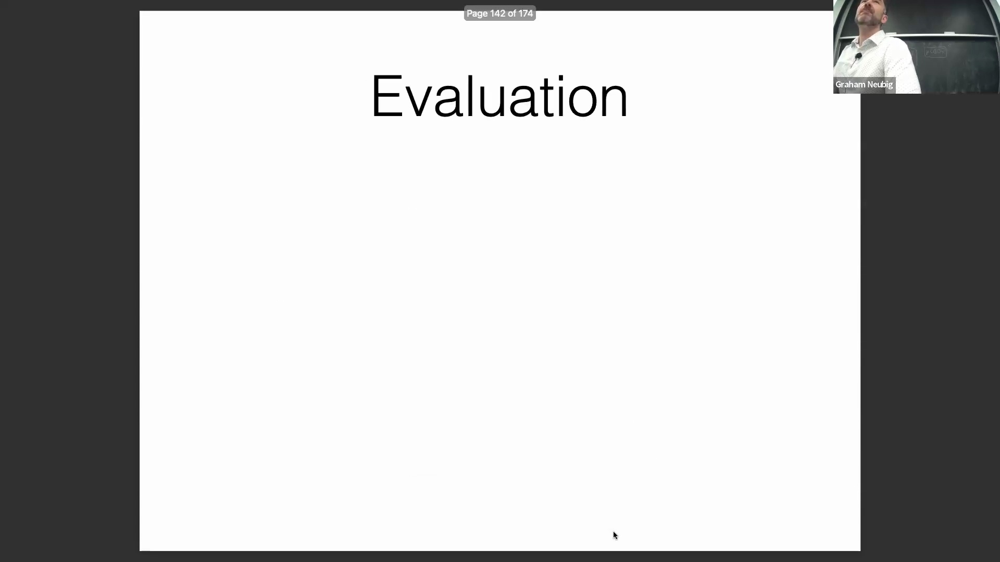
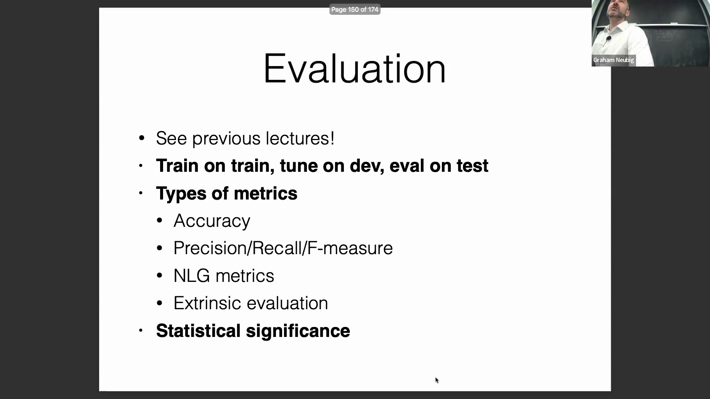
最大化研究影响力(Research Impact)的关键，在于在开展任何实验前便预先规划好结果报告(Result Reporting)部分。通过提前梳理拟提出的研究论断(Research Claims)，研究者可迅速识别出缺乏证据支撑的断言或实验设计中的逻辑漏洞。一项行之有效的思维训练是“假设所有实验均按预期完美运行”，这有助于从宏观视角勾勒项目的潜在学术贡献。明确三位真正能从该研究中获益的具体学者或行业从业者，深入分析其技术生态(Tech Ecosystem)（例如对 PyTorch 与 JAX 等深度学习框架的偏好），并明确他们若要采纳你的方法，需要哪些实验证据、基准测试(Benchmarks)或开源交付件(Open-source Artifacts)。这种以目标受众为中心的策略(Audience-Centric Strategy)不仅能反向指导实验设计，更能确保最终成文切实解决现实应用中的技术采纳壁垒(Technology Adoption Barriers)，从而产出更广泛的学术影响力。

## 自动化论文生成与进度追踪
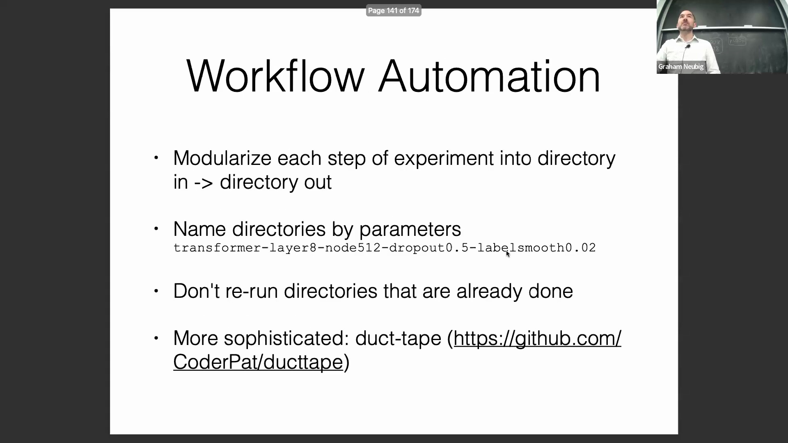
为简化结果报告流程，强烈建议直接从实验日志文件自动生成论文表格。此举可大幅降低手动复制粘贴引发的数据错漏风险，并节省繁琐的格式排版时间。更重要的是，该机制可作为动态项目路线图(Dynamic Project Roadmap)：通过编写脚本扫描结果输出目录，即可自动填充 LaTeX 表格。若某项实验尚未完结或对应数据目录缺失，脚本将自动在表格中填入 `TBD`（待定）等占位符。这提供了一份直观且实时更新的待办实验清单，使研究者能够系统化地追踪项目进度、科学排期剩余实验，并精准高效地推进论文定稿。

---

## 使用自动化表格追踪实验进度
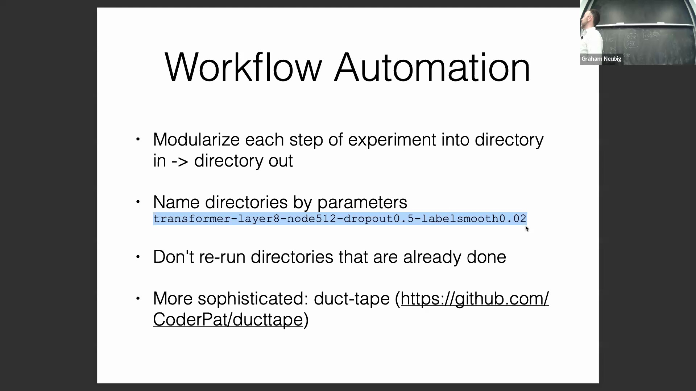
通过自动化脚本直接从日志文件(Log Files)填充结果表格，你可以立即识别出哪些实验仍处于运行或排队状态，并被标记为“TBD”（待定(To Be Determined)）。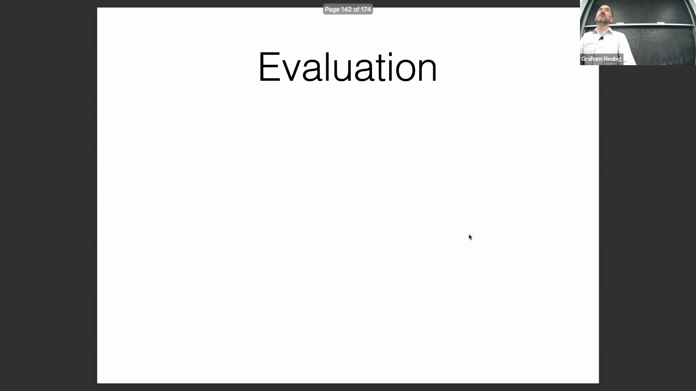 若某一实验条目长时间维持 TBD 状态，该机制将及时提醒你排查是否存在任务崩溃(Task Crash)或作业失败的情况，并评估是否需要重新执行该次运行(Re-run)。 这种系统化的追踪方法对于管理复杂的实验流水线(Experimental Pipeline)极为高效；当最后一个 TBD 占位符被实际结果成功替换时，将带来显著的项目推进成就感。

## 获取计算资源
针对所需的计算资源(Computing Resources)，多个云平台均可提供即时支持。AWS 教育积分(AWS Educate Credits)将在作业 1 截止日期后发放给学生。此外，研究者可借助 Google Cloud 与 Google Colab 等平台获取 GPU 等必要硬件，为模型训练(Model Training)与大规模实验提供灵活且具备高扩展性(Scalability)的计算环境。
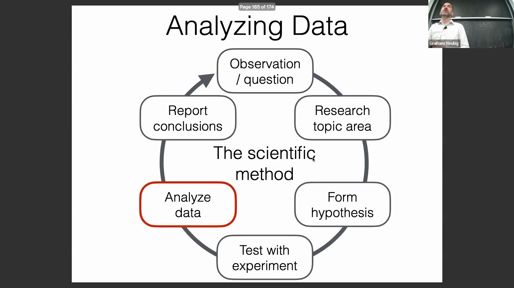

## 全面的数据分析策略
更深入且具技术性的数据分析方法，将在后续专门探讨模型解释(Model Interpretation)的课程中详细展开。该部分将深入讲授如何开展稳健的定量分析(Quantitative Analysis)与定性分析(Qualitative Analysis)，以及如何有效审查与利用模型解释结果。掌握这些分析技术对于突破表层性能指标(Surface-level Metrics)的局限，深入剖析模型行为(Model Behavior)与内在局限性(Intrinsic Limitations)至关重要。
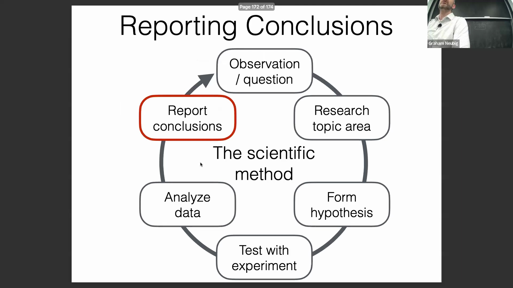

## 构建报告结构与得出结论
规范地呈现研究结果与执行实验本身同等重要。强烈建议参考关于学术论文结构(Academic Paper Structure)的讲座幻灯片。该资料提供了简明且具可操作性的指导（仅需约 20 分钟阅读），详细阐述了如何高效组织研究论点、呈现实验证据并推导严谨结论。将这些规范应用于作业 3 与作业 4（部分亦适用于作业 2），将显著提升最终报告的质量，确保研究成果以高度的学术严谨性(Academic Rigor)与清晰度进行呈现。
